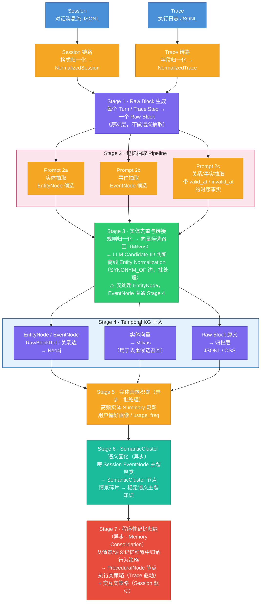
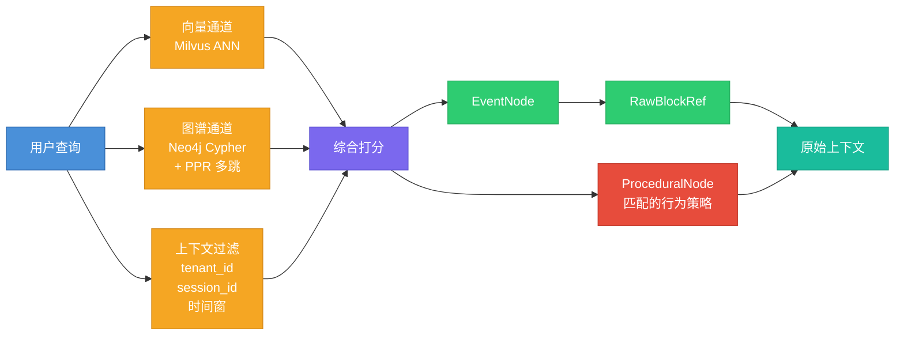
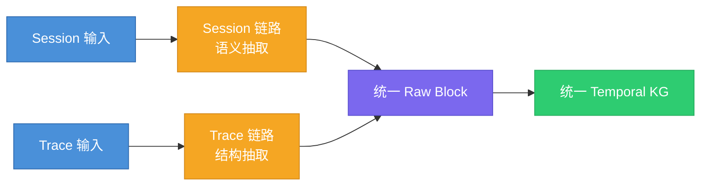
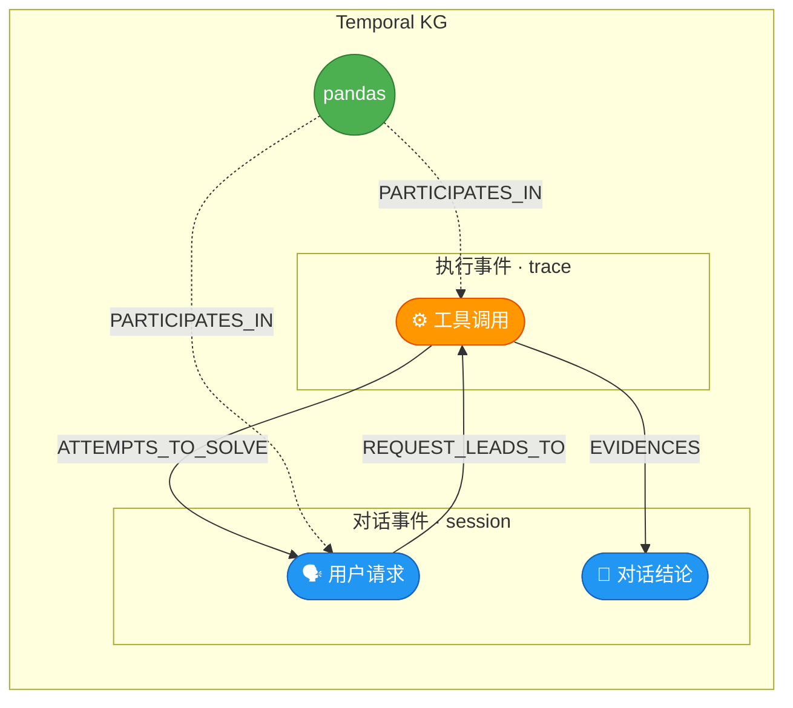

# AMS记忆系统方案设计

---
[[Agent 记忆系统深度调研对比（完整版）]]  
[[情景记忆、语义记忆、程序性记忆分类体系v2.0]]

## 第1章 系统定位与目标

### 1.1 输入源：Session 与 Trace
- 参考 [[Session和Trace数据源类型明细]]
本系统的输入来自 Agent 运行时产生的两类原始数据，它们是同一次交互过程的两种观察视角：

| 视角    | Session            | Trace                         |
| ----- | ------------------ | ----------------------------- |
| 观察的是  | 用户与 Agent **说了什么** | Agent 内部**做了什么**              |
| 组织中心  | 对话时间线（turn-based）  | 执行树（span / step-based）        |
| 典型内容  | 意图、问题、约束、决策、指代     | 工具调用、状态、latency、artifact、错误重试 |
| 更适合回答 | "用户想做什么？意图如何演化？"   | "系统实际执行了什么？哪步成功/失败？"          |
| 语义密度  | 高（自然语言）            | 低（系统日志）                       |

两者的层级关系如下：

```
1 Session（一次任务会话）
  └── N 个 Turn（多轮对话）
        └── 每个 Turn 背后有 1/N 个 Trace
              └── 每个 Trace 有 N 个 Step（工具调用链）
```

Session 告诉你"用户要读 Excel 文件"，Trace 告诉你"python_executor 调用了 read_excel，耗时 420ms，成功返回"。两者缺一不可，各自承载不同维度的记忆原料。

**为什么不能合并为一条链路处理**：Session 的核心难点在语义（指代消解、意图变化识别、会话边界切分），Trace 的核心难点在结构（字段异构、执行链重建、错误/重试识别）。混合处理会让 pipeline 变得脆弱——要么过度裁剪 Trace 的结构信息，要么让 Session 处理逻辑承担不该有的负担。

### 1.2 产出目标：情景记忆、语义记忆与程序性记忆
#### 1.2.1 认知科学基础

AMS 的记忆分类直接映射人类认知心理学的经典模型。以下是完整的概念映射表：

| **维度** | **记忆类型**                        | **归属/等价关系**                                    | **在 Agent 中的定义与实现**                                 |
| ------ | ------------------------------- | ---------------------------------------------- | --------------------------------------------------- |
| 基础类别   | **Procedural Memory**（程序性记忆）    | 与 Declarative Memory 相互独立                      | **行为策略型记忆**。在 Agent 中表现为从历史执行记录中归纳出的可执行行为策略（如任务执行最优路径、回复格式规范、用户约定规则） |
| 高层概念   | **Declarative Memory**（陈述性记忆）   | 等价于 Factual Memory                             | **事实型记忆**。可以被显式表达、检索和描述的知识                          |
| 陈述性子类型 | **Semantic Memory**（语义记忆）       | Declarative Memory 的子集                         | **通用知识**。独立于时间/空间的事实（如"法国的首都是巴黎"）。Agent 的训练语料主要属于此类 |
| 陈述性子类型 | **Episodic Memory**（情景记忆）       | Declarative Memory 的子集；等价于 Experiential Memory | **自传式记忆**。包含时空上下文的特定事件（如"Agent 昨天下午与用户A讨论了天气"）      |
| 功能扩展   | **Metacognitive Memory**（元认知记忆） | 独立维度（Memory about Memory）                      | **自反式循环**。Agent 对自身认知边界的意识（如"我知道我不具备这个信息"或评估任务复杂度）  |

本系统产出三类长期记忆：**陈述性记忆（Declarative Memory）** 和 **程序性记忆（Procedural Memory）**。陈述性记忆包含情景记忆和语义记忆两个子类型，程序性记忆是从前两者的积累中归纳产生的行为策略。
####  1.2.2 情景记忆（Episodic Memory）

对**特定事件**的有时间戳的回忆。它回答的问题是：

- 上次那个 CSV 列类型问题发生在哪个会话？
- read_excel 这次调用之前发生了什么？
- 某个报错是在对话哪个阶段提出来的？

情景记忆的载体是 **EventNode**（事件节点）和 **RawBlockRef**（原始证据引用）。EventNode 是时序链的基本单元，每个事件有明确的发生时间、参与者和来源证据。参考：[[1. EventNode抽象的必要性]]

#### 1.2.3 语义记忆（Semantic Memory）

对**实体、概念、关系**的跨会话稳定认知。它回答的问题是：

- 这个用户常用哪些工具？
- pandas 和 read_excel 之间是什么关系？
- "那个库"在这个用户的上下文中通常指什么？

语义记忆的载体是 **EntityNode**（实体节点）和 **SemanticCluster**（语义主题群节点）。EntityNode 跨会话可归一，是连接不同情景的持久对象；SemanticCluster 是多个**知识碎片**聚类后固化的主题知识。

#### 1.2.4 程序性记忆（Procedural Memory）

对 **Agent 应该怎么做** 的归纳性行为策略。它回答的问题是：

- 处理 CSV 类型识别问题时，哪种工具调用顺序成功率最高？
- 回复这个用户的编程问题时，应该代码置顶还是解释置顶？
- 用户明确约定了哪些必须遵守的规则（如"周五下午不排会议"）？

程序性记忆与前两类记忆有本质区别：

| 对比维度 | 情景记忆 / 语义记忆 | 程序性记忆 |
|---------|-----------------|----------|
| 性质 | **描述性**（descriptive）——记录发生了什么、知道什么 | **规范性**（prescriptive）——指导 Agent 怎么行动 |
| 产生方式 | 直接从 Raw Block 抽取 | **二阶归纳**——从情景/语义记忆的积累中归纳产生 |
| 时间属性 | 有时间戳（情景）或有时效窗（语义） | 无时间戳，是抽象策略 |
| 写入时机 | 实时（随 Raw Block 处理） | 延迟（满足触发条件后异步归纳） |

程序性记忆的载体是 **ProceduralNode**（策略节点）。每个 ProceduralNode 描述一条可执行的行为策略，携带触发条件、策略内容、历史成功率和证据来源。

**程序性记忆的两类来源**：

- **执行类策略**（任务执行最优路径、工作流 SOP、兜底策略）：主要从 **Trace** 中归纳。因为执行策略必须锚定到真实发生的执行记录——有 status=success/failure、有工具调用链、有 latency。Session 中讨论的方案如果没有实际执行过，不能固化为执行策略。
- **交互类策略**（回复格式规范、推荐策略、用户约定规则）：主要从 **Session** 中归纳。因为用户对输出格式的偏好、协商达成的规则，这些信号只存在于对话中，Trace 里看不到用户的满意度反馈。

> [!note] 程序性记忆不是"规则引擎"
> 程序性记忆描述的是 Agent 从经验中学到的**软策略**，不是硬编码的业务规则。它有置信度、有成功率、会随新证据演化甚至被淘汰——本质上是一种可进化的经验沉淀。

参考：[[情景记忆、语义记忆、程序性记忆分类体系v2.0]]

#### 1.2.5 三类记忆的分工关系

*借鉴 HippoRAG（arXiv 2405.14831）的海马体记忆索引理论，并扩展程序性记忆维度：*

| 记忆层                | 本系统对应                              | 存储位置        | 核心功能            | 回答的核心问题 |
| ------------------ | ---------------------------------- | ----------- | --------------- | ----------- |
| **情景记忆**（具体的事件上下文） | EventNode + RawBlockRef            | Neo4j + 归档层 | 时序链构建、证据溯源、事件回溯 | 发生了什么？ |
| **语义记忆**（稳定的实体知识）  | EntityNode + 关系边 + SemanticCluster | Neo4j       | 实体归一、关系推理、主题聚类  | 知道什么？ |
| **程序性记忆**（归纳的行为策略） | ProceduralNode                     | Neo4j       | 策略匹配、执行指导、经验复用  | 应该怎么做？ |

三者不是替代关系，而是**层级递进的分工**：
- **情景记忆**是原始素材——记录每一次具体发生了什么
- **语义记忆**是知识沉淀——从情景中提炼出稳定的实体和关系
- **程序性记忆**是行为指南——从情景和语义的积累中归纳出可执行的策略

检索时的协同：
- 用语义记忆（EntityNode）做**语义索引**——定位"我在找什么"
- 用情景记忆（EventNode → RawBlockRef）做**细节还原**——"当时具体发生了什么"
- 用程序性记忆（ProceduralNode）做**行为决策**——"这种情况下应该怎么做"

### 1.3 核心能力目标

#### 1.3.1 What
本系统构建完成后，应能稳定回答以下类型的问题：

**类型 1：实体查询** — 用户用过什么？什么时候用的？
> 场景：用户在新会话中再次提到 pandas，Agent 需要快速了解该用户与 pandas 的历史交互深度，以决定回复的详细程度。
> 查询："pandas 这个库，用户在哪些会话中用过？最近一次是什么时候？当时配合了哪些参数（dtype / parse_dates）？遇到过什么问题？"

**类型 2：路径查询** — 两个概念之间有什么隐含关联？
> 场景：用户提到了 read_excel，但历史会话中从未直接讨论过它。Agent 需要判断这个新概念和用户已有知识之间是否存在关联路径。
> 查询："read_csv 和 read_excel 之间在图谱中存在什么路径？中间经过了哪些实体？每一跳的关系是什么？"

**类型 3：时间线重建** — 那次对话中到底发生了什么？
> 场景：用户说"上次那个 CSV 问题后来怎么样了"，Agent 需要还原完整经过。
> 查询："3月28日那次会话中，问题是怎么从'CSV列类型识别错误'演化到'dtype修复成功但日期列仍有问题'的？中间经历了哪些步骤？"

**类型 4：因果追溯** — 用户的请求触发了什么执行？结果如何？
> 场景：Agent 需要复盘一次工具调用链，判断是哪步出了问题。
> 查询："用户报告'CSV列类型识别有问题'后，Agent 内部调用了哪个执行器？传了什么参数？执行成功还是失败？执行结果与最终给用户的建议之间有什么证据关系？"

**类型 5：跨会话指代解析** — "上次那个"指的是什么？
> 场景：用户在新会话中说"上次那个问题，我换了读取方式，Excel 也没问题了"，Agent 需要理解指代。
> 查询："'上次那个问题'指的是哪个会话的哪个事件？'换了读取方式'对应哪个技术方案的变更？"

**类型 6：语义联想** — 历史上有没有类似的情况？
> 场景：用户遇到 Polars 读取 Parquet 文件的类型问题，Agent 需要举一反三。
> 查询："和'数据文件读取时的类型识别问题'语义相关的历史情节有哪些？之前用 pandas 处理 CSV 时的解决方案是否可以借鉴？"

**类型 7：执行策略查询** — 这种任务应该怎么做最有效？
> 场景：用户再次遇到 CSV 类型识别问题，Agent 不需要从头试错，而是直接调用历史上验证过的最优执行路径。
> 查询："处理 CSV 类型识别问题时，历史上最有效的工具调用顺序是什么？成功率多少？有没有需要避免的方式？"

**类型 8：行为规范查询** — 这个用户有什么需要遵守的约定？
> 场景：新会话开始时，Agent 需要快速加载该用户的所有行为约定，避免重复犯错。
> 查询："这个用户约定过哪些规则？回复编程问题应该用什么格式？推荐依赖库时有什么限制？"

#### 1.3.2 Why
那为什么需要回答这些类型的问题呢？

这些问题类型本质上是在定义这个记忆系统的**能力验收标准**——它们回答的是"建好这个系统后，能用来干什么？"

逐一来看每种类型存在的必要性：

**类型 1（实体查询）** 和 **类型 2（路径查询）** — 这是**语义记忆**的核心能力。Agent 需要知道用户的知识图谱长什么样：用过什么技术、这些技术之间有什么关联。这样才能在新对话中做**个性化推荐和上下文补全**。

**类型 3（时间线重建）** 和 **类型 4（因果追溯）** — 这是**情景记忆**的核心能力。Agent 需要能回溯"某次对话中到底发生了什么"，包括问题是怎么演进的、哪些步骤成功/失败。这对于**调试、复盘、从经验中学习**至关重要。

**类型 5（跨会话指代解析）** — 这是两种记忆**协同工作**的场景。用户说"上次那个问题"，Agent 需要先从**情景记忆**中定位到具体会话和事件，再从**语义记忆**中理解上下文。这是**对话连续性**的关键。

**类型 6（语义联想）** — 这是**检索增强**的基础。当用户遇到新问题时，系统能找到历史上语义相似的情节，帮助 Agent 举一反三。

**类型 7（执行策略查询）** 和 **类型 8（行为规范查询）** — 这是**程序性记忆**的核心能力。Agent 不应该每次都从头试错，而应该从历史执行记录中学习最优路径（类型 7），从用户的多次反馈和约定中固化行为规范（类型 8）。这两类能力让 Agent 从"有记忆的助手"进化为"会学习的助手"。

简单说，这八类问题覆盖了一个记忆系统的**五种核心用途**：

| 用途                 | 问题类型                   | 举例                                                    |
| ------------------ | ---------------------- | ----------------------------------------------------- |
| **知道用户是谁**（用户画像）   | 1. 实体查询<br>2. 路径查询     | "pandas 用户用过哪些功能？" / "read_csv 和 read_excel 之间有什么关联？" |
| **记得发生过什么**（经验回溯）  | 3. 时间线重建<br>4. 因果追溯    | "那次对话中问题怎么从 CSV 类型错误演化到 dtype 修复的？"                   |
| **理解用户在说什么**（指代消歧） | 5. 跨会话指代解析             | "'上次那个问题'指的是哪个事件？"                                    |
| **联想相关经验**（检索增强）   | 6. 语义联想                | "历史上有没有类似的数据文件类型识别问题？"                                |
| **知道应该怎么做**（行为决策）  | 7. 执行策略查询<br>8. 行为规范查询 | "处理 CSV 类型问题最有效的方式是什么？" / "这个用户的回复格式约定是什么？"           |

==所以这些不是随意列举的，而是从"Agent 要像一个有记忆、会学习的助手一样工作"这个目标反推出来的**最小能力集合**。==
### 1.4 系统边界

**包含**：
1. Session / Trace → Raw Block 的输入适配与归一化
2. 实体、事件、关系抽取（混合抽取 Pipeline）
3. **实体去重与跨会话链接**
4. Temporal KG 写入与增量更新
5. **实体画像积累**
6. SemanticCluster 语义固化
7. **程序性记忆归纳**（Memory Consolidation：从情景/语义记忆中归纳行为策略）
8. 混合检索层（向量 + 图遍历 + PPR 多跳）
9. **遗忘机制**（时效衰减 + 置信度过期 + 显式覆盖 + 策略淘汰）

**不包含**：
1. Agent 框架本身的设计与实现
2. Working Memory（上下文窗口管理）
3. 知识库（静态文档 / 源代码）的构建
4. 生产级多租户权限治理与计费

---

## 第2章 整体架构

### 2.1 全系统数据流
#### 构建流程
- 从原始数据输入到知识图谱写入和语义固化的完整 pipeline




#### 检索流程
- 从用户查询到三路召回、融合打分、最终返回原始上下文的过程




### 2.2 分层架构说明

| 层次        | 职责                             | 执行方式      |
| --------- | ------------------------------ | --------- |
| **输入适配层** | Session/Trace 归一化，Raw Block 生成 | 流式或批量，同步  |
| **抽取层**   | 实体/事件/关系抽取（混合 Pipeline），实体去重     | 异步流水线     |
| **图谱存储层** | Temporal KG 写入，增量 Upsert，冲突处理  | 事务写入      |
| **画像层**   | 实体 Summary 更新，用户偏好积累           | 异步批处理     |
| **语义固化层** | SemanticCluster 构建与维护          | 定时触发或阈值触发 |
| **归纳层**   | 程序性记忆归纳（Memory Consolidation），从情景/语义记忆中产出 ProceduralNode | 异步，事件驱动或定时触发 |
| **遗忘层**   | 时效衰减，低置信过期，显式覆盖，策略淘汰            | 定时任务      |
| **检索层**   | 混合检索，PPR 多跳，证据溯源               | 同步查询服务    |

### 2.3 "前分后合"双链路策略

本系统对 Session 和 Trace 采用**前端分离处理、后端融合到同一张 Temporal KG** 的策略：



这张图清晰地表达了三个层次：

1. **前端分离** — Session 和 Trace 两条独立的输入链路
2. **各自抽取** — Session 走语义抽取，Trace 走结构抽取
3. **后端融合** — 两条链路汇聚到统一 Raw Block，最终写入同一张 Temporal KG

写入同一张 Temporal KG 后，所有节点在物理上就是一张图。但因为来源不同，事件节点天然形成两个族群：Session 链路产生的**对话事件**（如用户请求、对话结论）和 Trace 链路产生的**执行事件**（如工具调用）。
- **对话事件**（source_type=session）：user_request、problem、decision、solution
- **执行事件**（source_type=agent_trace）：tool_use、tool_result、artifact_create

EntityNode 归一后天然跨族群——同一个实体 `pandas` 不管从哪条链路抽出，都指向同一个节点，是天然的粘合剂。但 EventNode 是一次性的，对话事件和执行事件之间的因果关系需要显式的边来表达：

- `REQUEST_LEADS_TO`：对话事件（用户请求）→ 执行事件（工具调用）
- `ATTEMPTS_TO_SOLVE`：执行事件 → 对话事件（尝试解决某个问题）
- `EVIDENCES`：执行事件的结果 → 对话事件（为某个结论提供证据）



> EntityNode 是天然的粘合剂；因果边负责连接不同来源的 EventNode。

这样既保留了各自的信号特征，又实现了跨来源的连续性建模。
### 2.4 三类存储的职责分工

| 存储                 | 职责                                   | 核心数据                                                         |
| ------------------ | ------------------------------------ | ------------------------------------------------------------ |
| **Neo4j**          | Temporal KG 主存储：关系、路径、**时序**、**溯源**  | EntityNode / EventNode / RawBlockRef / SemanticCluster / ProceduralNode / 关系边 |
| **Milvus**         | 向量索引：实体相似候选召回，辅助去重与检索                | 实体 embedding / SemanticCluster embedding                     |
| **归档层（JSONL/OSS）** | 原始内容持久化：Raw Block 原文、LLM 调用记录、抽取中间结果 | raw_blocks / extracted / dedup / debug                       |

三者关系：Neo4j 是记忆的**骨架**，Milvus 是记忆的**语义索引**，归档层是记忆的**原料仓库**。


---

## 第3章 数据模型（Graph Schema）

### 3.1 核心节点类型

#### EntityNode — 语义记忆的持久对象

跨会话可归一的稳定实体，如工具、库、概念、用户、组织。是语义记忆的基本单元。

```cypher
(:EntityNode {
  entity_id:        "ent_acmecorp_01JQXXXXXX",   // 统一 ID：{prefix}_{tenant}_{ulid}
  tenant_id:        "acmecorp",
  name:             "pandas",                      // 标准名称（归一化后）
  entity_type:      "TOOL",                        // TOOL / CONCEPT / RESOURCE / PERSON / ORG / ACTION
  aliases:          ["pd", "Pandas"],              // 已识别的别名列表
  summary:          "Python 数据处理库，用户频繁用于 CSV/Excel 读写",  // 自动更新的摘要
  usage_freq:       12,                            // 被引用次数（画像积累）
  profile_hints:    ["data_processing", "file_io"],// 用于检索个性化排序的标签
  first_seen_at:    datetime("2026-03-28T14:32:00Z"),
  last_seen_at:     datetime("2026-03-31T09:15:00Z"),
  source_block_ids: ["blk_acmecorp_01...", "blk_acmecorp_02..."],  // 最近 50 次热引用缓存（完整溯源走 MENTIONED_IN 边）
  created_at:       datetime(),
  updated_at:       datetime()
})
```
- 参考 [[EntityNode中时间字段的应用场景]]

**实体类型定义**（控制在 6 类，避免过度细分）：
- 参考 [[EntityNode类型定义方法论思考]]

| 类型         | 说明              | 示例                                  |
| ---------- | --------------- | ----------------------------------- |
| `TOOL`     | 工具、库、框架、API、执行器 | pandas, read_excel, python_executor |
| `CONCEPT`  | 技术概念、方法、参数、算法   | dtype, CSV解析, 数据清洗                  |
| `RESOURCE` | 文件、数据集、制品、URL   | data.csv, output.xlsx               |
| `PERSON`   | 用户、角色、Agent 实例  | 用户, Alice, agent_v2                 |
| `ORG`      | 组织、系统、服务、团队     | Acme Corp, DataPlatform             |
| `ACTION`   | 关键动作/任务（需关联参与者） | 读取Excel, 排查报错                       |

#### EventNode — 情景记忆的时序单元

**有时间、有参与者、有状态的瞬时事件**。是时序链的节点，也是 Session/Trace 桥接的锚点。

```cypher
(:EventNode {
  event_id:                   "evt_acmecorp_01JQXXXXXX",
  tenant_id:                  "acmecorp",
  event_type:                 "tool_use",    // 见事件类型定义
  summary:                    "python_executor 调用 read_excel 读取 data.xlsx",  // 一句话事件描述，≤80字
  event_time:                 datetime("2026-03-31T09:15:20Z"),  // null 表示时间不确定
  time_resolution_confidence: 0.95,          // 时间置信度 0-1（见第5章时间处理规则）
  confidence:                 0.90,          // 事件抽取置信度
  session_id:                 "sess_acmecorp_01B",
  semantic_cluster_id:        null,          // 语义固化后填入（Stage 6）
  source_block_id:            "blk_acmecorp_01B_S1",  // 必填，溯源到 Raw Block
  source_type:                "agent_trace", // session / agent_trace
  created_at:                 datetime()
})
```

**事件类型定义**（控制在 7 类）：

- 参考：[[EventNode 类型定义方法论思考]]

| 类型                | 适用来源    | 说明             |
| ----------------- | ------- | -------------- |
| `user_request`    | Session | 用户提出需求或问题      |
| `decision`        | Session | 用户或 Agent 做出决策 |
| `problem`         | Session | 出现问题/报错        |
| `solution`        | Session | 问题被解决，方案被确认    |
| `tool_use`        | Trace   | 工具被调用          |
| `tool_result`     | Trace   | 工具返回结果（成功/失败）  |
| `artifact_create` | Trace   | 产生了关键制品/文件/输出  |

> [!note] 为什么需要 EventNode 这一抽象  
> 如果只用"实体 + 关系"建模，会丢失三类关键信息：
>    ①事件的**发生顺序**（时序链没有挂载点）；
>    ②**多参与者**的同时关联（边只能连两个节点）；
>    ③**证据归属**（confidence 和 source_block_id 无法挂在边上）。
>    
>    EventNode 把"一次发生"变成图谱里的一等公民，解决了上述三个问题。【参考】[[1. EventNode抽象的必要性]]

#### RawBlockRef — 情景记忆的证据锚点

轻量溯源节点，指向原始 Raw Block，不存全文内容（内容在归档层）。

```cypher
(:RawBlockRef {
  block_id:    "blk_acmecorp_01A_T1",
  tenant_id:   "acmecorp",
  source_type: "session",            // session / agent_trace
  source_uri:  "session://sess_acmecorp_01A/turn/1",
  timestamp:   datetime("2026-03-28T14:32:05Z"),
  session_id:  "sess_acmecorp_01A"
})
```

#### SemanticCluster — 语义固化的主题知识节点

对多个 EventNode 做主题聚类后生成的语义摘要节点，**对应 EverMemOS 中的 MemScene 概念**。

```cypher
(:SemanticCluster {
  cluster_id:   "cls_acmecorp_01JQXXXXXX",
  tenant_id:    "acmecorp",
  theme:        "pandas 数据文件读写问题排查",
  summary:      "用户在多个会话中处理 pandas 读取 CSV/Excel 的类型识别和日期解析问题，...",
  period_start: datetime("2026-03-28T00:00:00Z"),
  period_end:   datetime("2026-03-31T23:59:59Z"),
  event_count:  9,
  embedding:    [1536维向量],        // 用于语义相似召回
  created_at:   datetime(),
  updated_at:   datetime()
})
```

#### ProceduralNode — 程序性记忆的行为策略节点

从情景记忆和语义记忆的积累中**归纳产生**的可执行行为策略。与前四类节点不同，ProceduralNode 不由 Raw Block 直接抽取，而是由 Memory Consolidation 模块在满足触发条件后异步生成。

```cypher
(:ProceduralNode {
  pm_id:              "pm_acmecorp_01JQXXXXXX",   // 统一 ID：{prefix}_{tenant}_{ulid}
  tenant_id:          "acmecorp",
  pm_type:            "task_execution",            // 策略类型（见下表）
  trigger_condition:  "task_type = 'csv_type_fix' AND tool = 'pandas'",  // 触发条件描述
  strategy_desc:      "优先使用 dtype 参数指定列类型，若无效则尝试 converters 回调函数",  // 策略内容
  avoid_desc:         "避免全量 astype 转换，易丢失精度",  // 应避免的做法（可选）
  confidence:         0.85,                        // 归纳置信度
  success_rate:       0.82,                        // 历史成功率（执行类策略特有）
  evidence_count:     5,                           // 支撑的情景事件数量
  source_event_ids:   ["evt_01...", "evt_02..."],  // 归纳来源的 EventNode 列表
  source_type:        "trace",                     // 主要归纳来源：trace / session / mixed
  superseded_by:      null,                        // 被更优策略替代时填入新 pm_id
  created_at:         datetime(),
  updated_at:         datetime()
})
```

**策略类型定义**（8 类，参考 [[情景记忆、语义记忆、程序性记忆分类体系v2.0]] PM 分类）：

| 类型 | pm_type | 主要来源 | 说明 |
|------|---------|---------|------|
| PM-01 | `response_strategy` | Session | 针对特定意图/场景的回复格式、语气规范 |
| PM-02 | `recommend_strategy` | Session | 特定用户/场景下的推荐接受/拒绝模式 |
| PM-03 | `task_execution` | Trace | 执行特定类型任务时的最优方式 |
| PM-04 | `clarify_strategy` | Session | 遇到模糊输入时的澄清策略 |
| PM-05 | `fallback_strategy` | Trace + Session | 失败/拒绝/冲突时的降级处理方式 |
| PM-06 | `user_rule` | Session | 用户通过协商显式确立的行为规则 |
| PM-07 | `system_policy` | Session | 系统/业务层面的约束规则 |
| PM-08 | `sop_workflow` | Trace | 复杂任务类型的标准执行流程 |

> [!note] 执行类 vs 交互类策略的证据链差异
> **执行类策略**（PM-03/05/08）的 `source_event_ids` 必须包含 Trace 来源的 EventNode（tool_use / tool_result），确保策略锚定到真实执行记录。
> **交互类策略**（PM-01/02/04/06/07）的 `source_event_ids` 主要是 Session 来源的 EventNode（user_request / decision），来自用户反馈和协商。

### 3.2 完整边类型目录
- 参考：[[Temporal-KG-边类型定义的方法论思考]]
#### A. 实体关系边（EntityNode ↔ EntityNode）

带时间有效性的事实关系，是语义记忆的核心内容。

| 边类型          | 说明              | 示例                                 |
| ------------ | --------------- | ---------------------------------- |
| `USES`       | 实体使用工具/库        | 用户 USES pandas                     |
| `INVOKES`    | 工具调用子方法/API     | python_executor INVOKES read_excel |
| `PRODUCES`   | 产生制品/输出         | tool_use PRODUCES output.xlsx      |
| `MENTIONS`   | 会话中被提及          | 用户 MENTIONS data.csv               |
| `RELATES_TO` | 通用语义关联          | pandas RELATES_TO CSV解析            |
| `CAUSED_BY`  | 因果关系（有明确证据时）    | solution CAUSED_BY tool_result     |
| `SYNONYM_OF` | 语义相近但表面不同（离线生成） | 分布式追踪 SYNONYM_OF 链路追踪              |

所有实体关系边携带时间有效性字段：
```
{
  fact_text:          "用户使用 pandas 处理 CSV 格式数据",
  valid_at:           datetime("2026-03-28"),
  invalid_at:         null,           // 已知失效时间，null 表示仍有效
  superseded_at:      null,           // 被新事实覆盖时填写
  validity_reasoning: "Active in current session, may change to other formats",
  confidence:         0.88,
  source_block_id:    "blk_acmecorp_01A_T1"
}
```

#### B. 事件时序边（EventNode → EventNode）

| 边类型 | 方向 | 说明 |
|--------|------|------|
| `PRECEDES` | A → B | A 在时序上先于 B（主持久化边） |

> 只持久化 `PRECEDES`，`FOLLOWS` 为查询视角的派生关系，不重复写入，避免双写一致性问题。

#### C. 参与与溯源边

| 边类型               | 连接                       | 说明                                                            |
| ----------------- | ------------------------ | ------------------------------------------------------------- |
| `PARTICIPATES_IN` | EntityNode → EventNode   | 实体参与了某个事件，携带 `role` 字段（tool/subject/object）                   |
| `DERIVED_FROM`    | EventNode → RawBlockRef  | 事件溯源到原始 block（必填）                                             |
| `MENTIONED_IN`    | EntityNode → RawBlockRef | 实体在哪些 block 中被提及。用于替代节点上的 `source_block_ids` 大数组，实现无限增长的细粒度溯源 |

#### D. Session-Trace 桥接边（EventNode → EventNode，跨来源）

| 边类型 | 说明 |
|--------|------|
| `REQUEST_LEADS_TO` | 对话事件（用户请求）触发了执行事件（工具调用） |
| `ATTEMPTS_TO_SOLVE` | 执行事件尝试解决某个对话事件中的问题 |
| `EVIDENCES` | 执行事件的结果为某个对话结论提供了证据 |

#### E. 语义固化边（SemanticCluster 相关）

| 边类型 | 连接 | 说明 |
|--------|------|------|
| `AGGREGATES` | SemanticCluster → EventNode | Cluster 聚合了哪些事件 |
| `REPRESENTS` | SemanticCluster → EntityNode | Cluster 代表的核心实体/主题 |

#### F. 程序性记忆边（ProceduralNode 相关）

| 边类型 | 连接 | 说明 |
|--------|------|------|
| `DERIVED_FROM_PATTERN` | ProceduralNode → EventNode | 策略归纳的证据来源，指向支撑该策略的具体事件 |
| `APPLIES_TO` | ProceduralNode → EntityNode | 策略适用的实体/工具/场景（如"适用于 pandas 的 CSV 处理"） |
| `SUPERSEDES_STRATEGY` | ProceduralNode → ProceduralNode | 新策略替代旧策略（策略演化链，类似实体关系边的 superseded_at） |

`DERIVED_FROM_PATTERN` 携带 `contribution` 字段（FLOAT, 0-1），表示该事件对策略归纳的贡献度。`APPLIES_TO` 携带 `relevance` 字段（FLOAT），表示策略与该实体的关联强度。`SUPERSEDES_STRATEGY` 携带 `reason` 字段（STRING），记录替代原因。

### 3.3 完整 Cypher Schema

> 以下 Schema 基于 Neo4j 5.x 语法。分三部分：节点属性约束、边类型签名、索引。

#### 3.3.1 节点属性约束

```cypher
-- ============================================================
-- EntityNode — 语义记忆的持久对象
-- ============================================================
CREATE CONSTRAINT entity_id_unique IF NOT EXISTS
  FOR (n:EntityNode) REQUIRE n.entity_id IS UNIQUE;
CREATE CONSTRAINT entity_id_type IF NOT EXISTS
  FOR (n:EntityNode) REQUIRE n.entity_id IS :: STRING;
CREATE CONSTRAINT entity_tenant_not_null IF NOT EXISTS
  FOR (n:EntityNode) REQUIRE n.tenant_id IS NOT NULL;
CREATE CONSTRAINT entity_name_not_null IF NOT EXISTS
  FOR (n:EntityNode) REQUIRE n.name IS NOT NULL;
CREATE CONSTRAINT entity_type_not_null IF NOT EXISTS
  FOR (n:EntityNode) REQUIRE n.entity_type IS NOT NULL;

-- 完整属性清单（注释说明，非执行语句）：
-- entity_id         STRING       NOT NULL, UNIQUE  -- {prefix}_{tenant}_{ulid}
-- tenant_id         STRING       NOT NULL
-- name              STRING       NOT NULL           -- 标准名称（归一化后）
-- entity_type       STRING       NOT NULL           -- TOOL / CONCEPT / RESOURCE / PERSON / ORG / ACTION
-- aliases           LIST<STRING>                    -- 已识别的别名列表
-- summary           STRING                          -- 自动更新的摘要
-- usage_freq        INTEGER                         -- 被引用次数（画像积累）
-- profile_hints     LIST<STRING>                    -- 用于检索个性化排序的标签
-- first_seen_at     ZONED DATETIME                  -- 首次被系统识别的时间（业务时间）
-- last_seen_at      ZONED DATETIME                  -- 最近一次出现的时间（业务时间）
-- source_block_ids  LIST<STRING>                    -- 最近 50 次热引用缓存；完整溯源通过 MENTIONED_IN 边
-- created_at        ZONED DATETIME                  -- 节点创建时间（系统时间）
-- updated_at        ZONED DATETIME                  -- 节点更新时间（系统时间）


-- ============================================================
-- EventNode — 情景记忆的时序单元
-- ============================================================
CREATE CONSTRAINT event_id_unique IF NOT EXISTS
  FOR (n:EventNode) REQUIRE n.event_id IS UNIQUE;
CREATE CONSTRAINT event_id_type IF NOT EXISTS
  FOR (n:EventNode) REQUIRE n.event_id IS :: STRING;
CREATE CONSTRAINT event_tenant_not_null IF NOT EXISTS
  FOR (n:EventNode) REQUIRE n.tenant_id IS NOT NULL;
CREATE CONSTRAINT event_type_not_null IF NOT EXISTS
  FOR (n:EventNode) REQUIRE n.event_type IS NOT NULL;
CREATE CONSTRAINT event_summary_not_null IF NOT EXISTS
  FOR (n:EventNode) REQUIRE n.summary IS NOT NULL;
CREATE CONSTRAINT event_source_block_not_null IF NOT EXISTS
  FOR (n:EventNode) REQUIRE n.source_block_id IS NOT NULL;

-- 完整属性清单：
-- event_id                    STRING          NOT NULL, UNIQUE
-- tenant_id                   STRING          NOT NULL
-- event_type                  STRING          NOT NULL  -- user_request / decision / problem / solution / tool_use / tool_result / artifact_create
-- summary                     STRING          NOT NULL  -- 一句话事件描述（≤80字）
-- event_time                  ZONED DATETIME            -- null 表示时间不确定
-- time_resolution_confidence  FLOAT                     -- 时间置信度 0-1
-- confidence                  FLOAT                     -- 事件抽取置信度
-- session_id                  STRING                    -- 所属会话
-- semantic_cluster_id         STRING                    -- 语义固化后填入（Stage 6）
-- source_block_id             STRING          NOT NULL  -- 溯源到 Raw Block
-- source_type                 STRING                    -- session / agent_trace
-- created_at                  ZONED DATETIME


-- ============================================================
-- RawBlockRef — 情景记忆的证据锚点
-- ============================================================
CREATE CONSTRAINT block_id_unique IF NOT EXISTS
  FOR (n:RawBlockRef) REQUIRE n.block_id IS UNIQUE;
CREATE CONSTRAINT block_id_type IF NOT EXISTS
  FOR (n:RawBlockRef) REQUIRE n.block_id IS :: STRING;
CREATE CONSTRAINT block_tenant_not_null IF NOT EXISTS
  FOR (n:RawBlockRef) REQUIRE n.tenant_id IS NOT NULL;
CREATE CONSTRAINT block_source_uri_not_null IF NOT EXISTS
  FOR (n:RawBlockRef) REQUIRE n.source_uri IS NOT NULL;
CREATE CONSTRAINT block_timestamp_not_null IF NOT EXISTS
  FOR (n:RawBlockRef) REQUIRE n.timestamp IS NOT NULL;

-- 完整属性清单：
-- block_id          STRING          NOT NULL, UNIQUE
-- tenant_id         STRING          NOT NULL
-- source_type       STRING                    -- session / agent_trace
-- source_uri        STRING          NOT NULL  -- 指向归档层原文的定位符
-- timestamp         ZONED DATETIME  NOT NULL  -- 原始数据时间戳
-- session_id        STRING                    -- 所属会话


-- ============================================================
-- SemanticCluster — 语义固化的主题知识节点
-- ============================================================
CREATE CONSTRAINT cluster_id_unique IF NOT EXISTS
  FOR (n:SemanticCluster) REQUIRE n.cluster_id IS UNIQUE;
CREATE CONSTRAINT cluster_id_type IF NOT EXISTS
  FOR (n:SemanticCluster) REQUIRE n.cluster_id IS :: STRING;
CREATE CONSTRAINT cluster_tenant_not_null IF NOT EXISTS
  FOR (n:SemanticCluster) REQUIRE n.tenant_id IS NOT NULL;
CREATE CONSTRAINT cluster_theme_not_null IF NOT EXISTS
  FOR (n:SemanticCluster) REQUIRE n.theme IS NOT NULL;

-- 完整属性清单：
-- cluster_id        STRING          NOT NULL, UNIQUE
-- tenant_id         STRING          NOT NULL
-- theme             STRING          NOT NULL  -- 主题标签（短语级）
-- summary           STRING                    -- 段落级语义摘要
-- period_start      ZONED DATETIME            -- 聚合事件的最早时间
-- period_end        ZONED DATETIME            -- 聚合事件的最晚时间
-- event_count       INTEGER                   -- 聚合事件数
-- embedding         LIST<FLOAT>               -- 1536维向量，用于语义相似召回
-- created_at        ZONED DATETIME
-- updated_at        ZONED DATETIME
```

#### 3.3.1b ProceduralNode 约束与属性

```cypher
-- ============================================================
-- ProceduralNode — 程序性记忆的行为策略节点
-- ============================================================
CREATE CONSTRAINT pm_id_unique IF NOT EXISTS
  FOR (n:ProceduralNode) REQUIRE n.pm_id IS UNIQUE;
CREATE CONSTRAINT pm_id_type IF NOT EXISTS
  FOR (n:ProceduralNode) REQUIRE n.pm_id IS :: STRING;
CREATE CONSTRAINT pm_tenant_not_null IF NOT EXISTS
  FOR (n:ProceduralNode) REQUIRE n.tenant_id IS NOT NULL;
CREATE CONSTRAINT pm_type_not_null IF NOT EXISTS
  FOR (n:ProceduralNode) REQUIRE n.pm_type IS NOT NULL;
CREATE CONSTRAINT pm_strategy_not_null IF NOT EXISTS
  FOR (n:ProceduralNode) REQUIRE n.strategy_desc IS NOT NULL;

-- 完整属性清单：
-- pm_id               STRING          NOT NULL, UNIQUE  -- {prefix}_{tenant}_{ulid}
-- tenant_id           STRING          NOT NULL
-- pm_type             STRING          NOT NULL  -- response_strategy / recommend_strategy / task_execution / clarify_strategy / fallback_strategy / user_rule / system_policy / sop_workflow
-- trigger_condition   STRING                    -- 触发条件描述
-- strategy_desc       STRING          NOT NULL  -- 策略内容（可执行的指令文本）
-- avoid_desc          STRING                    -- 应避免的做法
-- confidence          FLOAT                     -- 归纳置信度 0-1
-- success_rate        FLOAT                     -- 历史成功率（执行类策略特有）
-- evidence_count      INTEGER                   -- 支撑的情景事件数量
-- source_event_ids    LIST<STRING>              -- 归纳来源的 EventNode 列表
-- source_type         STRING                    -- 主要归纳来源：trace / session / mixed
-- superseded_by       STRING                    -- 被更优策略替代时填入新 pm_id
-- created_at          ZONED DATETIME
-- updated_at          ZONED DATETIME
```

#### 3.3.2 边类型签名与属性

```cypher
-- ============================================================
-- A. 实体关系边（EntityNode ↔ EntityNode）
--    带时间有效性的事实关系
--    类型：USES / INVOKES / PRODUCES / MENTIONS / RELATES_TO / CAUSED_BY / SYNONYM_OF
-- ============================================================
-- 公共属性：
--   fact_text            STRING       -- 事实的自然语言描述
--   valid_at             ZONED DATETIME  -- 事实生效时间
--   invalid_at           ZONED DATETIME  -- 已知失效时间，null 表示仍有效
--   superseded_at        ZONED DATETIME  -- 被新事实覆盖时填写
--   validity_reasoning   STRING          -- 有效期推理依据
--   confidence           FLOAT           -- 置信度 0-1
--   source_block_id      STRING          -- 溯源到 Raw Block

-- SYNONYM_OF 仅携带 confidence（离线生成的同义关系）


-- ============================================================
-- B. 事件时序边（EventNode → EventNode）
-- ============================================================
-- (:EventNode)-[:PRECEDES {confidence: FLOAT}]->(:EventNode)
--   confidence   FLOAT   -- 时序判断的置信度（受 time_resolution_confidence 影响）
-- 注：只持久化 PRECEDES，FOLLOWS 为查询视角的派生关系，不重复写入


-- ============================================================
-- C. 参与与溯源边
-- ============================================================
-- (:EntityNode)-[:PARTICIPATES_IN {role: STRING}]->(:EventNode)
--   role   STRING   -- tool / subject / object

-- (:EventNode)-[:DERIVED_FROM]->(:RawBlockRef)
--   无额外属性（必建边，每个 EventNode 必须有且仅有一条）


-- ============================================================
-- D. Session-Trace 桥接边（EventNode → EventNode，跨来源）
-- ============================================================
-- (:EventNode)-[:REQUEST_LEADS_TO {confidence: FLOAT}]->(:EventNode)
-- (:EventNode)-[:ATTEMPTS_TO_SOLVE {confidence: FLOAT}]->(:EventNode)
-- (:EventNode)-[:EVIDENCES {confidence: FLOAT}]->(:EventNode)
--   confidence   FLOAT   -- 桥接边置信度，通常低于直接抽取的边


-- ============================================================
-- E. 语义固化边（SemanticCluster 相关）
-- ============================================================
-- (:SemanticCluster)-[:AGGREGATES]->(:EventNode)
--   无额外属性

-- (:SemanticCluster)-[:REPRESENTS]->(:EntityNode)
--   无额外属性

-- (:SemanticCluster)-[:SUBSUMES]->(:SemanticCluster)
--   无额外属性（可选：Cluster 层级关系）


-- ============================================================
-- F. 程序性记忆边（ProceduralNode 相关）
-- ============================================================
-- (:ProceduralNode)-[:DERIVED_FROM_PATTERN {contribution: FLOAT}]->(:EventNode)
--   contribution   FLOAT   -- 该事件对策略归纳的贡献度 0-1

-- (:ProceduralNode)-[:APPLIES_TO {relevance: FLOAT}]->(:EntityNode)
--   relevance   FLOAT   -- 策略与该实体的关联强度 0-1

-- (:ProceduralNode)-[:SUPERSEDES_STRATEGY {reason: STRING}]->(:ProceduralNode)
--   reason   STRING   -- 替代原因（如"新策略成功率更高"）
```

#### 3.3.3 索引

```cypher
-- EntityNode 高频查询索引
CREATE INDEX entity_name_idx IF NOT EXISTS
  FOR (n:EntityNode) ON (n.tenant_id, n.name);
CREATE INDEX entity_type_idx IF NOT EXISTS
  FOR (n:EntityNode) ON (n.tenant_id, n.entity_type);

-- EventNode 高频查询索引
CREATE INDEX event_time_idx IF NOT EXISTS
  FOR (n:EventNode) ON (n.event_time);
CREATE INDEX event_session_idx IF NOT EXISTS
  FOR (n:EventNode) ON (n.tenant_id, n.session_id);
CREATE INDEX event_type_idx IF NOT EXISTS
  FOR (n:EventNode) ON (n.tenant_id, n.event_type);
CREATE INDEX event_cluster_idx IF NOT EXISTS
  FOR (n:EventNode) ON (n.semantic_cluster_id);

-- RawBlockRef 高频查询索引
CREATE INDEX block_session_idx IF NOT EXISTS
  FOR (n:RawBlockRef) ON (n.tenant_id, n.session_id);

-- SemanticCluster 高频查询索引
CREATE INDEX cluster_tenant_idx IF NOT EXISTS
  FOR (n:SemanticCluster) ON (n.tenant_id);
CREATE INDEX cluster_period_idx IF NOT EXISTS
  FOR (n:SemanticCluster) ON (n.tenant_id, n.period_start, n.period_end);

-- ProceduralNode 高频查询索引
CREATE INDEX pm_type_idx IF NOT EXISTS
  FOR (n:ProceduralNode) ON (n.tenant_id, n.pm_type);
CREATE INDEX pm_source_type_idx IF NOT EXISTS
  FOR (n:ProceduralNode) ON (n.tenant_id, n.source_type);
```

### 3.4 图模型设计的核心权衡

> **⚠️ 核心技术难点 1：图模型的表达力与查询性能的平衡**
>
> 图模型越细（节点类型越多、边类型越丰富），表达力越强，但查询路径越复杂、写入逻辑越重。本方案采用**最小够用原则**：
> - 5 类节点（Entity / Event / RawBlockRef / SemanticCluster / Procedural）覆盖全部核心需求
> - 其中前 4 类服务于陈述性记忆（情景 + 语义），ProceduralNode 服务于程序性记忆，由前者归纳产生而非独立抽取
> - 实体关系边采用属性包（property bag）方式携带时效字段，而非为每种关系创建独立节点
> - `session_id` 作为字段挂在 EventNode 上，而非创建 SessionNode（避免不必要的图复杂度）
>
> ==**参考**：Graphiti（getzep/graphiti）的最小图模型设计==；[[知识图谱和图数据库的关系]]


---

## 第4章 输入适配与 Raw Block 生成

### 4.1 Raw Block Schema

Raw Block 是系统的**统一原料格式**，所有后续处理（抽取、写入、溯源）都以 Raw Block 为输入。每个 Block 只含原始内容和结构化元数据，不做任何语义提炼。

```json
{
  "block_id":        "blk_acmecorp_01A_T1",     // {prefix}_{tenant}_{ulid} 或简化版
  "tenant_id":       "acmecorp",
  "source_type":     "session",                  // session | agent_trace
  "content":         "user: 我用 pandas 处理了一个 CSV，有个列的类型识别有问题。",
  "content_oss_key": null,                       // 内容超 4KB 时存 OSS，此处存 key
  "metadata": {
    "timestamp":   1743162725,                   // Unix 时间戳（秒）
    "source_uri":  "session://sess_acmecorp_01A/turn/1",
    "session_id":  "sess_acmecorp_01A",
    "turn_index":  1,                            // Session 链路专有
    "speaker":     "user",                       // Session 链路专有
    "step_index":  null,                         // Trace 链路专有
    "tool_name":   null                          // Trace 链路专有
  },
  "embedding":  null,   // 由 Stage 2 抽取 pipeline 填充
  "triples":    null    // 由 Stage 2 抽取 pipeline 填充
}
```

> **缺失字段处理原则**：允许 null，但 `tenant_id`、`timestamp`、`source_uri` 三个字段必填。缺失这三个字段的 Block 视为无效，拒绝入库。

### 4.2 Session 链路：会话归一化

#### Session 边界策略：信任上游框架

本系统**不自行切分 session**。`session_id` 由上游 Agent 框架（如 Langflow）在创建对话时生成，AMS 直接采信。

**Langflow 的会话模型**：

```
Langflow
├── Flow（工作流定义，类似模板）
│   └── Chat Session（用户打开一个聊天窗口 = 一个 session）
│       ├── Message 1 (user)     ← turn 1
│       ├── Message 2 (assistant)← turn 2
│       └── ...
│   └── Chat Session（另一次对话 = 另一个 session）
```

Langflow 的 `session_id`（或 `chat_id`）在用户新建对话时自动生成，关闭窗口再打开即为新 session。AMS 的 `session_id` 与上游框架的 session/chat ID **一一映射**，无需额外切分逻辑。

> **为什么不自行切分？**
>
> 原方案设计了 P1-P4 四级切分信号（显式切换词、时间间隔、意图变化、结束信号），隐含的假设是 AMS 接收的是一条**无边界的连续消息流**。但对接 Langflow 等框架时，session 边界已由框架层确定，AMS 再做切分是**重复劳动且容易引入分歧**（AMS 切出的边界与框架不一致会导致溯源混乱）。

#### Stage 0：输入适配

上游 Session 消息流（JSONL）→ `NormalizedSession`，处理要点：
- 直接采信上游框架的 `session_id`，不做二次切分
- 识别 `speaker`（user / assistant / system）
- 确认 `turn` 边界（通常以 speaker 切换为界）
- 补全 `timestamp`（部分框架不带精确时间戳，需从上下游推算）

```python
# 对接 Langflow 的输入适配（示例）
def adapt_langflow_session(langflow_payload: dict) -> NormalizedSession:
    return NormalizedSession(
        session_id=langflow_payload["session_id"],   # 直接用框架的
        tenant_id=extract_tenant_id(langflow_payload),
        turns=[
            NormalizedTurn(
                turn_index=i,
                speaker=msg["sender"],               # "user" / "assistant"
                content=msg["text"],
                timestamp=msg.get("timestamp"),
            )
            for i, msg in enumerate(langflow_payload["messages"])
        ],
    )
```

#### 关于 episode 子段：不做，由 SemanticCluster 替代

原方案预留了 `episode_id` 字段，用于在 session 内部按话题切分为更细粒度的子段。**经全链路分析，决定不实现 episode 切分。**

**全链路对比**：

```
路径 A（episode 切分）：
  Session → episode 切分（实时，硬切）→ 每个 episode 内抽取 → 图谱写入
  问题：话题交织时无法处理（turn 13 回到了 episode 1 的话题）

路径 B（当前方案，SemanticCluster 替代）：
  Session → 按 turn 生成 RawBlock → 逐 block 抽取实体/事件 → 图谱写入
        → Stage 6 异步聚类 → SemanticCluster 按语义自动分组
  优势：天然处理话题交织，且能跨 session 聚合同主题事件
```

**SemanticCluster 严格覆盖 episode 的目标**：

| 维度 | episode 切分 | SemanticCluster |
|------|:---:|:---:|
| session 内多话题分组 | ✅ | ✅ |
| 跨 session 同主题聚合 | ❌ | ✅ |
| 话题交织处理 | ❌ 硬切导致错误归属 | ✅ 软聚天然容忍 |
| 实时性 | 实时 | 异步（可接受） |
| 实现复杂度 | 高（需 LLM 实时判断） | 中（HDBSCAN 批处理） |

**结论**：`episode_id` 字段从 EventNode 中移除。如果未来有实时分段的需求（如 Agent 在对话中主动总结阶段性成果），可作为上游框架的能力扩展，而非 AMS 的职责。

#### session_id 在系统中的保留用途

虽然不做 session 切分和 episode 切分，`session_id` 仍然在以下场景中使用：

| 用途 | 说明 |
|------|------|
| **时间线重建** | `GET /api/memory/timeline?session_id=xxx` — 按 PRECEDES 链还原某次对话的完整经过 |
| **PRECEDES 边构建** | 同一 session 内的 EventNode 按时间排序建立时序链 |
| **溯源定位** | 从 EventNode → source_block_id → RawBlockRef → source_uri 回溯到具体对话轮次 |

语义层面的检索（"和数据读取相关的历史"）由 `semantic_cluster_id` 承载，不依赖 session_id。

### 4.3 Trace 链路：执行日志归一化

#### Stage 0：输入适配

原始 Trace 日志（不同 Agent 框架格式各异）→ `NormalizedTrace`，目标字段：

```json
{
  "session_id":    "sess_acmecorp_01A",
  "tenant_id":     "acmecorp",
  "step_index":    1,
  "tool_name":     "python_executor",
  "action":        "read_csv",
  "input_args":    {"file": "data.csv", "dtype": {"amount": "str"}},
  "status":        "success",           // success | failure | retry | timeout
  "latency_ms":    320,
  "output_summary":"DataFrame 128 rows x 5 cols",
  "error_message": null,
  "timestamp":     1743162735
}
```

**多框架兼容策略**：不同 Agent 框架（LangChain、AutoGen、自研框架）的 Trace 格式存在差异，通过 **适配器插件（Adapter Plugin）** 处理：每个框架对应一个适配器，将原始格式转换为 `NormalizedTrace`。新框架接入只需新增适配器，不修改主链路。

> **⚠️ 核心技术难点 3：多框架 Trace 格式异构**
>
> 核心难点不在于字段映射（有固定规则可处理），而在于**执行链重建**：
> - 某些框架的 Trace 是扁平列表，需从 `parent_span_id` 重建树状执行链
> - 错误重试会产生多个同 action 的 step，需识别哪些是重试、哪些是新调用
> - 有些 Trace 缺失精确时间戳，只有相对顺序
>
> **参考**：Langfuse（OTEL 标准 Trace 格式）；OpenTelemetry Trace 规范

### 4.4 Stage 1：Raw Block 生成规则

| 来源 | 粒度 | 说明 |
|------|------|------|
| Session | 每个 Turn → 一个 Block | 保持 turn 原子性，不跨 turn 合并 |
| Trace | 每个 Step → 一个 Block | 保持 step 原子性，重试步骤各自生成独立 Block |

**Block 内容格式化规则**：
- Session Block：`"{speaker}: {content}"`（保留说话人标识）
- Trace Block：`"tool={tool_name}; action={action}; input={input_args}; status={status}; latency_ms={latency_ms}; output={output_summary}"`（结构化文本，便于 LLM 解析）

**超长内容处理**：
- Block 内容 < 4KB：直接存入 `content` 字段
- Block 内容 ≥ 4KB：截断或摘要后存入 `content`，原始内容存 OSS，`content_oss_key` 记录路径


---


## 第5章 混合抽取 Pipeline（Encoder + LLM）


> **与原第5章的关系**：本文是对原方案设计第5章的完整重写。核心变化：引入**抽取粒度控制层**（Block 前置过滤、语义分层、Window 调度、事件后处理），解决原方案"per-block 机械抽取"导致的图谱膨胀和跨 turn 事件断裂问题。模型选型和 Layer 1/2/3 分层架构保留原有设计，在此基础上补全粒度控制的工程实现。

---

## 5.1 设计思路：为什么选择混合架构

本系统的核心抽取任务（实体、事件、关系）采用 **"LLM 主抽取 + Encoder 选择性辅助"** 的混合架构。 
参考： [[AMS-实体关系抽取选型及实验验证报告（重构版）]]   [[AMS-实体关系抽取-路线图-进一步思考]]

> ⚠️ **叙事演进说明**：经实验验证（详见《AMS 实体关系抽取选型及实验验证报告（重构版）》§4），GLiNER 系列 Encoder 在中文会话场景表现远逊预期，而 4B 级小 LLM（gemma4-e4b）全面碾压 Encoder。因此架构主次关系为：**小 LLM 为中文会话的主抽取器，Encoder 退居为英文 Trace 专用通道和降级 fallback**。

### Transformer 三大架构与任务适配

| 架构 | 代表模型 | 注意力机制 | 擅长任务 |
|------|---------|-----------|---------|
| **Encoder-only** | BERT, DeBERTa, ModernBERT | 双向注意力 | 分类、序列标注（NER）、关系分类 |
| **Decoder-only** | GPT 系列 | 单向注意力 | 文本生成、开放推理 |
| **Encoder-Decoder** | T5, BART | 编码器双向 + 解码器单向 | 翻译、摘要、生成式抽取 |

**关键洞察1**：==双向注意力的结构性优势只在训练分布内兑现==——在英文标准语料、封闭标签集、边界清晰的名词短语场景下，Encoder-only 模型（86-350M）更快且往往更准。但当 Encoder 的预训练数据中目标语言覆盖不足时（如 GLiNER 的中文覆盖），理论优势无法兑现。

**关键洞察2**：在中文会话场景中，当前开源 GLiNER checkpoints 表现远逊于预期——实测显示它们甚至无法正确抽取"上海"（被标为整句）、"理财"（0 hits）等基础实体。因此==在当前中文 AMS 场景下，GLiNER 应被定位为快速候选生成器或高置信过滤层，而非抽取主力==。

### 任务-模型匹配矩阵

| 任务                   | 最佳架构                    | 推荐模型                        | 原因                          |
| -------------------- | ----------------------- | --------------------------- | --------------------------- |
| NER - 英文 Trace       | Encoder-only            | GLiNER / ModernBERT-GLiNER  | 双向编码在英文标准语料下最有效             |
| NER - **中文会话**       | **Decoder-only（小 LLM）** | **Qwen2.5-7B / gemma4-e4b** | 中文预训练充分；GLiNER 中文 span 边界失效 |
| 预定义关系分类 - 英文         | Encoder-only            | GLiNER-RelEx                | 经典分类任务                      |
| 预定义关系分类 - **中文**     | **Decoder-only（小 LLM）** | **Qwen2.5-7B / gemma4-e4b** | 与 NER 一步完成，无管道错误传播          |
| **中文联合抽取（实体+关系+事件）** | **Decoder-only（小 LLM）** | **Qwen2.5-7B + JSON 结构化输出** | 一次调用同时输出，避免管道式错误传播          |
| 时效推理（Foresight）      | Decoder-only            | LLM（GPT-4o/Claude）          | 需要链式思考 + 世界知识               |
| 开放关系发现               | Decoder-only            | LLM                         | 需要创造性生成新关系类型                |
| 跨句因果推断               | Decoder-only            | LLM                         | 需要长程推理能力                    |

### 混合架构的核心论点

**"根据语言和数据源，用最合适的模型做主抽取"**：

- **中文会话 Session** → 小 LLM（Qwen2.5-7B / gemma4-e4b）
- **英文 Trace / 结构化文本** → Encoder（GLiNER-RelEx）
- **Foresight / 开放推理 / 复杂整合** → 大 LLM

| 维度 | 全规则方案 | 全 LLM 方案 | **本方案（小 LLM 主抽取 + Encoder 辅助）** |
|------|----------|------------|-------------------------------------|
| 开发速度 | 慢 | 快 | 中 |
| 运行成本 | ~$0 | ~$300/天（万级 block） | 中文 ~$200-250/天；本地 7B 后 ~$30-50/天 |
| 覆盖面 | 受限于规则完备性 | 全面 | 全面 |
| 中文准确率 | 中 | 高 | **高** |
| 英文准确率 | 中 | 高 | **更高** |


---

## 5.2 整体架构总览（重构版）

原第5章的 pipeline 是 **per-block 单次调用**：每个 RawBlock 独立走 Layer 0→1→2→3，不区分 block 价值，不处理跨 block 语义。重构版在原有 Layer 分层之上，增加了**粒度控制层**，形成五层架构：

```
                         Session / Trace 原始数据
                                  |
                    +-------------+---------------+
                    |                             |
              Session Blocks                Trace Blocks
                    |                             |
          +-------- v --------+                   |
          | (1) Pre-Filter    | <-- Block 级价值评估
          | (跳过/简抽/全抽)   |                   |
          +-------- | --------+                   |
                    |                             |
          +-------- v --------+                   |
          | (2) Window        |                   |
          |  Scheduler        | <-- 决定喂入哪些 block
          |  (单block/滑窗/   |                   |
          |   全session)      |                   |
          +-------- | --------+                   |
                    |                             |
          +-------- v --------------------- v ----+
          |        (3) 抽取 Pipeline               |
          |   Layer 0: 语言/数据源路由              |
          |   Layer 1: 模型抽取                    |
          |   Layer 2: 规则后处理                   |
          |   Layer 3: 大 LLM 精修                 |
          +-------- | ----------------------------+
                    |
          +-------- v --------+
          | (4) 语义分层       | <-- L0/L1/L2 标注
          |  (决定入图策略)    |
          +-------- | --------+
                    |
          +-------- v --------+
          | (5) Event         | <-- 去重/合并/拆分
          |  Post-Processor   |
          +-------- | --------+
                    |
                    v
          EntityNode / EventNode / 过滤掉
```

**核心设计原则**：

> **RawBlock 是存储和溯源的粒度，EventNode 是记忆和推理的粒度。两者解耦，各自优化。**

原方案的 Layer 0/1/2/3 解决的是"用什么模型抽"的问题。重构版新增的 (1)(2)(4)(5) 解决的是"抽什么、怎么组织、什么入图"的问题。

---

## 5.3 (1) Pre-Filter：Block 级价值评估

### 5.3.1 为什么需要前置过滤

原方案中，每个 RawBlock 无差别地走完整 pipeline（Layer 0→1→2→3）。但一个 30-turn 会话中，大量 turn 是低价值的：

| Turn 类型 | 占比 | 典型内容 | 抽取价值 |
|-----------|------|---------|---------|
| Assistant 礼节/确认 | ~25-30% | "好的"、"收到"、"我来看看" | **零** |
| 用户简单确认 | ~10-15% | "嗯"、"对"、"继续" | **零** |
| 信息传递型陈述 | ~10-15% | "我们的数据按天分区" | **中**（只需抽实体，不建事件） |
| 有意义的交互 | ~40-50% | 请求、问题、方案、决策 | **高** |

如果不做前置过滤，30 个 block 都走 LLM 抽取，至少浪费 30-50% 的 token 成本在零价值内容上。

### 5.3.2 三级评估策略

Pre-Filter 对每个 block 做快速评估，分为三个处理级别：

| 级别 | 判断条件 | 处理方式 | 成本 |
|------|---------|---------|------|
| **SKIP** | 纯礼节/确认/空内容 | 不进入抽取 pipeline，只保留 RawBlock | ~0 |
| **ENTITY_ONLY** | 信息传递型陈述（L1 层级） | 只抽实体和关系，不建 EventNode | Layer 1 成本 |
| **FULL** | 有意义的交互（L2 层级） | 走完整 pipeline | 全量成本 |

### 5.3.3 实现方式：规则优先 + 小模型兜底

```python
import re

# === 规则层：处理明确的 SKIP 情况 ===

SKIP_PATTERNS = [
    # Assistant 礼节
    r'^(好的|收到|明白|了解|没问题|OK|Got it|Sure|I see|Let me)[\s,.!。！]*$',
    # 用户确认
    r'^(嗯|对|是的|ok|yes|继续|go on|right)[\s,.!。！]*$',
    # 纯 emoji / 表情
    r'^[\s\U0001F600-\U0001F64F\U0001F300-\U0001F5FF]+$',
]

def rule_based_prefilter(block: RawBlock) -> str | None:
    """规则判断，能确定的直接返回级别，不确定返回 None"""
    text = block.content.strip()
    
    # 空内容或极短内容
    if len(text) < 5:
        return "SKIP"
    
    # 匹配 SKIP 模式
    for pattern in SKIP_PATTERNS:
        if re.match(pattern, text, re.IGNORECASE):
            return "SKIP"
    
    # Trace block 始终 FULL（结构化数据，无礼节内容）
    if block.source_type == "trace":
        return "FULL"
    
    return None  # 规则无法判断，交给小模型

# === 小模型层：处理规则无法判断的情况 ===

PREFILTER_PROMPT = """对以下对话内容做价值评估，只输出一个词：SKIP / ENTITY_ONLY / FULL

判断标准：
- SKIP：纯礼节、确认、无信息量的回复
- ENTITY_ONLY：陈述背景事实、声明环境/工具/配置，没有"发生"什么
- FULL：包含请求、问题、方案、决策、工具使用、错误报告等有行动意义的内容

内容：{content}

评估结果："""

async def prefilter_block(block: RawBlock) -> str:
    """Pre-Filter 入口：规则优先，小模型兜底"""
    # Step 1: 规则判断
    rule_result = rule_based_prefilter(block)
    if rule_result is not None:
        return rule_result
    
    # Step 2: 小模型判断（用最轻量的模型，如 gemma4-e4b 或 Qwen2.5-1.5B）
    resp = await small_llm_classify(
        PREFILTER_PROMPT.format(content=block.content[:500])
    )
    level = resp.strip().upper()
    return level if level in ("SKIP", "ENTITY_ONLY", "FULL") else "FULL"  # 默认保守
```

### 5.3.4 成本影响估算

以 30-turn 会话为例：

| 无 Pre-Filter | 有 Pre-Filter | 节省 |
|--------------|--------------|------|
| 30 blocks x 全量 pipeline | ~8 SKIP + ~5 ENTITY_ONLY + ~17 FULL | |
| 30 次 LLM 调用 | 17 次全量 + 5 次 Layer 1 only | **~40-50% token 成本** |


---

## 5.4 (2) Window Scheduler：跨 Block 上下文调度

### 5.4.1 核心问题

原方案 per-block 单次调用 LLM，无法处理：

1. **一个事件跨多个 turn**：用户分 3 轮补全一个订票请求，应合并为一个 EventNode
2. **一个 turn 包含多个事件**：用户一句话说"dtype 问题解决了，但日期列还有问题"，应拆为两个 EventNode
3. **指代消解依赖上文**：第 5 轮说"那个库"，需要第 3 轮的上下文才能消解为"pandas"

这些问题的根因是：**LLM 的一次调用看到的上下文不够**。

### 5.4.2 三种调度策略

Window Scheduler 根据 session 长度和 block 评估级别，选择不同的调度策略：

#### 策略 A：Session 级批处理（短会话）

**适用条件**：session 内 FULL 级 block <= 15 个（约 <= 30 turns）

```
整个 session 的所有 FULL block --> 一次 LLM 调用
```

- 把所有 FULL 级 block 的内容拼接，一次性喂给 LLM
- LLM 有全局视野，天然能合并/拆分事件，消解指代
- **优点**：最高质量；无去重问题
- **缺点**：长 session 超 context window；一次调用 token 量大
- **成本**：一次大调用约等于多次小调用的总 token 量，但省去了去重开销

```python
def schedule_session_batch(blocks: list[RawBlock]) -> list[ExtractionWindow]:
    """策略 A：全 session 一次调用"""
    full_blocks = [b for b in blocks if b.prefilter_level == "FULL"]
    return [ExtractionWindow(
        blocks=full_blocks,
        strategy="session_batch",
        context_blocks=[b for b in blocks if b.prefilter_level == "ENTITY_ONLY"],
    )]
```

#### 策略 B：滑动窗口（长会话）

**适用条件**：session 内 FULL 级 block > 15 个

```
Window 1: [Block 1, 2, 3, 4, 5]     --> LLM 调用 1
Window 2: [Block 3, 4, 5, 6, 7]     --> LLM 调用 2
Window 3: [Block 5, 6, 7, 8, 9]     --> LLM 调用 3
...
```

- 窗口大小 = 5 个 FULL block（约 10 turns），步长 = 2-3（重叠 2-3 个 block）
- 重叠部分保证跨窗口事件不被截断
- 每个窗口额外携带前 1-2 个 ENTITY_ONLY block 作为背景上下文（不要求抽取事件，仅供指代消解）
- **优点**：可处理任意长度 session
- **缺点**：重叠区域产出的事件需要去重

```python
def schedule_sliding_window(
    blocks: list[RawBlock],
    window_size: int = 5,
    stride: int = 3
) -> list[ExtractionWindow]:
    """策略 B：滑动窗口"""
    full_blocks = [b for b in blocks if b.prefilter_level == "FULL"]
    entity_blocks = [b for b in blocks if b.prefilter_level == "ENTITY_ONLY"]

    windows = []
    for i in range(0, len(full_blocks), stride):
        window_blocks = full_blocks[i:i + window_size]
        if not window_blocks:
            break

        # 查找窗口时间范围内的 ENTITY_ONLY block 作为上下文
        window_start = window_blocks[0].timestamp
        window_end = window_blocks[-1].timestamp
        context = [b for b in entity_blocks
                   if window_start <= b.timestamp <= window_end]

        windows.append(ExtractionWindow(
            blocks=window_blocks,
            strategy="sliding_window",
            context_blocks=context,
            overlap_block_ids=[b.block_id for b in window_blocks[:window_size - stride]],
        ))
    return windows
```

#### 策略 C：Trace 独立处理

**适用条件**：Trace 数据源

Trace block 天然是结构化的（tool_use + tool_result），不存在语义模糊。但需要聚合连续的探索性调用：

```python
def schedule_trace(blocks: list[RawBlock]) -> list[ExtractionWindow]:
    """策略 C：Trace 按工具调用链分组"""
    windows = []
    current_group = []

    for block in blocks:
        if block.trace_step_type == "tool_use":
            current_group.append(block)
        elif block.trace_step_type == "tool_result":
            current_group.append(block)
            # 遇到状态变化或不同工具 --> 切分窗口
            if is_state_changing(block) or len(current_group) >= 6:
                windows.append(ExtractionWindow(
                    blocks=current_group,
                    strategy="trace_group",
                ))
                current_group = []

    if current_group:
        windows.append(ExtractionWindow(blocks=current_group, strategy="trace_group"))
    return windows
```

### 5.4.3 调度器入口

```python
@dataclass
class ExtractionWindow:
    blocks: list[RawBlock]           # 需要抽取的 block
    strategy: str                     # session_batch / sliding_window / trace_group
    context_blocks: list[RawBlock] = field(default_factory=list)  # 仅供上下文，不抽取事件
    overlap_block_ids: list[str] = field(default_factory=list)    # 标记重叠区域

def schedule_extraction(session: Session) -> list[ExtractionWindow]:
    """Window Scheduler 入口"""
    trace_blocks = [b for b in session.blocks if b.source_type == "trace"]
    session_blocks = [b for b in session.blocks if b.source_type == "session"]

    windows = []

    if trace_blocks:
        windows.extend(schedule_trace(trace_blocks))

    full_count = sum(1 for b in session_blocks if b.prefilter_level == "FULL")
    if full_count <= 15:
        windows.extend(schedule_session_batch(session_blocks))
    else:
        windows.extend(schedule_sliding_window(session_blocks))

    return windows
```

### 5.4.4 Window 内的 LLM Prompt 结构

多 block 喂入时，prompt 需要清晰标记每个 block 的边界和角色：

```
你是一个从 Agent 对话中提取实体、关系和事件的专家。

以下是一段连续的多轮对话，包含 {n} 个对话片段。请基于整体语义进行抽取。

【背景上下文（仅供理解，不需要从中抽取事件）】
[CONTEXT block_id="{block_id}" role="{role}" time="{timestamp}"]
{content}
[END_CONTEXT]
...

【需要抽取的对话片段】
[BLOCK block_id="{block_id}" role="{role}" time="{timestamp}"]
{content}
[END_BLOCK]
...

【抽取要求】
1. 实体：抽取在交互中被激活的实体（工具、概念、资源、人物、组织、操作）
2. 关系：抽取实体之间的关系，每条关系必须指向已抽取的实体
3. 事件：**一发生一 event，不是一 block 一 event**
   - 如果多个 block 是在补全同一个请求或讨论同一个问题 --> 合并为一个 EventNode
   - 如果一个 block 包含多个独立语义单元 --> 拆分为多个 EventNode
   - 每个 EventNode 的 source_block_ids 记录所有来源 block
4. 过滤：纯礼节、确认、无信息量的内容不要建 EventNode

请严格按照 JSON schema 输出。
```


---

## 5.5 (3) 抽取 Pipeline（Layer 0/1/2/3）

本节沿用原方案的分层抽取架构，关键变化是：**输入从单个 RawBlock 变为 ExtractionWindow（可能包含多个 block）**。

### 5.5.1 Layer 0：语言/数据源路由

每个 ExtractionWindow 进入路由，按语言和数据源类型分流：

```python
def detect_route(window: ExtractionWindow) -> str:
    """根据窗口内容判断抽取路径"""
    # Trace 窗口直接走英文路径
    if window.strategy == "trace_group":
        return "en_trace"
    # 检测主要语言
    all_text = " ".join(b.content for b in window.blocks)
    chinese_ratio = sum(1 for c in all_text if '\u4e00' <= c <= '\u9fff') / max(len(all_text), 1)
    return "zh_session" if chinese_ratio > 0.1 else "en_trace"
```

### 5.5.2 Layer 1：模型抽取（分路径）

**英文 Trace 路径（Encoder）**：

| 模型 | 底座 | 参数量 | 适用场景 |
|------|------|--------|---------|
| `gliner-relex-multi-v1.0` | mDeBERTa-v3-base | ~86M | 英文 Trace / 结构化文本 |
| `modern-gliner-bi-large-v1.0` | ModernBERT-large | ~350M | 超长英文 block |

```python
from gliner import GLiNER

class Layer1Encoder:
    """GLiNER-RelEx 实体与关系抽取器（英文 Trace 路径）"""

    def __init__(self, model_name: str = "knowledgator/gliner-relex-multi-v1.0"):
        self.model = GLiNER.from_pretrained(model_name)
        self.entity_labels = ["TOOL", "CONCEPT", "RESOURCE", "PERSON", "ORG", "ACTION"]
        self.relation_labels = ["USES", "INVOKES", "PRODUCES", "MENTIONS", "RELATES_TO", "CAUSED_BY"]

    def extract(self, text: str, threshold: float = 0.5) -> dict:
        entities, relations = self.model.predict_entities_and_relations(
            text, self.entity_labels, self.relation_labels, threshold=threshold
        )
        return {"entities": entities, "relations": relations}
```

**中文 Session 路径（小 LLM）**：

| 模型 | 参数量 | 中文能力 | 部署方式 |
|------|--------|---------|---------|
| **Qwen2.5-7B / Qwen3-8B** | 7-8B | 中文预训练最强 | vLLM / Ollama + GPU |
| **gemma4-e4b** | ~4B | 中文可用（已实测验证） | Ollama（CPU/GPU） |

```python
import json
import httpx

async def small_llm_extract(window: ExtractionWindow, model: str = "qwen2.5:7b") -> dict:
    """小 LLM 联合抽取：实体 + 关系 + 事件（JSON 结构化输出）

    关键变化：输入是整个 window 的多个 block，而非单个 block。
    """

    # 拼接窗口内所有 block，标记边界
    block_texts = []
    for b in window.context_blocks:
        block_texts.append(f"[CONTEXT block_id=\"{b.block_id}\" role=\"{b.role}\"]\n{b.content}\n[END_CONTEXT]")
    for b in window.blocks:
        block_texts.append(f"[BLOCK block_id=\"{b.block_id}\" role=\"{b.role}\"]\n{b.content}\n[END_BLOCK]")

    combined_input = "\n\n".join(block_texts)

    system_prompt = """你是一个信息抽取专家。从多轮对话中抽取实体、关系和事件。
严格按照以下 JSON 格式输出，不要添加任何解释文字：
{
  "entities": [{"name": "...", "entity_type": "TOOL|CONCEPT|RESOURCE|PERSON|ORG|ACTION", "confidence": 0.0-1.0}],
  "relations": [{"source": "...", "target": "...", "relation_type": "USES|INVOKES|PRODUCES|MENTIONS|RELATES_TO|CAUSED_BY", "confidence": 0.0-1.0}],
  "events": [{"event_type": "user_request|decision|problem|solution|tool_use|tool_result|artifact_create", "summary": "...", "participants": ["..."], "source_block_ids": ["..."]}]
}

关键规则：
- 一发生一 event，不是一 block 一 event
- 多轮补全同一请求 --> 合并为一个 event，source_block_ids 包含所有来源
- 一个 block 含多个独立语义 --> 拆分为多个 event
- CONTEXT block 仅供理解上下文，不需要从中抽取事件"""

    resp = await httpx.AsyncClient().post(
        "http://localhost:11434/api/chat",
        json={
            "model": model,
            "messages": [
                {"role": "system", "content": system_prompt},
                {"role": "user", "content": combined_input}
            ],
            "format": "json",
            "options": {"temperature": 0.2}
        }
    )
    return json.loads(resp.json()["message"]["content"])
```

> 生产环境建议：使用 vLLM + Outlines 的 constrained decoding 替代 Ollama JSON mode，可强制输出严格符合 Pydantic schema 的 JSON。

### 5.5.3 Layer 2：规则与轻量工具层

Layer 2 对 Layer 1 的原始输出进行清洗、增强和补充，全部在代码层完成，无模型推理开销。

**5.5.3.1 停用词与代词过滤**

```python
STOP_ENTITIES = {
    "pronouns": {"我", "你", "它", "这个", "那个", "he", "she", "it", "this", "that"},
    "abstract_states": {"成功", "失败", "好的", "明白", "ok", "done"},
    "generic_words": {"东西", "内容", "数据", "stuff", "things"},
    "system_fields": {"status", "latency_ms", "step_index", "timestamp"},
}

def filter_entities(entities: list[dict]) -> list[dict]:
    filtered = []
    for e in entities:
        text_lower = e["text"].strip().lower()
        if any(text_lower in stopset for stopset in STOP_ENTITIES.values()):
            continue
        if len(text_lower) <= 1:
            continue
        filtered.append(e)
    return filtered
```

**5.5.3.2 时间表达式解析**

| 时间表达式类型 | 处理方式 | 工具 |
|-------------|---------|------|
| ISO 8601 时间戳（Trace 日志） | 直接使用 | 正则提取 |
| 相对时间词（"昨天"/"上周"） | 结合 REFERENCE_TIME 推算 | duckling / dateparser |
| 顺序词（"然后"/"之后"） | 标记为 null，confidence=0.3 | 规则 |
| 无时间信息 | event_time=null，confidence=0.2 | 默认值 |

> 复杂时间推理（如"三周前开始用的"）仍由 Layer 3 LLM 处理。

**5.5.3.3 Aliases 聚合**

```python
from sentence_transformers import SentenceTransformer
from sklearn.metrics.pairwise import cosine_similarity

embedding_model = SentenceTransformer("BAAI/bge-small-zh-v1.5")

def cluster_aliases(entities: list[dict], threshold: float = 0.85) -> list[dict]:
    """基于 embedding 相似度聚合同一实体的别名"""
    texts = [e["text"] for e in entities]
    embeddings = embedding_model.encode(texts)
    sim_matrix = cosine_similarity(embeddings)

    groups = []
    visited = set()
    for i, e in enumerate(entities):
        if i in visited:
            continue
        group = [e]
        for j in range(i + 1, len(entities)):
            if j in visited:
                continue
            if (entities[j]["label"] == e["label"]
                and sim_matrix[i][j] > threshold):
                group.append(entities[j])
                visited.add(j)
        canonical = max(group, key=lambda x: len(x["text"]))
        aliases = [g["text"] for g in group if g["text"] != canonical["text"]]
        groups.append({**canonical, "aliases": aliases})
        visited.add(i)
    return groups
```

**5.5.3.4 实体类型校验**

```python
KNOWN_TOOLS = {"pandas", "numpy", "python", "docker", "git", "redis"}
KNOWN_ORGS = {"google", "microsoft", "openai", "anthropic"}

def correct_entity_types(entities: list[dict]) -> list[dict]:
    for e in entities:
        name_lower = e["text"].lower()
        if name_lower in KNOWN_TOOLS and e["label"] != "TOOL":
            e["label"] = "TOOL"
        if name_lower in KNOWN_ORGS and e["label"] != "ORG":
            e["label"] = "ORG"
    return entities
```

### 5.5.4 Layer 3：大 LLM 精修

Layer 3 是 pipeline 中不可替代的高阶推理层。其职责因路径不同而有差异：

| 路径 | Layer 1 完成了什么 | Layer 3 需要做什么 |
|------|------------------|------------------|
| **英文 Trace** | GLiNER-RelEx 完成基础 NER + 预定义关系 | 补充遗漏关系 + Foresight + fact_text 改写 + 开放关系发现 |
| **中文 Session** | 小 LLM 已完成实体+关系+事件抽取 | **仅做不可替代子任务**：Foresight + 开放关系发现 + 跨句因果推断 + fact_text 质量提升 |

**输出 Schema**：

```python
class ExtractedEvent(BaseModel):
    event_id: str              # evt_<tenant>_<ulid>
    event_type: str            # user_request/decision/problem/solution/tool_use/tool_result/artifact_create
    summary: str               # 一句话事件描述（<=80字）
    participants: list[str]    # 参与实体名称列表
    source_block_ids: list[str]  # 来源 block ID 列表（支持多 block）
    event_time: str | None
    time_resolution_confidence: float
    confidence: float

class ExtractedFact(BaseModel):
    source_entity: str
    target_entity: str
    relation_type: str         # SCREAMING_SNAKE_CASE
    fact_text: str             # 自然语言描述
    valid_at: str | None
    invalid_at: str | None     # Foresight 预测
    validity_confidence: float
    validity_reasoning: str    # 为什么会/不会失效
    source_block_id: str
    confidence: float
```

**Foresight（validity_reasoning）填写规则**：

| 事实类型 | validity_reasoning 示例 | invalid_at |
|---------|----------------------|------------|
| API Key / Token | "Credentials typically expire or rotate, estimate 90 days" | 推算日期 |
| 软件版本号 | "Version info changes with upgrades" | null（不确定） |
| 用户当前使用的工具 | "Active in current session, may change" | null |
| 稳定的能力/概念关系 | "Stable semantic fact, unlikely to change" | null |
| 组织/团队归属 | "Org membership is relatively stable" | null |

> Foresight 是混合架构中 LLM 不可替代的核心原因之一——Encoder 模型无法进行链式推理和时效预测。


---

## 5.6 (4) 语义分层（L0/L1/L2 标注与入图决策）

本层决定抽取结果中的每个实体/关系/事件**是否进入图谱、以什么形式进入**。

### 5.6.1 三层语义模型回顾

| 层级 | 类型 | 例子 | 入图策略 |
|------|------|------|---------|
| **L0：通用常识** | LLM 天然知道的事实 | "Python 是编程语言"、"巴黎是法国首都" | ❌ 丢弃 |
| **L1：领域/用户背景知识** | 在交互中被提及但非情景化 | "我们公司用 Kafka 2.8"、"项目基于 Python 3.10" | ⚠️ **实体入图 + 关系入图，不建 EventNode** |
| **L2：情景化知识** | 在特定交互中被激活/使用 | "用户这次用 pandas 的 dtype 参数解决了 CSV 问题" | ✅ 实体 + 关系 + EventNode 全量入图 |

### 5.6.2 分层判定逻辑

```python
from dataclasses import dataclass

@dataclass
class SemanticLayerResult:
    layer: str  # "L0" / "L1" / "L2"
    reason: str
    action: str  # "drop" / "entity_only" / "full"

# L0 检测：基于高频常识三元组库
COMMON_KNOWLEDGE_TRIPLES = {
    ("python", "IS_A", "programming language"),
    ("docker", "IS_A", "container platform"),
    ("paris", "CAPITAL_OF", "france"),
    # ... 从 Wikidata 高频子集导入
}

def classify_semantic_layer(entity: dict, relations: list[dict], context: str) -> SemanticLayerResult:
    """判断一个实体属于哪个语义层"""
    name_lower = entity["text"].lower()

    # L0：检查是否为纯常识
    for rel in relations:
        triple = (rel["source"].lower(), rel["relation_type"], rel["target"].lower())
        if triple in COMMON_KNOWLEDGE_TRIPLES:
            # 但如果上下文中有个性化修饰，升级到 L1
            personal_markers = ["我", "我们", "我习惯", "我们团队", "上次", "目前用的"]
            if any(m in context for m in personal_markers):
                return SemanticLayerResult("L1", "common knowledge with personal context", "entity_only")
            return SemanticLayerResult("L0", "pure common knowledge", "drop")

    # L2：检查是否有情景化标志
    episodic_markers = [
        "解决了", "出错了", "发现", "试了", "改成", "用了",
        "fixed", "solved", "tried", "changed", "used", "found",
    ]
    if any(m in context for m in episodic_markers):
        return SemanticLayerResult("L2", "episodic interaction", "full")

    # 默认 L1：被提及但无明确情景化
    return SemanticLayerResult("L1", "mentioned but not episodic", "entity_only")
```

> **实际生产中**：L0/L1/L2 的判定应在 Layer 3 大 LLM 精修时一并完成（在 prompt 中要求标注 semantic_layer 字段），上述规则层作为 fallback 和校验。

### 5.6.3 入图动作映射

```python
def apply_layer_decision(extraction_result: dict, layer_results: dict[str, SemanticLayerResult]) -> dict:
    """根据语义层决策过滤抽取结果"""
    filtered = {"entities": [], "relations": [], "events": []}

    for entity in extraction_result["entities"]:
        layer = layer_results.get(entity["text"], SemanticLayerResult("L1", "default", "entity_only"))
        if layer.action != "drop":
            entity["semantic_layer"] = layer.layer
            filtered["entities"].append(entity)

    for relation in extraction_result["relations"]:
        # 关系跟随其两端实体中较高的层级
        src_layer = layer_results.get(relation["source"], SemanticLayerResult("L1", "", "entity_only"))
        tgt_layer = layer_results.get(relation["target"], SemanticLayerResult("L1", "", "entity_only"))
        if src_layer.action != "drop" and tgt_layer.action != "drop":
            filtered["relations"].append(relation)

    for event in extraction_result["events"]:
        # 事件只保留 L2 级别
        participants_layers = [layer_results.get(p, SemanticLayerResult("L1", "", "entity_only")) for p in event["participants"]]
        if any(l.layer == "L2" for l in participants_layers):
            filtered["events"].append(event)

    return filtered
```

---

## 5.7 (5) Event Post-Processor（去重 / 合并 / 拆分）

### 5.7.1 为什么需要后处理

| 来源 | 问题 | 处理方式 |
|------|------|---------|
| 滑动窗口重叠 | 同一事件被两个窗口各抽一次 | **去重**：基于 source_block_ids 重叠检测 |
| LLM 过度拆分 | 一个完整请求被拆成多个碎片事件 | **合并**：基于时间邻近 + 参与者重叠 + 语义相似 |
| LLM 漏拆 | 一个 block 含多个独立语义但只出一个事件 | **拆分**：检测 summary 中的并列结构 |

### 5.7.2 去重（Sliding Window 重叠区域）

```python
from sentence_transformers import SentenceTransformer
from sklearn.metrics.pairwise import cosine_similarity
import numpy as np

dedup_model = SentenceTransformer("BAAI/bge-small-zh-v1.5")

def dedup_events(events: list[dict], overlap_threshold: float = 0.5, sim_threshold: float = 0.85) -> list[dict]:
    """对滑动窗口产出的事件进行去重

    核心逻辑：如果两个事件的 source_block_ids 有重叠，且 summary 语义相似度 > 阈值，则合并。
    """
    if len(events) <= 1:
        return events

    summaries = [e["summary"] for e in events]
    embeddings = dedup_model.encode(summaries)
    sim_matrix = cosine_similarity(embeddings)

    merged_indices = set()
    result = []

    for i, event in enumerate(events):
        if i in merged_indices:
            continue

        best = event
        for j in range(i + 1, len(events)):
            if j in merged_indices:
                continue

            # 检查 source_block_ids 重叠度
            ids_i = set(event["source_block_ids"])
            ids_j = set(events[j]["source_block_ids"])
            overlap = len(ids_i & ids_j) / max(len(ids_i | ids_j), 1)

            if overlap >= overlap_threshold and sim_matrix[i][j] >= sim_threshold:
                # 合并：取 confidence 更高的 summary，合并 source_block_ids
                merged_indices.add(j)
                best = {
                    **best,
                    "source_block_ids": list(ids_i | ids_j),
                    "participants": list(set(best["participants"]) | set(events[j]["participants"])),
                    "confidence": max(best["confidence"], events[j]["confidence"]),
                }

        result.append(best)

    return result
```

### 5.7.3 合并（碎片事件聚合）

```python
def merge_fragments(events: list[dict], time_window_sec: int = 120, sim_threshold: float = 0.75) -> list[dict]:
    """合并时间相邻、参与者重叠、语义相似的碎片事件"""
    if len(events) <= 1:
        return events

    # 按时间排序
    sorted_events = sorted(events, key=lambda e: e.get("event_time", "") or "")

    summaries = [e["summary"] for e in sorted_events]
    embeddings = dedup_model.encode(summaries)
    sim_matrix = cosine_similarity(embeddings)

    merged = set()
    result = []

    for i, event in enumerate(sorted_events):
        if i in merged:
            continue

        group = [event]
        for j in range(i + 1, len(sorted_events)):
            if j in merged:
                continue

            # 时间邻近
            t_i = event.get("event_time")
            t_j = sorted_events[j].get("event_time")
            if t_i and t_j:
                from datetime import datetime
                dt = abs((datetime.fromisoformat(t_j) - datetime.fromisoformat(t_i)).total_seconds())
                if dt > time_window_sec:
                    continue

            # 参与者重叠
            p_overlap = len(set(event["participants"]) & set(sorted_events[j]["participants"]))
            if p_overlap == 0:
                continue

            # 语义相似
            if sim_matrix[i][j] >= sim_threshold:
                group.append(sorted_events[j])
                merged.add(j)

        # 合并 group
        combined = {
            **group[0],
            "source_block_ids": list(set(bid for e in group for bid in e["source_block_ids"])),
            "participants": list(set(p for e in group for p in e["participants"])),
            "summary": max((e["summary"] for e in group), key=len),  # 取最长 summary
            "confidence": max(e["confidence"] for e in group),
        }
        result.append(combined)

    return result
```

---

## 5.8 落地策略与阶段规划

### Phase 1：MVP（2-3 周）

| 组件 | 实现 | 说明 |
|------|------|------|
| Pre-Filter | 纯规则（正则 + 长度 + 角色） | 不引入模型 |
| Window Scheduler | 仅策略 A（session 批处理） | 短会话先跑通 |
| Layer 0 路由 | 硬编码：session→中文路径，trace→英文路径 | |
| Layer 1 | Ollama + Qwen2.5:7b（JSON mode） | 单模型走通全流程 |
| Layer 2 | 停用词过滤 + 实体类型校验 | 最小规则集 |
| Layer 3 | 跳过 | MVP 不用大 LLM |
| 语义分层 | 硬编码 L2（全量入图） | 不做过滤 |
| Event Post-Processor | 跳过 | 短会话无重叠 |

**MVP 目标**：一个 30 轮中文 session → 产出 12-15 个 EventNode + 20-30 个 EntityNode → 写入图谱 → 可检索。

### Phase 2：质量提升（3-4 周）

| 组件 | 升级 | 说明 |
|------|------|------|
| Pre-Filter | 加入 bge-small 分类器 | 提升低价值 turn 过滤准确率 |
| Window Scheduler | 加入策略 B（滑动窗口） | 支持长会话 |
| Layer 1 英文路径 | 引入 GLiNER-RelEx | Trace 数据走 Encoder |
| Layer 2 | 加入 alias 聚合 + 时间解析 | 完整规则层 |
| Layer 3 | 引入大 LLM（GPT-4o / Claude） | Foresight + 开放关系 |
| 语义分层 | 实现 L0/L1/L2 判定 | 减少图谱噪声 |
| Event Post-Processor | 实现去重 + 合并 | 处理滑动窗口重叠 |

### Phase 3：规模化（4-6 周）

- vLLM + Outlines 替代 Ollama，支持 constrained decoding
- 策略 C（Trace 工具链分组）上线
- 异步 pipeline + 消息队列（Celery / Temporal）
- 抽取质量评估框架（人工标注 → golden set → 自动回归测试）
- 多租户隔离与资源调度


---

## 5.9 核心技术难点

| #   | 难点                     | 描述                                     | 应对策略                                                                  |
| --- | ---------------------- | -------------------------------------- | --------------------------------------------------------------------- |
| 1   | **跨 Block 事件合并/拆分**    | "一发生一 event"要求 LLM 理解多轮语义边界            | Window Scheduler 提供足够上下文 + prompt 明确要求合并/拆分 + Event Post-Processor 兜底 |
| 2   | **滑动窗口去重**             | 重叠区域产出的重复事件需准确识别                       | source_block_ids 重叠检测 + embedding 相似度双重验证                             |
| 3   | **L0/L1/L2 边界模糊**      | "我们用 Kafka" 是 L1 还是 L2？取决于上下文          | 规则层做粗分 + Layer 3 LLM 做精判 + 宁可 L1→L2 不丢信息                              |
| 4   | **中文指代消解**             | "那个库"、"刚才的方法"需要跨轮消解                    | Window 携带 context_blocks + 小 LLM 在联合抽取时自然消解                           |
| 5   | **Foresight 准确性**      | invalid_at 预测容易过于激进或保守                 | validity_confidence 量化不确定性 + 定期衰减检查而非硬过期                              |
| 6   | **GLiNER 中文失效**        | 实验验证 GLiNER 对中文基本无效                    | 中英分路：中文走小 LLM，英文走 Encoder                                             |
| 7   | **JSON 输出稳定性**         | 小 LLM JSON mode 偶尔产出非法 JSON            | Pydantic 校验 + 重试（最多 2 次）+ vLLM Outlines constrained decoding          |
| 8   | **长 session token 爆炸** | 100+ turn session 单次喂入超 context window | 滑动窗口策略 B + Pre-Filter 过滤 50%+ 低价值 turn                                |

> **核心技术难点 4：指代消解**
> 
> 用户会话中的指代词（"那个库"、"上次那个问题"、"刚才的代码"）是抽取质量的关键瓶颈。没有指代消解，图谱会出现大量孤立节点，无法形成有效的跨会话关联。
> 
> **缓解策略**：
> 1. 当前 block 内的局部指代（"那个库" → "pandas"）：在 Layer 3 LLM 精修中通过上下文理解识别
> 2. 跨 block 的远程指代（"上次那个问题" → 3天前的 session）：无法在当前 block 解决，依赖 Stage 3 的去重和 Stage 6 的 SemanticCluster 聚类，在检索层通过主题相似性召回
> 3. Layer 1 GLiNER 不具备指代消解能力，此任务完全由 Layer 3 承担
> 
> **参考**：Graphiti 的 Resolution 机制；EverMemOS 的 Reconstructive Recollection

> **核心技术难点 5：时间推断与置信度**
> 
> 原始数据的时间信息质量参差不齐：
> - Trace 日志通常有精确时间戳
> - Session 对话可能只有相对时间词（"昨天"、"上周"）
> - 有些会话完全缺失时间信息
> 
> **混合架构下的分层处理**：
> - Layer 2 处理确定性时间表达式（ISO 时间戳、"昨天/上周" + REFERENCE_TIME 推算）
> - Layer 3 LLM 处理模糊时间推理（"三周前开始用的"、"最近一直在用"）
> 
> **时间置信度计算**（参考：时间置信度的计算与应用）：
> 
> ```
> confidence = 0.35 * source_reliability 
>            + 0.25 * expression_clarity 
>            + 0.20 * (1 - normalization_ambiguity) 
>            + 0.20 * cross_evidence_consistency
> ```
> 
> **权重设计依据**：初始权重基于领域经验分配，强调**数据来源可靠性**（Trace 日志 > 会话模糊表述）和**表达清晰度**（绝对时间 > 相对时间 > 模糊时间）。`normalization_ambiguity` 惩罚一词多义的时间词（如"上个月"可能指农历/公历），`cross_evidence_consistency` 奖励多源交叉验证。
> 
> **反向校准机制**：在系统运行后，收集时间解析的**人工标注反馈**（标注人员判断解析结果是否正确），每月运行一次逻辑回归拟合，动态调整四个权重。在积累足够标注数据（>500 条）之前，沿用上述经验权重。
> 
> 应用策略：高置信度（>0.8）→ 强时序约束；中置信度（0.5-0.8）→ 标记估计；低置信度（<0.5）→ 弱证据，检索排序时降级处理。

> **核心技术难点 6：事实有效期预测（Foresight）**
> 
> 要求 LLM 在精修时预测 `invalid_at` 是一个高难度任务。LLM 可能对事实的时效性判断过于乐观（认为永久有效）或过于保守（频繁标记失效）。
> 
> **这是混合架构中 LLM 不可替代的核心原因之一**——Encoder 模型（BERT/GLiNER）是判别式模型，无法进行链式推理和时效预测。
> 
> **缓解策略**：
> 1. 在 prompt 中给出明确的类别示例（API Key / 版本号 / 当前使用 / 稳定知识）
> 2. `validity_confidence` 字段标记 LLM 对自己预测的信心
> 3. 后期根据实际覆盖情况校准（新事实是否覆盖了旧事实）
> 
> **参考**：EverMemOS（arXiv 2501.02163）的 MemCell(P) 设计

> **核心技术难点 7：结构化输出稳定性**
> 
> LLM 输出不总是严格符合 Pydantic schema，可能出现：字段缺失、类型错误、JSON 格式错误、多余解释文字。
> 
> **混合架构的优势**：Layer 1 GLiNER 的输出是确定性的结构化数据，不存在解析问题。Layer 3 LLM 的输出仍需 schema 校验。
> 
> **缓解策略**：
> 4. Prompt 中强调"严格按照 JSON schema 输出，不要添加解释文字"
> 5. 使用 GPT-4 级别的模型进行精修（比轻量模型稳定性高）
> 6. 完善的 fallback 机制（解析失败时记录日志但不中断 pipeline）
> 7. Prompt 版本管理，快速迭代修复系统性解析错误

> **核心技术难点 8：Layer 1 → Layer 3 的信息传递（新增）**
> 
> 混合架构引入了层间数据流的新挑战：
> - **Schema 对齐**：GLiNER 输出格式需要转换为 LLM prompt 可理解的文本格式
> - **错误级联控制**：Layer 1 的误抽/漏抽会影响 Layer 3 的判断
> - **confidence 传递**：Layer 1 的低置信度结果是否应该传给 Layer 3？阈值如何设定？
> 
> **缓解策略**：
> 1. Layer 1 输出附带 confidence score，Layer 3 prompt 中标注置信度供 LLM 参考
> 2. confidence < 0.3 的实体/关系不传入 Layer 3（减少噪声）
> 3. Layer 3 prompt 明确允许"补充预处理遗漏"（兜底机制）
> 4. 监控 Layer 1 → Layer 3 的一致性指标，发现系统性偏差时调整阈值

> **核心技术难点 9：GLiNER 在非标准文本上的泛化能力（新增）**
> 
> Agent 对话不是标准的自然语言文本，常包含：
> - 代码片段（`import pandas as pd`）
> - 错误堆栈（`TypeError: ...`）
> - 混合语言（中英文夹杂）
> - 系统日志格式（`tool=python_executor; action=run; status=success`）
> 
> GLiNER 主要在标准 NLP 数据集上训练，对这些非标准格式的泛化能力需要验证。
> 
> **缓解策略**：
> 1. 阶段一对比实验中，重点评估非标准文本的 F1
> 2. 如果泛化效果不佳，考虑在 Agent 对话数据上微调 GLiNER
> 3. 对 Trace 日志类型的 block，可以先用规则做预格式化，再送入 GLiNER

> **核心技术难点 10：中文 Encoder 的训练分布错位（新增，基于实测）**
> 
> 这是 GLiNER 中文失效的**根本原因**，不只是"训练数据中中文比例低"（表面现象）。
> 
> **问题本质**：GLiNER 的预训练数据主要来自 PileNER（英文）和 Euro-GLiNER-x（12 种印欧语言，拉丁字母为主），其 subword embedding 对中文字符的覆盖非常有限。在 BPE/SentencePiece 分词下，中文字符被拆为字节级 token，span 预测头在以空格分隔语言为主的训练数据上优化，**对中文字符边界的检测能力从根本上就缺失**。
> 
> 这解释了为什么"双向注意力的结构性优势"在中文场景无法兑现——**Encoder 的理论优势只在训练分布内兑现，中文零样本场景根本不在分布内**。一个 4B 的 decoder-only 模型（gemma4-e4b）之所以能碾压 86M 的 encoder-only 模型（GLiNER-RelEx），是因为前者在预训练阶段看过大量中文文本，建立了真实的字符级语义表示。
> 
> **实测证据**（详见《实体关系抽取选型及实验验证报告（重构版）》§4）：
> - `zh_weather`："上海今天天气怎么样" → GLiNER 标注整句为 CITY (0.895)；gemma4-e4b 正确识别 "上海" 为 CONCEPT
> - `zh_lend`：GLiNER 完全漏掉人名"葛瑞刚"；gemma4-e4b 正确识别 PERSON + RESOURCE + MENTIONS 关系
> - `zh_money`：GLiNER 将 "我有10万闲钱" 标为 PERSON (0.846)；gemma4-e4b 正确识别 "10万闲钱" 为 RESOURCE
> 
> **缓解策略**：
> 1. **短期**：中文会话路径使用小 LLM（Qwen2.5-7B）作为主抽取器，彻底绕过 Encoder 中文缺陷
> 2. **中期**：关注 GLiNER2（2025 EMNLP）是否引入字符级中文支持；关注中文专精 Encoder（Chinese-BERT-wwm + GlobalPointer）的零样本化进展
> 3. **长期**：如果本地 7B LLM 推理成本持续下降（量化、推测解码），Encoder 在中文场景的价值将进一步萎缩
---

## 5.10 工程化封装

### 5.10.1 Pipeline 主入口

```python
from dataclasses import dataclass, field
from typing import Optional
import asyncio

@dataclass
class ExtractionConfig:
    small_llm_model: str = "qwen2.5:7b"
    encoder_model: str = "knowledgator/gliner-relex-multi-v1.0"
    embedding_model: str = "BAAI/bge-small-zh-v1.5"
    layer3_enabled: bool = False  # Phase 1 关闭
    semantic_layering_enabled: bool = False  # Phase 1 关闭
    post_processing_enabled: bool = False  # Phase 1 关闭
    prefilter_use_model: bool = False  # Phase 1 纯规则
    window_strategy: str = "auto"  # auto / session_batch / sliding_window
    max_retries: int = 2

@dataclass
class ExtractionResult:
    entities: list[dict] = field(default_factory=list)
    relations: list[dict] = field(default_factory=list)
    events: list[dict] = field(default_factory=list)
    metadata: dict = field(default_factory=dict)  # 统计信息

async def run_extraction_pipeline(
    session: "Session",
    config: ExtractionConfig = ExtractionConfig()
) -> ExtractionResult:
    """第5章抽取 Pipeline 主入口

    流程：Pre-Filter → Window Scheduler → Extraction (L0/1/2/3) → Semantic Layering → Post-Process
    """

    # ① Pre-Filter
    for block in session.blocks:
        block.prefilter_level = prefilter_block(block)

    stats = {
        "total_blocks": len(session.blocks),
        "skip_blocks": sum(1 for b in session.blocks if b.prefilter_level == "SKIP"),
        "entity_only_blocks": sum(1 for b in session.blocks if b.prefilter_level == "ENTITY_ONLY"),
        "full_blocks": sum(1 for b in session.blocks if b.prefilter_level == "FULL"),
    }

    # ② Window Scheduler
    windows = schedule_extraction(session)
    stats["window_count"] = len(windows)
    stats["window_strategies"] = [w.strategy for w in windows]

    # ③ Extraction Pipeline（并行处理多个 window）
    all_results = await asyncio.gather(*[
        extract_window(w, config) for w in windows
    ])

    # 合并所有 window 的结果
    merged = ExtractionResult()
    for r in all_results:
        merged.entities.extend(r.entities)
        merged.relations.extend(r.relations)
        merged.events.extend(r.events)

    # ④ Semantic Layering
    if config.semantic_layering_enabled:
        merged = apply_semantic_layering(merged)

    # ⑤ Event Post-Processing
    if config.post_processing_enabled:
        merged.events = dedup_events(merged.events)
        merged.events = merge_fragments(merged.events)

    merged.metadata = stats
    return merged

async def extract_window(window: "ExtractionWindow", config: ExtractionConfig) -> ExtractionResult:
    """单个 Window 的抽取流程"""
    route = detect_route(window)

    if route == "en_trace":
        # Layer 1: GLiNER Encoder
        raw = layer1_encoder.extract(
            " ".join(b.content for b in window.blocks)
        )
    else:
        # Layer 1: 小 LLM
        for attempt in range(config.max_retries + 1):
            try:
                raw = await small_llm_extract(window, model=config.small_llm_model)
                break
            except (json.JSONDecodeError, KeyError):
                if attempt == config.max_retries:
                    raw = {"entities": [], "relations": [], "events": []}

    # Layer 2: 规则清洗
    raw["entities"] = filter_entities(raw.get("entities", []))
    raw["entities"] = correct_entity_types(raw.get("entities", []))
    raw["entities"] = cluster_aliases(raw.get("entities", []))

    # Layer 3: 大 LLM 精修（可选）
    if config.layer3_enabled:
        raw = await layer3_refine(raw, window)

    return ExtractionResult(
        entities=raw.get("entities", []),
        relations=raw.get("relations", []),
        events=raw.get("events", []),
    )
```

### 5.10.2 可观测性

```python
import logging
import time

logger = logging.getLogger("ams.extraction")

class PipelineMetrics:
    """Pipeline 运行指标收集"""

    def __init__(self):
        self.timings: dict[str, float] = {}
        self.counts: dict[str, int] = {}

    def record(self, stage: str, duration: float, count: int = 0):
        self.timings[stage] = duration
        self.counts[stage] = count
        logger.info(f"[{stage}] {duration:.2f}s, produced {count} items")

    def summary(self) -> dict:
        return {
            "total_time": sum(self.timings.values()),
            "stages": {k: {"time": self.timings[k], "count": self.counts.get(k, 0)} for k in self.timings},
        }
```

---

## 5.11 推荐模型选型表

| 用途                                   | 推荐模型                        | 参数量   | 部署方式          | 备注                       |
| ------------------------------------ | --------------------------- | ----- | ------------- | ------------------------ |
| **中文 NER+RE+Event（Layer 1）**         | Qwen2.5-7B / Qwen3-8B       | 7-8B  | vLLM / Ollama | 中文预训练最强，JSON mode 稳定     |
| **中文 NER+RE+Event（轻量备选）**            | gemma4-e4b                  | ~4B   | Ollama CPU    | 中文可用，资源受限时使用             |
| **英文 NER+RE（Layer 1 Encoder）**       | gliner-relex-multi-v1.0     | ~86M  | CPU / GPU     | mDeBERTa 底座，英文 Trace 专用  |
| **英文 NER+RE（长文本备选）**                 | modern-gliner-bi-large-v1.0 | ~350M | GPU           | ModernBERT 底座，8192 token |
| **Embedding（Layer 2 alias 聚合 + 去重）** | bge-small-zh-v1.5           | ~33M  | CPU           | 中英双语，轻量高效                |
| **Pre-Filter 分类器**                   | bge-small-zh-v1.5 + 线性层     | ~33M  | CPU           | Phase 2 引入               |
| **Layer 3 精修 / Foresight**           | GPT-4o / Claude 3.5 Sonnet  | -     | API           | 仅不可替代任务调用                |

### 业界参考

| 项目/论文 | 相关技术点 | 参考价值 |
|----------|----------|---------|
| **Microsoft GraphRAG** | 社区检测 + 全局摘要 | 图谱构建的层次化思路 |
| **LightRAG** | 轻量级图谱 + 双层检索 | 实体/关系抽取的 prompt 设计 |
| **GLiNER / GLiNER-RelEx** | 零样本 NER + 关系抽取 | Encoder 路径的核心模型 |
| **Outlines (dottxt)** | Constrained decoding for LLM | JSON 输出稳定性保障 |
| **Mem0** | 记忆管理 + 事实更新 | Foresight / 时效管理的参考 |
| **MemGPT / Letta** | 分层记忆 + 自主管理 | 情景/语义记忆分层架构 |

---

> **本章总结**：重构后的抽取 Pipeline 从原方案的"per-block 四层抽取"升级为"五阶段语义驱动架构"。核心变化是引入 Pre-Filter（减少无效调用）、Window Scheduler（解决跨 block 语义问题）和 Event Post-Processor（处理窗口重叠），同时保持了原方案的混合抽取思路（Encoder + 小 LLM + 大 LLM 分工）。落地时分三个 Phase 渐进，MVP 阶段仅需 Ollama + Qwen2.5 即可跑通全流程。

---

## 第6章 实体去重与链接

### 6.1 问题定义

同一实体在不同会话中可能以不同形式出现：

| 形式 | 示例 |
|------|------|
| 大小写差异 | `pandas` / `Pandas` / `PANDAS` |
| 缩写/别名 | `pd` / `pandas` / "那个库" / "Python 数据处理库" |
| 中英文混用 | `python_executor` / "Python 执行器" / "代码执行工具" |
| 语义相似但表面不同 | "分布式追踪" / "链路追踪" / "Distributed Tracing" |

去重的目标：**把这些指向同一真实对象的不同表述，归并到同一个 `entity_id` 下**。

### 6.2 三层去重策略

```
新抽取的实体
  → Step 1: 后处理归一化（规则，毫秒级）
  → Step 2: 候选召回（Milvus 向量相似度）
  → Step 3: LLM 去重判断（Graphiti candidate-ID 模式）
  → 归并结果 → 更新 entity_id 映射
```

#### Step 1：后处理归一化（规则层）

这是唯一保留规则的环节，用于低成本处理明确的规范化问题：

| 规则 | 示例 |
|------|------|
| 大小写统一 | `Pandas` → `pandas` |
| 去除首尾空格 | ` pandas ` → `pandas` |
| 常见缩写映射 | `pd` → `pandas`（需维护小型白名单） |
| 标点归一 | 全角/半角统一 |
| 限定词补全 | `read_csv` → `pd.read_csv`（在 pandas 上下文中） |

**缩写白名单示例**（可配置，可扩展）：
```json
{
  "pd": "pandas",
  "np": "numpy",
  "df": "DataFrame",
  "py": "python",
  "executor": "python_executor"
}
```

#### Step 2：候选召回（Milvus 向量相似度）

**目标**：在海量实体中快速召回可能重复的候选集，缩小 LLM 判断的范围。

**向量生成**：实体名称 + 类型拼接后送入 embedding 模型
```
text = f"{name} ({entity_type})"
embedding = embed_model.encode(text)
```

**Milvus 集合设计**（`entity_embeddings`）：

| 字段 | 类型 | 说明 |
|------|------|------|
| `entity_id` | VARCHAR | 主键，对应 Neo4j EntityNode |
| `tenant_id` | VARCHAR | 租户隔离 |
| `name` | VARCHAR | 实体标准名称 |
| `entity_type` | VARCHAR | 实体类型 |
| `embedding` | FLOAT_VECTOR | 1536 维向量 |
| `updated_at` | INT64 | 最近更新时间戳（秒） |

**召回策略**：
- 新实体入库前，先计算其 embedding
- 在 Milvus 中搜索 `tenant_id` 相同、余弦相似度 > 0.85 的 top-5 候选
- 候选集送入 Step 3 进行 LLM 判断

**降级方案**（Milvus 未就绪时）：使用字符串编辑距离（如 `difflib.SequenceMatcher`）召回候选，效果稍差但可快速验证流程。

#### Step 3：LLM Candidate-ID 模式

借鉴 Graphiti 的设计，用 candidate-ID 编号方案避免 LLM 做字符串匹配。

**输出 Schema**：

```python
class EntityResolution(BaseModel):
    new_entity_name: str          # 新实体名
    matched_candidate_id: int     # 匹配的候选 ID，-1 表示无匹配（新实体）
    merged_canonical_name: str    # 归并后的标准名称

class EntityResolutions(BaseModel):
    resolutions: list[EntityResolution]
```

**Prompt 模板**：

```
判断以下新实体是否与已有实体列表中的某个实体指向同一真实对象。

<EXISTING_ENTITIES>
[0] pandas (TOOL) - Python 数据处理库，已知别名: pd, Pandas
[1] python_executor (TOOL) - Python 代码执行工具
[2] data.csv (RESOURCE) - 数据文件，上次出现于 session: sess_01A
</EXISTING_ENTITIES>

<NEW_ENTITIES>
- "那个库" (TOOL, aliases: [], 上下文: 用户在处理 CSV 文件)
- "Excel读取工具" (TOOL, aliases: [], 上下文: 用户提到 read_excel)
</NEW_ENTITIES>

【判断规则】
1. 返回 matched_candidate_id：若确认是同一真实对象，返回对应编号
2. 返回 -1：若不确定或明确不是同一对象
3. 宁可保守（返回 -1 创建新节点）也不要错误合并
4. 别名、缩写、同义词、上下文暗示均视为同一实体
5. 同名但明显不同的概念不合并（如编程语言"Java"与地名"Java岛"）

输出每个新实体的 matched_candidate_id 和归并后的 canonical name。
```

**为什么用编号而非字符串匹配**：
- 消除 LLM 的文本生成歧义（"pandas" 和 "Pandas" 在 LLM 看来可能是不同的）
- 明确的离散选择（0, 1, 2, ... 或 -1）比开放式判断更稳定
- 便于程序化解析和处理

### 6.3 去重结果处理

| 场景 | 处理逻辑 |
|------|---------|
| `matched_candidate_id != -1` | 复用已有 `entity_id`，将新别名加入 `aliases` 列表，更新 `last_seen_at` 和 `source_block_ids`（最近 50 个缓存），并建立 `MENTIONED_IN` 边 |
| `matched_candidate_id == -1` | 生成新 `entity_id`，创建新 `EntityNode`，写入 Neo4j 和 Milvus |
| 多个新实体指向同一已有实体 | 批量处理，避免重复更新 |

### 6.4 离线 Entity Normalization（SYNONYM_OF 边）

LLM candidate-ID 去重处理的是**明确的同名/别名**（实时，在抽取阶段）。但还有一类情况需要另一套机制：**语义相似但表面不同**的实体。

**示例**：
- "分布式追踪" vs "链路追踪" vs "Distributed Tracing"
- "数据血缘" vs "Data Lineage"
- "ETL" vs "数据抽取转换加载"

这些实体的表面形式差异很大，但语义高度相似。在抽取阶段用 LLM 判断成本过高，采用**离线批处理 + ANN 检索**策略，避免 O(N²) 全量两两比对：

```
定时任务（每日/每周）
  → 扫描全量 EntityNode，获取 embedding
  → 对每个实体，在 Milvus 中执行 ANN 批量检索（top-K = 20）
  → 对召回的候选对计算精确余弦相似度
  → 相似度 > 0.90 且未关联的实体对
  → 生成 SYNONYM_OF 边（confidence = similarity_score）
```

**为什么用 ANN 而非全量扫描**：100 万实体全量两两比对需要 10¹² 次相似度计算，即使向量维度为 768、单次计算 1μs，也需要约 11.6 天。ANN 将复杂度降至 O(N·logN)，百万实体可在小时内完成。

**SYNONYM_OF 边设计**：

```cypher
(:EntityNode {name: "分布式追踪"})-[:SYNONYM_OF {
  confidence: 0.94,
  source: "embedding_similarity",
  created_at: datetime()
}]->(:EntityNode {name: "链路追踪"})
```

**用途**：
- 检索时扩展召回（查询"分布式追踪"也返回"链路追踪"相关的事件）
- 图谱可视化时合并显示
- 不作为实体归一的依据（避免误合并表面相似但实质不同的概念）

### 6.5 核心技术难点

> **⚠️ 核心技术难点 8：跨会话实体消歧**> 
> 同一实体名称在不同上下文中可能指代不同对象：> - "executor" 在 A 会话中指 "python_executor"，在 B 会话中指 "sql_executor"> - "那个服务" 在不同时间点可能指代不同的微服务> 
> **缓解策略**：> 1. 上下文感知的去重：在 Prompt 中携带当前 session 的上下文片段，帮助 LLM 判断> 2. 时序窗口限制：召回候选时优先考虑时间相近的实体（同一时间段内更可能是同一对象）> 3. 保守策略：不确定时返回 -1 创建新节点，宁可多节点也不误合并> > **参考**：HippoRAG（arXiv 2405.14831）的同义边设计；Graphiti 的 Resolution 机制

> **⚠️ 核心技术难点 9：误合并风险控制**> 
> 错误合并的后果比漏合并更严重：> - 漏合并 → 图谱中有冗余节点，检索时可能漏召回，但不会给出错误答案> - 误合并 → "pandas 库" 和 "熊猫动物" 被当成同一个实体，检索结果完全错误> 
> **风险控制机制**：> 1. 设置保守的相似度阈值（候选召回余弦相似度 > 0.85，而非 0.7）> 2. LLM 判断时明确提示"宁可保守也不要错误合并"> 3. 新实体创建后设置观察期（如 7 天内高频出现才参与候选召回）> 4. 保留归并日志（`merged_from` 字段记录旧 ID），支持人工审核和回滚

### 6.6 业界参考

| 参考来源 | 核心借鉴点 |
|----------|-----------|
| **Graphiti**（getzep/graphiti） | Candidate-ID 模式、dedupe_nodes 设计 |
| **HippoRAG**（arXiv 2405.14831） | SYNONYM_OF 边、embedding 语义去重 |
| **实体链接（Entity Linking）** 传统方案 | 候选生成 + 排序两阶段架构 |


---

## 第7章 Temporal KG 写入

### 7.1 写入原则

1. **溯源优先（Provenance First）**：每个 `EventNode` 和每个高价值关系边必须有 `source_block_id`，确保任何记忆都能追溯到原始输入。

2. **增量 Upsert**：新数据进来时不是无脑追加，而是先与已有节点比对：
   - 重复：更新 `last_seen_at`，追加 `source_block_ids`（只保留最近 50 个热引用），同时建立 `MENTIONED_IN` 边承载完整溯源
   - 补充：新信息扩充旧实体的属性
   - 冲突：旧事实打 `superseded_at`，新事实作为新边写入
   - 全新：正常创建

3. **幂等性**：同一 `block_id` 多次写入，结果一致，不产生重复节点。
   - `EntityNode` 通过 `MERGE ON CREATE / ON MATCH` 实现幂等
   - `EventNode` 通过 `MERGE`（`event_id` 由 `block_id + event_type` 生成）实现幂等
   - `PRECEDES` 边通过 `previous_event_id` 直接连接，避免同一 session 内重复扫描

4. **事务边界**：一次完整的 Raw Block 处理（实体+事件+关系）作为一个事务，失败时回滚，保证图谱一致性。

### 7.2 写入流程

```python
def write_to_temporal_kg(block: RawBlock, 
                         entities: list[ExtractedEntity],
                         events: list[ExtractedEvent], 
                         facts: list[ExtractedFact]) -> None:
    with neo4j_driver.session() as session:
        with session.begin_transaction() as tx:
            # 1. 写入 RawBlockRef
            _write_raw_block_ref(tx, block)
            
            # 2. 写入/更新 EntityNode（处理去重归并）
            entity_id_map = _write_entities(tx, entities, block.tenant_id)
            
            # 3. 写入 EventNode
            _write_events(tx, events, entity_id_map, block.tenant_id)
            
            # 4. 写入关系边（含时序边、事实边、桥接边）
            _write_facts(tx, facts, entity_id_map, block.tenant_id)
            
            # 5. 写入实体向量（Milvus）
            _write_entity_embeddings(entities, entity_id_map)
            
            tx.commit()
```

### 7.3 冲突检测与 superseded_at 机制

**场景**：新 block 提到的事实与图谱中已有事实冲突。

**示例**：
- 旧事实：`用户 USES pandas`，valid_at=2026-03-28，source_block=blk_01A
- 新事实：`用户 USES polars`，valid_at=2026-03-31，source_block=blk_01B

**处理策略**（参考 Graphiti Resolution + Update）：

```cypher
// 1. 查找冲突的旧事实（相同 source_entity、相似 relation_type、target_entity 不同）
MATCH (a:EntityNode {name: "用户"})-[r:USES]->(b:EntityNode)
WHERE r.valid_at < datetime("2026-03-31") AND r.superseded_at IS NULL
SET r.superseded_at = datetime("2026-03-31")
SET r.superseded_by_block = "blk_01B"

// 2. 写入新事实（作为新边，而非覆盖）
CREATE (a)-[:USES {
  fact_text: "用户使用 polars 处理数据",
  valid_at: datetime("2026-03-31"),
  invalid_at: null,
  superseded_at: null,
  confidence: 0.92,
  source_block_id: "blk_01B"
}]->(b_new:EntityNode {name: "polars"})
```

**关键原则**：
- 旧事实不删除，只标记 `superseded_at`
- 新旧事实并存，支持查询"用户曾经用过什么工具"
- `valid_at` 和 `superseded_at` 共同定义事实的有效时间窗

### 7.4 Session-Trace 桥接边的构建

桥接边是"前分后合"策略的关键，连接对话事件与执行事件。

**构建时机**：当同一 `session_id` 下既有 Session Event 又有 Trace Event 时，在写入后自动构建桥接边。

**构建规则（分层策略）**：

```
主规则：Agent 框架层的显式关联（最可靠）
  若 Trace span 的 metadata 中携带了 session_turn_id
  则直接将该 Trace Event 与对应的 Session Event 建立 REQUEST_LEADS_TO 边
  置信度：0.95+

Fallback 规则 1：时间邻近 + 语义相关
  若 Session Event（user_request）与 Trace Event（tool_use）时间戳相差 < 30秒
  且 tool_use 的参与者与 request 中提到的实体有交集
  则创建 REQUEST_LEADS_TO 边
  置信度：0.75-0.85

Fallback 规则 2：执行结果反馈
  若 tool_result 的状态与后续的 Session Event（solution/problem）语义匹配
  则创建 EVIDENCES 或 ATTEMPTS_TO_SOLVE 边
  置信度：0.70-0.80
```

**处理异步和并发场景**：
- 异步执行（tool 在请求发出数分钟后返回）：依赖 `session_turn_id` 显式关联，不受时间窗口限制
- 并发 tool call：同一 turn 下多个 tool 调用时，分别与同一 Session Event 建立桥接边，并通过 `PRECEDES` 边表达 tool 调用之间的时序

**置信度评估**：
- 显式关联（span correlation）的桥接边 confidence ≥ 0.95，检索时作为强证据
- 启发式推断的桥接边 confidence 0.70-0.85，检索时降级处理

### 7.5 Neo4j 写入脚本示例

#### 写入 EntityNode

```cypher
MERGE (e:EntityNode {entity_id: $entity_id})
ON CREATE SET
  e.tenant_id = $tenant_id,
  e.name = $name,
  e.entity_type = $entity_type,
  e.aliases = $aliases,
  e.first_seen_at = datetime($first_seen_at),
  e.last_seen_at = datetime($last_seen_at),
  e.source_block_ids = [$source_block_id],
  e.created_at = datetime(),
  e.updated_at = datetime()
ON MATCH SET
  e.aliases = apoc.coll.toSet(e.aliases + $aliases),
  e.last_seen_at = datetime($last_seen_at),
  // 只保留最近 50 个 block_id，防止大数组膨胀
  e.source_block_ids = apoc.coll.toSet(e.source_block_ids + [$source_block_id])[0..50],
  e.updated_at = datetime()
```

**完整溯源通过 `MENTIONED_IN` 边**：

```cypher
MATCH (e:EntityNode {entity_id: $entity_id})
MATCH (b:RawBlockRef {block_id: $source_block_id})
MERGE (e)-[m:MENTIONED_IN]->(b)
ON CREATE SET m.mentioned_at = datetime()
```

#### 写入 EventNode 和 PRECEDES 边

**幂等写入**：使用 `MERGE` 而非 `CREATE`，同一 `event_id`（由 `block_id + event_type` 生成）重复写入不会创建重复节点。

```cypher
// 幂等创建 EventNode
MERGE (ev:EventNode {event_id: $event_id})
ON CREATE SET
  ev.tenant_id = $tenant_id,
  ev.event_type = $event_type,
  ev.summary = $summary,
  ev.event_time = datetime($event_time),
  ev.time_resolution_confidence = $time_resolution_confidence,
  ev.confidence = $confidence,
  ev.session_id = $session_id,
  ev.source_block_id = $source_block_id,
  ev.created_at = datetime()
ON MATCH SET
  ev.summary = $summary,
  ev.event_time = datetime($event_time),
  ev.confidence = $confidence,
  ev.source_block_id = $source_block_id
```

**PRECEDES 边构建（O(1) 主路径）**：
写入服务在内存中维护每个 `session_id` 的 `latest_event_id`（或 Raw Block 预处理时直接携带 `previous_event_id`），直接连接上一事件，避免图库扫描：

```cypher
// 方案 A：通过 previous_event_id 直接连接（推荐）
WITH ev
MATCH (prev:EventNode {event_id: $previous_event_id, session_id: $session_id})
CREATE (prev)-[:PRECEDES {confidence: $precedes_confidence}]->(ev)
```

**降级路径（previous_event_id 缺失时）**：仅在首条事件或历史数据修复时触发一次 O(N) 回查，并缓存结果供后续使用。

```cypher
// 方案 B：fallback 扫描（仅首次或无 previous_event_id 时使用）
WITH ev
MATCH (prev:EventNode {session_id: $session_id})
WHERE prev.event_time < ev.event_time
  AND prev.event_id <> ev.event_id
WITH ev, prev
ORDER BY prev.event_time DESC
LIMIT 1
CREATE (prev)-[:PRECEDES {confidence: $precedes_confidence}]->(ev)
```

#### 写入事实关系边

```cypher
MATCH (a:EntityNode {entity_id: $source_entity_id})
MATCH (b:EntityNode {entity_id: $target_entity_id})
CREATE (a)-[r:USES {
  fact_text: $fact_text,
  valid_at: datetime($valid_at),
  invalid_at: CASE WHEN $invalid_at IS NULL THEN NULL ELSE datetime($invalid_at) END,
  validity_reasoning: $validity_reasoning,
  confidence: $confidence,
  source_block_id: $source_block_id
}]->(b)
```

### 7.6 核心技术难点

> **⚠️ 核心技术难点 10：时序边的准确性**> 
> PRECEDES 链的准确性依赖于时间戳的可靠性。如果时间戳错误或缺失，时序链会断裂或颠倒。> 
> **缓解策略**：> 1. 高置信度时间戳（>0.8）：正常构建 PRECEDES 边> 2. 中置信度时间戳（0.5-0.8）：构建 PRECEDES 边但标记 `confidence: 0.6`，检索时降级处理> 3. 低置信度时间戳（<0.5）：不构建 PRECEDES 边，仅保留 `event_time` 字段供查询时参考> 4. 时间戳冲突（两个事件时间相同）：按 block_id 的字典序排序，或引入 `step_index` 作为二级排序键

> **⚠️ 核心技术难点 11：高并发写入的事务边界**> > 多个 Raw Block 并发处理时，可能同时操作同一个 EntityNode（如更新 aliases 或 source_block_ids）。> > **解决方案**：> 1. 使用 Neo4j 的 `MERGE` 语句（原子性）> 2. 对于需要读取-修改-写入的操作（如数组追加），使用乐观锁或数据库级锁> 3. 批量写入：将同一 tenant 的多个 block 攒批处理，减少锁竞争> 4. 异步队列：使用 Kafka 等消息队列削峰，避免瞬时高并发压垮数据库

### 7.7 存储规模估算

| 指标 | 估算公式 | 示例（10万 session/天） |
|------|---------|------------------------|
| EntityNode | 每个 session 10-20 个实体 | 100-200万 |
| EventNode | 每个 session 5-10 个事件 | 50-100万 |
| 关系边 | 每个 EventNode 2-3 条边 | 100-300万 |
| 日增量 | - | 约 10-20万 实体/事件 |
| 存储增长 | Neo4j ~50KB/千节点 | 日增 5-10GB（含索引） |

**归档策略**：
- Raw Block 原文：90天后转冷存储（OSS Glacier）
- 低置信度节点（confidence < 0.3）：30天后标记 expired，90天后归档
- 已 superseded 的事实：保留但不参与检索，降低查询开销

### 7.8 业界参考

| 参考来源 | 核心借鉴点 |
|----------|-----------|
| **Graphiti**（getzep/graphiti）| Resolution + Update 机制、superseded_at 设计 |
| **Neo4j 最佳实践** | 批量写入、索引优化、事务边界控制 |
| **TemporalKGQA** | 时序 KG 的 fact validity 建模 |


---

## 第8章 实体画像积累

### 8.1 为什么需要实体画像

随着会话数据的积累，高频实体（如用户常用的工具、频繁处理的数据类型）需要形成**稳定的认知画像**。这些画像用于：

1. **检索个性化排序**：用户频繁使用的工具在检索结果中优先展示
2. **摘要生成**：为高频实体自动生成描述性摘要，减少重复抽取成本
3. **偏好推断**：识别用户的工具使用习惯、技术栈倾向

### 8.2 画像字段设计

在 EntityNode 上增加画像相关字段：

```cypher
(:EntityNode {
  // ... 基础字段 ...
  
  // 画像字段
  usage_freq: 12,                    // 被引用次数（累计）
  usage_trend: [3, 5, 4],            // 近期使用趋势（最近3个时间窗的计数）
  summary: "Python 数据处理库，用户频繁用于 CSV/Excel 读写，近期开始尝试 polars 替代",  
  profile_hints: ["data_processing", "file_io", "tabular_data"],  // 检索标签
  first_used_by: "sess_acmecorp_01A", // 首次出现
  last_used_by: "sess_acmecorp_01F",  // 最近出现
  typical_users: ["user_A", "user_B"] // 常用该实体的用户列表（多租户场景）
})
```

### 8.3 高频实体 Summary 自动更新

借鉴 Graphiti 的 `summarize_nodes` 机制，为高频实体生成/更新描述性摘要。

**触发条件**：
- 累计 usage_freq 达到阈值（如 10 次）
- 距上次 summary 更新超过时间窗（如 7 天）
- 有新的高置信度关联事实写入

**更新算法**：

```python
def update_entity_summary(entity_id: str):
    # 1. 查询实体相关的所有事件
    events = query_related_events(entity_id, limit=50)
    
    # 2. 构造 prompt 让 LLM 生成摘要
    prompt = f"""
    基于以下关于实体 '{entity_name}' 的使用记录，生成一段简洁的描述性摘要。
    
    使用记录：
    {format_events(events)}
    
    要求：
    - 长度控制在 100 字以内
    - 包含：用途、使用频率、相关工具/概念
    - 不要罗列具体事件，要提炼模式
    """
    
    new_summary = llm_generate(prompt)
    
    # 3. 增量更新（而非全量替换）
    old_summary = get_current_summary(entity_id)
    if old_summary:
        merged_summary = merge_summaries(old_summary, new_summary)
    else:
        merged_summary = new_summary
    
    update_entity_node(entity_id, summary=merged_summary)
```

**增量合并策略**：
- 保留旧摘要中的稳定信息（如"Python 数据处理库"）
- 更新变化的信息（如"近期开始尝试 polars 替代"）
- 使用 LLM 辅助判断哪些信息是稳定的、哪些是时变的

### 8.4 用户偏好画像

**设计决策说明**：早期考虑过将用户画像字段直接挂在 `entity_type = "PERSON"` 的 `EntityNode` 上，以简化 Schema。但在详细设计中发现，用户画像（`preferred_tools`、`skill_areas`、`typical_workflows`）是**跨实体聚合后的推断结果**，不是单一实体的属性——它依赖于对多个 EntityNode、EventNode 和关系边的统计分析。因此保留独立的 `UserProfile` 节点，由异步批处理任务生成和更新，避免让 `EntityNode` 承担过多的派生字段。

对每个用户（或每个 Agent 实例）维护工具使用偏好：

```cypher
(:UserProfile {
  user_id: "user_acmecorp_001",
  tenant_id: "acmecorp",
  preferred_tools: ["pandas", "numpy", "matplotlib"],  // 高频工具列表
  skill_areas: ["data_analysis", "visualization"],     // 技能领域推断
  typical_workflows: ["csv->clean->plot"],             // 典型工作流模式
  last_updated: datetime()
})
```

**应用场景**：
- 检索排序时，用户偏好的工具相关结果加权
- Agent 响应时，优先推荐用户熟悉的工具
- 发现用户的新技能领域（工具使用模式变化）

### 8.5 核心技术难点

> **⚠️ 核心技术难点 12：Summary 的增量更新成本**> > 每次更新都重新生成 summary 成本过高，但增量合并又可能导致信息丢失。> > **解决方案**：> 1. 分层摘要：维护 "稳定摘要"（很少变化）和 "近期动态"（频繁更新）两个字段> 2. 定期全量刷新：每周或每月用全部历史数据重新生成一次完整摘要> 3. 触发条件优化：不每次有新事件都更新，而是攒批或定时更新> > **参考**：Graphiti summarize_nodes 的增量更新策略

### 8.6 业界参考

| 参考来源 | 核心借鉴点 |
|----------|-----------|
| **Graphiti**（getzep/graphiti）| summarize_nodes / update entity summaries |
| **MemGPT / A-MEM** | 用户偏好的动态累积机制 |
| **推荐系统** | 用户画像的标签权重计算 |


---

## 第9章 SemanticCluster：语义固化

### 9.1 为什么情节碎片需要固化为语义记忆

情景记忆（EventNode）是离散的事件点，每个事件有明确的时间和来源，但缺乏跨会话的主题组织。随着数据积累，会出现以下问题：

- **检索效率低**：查找"用户处理过的数据问题"需要遍历所有 session 的 EventNode
- **模式难识别**：分散在不同时间的事件实际上是同一类问题的重复
- **知识不沉淀**：每次都是临时查询，没有形成稳定的主题认知

**语义固化的目标**：将分散的情节碎片（Episodic Fragments）聚类提炼为稳定的语义主题（Semantic Themes），完成从"记得发生了什么"到"知道是什么类型的问题"的跃迁。

### 9.2 SemanticCluster 节点设计

```cypher
(:SemanticCluster {
  cluster_id: "cls_acmecorp_01JQXXXXXX",
  tenant_id: "acmecorp",
  theme: "pandas 数据文件读写问题排查",
  summary: "用户在多个会话中处理 pandas 读取 CSV/Excel 的类型识别和日期解析问题，典型解决路径包括：使用 dtype 参数指定列类型、使用 parse_dates 处理日期列、从 CSV 迁移到 Excel 时的参数调整",
  keywords: ["pandas", "CSV", "Excel", "dtype", "parse_dates", "类型识别"],
  period_start: datetime("2026-03-28T00:00:00Z"),
  period_end: datetime("2026-03-31T23:59:59Z"),
  event_count: 9,
  session_count: 3,
  embedding: [1536维向量],        // 用于语义相似召回
  confidence: 0.88,               // 聚类置信度
  created_at: datetime(),
  updated_at: datetime()
})
```

**与 EventNode 的关系边**：

```cypher
// Cluster 聚合了哪些事件
(SemanticCluster)-[:AGGREGATES]->(EventNode)

// Cluster 代表的核心实体
(SemanticCluster)-[:REPRESENTS]->(EntityNode)

// Cluster 之间的层级关系（可选）
(SemanticCluster {theme: "数据读取问题"})-[:SUBSUMES]->(SemanticCluster {theme: "pandas CSV 类型识别"})
```

### 9.3 构建算法

语义固化是一个**离线批处理**任务，触发条件：

| 触发类型 | 条件 |
|---------|------|
| 阈值触发 | 某 tenant 新增 EventNode 超过 N 个（如 100 个）|
| 时间触发 | 每日/每周定时执行 |
| 主动触发 | 管理员手动触发全量重聚类 |

**构建步骤**：

```python
def build_semantic_clusters(tenant_id: str):
    # Step 1: 获取待聚类的 EventNode
    events = fetch_unclustered_events(tenant_id, limit=1000)
    
    # Step 2: 生成事件 embedding（使用 summary + participants 拼接）
    event_embeddings = []
    for event in events:
        text = f"{event.summary} | participants: {', '.join(event.participants)}"
        emb = embed_model.encode(text)
        event_embeddings.append(emb)
    
    # Step 3: 层次聚类（HDBSCAN 或 K-Means）
    clusters = hdbscan_cluster(event_embeddings, min_cluster_size=3)
    
    # Step 4: 为每个聚类生成主题摘要
    for cluster_events in clusters:
        theme = generate_cluster_theme(cluster_events)  # LLM 生成
        summary = generate_cluster_summary(cluster_events)  # LLM 生成
        keywords = extract_keywords(cluster_events)
        
        # 创建 SemanticCluster 节点
        cluster_node = create_cluster_node(
            theme=theme,
            summary=summary,
            keywords=keywords,
            events=cluster_events
        )
        
        # 建立 AGGREGATES 边
        for event in cluster_events:
            create_aggregates_edge(cluster_node, event)
```

**主题生成 Prompt**：

```
以下是一组相关的 Agent 交互事件，请提炼出一个简洁的主题名称（不超过 10 个字）。

事件列表：
{event_list}

要求：
- 主题应概括这些事件的共同特征
- 使用技术术语，避免过于笼统（如"用户问题"太泛）
- 示例："pandas CSV 类型识别问题"、"Kafka 消费延迟排查"

输出：主题名称
```

### 9.4 Cluster 的维护与更新

**新事件并入已有 Cluster**：

```python
def maybe_merge_to_cluster(event: EventNode, tenant_id: str):
    # 1. 生成事件 embedding
    event_emb = embed_event(event)
    
    # 2. 通过 Milvus ANN 召回 top-K 候选 Cluster（避免 O(N) 全量遍历）
    candidate_clusters = search_similar_clusters(
        embedding=event_emb,
        tenant_id=tenant_id,
        top_k=20
    )
    
    # 3. 在候选集中找到最相似的 Cluster
    best_cluster = None
    best_sim = -1.0
    for cluster in candidate_clusters:
        sim = cosine_similarity(event_emb, cluster.embedding)
        if sim > best_sim:
            best_sim = sim
            best_cluster = cluster
    
    # 4. 如果相似度超过阈值，并入；否则创建新 Cluster
    if best_sim > 0.85:
        add_event_to_cluster(event, best_cluster)
        update_cluster_summary(best_cluster)      # 增量更新摘要文本
        update_cluster_embedding(best_cluster)    # 同步更新 embedding
    else:
        create_new_cluster([event])
```

**Cluster Embedding 更新策略**：
每次新事件加入 Cluster 后，必须同步更新 `cluster.embedding`，否则检索入口（ANN 召回）与实际内容会偏离。采用**成员 embedding 的滑动均值**策略：

```python
def update_cluster_embedding(cluster: SemanticCluster):
    # 获取 Cluster 最近 20 个成员的 embedding
    member_embs = [e.embedding for e in cluster.recent_events(limit=20)]
    # 新 embedding = 80% 旧中心 + 20% 新成员均值（平滑更新，避免突变）
    new_emb = 0.8 * cluster.embedding + 0.2 * np.mean(member_embs, axis=0)
    cluster.embedding = normalize(new_emb)
    # 同步写回 Milvus 索引
    milvus_upsert_cluster(cluster)
```

> **为什么不直接用 LLM 重新生成 summary 的 embedding？** 因为 LLM 摘要生成成本高，不宜每次加事件都调用。而成员均值的计算是 O(1) 的向量运算，可以高频执行。当 Cluster 成员变化超过阈值（如新增 10 个事件）或定时任务触发时，再调用 LLM 重新生成完整 summary 及其 embedding。

**Cluster 分裂与合并**：
- 当一个 Cluster 内的事件数量过多（如 > 50）且呈现明显子主题时，触发分裂
- 当两个 Cluster 的 embedding 相似度持续升高时，触发合并

### 9.5 从情景记忆到语义记忆的完整路径

```
Session/Trace 原始数据
    ↓
Raw Block（原料层）
    ↓
EventNode（情景记忆：离散事件点）
    ↓  聚类 + LLM 摘要
SemanticCluster（语义记忆：稳定主题）
    ↓
用户查询 → 命中 Cluster → 召回相关 EventNode → 溯源 RawBlockRef
```

**关键洞察**：
- 情景记忆回答"什么时候发生了什么"（when & what）
- 语义记忆回答"这是什么类型的问题"（what kind & how to solve）
- 检索时通常先命中语义记忆（Cluster）定位主题，再展开情景记忆（EventNode）查看细节

### 9.6 核心技术难点

> **⚠️ 核心技术难点 13：聚类粒度的平衡**> 
> 聚类太粗："数据问题"包含 everything，没有区分度> 聚类太细：每个 session 一个 cluster，失去聚合意义> > **调参策略**：> - `min_cluster_size`：至少 3-5 个事件才形成一个 cluster> - `min_samples`：控制噪声点的敏感度> - 人工审核前 N 个 cluster，根据反馈调整参数

> **⚠️ 核心技术难点 14：Cluster 的时效管理**> > 主题会随时间演化（如用户从 pandas 转向 polars），旧 cluster 不应无限膨胀。> > **解决方案**：> - 时间窗分割：每季度生成新的 cluster，旧 cluster 标记为 archived> - 动态更新：cluster 的 period_end 跟随最新事件，但超过 1 年无新事件则归档> - 主题漂移检测：如果新事件与 cluster 中心的相似度持续下降，触发新 cluster 创建

### 9.7 业界参考

| 参考来源 | 核心借鉴点 |
|----------|-----------|
| **EverMemOS**（arXiv 2501.02163）| MemScene / Semantic Consolidation 完整理论框架 |
| **GraphRAG**（Microsoft）| Community Summary 节点（Leiden 聚类 + LLM 摘要）|
| **HippoRAG** | 海马体记忆索引理论（语义记忆 vs 情景记忆的分工）|
| **Leiden 算法** | 图聚类方法（用于实体-事件社区发现）|


---

## 第10章 程序性记忆归纳（Memory Consolidation）

> **定位**：本章是构建流程 Stage 7——从已积累的情景记忆（EventNode）与语义记忆（SemanticCluster）中，归纳出程序性记忆（ProceduralNode）的完整实现方案。程序性记忆是**二阶推导节点**，不直接从原始数据抽取，而是通过模式发现 + 验证生成。

### 10.1 为什么需要归纳层

情景记忆回答"发生了什么"，语义记忆回答"这属于什么主题"，但 Agent 仍然缺少**行为指导**——"下次遇到类似情况应该怎么做"。

| 没有程序性记忆时 | 有程序性记忆后 |
|----------------|--------------|
| Agent 每次遇到相同类型任务，重新试错 | 直接调用历史最优策略 |
| 用户重复纠正同一问题（如回复格式） | Agent 主动遵循已归纳的回复策略 |
| 失败经验散落在各个 EventNode 中 | 兜底策略（Fallback）集中管理 |
| 用户约定需要人工维护 Prompt | 约定自动固化为 Rule，Agent 必须遵守 |

**核心思路**：当同类事件积累到一定数量且呈现稳定模式时，系统自动归纳出 ProceduralNode，并关联到源事件作为证据链。

### 10.2 归纳触发条件

归纳分为**多次积累触发**和**单次直接触发**两类：

#### 多次积累触发（观察稳定模式后归纳）

| 触发情景 | 触发条件 | 归纳产出 | 归纳逻辑 |
|---------|---------|---------|---------|
| EP-01 Task 成功 × N≥3，同类型 | 同类任务多次成功，执行方式一致 | PM-03 TaskExecution | 提取共同的 preferred_approach |
| EP-01 Task 失败 × N≥2，同类型 | 同类任务反复失败 | PM-05 Fallback | 归纳失败模式，生成降级路径 |
| EP-05 Recommend 接受 × N≥3 | 同类推荐持续被接受 | PM-02 Recommend | 更新 accept_pattern |
| EP-05 Recommend 拒绝 × N≥2 | 同类推荐持续被拒 | PM-02 Recommend | 更新 reject_pattern |
| EP-06 Clarify × N≥2，同类纠正 | 同一纠正方向重复 | PM-01 Response | 更新回复格式/策略 |
| EP-08 Feedback（负向）× N≥2 | 同类输出反复获负反馈 | PM-01 Response | 更新回复策略 |
| EP-03 Problem 成功解决 × N≥2 | 同类问题用同种方式解决 | PM-08 SOP-Workflow | 归纳标准处理流程 |
| EP-09 Emotion 同触发 × N≥3 | 同类触发导致情绪重复 | 辅助 PM-04 Clarify | 记录情绪模式，供澄清策略参考 |

#### 单次直接触发（用户明确表达，立即固化）

| 触发情景 | 触发条件 | 归纳产出 | 说明 |
|---------|---------|---------|------|
| EP-14 Negotiation | 达成明确约定 | PM-06 UserDefined | 用户协商的规则，优先级最高，立即写入 |
| EP-11 Constraint（hard） | 单次声明 | PM-06 UserDefined | Hard 约束同时写入 SM-03 和 PM-06 |

> **阈值说明**：上述 N 值为建议默认值。强信号（明确拒绝/失败）N≥2 即可触发；弱信号（偏好/模式）需 N≥3；领域知识类需 N≥5。阈值可按 tenant 配置。

### 10.3 两条归纳路径

根据第1章对 PM 来源的分类，归纳分为**执行型**和**交互型**两条路径：

```
┌─────────────────────────────────────────────────────────┐
│              Stage 7: Memory Consolidation               │
│                                                         │
│  ┌──────────────┐          ┌──────────────┐            │
│  │ 执行型路径    │          │ 交互型路径    │            │
│  │ (Trace 驱动)  │          │ (Session 驱动) │            │
│  │              │          │              │            │
│  │ EP-01 Task   │          │ EP-06 Clarify │            │
│  │ EP-03 Problem│          │ EP-08 Feedback│            │
│  │ EP-04 Failure│          │ EP-05 Recommend│           │
│  │              │          │ EP-14 Negotiation│         │
│  │      ↓       │          │      ↓       │            │
│  │ PM-03 Task   │          │ PM-01 Response│            │
│  │ PM-05 Fallback│         │ PM-02 Recommend│           │
│  │ PM-08 SOP    │          │ PM-04 Clarify │            │
│  │              │          │ PM-06 UserRule│            │
│  │              │          │ PM-07 SysPolicy│           │
│  └──────┬───────┘          └──────┬───────┘            │
│         │                         │                     │
│         └──────────┬──────────────┘                     │
│                    ↓                                    │
│         ProceduralNode 写入 Neo4j                       │
│         F-type 边关联证据 EventNode                     │
└─────────────────────────────────────────────────────────┘
```

**执行型路径**核心特征：
- 数据源主要来自 **Trace**（真实执行记录，有明确 status/success/failure）
- 模式信号更强：任务成功/失败是客观结果，不需要解读用户意图
- 典型产出：PM-03（任务执行策略）、PM-05（兜底策略）、PM-08（SOP 工作流）
- 置信度计算可直接基于 success_rate

**交互型路径**核心特征：
- 数据源来自 **Session**（对话交互，需要理解用户意图和反馈）
- 信号较弱：需要多次观察才能确认模式（如用户纠正方向是否一致）
- 典型产出：PM-01（回复策略）、PM-02（推荐策略）、PM-06（用户约定）
- 置信度计算需综合 evidence_count 和反馈一致性

### 10.4 归纳算法流程

归纳过程分为四个阶段：**模式检测 → 候选生成 → 验证 → 写入**。

#### 阶段一：模式检测（Pattern Detection）

定时扫描或事件驱动触发，检测满足归纳条件的事件聚合：

```python
def detect_consolidation_candidates(tenant_id: str, time_window: str = "30d"):
    """
    扫描指定时间窗口内的 EventNode，检测可归纳模式。
    返回候选列表，每个候选包含：事件组、匹配的触发规则、建议的 PM 类型。
    """
    candidates = []
    
    # 1. 执行型：按 task_type 聚合成功/失败事件
    task_groups = cypher("""
        MATCH (e:EventNode {tenant_id: $tid})
        WHERE e.event_type = 'task_completion'
          AND e.created_at > datetime() - duration($window)
        WITH e.metadata_task_type AS task_type,
             e.status AS status,
             collect(e) AS events
        WHERE size(events) >= 2
        RETURN task_type, status, events
    """, tid=tenant_id, window=time_window)
    
    for group in task_groups:
        rule = match_trigger_rule(group)  # 匹配 10.2 触发条件表
        if rule:
            candidates.append(ConsolidationCandidate(
                events=group.events,
                trigger_rule=rule,
                suggested_pm_type=rule.pm_type,
                source_type="trace"
            ))
    
    # 2. 交互型：按纠正/反馈方向聚合
    feedback_groups = cypher("""
        MATCH (e:EventNode {tenant_id: $tid})
        WHERE e.event_type IN ['clarify', 'feedback_negative', 'recommend']
          AND e.created_at > datetime() - duration($window)
        WITH e.event_type AS etype,
             e.metadata_direction AS direction,
             collect(e) AS events
        WHERE size(events) >= 2
        RETURN etype, direction, events
    """, tid=tenant_id, window=time_window)
    
    for group in feedback_groups:
        rule = match_trigger_rule(group)
        if rule:
            candidates.append(ConsolidationCandidate(
                events=group.events,
                trigger_rule=rule,
                suggested_pm_type=rule.pm_type,
                source_type="session"
            ))
    
    # 3. 单次触发型：检测未处理的协商/硬约束事件
    immediate_events = cypher("""
        MATCH (e:EventNode {tenant_id: $tid})
        WHERE e.event_type IN ['negotiation', 'constraint_hard']
          AND NOT (e)-[:DERIVED_FROM_PATTERN]->(:ProceduralNode)
        RETURN e
    """, tid=tenant_id)
    
    for evt in immediate_events:
        candidates.append(ConsolidationCandidate(
            events=[evt],
            trigger_rule=IMMEDIATE_RULE,
            suggested_pm_type="user_defined",
            source_type="session"
        ))
    
    return candidates
```

#### 阶段二：候选生成（Candidate Generation）

对每个候选，提取共同模式并生成 ProceduralNode 草稿：

```python
def generate_pm_candidate(candidate: ConsolidationCandidate) -> PMDraft:
    """
    从事件组中提取共同模式，生成 PM 草稿。
    执行型依赖结构化字段；交互型需要 LLM 辅助归纳。
    """
    if candidate.source_type == "trace":
        # 执行型：从结构化字段直接提取
        return extract_from_structured(candidate)
    else:
        # 交互型：调用 LLM 归纳
        return extract_with_llm(candidate)

def extract_from_structured(candidate) -> PMDraft:
    """执行型归纳：基于结构化字段的模式提取"""
    events = candidate.events
    
    # 提取公共特征
    common_task_type = most_common([e.metadata_task_type for e in events])
    common_tool = most_common([e.metadata_tool for e in events])
    
    # 计算成功率
    success_count = sum(1 for e in events if e.status == "success")
    success_rate = success_count / len(events)
    
    # 提取 preferred 和 avoid 方式
    success_approaches = [e.metadata_approach for e in events if e.status == "success"]
    failure_approaches = [e.metadata_approach for e in events if e.status == "failure"]
    
    return PMDraft(
        pm_type=candidate.suggested_pm_type,
        trigger_condition=f"task_type = '{common_task_type}' AND tool = '{common_tool}'",
        strategy_desc=summarize_approaches(success_approaches),
        avoid_desc=summarize_approaches(failure_approaches) if failure_approaches else None,
        confidence=min(success_rate, 0.95),
        success_rate=success_rate,
        evidence_count=len(events),
        source_event_ids=[e.event_id for e in events],
        source_type="trace"
    )

def extract_with_llm(candidate) -> PMDraft:
    """交互型归纳：LLM 辅助提取行为策略"""
    events = candidate.events
    
    prompt = f"""
    以下是 {len(events)} 条同类交互事件的摘要：
    {format_events_for_llm(events)}
    
    请归纳出一条行为策略（PM 类型：{candidate.suggested_pm_type}）：
    1. trigger_condition：什么情况下应使用此策略
    2. strategy_desc：Agent 应该怎么做
    3. avoid_desc：Agent 应该避免什么
    4. confidence：你对这条策略的置信度 (0-1)
    
    以 JSON 格式输出。
    """
    
    result = llm_call(prompt)
    return PMDraft(
        pm_type=candidate.suggested_pm_type,
        trigger_condition=result["trigger_condition"],
        strategy_desc=result["strategy_desc"],
        avoid_desc=result.get("avoid_desc"),
        confidence=result["confidence"],
        success_rate=None,  # 交互型无直接成功率
        evidence_count=len(events),
        source_event_ids=[e.event_id for e in events],
        source_type="session"
    )
```

#### 阶段三：验证（Validation）

对 LLM 生成的候选进行质量检查，避免写入低质量策略：

```python
def validate_pm_draft(draft: PMDraft) -> ValidationResult:
    """
    验证 PM 草稿质量。通过返回 PASS，否则返回 REJECT + 原因。
    """
    checks = []
    
    # 1. 证据充分性检查
    min_evidence = THRESHOLDS[draft.pm_type].min_evidence
    if draft.evidence_count < min_evidence:
        checks.append(f"evidence_count {draft.evidence_count} < {min_evidence}")
    
    # 2. 置信度下限检查
    if draft.confidence < 0.5:
        checks.append(f"confidence {draft.confidence} < 0.5")
    
    # 3. 策略描述质量检查（不能过于笼统）
    if len(draft.strategy_desc) < 20:
        checks.append("strategy_desc too vague")
    
    # 4. 冲突检查：是否与已有 PM 矛盾
    existing = find_conflicting_pm(draft.tenant_id, draft.trigger_condition, draft.pm_type)
    if existing:
        checks.append(f"conflicts with existing PM: {existing.pm_id}")
        # 冲突时走 supersession 流程而非新建
        return ValidationResult(status="MERGE", existing=existing, checks=checks)
    
    if checks:
        return ValidationResult(status="REJECT", checks=checks)
    return ValidationResult(status="PASS", checks=[])
```

#### 阶段四：写入（Persist）

验证通过后，创建 ProceduralNode 并建立 F-type 边：

```python
def persist_procedural_node(draft: PMDraft, validation: ValidationResult):
    """
    将验证通过的 PM 草稿写入 Neo4j。
    创建 ProceduralNode + DERIVED_FROM_PATTERN 边 + APPLIES_TO 边。
    """
    if validation.status == "MERGE":
        # 走策略演进流程（见 10.5）
        return merge_with_existing(draft, validation.existing)
    
    pm_id = generate_pm_id(draft.tenant_id)
    
    # 1. 创建 ProceduralNode
    cypher("""
        CREATE (p:ProceduralNode {
            pm_id:             $pm_id,
            tenant_id:         $tenant_id,
            pm_type:           $pm_type,
            trigger_condition: $trigger_condition,
            strategy_desc:     $strategy_desc,
            avoid_desc:        $avoid_desc,
            confidence:        $confidence,
            success_rate:      $success_rate,
            evidence_count:    $evidence_count,
            source_event_ids:  $source_event_ids,
            source_type:       $source_type,
            superseded_by:     null,
            created_at:        datetime(),
            updated_at:        datetime()
        })
    """, **draft.to_dict(), pm_id=pm_id)
    
    # 2. 建立 DERIVED_FROM_PATTERN 边（策略 → 证据事件）
    for event_id in draft.source_event_ids:
        cypher("""
            MATCH (p:ProceduralNode {pm_id: $pm_id})
            MATCH (e:EventNode {event_id: $event_id})
            CREATE (p)-[:DERIVED_FROM_PATTERN {
                derivation_type: $pm_type,
                created_at: datetime()
            }]->(e)
        """, pm_id=pm_id, event_id=event_id, pm_type=draft.pm_type)
    
    # 3. 建立 APPLIES_TO 边（策略 → 适用实体）
    related_entities = extract_entities_from_events(draft.source_event_ids)
    for entity_id in related_entities:
        cypher("""
            MATCH (p:ProceduralNode {pm_id: $pm_id})
            MATCH (n:EntityNode {entity_id: $entity_id})
            CREATE (p)-[:APPLIES_TO {
                scope: 'auto_inferred',
                created_at: datetime()
            }]->(n)
        """, pm_id=pm_id, entity_id=entity_id)
    
    return pm_id
```

### 10.5 程序性记忆的生命周期

ProceduralNode 不是一成不变的，需要经历**创建 → 增强 → 演进 → 淘汰**的完整生命周期。

```
创建（Create）           增强（Reinforce）        演进（Supersede）        淘汰（Deprecate）
     │                       │                       │                       │
 首次归纳写入            新证据增强置信度         新策略取代旧策略         长期低效/过期
 evidence_count=N       evidence_count++        SUPERSEDES_STRATEGY 边   confidence→0
 confidence=初始值      confidence 上调          旧PM.superseded_by=新ID   标记 deprecated
```

#### 增强（Reinforce）

当新的同类事件继续验证已有策略时，增强而非重复创建：

```python
def reinforce_existing_pm(pm: ProceduralNode, new_events: list):
    """新证据增强已有策略的置信度"""
    new_success = sum(1 for e in new_events if e.status == "success")
    
    # 增量更新 success_rate（加权移动平均）
    total = pm.evidence_count + len(new_events)
    pm.success_rate = (pm.success_rate * pm.evidence_count + new_success) / total
    
    # 更新 evidence_count 和 source_event_ids
    pm.evidence_count = total
    pm.source_event_ids.extend([e.event_id for e in new_events])
    
    # 置信度上调（有上限）
    pm.confidence = min(pm.confidence + 0.05 * len(new_events), 0.98)
    pm.updated_at = now()
    
    # 新建 DERIVED_FROM_PATTERN 边
    for e in new_events:
        create_derived_edge(pm, e)
```

#### 演进（Supersede）

当用户行为发生变化，旧策略不再适用时，创建新策略并标记旧策略被取代：

```python
def supersede_strategy(old_pm: ProceduralNode, new_draft: PMDraft) -> str:
    """
    策略演进：新策略取代旧策略。
    旧策略不删除（保留历史），但标记 superseded_by。
    """
    # 创建新 PM
    new_pm_id = persist_procedural_node(new_draft, ValidationResult(status="PASS"))
    
    # 建立 SUPERSEDES_STRATEGY 边
    cypher("""
        MATCH (new:ProceduralNode {pm_id: $new_id})
        MATCH (old:ProceduralNode {pm_id: $old_id})
        CREATE (new)-[:SUPERSEDES_STRATEGY {
            reason: $reason,
            created_at: datetime()
        }]->(old)
        SET old.superseded_by = $new_id,
            old.updated_at = datetime()
    """, new_id=new_pm_id, old_id=old_pm.pm_id,
         reason=f"evidence shift: {old_pm.evidence_count} old vs {new_draft.evidence_count} new")
    
    return new_pm_id
```

#### 淘汰（Deprecate）

由遗忘机制（第12章）统一管理，此处说明 PM 特有的淘汰逻辑：

- **success_rate 持续下降**：当 success_rate < 0.3 且近期反例 ≥ 3 次，标记 deprecated
- **长期未命中**：超过 90 天无检索命中，降低 confidence
- **被取代后的存留**：被 supersede 的旧策略保留 180 天后可物理删除
- **用户显式废除**：用户通过交互明确废除某条规则，立即标记 deprecated

### 10.6 与构建流程的集成

Memory Consolidation 作为 Stage 7 嵌入整体构建流程：

```
Stage 1-6（Raw Block → EventNode → SemanticCluster）
    ↓ 异步触发
Stage 7: Memory Consolidation
    ↓
    ├── 定时扫描（Cron Job，默认每天一次）
    │   └── 全量扫描 time_window 内的事件，批量检测候选
    │
    └── 事件驱动（实时触发）
        └── 特定事件写入时立即检查：
            · EP-14 Negotiation → 立即触发单次归纳
            · EP-11 Constraint(hard) → 立即触发单次归纳
            · EP-01 Task → 检查同类事件数是否达到阈值
```

**执行频率与资源控制**：

| 触发方式 | 频率 | 批量大小 | LLM 调用 |
|---------|------|---------|---------|
| 定时扫描 | 每天 1 次 | 每批最多 50 个候选 | 仅交互型需要 |
| 事件驱动（单次触发型） | 实时 | 单条 | 可能需要 |
| 事件驱动（积累型） | 事件写入时 check | 单条 | 仅达阈值时 |

> **资源优化**：执行型路径大部分归纳基于结构化字段计算，不需要 LLM 调用。交互型路径才需要 LLM 归纳，但也可以批量处理以减少调用次数。

### 10.7 核心技术难点

> **⚠️ 核心技术难点 15：归纳质量的保证**
> 
> 自动归纳的最大风险是产出"正确但无用"的策略（如"遇到错误时应该修复"这类过于笼统的描述）。
> 
> **解决方案**：
> - 策略描述最小长度限制（≥20 字符），且必须包含具体操作
> - trigger_condition 必须可结构化匹配，不能是模糊描述
> - 引入人工审核队列：新生成的 PM 标记为 `pending_review`，confidence < 0.7 时需人工确认
> - 定期回归验证：用已有 PM 预测新事件的结果，计算准确率

> **⚠️ 核心技术难点 16：策略冲突检测**
> 
> 同一个 trigger_condition 可能产生矛盾的策略（如"任务 A 应该用方法 X"和"任务 A 应该用方法 Y"）。
> 
> **解决方案**：
> - 写入前做冲突检查：同 tenant + 同 pm_type + trigger_condition 相似度 > 0.8
> - 冲突时走 supersession：evidence_count 更多 + 时间更新的策略取代旧策略
> - 保留冲突历史：SUPERSEDES_STRATEGY 边记录演进链，可追溯决策变更

> **⚠️ 核心技术难点 17：跨 source_type 的策略合并**
> 
> 同一条策略可能同时从 Trace 和 Session 获得证据（如用户在对话中说"用 pandas"，Trace 中也记录了 pandas 执行成功）。
> 
> **解决方案**：
> - source_event_ids 可以混合 Trace 和 Session 来源的事件
> - source_type 标记主要来源（evidence_count 更多的一方）
> - success_rate 仅从 Trace 事件计算（Session 事件无客观成功/失败）

### 10.8 业界参考

| 参考来源 | 核心借鉴点 |
|----------|-----------|
| **EverMemOS**（arXiv 2501.02163）| Memory Consolidation 理论框架，情景→语义→程序的三层固化 |
| **Cognitive Architecture**（ACT-R） | 程序性记忆的 production rule 模型（condition-action pair） |
| **MemoryBank**（Zhong et al. 2024）| 动态记忆更新机制，记忆的遗忘与强化 |
| **Voyager**（MineDojo）| 技能库自动积累模式——成功执行的代码片段自动存入可复用库 |


---

## 第11章 检索层

### 11.1 查询意图分类

不同类型的查询需要不同的检索策略：

| 查询类型 | 示例 | 检索策略 |
|---------|------|---------|
| **实体查询** | "pandas 这个库用户用过哪些功能？" | EntityNode → 关联事件/关系 |
| **时间线查询** | "sess_xxx 中问题怎么演化的？" | EventNode 时序链重建 |
| **路径查询** | "pandas 和 read_excel 之间什么关系？" | 图遍历 shortestPath |
| **语义联想** | "和'数据读取问题'相关的历史？" | PPR 多跳 + 向量相似 |
| **执行策略查询** | "CSV 类型修复任务最佳做法是什么？" | ProceduralNode（pm_type + trigger_condition 匹配） |
| **行为规范查询** | "用户有什么约定规则？" | ProceduralNode（pm_type=user_defined/system_policy） |

### 11.2 三通道 Hybrid Retrieval 架构

```
用户查询
  ↓
意图理解（轻量 LLM 分类）
  ↓
┌──────────────────────────────────────────────────────────────────────┐
│  向量通道（Milvus）    图谱通道（Neo4j）    策略通道（Neo4j）   上下文过滤  │
│  ・语义相似实体候选     ・路径遍历/时序/溯源  ・PM trigger匹配   ・tenant_id  │
│  ・召回 Top-K         ・Cypher 查询       ・pm_type 过滤     ・session_id   │
│  ・相似度分数         ・跳数/时间约束      ・confidence排序   ・时间窗      │
└──────────────────────────────────────────────────────────────────────┘
  ↓
结果融合（RRF 或加权打分）
  ↓
溯源还原（EventNode → RawBlockRef → 原始上下文）
  ↓
返回结构化结果
```

> **策略通道说明**：当意图分类为"执行策略查询"或"行为规范查询"时，直接查询 ProceduralNode，按 confidence × (1 - is_superseded) 排序。策略通道独立于向量/图谱通道，结果在融合阶段以高优先级注入（PM 命中时置顶返回）。

### 11.3 PPR 多跳检索（核心机制）

借鉴 HippoRAG 的核心设计，检索不是直接搜索原始 block，而是：

```
查询向量
  → 命中 EntityNode（ANN 向量搜索，入口节点）
  → Personalized PageRank (PPR) 在 KG 上传播
  → 命中相关联的 EventNode
  → 通过 DERIVED_FROM 边拉取 RawBlockRef（情景细节）
```

**为什么用 PPR 而非普通图遍历**：
- 普通 BFS/DFS 会无差别扩展，召回边界难控制
- PPR 根据边权重和传播概率动态调整召回范围，自动平衡"相关性"与"多样性"

**PPR 与程序性记忆的联动**：
PPR 传播过程中如果经过 `APPLIES_TO` 边命中 ProceduralNode，会将相关策略一并召回。这意味着查询"pandas 数据读取"不仅返回历史事件，还会附带"CSV 类型修复的最佳做法"等已归纳策略。

**Neo4j GDS PPR 调用示例**：

```cypher
// 1. 找到查询的入口实体（向量相似）
CALL db.index.vector.queryNodes('entity_embedding', 5, $query_embedding)
YIELD node AS entry_node, score

// 2. 执行 PPR
CALL gds.pageRank.stream('my_graph', {
  sourceNodes: [entry_node],
  relationshipTypes: ['PARTICIPATES_IN', 'PRECEDES', 'RELATES_TO', 'APPLIES_TO'],
  dampingFactor: 0.85,
  maxIterations: 20
})
YIELD nodeId, score

// 3. 过滤 EventNode 类型，取 Top-N
MATCH (n) WHERE id(n) = nodeId AND n:EventNode
RETURN n, score
ORDER BY score DESC
LIMIT 20
```

### 11.4 检索 API 设计

#### 实体查询

```http
GET /api/memory/entity/{entity_name}?tenant_id=xxx&include_events=true&include_relations=true

Response:
{
  "entity": {
    "entity_id": "ent_...",
    "name": "pandas",
    "entity_type": "TOOL",
    "summary": "...",
    "usage_freq": 12
  },
  "related_events": [
    {"event_id": "evt_...", "summary": "...", "event_time": "..."}
  ],
  "related_entities": [
    {"name": "read_csv", "relation": "RELATES_TO", "confidence": 0.92}
  ],
  "timeline": [
    // 按时间排序的事件列表
  ]
}
```

#### 时间线查询

```http
GET /api/memory/timeline?session_id=xxx&tenant_id=xxx

Response:
{
  "session_id": "sess_...",
  "events": [
    {
      "event_id": "evt_...",
      "event_type": "problem",
      "summary": "...",
      "event_time": "...",
      "participants": ["pandas", "CSV"],
      "source_block_id": "blk_..."
    }
  ],
  "precedes_chain": [
    // PRECEDES 边连接的事件序列
  ]
}
```

#### 语义联想查询

```http
POST /api/memory/search
{
  "query": "数据读取类型识别问题",
  "tenant_id": "acmecorp",
  "search_type": "semantic",  // semantic | entity | timeline
  "time_range": {"start": "2026-03-01", "end": "2026-03-31"},
  "top_k": 10
}

Response:
{
  "results": [
    {
      "type": "semantic_cluster",
      "cluster": {...},
      "matched_events": [...],
      "score": 0.89
    },
    {
      "type": "event",
      "event": {...},
      "score": 0.75
    }
  ]
}
```

#### 策略查询

```http
POST /api/memory/strategy
{
  "tenant_id": "acmecorp",
  "task_type": "csv_type_fix",         // 可选，按 trigger_condition 匹配
  "pm_type": "task_execution",          // 可选，按 PM 类型过滤
  "include_evidence": true,             // 是否返回源事件摘要
  "min_confidence": 0.6
}

Response:
{
  "strategies": [
    {
      "pm_id": "pm_acmecorp_01JQ...",
      "pm_type": "task_execution",
      "trigger_condition": "task_type = 'csv_type_fix' AND tool = 'pandas'",
      "strategy_desc": "优先使用 dtype 参数指定列类型...",
      "avoid_desc": "避免全量 astype 转换...",
      "confidence": 0.85,
      "success_rate": 0.82,
      "evidence_count": 5,
      "evidence_events": [
        {"event_id": "evt_...", "summary": "...", "status": "success"}
      ]
    }
  ],
  "rules": [
    // pm_type = user_defined / system_policy 的规则单独分组
  ]
}
```

> **策略查询的使用时机**：Agent 在执行任务前，先查询是否有匹配的 ProceduralNode。如果命中，将 strategy_desc 注入 system prompt 作为行为指导；avoid_desc 作为负面约束。未命中则按常规流程处理。

### 11.5 检索质量评估

| 指标 | 说明 | 目标值 |
|------|------|--------|
| Recall@10 | 相关结果在前 10 个中的比例 | > 0.75 |
| MRR | 第一个相关结果的倒数排名 | > 0.6 |
| Path Accuracy | 路径查询的正确率 | > 0.70 |
| PM Hit Rate | 策略查询命中有效 PM 的比例 | > 0.60 |
| PM Precision | 命中策略实际被 Agent 采纳的比例 | > 0.70 |
| Demo Case 通过率 | 预设查询场景的正确率 | > 0.80 |

### 11.6 核心技术难点

> **⚠️ 核心技术难点 18：图遍历的召回边界控制**> > PPR 如果扩散范围过大，会召回大量噪声；如果过小，会漏掉相关事件。> > **调参策略**：> - `dampingFactor`：0.85（标准值），越高传播越远> - `maxIterations`：20-30 轮> - `tolerance`：收敛阈值，控制精度与速度权衡> - 结合时间窗过滤：只召回最近 N 天的事件

> **⚠️ 核心技术难点 19：向量与图谱结果的融合打分**> > 向量相似度（0-1）和图遍历分数（PPR score，无上限）量纲不同，直接融合困难。> > **解决方案**：> - RRF（Reciprocal Rank Fusion）：基于排名而非原始分数融合> - 归一化后加权：各自归一化到 0-1，再按权重（如向量 0.4，图谱 0.6）加权> - 分层排序：先用向量召回候选集，再用图谱分数在候选集内重排

### 11.7 业界参考

| 参考来源 | 核心借鉴点 |
|----------|-----------|
| **HippoRAG**（arXiv 2405.14831）| PPR 多跳 + KG 语义索引完整框架 |
| **EverMemOS** | Reconstructive Recollection / sufficiency loop |
| **RAPTOR**（arXiv 2401.18059）| 树状检索 + 多粒度 summary 召回 |
| **GraphRAG**（Microsoft）| Community Summary + 图遍历混合检索 |


---

## 第12章 遗忘机制

### 12.1 为什么需要遗忘

长期记忆系统如果不加控制，会面临三个问题：

1. **图谱噪声**：低置信度、过时的记忆干扰检索结果
2. **存储成本**：无限增长的数据带来存储和计算压力
3. **旧知识干扰**：用户偏好、工具版本会变化，旧记忆可能误导当前决策

遗忘不是删除，而是**有选择地降低旧记忆的可见性和权重**。

### 12.2 三种遗忘信号

#### 信号 1：时效度衰减（Time-based Decay）

基于 `valid_at` 和 `invalid_at` 字段的时效窗判断：

```
当前时间 > invalid_at → 标记为过期
当前时间 - valid_at > 365天 → 标记为陈旧（仍可检索但降权）
```

**时效预测回顾**：Prompt 2c 中要求 LLM 预测 `invalid_at` 和 `validity_reasoning`，就是为遗忘机制做准备。

#### 信号 2：低置信度过期（Confidence-based Expiration）

```
confidence < 0.3 → 标记为低置信
持续 30 天无更新 → 标记为过期
```

低置信度节点通常是抽取错误或噪声，长期无验证应被清理。

#### 信号 3：显式覆盖（Explicit Superseding）

新事实与旧事实冲突，旧事实被标记 `superseded_at`：

```cypher
(:Entity)-[r:USES {valid_at: 2026-03-28, superseded_at: 2026-03-31}]->(:Tool {name: "pandas"})
(:Entity)-[r:USES {valid_at: 2026-03-31}]->(:Tool {name: "polars"})
```

#### 信号 4：访问频率衰减（Access-frequency Decay / LRU）

EntityNode 上的 `usage_freq` 和 `last_seen_at` 记录了活跃程度。一个长期未被检索、也未在后续对话中出现的记忆，即使时效未到，也应逐步降权：

```
当前时间 - last_seen_at > 90 天
  AND 当前时间 - last_retrieved_at > 90 天
  AND usage_freq < 5
→ 标记为低活跃，检索权重减半

当前时间 - last_seen_at > 365 天
  AND usage_freq < 3
→ 标记为候选归档（可被显式恢复）
```

**`last_retrieved_at` 字段说明**：需要在检索层埋点，每次命中某 EntityNode 时更新该字段。这是实现 LRU 淘汰的基础信号。

**豁免规则**：
- `usage_freq > 50` 的高频实体：即使长期未访问，也保留在热存储（可能是用户的标志性技能）
- 被 `SemanticCluster` 引用的核心主题实体：优先保留，避免 Cluster 空洞化

### 12.3 遗忘执行策略

**软删除（Soft Delete）**：
- 添加 `expired_at` 字段标记过期时间
- 检索时默认过滤 `expired_at IS NULL`
- 管理后台可查看已过期记忆，支持人工恢复

**归档（Archive）**：
- 过期 90 天后，节点/边数据从 Neo4j 迁移到冷存储（OSS）
- 保留 `entity_id` 等关键字段的索引，支持按需恢复

**硬删除（Hard Delete）**：
- 归档 1 年后，且无恢复记录，物理删除
- 仅保留聚合统计信息（如"2026年Q1使用过pandas"）

#### ProceduralNode 专属淘汰逻辑

ProceduralNode 的淘汰与 EventNode/EntityNode 不同，基于**策略有效性**而非单纯时效：

| 淘汰信号 | 条件 | 操作 |
|---------|------|------|
| 成功率下降 | success_rate < 0.3 且近期反例 ≥ 3 | 标记 deprecated，检索时过滤 |
| 长期未命中 | 90 天无检索命中 | confidence 每月衰减 10% |
| 被取代 | superseded_by ≠ null | 检索时返回新策略，旧策略保留 180 天后可归档 |
| 用户废除 | 用户显式声明废除 | 立即标记 deprecated |
| 证据失效 | 源事件（source_event_ids）> 80% 已过期 | 标记 evidence_stale，降低 confidence |

```python
def decay_procedural_nodes(tenant_id: str):
    """定时任务：ProceduralNode 淘汰扫描"""
    # 1. 被取代超过 180 天的旧策略 → 归档
    cypher("""
        MATCH (p:ProceduralNode {tenant_id: $tid})
        WHERE p.superseded_by IS NOT NULL
          AND p.updated_at < datetime() - duration('P180D')
        SET p.expired_at = datetime()
    """, tid=tenant_id)
    
    # 2. 长期未命中 → confidence 衰减
    cypher("""
        MATCH (p:ProceduralNode {tenant_id: $tid})
        WHERE p.superseded_by IS NULL
          AND p.last_retrieved_at < datetime() - duration('P90D')
        SET p.confidence = p.confidence * 0.9,
            p.updated_at = datetime()
    """, tid=tenant_id)
    
    # 3. confidence 过低 → deprecated
    cypher("""
        MATCH (p:ProceduralNode {tenant_id: $tid})
        WHERE p.confidence < 0.2
          AND p.expired_at IS NULL
        SET p.expired_at = datetime()
    """, tid=tenant_id)
```

### 12.4 遗忘与 SemanticCluster 的交互

**问题**：被 SemanticCluster 引用的 EventNode 如何处理？

**策略**：
- Cluster 内的事件过期比例 < 50%：保留 Cluster，在摘要中标注"部分历史已归档"
- Cluster 内的事件过期比例 ≥ 50%：标记 Cluster 为 archived，但保留其语义摘要（作为历史主题沉淀）

### 12.5 核心技术难点

> **⚠️ 核心技术难点 20：遗忘错误的不可逆性**> > 记忆错误的后果是给出错误答案，遗忘错误的后果是"不知道"——后者更难被察觉和修复。> > **风险控制**：> - 软删除优先，保留恢复期（如 90 天）> - 关键实体（高频使用、高置信度）设置豁免规则
> - 人工审核低置信度批量遗忘操作

### 12.6 业界参考

| 参考来源 | 核心借鉴点 |
|----------|-----------|
| **EverMemOS** | validity intervals / memory lifecycle |
| **Ebbinghaus 遗忘曲线** | 时效衰减的数学建模 |
| **Mem0 / MemoryOS** | 三级记忆存储与淘汰策略 |


---

## 第13章 存储设计

### 13.1 Neo4j 完整设计

**节点类型**：

| 标签 | 数量级（估算） | 关键索引 |
|------|---------------|---------|
| EntityNode | 100-200万 | (tenant_id, name), (tenant_id, entity_type) |
| EventNode | 50-100万 | (tenant_id, session_id), (event_time) |
| RawBlockRef | 100-200万 | (tenant_id, session_id) |
| SemanticCluster | 1-10万 | (tenant_id, theme) |

**关系类型**：

| 类型 | 数量级（估算） | 属性 |
|------|---------------|------|
| PARTICIPATES_IN | 200-400万 | role |
| PRECEDES | 50-100万 | confidence |
| USES/INVOKES/... | 100-300万 | valid_at, invalid_at, superseded_at, confidence |
| DERIVED_FROM | 50-100万 | - |
| AGGREGATES | 50-100万 | - |
| SYNONYM_OF | 10-20万 | confidence |

### 13.2 Milvus 完整设计

**集合 1：entity_embeddings**

| 字段 | 类型 | 说明 |
|------|------|------|
| entity_id | VARCHAR | 主键 |
| tenant_id | VARCHAR | 分区键 |
| name | VARCHAR | 实体名称 |
| entity_type | VARCHAR | 实体类型 |
| embedding | FLOAT_VECTOR (1536) | 语义向量 |
| updated_at | INT64 | 时间戳 |

索引：IVF_FLAT 或 HNSW，metric_type=COSINE

**集合 2：cluster_embeddings**（可选）

用于 SemanticCluster 的语义召回。

### 13.3 归档层设计

```
oss://ams-archive/
├── raw_blocks/
│   └── tenant=acmecorp/
│       └── date=2026-03-28/
│           └── blocks_001.jsonl.gz
├── extracted/
│   └── entities/
│   └── events/
│   └── facts/
├── debug/
│   └── llm_calls.jsonl.gz
└── expired/
    └── 已过期节点的归档数据
```

**生命周期策略**：
- Hot（Neo4j/Milvus）：最近 90 天活跃数据
- Warm（OSS 标准存储）：90 天 - 1 年历史数据
- Cold（OSS 归档存储）：1 年 - 3 年历史数据
- Deleted：3 年以上，仅保留聚合统计

### 13.4 多租户隔离

`tenant_id` 贯穿所有层：

```python
# 所有查询必须带 tenant_id 过滤
MATCH (e:EntityNode {tenant_id: $tenant_id, name: $name})

# Milvus 按 tenant_id 分区
search_params = {"expr": f"tenant_id == '{tenant_id}'"}
```


---

## 第14章 评估体系

### 14.1 分层评估指标

| 层次 | 指标 | 目标值 | 评估方式 |
|------|------|--------|---------|
| **抽取层** | 实体 Precision | > 0.80 | 人工标注 |
| | 实体 Recall | > 0.70 | 人工标注 |
| | 事件类型准确率 | > 0.75 | 人工标注 |
| | 时间置信度一致性 | > 0.80 | 与真实时间对比 |
| **去重层** | 实体归并准确率 | > 0.75 | 人工审核 |
| | 误合并率 | < 0.05 | 人工审核 |
| **图谱层** | 入库成功率 | > 0.98 | 自动化统计 |
| | 时序边准确率 | > 0.85 | 抽样检查 |
| **检索层** | Recall@10 | > 0.75 | 测试集 |
| | MRR | > 0.60 | 测试集 |
| | 平均响应时间 | < 500ms | 压测 |
| **语义层** | Cluster 主题准确性 | > 0.70 | 人工评估 |
| | 摘要质量 | > 3.5/5 | 人工评分 |

### 14.2 标注数据集构建

- **规模**：200+ session/trace 样本
- **覆盖**：实体 500+，事件 300+，时序关系 200+
- **来源**：
  - 公开数据集：CrossWOZ（多轮对话）、ToolBench（工具调用）
  - 模拟数据：根据典型场景人工构造
  - 真实数据：脱敏后的实际 Agent 交互日志（如有）

### 14.3 自动化评估 Pipeline

```
标注数据集
  ↓
运行完整 pipeline（抽取 → 去重 → 写入）
  ↓
对比系统输出与人工标注
  ↓
生成指标报告（各层指标、错误样例分析）
  ↓
识别系统性错误模式
  ↓
调优 prompt / 参数
  ↓
重新评估（迭代）
```

### 14.4 核心 Demo Query 用例集

| ID | 查询 | 期望结果 | 覆盖能力 |
|----|------|---------|---------|
| Q1 | "用户上次提到的 pandas 问题是什么？" | 召回相关 session 的 EventNode | 实体查询+时间线 |
| Q2 | "从 pandas 到 read_excel 的路径？" | 返回最短路径 | 路径查询 |
| Q3 | "和'数据读取'相关的历史？" | 返回 SemanticCluster 和相关事件 | 语义联想 |
| Q4 | "sess_xxx 中问题怎么解决的？" | 按 PRECEDES 链展示演化 | 时间线重建 |
| Q5 | "用户常用的工具有哪些？" | 按 usage_freq 排序 | 实体画像 |
| Q6 | "'那个库'指的是什么？" | 解析指代，返回 pandas | 指代消解 |
| Q7 | "CSV 类型修复任务的最佳做法？" | 返回 PM-03 策略（dtype 参数优先） | 执行策略查询 |
| Q8 | "用户有什么必须遵守的规则？" | 返回 PM-06 用户约定列表 | 行为规范查询 |


---

## 第15章 风险与取舍

### 15.1 技术风险矩阵

| 风险 | 影响 | 概率 | 缓解措施 |
|------|------|------|---------|
| LLM 输出不稳定 | 抽取 pipeline 中断 | 中 | 结构化解析失败 fallback；完善的错误处理 |
| 实体去重误合并 | 图谱噪声，错误答案 | 中 | 保守阈值；宁可多节点；归并日志 |
| 时序边错误 | 因果链断裂 | 中 | 时间置信度分级；低置信度不建边 |
| 存储规模超预期 | 成本上升，性能下降 | 低 | 归档策略；遗忘机制；容量预警 |
| 跨框架 Trace 不兼容 | 数据接入困难 | 中 | 适配器插件架构；适配器社区贡献 |
| PM 归纳产出低质量策略 | Agent 行为退化 | 中 | 验证阶段质量检查；confidence 下限；人工审核队列 |
| PM 策略冲突 | Agent 行为矛盾 | 低 | 冲突检测 + supersession 机制；证据多者优先 |

### 15.2 工程风险矩阵

| 风险 | 影响 | 缓解措施 |
|------|------|---------|
| Neo4j 单机性能瓶颈 | 延迟上升 | 早期使用只读副本；后期考虑集群 |
| LLM API 成本超预期 | 预算超支 | 高频场景规则化；Batch API；轻量模型降级 |
| 标注数据不足 | 评估不准确 | 分阶段构建；先小集验证再大集评估 |

### 15.3 取舍优先级

**不可妥协（P0）**：
- Raw Block 标准化
- EntityNode / EventNode 基础模型
- Neo4j 写入与溯源

**核心能力（P1）**：
- LLM 抽取 pipeline
- 实体去重
- 基础检索接口

**增强能力（P2）**：
- Milvus 向量召回
- SemanticCluster 语义固化
- PPR 多跳检索
- PM 单次触发归纳（用户约定/硬约束 → PM-06）

**高级能力（P3）**：
- 完整遗忘机制
- PM 多次积累归纳（Stage 7 完整 pipeline）
- PM 策略演进与淘汰
- Agentic Sufficiency Loop
- 社区发现（Leiden）

### 15.4 降级预案

| 场景 | 降级策略 |
|------|---------|
| LLM 服务不可用 | 切换到规则抽取（预定义工具名白名单） |
| Neo4j 写入延迟 | 异步队列缓冲，写入降级为批量模式 |
| 检索超时 | 返回向量召回结果，跳过图遍历 |
| PM 归纳服务不可用 | 跳过 Stage 7，不影响基础记忆构建；策略查询返回空 |
| PM 策略质量下降 | 提高 min_confidence 阈值，仅返回高置信策略 |

---

## 附录 A：完整 Prompt 模板集

### A.1 Prompt 2a：实体抽取（Session 版）

```
你是一个从 Agent 对话中提取关键实体的专家。

【实体类型】
TOOL / CONCEPT / RESOURCE / PERSON / ORG / ACTION

【绝对不要提取】
- 代词：我、你、它、这个、那个
- 抽象情感或状态：成功、失败、好的、明白
- 纯时间表达：昨天、现在、之后
- 过于泛化的词：东西、内容、数据
- 句子片段或形容词

【提取规则】
1. 使用最完整、最具体的形式
2. 识别别名，列入 aliases
3. 不确定时，confidence 设为 0.3-0.5

【GOOD 示例】
输入："我用 pandas 处理 CSV"
输出：{"name": "pandas", "entity_type": "TOOL", "aliases": ["pd"], "confidence": 0.95}

【BAD 示例】
不要提取："处理"（过于泛化）、"CSV文件"（"文件"是泛化词，应提取"CSV"）

【输出格式】
严格按照以下 JSON schema：
{
  "entities": [
    {"name": str, "entity_type": str, "aliases": [str], "confidence": float}
  ]
}
```

### A.2 Prompt 2a：实体抽取（Trace 版）

```
你是一个从 Agent 执行日志中提取关键实体的专家。

【实体类型】
TOOL / CONCEPT / RESOURCE / ACTION

【特殊规则】
- tool_name 通常映射为 TOOL
- action 字段如果是工具方法名，映射为 TOOL；如果是操作描述，映射为 ACTION
- input_args 中的文件路径映射为 RESOURCE
- 不要提取系统内部字段名（status, latency_ms, step_index）

【输出格式】同上
```

### A.3 Prompt 2b：事件抽取

```
你是一个从 Agent 交互中提取关键事件的专家。

【事件类型】
user_request / decision / problem / solution / tool_use / tool_result / artifact_create

【时间处理规则】
- 有明确时间戳 → confidence=0.95
- 有相对时间词 → 结合 REFERENCE_TIME 推算，confidence=0.6
- 只有顺序词 → event_time=null, confidence=0.3

【输出格式】
{
  "events": [
    {
      "event_type": str,
      "summary": str,
      "participants": [str],
      "event_time": str | null,
      "time_resolution_confidence": float
    }
  ]
}
```

### A.4 Prompt 2c：关系/事实抽取

```
你是一个从 Agent 交互中提取实体关系事实的专家。

【预定义关系类型】
USES / INVOKES / PRODUCES / MENTIONS / RELATES_TO / CAUSED_BY

【时间有效性规则】
- 当前发生：valid_at=REFERENCE_TIME, invalid_at=null
- 曾经发生：valid_at=推算时间, invalid_at=null
- 已切换：旧关系 invalid_at=切换时间

【validity_reasoning 示例】
- "API keys typically expire every 90 days"
- "Stable semantic fact, unlikely to change"
- "Active in current session, may change"

【输出格式】
{
  "facts": [
    {
      "source_entity": str,
      "target_entity": str,
      "relation_type": str,
      "fact_text": str,
      "valid_at": str | null,
      "invalid_at": str | null,
      "validity_reasoning": str
    }
  ]
}
```

### A.5 Prompt 3：LLM Candidate-ID 去重

```
判断以下新实体是否与已有实体列表中的某个实体指向同一真实对象。

【判断规则】
1. 返回 matched_candidate_id：确认同一对象时返回对应编号
2. 返回 -1：不确定或明确不是同一对象
3. 宁可保守也不要错误合并
4. 别名、缩写、同义词、上下文暗示均视为同一实体

【输出格式】
{
  "resolutions": [
    {"new_entity_name": str, "matched_candidate_id": int, "merged_canonical_name": str}
  ]
}
```

---

## 附录 B：API 接口规范

### B.1 写入接口

```http
POST /api/memory/ingest/session
Content-Type: application/json

{
  "tenant_id": "acmecorp",
  "session_data": {...}
}
```

```http
POST /api/memory/ingest/trace
Content-Type: application/json

{
  "tenant_id": "acmecorp",
  "trace_data": {...}
}
```

### B.2 查询接口

```http
GET /api/memory/entity/{name}?tenant_id={tenant_id}
GET /api/memory/timeline?session_id={id}&tenant_id={tenant_id}
POST /api/memory/search
```

### B.3 管理接口

```http
POST /api/admin/cluster/build?tenant_id={tenant_id}
POST /api/admin/expire/run?tenant_id={tenant_id}
```

---

## 附录 C：Neo4j Schema 初始化脚本

**前置依赖**：以下脚本中的 `apoc.coll.toSet` 等操作需要安装 **APOC 插件**。Neo4j Community Edition 不默认内置 APOC，请在部署时确认已加载 `apoc-core` 或完整版 APOC。若使用 Neo4j Aura 等托管服务，APOC 通常已预装。

```cypher
-- 约束
CREATE CONSTRAINT entity_id_unique IF NOT EXISTS
  FOR (n:EntityNode) REQUIRE n.entity_id IS UNIQUE;

CREATE CONSTRAINT event_id_unique IF NOT EXISTS
  FOR (n:EventNode) REQUIRE n.event_id IS UNIQUE;

CREATE CONSTRAINT block_id_unique IF NOT EXISTS
  FOR (n:RawBlockRef) REQUIRE n.block_id IS UNIQUE;

CREATE CONSTRAINT cluster_id_unique IF NOT EXISTS
  FOR (n:SemanticCluster) REQUIRE n.cluster_id IS UNIQUE;

-- 索引
CREATE INDEX entity_name_idx IF NOT EXISTS
  FOR (n:EntityNode) ON (n.tenant_id, n.name);

CREATE INDEX entity_type_idx IF NOT EXISTS
  FOR (n:EntityNode) ON (n.tenant_id, n.entity_type);

CREATE INDEX event_time_idx IF NOT EXISTS
  FOR (n:EventNode) ON (n.event_time);

CREATE INDEX event_session_idx IF NOT EXISTS
  FOR (n:EventNode) ON (n.tenant_id, n.session_id);

CREATE INDEX event_type_idx IF NOT EXISTS
  FOR (n:EventNode) ON (n.tenant_id, n.event_type);

CREATE INDEX block_session_idx IF NOT EXISTS
  FOR (n:RawBlockRef) ON (n.tenant_id, n.session_id);

CREATE INDEX cluster_theme_idx IF NOT EXISTS
  FOR (n:SemanticCluster) ON (n.tenant_id, n.theme);
```

---

## 附录 D：核心参考文献与项目汇总

| 名称 | 类型 | 核心贡献 | 本系统应用 |
|------|------|---------|-----------|
| **Graphiti** (getzep/graphiti) | 开源项目 | Temporal KG、LLM-Driven 抽取、Resolution/Update | 第3、5、6、7章 |
| **EverMemOS** (arXiv 2501.02163) | 论文 2026 | Foresight、MemScene、记忆生命周期 | 第5、9、12章 |
| **HippoRAG** (arXiv 2405.14831) | 论文 2024 | PPR 多跳检索、KG=语义记忆框架 | 第2、6、11章 |
| **RAPTOR** (arXiv 2401.18059) | 论文 2024 | 树状检索、多粒度摘要 | 第11章 |
| **GraphRAG** (Microsoft) | 论文+开源 | Community Summary、Leiden 聚类 | 第9章 |
| **Letta / MemGPT** | 开源项目 | 有状态 Agent、分层记忆 | 设计理念参考 |
| **Langfuse** | 开源项目 | Trace 格式、可观测性 | Trace 归一化参考 |
| **Neo4j GDS** | 工具库 | PPR、社区发现、相似度算法 | 第11章 |

---

*文档版本：v1.0*  
*最后更新：2026-04-02*

