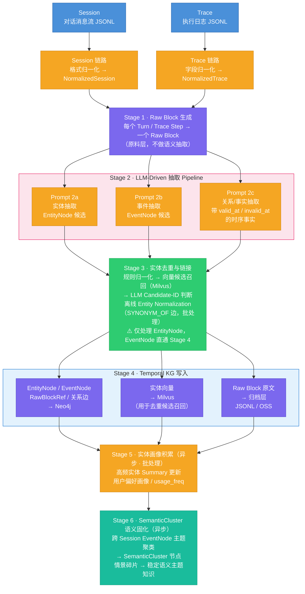
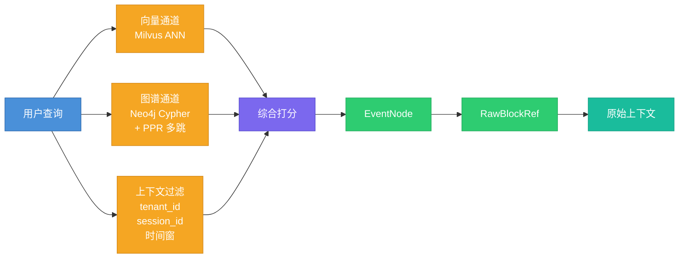
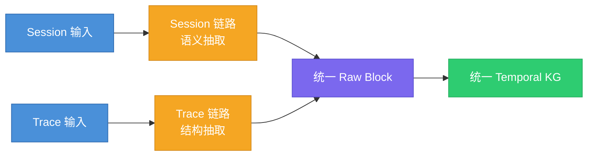
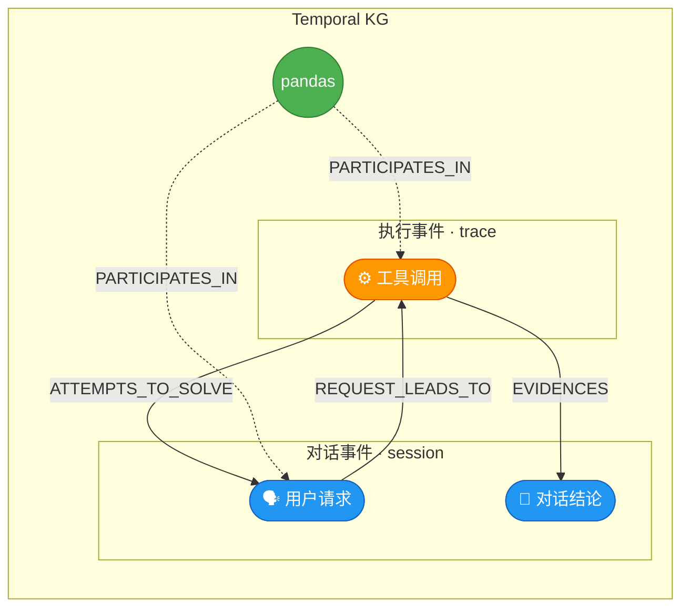

# AMS 陈述性记忆构建系统 — 概要设计（v2）

> 本文是 AMS 陈述性记忆（Episodic + Semantic）子系统的**概要设计**。
>
> 编写原则：
> - 第 1-3 章（系统定位 / 整体架构 / 数据模型）**完整展开**，承担"原理 + 粗粒度方案"的叙事职责，力求自洽可读；
> - 第 4-12 章是构建链路与外围机制的**粗粒度方案描述**，阐明思路、决策与约束，不重复各模块的数据结构定义、Prompt 模板、接口契约、代码实现——这些细节下沉到本目录下的详细设计文档（见附录 A 索引）；
> - 详细设计从本文档第 4 章对应的"抽取模块"开始写起。

## 第1章 系统定位与目标

### 1.1 输入源：Session 与 Trace
- 参考 [[Session和Trace数据源类型明细]]
本系统的输入来自 Agent 运行时产生的两类原始数据，它们是同一次交互过程的两种观察视角：

| 视角    | Session            | Trace                         |
| ----- | ------------------ | ----------------------------- |
| 观察的是  | 用户与 Agent **说了什么** | Agent 内部**做了什么**              |
| 组织中心  | 对话时间线（turn-based）  | 执行树（span / step-based）        |
| 典型内容  | 意图、问题、约束、决策、指代     | 工具调用、状态、latency、artifact、错误重试 |
| 更适合回答 | "用户想做什么？意图如何演化？"   | "系统实际执行了什么？哪步成功/失败？"          |
| 语义密度  | 高（自然语言）            | 低（系统日志）                       |

两者的层级关系如下：

```
1 Session（一次任务会话）
  └── N 个 Turn（多轮对话）
        └── 每个 Turn 背后有 1/N 个 Trace
              └── 每个 Trace 有 N 个 Step（工具调用链）
```

Session 告诉你"用户要读 Excel 文件"，Trace 告诉你"python_executor 调用了 read_excel，耗时 420ms，成功返回"。两者缺一不可，各自承载不同维度的记忆原料。

**为什么不能合并为一条链路处理**：Session 的核心难点在语义（指代消解、意图变化识别、会话边界切分），Trace 的核心难点在结构（字段异构、执行链重建、错误/重试识别）。混合处理会让 pipeline 变得脆弱——要么过度裁剪 Trace 的结构信息，要么让 Session 处理逻辑承担不该有的负担。

### 1.2 产出目标：语义记忆与情景记忆
#### 1.2.1 认知科学基础

AMS 的记忆分类直接映射人类认知心理学的经典模型。以下是完整的概念映射表：

| **维度** | **记忆类型**                        | **归属/等价关系**                                    | **在 Agent 中的定义与实现**                                 |
| ------ | ------------------------------- | ---------------------------------------------- | --------------------------------------------------- |
| 基础类别   | **Procedural Memory**（程序性记忆）    | 与 Declarative Memory 相互独立                      | **技能型记忆**。在 Agent 中表现为通过强化学习（RL）获得的策略或确定性硬编码逻辑      |
| 高层概念   | **Declarative Memory**（陈述性记忆）   | 等价于 Factual Memory                             | **事实型记忆**。可以被显式表达、检索和描述的知识                          |
| 陈述性子类型 | **Semantic Memory**（语义记忆）       | Declarative Memory 的子集                         | **通用知识**。独立于时间/空间的事实（如"法国的首都是巴黎"）。Agent 的训练语料主要属于此类 |
| 陈述性子类型 | **Episodic Memory**（情景记忆）       | Declarative Memory 的子集；等价于 Experiential Memory | **自传式记忆**。包含时空上下文的特定事件（如"Agent 昨天下午与用户A讨论了天气"）      |
| 功能扩展   | **Metacognitive Memory**（元认知记忆） | 独立维度（Memory about Memory）                      | **自反式循环**。Agent 对自身认知边界的意识（如"我知道我不具备这个信息"或评估任务复杂度）  |

本系统产出的是**陈述性记忆（Declarative Memory）**，包含两个子类型：
####  1.2.2 情景记忆（Episodic Memory）

对**特定事件**的有时间戳的回忆。它回答的问题是：

- 上次那个 CSV 列类型问题发生在哪个会话？
- read_excel 这次调用之前发生了什么？
- 某个报错是在对话哪个阶段提出来的？

情景记忆的载体是 **EventNode**（事件节点）和 **RawBlockRef**（原始证据引用）。EventNode 是时序链的基本单元，每个事件有明确的发生时间、参与者和来源证据。参考：[[1. EventNode抽象的必要性]]

#### 1.2.3 语义记忆（Semantic Memory）

对**实体、概念、关系**的跨会话稳定认知。它回答的问题是：

- 这个用户常用哪些工具？
- pandas 和 read_excel 之间是什么关系？
- "那个库"在这个用户的上下文中通常指什么？

语义记忆的载体是 **EntityNode**（实体节点）和 **SemanticCluster**（语义主题群节点）。EntityNode 跨会话可归一，是连接不同情景的持久对象；SemanticCluster 是多个**知识碎片**聚类后固化的主题知识。

#### 1.2.4 两类记忆的分工关系

*借鉴 HippoRAG（arXiv 2405.14831）的海马体记忆索引理论：*

| 记忆层                | 本系统对应                              | 存储位置        | 核心功能            |
| ------------------ | ---------------------------------- | ----------- | --------------- |
| **语义记忆**（稳定的实体知识）  | EntityNode + 关系边 + SemanticCluster | Neo4j       | 实体归一、关系推理、主题聚类  |
| **情景记忆**（具体的事件上下文） | EventNode + RawBlockRef            | Neo4j + 归档层 | 时序链构建、证据溯源、事件回溯 |

两者不是替代关系，而是**检索时的分工**：
- 用语义记忆（EntityNode）做**语义索引**——定位"我在找什么"
- 用情景记忆（EventNode → RawBlockRef）做**细节还原**——"当时具体发生了什么"

### 1.3 核心能力目标

#### 1.3.1 What
本系统构建完成后，应能稳定回答以下类型的问题：

**类型 1：实体查询** — 用户用过什么？什么时候用的？
> 场景：用户在新会话中再次提到 pandas，Agent 需要快速了解该用户与 pandas 的历史交互深度，以决定回复的详细程度。
> 查询："pandas 这个库，用户在哪些会话中用过？最近一次是什么时候？当时配合了哪些参数（dtype / parse_dates）？遇到过什么问题？"

**类型 2：路径查询** — 两个概念之间有什么隐含关联？
> 场景：用户提到了 read_excel，但历史会话中从未直接讨论过它。Agent 需要判断这个新概念和用户已有知识之间是否存在关联路径。
> 查询："read_csv 和 read_excel 之间在图谱中存在什么路径？中间经过了哪些实体？每一跳的关系是什么？"

**类型 3：时间线重建** — 那次对话中到底发生了什么？
> 场景：用户说"上次那个 CSV 问题后来怎么样了"，Agent 需要还原完整经过。
> 查询："3月28日那次会话中，问题是怎么从'CSV列类型识别错误'演化到'dtype修复成功但日期列仍有问题'的？中间经历了哪些步骤？"

**类型 4：因果追溯** — 用户的请求触发了什么执行？结果如何？
> 场景：Agent 需要复盘一次工具调用链，判断是哪步出了问题。
> 查询："用户报告'CSV列类型识别有问题'后，Agent 内部调用了哪个执行器？传了什么参数？执行成功还是失败？执行结果与最终给用户的建议之间有什么证据关系？"

**类型 5：跨会话指代解析** — "上次那个"指的是什么？
> 场景：用户在新会话中说"上次那个问题，我换了读取方式，Excel 也没问题了"，Agent 需要理解指代。
> 查询："'上次那个问题'指的是哪个会话的哪个事件？'换了读取方式'对应哪个技术方案的变更？"

**类型 6：语义联想** — 历史上有没有类似的情况？
> 场景：用户遇到 Polars 读取 Parquet 文件的类型问题，Agent 需要举一反三。
> 查询："和'数据文件读取时的类型识别问题'语义相关的历史情节有哪些？之前用 pandas 处理 CSV 时的解决方案是否可以借鉴？"

#### 1.3.2 Why
那为什么需要回答这些类型的问题呢？

这些问题类型本质上是在定义这个记忆系统的**能力验收标准**——它们回答的是"建好这个系统后，能用来干什么？"

逐一来看每种类型存在的必要性：

**类型 1（实体查询）** 和 **类型 2（路径查询）** — 这是**语义记忆**的核心能力。Agent 需要知道用户的知识图谱长什么样：用过什么技术、这些技术之间有什么关联。这样才能在新对话中做**个性化推荐和上下文补全**。

**类型 3（时间线重建）** 和 **类型 4（因果追溯）** — 这是**情景记忆**的核心能力。Agent 需要能回溯"某次对话中到底发生了什么"，包括问题是怎么演进的、哪些步骤成功/失败。这对于**调试、复盘、从经验中学习**至关重要。

**类型 5（跨会话指代解析）** — 这是两种记忆**协同工作**的场景。用户说"上次那个问题"，Agent 需要先从**情景记忆**中定位到具体会话和事件，再从**语义记忆**中理解上下文。这是**对话连续性**的关键。

**类型 6（语义联想）** — 这是**检索增强**的基础。当用户遇到新问题时，系统能找到历史上语义相似的情节，帮助 Agent 举一反三。

简单说，这六类问题覆盖了一个记忆系统的**四种核心用途**：

| 用途                 | 对应类型 |
| ------------------ | ---- |
| **知道用户是谁**（用户画像）   | 1, 2 |
| **记得发生过什么**（经验回溯）  | 3, 4 |
| **理解用户在说什么**（指代消歧） | 5    |
| **联想相关经验**（检索增强）   | 6    |

所以这些不是随意列举的，而是从"Agent 要像一个有记忆的助手一样工作"这个目标反推出来的**最小能力集合**。
### 1.4 系统边界

**包含**：
1. Session / Trace → Raw Block 的输入适配与归一化
2. LLM-Driven 实体、事件、关系抽取
3. **实体去重与跨会话链接**
4. Temporal KG 写入与增量更新
5. **实体画像积累**
6. SemanticCluster 语义固化
7. 混合检索层（向量 + 图遍历 + PPR 多跳）
8. **遗忘机制**（时效衰减 + 置信度过期 + 显式覆盖）

**不包含**：
1. Agent 框架本身的设计与实现
2. Working Memory（上下文窗口管理）
3. 知识库（静态文档 / 源代码）的构建
4. 程序性记忆（Skill / 工作流存储）
5. 生产级多租户权限治理与计费

---

## 第2章 整体架构

### 2.1 全系统数据流
#### 构建流程
- 从原始数据输入到知识图谱写入和语义固化的完整 pipeline




#### 检索流程
- 从用户查询到三路召回、融合打分、最终返回原始上下文的过程




### 2.2 分层架构说明

| 层次        | 职责                             | 执行方式      |
| --------- | ------------------------------ | --------- |
| **输入适配层** | Session/Trace 归一化，Raw Block 生成 | 流式或批量，同步  |
| **抽取层**   | LLM-Driven 实体/事件/关系抽取，实体去重     | 异步流水线     |
| **图谱存储层** | Temporal KG 写入，增量 Upsert，冲突处理  | 事务写入      |
| **画像层**   | 实体 Summary 更新，用户偏好积累           | 异步批处理     |
| **语义固化层** | SemanticCluster 构建与维护          | 定时触发或阈值触发 |
| **遗忘层**   | 时效衰减，低置信过期，显式覆盖                | 定时任务      |
| **检索层**   | 混合检索，PPR 多跳，证据溯源               | 同步查询服务    |

### 2.3 "前分后合"双链路策略

本系统对 Session 和 Trace 采用**前端分离处理、后端融合到同一张 Temporal KG** 的策略：



这张图清晰地表达了三个层次：

1. **前端分离** — Session 和 Trace 两条独立的输入链路
2. **各自抽取** — Session 走语义抽取，Trace 走结构抽取
3. **后端融合** — 两条链路汇聚到统一 Raw Block，最终写入同一张 Temporal KG

写入同一张 Temporal KG 后，所有节点在物理上就是一张图。但因为来源不同，事件节点天然形成两个族群：Session 链路产生的**对话事件**（如用户请求、对话结论）和 Trace 链路产生的**执行事件**（如工具调用）。
- **对话事件**（source_type=session）：user_request、problem、decision、solution
- **执行事件**（source_type=agent_trace）：tool_use、tool_result、artifact_create

EntityNode 归一后天然跨族群——同一个实体 `pandas` 不管从哪条链路抽出，都指向同一个节点，是天然的粘合剂。但 EventNode 是一次性的，对话事件和执行事件之间的因果关系需要显式的边来表达：

- `REQUEST_LEADS_TO`：对话事件（用户请求）→ 执行事件（工具调用）
- `ATTEMPTS_TO_SOLVE`：执行事件 → 对话事件（尝试解决某个问题）
- `EVIDENCES`：执行事件的结果 → 对话事件（为某个结论提供证据）



> EntityNode 是天然的粘合剂；因果边负责连接不同来源的 EventNode。

这样既保留了各自的信号特征，又实现了跨来源的连续性建模。
### 2.4 三类存储的职责分工

| 存储                 | 职责                                   | 核心数据                                                         |
| ------------------ | ------------------------------------ | ------------------------------------------------------------ |
| **Neo4j**          | Temporal KG 主存储：关系、路径、**时序**、**溯源**  | EntityNode / EventNode / RawBlockRef / SemanticCluster / 关系边 |
| **Milvus**         | 向量索引：实体相似候选召回，辅助去重与检索                | 实体 embedding / SemanticCluster embedding                     |
| **归档层（JSONL/OSS）** | 原始内容持久化：Raw Block 原文、LLM 调用记录、抽取中间结果 | raw_blocks / extracted / dedup / debug                       |

三者关系：Neo4j 是记忆的**骨架**，Milvus 是记忆的**语义索引**，归档层是记忆的**原料仓库**。


---

## 第3章 数据模型（Graph Schema）

### 3.1 核心节点类型

#### EntityNode — 语义记忆的持久对象

跨会话可归一的稳定实体，如工具、库、概念、用户、组织。是语义记忆的基本单元。

```cypher
(:EntityNode {
  entity_id:        "ent_acmecorp_01JQXXXXXX",   // 统一 ID：{prefix}_{tenant}_{ulid}
  tenant_id:        "acmecorp",
  name:             "pandas",                      // 标准名称（归一化后）
  entity_type:      "TOOL",                        // TOOL / CONCEPT / RESOURCE / PERSON / ORG / ACTION
  aliases:          ["pd", "Pandas"],              // 已识别的别名列表
  summary:          "Python 数据处理库，用户频繁用于 CSV/Excel 读写",  // 自动更新的摘要
  usage_freq:       12,                            // 被引用次数（画像积累）
  profile_hints:    ["data_processing", "file_io"],// 用于检索个性化排序的标签
  first_seen_at:    datetime("2026-03-28T14:32:00Z"),
  last_seen_at:     datetime("2026-03-31T09:15:00Z"),
  source_block_ids: ["blk_acmecorp_01...", "blk_acmecorp_02..."],  // 最近 50 次热引用缓存（完整溯源走 MENTIONED_IN 边）
  created_at:       datetime(),
  updated_at:       datetime()
})
```
- 参考 [[EntityNode中时间字段的应用场景]]

**实体类型定义**（控制在 6 类，避免过度细分）：
- 参考 [[EntityNode类型定义方法论思考]]

| 类型         | 说明              | 示例                                  |
| ---------- | --------------- | ----------------------------------- |
| `TOOL`     | 工具、库、框架、API、执行器 | pandas, read_excel, python_executor |
| `CONCEPT`  | 技术概念、方法、参数、算法   | dtype, CSV解析, 数据清洗                  |
| `RESOURCE` | 文件、数据集、制品、URL   | data.csv, output.xlsx               |
| `PERSON`   | 用户、角色、Agent 实例  | 用户, Alice, agent_v2                 |
| `ORG`      | 组织、系统、服务、团队     | Acme Corp, DataPlatform             |
| `ACTION`   | 关键动作/任务（需关联参与者） | 读取Excel, 排查报错                       |

#### EventNode — 情景记忆的时序单元

**有时间、有参与者、有状态的瞬时事件**。是时序链的节点，也是 Session/Trace 桥接的锚点。

```cypher
(:EventNode {
  event_id:                   "evt_acmecorp_01JQXXXXXX",
  tenant_id:                  "acmecorp",
  event_type:                 "tool_use",    // 见事件类型定义
  summary:                    "python_executor 调用 read_excel 读取 data.xlsx",  // 一句话事件描述，≤80字
  event_time:                 datetime("2026-03-31T09:15:20Z"),  // null 表示时间不确定
  time_resolution_confidence: 0.95,          // 时间置信度 0-1（见第5章时间处理规则）
  confidence:                 0.90,          // 事件抽取置信度
  session_id:                 "sess_acmecorp_01B",
  semantic_cluster_id:        null,          // 语义固化后填入（Stage 6）
  source_block_id:            "blk_acmecorp_01B_S1",  // 必填，溯源到 Raw Block
  source_type:                "agent_trace", // session / agent_trace
  created_at:                 datetime()
})
```

**事件类型定义**（控制在 7 类）：

- 参考：[[EventNode 类型定义方法论思考]]

| 类型                | 适用来源    | 说明             |
| ----------------- | ------- | -------------- |
| `user_request`    | Session | 用户提出需求或问题      |
| `decision`        | Session | 用户或 Agent 做出决策 |
| `problem`         | Session | 出现问题/报错        |
| `solution`        | Session | 问题被解决，方案被确认    |
| `tool_use`        | Trace   | 工具被调用          |
| `tool_result`     | Trace   | 工具返回结果（成功/失败）  |
| `artifact_create` | Trace   | 产生了关键制品/文件/输出  |

> [!note] 为什么需要 EventNode 这一抽象  
> 如果只用"实体 + 关系"建模，会丢失三类关键信息：
>    ①事件的**发生顺序**（时序链没有挂载点）；
>    ②**多参与者**的同时关联（边只能连两个节点）；
>    ③**证据归属**（confidence 和 source_block_id 无法挂在边上）。
>    
>    EventNode 把"一次发生"变成图谱里的一等公民，解决了上述三个问题。【参考】[[1. EventNode抽象的必要性]]

#### RawBlockRef — 情景记忆的证据锚点

轻量溯源节点，指向原始 Raw Block，不存全文内容（内容在归档层）。

```cypher
(:RawBlockRef {
  block_id:    "blk_acmecorp_01A_T1",
  tenant_id:   "acmecorp",
  source_type: "session",            // session / agent_trace
  source_uri:  "session://sess_acmecorp_01A/turn/1",
  timestamp:   datetime("2026-03-28T14:32:05Z"),
  session_id:  "sess_acmecorp_01A"
})
```

#### SemanticCluster — 语义固化的主题知识节点

对多个 EventNode 做主题聚类后生成的语义摘要节点，**对应 EverMemOS 中的 MemScene 概念**。

```cypher
(:SemanticCluster {
  cluster_id:   "cls_acmecorp_01JQXXXXXX",
  tenant_id:    "acmecorp",
  theme:        "pandas 数据文件读写问题排查",
  summary:      "用户在多个会话中处理 pandas 读取 CSV/Excel 的类型识别和日期解析问题，...",
  period_start: datetime("2026-03-28T00:00:00Z"),
  period_end:   datetime("2026-03-31T23:59:59Z"),
  event_count:  9,
  embedding:    [1536维向量],        // 用于语义相似召回
  created_at:   datetime(),
  updated_at:   datetime()
})
```

### 3.2 完整边类型目录
- 参考：[[Temporal-KG-边类型定义的方法论思考]]
#### A. 实体关系边（EntityNode ↔ EntityNode）

带时间有效性的事实关系，是语义记忆的核心内容。

| 边类型          | 说明              | 示例                                 |
| ------------ | --------------- | ---------------------------------- |
| `USES`       | 实体使用工具/库        | 用户 USES pandas                     |
| `INVOKES`    | 工具调用子方法/API     | python_executor INVOKES read_excel |
| `PRODUCES`   | 产生制品/输出         | tool_use PRODUCES output.xlsx      |
| `MENTIONS`   | 会话中被提及          | 用户 MENTIONS data.csv               |
| `RELATES_TO` | 通用语义关联          | pandas RELATES_TO CSV解析            |
| `CAUSED_BY`  | 因果关系（有明确证据时）    | solution CAUSED_BY tool_result     |
| `SYNONYM_OF` | 语义相近但表面不同（离线生成） | 分布式追踪 SYNONYM_OF 链路追踪              |

所有实体关系边携带时间有效性字段：
```
{
  fact_text:          "用户使用 pandas 处理 CSV 格式数据",
  valid_at:           datetime("2026-03-28"),
  invalid_at:         null,           // 已知失效时间，null 表示仍有效
  superseded_at:      null,           // 被新事实覆盖时填写
  validity_reasoning: "Active in current session, may change to other formats",
  confidence:         0.88,
  source_block_id:    "blk_acmecorp_01A_T1"
}
```

#### B. 事件时序边（EventNode → EventNode）

| 边类型 | 方向 | 说明 |
|--------|------|------|
| `PRECEDES` | A → B | A 在时序上先于 B（主持久化边） |

> 只持久化 `PRECEDES`，`FOLLOWS` 为查询视角的派生关系，不重复写入，避免双写一致性问题。

#### C. 参与与溯源边

| 边类型 | 连接 | 说明 |
|--------|------|------|
| `PARTICIPATES_IN` | EntityNode → EventNode | 实体参与了某个事件，携带 `role` 字段（tool/subject/object） |
| `DERIVED_FROM` | EventNode → RawBlockRef | 事件溯源到原始 block（必填） |
| `MENTIONED_IN` | EntityNode → RawBlockRef | 实体在哪些 block 中被提及。用于替代节点上的 `source_block_ids` 大数组，实现无限增长的细粒度溯源 |

#### D. Session-Trace 桥接边（EventNode → EventNode，跨来源）

| 边类型 | 说明 |
|--------|------|
| `REQUEST_LEADS_TO` | 对话事件（用户请求）触发了执行事件（工具调用） |
| `ATTEMPTS_TO_SOLVE` | 执行事件尝试解决某个对话事件中的问题 |
| `EVIDENCES` | 执行事件的结果为某个对话结论提供了证据 |

#### E. 语义固化边（SemanticCluster 相关）

| 边类型 | 连接 | 说明 |
|--------|------|------|
| `AGGREGATES` | SemanticCluster → EventNode | Cluster 聚合了哪些事件 |
| `REPRESENTS` | SemanticCluster → EntityNode | Cluster 代表的核心实体/主题 |

### 3.3 节点属性概览

下表汇总各节点类型的核心属性及其设计意图，完整的属性约束定义、边类型 Cypher 签名及索引策略参见详细设计。

> 详细设计：[第3章-数据模型详细设计.md](第3章-数据模型详细设计.md)

#### EntityNode 属性说明

| 属性 | 类型 | 必填 | 说明 |
|------|------|------|------|
| `entity_id` | STRING | ✅ | 统一 ID，格式 `{prefix}_{tenant}_{ulid}` |
| `tenant_id` | STRING | ✅ | 租户隔离键 |
| `name` | STRING | ✅ | 归一化后的标准名称 |
| `entity_type` | STRING | ✅ | 6 类之一：TOOL / CONCEPT / RESOURCE / PERSON / ORG / ACTION |
| `aliases` | LIST\<STRING\> | | 已识别的别名列表，如 `["pd", "Pandas"]` |
| `summary` | STRING | | 自动更新的摘要，随画像积累演化 |
| `usage_freq` | INTEGER | | 被引用次数，驱动画像更新和检索排序 |
| `profile_hints` | LIST\<STRING\> | | 个性化排序标签，如 `["data_processing", "file_io"]` |
| `first_seen_at` / `last_seen_at` | DATETIME | | 业务时间窗口，用于时间衰减和活跃度判断 |
| `source_block_ids` | LIST\<STRING\> | | 最近 50 次热引用缓存；完整溯源通过 MENTIONED_IN 边 |

#### EventNode 属性说明

| 属性 | 类型 | 必填 | 说明 |
|------|------|------|------|
| `event_id` | STRING | ✅ | 统一 ID |
| `tenant_id` | STRING | ✅ | 租户隔离键 |
| `event_type` | STRING | ✅ | 7 类之一（见 3.1 事件类型定义表） |
| `summary` | STRING | ✅ | 一句话事件描述，≤80 字 |
| `event_time` | DATETIME | | null 表示时间不确定 |
| `time_resolution_confidence` | FLOAT | | 时间置信度 0-1，影响 PRECEDES 边的可靠性 |
| `confidence` | FLOAT | | 事件抽取置信度 |
| `session_id` | STRING | | 所属会话，替代独立 SessionNode 的设计 |
| `semantic_cluster_id` | STRING | | 语义固化（Stage 6）后回填 |
| `source_block_id` | STRING | ✅ | 溯源到 Raw Block，保证证据可追溯 |

#### RawBlockRef 属性说明

| 属性 | 类型 | 必填 | 说明 |
|------|------|------|------|
| `block_id` | STRING | ✅ | 统一 ID |
| `tenant_id` | STRING | ✅ | 租户隔离键 |
| `source_type` | STRING | | session / agent_trace |
| `source_uri` | STRING | ✅ | 指向归档层原文的定位符 |
| `timestamp` | DATETIME | ✅ | 原始数据时间戳 |
| `session_id` | STRING | | 所属会话 |

#### SemanticCluster 属性说明

| 属性 | 类型 | 必填 | 说明 |
|------|------|------|------|
| `cluster_id` | STRING | ✅ | 统一 ID |
| `tenant_id` | STRING | ✅ | 租户隔离键 |
| `theme` | STRING | ✅ | 主题标签（短语级） |
| `summary` | STRING | | 段落级语义摘要 |
| `period_start` / `period_end` | DATETIME | | 聚合事件的时间范围 |
| `event_count` | INTEGER | | 聚合事件数 |
| `embedding` | LIST\<FLOAT\> | | 1536 维向量，用于语义相似召回 |

#### 边属性设计原则

各类边的公共属性遵循以下原则（完整签名见详细设计）：

- **实体关系边**（A 类）携带**时间有效性字段组**：`valid_at`、`invalid_at`、`superseded_at`、`validity_reasoning`，以及 `confidence` 和 `source_block_id`。这组字段是 Temporal KG 的核心——让每条事实都有时间生命周期和证据溯源。
- **时序边** `PRECEDES` 携带 `confidence`，受事件的 `time_resolution_confidence` 影响。
- **参与边** `PARTICIPATES_IN` 携带 `role`（tool / subject / object），实现多参与者的事件关联。
- **桥接边**（D 类）携带 `confidence`，通常低于直接抽取的边，反映跨来源推断的不确定性。
- **语义固化边**（E 类）为纯结构边，不携带额外属性。

### 3.4 图模型设计的核心权衡

> **⚠️ 核心技术难点 1：图模型的表达力与查询性能的平衡**
>
> 图模型越细（节点类型越多、边类型越丰富），表达力越强，但查询路径越复杂、写入逻辑越重。本方案采用**最小够用原则**：
> - 4 类节点（Entity / Event / RawBlockRef / SemanticCluster）覆盖全部核心需求
> - 实体关系边采用属性包（property bag）方式携带时效字段，而非为每种关系创建独立节点
> - `session_id` 作为字段挂在 EventNode 上，而非创建 SessionNode（避免不必要的图复杂度）
>
> **参考**：Graphiti（getzep/graphiti）的最小图模型设计；[[知识图谱和图数据库的关系]]


---

## 第4章 输入适配与 Raw Block 生成

> 详细设计：[第4章-输入适配与RawBlock生成-重构版.md](第4章-输入适配与RawBlock生成-重构版.md)

### 4.1 Raw Block 的角色：统一原料层

Raw Block 是系统的**统一原料格式**。Session 和 Trace 经过各自的归一化后，都产出结构一致的 Raw Block，所有后续处理以 Raw Block 为唯一输入。这样做把"输入异构"和"语义抽取"彻底解耦——新接入一个 Agent 框架只影响本章的适配器，不会动到抽取、去重、写入、检索任何下游模块。

Raw Block 只保留**原始内容 + 结构化元数据**（block_id / tenant_id / session_id / source_type / timestamp / role / text / metadata 等），不做语义提炼。语义抽取延后到第 5 章。

### 4.2 Session 链路：信任上游，不过度切分

Session 链路处理对话消息流，核心决策有三个：

- **信任上游框架的 session 边界**：`session_id` 由上游 Agent 框架生成，AMS 直接采信。在对接 Langflow / 自研框架时，session 边界已经确定，AMS 再切分是重复劳动，且容易与上游产生分歧。
- **不做 episode 子段切分**：初版方案预留过 `episode_id`，但分析后决定放弃——话题交织的会话硬切会导致错误归属，而 Stage 6 的 SemanticCluster 通过异步软聚类天然解决多话题分组，且支持跨 session 聚合。
- **每个 Turn 生成一个 Raw Block**：保持 turn 原子性，不跨 turn 合并，保证溯源粒度与对话结构对齐。

### 4.3 Trace 链路：适配器插件化，重点在执行链重建

Trace 的真正难点不在字段映射，而在**执行链重建**：有些框架的 Trace 是扁平列表，需要根据 parent_span_id 还原树状结构；错误重试需要区分"是同一次调用的重试"还是"新一次调用"；工具链里哪个 step 是关键结果节点需要识别。

为了隔离这些差异，Trace 链路采用**适配器插件架构**——每个 Agent 框架对应一个适配器（LangChain / AutoGen / 自研...），适配器负责把框架特有的 Trace 结构翻译成标准化的 step 序列，主链路不感知差异。每个 Step 生成一个 Raw Block，重试步骤各自生成独立 Block。

### 4.4 Raw Block 生成的不可妥协点

- **溯源可达**：每个 Raw Block 必须能定位回原始输入（source_uri 指向归档层，归档层保留原始 JSONL）
- **幂等生成**：同一原始输入多次处理产出同一 block_id，保障 Pipeline 可重放
- **时间正确**：尽量保留原始时间戳；Session 用 turn 时间，Trace 用 span start_time；时间缺失时置 null + 置信度降级，不伪造


---

## 第5章 混合抽取 Pipeline（Encoder + LLM）

> 详细设计：[第5章-混合抽取Pipeline-重构版.md](第5章-混合抽取Pipeline-重构版.md)

### 5.1 为什么不是"全 LLM"

抽取层负责把 Raw Block 变成 `(实体, 事件, 关系)` 三元组，是整条构建链路中**最昂贵、最不稳定**的环节。如果统一使用大 LLM，成本估算 ~$300/天（10 万 block），单 block 延迟 3-6s——这两个数字都不可规模化。

反过来，如果全用 Encoder（如 GLiNER-RelEx），虽然单次推理只要 20-40ms、成本几乎可以忽略，但经过实测：GLiNER 在**中文会话场景**表现远逊预期，根本原因是其预训练数据中中文覆盖不足，subword embedding 对中文字符的 span 边界检测从根本上欠缺。中文场景不能押注 Encoder。

因此，抽取层的整体思路是**按"语言 + 数据源"分流，分层递进**：让适合的模型做适合的事。

### 5.2 三路分流的主抽取器

| 路径 | 主抽取器 | 选型理由 |
|------|---------|---------|
| **中文会话 Session** | 小 LLM（Qwen2.5-7B / gemma-2-9B 级别） | 中文预训练充分，一次调用同时输出实体+关系+事件，prompt 可控、结构化输出稳定 |
| **英文 Trace / 结构化文本** | Encoder（GLiNER-RelEx） | 速度快（~20-40ms）、成本低、英文 span 边界精度高 |
| **Foresight / 开放推理** | 大 LLM（GPT-4o / Claude） | 仅处理不可替代子任务：时效推理、开放关系发现、因果推断 |

### 5.3 分层递进：Layer 1/2/3

```
Raw Block → Layer 0（路由判断）
  ├── Layer 1  主抽取（小 LLM 或 Encoder）：完成 50-80% 的结构化抽取
  ├── Layer 2  规则/轻量工具：停用词过滤、时间解析、aliases 聚合、类型校验（~5ms）
  └── Layer 3  大 LLM 精修：仅处理不可替代子任务
```

核心思想是：**Layer 1+2 的输出作为 Layer 3 的先验锚点**。大 LLM 不再从零做"全量抽取"，而是拿着 Layer 1+2 给的候选实体、候选关系，只做"增强补充 + 时效推理 + 开放关系发现"。这样 Layer 3 的 prompt 更短、输出更稳、成本大幅下降。

### 5.4 Foresight：在抽取时就预判事实的"保质期"

本系统的一个设计亮点（借鉴 EverMemOS）：在 Layer 3 抽取关系时，要求大 LLM **主动推理每条事实的有效期**，输出 `validity_reasoning` 和（必要时）`invalid_at`。

举例：
- "用户正在使用 pandas" → `validity_reasoning = "Active in current session, may change"`
- "API Key = abc123" → `validity_reasoning = "Credentials typically expire, estimate 90 days"`，`invalid_at` 设为 90 天后
- "pandas 是 Python 数据处理库" → `validity_reasoning = "Stable semantic fact, unlikely to change"`

这把"什么时候该忘"的决策从全图扫描前置到抽取阶段，为第 11 章的遗忘机制提供先验。该任务必须由大 LLM 完成，Encoder 无法做链式推理和时效预测。

### 5.5 落地节奏：渐进验证，不一步到位

| 阶段 | 策略 |
|------|------|
| **验证期** | 保持全 LLM pipeline，并行跑对比实验（GLiNER vs 小 LLM vs 大 LLM），积累评估数据 |
| **优化期** | 部署路由层，中文/英文路径分别替换 Layer 1，关键指标不回退再切流 |
| **深度优化** | 只对复杂 block 调用大 LLM，简单 block 在 Layer 1+2 完成后直接写入 |

这样可以把"决策成本"和"上线风险"分开——在不影响线上记忆质量的前提下，逐步把成本曲线打平。

---

## 第6章 实体去重与链接

### 6.1 问题本质

同一个实体，在不同会话中可能以完全不同的形式出现：`pandas` / `pd` / `Pandas` / "那个库" / "Python 数据处理库"。去重层的目标是把这些表面不同、实际指向同一真实对象的表述，归并到同一个 `entity_id` 下。

去重之所以重要，是因为它是**整个图的连通性基础**——如果 `pandas` 在 A 会话和 B 会话被当成两个实体，那么跨会话的 PPR 多跳检索、用户画像积累、SemanticCluster 聚合全部会失效。

### 6.2 三层级联策略：规则 → 向量 → LLM

```
新实体 → Step 1（规则归一化）→ Step 2（向量候选召回）→ Step 3（LLM Candidate-ID 判断）
```

**Step 1 — 规则归一化（毫秒级）**：大小写统一、去首尾空格、常见缩写映射（`pd → pandas`、`np → numpy`）。这是唯一保留的规则环节，只覆盖确定性强的归一。

**Step 2 — Milvus 向量候选召回**：在海量实体中用 ANN 快速召回相似候选（余弦相似度 > 0.85 的 top-5），把 LLM 需要判断的范围从 N 压缩到 5。

**Step 3 — LLM Candidate-ID 判断**（借鉴 Graphiti）：让 LLM 在编号后的候选列表 `[0, 1, 2, ..., -1]` 中选一个（-1 表示"全新实体"）。相比开放式字符串匹配，离散选择显著降低幻觉，输出更易解析。

### 6.3 核心原则：宁可漏合并，不可误合并

漏合并的代价是多了几个冗余节点，可以在 SYNONYM_OF 边或后续人工审核中补救；误合并则会让两条实体的所有关系、事件、溯源互相污染，后续几乎不可回滚。因此去重层的所有阈值都倾向**保守**——Milvus 召回阈值偏高、LLM 判断偏向 -1（全新）。

### 6.4 离线同义关系发现

实时去重只处理明确的同名/别名。对"分布式追踪" vs "链路追踪" vs "Distributed Tracing" 这类**语义相似但表面不同**的实体，交给离线批处理：定时扫描全量实体 → ANN 批量召回候选 → 精确相似度 + LLM 二次判定 → 生成 SYNONYM_OF 边。

SYNONYM_OF 边的用途是**检索时扩展召回**，让查询"分布式追踪"也能命中"Distributed Tracing"的节点；但它**不作为实体归一的依据**——两个节点仍然独立存在，避免误合并破坏已有关系。


---

## 第7章 Temporal KG 写入

### 7.1 写入四原则

1. **溯源优先（Provenance First）**：每个 EventNode 和每条高价值关系边必须携带 `source_block_id`，确保任何记忆都能追溯到原始 Raw Block。
2. **增量 Upsert**：不是无脑追加。与已有节点比对后分情况处理：
   - 完全重复 → 更新 last_seen_at / usage_freq；
   - 补充 → 扩充 aliases / summary；
   - 冲突 → 旧事实标记 `superseded_at`，新事实作为新边写入；
   - 全新 → 创建新节点。
3. **幂等性**：同一 `block_id` 多次写入，结果一致，不产生重复节点（依赖 entity_id / event_id 的确定性生成规则）。
4. **事务边界**：一个 Raw Block 的完整处理（实体 + 事件 + 关系）作为一个 Neo4j 事务，避免出现"有事件没实体"或"关系边指向不存在的节点"的中间状态。

### 7.2 冲突处理：用 superseded_at 而不是删除

当新事实与旧事实冲突时（经典场景：用户从 pandas 切换到 polars），系统**不删除**旧事实，而是：

- 旧事实的关系边标记 `superseded_at = 切换时间`
- 新事实作为新边写入
- 新旧并存，检索时通过时间窗过滤

这样同时支持两类查询——"用户当前在用什么"（过滤 superseded_at IS NULL）和"用户曾经用过什么"（不过滤）。也为 Foresight 校准提供了历史样本：事后可以统计预测的 invalid_at 和实际 superseded_at 的偏差。

### 7.3 Session-Trace 桥接边的构建

桥接边是"前分后合"策略能否成立的关键。构建采用**分层置信度策略**：

| 优先级 | 构建依据 | 置信度 |
|--------|---------|--------|
| 最可靠 | Agent 框架层显式关联（Trace 的 metadata 带 session_turn_id） | 0.95+ |
| Fallback 1 | 时间邻近（< 30 秒）+ 实体交集 | 0.75 - 0.85 |
| Fallback 2 | 执行结果与后续对话事件的语义匹配 | 0.70 - 0.80 |

置信度低于 0.70 的桥接边不建，避免引入噪声扰乱因果追溯。

### 7.4 PRECEDES 边的 O(1) 维护

PRECEDES 用来构建同一 session 内的时序链。如果每次新事件写入都去图库里 `MATCH ... ORDER BY event_time DESC LIMIT 1` 找前一个事件，会在高吞吐场景下成为瓶颈。

写入服务采用内存状态：为每个活跃 session 维护 `latest_event_id`，新事件直接与上一事件连边，O(1) 完成。只有在"首条事件"或"历史数据修复"场景下才 fallback 到图库查询。

---

## 第8章 实体画像积累

### 8.1 为什么需要画像

高频实体需要沉淀为**稳定的认知画像**。没有画像层的系统，每次查询 pandas 都要现场扫一堆事件生成摘要，既慢又不稳定。画像层的三个核心价值：

- **检索个性化排序**：用户频繁使用的工具在同分情况下优先展示
- **自动摘要生成**：减少重复 LLM 调用
- **偏好推断**：识别工具使用习惯、技术栈倾向

### 8.2 实体 Summary 自动更新

借鉴 Graphiti 的 summarize_nodes 思路：

- **触发条件**：usage_freq 达到阈值 / 距上次更新超过时间窗 / 有新的高置信度关联事实
- **更新方式**：增量合并——保留稳定信息（实体类型、核心关系），只更新时变信息（最近使用场景、出现频次）；而不是每次全量重写

### 8.3 用户偏好画像：独立 UserProfile 节点

用户画像是**跨实体聚合**的推断结果（常用工具列表、技能领域、典型工作流），不适合挂在单个 EntityNode 上，因此保留独立的 UserProfile 节点，由异步批处理任务对用户相关的实体、事件、关系做统计分析后生成。

UserProfile 不是陈述性记忆本身，而是陈述性记忆的**派生产物**，可被遗忘机制绕过（画像始终以"当前状态"存在，不进入归档）。

---

## 第9章 SemanticCluster：从情景碎片到语义主题

### 9.1 为什么需要语义固化

情景记忆（EventNode）是离散的事件点。随着数据积累会面临三个问题：
- **检索效率退化**：需要遍历所有相关 session 的事件
- **模式难识别**：分散的事件其实是同一类问题的重复
- **知识不沉淀**：Agent 无法从"反复出现的情景"中总结出"这是什么类型的问题"

语义固化的目标就是：**把分散的情节碎片聚类、提炼为稳定的语义主题**，完成从"记得发生了什么"到"知道是什么类型的问题"的跃迁。

> 借鉴 EverMemOS 的 MemScene 概念和 GraphRAG 的 Community Summary 设计。

### 9.2 构建思路：离线聚类 + LLM 主题生成

触发时机是**阈值**（新增 EventNode > N）或**定时**（每日/每周批处理）。核心流程：

1. 取出待聚类的 EventNode（通常是最近时间窗内未归类的）
2. 生成事件 embedding（summary + 核心 participants 拼接）
3. HDBSCAN 层次聚类，得到若干簇
4. 对每个簇，让 LLM 生成主题标签（theme）和段落级摘要（summary）
5. 创建 SemanticCluster 节点，建立 AGGREGATES → EventNode 与 REPRESENTS → EntityNode 边

### 9.3 增量维护：新事件如何归入已有 Cluster

新事件到来时，通过 Milvus ANN 从现有 Cluster embedding 中召回候选，若相似度超阈值则并入（AGGREGATES 建边），否则留给下一次批处理。并入时，Cluster embedding 按**滑动均值**更新，避免主题漂移。

### 9.4 为什么 SemanticCluster 能替代 episode 切分

初版方案预留过 episode 子段切分，但在话题交织的会话中会强行把同一个决策错误归属到两个 episode，破坏时序链。SemanticCluster 以**异步软聚类**延后决策，严格覆盖了 episode 的所有目标：

| 维度 | episode 硬切 | SemanticCluster 软聚 |
|------|:-----------:|:-------------------:|
| session 内多话题分组 | ✅ | ✅ |
| 跨 session 同主题聚合 | ❌ | ✅ |
| 话题交织容忍 | ❌（硬切错误归属） | ✅（软聚天然容忍） |

### 9.5 完整记忆路径

```
Session/Trace → Raw Block → EventNode（情景：what happened）
                                ↓ 聚类 + LLM 摘要
                           SemanticCluster（语义：what kind of problem）
                                ↓
用户查询 → 命中 Cluster → 展开相关 EventNode → 溯源 RawBlockRef → 原始上下文
```

检索时通常**先命中语义主题，再展开情景细节**——这也是 HippoRAG 所说的"海马体索引 + 新皮层细节"的分工。


---

## 第10章 检索层

### 10.1 三通道混合检索

不同查询有不同最优策略，单一通道无法覆盖所有意图。系统采用**三通道并行 + 融合打分**：

| 通道 | 引擎 | 擅长场景 |
|------|------|---------|
| **向量通道** | Milvus ANN | 语义相似实体/Cluster 召回、"类似问题"查询 |
| **图谱通道** | Neo4j Cypher + PPR 多跳 | 路径查询、时序重建、因果追溯、跨会话指代解析 |
| **上下文过滤** | 条件过滤 | tenant_id / session_id / 时间窗的硬约束 |

### 10.2 PPR 多跳（核心机制）

借鉴 HippoRAG 的设计，检索不是在原始文档上做向量匹配，而是：

```
查询向量 → ANN 命中入口 EntityNode → PPR 在 KG 上传播
        → 命中相关 EventNode → 溯源 RawBlockRef → 返回原始上下文
```

选用 PPR（Personalized PageRank）而非 BFS/DFS 的原因：普通图遍历会**无差别扩张**，在高连通度图上迅速爆炸、召回边界难控制；PPR 根据边权重和重启概率动态调整传播概率，自动平衡相关性与多样性。

### 10.3 结果融合：RRF

向量相似度（0-1）和 PPR score（无上限）量纲不同，直接加权会被一侧主导。系统采用 **RRF（Reciprocal Rank Fusion）** —— 只用排名不用分数，天然消除量纲差异：

```
score(d) = Σ_channel  1 / (k + rank_channel(d))
```

### 10.4 对外契约：AMS 只返回候选集

这是定位层面的决策：AMS 检索层的输出是**候选节点/事件 + 溯源引用 + 分数来源**，**不做 token 预算管理，不做 Prompt 拼装，不做摘要改写**。

Context Assembly Authority 天然属于 Agent Framework——只有它知道当前模型窗口、工具预算、系统提示词占用。如果 AMS 越权做 Prompt 拼装，就会退化成"又一个被动的文件柜"，难以被现代 Agent 框架复用。

接入模式支持 Tool Call / Prefetch / MCP Server / SDK 四种，契约细节见详设。

---

## 第11章 遗忘机制

### 11.1 为什么不能只写不忘

不加控制的长期记忆会导致：
- **图膨胀**：查询退化，PPR 传播代价指数增长
- **噪声干扰**：过时事实（旧 API Key、旧工具偏好）污染当前决策
- **存储成本**：Neo4j + Milvus + OSS 线性增长但价值非线性

遗忘**不是删除**，而是**有选择地降低旧记忆的可见性和权重**。

### 11.2 四种遗忘信号

| 信号 | 触发条件 | 举例 |
|------|---------|------|
| **时效度衰减** | 当前时间 > invalid_at，或距 valid_at > 365 天 | API Key 过期、版本号更新 |
| **低置信度过期** | confidence < 0.3 且持续 30 天无更新 | 抽取错误或噪声 |
| **显式覆盖** | 新事实与旧事实冲突，旧事实被 superseded | 用户从 pandas 切换到 polars |
| **访问频率衰减** | 长期未被检索也未在对话中出现 | 冷门实体逐步降权 |

前两种是抽取时就能预判的（Foresight），第三种是写入时决定的（superseded_at），第四种是运行时统计的。

### 11.3 三级执行：软删除 → 归档 → 硬删除

| 级别 | 做法 | 特点 |
|------|------|------|
| **软删除** | 添加 `expired_at`，检索时默认过滤 | 可人工恢复，不实际删除 |
| **归档** | 过期 90 天后迁移到 OSS 冷存储，保留索引 | 按需恢复，大幅降低 Neo4j 压力 |
| **硬删除** | 归档 1 年后，仅保留聚合统计信息 | 不可恢复，仅合规场景使用 |

**豁免规则**：高频实体（usage_freq > 50）和被 SemanticCluster 引用的核心主题实体优先保留。

### 11.4 与 SemanticCluster 的交互

- Cluster 内事件过期比例 < 50% → 保留 Cluster，标注"部分历史已归档"
- Cluster 内事件过期比例 ≥ 50% → 归档 Cluster 本身，但**保留其 summary 作为压缩记忆**

这样做的效果是：**语义主题的"知识"留下来，情景细节的"证据"被遗忘**——这恰好符合人类记忆的自然规律（记得"我以前用过 pandas"，但不记得"某年某月某日具体怎么用的"）。

---

## 第12章 存储设计

### 12.1 三类存储的规模估算（10 万 session/天为例）

| 节点/边类型 | 量级 | 日增量 |
|------------|-----|--------|
| EntityNode | 100-200 万 | 10-20 万 |
| EventNode | 50-100 万 | 5-10 万 |
| 关系边 | 100-300 万 | 10-30 万 |
| Neo4j 日增存储 | — | ~5-10 GB（含索引） |
| Milvus 向量 | 与 EntityNode + Cluster 同数量级 | — |
| 归档层 | Raw Block 原文 + LLM 调用记录 | ~50-100 GB |

### 12.2 生命周期策略：Hot / Warm / Cold

| 温度 | 存储位置 | 数据范围 |
|------|---------|---------|
| Hot | Neo4j / Milvus | 最近 90 天活跃数据 |
| Warm | OSS 标准存储 | 90 天 - 1 年 |
| Cold | OSS 归档存储（Glacier 级） | 1 年 - 3 年 |
| Deleted | 仅保留聚合统计 | 3 年以上 |

迁移策略由遗忘层的定时任务驱动，对上层检索透明——冷数据可以通过按需恢复接口回热。

### 12.3 多租户隔离

`tenant_id` 贯穿所有存储层：

- **Neo4j**：所有查询强制带 `tenant_id` 过滤，通过中间层拦截不合规查询
- **Milvus**：按 `tenant_id` 分区（partition），物理隔离向量索引
- **归档层**：OSS bucket 或 prefix 按 `tenant_id` 划分

这不仅是安全隔离，也是查询性能优化——PPR 在单租户子图上传播代价显著低于全局。


---

## 第13章 评估体系

### 13.1 分层评估

系统复杂度决定了必须分层评估，不能只看端到端：

| 层次 | 关键指标 | 目标 | 评估方式 |
|------|---------|------|---------|
| 抽取层 | 实体 Precision > 0.80, Recall > 0.70 | 保证图质量 | 人工标注测试集 |
| 去重层 | 归并准确率 > 0.75, 误合并率 < 0.05 | 保证图连通性 | 人工审核 + 样本回放 |
| 图谱层 | 入库成功率 > 0.98 | 保证管道可靠 | 自动化统计 |
| 检索层 | Recall@10 > 0.75, MRR > 0.60, P95 < 500ms | 保证可用 | 测试集 + 压测 |
| 语义层 | Cluster 主题准确性 > 0.70 | 保证固化有效 | 人工评估 |

### 13.2 核心 Demo Query：从能力反推验收

| 查询 | 覆盖能力 |
|------|---------|
| "用户上次提到的 pandas 问题是什么？" | 实体查询 + 时间线 |
| "从 pandas 到 read_excel 的路径？" | 路径查询 |
| "和'数据读取'相关的历史？" | 语义联想（SemanticCluster） |
| "sess_xxx 中问题怎么解决的？" | 时间线重建（PRECEDES 链） |
| "'那个库'指的是什么？" | 跨会话指代解析 |

这几条查询对应第 1.3 节定义的六类核心能力——评估体系的底线是：**Demo Query 全部通过，才算系统可用**。

---

## 第14章 风险与优先级

### 14.1 实施优先级

| 优先级 | 内容 |
|--------|------|
| **P0 不可妥协** | Raw Block 标准化、EntityNode / EventNode 基础模型、Neo4j 写入与溯源 |
| **P1 核心能力** | LLM 抽取 pipeline、实体去重、基础检索接口 |
| **P2 增强能力** | Milvus 向量召回、SemanticCluster 语义固化、PPR 多跳检索 |
| **P3 高级能力** | 完整遗忘机制、Agentic Sufficiency Loop、社区发现 |

P0 保证"能记、能查、能溯源"；P1 保证"记得准"；P2 保证"查得深"；P3 保证"长期健康"。

### 14.2 关键风险与缓解

| 风险 | 缓解措施 |
|------|---------|
| LLM 输出不稳定 | 结构化解析失败 fallback + 完善错误处理 + Prompt 版本化 |
| 实体去重误合并 | 保守阈值 + 归并日志 + 人工审核通道 |
| 时序边错误 | 时间置信度分级，低置信度不建 PRECEDES/桥接边 |
| 中文 Encoder 不可用 | 已验证小 LLM 路径可行，GLiNER 退居 fallback |
| 图膨胀导致查询退化 | 生命周期迁移 + SemanticCluster 代替原始事件参与检索 |
| LLM 成本失控 | 三层递进架构压成本，非关键抽取避免大 LLM |

### 14.3 降级预案

| 场景 | 降级策略 |
|------|---------|
| LLM 服务不可用 | 切换到规则抽取（预定义工具名白名单），保证写入不中断 |
| Neo4j 写入延迟 | 异步队列缓冲，写入降级为批量模式 |
| 检索超时 | 返回向量召回结果，跳过图遍历 |
| Milvus 不可用 | 退化为 Neo4j 全文检索，牺牲语义相似能力 |

---

## 附录 A：详细设计文档索引

第 1-2 章已完整在本概要中展开，不另写详设。第 3 章数据模型的 Cypher Schema（属性约束、边签名、索引）独立为详细设计文档。

| 章节                       | 文档                                                       | 状态     |
| ------------------------ | -------------------------------------------------------- | ------ |
| 第3章 数据模型（Cypher Schema）  | [第3章-数据模型详细设计.md](第3章-数据模型详细设计.md)                       | 📝 待编写 |
| 第4章 输入适配与 Raw Block 生成   | [第4章-输入适配与RawBlock生成-重构版.md](第4章-输入适配与RawBlock生成-重构版.md) | ✅ 已完成  |
| 第5章 混合抽取 Pipeline        | [第5章-混合抽取Pipeline-重构版.md](第5章-混合抽取Pipeline-重构版.md)       | ✅ 已完成  |
| 第6章 实体去重与链接              | 待编写                                                      | 📝     |
| 第7章 Temporal KG 写入       | 待编写                                                      | 📝     |
| 第8章 实体画像积累               | 待编写                                                      | 📝     |
| 第9章 SemanticCluster 语义固化 | 待编写                                                      | 📝     |
| 第10章 检索层                 | 待编写                                                      | 📝     |
| 第11章 遗忘机制                | 待编写                                                      | 📝     |
| 第12章 存储设计                | 待编写                                                      | 📝     |

---

## 附录 B：核心参考文献

| 名称 | 核心贡献 | 应用位置 |
|------|---------|---------|
| **Graphiti** (getzep/graphiti) | Temporal KG、LLM-Driven 抽取、Candidate-ID 去重 | 数据模型、抽取、去重、写入 |
| **EverMemOS** (arXiv 2501.02163) | Foresight 时效推理、MemScene 语义固化、记忆生命周期 | 抽取、语义固化、遗忘 |
| **HippoRAG** (arXiv 2405.14831) | PPR 多跳检索、KG = 语义记忆框架 | 架构理念、检索层 |
| **GraphRAG** (Microsoft) | Community Summary、Leiden 聚类 | SemanticCluster |
| **GLiNER / GLiNER-RelEx** (knowledgator) | 零样本 NER+RE、多语言 Encoder | 英文 Trace 抽取路径 |

---

*文档版本：v2.0*
*最后更新：2026-04-19*
