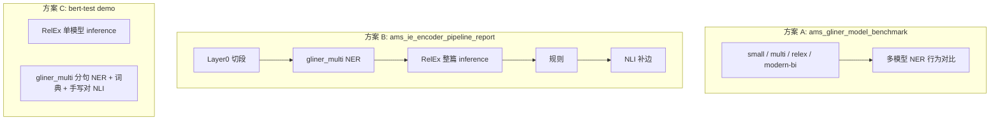

# AMS 记忆：实体关系抽取选型及实验验证报告

| 元数据 | 内容 |
|--------|------|
| 文档类型 | 阶段总结 / 选型与实验验证（**重构加长版**） |
| 关联设计 | 《AMS 语义记忆与情景记忆构建系统 - 完整方案设计》**第 5 章** |
| 关联参考 | `参考资料/BERT或GLiNER替代实体关系抽取.md`、`参考资料/GLiNER-RelEx 开发环境部署资源需求.md`、仓库 `docs/ams-hybrid-extraction.md` |
| 外部参考工程 | 用户本机 `my_tools/bert-test/`（以 `demo_market_payment_ie.py`、`relation_schema.py` 为准；下文引用其**当前文件版本**） |
| 实验资产 | `scripts/ams_ie_encoder_pipeline_report.py`、`data/benchmarks/ams_ie_encoder_pipeline_report.{md,json}`、`scripts/ams_gliner_model_benchmark.py` |
| 版本说明 | 本文档综合截至 **2026-04** 的本地脚本实验、设计文档修订、bert-test 代码审阅与外部文献；模型权重以 Hugging Face 卡页为准 |

---

## 阅读前必读：最终方案是谁？「Layer」到底指什么？

读后面章节若仍觉零散，**优先只看本节三张表**；它们回答你截图里红框列（L1 / RelEx / NLI / Layer3）**在「生产」与「离线脚本」两套语境下各是什么**。

### 1）这是不是 AMS 的「最终方案」？对应哪个方案代号？

**不是。** 截图里的 `ams_ie_encoder_pipeline_report.md` 来自 **本报告第 4 章中的「方案 B」**——仓库脚本 `scripts/ams_ie_encoder_pipeline_report.py` 的 **离线实验管线**，用途是：**把多种 Encoder 信号串在一起打表、写 JSON/Markdown，便于评审与回归**；**默认不写 Neo4j，也不调用 Kimi。**

| 层级 | **AMS 生产/设计主路径**（《完整方案设计》第 5 章 + `docs/ams-hybrid-extraction.md`） | **离线方案 B**（`ams_ie_encoder_pipeline_report.py`） |
|------|----------------------------------------------------------------------------------------|--------------------------------------------------------|
| **定位** | Stage 2 **混合抽取**要上线的逻辑 | **研发用对照实验**，验证 Encoder+RelEx+NLI+规则 **拼在一起长什么样** |
| **Layer 1** | `encoder_gliner`：**GLiNER 系**对 RawBlock 做封闭标签 NER（模型 ID 可配置，默认常为 `gliner_multi`） | **仅指脚本内第一步 NER**：`urchade/gliner_multi-v2.1` 分句 `predict_entities`；**同一脚本里还单独跑 RelEx** |
| **Layer 2** | **规则与轻量工具**：去噪、挂事件、时间等（`apply_layer2_rules`） | 脚本 **没有命名为 Layer2 的块**；RelEx 与 NLI 在文档里记作 **Layer2A / Layer2B**（工程标注，非设计文档章节号） |
| **Layer 3** | **LLM（如 Kimi）**：开放关系、纠错、补漏、事件粒度等 | **只是规则层**：span 占比、关系分数阈、自环丢弃等——**这里完全没有 LLM** |

**结论**：红框里的 **「Layer3 日志」在报告里是「规则过滤日志条数」**；与设计文档里的 **「Layer 3 = LLM 精修」同名不同义**。这是全文最容易混的一点，**不是笔误，是两套命名空间叠在一起**。

### 2）报告管线里每一层白话是什么意思？（只针对方案 B 脚本）

| 名称 | 模型/代码 | 做什么（输入 → 输出） |
|------|-----------|----------------------|
| **Layer0** | 标点切分函数 | 把整段 Raw 文本按 `，,；;\n` 切成多段；**每段单独跑 NER**，再把字符下标加偏移拼回全文。 |
| **Layer1** | `urchade/gliner_multi-v2.1` | **只做实体**：`(span, 实体类型, score)` 列表；本脚本用 **24 类**大标签表。 |
| **RelEx**（文中亦写 Layer2A） | `knowledgator/gliner-relex-multi-v1.0` | **联合抽取**：对**整篇**原文一次 `inference`，同时出 **实体 + 预定义关系边**（14 类关系标签）。**不是**「先跑完 Layer1 再在内部调另一个小模型」的两段产品形态，而是 **单次联合解码**。 |
| **NLI**（文中亦写 Layer2B） | `MoritzLaurer/mDeBERTa-v3-base-xnli-multilingual-nli-2mil7` | **管道式补边**：在 **Layer3 过滤后的 Layer1 实体** 上自动组对，用 **11 条中文假设**（6+2+3）做零样本多类分类，得到额外边。 |
| **Layer3（脚本）** | Python 规则 | **过滤**：例如整段 span 占比过大则 DROP 实体；关系分过低 DROP；自环 DROP。 |

**设计文档里有没有解释？**  
- **有**：第 5 章讲 **生产三层**（Encoder / 规则 / LLM）及任务—模型矩阵。  
- **没有单独一节叫「Layer0」**：那是 **本离线脚本自造的分段层**；要在设计文档里对齐，只能映射到「**预处理 / 分块**」或 RawBlock 策略，而不是再开一个「Layer0」产品模块名。

### 3）为什么读起来「不成体系」？后面文档怎么补的？

| 成因 | 说明 |
|------|------|
| **多套方案叠写** | 方案 A（benchmark）、B（离线报告）、C（bert-test）目标不同，却共用「GLiNER」一词。 |
| **Layer 编号撞车** | 报告 **Layer3=规则** vs 设计 **Layer3=LLM**；读者一眼扫会以为是一套。 |
| **证据分散** | 代码在 `scripts/`、结果在 `data/benchmarks/`、生产说明在 `docs/`、demo 在用户本机 `bert-test/`。 |

**本文已做的结构修补**：本节对照表 + **§4.0 实验资产登记表**（脚本 / 模型 / 逻辑 / 入出 / 用途一行看清）+ 第 5 章 **逐 Case 附原文**。

---

## 摘要

本报告对 AMS **Stage 2 混合抽取**中与「实体 / 关系」相关的技术路线做**可独立阅读**的归纳：先交代 **NLP 学科内 NER、关系抽取、NLI 的经典定义与范式**（含「**联合抽取 ≠ 先实体后关系两阶段**」）；再说明 **GLiNER / GLiNER-RelEx / mDeBERTa-XNLI** 在工程上分别对应哪类范式；然后分三条线总结 **已做实验**——仓库 `ams_gliner_model_benchmark`、`ams_ie_encoder_pipeline_report`、以及 **bert-test 菜市场 demo** 的分支逻辑与**不可直接横向对比**的原因；最后给出设计文档第 5 章修订建议、业界对照与 Encoder 线相对价值的延伸讨论。

**核心结论（可执行）**：

- **理论基础属于 NLP（计算语言学）与深度学习交叉**：任务定义、评测范式来自 NLP；实现为预训练 Transformer 上的判别式建模。
- **Schema 可封闭，自然语言表面形式仍开放**——不能从「AMS 偏封闭域」推出「单一通用 Encoder 端到端金标构图」。
- **GLiNER-RelEx 是「单前向联合抽取」**：一次 `inference` 同时解码实体与关系，**不是**「先跑完 NER 再跑 RE 两个独立模型」的传统两阶段（尽管工程上仍可把它理解成内部多任务头）。
- **bert-test 的菜市场高分 fallback** = **窄标签 + 逗号分句 + 半句禁 PERSON + 可选词典 + 手写实体对 + 8 类 NLI**；与仓库「宽标签 + 自动组对 + 11 类 NLI 假设 + 始终 RelEx」**不是同一科学对照实验**，前者更接近**演示与可行性验证**。

---

## 第 1 章 背景与目标

### 1.1 AMS 里「实体关系抽取」在解决什么问题

AMS 从 **Session**（自然语言对话）与 **Trace**（结构化/半结构化执行日志）中构建 **语义记忆**（EntityNode + 关系）与 **情景记忆**（EventNode + 溯源）。**实体关系抽取**把非结构化文本变成「结点候选 + 有向边候选 + 置信度」，供后续 **schema 校验、写入 Neo4j/Milvus、检索与证据链** 使用。

### 1.2 覆盖范围

| 覆盖 | 不覆盖 |
|------|--------|
| NER / span、预定义关系、NLI 零样本关系、联合抽取范式 | Foresight 全链路数学证明 |
| 多模型对比、离线报告脚本、bert-test 审阅结论 | 云 API SLA、多租户计费细则 |

### 1.3 与《完整方案设计》第 5 章的关系

第 5 章的 **「Encoder 打底 + LLM 精修」** 仍成立，但 **「Layer1+2 覆盖 60–70%」** 一类全局数字需改为 **分数据源、分语言** 陈述；本文第 2–4 章提供理论支撑，第 6–8 章提供实验与案例支撑，第 10 章给出对第 5 章的**逐条修订建议**。

**读设计文档第 5 章时务必搭配**：本文 **「阅读前必读」**——否则容易把 **离线报告脚本里的「Layer3」** 误当成 **设计文档里的「Layer 3 LLM」**。

---

## 第 2 章 学科定位与 NLP 基础：NER、关系抽取、NLI 到底在说什么

### 2.1 这些知识算哪门学科？

| 层次 | 名称 | 说明 |
|------|------|------|
| **上层** | **自然语言处理（NLP）** / **计算语言学** | 研究「如何让计算机处理人类语言」：分词、句法、语义、信息抽取、机器翻译等。**NER、关系抽取、NLI 的经典任务定义与评测协议（CoNLL、TACRED、SNLI/MNLI/XNLI 等）都属于 NLP。** |
| **方法层** | **机器学习 / 深度学习** | 用数据驱动模型；BERT、GLiNER 等是 **表示学习 + 判别头** 的实现手段。 |
| **工程层** | **MLOps、推理服务** | 批大小、显存、延迟、降级——本报告第 3、6 章会触及，但不替代 ML 理论课。 |

**一句话**：读者可以把本报告中的「原理」主要归为 **NLP 任务定义 + 深度学习实现**；AMS 选型讨论站在 **信息抽取（IE）** 子领域。

### 2.2 NER（命名实体识别）在 NLP 里的位置

**任务**：在输入文本中标出 **实体 mention**（通常为 **连续 span**）及其 **类型**（人名、地点、组织、工具……）。

**经典实现演进（极简脉络）**：

| 阶段 | 思路 | 输出形式 |
|------|------|----------|
| 统计时代 | HMM/CRF + 人工特征 | 序列标签（BIO/BMES：B-PER、I-PER…） |
| 深度学习早期 | BiLSTM-CRF | 仍多为逐 token 标签，再还原 span |
| BERT 时代 | Token 级分类 + 启发式拼 span；或 **span 分类器**（枚举候选 span 打分） | `(start, end, type, score)` |
| **GLiNER** | 用 **实体类型描述** 与 **文本** 在统一空间匹配（论文称 generalist；工程上常称零样本/开放类型 NER） | 同上，类型由调用方传入的 **字符串标签列表** 决定 |

**与「分词」的关系**：中文经典流水线曾是 **分词 → NER**；现代 Transformer 多走 **子词（BPE/SentencePiece）**，**不显式分词**也可做 NER。AMS 里常见的是 **按标点切段** 再送 GLiNER，属于 **分段（segmentation）** 工程技巧，**不是**传统分词模块。

### 2.3 关系抽取（RE）在 NLP 里的两种主流范式（重点）

很多工程同事会自然联想：**「是不是先 NER 出实体，再两两配对做关系分类？」**——这是 **管道式（pipeline）关系抽取**，在学术界与工业界都非常常见，**但并不是唯一形态**。

| 范式 | 流程 | 特点 |
|------|------|------|
| **管道式** | **NER → 候选实体对生成 → 关系分类器**（BERT 句对分类、logistic、指针网络等） | 模块清晰；**错误传播**（NER 漏实体则关系必漏）；两阶段延迟相加。 |
| **联合抽取（Joint extraction）** | **单模型、单次（或共享编码的少次）前向**，同时预测实体边界/类型与实体间关系 | 缓解管道误差传递；关系头可直接 attend 原文；**GLiNER-RelEx 的 `inference(..., return_relations=True)` 属于此类「一次成型」联合解码**。 |

**因此**：当文档写「RelEx 一次推理出实体+关系」时，含义是 **联合抽取**，**不要**把它理解成「内部先完整跑一遍 NER 再跑一遍独立 RE 模型」——实现上可能是 **多任务头共享 backbone**，对调用者而言就是 **一次 `inference`**。

**另**：AMS 实验脚本里还有 **「NER（gliner_multi）+ NLI（mDeBERTa）」** 路径——这是 **管道式**：**实体来自 NER**，**关系来自对实体对的 NLI 多类分类**，与 RelEx 联合抽取 **并列存在**，用于对照与补边，而不是「RelEx 的内部阶段」。

### 2.4 NLI（自然语言推理）在 NLP 里的位置与本报告中的用法

**经典 NLI 任务**：给定 **前提 P（premise）** 与 **假设 H（hypothesis）**，判断 **蕴含 / 中立 / 矛盾**（或三分类 logits）。数据集如 **SNLI、MNLI**；多语言扩展如 **XNLI**。

**在关系抽取中的「借用」**：固定 P 为 **整句或子句**，为每个关系类型构造一条 **中文模板假设**（如「h 通过 t 完成支付」），把 **多条假设** 送进已在 NLI 上微调过的编码器（如 **mDeBERTa-v3-base-xnli-multilingual**），取 **与 P 最「兼容」的一条假设** 对应的关系 code。这在 Hugging Face 里常表现为 `pipeline("zero-shot-classification", ...)`。

**重要歧义**：产品文档里写「NLI 推理」容易让人联想到 **符号推理或 CoT**——此处 **仍是神经网络软匹配**，受 **模板措辞、前提长度、实体是否在前提中共现** 强烈影响；**不是**可证明完备的逻辑推理器。

### 2.5 Span、实体对、前提句：用一句中文把概念钉死

**句子**：`张三在上海用支付宝付了十元。`

| 概念 | 在本句中的直观对应 |
|------|-------------------|
| **Span** | 子串 `张三`、`上海`、`支付宝`、`十元` 各自对应 `[start:end)` |
| **NER 输出** | `(张三, PERSON)`、`(上海, LOCATION)` … |
| **实体对（用于关系）** | 如 `(张三, 支付宝)`——**谁和谁**要由 NER、规则或手写列表提供 |
| **NLI 前提 P** | 常取整句；也可取子句（策略不同则结果不同） |
| **NLI 假设** | 多条模板句中与 `PAID_WITH` 对应的那条若得分最高，则预测 `PAID_WITH(张三, 支付宝)` |

### 2.6 NLI 训练目标 vs 本报告中的「关系零样本」用法（避免概念混淆）

| 维度 | 经典 NLI（如 XNLI 评测） | 本仓库 / bert-test 中的用法 |
|------|-------------------------|----------------------------|
| 训练信号 | 大量 **(P, H, label)** 三元组，label 常为 **蕴含/中立/矛盾** | 使用 **已在 NLI 上微调好的编码器** 作为 **句子对编码器** |
| 推理时假设空间 | 数据集中给出的 H | **人为构造的 K 条模板句**（K = 关系类型数） |
| 输出 | 三分类概率 | **K 选一**（取与 P 最匹配的假设），映射到 **业务关系 code** |
| 风险 | — | **模板措辞偏差**、**P 过长**、**h/t 未在 P 共现** 会导致分数 **不可校准为「真实概率」** |

**结论**：此处「NLI」指 **NLP 里 NLI 任务训练出来的权重被复用于关系分类**，属于 **方法迁移**；评审时不应把它与 **符号逻辑推理** 或 **LLM CoT** 混为一谈。

### 2.7 bert-test `relation_schema.py`：8 类关系对应的中文假设模板（占位符 h、t）

以下由代码 `build_pair_hypotheses_with_market_extensions` 生成（**h、t 为实体字符串**），顺序与 `codes` 数组严格对齐：

| # | 关系 code | 假设句模式（语义摘要） |
|---|-----------|------------------------|
| 1 | USES | h 使用工具或库 t。 |
| 2 | INVOKES | h 调用或执行子工具、方法 t。 |
| 3 | PRODUCES | h 产生或输出制品 t。 |
| 4 | MENTIONS | h 在会话中提及 t。 |
| 5 | RELATES_TO | h 与 t 存在通用语义上的关联。 |
| 6 | CAUSED_BY | h 由 t 导致；t 是 h 的原因。 |
| 7 | BUY_AT | h 在 t 购买或前往 t 进行交易。 |
| 8 | PAID_WITH | h 通过 t 完成支付或付款。 |

**说明**：bert-test 的 NLI **仅 8 类**；仓库 `ams_ie_encoder_pipeline_report` 在 6+2 之外还拼接了 **航班相关 3 类假设**（共 **11** 条），与 bert-test **不对齐**，比较 NLI 边时需心里有数。

### 2.8 管道式关系抽取中的「错误传播」（与联合抽取对照）

若采用 **NER → 组对 → 关系分类**：

1. NER **漏检** → 该实体不参与组对 → 关系 **必漏**。
2. NER **错边界**（span 过长）→ 关系分类器看到的「实体表面形式」错误 → 关系 **可能错**。
3. **候选对爆炸** → 需 **近邻窗口、句法约束、共现窗口** 等工程剪枝。

**联合抽取（RelEx）** 在 **单次共享编码** 下同时优化实体与关系子任务，**理论上**可缓解「关系头完全看不到被 NER 漏掉的 token」的问题——但 **不保证** 在任意域上超过精心调参的管道式；**实测** 仍会出现 **关系类型在非训练域句式上串味**（如技术句上的 `FLIES_FROM`）。

---

## 第 3 章 Transformer 架构、GLiNER 家族与 small / multi / large

### 3.1 三种 Transformer 架构与任务适配（保留设计文档论点）

| 架构 | 代表 | 注意力 | 擅长 |
|------|------|--------|------|
| Encoder-only | BERT、DeBERTa、ModernBERT、GLiNER 骨干 | 双向 | 分类、序列标注、**span/句对** 判别 |
| Decoder-only | GPT | 因果单向 | 生成、长链推理 |
| Encoder-Decoder | T5、BART | 编码双向 + 解码单向 | 生成式摘要、生成式抽取 |

**对 IE 的推论**：**边界与类型判别** 往往更吃双向上下文；**开放生成与 Foresight** 仍宜 Decoder-only LLM。与设计文档第 5 章表一致。

### 3.2 本阶段涉及的「几条不同的 GLiNER 权重」——不要混为一谈

| Hugging Face ID | 常见定位 | 参数量级（约） | 与 AMS 实验的关联 |
|-----------------|----------|----------------|------------------|
| `urchade/gliner_small-v2.1` | 更小骨干，**更快** | 小 | benchmark：**中文长 span 误标更重** |
| `urchade/gliner_multi-v2.1` | **多语言** 强化 | ~200M 级 | 仓库 Layer1 默认、报告脚本 Layer1 |
| `knowledgator/gliner-relex-multi-v1.0` | **联合实体+关系**（mDeBERTa-v3-base 量级） | ~86M | **一次 `inference`**；亦可只当 NER 用（`predict_entities`） |
| `knowledgator/modern-gliner-bi-base-v1.0` | **Bi-encoder**、长上下文（8192）、标签可预计算 | ~350M 级 | benchmark：**长块显存涨**、英文可更保守 |

**small vs multi（经验归纳，非定理）**：

- **small**：延迟低，但在 **短中文 + 宽标签** 上更容易出现 **「整句当一个实体」** 或 **「把半句当 PERSON」**。
- **multi**：多语数据配比不同，**同一阈值** 下对中文有时 **更保守（无命中）**——在评测上可能「少误标」也可能「少召回」，需与业务阈值、标签集合联调。

**「large」在 Knowledgator 产品线语境**：常指 **ModernBERT-large** 等更大骨干的 GLiNER/RelEx 变体（见仓库参考文档 `GLiNER-RelEx 开发环境部署资源需求.md`）。**参数量↑ → 通常容量↑，但推理成本与显存↑**；是否与「中文短句」正相关需 **单独测**，不能由英文结论外推。

### 3.3 GLiNER（纯 NER）与 GLiNER-RelEx（联合）在调用上的区别（工程视角）

| 能力 | 典型 API 形态 | 范式 |
|------|---------------|------|
| 仅实体 | `predict_entities(text, labels, threshold=…)` | **NER** |
| 实体+关系 | `inference(texts=[…], labels=…, relations=…, return_relations=True)` | **联合抽取** |

**bert-test** 中 `run_relex` 分支即调用 **`inference`**；fallback 分支则 **只用 `predict_entities`**（经 `ner_by_clauses` 包装），关系交给 **NLI**。

---

## 第 4 章 实验与方案总览：我们到底测了几套「东西」

### 4.0 实验资产登记表（历史测试「一行一实验」）

回答「有没有对应、能不能只给脚本/模型/逻辑/入出/解释」——**可以**；下表就是按该粒度登记的**权威索引**（与 §阅读前必读方案代号一致）。更细的 Case 级原文见 **第 5 章**。

| 脚本或入口 | 方案代号 | 使用模型（核心） | 抽取逻辑（简述） | 典型输入 | 典型输出 | 效果与用途（简述） |
|------------|----------|------------------|------------------|----------|----------|--------------------|
| `scripts/ams_gliner_model_benchmark.py` | **A** | `gliner_small-v2.1`、`gliner_multi-v2.1`、`gliner-relex-multi-v1.0`、`modern-gliner-bi-base-v1.0` 等 | 在**相同标签与阈值**下对比 **NER** 行为（`predict_entities` 为主） | 脚本内置或 CLI 传入的中/英短句 | 控制台对比打印 | 看 **中文长 span / 整句 City** 与 **英文** 的差异趋势，服务 `AMS_GLINER_*` 调参与选型 |
| `scripts/ams_ie_encoder_pipeline_report.py` | **B** | NER：`urchade/gliner_multi-v2.1`；RelEx：`knowledgator/gliner-relex-multi-v1.0`；NLI：`MoritzLaurer/mDeBERTa-v3-base-xnli-multilingual-nli-2mil7` | **Layer0 切段 → L1 NER → RelEx 整篇联合 → 规则 → NLI 自动组对补边**；不写库 | `_default_samples()` 九条固定句（见第 5 章） | `data/benchmarks/ams_ie_encoder_pipeline_report.md`、`.json` | **离线留档**：各层信号长什么样；**≠生产混合三层**（见阅读前必读） |
| `my_tools/bert-test/demo_market_payment_ie.py` | **C1** | `knowledgator/gliner-relex-multi-v1.0` | 单句 **`inference`**：实体+关系一次出 | 脚本内 `TEXT`（菜市场+支付长句） | 终端：RelEx 实体/关系块 | 验证 **联合抽取** 在**窄标签**单句上的形态（需本机已缓存 RelEx） |
| 同上，`run_fallback_ner_nli` 分支 | **C2** | NER：`urchade/gliner_multi-v2.1`；NLI：同上 mDeBERTa | **分句 NER**（逗号两半、右半禁 PERSON）→ 可选 **词典锚点** → **手写 7 组实体对** → **`relation_schema` 8 类 NLI** | 同上 `TEXT` | 终端：实体表 + NLI 关系表 | **演示向**：单句上展示「分句+窄标签+NLI」表达能力；**词典与手写对不可当生产泛化** |

**与「历史聊天」的对应**：你在对话里整理的结论（菜市场 demo、联合 vs 管道、Layer3 撞名等）已固化到 **阅读前必读**、**§4.0** 与 **第 5 章**；若还要链到具体某次聊天，建议在版本控制系统里用 **PR/Commit 消息** 引用，而不是把聊天记录全文贴进设计库。

### 4.1 总览矩阵（回答「什么模型干什么」）

| 方案 ID | 代码位置 | **实体** 用的模型 / 方式 | **关系** 用的模型 / 方式 | 范式 | 主要目的 |
|---------|-----------|--------------------------|---------------------------|------|----------|
| **A** | `scripts/ams_gliner_model_benchmark.py` | `gliner_small` / `gliner_multi` / `gliner-relex-multi` / `modern-gliner-bi-base` 的 **NER** | 同一脚本以 **实体对比** 为主（见 `docs/ams-hybrid-extraction.md`） | 多模型 **NER** 对照 | 选型、长 span、中文极短句行为 |
| **B** | `scripts/ams_ie_encoder_pipeline_report.py` | **`gliner_multi` 分句 NER** | **`gliner-relex-multi` 整篇 `inference`** + **`mDeBERTa-xnli-multilingual` 对实体对零样本分类** + 规则层 | **联合 + 管道 NLI 并联**（工程串联） | 分层行为可视化、写 JSON/MD 报告 |
| **C1** | bert-test `demo_market_payment_ie.py` → `run_relex` | **`gliner-relex-multi`** | **同一模型 `inference`** | **联合抽取** | 单句支付域演示（需本地 RelEx 缓存） |
| **C2** | bert-test → `run_fallback_ner_nli` | **`gliner_multi` + `ner_by_clauses`**（逗号两半、右半去掉 PERSON、降阈） | **无 RelEx**；**`mDeBERTa-xnli` + `relation_schema` 8 类** | **管道：NER 后 NLI**；实体对 **手写 7 组** | 单句上展示 NLI 表达能力；**强先验** |

**关键辨析**：

- **B** 不是「纯联合」：它是 **L1 NER（multi）** 与 **L2A RelEx（联合）** 与 **L2B NLI** 的 **三条信号叠在同一文档上**；与 **C1 纯 RelEx** 或 **C2 纯 NER+NLI** 的 **科学对照** 需固定标签、固定实体来源、固定对生成策略后才能谈。
- **C2** 中 **词典 `_lexicon_entities`** 在「仅 1 个大块实体」时注入 **支付宝/花呗/苹果…**——这是 **确定性规则**，**不是** GLiNER 的 zero-shot 泛化；**手写 `pairs`** 同理。

### 4.2 bert-test `demo_market_payment_ie.py` 数据流（审阅版，与当前文件一致）

**固定测试句**（脚本内 `TEXT`）：

`我今天去菜市场买了2个苹果40块钱，是用我的苹果手机里的支付宝的花呗支付的`

**分支一：`run_relex` 成功**（本地已 `snapshot_download` RelEx 权重）

- 加载 `knowledgator/gliner-relex-multi-v1.0`。
- 一次 `model.inference(texts=TEXT, labels=ENTITY_LABELS, relations=RELATION_LABELS, threshold=0.35, relation_threshold=0.4, return_relations=True, flat_ner=True)`。
- **实体标签** 仅 7 类：`PERSON, LOCATION, COMMODITY, MONEY, DEVICE, APP, PAYMENT_SERVICE`。
- **关系标签** 为 `relation_codes_with_market_extensions()` → **6 基础 + BUY_AT + PAID_WITH = 8 类**（与 `relation_schema.py` 一致）。

**分支二：RelEx 未缓存或你希望走 fallback**（历史上曾用 `run_relex` 首行 `return False` 强制；**当前仓库外文件已恢复为「无缓存则 False」逻辑**）

1. **NER**：`urchade/gliner_multi-v2.1`，`ner_by_clauses`：以 **中文逗号 `，`** 切成 **左半句 / 右半句**；左半用完整标签；右半 **移除 PERSON** 且 **threshold 降为 max(0.15, base-0.08)**，减轻「支付半句糊成一个人名实体」。
2. **词典补全**：若 `len(ents)<=1` 且唯一实体 span 长度 **>12**，则 `_lexicon_entities` 用 `str.find` 注入 **苹果手机、支付宝、花呗、菜市场、40块钱、水果苹果、我** 等，`_source=lexicon`。
3. **NLI**：`MoritzLaurer/mDeBERTa-v3-base-xnli-multilingual-nli-2mil7`，`hypothesis_template="这句话说明：{}"`；对 **手写** 的 7 组 `(head, tail, note)` 逐对调用 `predict_relation_zero_shot_market_extended`（内部 **8 条中文假设** 与 8 个 code 对齐）。

### 4.3 仓库 `ams_ie_encoder_pipeline_report.py` 数据流（摘要）

| 阶段 | 内容 |
|------|------|
| Layer0 | 多标点切段 `，,；;\n` |
| Layer1 | **`gliner_multi`**，**24 类实体标签**（AMS+benchmark 合并大表） |
| Layer2A | **`gliner-relex-multi` 整篇 `inference`**，**14 类关系**（含航班扩展） |
| Layer3 | 实体 span 占全文比例、关系分数、自环等 |
| NLI | 实体对来自 **Layer3 后 L1 实体** 的 **近邻自动组对**；假设为 **6+2+3** 类（较 bert-test **多 3 条航班相关**）；premise 为 **全文** |

**与 C2 的核心差异**（解释「为什么菜市场 case 报告里不如 demo 好看」）：

| 维度 | bert-test C2 | 仓库报告 B |
|------|----------------|------------|
| 实体标签数 | **7** | **24** |
| 半句禁 PERSON | **有** | **无** |
| 词典 | **有** | **无** |
| NLI 实体对 | **手写** | **自动近邻**；且 **L1 仅 1 实体时 NLI 边数为 0** |
| NLI 类数 | **8** | **11** |

### 4.4 `ams_gliner_model_benchmark` 结论摘要（同阈值趋势）

详见 `docs/ams-hybrid-extraction.md`。与设计文档第 5 章 **「中文 GLiNER 实测修正」** 一致的核心观察：

- **「上海今天天气怎么样」**：多 checkpoint 仍倾向 **整句当地名/城市类 span**——需 **规则占比过滤**（仓库 `AMS_GLINER_MAX_SPAN_BLOCK_FRACTION` 等），不能单靠换 small/multi。
- **「我有10万闲钱…」**：**multi/relex** 可出现 **0 命中**（少误标）；**small** 更易 **长 span 当人名**。

### 4.5 一次 `ams_ie_encoder_pipeline_report` 运行的 meta 快照

| 字段 | 示例值 |
|------|--------|
| `ner_model` | `urchade/gliner_multi-v2.1` |
| `relex_model` | `knowledgator/gliner-relex-multi-v1.0` |
| `nli_model` | `MoritzLaurer/mDeBERTa-v3-base-xnli-multilingual-nli-2mil7` |
| `ner_threshold` | 0.32 |
| `relex_threshold` / `relex_rel_threshold` | 0.35 / 0.40 |
| `entity_label_count` / `relation_label_count` | 24 / 14 |

### 4.6 与生产路径 `docs/ams-hybrid-extraction.md` 的对照

生产 **Layer1** 对应 `encoder_gliner`；**Layer2** 规则；**Layer3** Kimi。离线报告脚本 **不写库**、且 **串联 NLI**，用于研发对照而 **不等于** 线上 hybrid 的唯一形态。



---

## 第 5 章 典型 Case（含原文与可溯源输出）

本章解决「只有 `sample_id`、无法对照句子与模型输出」的问题：**每条先给原文与溯源位置**，再给 **Layer0 / Layer1 / RelEx / NLI / Layer3** 的可核对摘录。

### 5.0 溯源与复现约定

| 项 | 路径或说明 |
|----|------------|
| **样例定义（金句原文）** | `scripts/ams_ie_encoder_pipeline_report.py` 内 `_default_samples()`（约第 377–409 行）三元组 `(sample_id, 描述, text)` |
| **流水线逻辑** | `scripts/ams_ie_encoder_pipeline_report.py` 中 `run_one`、各 Layer 函数 |
| **一次固定运行的逐字报告** | `data/benchmarks/ams_ie_encoder_pipeline_report.md`（人类读）、同目录 `ams_ie_encoder_pipeline_report.json`（机器读） |
| **下文摘录来源** | 以 **2026-04-15T01:24:38Z** 那次生成的 `ams_ie_encoder_pipeline_report.md` 为准；你本地复跑后 **分数与条数可能微变**，但 **句式级现象** 应与下文一致 |

**索引表（跳转到 §5.3 小节）**：

| sample_id | 标题 | 见 |
|-----------|------|-----|
| zh_weather | 中文极短问天气 | §5.3.1 |
| zh_money | 中文理财短句 | §5.3.2 |
| zh_lend | 中文借贷 | §5.3.3 |
| en_flight | 英文订票 | §5.3.4 |
| en_code_mixed | 英文技术+业务混写 | §5.3.5 |
| mixed_dialogue | 中英混聊 | §5.3.6 |
| market_payment | 菜市场+支付长句 | §5.3.7 |
| pandas_csv | 工具对话 | §5.3.8 |
| trace_invoke | Trace 调用链 | §5.3.9 |

### 5.1 总览：原文 + Layer0 切段（与脚本字符串一致）

**说明**：`zh_money` / `zh_lend` 在脚本里使用 **英文逗号 `,`** 作为分隔，Layer0 会切成两段；`market_payment` / `pandas_csv` / `trace_invoke` 使用 **中文逗号 `，`**。

| sample_id      | 标题        | 原文（完整字符串，与 `_default_samples()` 一致）                                                                                             | Layer0 段（来自报告 md）                                              |
| -------------- | --------- | ------------------------------------------------------------------------------------------------------------------------------- | -------------------------------------------------------------- |
| zh_weather     | 中文极短问天气   | `上海今天天气怎么样`                                                                                                                     | 1 段：整句                                                         |
| zh_money       | 中文理财短句    | `我有10万闲钱,想做稳健理财`                                                                                                                | `我有10万闲钱` \| `想做稳健理财`                                          |
| zh_lend        | 中文借贷      | `我有10万块钱,想借给葛瑞刚`                                                                                                                | `我有10万块钱` \| `想借给葛瑞刚`                                          |
| en_flight      | 英文订票      | `Book a flight from Shanghai to Beijing tomorrow morning.`                                                                      | 1 段：整句                                                         |
| en_code_mixed  | 英文技术+业务混写 | `The user in our Shanghai office called the LangChain API from Python; tomorrow we ship a prod hotfix for the billing service.` | 以 `;` 分为两段（报告 md 中可见）                                          |
| mixed_dialogue | 中英混聊      | `Melanie said the lake sunrise painting was from last year. Caroline 觉得色彩融合很好,还问下周是否一起去 museum 看展。`                             | 以 `,` 分为两段（报告 md 中可见）                                          |
| market_payment | 菜市场+支付长句  | `我今天去菜市场买了2个苹果40块钱，是用我的苹果手机里的支付宝的花呗支付的`                                                                                         | `我今天去菜市场买了2个苹果40块钱` \| `是用我的苹果手机里的支付宝的花呗支付的`                   |
| pandas_csv     | 工具对话      | `Turn 1 - 用户：我用 pandas 处理了一个 CSV，有个列的类型识别有问题。`                                                                                  | `Turn 1 - 用户：我用 pandas 处理了一个 CSV` \| `有个列的类型识别有问题。`            |
| trace_invoke   | Trace 调用链 | `Agent 通过 python_executor 运行脚本，内部进一步调用了 read_excel 读取表格。`                                                                       | `Agent 通过 python_executor 运行脚本` \| `内部进一步调用了 read_excel 读取表格。` |

### 5.2 汇总表（同一次运行；与 §5.3 细节一致）

| sample_id | L1实体 | RelEx实体 | RelEx关系(过阈) | NLI边(≥0.32) | Layer3实体日志 | Layer3关系日志 | errors |
|-----------|--------|-----------|-----------------|--------------|------------------|------------------|--------|
| zh_weather | 1 | 1 | 0 | 0 | 1 | 0 | 0 |
| zh_money | 0 | 1 | 0 | 0 | 0 | 0 | 0 |
| zh_lend | 0 | 1 | 0 | 0 | 0 | 0 | 0 |
| en_flight | 4 | 6 | 5 | 5 | 0 | 0 | 0 |
| en_code_mixed | 6 | 8 | 6 | 6 | 0 | 1 | 0 |
| mixed_dialogue | 5 | 5 | 1 | 6 | 0 | 0 | 0 |
| market_payment | 1 | 1 | 0 | 0 | 1 | 0 | 0 |
| pandas_csv | 2 | 3 | 1 | 1 | 0 | 0 | 0 |
| trace_invoke | 3 | 4 | 3 | 3 | 0 | 0 | 0 |

### 5.3 逐 Case 摘录（便于与 `ams_ie_encoder_pipeline_report.md` 对读）

以下每条结构统一：**原文** → **Layer1（gliner_multi）** → **RelEx（过 Layer3 分数闸后列出的边）** → **NLI（≥0.32）** → **Layer3 日志**。RelEx 在报告中先列原始再展示 `relations_final`；此处 **关系行与报告「逐条结果」中打印的边** 对齐（含分数）。

#### 5.3.1 `zh_weather` — 中文极短问天气

- **原文**：`上海今天天气怎么样`
- **Layer1**：`[上海今天天气怎么样]` → **CITY**，score≈0.860，span `[0:9]`（**整句**）
- **RelEx**：实体 1，关系 0（报告中无关系行）
- **NLI**：0 条（实体经 Layer3 后无可行对或未满阈）
- **Layer3**：`DROP span covers 1.00 of text: [上海今天天气怎么样] CITY`
- **小结**：期望的「上海」细粒度城名未出现；**规则宁可全丢**也不入库整句 CITY。

#### 5.3.2 `zh_money` — 中文理财短句

- **原文**：`我有10万闲钱,想做稳健理财`
- **Layer1**：**0** 个实体
- **RelEx**：实体数 1，关系数 0（报告中未展开该单实体文本，现象为 **无结构化关系**）
- **NLI**：0
- **Layer3**：无
- **小结**：短中文 + **24 类宽标签** 下 **gliner_multi 不激活**；与「中文无信息」不同，是 **模型—标签—阈值** 组合结果。

#### 5.3.3 `zh_lend` — 中文借贷

- **原文**：`我有10万块钱,想借给葛瑞刚`
- **Layer1**：**0** 个实体
- **RelEx**：实体 1，关系 0
- **NLI**：0
- **Layer3**：无
- **小结**：与 `zh_money` 同类；人名「葛瑞刚」等 **未以 PERSON span 稳定出现**（于该次运行）。

#### 5.3.4 `en_flight` — 英文订票

- **原文**：`Book a flight from Shanghai to Beijing tomorrow morning.`
- **Layer1**：`[flight]` TRANSPORT；`[Shanghai]` `[Beijing]` CITY；`[tomorrow morning]` DATE（分数见报告 md）
- **RelEx（示例边，报告中 relations_final 前几条）**：`Book --[SCHEDULED_ON]--> morning`；`flight --[FLIES_FROM]--> Shanghai`；`flight --[FLIES_TO]--> Beijing`；`flight --[SCHEDULED_ON]--> tomorrow`；`flight --[SCHEDULED_ON]--> morning`（余略）
- **NLI（≥0.32，共 5 条）**：`flight→Shanghai` RELATES_TO；`flight→Beijing` RELATES_TO；`flight→tomorrow morning` RELATES_TO；`Shanghai→tomorrow morning` RELATES_TO；`Beijing→tomorrow morning` RELATES_TO
- **Layer3**：无实体/关系丢弃日志（该条）
- **小结**：**行程域与 RelEx 关系类型对齐较好**；NLI 自动对带来 **偏多弱关联边**。

#### 5.3.5 `en_code_mixed` — 英文技术+业务混写

- **原文**：`The user in our Shanghai office called the LangChain API from Python; tomorrow we ship a prod hotfix for the billing service.`
- **Layer1**：`user` PERSON；`Shanghai` CITY；`LangChain API` API；`tomorrow` DATE；`prod` PRODUCT；`billing service` PAYMENT_SERVICE
- **RelEx（摘录）**：`user --[LOCATED_IN]--> Shanghai office`；`user --[WORKS_AT]--> Shanghai office`；`user --[USES]--> LangChain API`；**`LangChain API --[FLIES_FROM]--> Python`（0.852）**；`we --[PRODUCES]--> prod hotfix`；`prod hotfix --[FLIES_TO]--> billing service`
- **NLI（≥0.32，6 条）**：含 `user→Shanghai` RELATES_TO；`user→LangChain API` MENTIONS；`Shanghai→tomorrow` RELATES_TO；`LangChain API→prod` MENTIONS；`tomorrow→prod` RELATES_TO；`prod→billing service` MENTIONS
- **Layer3**：`DROP self-loop rel SCHEDULED_ON [tomorrow]`
- **小结**：**USES / LOCATED_IN** 合理；**FLIES_*** 出现在 **API 与 Python** 之间为 **关系类型串味** 典型样例。

#### 5.3.6 `mixed_dialogue` — 中英混聊

- **原文**：`Melanie said the lake sunrise painting was from last year. Caroline 觉得色彩融合很好,还问下周是否一起去 museum 看展。`
- **Layer1**：`Melanie` `Caroline` PERSON；`lake sunrise painting` ARTIFACT；`last year` DATE；`museum` ORGANIZATION
- **RelEx（过阈边摘录）**：`lake sunrise painting --[FLIES_FROM]--> last year`（0.509）
- **NLI（≥0.32，6 条）**：多条 **SCHEDULED_ON**（如 `Melanie→lake sunrise painting`、`Caroline→museum` 等）及 `last year→museum` RELATES_TO
- **Layer3**：无
- **小结**：**SCHEDULED_ON** 在闲聊/艺术语境被 **模板激活过度**；`museum` 标为 ORGANIZATION 可商榷。

#### 5.3.7 `market_payment` — 菜市场+支付长句（与 bert-test 句型同源、管线不同）

- **原文**：`我今天去菜市场买了2个苹果40块钱，是用我的苹果手机里的支付宝的花呗支付的`
- **Layer1**：仅 `[我今天去菜市场买了2个苹果40块钱]` → **PERSON**，score≈0.554，span 长 17 字
- **RelEx**：实体 1，关系 0
- **NLI**：**0**（**仅 1 个 L1 实体 → 无法形成实体对**）
- **Layer3**：`WARN long PERSON zh [...] len=17`
- **小结**：与 bert-test **手写实体对 + 词典** 路径对比时，必须说明 **本管线无词典、无手写对、且未禁右半 PERSON**（见主报告第 4 章方案矩阵）。

#### 5.3.8 `pandas_csv` — 工具对话

- **原文**：`Turn 1 - 用户：我用 pandas 处理了一个 CSV，有个列的类型识别有问题。`
- **Layer1**：`用户` PERSON；`pandas` SOFTWARE
- **RelEx**：`用户 --[USES]--> pandas`（0.620）
- **NLI**：`用户 → pandas` **MENTIONS**（0.365）
- **Layer3**：无
- **小结**：**短句 + 显式动词「用」** → Encoder **最稳** 锚点之一。

#### 5.3.9 `trace_invoke` — Trace 调用链

- **原文**：`Agent 通过 python_executor 运行脚本，内部进一步调用了 read_excel 读取表格。`
- **Layer1**：`Agent` `python_executor` `read_excel`（报告中均为 **API** 类型，分数见 md）
- **RelEx（摘录）**：`Agent --[USES]--> python_executor`；`Agent --[USES]--> read_excel`；**`内部进一步调用了 --[USES]--> read_excel`（0.431）**
- **NLI（≥0.32，3 条）**：`Agent→python_executor`、`Agent→read_excel`、`python_executor→read_excel` 均为 RELATES_TO
- **Layer3**：无
- **小结**：主调用链 **清晰**；**中文动词短语** 被当作 **head 实体** 是 **NER 无句法过滤** 的典型噪声边。

### 5.4 定性对照（与 §5.3 不重复罗列 ID）

| 观察维度 | 代表 sample_id |
|----------|----------------|
| 整句当地名/城名 | zh_weather |
| 中文短句零 L1 | zh_money、zh_lend |
| 英文行程 + 稠 NLI | en_flight |
| 关系类型串味 | en_code_mixed（`FLIES_FROM`→Python） |
| 日程模板过激活 | mixed_dialogue |
| 单实体导致 NLI 空 | market_payment |
| Encoder 舒适区 | pandas_csv |
| 中文碎片噪声头实体 | trace_invoke |

---

## 第 6 章 根因归纳（排障用）

| 根因 | 工程响应 |
|------|----------|
| 零样本 + 标签过多 | 按租户/数据源 **拆标签子集**；控制 `AMS_GLINER_LABELS` |
| 整句 span | `AMS_GLINER_MAX_SPAN_BLOCK_FRACTION`、短块策略 |
| 联合关系类型串味 | **按数据源禁用部分关系**（如技术块禁用 FLIES_*） |
| NLI 依赖实体对 | **RelEx∪L1 并集**、子句内组对、或 LLM |
| 演示词典/手写对 | 仅 smoke test；生产需 **配置化 + `_source` 审计** |

---

## 第 7 章 业界做法与文献入口

| 做法 | AMS 映射 |
|------|----------|
| 混合：规则/句法/小模型 + LLM | 第 5 章总架构；中文加权 LLM |
| 本体约束写入 | Schema + API 校验 |
| 非 LLM 构图 baseline | Encoder 候选 + 依赖路径类方法（见 GraphRAG 类论文） |

链接：

- [GLiNER NAACL 2024](https://aclanthology.org/2024.naacl-long.300.pdf)
- [GLiNER bi-encoder 报告](https://arxiv.org/pdf/2602.18487)
- [Practical GraphRAG 示例](https://arxiv.org/html/2507.03226v3)
- [混合 KG OpenReview 示例](https://openreview.net/pdf?id=NiUl3EkvIW)

---

## 第 8 章 推荐方案与对《完整方案设计》第 5 章的修订建议

### 8.1 总原则

- **候选与提交分离**；Encoder 输出默认 **candidates**。
- **分数据源配置**：Trace 偏重 Encoder；中文 Session 偏重 LLM。
- **明确写清「联合抽取 vs 管道 NLI」**：避免读者以为 RelEx 内部是「两阶段独立模型串行」。

### 8.2 对第 5 章建议修订表

| 位置 | 建议 |
|------|------|
| 5.1 矩阵 | 为「NER 最佳 Encoder」增加 **语言/标签集条件脚注** |
| 5.2 覆盖 60–70% | 改为 **分数据源实测区间** + 引用本文第 5.2 表 |
| 5.3 RelEx | 强调 **联合一次 `inference`**；补充 **非行程域关系串味** 与 **白名单** |
| 5.6 阶段规划 | 增加 **pandas_csv / trace_invoke 回归** 与 **中文金融弱项** 跟踪 |
| 5.10 选型表 | 增加 **本地 7B–8B LLM** 作 Layer3 或难例子模块 |

### 8.3 小参数量 LLM（Qwen2.5、Gemma 2B/4B 档、等）的定位表

| 选项 | 适用场景 | 主要风险 |
|------|----------|----------|
| **小 LLM 完全替代 Encoder** | 希望栈极简、团队不想维护 torch/gliner | 单次延迟与显存仍高于 86M Encoder；**JSON 契约** 需约束解码与重试 |
| **小 LLM 仅承担 Layer3** | 与现架构最贴合 | 若 Layer1 在中文上 **大量空或噪声**，Layer3 prompt 需 **携带原文 + 纠错说明** → **token 未必省** |
| **小 LLM 做难例路由器** | 仅当触发条件满足才上调 LLM | 需维护 **触发特征**（如：中文占比、块长、`L1` 空、置信方差、Trace 标记缺失） |

**型号说明**：您曾提到的 **「gemma4-e4b」「qwen3.5-8b」** 等口语化称呼，写入标书时建议改为 **Hugging Face 上的确切模型 ID**（随厂商发布迭代）。一般经验（**非 AMS 实测结论**）：

- **Qwen2.5-7B-Instruct / 8B 档**：中文指令跟随与 JSON 任务常用作 **本地 Layer3** 试点。
- **Gemma 2B/4B 档**：英文与代码往往较强；**中文支付长句**需 **单独压测** 再决定是否进入生产候选。

---

## 第 9 章 Encoder 线相对价值（延伸讨论）

### 9.1 价值不会归零（表）

| 价值维度 | 说明 |
|----------|------|
| **吞吐与边际成本** | 万级 block/日时，86M–200M 级 Encoder 的 **$/token** 仍显著低于反复调大模型 |
| **可审计** | span、score、模型版本可写入 **证据链**；便于与 LLM 输出 **diff** |
| **英文结构域 / Trace** | 工具名、API、`USES/INVOKES` 与 **英文动词骨架** 常更稳定 |
| **离线 / 内网降级** | `AMS_ENCODER_BACKEND=none` 时仍可跑通主干（仓库已实现） |

### 9.2 价值被打折（表）

| 折价因素 | 说明 |
|----------|------|
| **中文会话** | 当前开源权重上 **不能** 把 Layer1 当作「主抽取」 |
| **RelEx 关系域迁移** | 行程类关系污染技术句 → 必须 **白名单/分场景关系子集** |
| **NLI 天花板** | 受 **实体对来源、premise 范围、模板语言** 三重约束 |
| **小 LLM 降价** | 若 7B 本地部署成为默认，需 **年度重算** Encoder 维护成本是否仍划算 |

### 9.3 中间路线（职责重划）

**Encoder 主攻 Trace + 英文块；中文 Session 使用极小标签集或跳过 Layer1；Layer3 使用 7B–8B 级本地模型做 structured extraction** —— 架构图仍可画成「混合」，但 **叙事从「Encoder 打底」改为「Encoder 选择性打底 + LLM 主抽取中文」**，与实验更一致。

---

## 第 10 章 复现命令与附录

### 10.1 命令

```bash
pip install -e ".[encoder,ml]"
python scripts/ams_gliner_model_benchmark.py
python scripts/ams_ie_encoder_pipeline_report.py
python scripts/ams_ie_encoder_pipeline_report.py --skip-nli
```

### 10.2 本阶段交付物清单

| 类别 | 路径 |
|------|------|
| 设计交叉 | 《完整方案设计》第 5 章 + 本文 |
| 仓库说明 | `docs/ams-hybrid-extraction.md` |
| 脚本 | `ams_gliner_model_benchmark.py`、`ams_ie_encoder_pipeline_report.py` |
| 产物 | `data/benchmarks/ams_ie_encoder_pipeline_report.{md,json}` |
| 外部审阅 | `my_tools/bert-test/demo_market_payment_ie.py`、`relation_schema.py` |

### 10.3 后续实验项（待办）

| ID | 内容 |
|----|------|
| E1 | pandas_csv + trace_invoke + en_flight **固定回归集** |
| E2 | 中文块上统计 L1 **非空率 / 丢弃率** |
| E3 | NLI **8 类 vs 11 类**、**子句 premise vs 全文** |
| E4 | 本地 7B–8B 仅 Layer3 的 **成本—质量** 曲线 |

### 10.4 附录：BIO 序列标注与 span 的对应（历史脉络 5 分钟读）

传统 **BIO** 把每个 **token**（或字）标成 `B-PER / I-PER / O`：

**例**：`张三付账` → `张=B-PER, 三=I-PER, 付=O, 账=O`。

**还原 span**：从 `B` 开始连续 `I` 直到下一个 `B` 或 `O`，得到实体 `张三`。

**现代 GLiNER** 不必显式走 BIO 解码，但 **「从文本中切连续片段并分类」** 的任务本质仍被归入 **NER 问题族**。理解 BIO 有助于读早期论文与部分工业遗留代码。

---

## 修订记录

| 日期 | 说明 |
|------|------|
| 2026-04-15 | 初版 |
| 2026-04-15 | 增补附录与 mermaid |
| 2026-04-16 | **重构加长**：独立 NLP 理论章（学科归属、管道 vs 联合、NLI 借用范式）；实验方案总览矩阵 A/B/C1/C2；bert-test 与仓库差异的逐条数据流；small/multi/large 说明；澄清 RelEx 一次成型 ≠ 两阶段独立模型 |
| 2026-04-16 | 二轮增补：NLI 训练目标 vs 零样本复用；`relation_schema` 八类假设表；错误传播；第 8.3/9 章表格恢复；BIO 附录 |
| 2026-04-16 | 第 5 章重构：**每条 Case 附完整原文**、Layer0 段、与 `ams_ie_encoder_pipeline_report.md` 可对读的 L1/RelEx/NLI/Layer3 摘录；溯源表与 §5.3.1–5.3.9 小节索引 |
| 2026-04-16 | 增补 **阅读前必读**：最终方案≠离线方案 B；**报告 Layer3 vs 设计 Layer3（LLM）** 对照表；各层白话释义；零散成因；**§4.0 实验资产登记表**（脚本/模型/逻辑/入出/效果一行索引） |

---

**文档结束**
