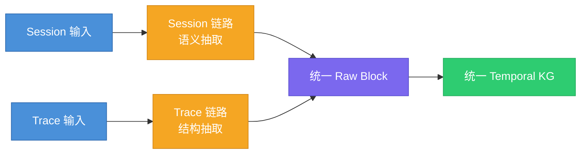
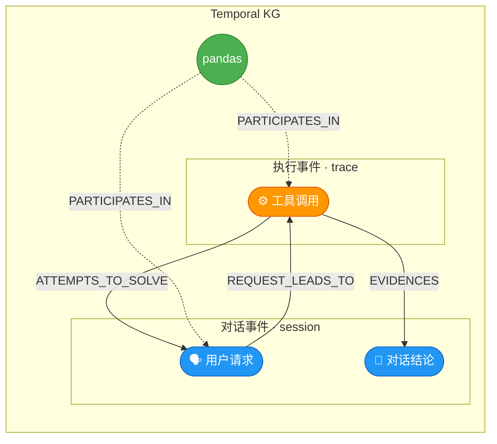

> [!info] 文档定位
> 本文档是 Group 3 的**原理与背景说明**，回答"要做什么、为什么这么做"。
> 执行层设计（Pipeline、Prompt 模板、Schema、排期）见：[[Group3-记忆构建模块-详细方案设计-最新版]]

---

## 目录

1. [为什么 Agent 需要长期记忆](#1-为什么-agent-需要长期记忆)
2. [为什么用知识图谱来组织记忆](#2-为什么用知识图谱来组织记忆)
3. [Session 与 Trace：两种不同的记忆原料](#3-session-与-trace两种不同的记忆原料)
4. [图谱里的核心对象](#4-图谱里的核心对象)
5. [借鉴 Graphiti：时序事实与 LLM-Driven 抽取](#5-借鉴-graphiti时序事实与-llm-driven-抽取)
6. [借鉴 EverMemOS 与 HippoRAG：语义记忆与情景记忆的目的](#6-借鉴-evermemos-与-hipporag语义记忆与情景记忆的目的)
7. [后续演进路线](#7-后续演进路线)

---

## 1. 为什么 Agent 需要长期记忆

### 1.1 上下文窗口的根本局限

现代 LLM 的上下文窗口虽然越来越大，但它本质上是一个**短期工作台**：每次对话开始时是空的，结束时就消失了。这意味着：

- Agent 无法记住上次对话说了什么
- 无法知道用户昨天用过哪个工具
- 无法把"这次报错"和"上次那个类似的问题"关联起来

这不是 LLM 能力不足，而是架构上的根本特征。**上下文窗口是工作记忆，不是长期记忆。**

认知科学对人类记忆有经典的分层描述：

| 记忆类型 | 时间跨度 | 类比到 Agent |
|---------|---------|-------------|
| 感觉记忆 | 毫秒级 | 当前 token 输入 |
| 工作记忆 | 秒～分钟 | 上下文窗口 |
| 情景记忆 | 天～年 | 对特定事件的回忆（"上次那个 bug"） |
| 语义记忆 | 长期稳定 | 对实体、概念、关系的稳定认知（"pandas 是什么"）|
| 程序记忆 | 长期稳定 | 技能与工作流（"怎么处理 CSV"） |

Agent 要具备真正的长期记忆能力，需要的不只是"把历史记录存下来"，而是构建类似人类情景记忆和语义记忆的机制——**能够按时间线回忆事件，能够跨会话认出同一个实体，能够把过去的经验迁移到当前任务。**

### 1.2 从"历史记录"到"可用记忆"的鸿沟

很多系统的第一反应是：把对话历史存进数据库，需要时召回。这确实是一种记忆，但问题在于——**原始对话记录不等于可用记忆**。

想象一下这个场景：

> 用户（3天前）：我用 pandas 处理了一个 CSV，有个列的类型识别有问题。  
> 用户（今天）：上次那个问题，我换了一下读取方式，现在 Excel 也没问题了。

如果系统只存了原始对话，那它面对"今天"这句话时，需要从海量历史里找出：
- "上次那个问题"指的是哪次？
- "那个问题"是什么问题？
- "换了读取方式"和哪个工具有关？
- 这两次会话之间有什么连续性？

纯靠向量检索"像不像"，很难稳定回答这类问题。**原始记录是原料，结构化记忆才是可用的知识。**

Group 3 的核心任务，就是把原始 Session/Trace 数据转化为结构化的长期记忆：提取实体、事件、关系和时间信息，组织成可查询、可关联、可溯源的知识图谱。


---

## 2. 为什么用知识图谱来组织记忆

### 2.1 Session/Trace 数据的四个特点

Agent 产生的原始数据有四个特点，决定了它不能只靠简单归档处理：

1. **流式**：随着对话和执行过程不断产生，没有固定的开始和结束
2. **碎片化**：单个 turn 或 trace step 自身信息有限，意义往往依赖上下文
3. **上下文依赖强**：很多表达如"刚才那个库""上次那个问题"，脱离历史就无法理解
4. **时间敏感**：同一个事实在不同时间点价值不同，很多记忆依赖先后顺序，而不只是事实本身

这四个特点意味着：**要让 Agent 真正能"回忆"，必须把原始数据转化为带有结构、关联和时间信息的记忆对象。**

### 2.2 三种存储方式的分工

面对 Agent 记忆这个问题，工程上通常有三种技术手段，它们不是替代关系，而是分工关系：

| 存储方式 | 擅长回答 | 不擅长回答 | 在本方案中的定位 |
|---------|---------|-----------|----------------|
| **原始归档（JSONL / Raw Block）** | "证据在哪？来源是什么？" | 跨会话关联、路径查询 | 记忆的原料层，每条抽取结果都可溯源到此 |
| **向量库（Milvus）** | "这两个实体像不像？" | "它们之间什么关系？""谁先发生？" | 实体相似召回，辅助去重消歧 |
| **知识图谱（Neo4j）** | "它们是什么关系？何时发生？怎么演化的？" | 纯语义相似性计算 | 长期记忆的组织骨架 |

举个例子——下面这些问题，向量召回很难稳定回答，但知识图谱可以：

- `pandas` 和 `read_excel` 之间存在什么路径关系？
- 某个 session 里，问题是怎么从"报错"演化到"解决方案"的？
- `read_excel` 这次调用之前发生了什么？
- 用户昨天提到的工具，今天又在哪个事件里出现了？

这类查询依赖的是：**实体归一、关系类型、时间约束、路径遍历、证据溯源**——这正是知识图谱的强项。

### 2.3 为什么强调 Temporal KG，而不是普通关系图

普通知识图谱存的是"静态事实"：`pandas IS_A tool`、`用户 USES pandas`。这对于静态文档知识够用，但对于 Agent 记忆不够。

**Agent 记忆中，很多价值来自事件的发生顺序，而不只是事实本身：**

- 用户先提需求，后补充约束——顺序决定了**理解**
- 工具 A 先执行，B 后执行——顺序决定了**因果**
- 问题先出现，方案后出现——顺序决定了"这是解决方案"这个**意义**
- 用户从 pandas 切换到 polars——旧事实不是错，而是"曾经成立，现在已**更新**"

这就是为什么本方案强调 **Temporal KG**（时序知识图谱）：

| 维度 | 普通关系图 | Temporal KG |
|------|-----------|-------------|
| 核心问题 | "A 和 B 是否有关？" | "A 何时出现？B 在 A 之前还是之后？" |
| 时间建模 | 通常缺失 | 显式建模 `event_time`、`valid_at`、`precedes` |
| 事实状态 | 静态，只有有/无 | 动态，事实可以"成立→失效→被替代" |
| 对 Agent 的价值 | 表示局部关系 | 组织跨轮次、跨会话的连续任务轨迹 |


---

## 3. Session 与 Trace：两种不同的记忆原料

### 3.1 两种不同的观察视角

Agent 交互会同时产生两类数据，很容易被误认为是"同一件事的不同记录"，但实际上它们是**两种不同的观察视角**：

| 视角 | Session | Trace |
|------|---------|-------|
| 观察的是 | 用户与 Agent 说了什么 | Agent 内部做了什么 |
| 组织中心 | 对话时间线（turn-based） | 执行树（span/step-based） |
| 人类可读性 | 高，自然语言 | 低，系统级技术日志 |
| 典型内容 | 意图、问题、决策、指代消解 | tool 调用、状态、latency、artifact |
| 更适合回答 | "用户想做什么？意图怎么变化的？" | "系统实际做了什么？哪步成功/失败？" |

一个典型的 Agent 交互中，Session 和 Trace 的关系是：

```
1 Session（用户提了一个需求）
  └── N 个 Turn（多轮对话）
        └── 每个 Turn 背后有 N 个 Trace
              └── 每个 Trace 有 N 个 Step（工具调用链）
```

Session 告诉你"用户要读 Excel 文件"，Trace 告诉你"python_executor 调用了 read_excel，耗时 420ms，成功返回"。两者缺一不可。

### 3.2 为什么不能一开始就合并

Session 的难点在语义：指代消解（"那个库"是什么？）、意图变化识别、会话边界切分。  
Trace 的难点在结构：字段异构（不同 Agent 框架格式不同）、执行链重建、错误/重试识别。

**把两类数据混在同一套处理逻辑里，会让 pipeline 变得脆弱**——Session 的噪声处理方式和 Trace 完全不同。一旦混合，要么过度裁剪了 Trace 的结构信息，要么让 Session 处理逻辑承担了不该有的负担。

### 3.3 为什么最终要融合到同一张图谱

如果 Session 和 Trace 各自形成独立图谱，就无法回答真正有价值的问题：

- 用户提出需求后，Agent 实际执行了哪些步骤？
- 某个报错是在对话的哪个阶段提出来的，又在哪个 trace step 里被处理的？
- `read_excel` 这次调用，和当前 session 里的哪个用户请求有关？

这些问题的价值，恰恰在于 Session 与 Trace 的**交叉点**。

### 3.4 "前分后合"策略

本方案采用的策略是：**前端分离处理，后端融合到同一张 Temporal KG。**



这张图清晰地表达了三个层次：

1. **前端分离** — Session 和 Trace 两条独立的输入链路
2. **各自抽取** — Session 走语义抽取，Trace 走结构抽取
3. **后端融合** — 两条链路汇聚到统一 Raw Block，最终写入同一张 Temporal KG

写入同一张 Temporal KG 后，所有节点在物理上就是一张图。但因为来源不同，事件节点天然形成两个族群：Session 链路产生的**对话事件**（如用户请求、对话结论）和 Trace 链路产生的**执行事件**（如工具调用）。

EntityNode 归一后天然跨族群——同一个实体 `pandas` 不管从哪条链路抽出，都指向同一个节点，是天然的粘合剂。但 EventNode 是一次性的，对话事件和执行事件之间的因果关系需要显式的边来表达：

- `REQUEST_LEADS_TO`：对话事件（用户请求）→ 执行事件（工具调用）
- `ATTEMPTS_TO_SOLVE`：执行事件 → 对话事件（尝试解决某个问题）
- `EVIDENCES`：执行事件的结果 → 对话事件（为某个结论提供证据）



> EntityNode 是天然的粘合剂；因果边负责连接不同来源的 EventNode。所谓"跨链"不是跨两张图，而是跨两个来源族群（`source_type`）的因果连接。

这样既保留了各自的信号特征，又实现了跨来源的连续性建模。


---

## 4. 图谱里的核心对象

### 4.1 为什么需要 EventNode

直觉上，知识图谱只需要"实体 + 关系"就够了：`用户 USES pandas`、`pandas RELATES_TO read_excel`。但在 Agent Memory 场景里，这不够——**因为很多记忆的价值不在于"存在关系"，而在于"发生了什么事"。**

考虑这样一个场景：

```
用户请求：帮我读 Excel 文件
  ↓
工具调用：python_executor → read_excel → 成功
  ↓
用户追问：结果有没有保留列名？
```

如果只用实体+关系表示，你得到的是：`用户 USES python_executor`、`python_executor INVOKES read_excel`。  
但你失去了：这些动作**发生的顺序**、**哪个请求触发了哪个工具**、**结果是成功还是失败**。

**EventNode 做的事，就是把"一次发生"变成图谱里的一等公民**——它有自己的时间、来源、状态，可以和多个实体关联，可以和其他事件形成时序链：

```
EventNode(user_request, "帮我读Excel")
  → PRECEDES →
EventNode(tool_use, "read_excel", status=success)
  → PRECEDES →
EventNode(user_request, "结果有没有保留列名？")
```

**没有 EventNode，时序链没有挂载点；Session 的"用户请求"和 Trace 的"工具调用"也无法桥接。**

> [!note] 参考
> 详细论证见：[[1. EventNode抽象的必要性]]

### 4.2 三类核心对象的分工

本方案的最小图模型由三类对象构成：

| 对象 | 类比 | 核心职责 |
|------|------|---------|
| `EntityNode` | 稳定的"人/物/概念" | 跨会话可归一的持久对象，如 `pandas`、`用户`、`python_executor` |
| `EventNode` | "发生过的事" | 有时间、有参与者、有状态的瞬时事件，是时序链的节点 |
| `RawBlockRef` | "证据来源" | 轻量溯源节点，指向原始 block，不存全文 |

**三者之间的关系**：

```
RawBlockRef（证据：blk_xxx）
    ↑ DERIVED_FROM
EventNode（tool_use: read_excel, t=10:02）
    ↑ PARTICIPATES_IN        ↑ PARTICIPATES_IN
EntityNode（python_executor）  EntityNode（pandas）
```

### 4.3 RawBlockRef：溯源优先设计

每个 EventNode 和高价值关系，都必须能回溯到一个 `RawBlockRef`——也就是原始的 Raw Block。

这个设计的价值在于：**当记忆出错时，你能找到根源。**

**长期记忆系统常见的风险有三类：**
1. **误合并**：把不同会话的不同实体错误视为同一个
2. **伪回忆**：LLM 基于模糊相似性生成了并不存在的"记忆"
3. **时序错乱**：事件存在，但顺序和因果关系被弄错了

有了溯源链之后，系统至少可以回答："这条记忆来自哪个 turn？为什么认为这两个实体是同一个？如果结论有误，应该回到哪个 block 去修正？"

### 4.4 SessionContext：不是节点，是上下文字段

一个常见的误解是：既然有 EntityNode 和 EventNode，是不是也应该有 SessionNode？

**不需要**。Session 是输入的组织方式，不是图谱里的独立对象。

做法是：把 `session_id` 作为字段挂在 EventNode 和 RawBlockRef 上。这样：
- "查询同一 session 的所有事件" → 按 `session_id` 过滤 EventNode
- "这个事件来自哪个 session" → 直接读 EventNode 的 `session_id` 字段

简单、够用，不引入多余的节点类型。

只有当你需要"会话级摘要"、"会话导航视图"等高级功能时，才值得引入会话容器节点——那是 Phase 2 的事。


---

## 5. 借鉴 Graphiti：时序事实与 LLM-Driven 抽取

[Graphiti](https://github.com/getzep/graphiti) 是 Zep 开源的 Agent 记忆图谱系统，它的工程思想对本方案有重要参考价值。我们不直接使用它的命名体系，但借鉴了它的四个核心设计理念，以及它的 **LLM-Driven 抽取 pipeline** 设计模式。

### 5.1 四个核心理念

#### 理念 1：Provenance First（证据优先）

每一条抽取出来的实体、事件、关系，都必须能溯源到原始输入片段。这不是可选的增强，而是记忆系统可靠性的基础。

Graphiti 把每个 episode 的原始内容保留为 `EpisodicNode`，所有派生的实体和关系都指向它。本方案用 `RawBlockRef` 承担这个角色。

#### 理念 2：Temporal Fact（时序事实，而不是静态关系）

Graphiti 的关系边不只是 `A → B`，而是带有时间状态的事实：

```python
class Edge:
    relation_type: str      # 关系类型，如 USES
    fact: str               # 自然语言描述
    valid_at: str | None    # 事实成立时间
    invalid_at: str | None  # 事实失效时间
```

这意味着图谱可以表达：
- "用户**曾经**使用 pandas（valid_at=上周，invalid_at=昨天）"
- "用户**现在**使用 polars（valid_at=昨天，invalid_at=null）"

而不是只有一条永远有效的 `用户 USES pandas` 边。

**这个设计的价值**：Agent 的使用偏好、工具选择、问题状态都是会变化的。静态关系图无法表达"过去成立，现在不再成立"——而这恰恰是 Agent 记忆中最常见的情形。

#### 理念 3：Resolution + Update（解析与更新，而不是只追加）

每条新的 Session/Trace 进来时，不是无脑追加新节点和新边，而是先与已有图谱比对：

- **重复**：新实体和旧实体是同一个 → 归并，更新 `last_seen_at`
- **补充**：新信息扩充了旧实体的属性 → 更新
- **冲突**：新事实与旧事实矛盾 → 旧事实打上 `superseded_at`，新事实作为新边写入
- **全新**：完全没见过 → 正常创建

这个机制保证了图谱不会随着时间无限膨胀成一堆冗余节点，而是保持"最新知识态"。

#### 理念 4：Hybrid Retrieval（混合检索）

检索时不只靠向量召回，也不只靠图遍历，而是根据查询类型组合使用：
- 向量库（Milvus）：语义相似的实体候选
- 图谱（Neo4j）：关系路径、时序链、证据溯源
- 上下文过滤：按 session_id、时间窗、实体类型缩小范围

---

### 5.2 LLM-Driven 抽取：为什么不用规则

Graphiti 的抽取 pipeline 完全基于 LLM prompt，而不是规则/正则/NER 模型。这在原型阶段是更好的选择，原因很直接：

| 维度 | 规则优先 | LLM Prompt 优先 |
|------|---------|----------------|
| 开发速度 | 需要逐条编写词典和正则，维护成本高 | 写好 prompt 即可快速覆盖多种场景 |
| 覆盖面 | 只能处理预设模式，开放域对话表现差 | 对自然语言天然适配 |
| 迭代效率 | 改规则→测试→补规则，循环慢 | 改 prompt→测试，循环快 |
| 适合阶段 | 生产优化阶段（用规则替代高频 LLM 调用降本） | **原型验证阶段** |

> [!tip] 核心观点
> 原型阶段的首要目标是**验证"能否抽出有意义的记忆"**，而不是"以最低成本抽取"。LLM prompt 是最快的验证方式；规则优化是后续降本的手段。

### 5.3 Graphiti 的 Prompt 工程模式

Graphiti 把抽取拆分为多个独立的 LLM 调用，每个调用有清晰的职责边界。这种模式值得借鉴。

#### 模式 1：结构化输出 Schema（Pydantic）

每个抽取任务都定义严格的 Pydantic 输出模型，确保 LLM 输出可直接解析，而不是靠字符串处理：

```python
class ExtractedEntity(BaseModel):
    name: str
    entity_type: str
    aliases: list[str]     # 别名，如 ["pd", "Pandas"]
    confidence: float

class Edge(BaseModel):
    source_entity: str
    target_entity: str
    relation_type: str     # SCREAMING_SNAKE_CASE，如 USES
    fact: str              # 自然语言改写，不逐字引用
    valid_at: str | None
    invalid_at: str | None
```

#### 模式 2：穷举排除规则，而不是只说"提取重要实体"

Graphiti 的实体抽取 prompt 花了大量篇幅说"**绝对不要提取什么**"，并分门别类：

```
【绝对不要提取】
- 代词：我、你、它、这个、那个
- 抽象情感或状态：成功、失败、好的、明白
- 纯时间表达：昨天、现在（时间信息由事件抽取处理）
- 过于泛化的词：东西、内容、数据（除非有明确限定词）
- 系统内部字段名：status、latency_ms、step_index
```

**为什么这比"只说要提取什么"更有效**：LLM 默认会尽量多提取，负面约束比正面指令更能控制输出边界。

#### 模式 3：带 GOOD/BAD 示例的 prompt

Graphiti 的每个 prompt 都包含具体的正例和反例：

```
Message: "Nisha: My dad is visiting next week to walk dogs at Riverside Park."

GOOD:
- "Nisha" → PERSON（说话者）
- "Nisha's dad" → PERSON（用限定词的关系称谓）
- "Riverside Park" → LOCATION

BAD（不要提取）:
- "dad" → 裸关系称谓，没有限定词
- "dogs" → 泛化名词
- "next week" → 时间表达
```

#### 模式 4：Candidate-ID 去重模式

实体去重时，Graphiti 不让 LLM 做字符串匹配，而是给已有实体编号（0, 1, 2...），让 LLM 返回匹配的编号或 -1：

```
<EXISTING_ENTITIES>
[0] pandas (TOOL) - 数据处理库，别名: pd, Pandas
[1] python_executor (TOOL) - Python 代码执行工具
</EXISTING_ENTITIES>

新实体："那个库"

→ LLM 返回：matched_candidate_id = 0（匹配 pandas）
→ 或返回：matched_candidate_id = -1（无匹配，创建新节点）
```

这比让 LLM 判断"这两个字符串是否指同一实体"可靠得多，因为编号系统消除了 LLM 的文本生成歧义。

#### 模式 5：输入格式特化

Graphiti 为不同输入类型维护不同的 prompt 版本：
- `extract_message`：处理对话格式（Speaker: content）
- `extract_json`：处理结构化 JSON 数据
- `extract_text`：处理纯文本

这对本方案有直接启发：Session 和 Trace 应该用不同格式的 prompt，而不是一个通用 prompt 硬撑两种输入。

---

### 5.4 Graphiti 中不建议直接照搬的部分

| 内容 | 原因 |
|------|------|
| `CommunityNode`（社区摘要节点） | 依赖 Leiden 社区发现算法，是 Phase 2 能力 |
| `SagaNode`（多 episode 容器） | 原型期用 `session_id` 字段替代即可 |
| Cross-encoder reranker | 较重的检索增强，原型期不需要 |
| 多后端存储抽象层 | 过早抽象，增加工程负担 |


---

## 6. 借鉴 EverMemOS 与 HippoRAG：语义记忆与情景记忆的目的

本方案的记忆系统产出的是**陈述性记忆（Declarative Memory）**，包含两个子类型：
- **情景记忆（Episodic Memory）**：对特定事件的有时间戳的回忆——"上次那个 CSV 问题在哪个 session 里？"
- **语义记忆（Semantic Memory）**：跨情节提炼出的稳定知识——"这个用户常用 pandas 做数据处理"

这两类记忆的目的和构建方式不同，需要分别建模。EverMemOS 和 HippoRAG 是两个从不同角度处理这个问题的系统，它们的设计思想对本方案有直接参考价值。

> [!info] 相关论文与项目
> - **EverMemOS**（EverMemos）：arXiv 2501.02163，Jan 2026 — [https://arxiv.org/abs/2501.02163](https://arxiv.org/abs/2501.02163)
> - **HippoRAG**：arXiv 2405.14831，NeurIPS 2024 — [https://arxiv.org/abs/2405.14831](https://arxiv.org/abs/2405.14831)
> - **Graphiti**（已在第5章介绍）：[https://github.com/getzep/graphiti](https://github.com/getzep/graphiti)

### 6.1 HippoRAG：为什么 KG 是语义记忆、Raw Block 是情景记忆

HippoRAG 借用了神经科学的**海马体记忆索引理论（Hippocampal Memory Indexing Theory）**来解释知识图谱和原始文本块在记忆系统中的分工：

| 记忆层 | HippoRAG 对应 | 本方案对应 | 存储位置 |
|--------|--------------|-----------|---------|
| **语义记忆**（稳定的实体知识） | KG 中的实体节点和关系边 | `EntityNode` + 关系边 | Neo4j |
| **情景记忆**（具体的事件上下文） | 原始 Passage（文本块） | `EventNode` + `RawBlockRef` | Neo4j + JSONL |

这个框架直接解释了为什么本方案要**同时保留 RawBlockRef 和 EntityNode**，而不是只存实体：

- 只存实体节点（KG）：回答"pandas 和 read_excel 有关系吗？"——但丢失了"具体是哪次调用、当时上下文是什么"
- 只存原始 block（向量库）：能找到相似片段——但无法跨会话做实体归一、无法做路径查询
- **两者结合**：KG 是语义索引（semantic index），Raw Block 是情景细节（episodic detail），检索时用 KG 定位，用 RawBlockRef 还原上下文

#### HippoRAG 的检索机制：PPR 多跳路径

HippoRAG 的检索不是直接向量搜索原始 block，而是：

```
查询向量
  → 命中 EntityNode（ANN 向量搜索，入口节点）
  → Personalized PageRank (PPR) 在 KG 上传播
  → 命中与入口实体相关联的 EventNode
  → 通过 DERIVED_FROM 边拉取 RawBlockRef（情景细节）
```

**价值举例**：查询"Kafka lag 监控"时：
- 直接向量搜索：只能返回包含"Kafka lag"的 block
- PPR 多跳检索：`CONCEPT:Kafka` → `TOOL:Prometheus` → `EVENT:告警触发` → 召回多个相关情节

这个检索模式是 Phase 2 检索层的重要演进方向（见第7章）。

#### 同义边：实体语义归一的补充

HippoRAG 在 KG 里为语义相似但表面不同的实体加 `SYNONYM_OF` 边（通过 dense encoder 判断余弦相似度）。这是对本方案 LLM candidate-ID 去重的补充：

| 去重手段 | 时机 | 处理的情况 |
|---------|------|-----------|
| LLM candidate-ID 模式 | 实时，在抽取阶段 | 明确的同名/别名（"pd" → pandas） |
| 同义边（SYNONYM_OF） | 离线批处理 | 语义相似但表面不同（"分布式追踪" vs "链路追踪" vs "Distributed Tracing"） |

Phase 2 可加一个轻量的离线 Entity Normalization 任务，用 embedding 相似度生成 `SYNONYM_OF` 边，作为实体去重的语义补充层。

### 6.2 EverMemOS：记忆的生命周期管理

EverMemOS（arXiv 2501.02163）提出了一个完整的**记忆生命周期模型**，把从原始输入到结构化记忆的过程分为三个阶段：

```
阶段1：Episodic Trace Formation（情节轨迹形成）
  原始 Session/Trace → MemCell(E, F, P, M) 四元组
  → 保留情节细节，形成带结构的记忆单元

阶段2：Semantic Consolidation（语义固化）
  跨 MemCell 聚类 → MemScene（记忆场景）
  → 提炼稳定实体知识，形成语义记忆

阶段3：Reconstructive Recollection（重建式回溯）
  查询 → 不是简单检索，而是重建完整叙事
  → agentic sufficiency loop（判断信息够用了吗？不够继续扩展）
```

**与本方案的对应关系**：

| EverMemOS 概念 | 本方案对应 | 阶段 |
|--------------|-----------|------|
| MemCell(E) — Episode narrative | `EventNode` + `RawBlockRef.content` | Phase 1 |
| MemCell(F) — Atomic Facts | `ExtractedFact` 三元组 | Phase 1 |
| MemCell(P) — Foresight/validity intervals | `valid_at`/`invalid_at` + `validity_reasoning` | Phase 1（扩展）|
| MemCell(M) — Metadata | `RawBlock.metadata` | Phase 1 |
| MemScene — 跨 MemCell 聚类 | `SemanticCluster` 节点（语义主题群） | Phase 2 |
| Reconstructive Recollection | PPR 多跳检索 + sufficiency loop | Phase 2 |

#### Foresight：主动预测事实有效期

EverMemOS 的 MemCell(P) 引入了一个重要思想：**在提取事实时，就主动预测这条事实的有效期**，而不是等到被新信息覆盖再标记失效。

这对应到本方案 Prompt 2c 关系/事实抽取里的 `validity_reasoning` 字段（详见最新版方案文档的 Stage 2.4 章节）。

例子：
- 提取事实"Agent A 的 API Key 是 xxx" → LLM 推理：`validity_reasoning = "API keys typically rotated every 90 days"` → 预估 `invalid_at ≈ 90天后`
- 提取事实"用户正在使用 pandas" → `validity_reasoning = "Current session usage, likely still valid"` → `invalid_at = null`

这比纯粹的"当前有效，等覆盖再失效"机制更主动，能减少图谱里大量"从未失效"的僵尸事实。

#### MemScene：语义固化的具体目标

EverMemOS 的 **MemScene** 对多个 MemCell 做主题聚类，形成一个记忆场景——"这个用户在做微服务调试"、"这个 Agent 在处理数据治理任务"。

这是**语义记忆**最重要的构建机制：把分散的情节碎片提炼为稳定的主题知识。

在本方案的图谱里，MemScene 对应 Phase 2 引入的 `SemanticCluster` 节点：

```
(SemanticCluster {
  theme: "微服务调试",
  period: "2025-Q1",
  tenant_id: "acmecorp"
})
  -[:AGGREGATES]-> (EventNode)
  -[:REPRESENTS]-> (EntityNode {type: CONCEPT, name: "分布式追踪"})
```

`SemanticCluster` 不在 Phase 1 实现，但它是 Phase 2 语义固化阶段的核心目标节点。

### 6.3 两个借鉴点的优先级总结

| 优先级 | 来源 | 借鉴内容 | 落地位置 |
|--------|------|---------|---------|
| **P0（本期）** | HippoRAG | KG=语义记忆 / RawBlock=情景记忆 的框架，解释双层设计的必要性 | 本文档（原理说明） |
| **P0（本期）** | EverMemOS | Foresight → `validity_reasoning` 字段加入 Prompt 2c | 最新版方案 Prompt 2c |
| **P1（Phase 2）** | HippoRAG | PPR 多跳检索：EntityNode → EventNode → RawBlockRef | Phase 2 检索层 |
| **P1（Phase 2）** | EverMemOS | MemScene 聚类 → `SemanticCluster` 节点 | Phase 2 图谱演进 |
| **P2（Phase 2）** | HippoRAG | 同义边 + 离线 Entity Normalization | Phase 2 去重优化 |
| **P2（Phase 2）** | EverMemOS | Agentic sufficiency loop（检索时自适应扩展） | Phase 2 查询层 |

---

## 7. 后续演进路线

本期原型的目标是验证最小闭环：Session/Trace 能否稳定转成结构化记忆，能否构建可查询的时序图谱。这是整个长期记忆体系的地基。

地基打好之后，后续演进是自然的：

```
Phase 1（本期原型）
├── Session/Trace → Raw Block → Temporal KG
├── LLM-Driven 实体/事件/关系抽取
├── 基本实体去重
└── 本地验证查询（实体/时间线/1-2跳路径）

Phase 2（检索与语义固化）
├── 完整检索层服务化（混合检索：向量 + 图遍历）
├── PPR 多跳检索（HippoRAG）：EntityNode → EventNode → RawBlockRef 路径召回
├── SemanticCluster 节点（EverMemOS MemScene）：跨会话情节聚类，语义主题沉淀
├── 离线 Entity Normalization：SYNONYM_OF 边（HippoRAG）补充语义去重
├── 全局一致性修复（冲突检测、旧事实标记 superseded）
├── 实体 Summary 自动更新（高频实体画像积累）
└── 与 Group 2 文档知识图谱融合

Phase 3（高级能力）
├── Graph RAG / 多跳推理
├── 社区发现（Leiden 算法，生成主题摘要节点）
├── 遗忘机制（时效度衰减、低置信度节点过期）
├── Agentic sufficiency loop（EverMemOS）：检索时自适应扩展，判断信息是否足够
└── 用户偏好与工具使用画像沉淀
```

> [!tip] 关键洞察
> 知识图谱不是"锦上添花"的增强项，而是 Agent 长期记忆从"历史记录"走向"可用记忆"的必经结构。
> Phase 2/3 的所有高级能力，都依赖 Phase 1 建立的这张时序图谱作为基础。

### 相关参考文档

- [[AMS技术方案大纲&分工_版本3]] — 整体架构与横向分工
- [[Group3-记忆构建模块-详细方案设计-最新版]] — 执行层设计（Pipeline、Prompt、Schema、排期）
- [[1. EventNode抽象的必要性]] — EventNode 的详细论证
- [[Session&Trace数据源与建模问题]] — Session 与 Trace 的建模深度分析
- [[时间置信度的计算与应用]] — 时间信息的置信度处理
- [[PPR&Graph RAG&GDS与多跳推理框架]] — Phase 2/3 检索增强方向
- [[Leiden算法详解]] — Phase 3 社区发现

---

*本文档聚焦原理理解，执行细节见最新版方案文档。*
