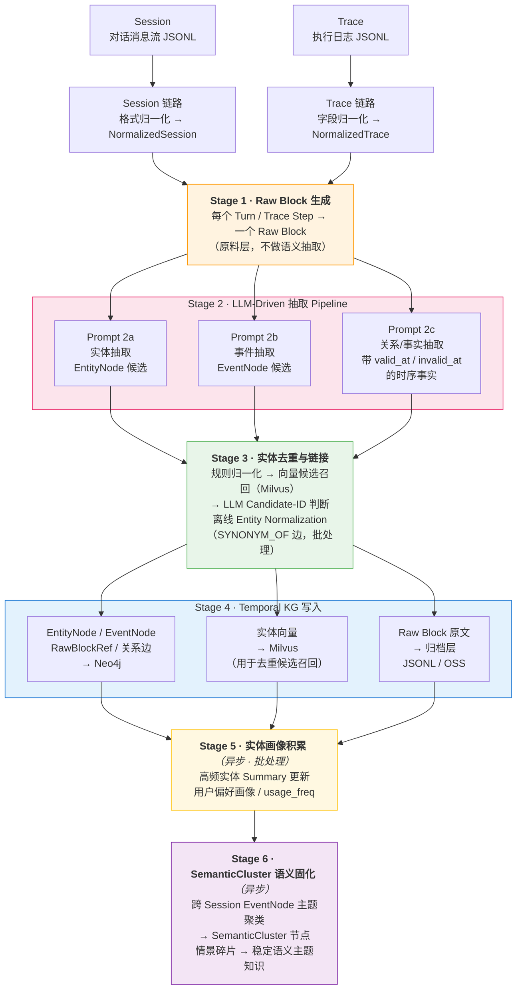
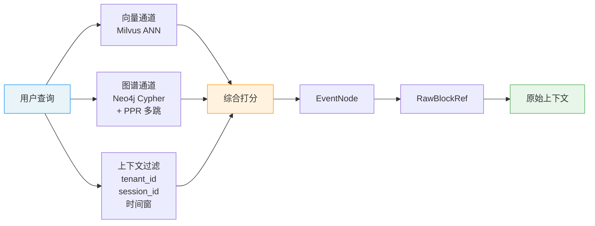

# AMS 语义记忆与情景记忆构建系统 - 完整方案设计

---

## 第1章 系统定位与目标

### 1.1 输入源：Session 与 Trace

本系统的输入来自 Agent 运行时产生的两类原始数据，它们是同一次交互过程的两种观察视角：

| 视角 | Session | Trace |
|------|---------|-------|
| 观察的是 | 用户与 Agent **说了什么** | Agent 内部**做了什么** |
| 组织中心 | 对话时间线（turn-based） | 执行树（span / step-based） |
| 典型内容 | 意图、问题、约束、决策、指代 | 工具调用、状态、latency、artifact、错误重试 |
| 更适合回答 | "用户想做什么？意图如何演化？" | "系统实际执行了什么？哪步成功/失败？" |
| 语义密度 | 高（自然语言） | 低（系统日志） |

两者的层级关系如下：

```
1 Session（一次任务会话）
  └── N 个 Turn（多轮对话）
        └── 每个 Turn 背后有 N 个 Trace
              └── 每个 Trace 有 N 个 Step（工具调用链）
```

Session 告诉你"用户要读 Excel 文件"，Trace 告诉你"python_executor 调用了 read_excel，耗时 420ms，成功返回"。两者缺一不可，各自承载不同维度的记忆原料。

**为什么不能合并为一条链路处理**：Session 的核心难点在语义（指代消解、意图变化识别、会话边界切分），Trace 的核心难点在结构（字段异构、执行链重建、错误/重试识别）。混合处理会让 pipeline 变得脆弱——要么过度裁剪 Trace 的结构信息，要么让 Session 处理逻辑承担不该有的负担。

### 1.2 产出目标：语义记忆与情景记忆
#### 1.2.1 认知科学基础

AMS 的记忆分类直接映射人类认知心理学的经典模型。以下是完整的概念映射表：

| **维度** | **记忆类型**                        | **归属/等价关系**                                    | **在 Agent 中的定义与实现**                                 |
| ------ | ------------------------------- | ---------------------------------------------- | --------------------------------------------------- |
| 基础类别   | **Procedural Memory**（程序性记忆）    | 与 Declarative Memory 相互独立                      | **技能型记忆**。在 Agent 中表现为通过强化学习（RL）获得的策略或确定性硬编码逻辑      |
| 高层概念   | **Declarative Memory**（陈述性记忆）   | 等价于 Factual Memory                             | **事实型记忆**。可以被显式表达、检索和描述的知识                          |
| 陈述性子类型 | **Semantic Memory**（语义记忆）       | Declarative Memory 的子集                         | **通用知识**。独立于时间/空间的事实（如"法国的首都是巴黎"）。Agent 的训练语料主要属于此类 |
| 陈述性子类型 | **Episodic Memory**（情景记忆）       | Declarative Memory 的子集；等价于 Experiential Memory | **自传式记忆**。包含时空上下文的特定事件（如"Agent 昨天下午与用户A讨论了天气"）      |
| 功能扩展   | **Metacognitive Memory**（元认知记忆） | 独立维度（Memory about Memory）                      | **自反式循环**。Agent 对自身认知边界的意识（如"我知道我不具备这个信息"或评估任务复杂度）  |

本系统产出的是**陈述性记忆（Declarative Memory）**，包含两个子类型：
####  1.2.2 情景记忆（Episodic Memory）

对**特定事件**的有时间戳的回忆。它回答的问题是：

- 上次那个 CSV 列类型问题发生在哪个会话？
- read_excel 这次调用之前发生了什么？
- 某个报错是在对话哪个阶段提出来的？

情景记忆的载体是 **EventNode**（事件节点）和 **RawBlockRef**（原始证据引用）。EventNode 是时序链的基本单元，每个事件有明确的发生时间、参与者和来源证据。参考：[[1. EventNode抽象的必要性]]

#### 1.2.3 语义记忆（Semantic Memory）

对**实体、概念、关系**的跨会话稳定认知。它回答的问题是：

- 这个用户常用哪些工具？
- pandas 和 read_excel 之间是什么关系？
- "那个库"在这个用户的上下文中通常指什么？

语义记忆的载体是 **EntityNode**（实体节点）和 **SemanticCluster**（语义主题群节点）。EntityNode 跨会话可归一，是连接不同情景的持久对象；SemanticCluster 是多个**知识碎片**聚类后固化的主题知识。

#### 1.2.4 两类记忆的分工关系

*借鉴 HippoRAG（arXiv 2405.14831）的海马体记忆索引理论：*

| 记忆层 | 本系统对应 | 存储位置 | 核心功能 |
|--------|-----------|---------|---------|
| **语义记忆**（稳定的实体知识） | EntityNode + 关系边 + SemanticCluster | Neo4j | 实体归一、关系推理、主题聚类 |
| **情景记忆**（具体的事件上下文） | EventNode + RawBlockRef | Neo4j + 归档层 | 时序链构建、证据溯源、事件回溯 |

两者不是替代关系，而是**检索时的分工**：
- 用语义记忆（EntityNode）做**语义索引**——定位"我在找什么"
- 用情景记忆（EventNode → RawBlockRef）做**细节还原**——"当时具体发生了什么"

### 1.3 核心能力目标

#### 1.3.1 What
本系统构建完成后，应能稳定回答以下类型的问题：

**类型 1：实体查询**
> "pandas 这个库，用户在哪些会话里用过？最近一次是什么时候？"

**类型 2：时间线重建**
> "sess_001 这个会话里，pandas读取csv报错问题是怎么从报错演化到解决方案的？"

**类型 3：路径查询**
> "pandas 和 read_excel 之间存在什么路径关系？中间经过哪些实体？"

**类型 4：跨会话指代解析**
> "用户说'上次那个问题'，指的是哪个 session 的哪个事件？"

**类型 5：因果追溯**
> "用户的这个请求，触发了 Agent 内部的哪些执行步骤？哪步成功、哪步失败？"

**类型 6：语义联想**
> "和'csv数据读取问题'语义相关的历史情节有哪些？"

#### 1.3.2 Why
那为什么需要回答这些类型的问题呢？

这些问题类型本质上是在定义这个记忆系统的**能力验收标准**——它们回答的是"建好这个系统后，能用来干什么？"

逐一来看每种类型存在的必要性：

**类型 1（实体查询）** 和 **类型 3（路径查询）** — 这是**语义记忆**的核心能力。Agent 需要知道用户的知识图谱长什么样：用过什么技术、这些技术之间有什么关联。这样才能在新对话中做**个性化推荐和上下文补全**。

**类型 2（时间线重建）** 和 **类型 5（因果追溯）** — 这是**情景记忆**的核心能力。Agent 需要能回溯"某次对话中到底发生了什么"，包括问题是怎么演进的、哪些步骤成功/失败。这对于**调试、复盘、从经验中学习**至关重要。

**类型 4（跨会话指代解析）** — 这是两种记忆**协同工作**的场景。用户说"上次那个问题"，Agent 需要先从情景记忆中定位到具体会话和事件，再从语义记忆中理解上下文。这是**对话连续性**的关键。

**类型 6（语义联想）** — 这是**检索增强**的基础。当用户遇到新问题时，系统能找到历史上语义相似的情节，帮助 Agent 举一反三。

简单说，这六类问题覆盖了一个记忆系统的**四种核心用途**：

| 用途                 | 对应类型 |
| ------------------ | ---- |
| **知道用户是谁**（用户画像）   | 1, 3 |
| **记得发生过什么**（经验回溯）  | 2, 5 |
| **理解用户在说什么**（指代消歧） | 4    |
| **联想相关经验**（检索增强）   | 6    |

所以这些不是随意列举的，而是从"Agent 要像一个有记忆的助手一样工作"这个目标反推出来的**最小能力集合**。
### 1.4 系统边界

**包含**：
1. Session / Trace → Raw Block 的输入适配与归一化
2. LLM-Driven 实体、事件、关系抽取
3. **实体去重与跨会话链接**
4. Temporal KG 写入与增量更新
5. **实体画像积累**
6. SemanticCluster 语义固化
7. 混合检索层（向量 + 图遍历 + PPR 多跳）
8. **遗忘机制**（时效衰减 + 置信度过期 + 显式覆盖）

**不包含**：
1. Agent 框架本身的设计与实现
2. Working Memory（上下文窗口管理）
3. 知识库（静态文档 / 源代码）的构建
4. 程序性记忆（Skill / 工作流存储）
5. 生产级多租户权限治理与计费

---

## 第2章 整体架构

### 2.1 全系统数据流
#### 构建流程
- 从原始数据输入到知识图谱写入和语义固化的完整 pipeline



#### 检索流程
- 从用户查询到三路召回、融合打分、最终返回原始上下文的过程




```
┌─────────────────────────────────────────────────────────────────────┐
│                        输入层                                        │
│   Session（对话消息流 JSONL）    Trace（执行日志 JSONL）              │
└──────────────┬───────────────────────────┬──────────────────────────┘
               │                           │
               ▼                           ▼
┌──────────────────────────┐   ┌──────────────────────────┐
│   Session 链路            │   │   Trace 链路              │
│   ・会话切分与归并         │   │   ・字段归一化             │
│   ・NormalizedSession     │   │   ・NormalizedTrace        │
└──────────────┬───────────┘   └───────────────┬──────────┘
               │                               │
               └──────────────┬────────────────┘
                              ▼
┌─────────────────────────────────────────────────────────────────────┐
│                     Stage 1：Raw Block 生成                          │
│   每个 Turn / Trace Step → 一个 Raw Block（原料层，不做语义抽取）     │
└──────────────────────────────┬──────────────────────────────────────┘
                               ▼
┌─────────────────────────────────────────────────────────────────────┐
│                  Stage 2：LLM-Driven 抽取 Pipeline                   │
│   Prompt 2a: 实体抽取（EntityNode 候选）                             │
│   Prompt 2b: 事件抽取（EventNode 候选）                              │
│   Prompt 2c: 关系/事实抽取（带 valid_at/invalid_at 的时序事实）       │
└──────────────────────────────┬──────────────────────────────────────┘
                               ▼
┌─────────────────────────────────────────────────────────────────────┐
│                  Stage 3：实体去重与链接                              │
│   规则归一化 → 向量候选召回（Milvus） → LLM Candidate-ID 判断        │
│   离线 Entity Normalization（SYNONYM_OF 边，批处理）                  │
└──────────────────────────────┬──────────────────────────────────────┘
                               ▼
┌─────────────────────────────────────────────────────────────────────┐
│                  Stage 4：Temporal KG 写入                           │
│   EntityNode / EventNode / RawBlockRef / 关系边 → Neo4j              │
│   实体向量 → Milvus（用于去重候选召回）                               │
│   Raw Block 原文 → 归档层（JSONL / OSS）                             │
└──────────────────────────────┬──────────────────────────────────────┘
                               ▼
┌──────────────────────────────────────────────────────┐
│         Stage 5：实体画像积累（异步，批处理）           │
│   高频实体 Summary 更新 / 用户偏好画像 / usage_freq     │
└──────────────────────────────┬───────────────────────┘
                               ▼
┌──────────────────────────────────────────────────────┐
│         Stage 6：SemanticCluster 语义固化（异步）       │
│   跨 session EventNode 主题聚类 → SemanticCluster 节点  │
│   情景碎片 → 稳定语义主题知识                           │
└──────────────────────────────┬───────────────────────┘
                               ▼
┌──────────────────────────────────────────────────────┐
│                     检索层                             │
│   向量通道（Milvus ANN）                               │
│   图谱通道（Neo4j Cypher + PPR 多跳）                  │
│   上下文过滤（tenant_id / session_id / 时间窗）         │
│   → 综合打分 → EventNode → RawBlockRef → 原始上下文    │
└──────────────────────────────────────────────────────┘
```

### 2.2 分层架构说明

| 层次        | 职责                             | 执行方式      |
| --------- | ------------------------------ | --------- |
| **输入适配层** | Session/Trace 归一化，Raw Block 生成 | 流式或批量，同步  |
| **抽取层**   | LLM-Driven 实体/事件/关系抽取，实体去重     | 异步流水线     |
| **图谱存储层** | Temporal KG 写入，增量 Upsert，冲突处理  | 事务写入      |
| **画像层**   | 实体 Summary 更新，用户偏好积累           | 异步批处理     |
| **语义固化层** | SemanticCluster 构建与维护          | 定时触发或阈值触发 |
| **检索层**   | 混合检索，PPR 多跳，证据溯源               | 同步查询服务    |
| **遗忘层**   | 时效衰减，低置信过期，显式覆盖                | 定时任务      |

### 2.3 "前分后合"双链路策略

本系统对 Session 和 Trace 采用**前端分离处理、后端融合到同一张 Temporal KG** 的策略：

```
Session 输入 ──→ Session 链路（语义抽取）──┐
                                          ├──→ 统一 Raw Block ──→ 统一 Temporal KG
Trace 输入  ──→ Trace 链路（结构抽取）────┘
```

写入同一张 Temporal KG 后，节点在物理上是一张图，但来源不同的事件天然形成两个族群：

- **对话事件**（source_type=session）：user_request、problem、decision、solution
- **执行事件**（source_type=agent_trace）：tool_use、tool_result、artifact_create

EntityNode 归一后天然跨族群——同一个实体 `pandas` 不管从哪条链路抽出，都指向同一个节点，是天然的粘合剂。族群之间的因果关系通过显式的桥接边表达：

- `REQUEST_LEADS_TO`：对话事件（用户请求）→ 执行事件（工具调用）
- `ATTEMPTS_TO_SOLVE`：执行事件 → 对话事件（尝试解决某个问题）
- `EVIDENCES`：执行事件的结果 → 对话事件（为某个结论提供证据）

### 2.4 三类存储的职责分工

| 存储 | 职责 | 核心数据 |
|------|------|---------|
| **Neo4j** | Temporal KG 主存储：关系、路径、时序、溯源 | EntityNode / EventNode / RawBlockRef / SemanticCluster / 关系边 |
| **Milvus** | 向量索引：实体相似候选召回，辅助去重与检索 | 实体 embedding / SemanticCluster embedding |
| **归档层（JSONL/OSS）** | 原始内容持久化：Raw Block 原文、LLM 调用记录、抽取中间结果 | raw_blocks / extracted / dedup / debug |

三者关系：Neo4j 是记忆的**骨架**，Milvus 是记忆的**语义索引**，归档层是记忆的**原料仓库**。


---

## 第3章 数据模型（Graph Schema）

### 3.1 核心节点类型

#### EntityNode — 语义记忆的持久对象

跨会话可归一的稳定实体，如工具、库、概念、用户、组织。是语义记忆的基本单元。

```cypher
(:EntityNode {
  entity_id:        "ent_acmecorp_01JQXXXXXX",   // 统一 ID：{prefix}_{tenant}_{ulid}
  tenant_id:        "acmecorp",
  name:             "pandas",                      // 标准名称（归一化后）
  entity_type:      "TOOL",                        // TOOL / CONCEPT / RESOURCE / PERSON / ORG / ACTION
  aliases:          ["pd", "Pandas"],              // 已识别的别名列表
  summary:          "Python 数据处理库，用户频繁用于 CSV/Excel 读写",  // 自动更新的摘要
  usage_freq:       12,                            // 被引用次数（画像积累）
  profile_hints:    ["data_processing", "file_io"],// 用于检索个性化排序的标签
  first_seen_at:    datetime("2026-03-28T14:32:00Z"),
  last_seen_at:     datetime("2026-03-31T09:15:00Z"),
  source_block_ids: ["blk_acmecorp_01...", "blk_acmecorp_02..."],
  created_at:       datetime(),
  updated_at:       datetime()
})
```

**实体类型定义**（控制在 6 类，避免过度细分）：

| 类型 | 说明 | 示例 |
|------|------|------|
| `TOOL` | 工具、库、框架、API、执行器 | pandas, read_excel, python_executor |
| `CONCEPT` | 技术概念、方法、参数、算法 | dtype, CSV解析, 数据清洗 |
| `RESOURCE` | 文件、数据集、制品、URL | data.csv, output.xlsx |
| `PERSON` | 用户、角色、Agent 实例 | 用户, Alice, agent_v2 |
| `ORG` | 组织、系统、服务、团队 | Acme Corp, DataPlatform |
| `ACTION` | 关键动作/任务（需关联参与者） | 读取Excel, 排查报错 |

#### EventNode — 情景记忆的时序单元

有时间、有参与者、有状态的瞬时事件。是时序链的节点，也是 Session/Trace 桥接的锚点。

```cypher
(:EventNode {
  event_id:                   "evt_acmecorp_01JQXXXXXX",
  tenant_id:                  "acmecorp",
  event_type:                 "tool_use",    // 见事件类型定义
  trigger:                    "python_executor 调用 read_excel 读取 data.xlsx",
  event_time:                 datetime("2026-03-31T09:15:20Z"),  // null 表示时间不确定
  time_resolution_confidence: 0.95,          // 时间置信度 0-1（见第5章时间处理规则）
  confidence:                 0.90,          // 事件抽取置信度
  session_id:                 "sess_acmecorp_01B",
  episode_id:                 null,          // 可选：所属 episode 子段
  semantic_cluster_id:        null,          // 语义固化后填入（Stage 6）
  source_block_id:            "blk_acmecorp_01B_S1",  // 必填，溯源到 Raw Block
  source_type:                "agent_trace", // session / agent_trace
  created_at:                 datetime()
})
```

**事件类型定义**（控制在 7 类）：

| 类型 | 适用来源 | 说明 |
|------|---------|------|
| `user_request` | Session | 用户提出需求或问题 |
| `decision` | Session | 用户或 Agent 做出决策 |
| `problem` | Session | 出现问题/报错 |
| `solution` | Session | 问题被解决，方案被确认 |
| `tool_use` | Trace | 工具被调用 |
| `tool_result` | Trace | 工具返回结果（成功/失败） |
| `artifact_create` | Trace | 产生了关键制品/文件/输出 |

> [!note] 为什么需要 EventNode 这一抽象
> 如果只用"实体 + 关系"建模，会丢失三类关键信息：①事件的**发生顺序**（时序链没有挂载点）；②**多参与者**的同时关联（边只能连两个节点）；③**证据归属**（confidence 和 source_block_id 无法挂在边上）。EventNode 把"一次发生"变成图谱里的一等公民，解决了上述三个问题。参考：关于 EventNode 抽象的必要性（内部文档）。

#### RawBlockRef — 情景记忆的证据锚点

轻量溯源节点，指向原始 Raw Block，不存全文内容（内容在归档层）。

```cypher
(:RawBlockRef {
  block_id:    "blk_acmecorp_01A_T1",
  tenant_id:   "acmecorp",
  source_type: "session",            // session / agent_trace
  source_uri:  "session://sess_acmecorp_01A/turn/1",
  timestamp:   datetime("2026-03-28T14:32:05Z"),
  session_id:  "sess_acmecorp_01A"
})
```

#### SemanticCluster — 语义固化的主题知识节点

对多个 EventNode 做主题聚类后生成的语义摘要节点，对应 EverMemOS 中的 MemScene 概念。

```cypher
(:SemanticCluster {
  cluster_id:   "cls_acmecorp_01JQXXXXXX",
  tenant_id:    "acmecorp",
  theme:        "pandas 数据文件读写问题排查",
  summary:      "用户在多个会话中处理 pandas 读取 CSV/Excel 的类型识别和日期解析问题，...",
  period_start: datetime("2026-03-28T00:00:00Z"),
  period_end:   datetime("2026-03-31T23:59:59Z"),
  event_count:  9,
  embedding:    [1536维向量],        // 用于语义相似召回
  created_at:   datetime(),
  updated_at:   datetime()
})
```

### 3.2 完整边类型目录

#### A. 实体关系边（EntityNode ↔ EntityNode）

带时间有效性的事实关系，是语义记忆的核心内容。

| 边类型 | 说明 | 示例 |
|--------|------|------|
| `USES` | 实体使用工具/库 | 用户 USES pandas |
| `INVOKES` | 工具调用子方法/API | python_executor INVOKES read_excel |
| `PRODUCES` | 产生制品/输出 | tool_use PRODUCES output.xlsx |
| `MENTIONS` | 会话中被提及 | 用户 MENTIONS data.csv |
| `RELATES_TO` | 通用语义关联 | pandas RELATES_TO CSV解析 |
| `CAUSED_BY` | 因果关系（有明确证据时） | solution CAUSED_BY tool_result |
| `SYNONYM_OF` | 语义相近但表面不同（离线生成） | 分布式追踪 SYNONYM_OF 链路追踪 |

所有实体关系边携带时间有效性字段：
```
{
  fact_text:          "用户使用 pandas 处理 CSV 格式数据",
  valid_at:           datetime("2026-03-28"),
  invalid_at:         null,           // 已知失效时间，null 表示仍有效
  superseded_at:      null,           // 被新事实覆盖时填写
  validity_reasoning: "Active in current session, may change to other formats",
  confidence:         0.88,
  source_block_id:    "blk_acmecorp_01A_T1"
}
```

#### B. 事件时序边（EventNode → EventNode）

| 边类型 | 方向 | 说明 |
|--------|------|------|
| `PRECEDES` | A → B | A 在时序上先于 B（主持久化边） |

> 只持久化 `PRECEDES`，`FOLLOWS` 为查询视角的派生关系，不重复写入，避免双写一致性问题。

#### C. 参与与溯源边

| 边类型 | 连接 | 说明 |
|--------|------|------|
| `PARTICIPATES_IN` | EntityNode → EventNode | 实体参与了某个事件，携带 `role` 字段（tool/subject/object） |
| `DERIVED_FROM` | EventNode → RawBlockRef | 事件溯源到原始 block（必填） |

#### D. Session-Trace 桥接边（EventNode → EventNode，跨来源）

| 边类型 | 说明 |
|--------|------|
| `REQUEST_LEADS_TO` | 对话事件（用户请求）触发了执行事件（工具调用） |
| `ATTEMPTS_TO_SOLVE` | 执行事件尝试解决某个对话事件中的问题 |
| `EVIDENCES` | 执行事件的结果为某个对话结论提供了证据 |

#### E. 语义固化边（SemanticCluster 相关）

| 边类型 | 连接 | 说明 |
|--------|------|------|
| `AGGREGATES` | SemanticCluster → EventNode | Cluster 聚合了哪些事件 |
| `REPRESENTS` | SemanticCluster → EntityNode | Cluster 代表的核心实体/主题 |

### 3.3 完整 Cypher Schema

```cypher
-- 唯一性约束
CREATE CONSTRAINT entity_id_unique IF NOT EXISTS
  FOR (n:EntityNode) REQUIRE n.entity_id IS UNIQUE;

CREATE CONSTRAINT event_id_unique IF NOT EXISTS
  FOR (n:EventNode) REQUIRE n.event_id IS UNIQUE;

CREATE CONSTRAINT block_id_unique IF NOT EXISTS
  FOR (n:RawBlockRef) REQUIRE n.block_id IS UNIQUE;

CREATE CONSTRAINT cluster_id_unique IF NOT EXISTS
  FOR (n:SemanticCluster) REQUIRE n.cluster_id IS UNIQUE;

-- 高频查询索引
CREATE INDEX entity_name_idx IF NOT EXISTS
  FOR (n:EntityNode) ON (n.tenant_id, n.name);

CREATE INDEX entity_type_idx IF NOT EXISTS
  FOR (n:EntityNode) ON (n.tenant_id, n.entity_type);

CREATE INDEX event_time_idx IF NOT EXISTS
  FOR (n:EventNode) ON (n.event_time);

CREATE INDEX event_session_idx IF NOT EXISTS
  FOR (n:EventNode) ON (n.tenant_id, n.session_id);

CREATE INDEX event_type_idx IF NOT EXISTS
  FOR (n:EventNode) ON (n.tenant_id, n.event_type);

CREATE INDEX block_session_idx IF NOT EXISTS
  FOR (n:RawBlockRef) ON (n.tenant_id, n.session_id);
```

### 3.4 图模型设计的核心权衡

> **⚠️ 核心技术难点 1：图模型的表达力与查询性能的平衡**
>
> 图模型越细（节点类型越多、边类型越丰富），表达力越强，但查询路径越复杂、写入逻辑越重。本方案采用**最小够用原则**：
> - 4 类节点（Entity / Event / RawBlockRef / SemanticCluster）覆盖全部核心需求
> - 实体关系边采用属性包（property bag）方式携带时效字段，而非为每种关系创建独立节点
> - `session_id` 作为字段挂在 EventNode 上，而非创建 SessionNode（避免不必要的图复杂度）
>
> **参考**：Graphiti（getzep/graphiti）的最小图模型设计；知识图谱和图数据库的关系（内部文档）


---

## 第4章 输入适配与 Raw Block 生成

### 4.1 Raw Block Schema

Raw Block 是系统的**统一原料格式**，所有后续处理（抽取、写入、溯源）都以 Raw Block 为输入。每个 Block 只含原始内容和结构化元数据，不做任何语义提炼。

```json
{
  "block_id":        "blk_acmecorp_01A_T1",     // {prefix}_{tenant}_{ulid} 或简化版
  "tenant_id":       "acmecorp",
  "source_type":     "session",                  // session | agent_trace
  "content":         "user: 我用 pandas 处理了一个 CSV，有个列的类型识别有问题。",
  "content_oss_key": null,                       // 内容超 4KB 时存 OSS，此处存 key
  "metadata": {
    "timestamp":   1743162725,                   // Unix 时间戳（秒）
    "source_uri":  "session://sess_acmecorp_01A/turn/1",
    "session_id":  "sess_acmecorp_01A",
    "turn_index":  1,                            // Session 链路专有
    "speaker":     "user",                       // Session 链路专有
    "step_index":  null,                         // Trace 链路专有
    "tool_name":   null                          // Trace 链路专有
  },
  "embedding":  null,   // 由 Stage 2 抽取 pipeline 填充
  "triples":    null    // 由 Stage 2 抽取 pipeline 填充
}
```

> **缺失字段处理原则**：允许 null，但 `tenant_id`、`timestamp`、`source_uri` 三个字段必填。缺失这三个字段的 Block 视为无效，拒绝入库。

### 4.2 Session 链路：会话切分与归并

#### Stage 0：输入适配

原始 Session 消息流（JSONL）→ `NormalizedSession`，处理要点：
- 识别 `speaker`（user / assistant / system）
- 确认 `turn` 边界（通常以 speaker 切换为界）
- 补全 `timestamp`（部分框架不带精确时间戳，需从上下游推算）

#### 会话切分算法

将连续消息流切分为有意义的任务会话单元。切分信号优先级从高到低：

| 优先级 | 信号类型 | 示例 |
|--------|---------|------|
| P1 | 显式切换词 | "换个话题"、"重新开始"、"新任务" |
| P2 | 时间间隔 | 超过 5-10 分钟无消息 |
| P3 | 任务意图变化 | 从"报错排查"转到"数据分析"（需 LLM 辅助判断） |
| P4 | 对话结束信号 | "谢谢"、"先这样"、"好的明白了" |

切分后每个会话单元生成一个 `session_id`，多 Turn 的连续对话保持同一 `session_id`。

> **⚠️ 核心技术难点 2：Session 边界识别**
>
> 时间间隔 + 显式词可以覆盖大部分情况，但**任务意图变化**是最难处理的切分信号。用户可能在不换话题的情况下悄悄转移了任务目标，也可能在明显的话题跳跃后回到原来的任务线。
>
> 推荐方案：P1/P2 用规则处理（成本低、准确率高），P3 的意图变化识别用轻量 LLM 辅助判断（每次判断只需处理最近 3-5 轮上下文）。
>
> **参考**：Session & Trace 数据源与建模问题（内部文档）

#### episode 子段（可选增强）

在 `session` 内部，可进一步切分为更细粒度的 `episode` 子段，对应一次完整的"问题提出→过程→解决"闭环。`episode_id` 挂在 EventNode 字段上，不作为独立节点。原型阶段可暂不实现，优先保证 session 级别的稳定切分。

### 4.3 Trace 链路：执行日志归一化

#### Stage 0：输入适配

原始 Trace 日志（不同 Agent 框架格式各异）→ `NormalizedTrace`，目标字段：

```json
{
  "session_id":    "sess_acmecorp_01A",
  "tenant_id":     "acmecorp",
  "step_index":    1,
  "tool_name":     "python_executor",
  "action":        "read_csv",
  "input_args":    {"file": "data.csv", "dtype": {"amount": "str"}},
  "status":        "success",           // success | failure | retry | timeout
  "latency_ms":    320,
  "output_summary":"DataFrame 128 rows x 5 cols",
  "error_message": null,
  "timestamp":     1743162735
}
```

**多框架兼容策略**：不同 Agent 框架（LangChain、AutoGen、自研框架）的 Trace 格式存在差异，通过 **适配器插件（Adapter Plugin）** 处理：每个框架对应一个适配器，将原始格式转换为 `NormalizedTrace`。新框架接入只需新增适配器，不修改主链路。

> **⚠️ 核心技术难点 3：多框架 Trace 格式异构**
>
> 核心难点不在于字段映射（有固定规则可处理），而在于**执行链重建**：
> - 某些框架的 Trace 是扁平列表，需从 `parent_span_id` 重建树状执行链
> - 错误重试会产生多个同 action 的 step，需识别哪些是重试、哪些是新调用
> - 有些 Trace 缺失精确时间戳，只有相对顺序
>
> **参考**：Langfuse（OTEL 标准 Trace 格式）；OpenTelemetry Trace 规范

### 4.4 Stage 1：Raw Block 生成规则

| 来源 | 粒度 | 说明 |
|------|------|------|
| Session | 每个 Turn → 一个 Block | 保持 turn 原子性，不跨 turn 合并 |
| Trace | 每个 Step → 一个 Block | 保持 step 原子性，重试步骤各自生成独立 Block |

**Block 内容格式化规则**：
- Session Block：`"{speaker}: {content}"`（保留说话人标识）
- Trace Block：`"tool={tool_name}; action={action}; input={input_args}; status={status}; latency_ms={latency_ms}; output={output_summary}"`（结构化文本，便于 LLM 解析）

**超长内容处理**：
- Block 内容 < 4KB：直接存入 `content` 字段
- Block 内容 ≥ 4KB：截断或摘要后存入 `content`，原始内容存 OSS，`content_oss_key` 记录路径


---


## 第5章 混合抽取 Pipeline（Encoder + LLM）

### 5.1 设计思路：为什么选择混合架构

本系统的核心抽取任务（实体、事件、关系）采用 **"Encoder 打底 + LLM 精修"** 的混合架构，而非全部依赖 LLM Prompt 或传统规则。

#### Transformer 三大架构与任务适配

信息抽取涉及"理解"和"生成"两类子任务，它们适合不同的 Transformer 架构：

| 架构 | 代表模型 | 注意力机制 | 擅长任务 |
|------|---------|-----------|---------|
| **Encoder-only** | BERT, DeBERTa, ModernBERT | 双向注意力：每个 token 同时看到前后所有上下文 | 分类、序列标注（NER）、关系分类 |
| **Decoder-only** | GPT 系列 | 单向注意力：每个 token 只看到左侧已生成内容 | 文本生成、开放推理 |
| **Encoder-Decoder** | T5, BART | 编码器双向 + 解码器单向 | 翻译、摘要、生成式抽取 |

**关键洞察**：NER 和关系分类本质上是 **token 级分类 / 句对分类** 任务，双向注意力具有结构性优势——Encoder-only 模型（86-350M 参数）在这些任务上不仅**更快**（50-100 倍），准确率也往往**更高**（实体边界识别比 LLM 更精准）。而 Foresight 时效推理、开放关系生成等需要链式思考和世界知识的任务，则必须依赖 LLM 的自回归生成能力。

#### 任务-模型匹配矩阵

| 任务 | 最佳架构 | 推荐模型 | 原因 |
|------|---------|---------|------|
| 实体识别（NER） | Encoder-only | GLiNER / ModernBERT-GLiNER | token 级 span 提取，双向编码最有效 |
| 预定义关系分类 | Encoder-only | GLiNER-RelEx | 给定实体对判断关系类型，经典分类任务 |
| 事件触发词检测 | Encoder-only | BERT / DeBERTa 分类器 | 序列标注任务 |
| 生成式摘要 | Encoder-Decoder | T5 / BART | 需要理解后改写生成 |
| 时效推理（Foresight） | Decoder-only | LLM（GPT-4o/Claude） | 需要链式思考 + 世界知识 |
| 开放关系发现 | Decoder-only | LLM | 需要创造性生成新关系类型 |
| 跨句因果推断 | Decoder-only | LLM | 需要长程推理能力 |

#### 混合架构的核心论点

**"把 LLM 留给真正需要生成和推理能力的环节"**：

- **Schema 固定 + 不需要生成** → Encoder 类（GLiNER-RelEx）✅ 速度快、成本低、精度高
- **需要灵活生成但任务明确** → Encoder-Decoder（T5/BART）✅ 中间地带
- **需要开放推理 / 复杂整合** → LLM ✅ 但只处理 Encoder 无法覆盖的部分

与全 LLM 方案和全规则方案的对比：

| 维度 | 全规则方案 | 全 LLM 方案 | 混合架构（本方案） |
|------|----------|------------|----------------|
| 开发速度 | 慢（逐条编写规则） | 快（写 prompt 即可） | 中（需要搭建多层 pipeline） |
| 运行成本 | ~$0 | ~$300/天（万级 block） | ~$50-80/天 |
| 覆盖面 | 受限于规则完备性 | 全面 | 全面（Encoder + LLM 互补） |
| 延迟 | ~5ms | ~3-6s（3 次 LLM 调用） | ~1-2s（Layer 1+2: 40ms + Layer 3: 1 次 LLM） |
| 准确率 | 中 | 高 | **更高**（Encoder 实体边界更精准 + LLM 推理更深入） |
| 适合阶段 | 纯降本阶段 | 快速原型验证 | **从验证到生产的全生命周期** |

### 5.2 三层混合架构总览

每个 Raw Block 依次经过三层处理，各层职责明确、成本递增：

```
Raw Block
  → Layer 1: GLiNER-RelEx (Encoder 模型)     ~20-40ms    ~$0
  │  ├── 实体抽取 (NER)                       替代原 Prompt 2a
  │  ├── 预定义关系分类                        替代原 Prompt 2c 子集
  │  └── 关系方向判断                          内置
  │
  → Layer 2: 规则 / 轻量工具                   ~5ms        ~$0
  │  ├── 时间表达式解析 (duckling/regex)
  │  ├── aliases 聚合 (embedding 相似度)
  │  ├── 停用词/代词过滤
  │  └── 实体类型校验与修正
  │
  → Layer 3: LLM 精修                         ~1-2s       $$
     ├── 事件抽取（完整 Prompt 2b，注入 Layer 1 结果）
     ├── validity_reasoning (Foresight)         ← 不可替代
     ├── fact_text 自然语言改写                  ← 不可替代
     ├── invalid_at 时效预测                    ← 不可替代
     ├── 开放关系类型发现                        ← 不可替代
     ├── 补充 Layer 1 遗漏的隐含关系             ← 不可替代
     └── 跨句因果推断                           ← 不可替代
```

**架构核心思想**：Layer 1+2 在 ~40ms 内完成 60-70% 的结构化抽取，其输出作为 Layer 3 的**先验锚点**。LLM 从"全量抽取"变为"增强补充"——prompt 更短、输出更稳定、成本下降 60-75%。

#### 成本对比估算（以每天 10,000 个 block 为例）

| 方案 | 估算成本/天 | 延迟/block | 说明 |
|------|-----------|-----------|------|
| 全 LLM（3 次调用/block） | ~$300 | ~3-6s | 原方案 |
| 混合架构（Layer 1+2 + 1 次 LLM） | ~$50-80 | ~1-2s | **本方案** |
| 深度优化（仅复杂 block 调 LLM，~30%） | ~$15-25 | ~40ms-1.5s | 未来优化目标 |

### 5.3 Layer 1：GLiNER-RelEx 实体与关系抽取

#### 模型选型

| 模型 | 底座 | 参数量 | 上下文长度 | 中文支持 | 适用场景 |
|------|------|--------|-----------|---------|---------|
| `gliner-relex-multi-v1.0` ⭐ 首选 | mDeBERTa-v3-base | ~86M | 512 tokens | ✅ 原生多语言 | 标准长度 block |
| `modern-gliner-bi-large-v1.0` | ModernBERT-large | ~350M | 8192 tokens | ⚠️ 以英文为主 | 超长对话 block |

**首选 `gliner-relex-multi-v1.0` 的理由**：

1. **mDeBERTa 底座原生支持中文**——Agent 对话常中英混杂，多语言底座更稳健
2. **一次前向传播同时输出实体 + 关系**——解决了传统方案 NER 和 RE 分离的 pipeline 问题
3. **零样本能力**——直接传入实体/关系类型标签即可，无需标注数据微调
4. **Apache 2.0 许可**——商用无限制

> 🔭 **ModernBERT 版 RelEx 展望**：knowledgator 团队的发布节奏（GLiNER NER → ModernBERT 版已发布 → RelEx 当前 mDeBERTa 版）表明 ModernBERT 版 RelEx 大概率在路上。届时将获得 8192 长上下文 + 更快推理速度。

#### 调用方式

```python
from gliner import GLiNER

model = GLiNER.from_pretrained("knowledgator/gliner-relex-multi-v1.0")

# 实体类型标签 —— 与原 Prompt 2a 的 6 种类型完全对齐
entity_labels = ["TOOL", "CONCEPT", "RESOURCE", "PERSON", "ORG", "ACTION"]

# 关系类型标签 —— 与原 Prompt 2c 的预定义关系对齐
relation_labels = ["USES", "INVOKES", "PRODUCES", "MENTIONS", "RELATES_TO", "CAUSED_BY"]

# 一次推理，同时输出实体 + 关系
entities, relations = model.predict_entities_and_relations(
    block_text, 
    entity_labels, 
    relation_labels,
    threshold=0.5
)
```

#### 输出与原 Schema 的映射

GLiNER-RelEx 的输出需要转换为与原 `ExtractedEntity` / `ExtractedFact` 兼容的格式：

| 原 Schema 字段 | GLiNER 能填充 | 需后处理/Layer 3 补充 |
|---------------|-------------|-------------------|
| `name` | ✅ 直接输出 span text | — |
| `entity_type` | ✅ 直接输出预测的 label | — |
| `aliases` | ❌ GLiNER 不做别名归组 | Layer 2 embedding 聚类补充 |
| `confidence` | ✅ 输出 score | — |
| `source_entity` / `target_entity` | ✅ 关系的两端实体 | — |
| `relation_type` | ✅ 预定义类型 | 开放类型由 Layer 3 生成 |
| `fact_text` | ❌ 不生成自然语言描述 | Layer 3 LLM 改写 |
| `validity_reasoning` | ❌ 无推理能力 | Layer 3 LLM 推理 |
| `invalid_at` | ❌ 无时效预测能力 | Layer 3 LLM 预测 |

#### GLiNER 的已知边界

1. **不理解排除指令**：无法像 LLM 那样遵守"绝对不要提取代词/情感词"的规则，需要 Layer 2 代码层过滤
2. **不做 aliases 归组**：能分别识别出 "pd" 和 "pandas" 都是 TOOL，但不会自动将它们归为同一实体的别名
3. **不做跨 block 指代消解**：只能处理当前输入文本内的实体
4. **对非标准文本的泛化**：Agent 对话含代码片段、错误栈、非自然语言内容，需要评估泛化效果

### 5.4 Layer 2：规则与轻量工具层

Layer 2 对 Layer 1 的原始输出进行清洗、增强和补充，全部在代码层完成，无模型推理开销。

#### 5.4.1 停用词与代词过滤

替代原 Prompt 2a 中"绝对不要提取"的排除规则：

```python
# 过滤规则（替代 LLM prompt 中的排除指令）
STOP_ENTITIES = {
    "pronouns": {"我", "你", "它", "这个", "那个", "he", "she", "it", "this", "that"},
    "abstract_states": {"成功", "失败", "好的", "明白", "ok", "done"},
    "generic_words": {"东西", "内容", "数据", "stuff", "things"},
    "system_fields": {"status", "latency_ms", "step_index", "timestamp"},
}

def filter_entities(entities: list[dict]) -> list[dict]:
    """过滤 GLiNER 输出中的噪声实体"""
    filtered = []
    for e in entities:
        text_lower = e["text"].strip().lower()
        if any(text_lower in stopset for stopset in STOP_ENTITIES.values()):
            continue
        if len(text_lower) <= 1:  # 单字符实体通常是噪声
            continue
        filtered.append(e)
    return filtered
```

#### 5.4.2 时间表达式解析

替代原 Prompt 2b 中 LLM 承担的时间推理部分（精确时间表达式）：

| 时间表达式类型 | 处理方式 | 工具 |
|-------------|---------|------|
| ISO 8601 时间戳（Trace 日志） | 直接使用 | 正则提取 |
| 相对时间词（"昨天"/"上周"） | 结合 REFERENCE_TIME 推算 | duckling / dateparser |
| 顺序词（"然后"/"之后"） | 标记为 null，confidence=0.3 | 规则 |
| 无时间信息 | event_time=null，confidence=0.2 | 默认值 |

> ⚠️ **复杂时间推理**（如"三周前开始用的"→推算具体日期）仍由 Layer 3 LLM 处理。Layer 2 只处理可确定性解析的时间表达式。

#### 5.4.3 Aliases 聚合

GLiNER 能分别识别出 "pd"、"pandas"、"Pandas" 都是 TOOL 类型，但不会归组。Layer 2 补充这一能力：

```python
from sentence_transformers import SentenceTransformer
from sklearn.metrics.pairwise import cosine_similarity

embedding_model = SentenceTransformer("BAAI/bge-small-zh-v1.5")

def cluster_aliases(entities: list[dict], threshold: float = 0.85) -> list[dict]:
    """基于 embedding 相似度聚合同一实体的别名"""
    texts = [e["text"] for e in entities]
    embeddings = embedding_model.encode(texts)
    sim_matrix = cosine_similarity(embeddings)
    
    # 同类型 + 高相似度 → 归为 aliases
    groups = []  # [{canonical: str, aliases: [str], ...}]
    visited = set()
    for i, e in enumerate(entities):
        if i in visited:
            continue
        group = [e]
        for j in range(i + 1, len(entities)):
            if j in visited:
                continue
            if (entities[j]["label"] == e["label"] 
                and sim_matrix[i][j] > threshold):
                group.append(entities[j])
                visited.add(j)
        # 选最长的名称作为 canonical name
        canonical = max(group, key=lambda x: len(x["text"]))
        aliases = [g["text"] for g in group if g["text"] != canonical["text"]]
        groups.append({**canonical, "aliases": aliases})
        visited.add(i)
    return groups
```

#### 5.4.4 实体类型校验

基于简单规则修正 GLiNER 的分类错误（如把编程语言识别为 CONCEPT 而非 TOOL）：

```python
KNOWN_TOOLS = {"pandas", "numpy", "python", "docker", "git", "redis", ...}
KNOWN_ORGS = {"google", "microsoft", "openai", "anthropic", ...}

def correct_entity_types(entities: list[dict]) -> list[dict]:
    """基于知识库修正实体类型"""
    for e in entities:
        name_lower = e["text"].lower()
        if name_lower in KNOWN_TOOLS and e["label"] != "TOOL":
            e["label"] = "TOOL"
        if name_lower in KNOWN_ORGS and e["label"] != "ORG":
            e["label"] = "ORG"
    return entities
```


### 5.5 Layer 3：LLM 精修

Layer 3 是整个 pipeline 中不可替代的高阶推理层。与原方案的关键区别在于：**LLM 不再从零开始抽取，而是在 Layer 1+2 结果基础上进行增强补充**。

#### 5.5.1 LLM 输入格式变化

**之前（全 LLM 方案）**：LLM 从原始文本中全量抽取实体、事件、关系。
**现在（混合架构）**：Layer 1+2 的预处理结果注入 LLM prompt，LLM 只做增强。

```
# Layer 3 的输入包含两部分：
1. 原始 Block 内容（与之前相同）
2. Layer 1+2 的预处理结果（新增的先验锚点）
```

这样做的好处：
- LLM 的 prompt **更短**（不用教它怎么做 NER + 基础 RE）→ token 更少 → **更便宜**
- LLM 有了"锚点"，**输出更稳定**（不容易漏抽/误抽）
- LLM 只需做它擅长的**推理**，不做它不擅长的**精确 span 标注**

#### 5.5.2 事件抽取（原 Prompt 2b，增强版）

事件抽取仍由 LLM 完成，因为事件的复杂结构化预测（类型推断、participants 关联、时间推理）超出了 Encoder 模型的能力。

**输出 Schema（保持不变）**：

```python
class ExtractedEvent(BaseModel):
    event_id: str              # evt_<tenant>_<ulid>，由系统生成
    event_type: str            # user_request/decision/problem/solution/tool_use/tool_result/artifact_create
    trigger: str               # 触发词/核心动作描述（自然语言概括）
    participants: list[str]    # 参与实体名称列表（必须来自已抽取实体）
    event_time: str | None     # ISO 8601，无法确定时为 null
    time_resolution_confidence: float  # 时间置信度 0-1
    source_block_id: str
    confidence: float

class ExtractedEvents(BaseModel):
    events: list[ExtractedEvent]
```

**System Prompt（保持原有核心，新增 Layer 1 结果注入）**：

```
你是一个从 Agent 对话和执行日志中提取关键事件的专家。
事件是"在特定时间发生的、有参与者的事情"，不是静态的实体属性。

【事件类型】
user_request / decision / problem / solution / tool_use / tool_result / artifact_create

【绝对不要提取为事件】
- 静态状态描述："pandas 是一个库"（这是实体属性，不是事件）
- 纯意图表达（没有实际发生）：除非有明确执行证据
- 重复的 trace 心跳/日志条目
- 过于细粒度的系统内部操作（除非与任务直接相关）

【时间处理规则】
- 有明确时间戳（trace 日志）→ 直接使用，confidence=0.95
- 有相对时间词（昨天/上周）→ 结合 REFERENCE_TIME 推算，confidence=0.6
- 只有顺序词（然后/之后）→ event_time=null，confidence=0.3
- 无任何时间信息 → event_time=null，confidence=0.2

【Session vs Trace 差异】
- Session 输入：重点抽取 user_request、problem、decision、solution
- Trace 输入：重点抽取 tool_use、tool_result、artifact_create
```

**User Prompt（增强版，注入 Layer 1 结果）**：

```
请从以下内容中提取关键事件。

<BLOCK_ID>{block_id}<\/BLOCK_ID>
<REFERENCE_TIME>{timestamp}<\/REFERENCE_TIME>

以下是预处理模型已识别的实体和关系（供参考，可补充遗漏）：
<PRE_EXTRACTED_ENTITIES>{layer1_entities_json}<\/PRE_EXTRACTED_ENTITIES>
<PRE_EXTRACTED_RELATIONS>{layer1_relations_json}<\/PRE_EXTRACTED_RELATIONS>
<PARSED_TIMES>{layer2_parsed_times_json}<\/PARSED_TIMES>

<CONTENT>
{content}
<\/CONTENT>

注意：
1. participants 字段优先使用 PRE_EXTRACTED_ENTITIES 中的实体名称
2. 如果发现预处理遗漏的重要实体，可以在事件中引用并标注
3. 时间字段优先使用 PARSED_TIMES 中已解析的结果
请严格按照 JSON schema 输出。
```

#### 5.5.3 关系/事实精修（原 Prompt 2c，改造为增强模式）

这是混合架构改造最大的部分。Layer 1 已完成预定义关系的分类，Layer 3 的 LLM 只需要：

1. **为已有关系补充 Foresight 信息**（validity_reasoning、invalid_at）
2. **生成 fact_text 自然语言改写**
3. **发现 Layer 1 遗漏的开放域关系**
4. **补充复杂的因果关系**

**输出 Schema（保持不变）**：

```python
class ExtractedFact(BaseModel):
    source_entity: str         # 必须来自已抽取实体列表
    target_entity: str         # 必须来自已抽取实体列表
    relation_type: str         # SCREAMING_SNAKE_CASE，如 USES、INVOKES
    fact_text: str             # 自然语言描述，不要逐字引用原文
    valid_at: str | None       # ISO 8601，事实成立时间
    invalid_at: str | None     # ISO 8601，事实失效时间（已知时填写）
    validity_confidence: float # 对 invalid_at 预测的置信度（0-1）
    validity_reasoning: str    # 为什么这条事实会/不会失效
    source_block_id: str
    confidence: float

class ExtractedFacts(BaseModel):
    facts: list[ExtractedFact]
```

**validity_reasoning 字段说明（EverMemOS Foresight 思想）**：
要求 LLM 在精修时**主动推理**这条事实的有效期预期，而不是只记录"当前成立"。

- 有明确时效的事实（API Key、临时授权、版本号）：填写推理理由 + 估算 `invalid_at`
- 稳定事实（用户职位、工具能力）：`validity_reasoning = "Stable fact, unlikely to change soon"`，`invalid_at = null`
- 当前进行时的状态（正在使用某工具）：`validity_reasoning = "Active in current session"`，`invalid_at = null`

**System Prompt（改造为增强模式）**：

```
你是一个实体关系事实的精修专家。预处理模型已完成基础的实体和关系抽取，
你的任务是在其基础上进行增强、补充和推理。

【你的核心职责】
1. 为预抽取的每条关系补充 fact_text（自然语言改写，不是逐字引用）
2. 为每条关系推理 validity_reasoning 和 invalid_at（Foresight）
3. 发现预抽取遗漏的隐含关系（尤其是开放域关系类型）
4. 补充复杂的因果关系（CAUSED_BY 等需要推理的关系）

【你不需要做的】
- 不需要重复抽取预处理已识别的实体（除非发现重大遗漏）
- 不需要重复分类预处理已识别的预定义关系类型
- 预处理结果中 confidence > 0.7 的关系，直接在其基础上补充即可

【预定义关系类型】
USES / INVOKES / PRODUCES / MENTIONS / RELATES_TO / CAUSED_BY
若以上不够用，允许自行生成 SCREAMING_SNAKE_CASE 格式的关系类型。

【validity_reasoning 填写规则（Foresight）】
对每条事实，必须推理其有效期预期：
- API Key / Token / 临时授权 → "Credentials typically expire or rotate, estimate 90 days"
- 软件版本号 / 配置项 → "Version info changes with upgrades"
- 用户当前使用的工具 → "Active in current session, may change"
- 稳定的能力/概念关系 → "Stable semantic fact, unlikely to change"
- 组织/团队归属 → "Org membership is relatively stable"

【时间有效性规则】
- "用户正在使用 pandas" → valid_at=当前时间，validity_reasoning="Active in current session"
- "用户昨天用过 pandas" → valid_at=推算的昨天，invalid_at=null（不确定是否仍有效）
- "用户从 pandas 切换到 polars" → pandas 的 USES 关系 invalid_at=切换时间

【禁止】
- 单实体状态："pandas 是流行的库"
- 过于泛化的关系：不要把所有事情都变成 RELATES_TO
- 无法从文本中直接支撑的推断
```

**User Prompt（增强版）**：

```
请基于预处理结果，精修和补充以下 Block 的实体关系事实。

<BLOCK_ID>{block_id}<\/BLOCK_ID>
<REFERENCE_TIME>{timestamp}<\/REFERENCE_TIME>

【预处理已识别的实体】
<PRE_EXTRACTED_ENTITIES>
{layer1_entities_json}
<\/PRE_EXTRACTED_ENTITIES>

【预处理已识别的关系（需要你补充 fact_text 和 validity_reasoning）】
<PRE_EXTRACTED_RELATIONS>
{layer1_relations_json}
<\/PRE_EXTRACTED_RELATIONS>

【原始内容】
<CONTENT>
{content}
<\/CONTENT>

请：
1. 为 PRE_EXTRACTED_RELATIONS 中的每条关系补充 fact_text 和 validity_reasoning
2. 发现预处理遗漏的关系（尤其是隐含的因果关系和开放域关系）
3. 对所有关系预测 valid_at / invalid_at
请严格按照 JSON schema 输出。
```


### 5.6 落地策略与阶段规划

混合架构的引入不是一步到位，而是分阶段验证和替换：

#### 阶段一：验证期（对比实验）

保持全 LLM pipeline 不变，**同时并行运行 GLiNER-RelEx** 对比实验：

1. 用相同的 200+ 标注样本，分别跑 GLiNER-RelEx 和 LLM 在实体抽取上的 F1
2. 重点评估 GLiNER 在 Agent 对话这种非标准文本上的泛化效果
3. **判断标准**：GLiNER 的实体抽取 F1 > 0.85 → 可以放心替换 Layer 1

```python
# 对比实验框架
def compare_ner_results(blocks, gold_annotations):
    """对比 GLiNER vs LLM 在实体抽取上的效果"""
    gliner_results = [gliner_extract(block) for block in blocks]
    llm_results = [llm_extract(block) for block in blocks]
    
    gliner_f1 = compute_ner_f1(gliner_results, gold_annotations)
    llm_f1 = compute_ner_f1(llm_results, gold_annotations)
    
    return {
        "gliner_f1": gliner_f1,    # 目标 > 0.85
        "llm_f1": llm_f1,
        "speed_ratio": measure_speed_ratio(),  # 预期 50-100x
    }
```

#### 阶段二：优化期（渐进替换）

1. **Layer 1 替换**：GLiNER-RelEx 接管实体抽取和预定义关系分类
2. **Layer 2 部署**：规则层上线（过滤、时间解析、aliases 聚合）
3. **Layer 3 改造**：LLM prompt 从"全量抽取"改为"增强补充"模式
4. **Prompt 2c 永远保留 LLM**：validity_reasoning（Foresight）是核心设计亮点，不可替换

#### 阶段三：深度优化（条件触发）

- 只对复杂 block 调用 LLM（通过启发式规则判断复杂度）
- 简单 block（只有实体提及、无复杂关系）在 Layer 1+2 完成后直接写入
- 预计可将 LLM 调用量再降低 60-70%

### 5.7 核心技术难点

> **核心技术难点 4：指代消解**
> 
> 用户会话中的指代词（"那个库"、"上次那个问题"、"刚才的代码"）是抽取质量的关键瓶颈。没有指代消解，图谱会出现大量孤立节点，无法形成有效的跨会话关联。
> 
> **缓解策略**：
> 1. 当前 block 内的局部指代（"那个库" → "pandas"）：在 Layer 3 LLM 精修中通过上下文理解识别
> 2. 跨 block 的远程指代（"上次那个问题" → 3天前的 session）：无法在当前 block 解决，依赖 Stage 3 的去重和 Stage 6 的 SemanticCluster 聚类，在检索层通过主题相似性召回
> 3. Layer 1 GLiNER 不具备指代消解能力，此任务完全由 Layer 3 承担
> 
> **参考**：Graphiti 的 Resolution 机制；EverMemOS 的 Reconstructive Recollection

> **核心技术难点 5：时间推断与置信度**
> 
> 原始数据的时间信息质量参差不齐：
> - Trace 日志通常有精确时间戳
> - Session 对话可能只有相对时间词（"昨天"、"上周"）
> - 有些会话完全缺失时间信息
> 
> **混合架构下的分层处理**：
> - Layer 2 处理确定性时间表达式（ISO 时间戳、"昨天/上周" + REFERENCE_TIME 推算）
> - Layer 3 LLM 处理模糊时间推理（"三周前开始用的"、"最近一直在用"）
> 
> **时间置信度计算**（参考：时间置信度的计算与应用）：
> 
> ```
> confidence = 0.35 * source_reliability 
>            + 0.25 * expression_clarity 
>            + 0.20 * (1 - normalization_ambiguity) 
>            + 0.20 * cross_evidence_consistency
> ```
> 
> 应用策略：高置信度（>0.8）→ 强时序约束；中置信度（0.5-0.8）→ 标记估计；低置信度（<0.5）→ 弱证据，检索排序时降级处理。

> **核心技术难点 6：事实有效期预测（Foresight）**
> 
> 要求 LLM 在精修时预测 `invalid_at` 是一个高难度任务。LLM 可能对事实的时效性判断过于乐观（认为永久有效）或过于保守（频繁标记失效）。
> 
> **这是混合架构中 LLM 不可替代的核心原因之一**——Encoder 模型（BERT/GLiNER）是判别式模型，无法进行链式推理和时效预测。
> 
> **缓解策略**：
> 1. 在 prompt 中给出明确的类别示例（API Key / 版本号 / 当前使用 / 稳定知识）
> 2. `validity_confidence` 字段标记 LLM 对自己预测的信心
> 3. 后期根据实际覆盖情况校准（新事实是否覆盖了旧事实）
> 
> **参考**：EverMemOS（arXiv 2501.02163）的 MemCell(P) 设计

> **核心技术难点 7：结构化输出稳定性**
> 
> LLM 输出不总是严格符合 Pydantic schema，可能出现：字段缺失、类型错误、JSON 格式错误、多余解释文字。
> 
> **混合架构的优势**：Layer 1 GLiNER 的输出是确定性的结构化数据，不存在解析问题。Layer 3 LLM 的输出仍需 schema 校验。
> 
> **缓解策略**：
> 1. Prompt 中强调"严格按照 JSON schema 输出，不要添加解释文字"
> 2. 使用 GPT-4 级别的模型进行精修（比轻量模型稳定性高）
> 3. 完善的 fallback 机制（解析失败时记录日志但不中断 pipeline）
> 4. Prompt 版本管理，快速迭代修复系统性解析错误

> **核心技术难点 8：Layer 1 → Layer 3 的信息传递（新增）**
> 
> 混合架构引入了层间数据流的新挑战：
> - **Schema 对齐**：GLiNER 输出格式需要转换为 LLM prompt 可理解的文本格式
> - **错误级联控制**：Layer 1 的误抽/漏抽会影响 Layer 3 的判断
> - **confidence 传递**：Layer 1 的低置信度结果是否应该传给 Layer 3？阈值如何设定？
> 
> **缓解策略**：
> 1. Layer 1 输出附带 confidence score，Layer 3 prompt 中标注置信度供 LLM 参考
> 2. confidence < 0.3 的实体/关系不传入 Layer 3（减少噪声）
> 3. Layer 3 prompt 明确允许"补充预处理遗漏"（兜底机制）
> 4. 监控 Layer 1 → Layer 3 的一致性指标，发现系统性偏差时调整阈值

> **核心技术难点 9：GLiNER 在非标准文本上的泛化能力（新增）**
> 
> Agent 对话不是标准的自然语言文本，常包含：
> - 代码片段（`import pandas as pd`）
> - 错误堆栈（`TypeError: ...`）
> - 混合语言（中英文夹杂）
> - 系统日志格式（`tool=python_executor; action=run; status=success`）
> 
> GLiNER 主要在标准 NLP 数据集上训练，对这些非标准格式的泛化能力需要验证。
> 
> **缓解策略**：
> 1. 阶段一对比实验中，重点评估非标准文本的 F1
> 2. 如果泛化效果不佳，考虑在 Agent 对话数据上微调 GLiNER
> 3. 对 Trace 日志类型的 block，可以先用规则做预格式化，再送入 GLiNER


### 5.8 工程化封装

#### 5.8.1 Layer 1 模型加载与推理封装

```python
from gliner import GLiNER
import torch

class Layer1Extractor:
    """GLiNER-RelEx 实体与关系抽取器"""
    
    def __init__(self, model_name: str = "knowledgator/gliner-relex-multi-v1.0"):
        self.device = "cuda" if torch.cuda.is_available() else "cpu"
        self.model = GLiNER.from_pretrained(model_name)
        if self.device == "cuda":
            self.model = self.model.to(self.device)
        
        self.entity_labels = ["TOOL", "CONCEPT", "RESOURCE", "PERSON", "ORG", "ACTION"]
        self.relation_labels = ["USES", "INVOKES", "PRODUCES", "MENTIONS", "RELATES_TO", "CAUSED_BY"]
    
    def extract(self, text: str, threshold: float = 0.5) -> dict:
        """一次推理，返回实体 + 关系"""
        entities, relations = self.model.predict_entities_and_relations(
            text, self.entity_labels, self.relation_labels, threshold=threshold
        )
        return {"entities": entities, "relations": relations}
```

**部署资源需求**：

| 环境 | CPU | 内存 | GPU | 延迟/条 |
|------|-----|------|-----|--------|
| 开发/调试 | 4核 | 8GB | 无需 | ~50-150ms |
| 推荐开发 | 8核 | 16GB | 4-8GB | ~5-20ms |
| 生产（单实例） | 8核+ | 32GB | 12-24GB | ~5-10ms |

> 对比：本地部署 7B LLM 需要 24GB+ 显存，单条推理 500ms-2s。GLiNER-RelEx 的资源需求低一到两个数量级。

#### 5.8.2 三层 Pipeline 串联

```python
async def extract_from_block(block: RawBlock) -> ExtractionResult:
    """三层混合抽取 Pipeline"""
    
    # Layer 1: GLiNER-RelEx（~20-40ms）
    layer1_result = layer1_extractor.extract(block.content)
    
    # Layer 2: 规则后处理（~5ms）
    layer2_result = layer2_pipeline(
        layer1_result,
        reference_time=block.timestamp,
    )
    
    # Layer 3: LLM 精修（~1-2s）
    layer3_result = await llm_refiner.refine(
        block=block,
        pre_extracted=layer2_result,
    )
    
    # 合并三层结果
    return merge_results(layer1_result, layer2_result, layer3_result)

def layer2_pipeline(layer1_result: dict, reference_time: str) -> dict:
    """Layer 2 规则后处理"""
    entities = layer1_result["entities"]
    relations = layer1_result["relations"]
    
    # Step 1: 过滤噪声实体
    entities = filter_entities(entities)
    
    # Step 2: 实体类型校验
    entities = correct_entity_types(entities)
    
    # Step 3: Aliases 聚合
    entities = cluster_aliases(entities)
    
    # Step 4: 时间表达式解析
    parsed_times = parse_time_expressions(reference_time)
    
    return {
        "entities": entities,
        "relations": relations,
        "parsed_times": parsed_times,
    }
```

#### 5.8.3 结构化输出解析失败处理（Layer 3）

```python
def safe_parse_llm_output(raw_output: str, schema_class: Type[T]) -> T | None:
    """尝试解析 LLM 输出，失败时返回 None 并记录日志"""
    try:
        # 尝试直接 JSON 解析
        return schema_class.model_validate_json(raw_output)
    except ValidationError:
        # 尝试提取 JSON 代码块
        json_match = re.search(r'```json\s*(\{.*?\})\s*```', raw_output, re.DOTALL)
        if json_match:
            try:
                return schema_class.model_validate_json(json_match.group(1))
            except ValidationError:
                pass
        # 记录失败，返回空结果保证 pipeline 不中断
        logger.warning(f"Failed to parse LLM output: {raw_output[:200]}...")
        return None
```

#### 5.8.4 重试与降级策略

| 层 | 场景 | 策略 |
|----|------|------|
| Layer 1 | GLiNER 模型推理异常 | 降级为空结果，Layer 3 LLM 全量抽取（回退到原方案） |
| Layer 2 | 规则处理异常 | 跳过该步骤，使用 Layer 1 原始结果 |
| Layer 3 | LLM API 超时 | 指数退避重试 3 次，最终 fallback 到 Layer 1+2 结果 |
| Layer 3 | 结构化解析失败 | 记录到 debug/llm_calls.jsonl，人工分析后调优 prompt |
| 全局 | 某个 block 抽取失败 | 跳过该 block，继续处理其他，不中断整个 pipeline |

### 5.9 Prompt 版本管理与迭代

```
prompts/
├── v0.1/                    # 初始版本（全 LLM）
│   ├── entity_extraction_v0.1.txt
│   ├── event_extraction_v0.1.txt
│   └── fact_extraction_v0.1.txt
├── v1.0/                    # 混合架构版本
│   ├── event_extraction_v1.0.txt       # 增强版（注入 Layer 1 结果）
│   └── fact_refinement_v1.0.txt        # 精修版（替代原 fact_extraction）
└── current -> v1.0/         # 符号链接指向当前版本
```

**迭代流程**：
1. 在 20-30 条样本上测试当前 prompt
2. 对比抽取结果与人工标注，识别错误模式（漏抽/误抽/类型错误）
3. 调整 prompt 的排除规则或添加示例
4. 升版本号，记录变更原因
5. 在完整标注集（200+ 样本）上评估

**LLM 调用记录**（用于调优分析）：
```json
{
  "block_id": "blk_acmecorp_01...",
  "prompt_version": "fact_refinement_v1.0",
  "layer1_entities_count": 5,
  "layer1_relations_count": 3,
  "input_hash": "sha256:...",
  "output": "...",
  "parse_success": true,
  "parse_error": null,
  "timestamp": 1774922400
}
```


### 5.10 推荐模型选型表

| 任务 | 推荐模型 | 架构 | 参数量 | 延迟（GPU） | 延迟（CPU） | 部署资源 |
|------|---------|------|--------|-----------|-----------|---------|
| NER + RE（联合） | gliner-relex-multi-v1.0 | Encoder-only (mDeBERTa) | ~86M | ~5-20ms | ~50-150ms | 4GB 显存 / 8GB 内存 |
| NER（长文档） | modern-gliner-bi-large-v1.0 | Encoder-only (ModernBERT) | ~350M | ~10-40ms | ~200-500ms | 8GB 显存 / 16GB 内存 |
| Embedding（aliases 聚合） | BAAI/bge-small-zh-v1.5 | Encoder-only (BERT) | ~33M | ~2ms | ~10ms | 极低 |
| 事件抽取 | GPT-4o-mini / Claude Haiku | Decoder-only (LLM) | — | — | — | API 调用 |
| 关系精修 + Foresight | GPT-4o / Claude Sonnet | Decoder-only (LLM) | — | — | — | API 调用 |
| 生成式摘要（Stage 5 可选） | Flan-T5-base / BART | Encoder-Decoder | ~250M | ~50ms | ~200ms | 8GB 显存 / 16GB 内存 |

**总体资源需求**：
- **开发环境**：一台 16GB 内存的笔记本即可运行 Layer 1+2 全部模型（CPU 模式）
- **生产环境**：一张 12GB 显存的 GPU（如 RTX 3060）可同时服务 Layer 1 的 GLiNER-RelEx 和 Embedding 模型
- **LLM 层**：通过 API 调用，无需本地 GPU 资源

### 5.11 业界参考汇总

| 参考来源 | 核心借鉴点 | 落地位置 |
|----------|-----------|---------|
| **Graphiti**（getzep/graphiti） | LLM-Driven 抽取 pipeline、Candidate-ID 去重、Temporal Edge | Layer 3 LLM 精修 prompt |
| **EverMemOS**（arXiv 2501.02163） | Foresight / validity intervals、MemScene 语义固化 | Layer 3 的 validity_reasoning 字段 |
| **HippoRAG**（arXiv 2405.14831） | KG=语义记忆 / RawBlock=情景记忆 框架 | 本章的设计理念 |
| **Langfuse** | Trace 格式归一化参考 | Trace 链路输入适配 |
| **GLiNER**（knowledgator） | 零样本 NER，ModernBERT / DeBERTa 底座 | Layer 1 实体抽取 |
| **GLiNER-RelEx**（knowledgator） | 联合 NER+RE 零样本模型，mDeBERTa 多语言底座 | Layer 1 实体 + 关系抽取 |
| **GLiREL**（jackboyla/GLiREL） | GLiNER 架构的关系抽取扩展 | Layer 1 架构参考 |
| **ModernBERT** | BERT 现代化重制：8192 上下文、Flash Attention、RoPE | 未来 Layer 1 底座升级方向 |
| **DeBERTa / mDeBERTa** | 解耦注意力、多语言支持 | Layer 1 当前底座 |
| **duckling**（Facebook） | 多语言时间表达式解析 | Layer 2 时间解析 |

---

## 第6章 实体去重与链接

### 6.1 问题定义

同一实体在不同会话中可能以不同形式出现：

| 形式 | 示例 |
|------|------|
| 大小写差异 | `pandas` / `Pandas` / `PANDAS` |
| 缩写/别名 | `pd` / `pandas` / "那个库" / "Python 数据处理库" |
| 中英文混用 | `python_executor` / "Python 执行器" / "代码执行工具" |
| 语义相似但表面不同 | "分布式追踪" / "链路追踪" / "Distributed Tracing" |

去重的目标：**把这些指向同一真实对象的不同表述，归并到同一个 `entity_id` 下**。

### 6.2 三层去重策略

```
新抽取的实体
  → Step 1: 后处理归一化（规则，毫秒级）
  → Step 2: 候选召回（Milvus 向量相似度）
  → Step 3: LLM 去重判断（Graphiti candidate-ID 模式）
  → 归并结果 → 更新 entity_id 映射
```

#### Step 1：后处理归一化（规则层）

这是唯一保留规则的环节，用于低成本处理明确的规范化问题：

| 规则 | 示例 |
|------|------|
| 大小写统一 | `Pandas` → `pandas` |
| 去除首尾空格 | ` pandas ` → `pandas` |
| 常见缩写映射 | `pd` → `pandas`（需维护小型白名单） |
| 标点归一 | 全角/半角统一 |
| 限定词补全 | `read_csv` → `pd.read_csv`（在 pandas 上下文中） |

**缩写白名单示例**（可配置，可扩展）：
```json
{
  "pd": "pandas",
  "np": "numpy",
  "df": "DataFrame",
  "py": "python",
  "executor": "python_executor"
}
```

#### Step 2：候选召回（Milvus 向量相似度）

**目标**：在海量实体中快速召回可能重复的候选集，缩小 LLM 判断的范围。

**向量生成**：实体名称 + 类型拼接后送入 embedding 模型
```
text = f"{name} ({entity_type})"
embedding = embed_model.encode(text)
```

**Milvus 集合设计**（`entity_embeddings`）：

| 字段 | 类型 | 说明 |
|------|------|------|
| `entity_id` | VARCHAR | 主键，对应 Neo4j EntityNode |
| `tenant_id` | VARCHAR | 租户隔离 |
| `name` | VARCHAR | 实体标准名称 |
| `entity_type` | VARCHAR | 实体类型 |
| `embedding` | FLOAT_VECTOR | 1536 维向量 |
| `updated_at` | INT64 | 最近更新时间戳（秒） |

**召回策略**：
- 新实体入库前，先计算其 embedding
- 在 Milvus 中搜索 `tenant_id` 相同、余弦相似度 > 0.85 的 top-5 候选
- 候选集送入 Step 3 进行 LLM 判断

**降级方案**（Milvus 未就绪时）：使用字符串编辑距离（如 `difflib.SequenceMatcher`）召回候选，效果稍差但可快速验证流程。

#### Step 3：LLM Candidate-ID 模式

借鉴 Graphiti 的设计，用 candidate-ID 编号方案避免 LLM 做字符串匹配。

**输出 Schema**：

```python
class EntityResolution(BaseModel):
    new_entity_name: str          # 新实体名
    matched_candidate_id: int     # 匹配的候选 ID，-1 表示无匹配（新实体）
    merged_canonical_name: str    # 归并后的标准名称

class EntityResolutions(BaseModel):
    resolutions: list[EntityResolution]
```

**Prompt 模板**：

```
判断以下新实体是否与已有实体列表中的某个实体指向同一真实对象。

<EXISTING_ENTITIES>
[0] pandas (TOOL) - Python 数据处理库，已知别名: pd, Pandas
[1] python_executor (TOOL) - Python 代码执行工具
[2] data.csv (RESOURCE) - 数据文件，上次出现于 session: sess_01A
</EXISTING_ENTITIES>

<NEW_ENTITIES>
- "那个库" (TOOL, aliases: [], 上下文: 用户在处理 CSV 文件)
- "Excel读取工具" (TOOL, aliases: [], 上下文: 用户提到 read_excel)
</NEW_ENTITIES>

【判断规则】
1. 返回 matched_candidate_id：若确认是同一真实对象，返回对应编号
2. 返回 -1：若不确定或明确不是同一对象
3. 宁可保守（返回 -1 创建新节点）也不要错误合并
4. 别名、缩写、同义词、上下文暗示均视为同一实体
5. 同名但明显不同的概念不合并（如编程语言"Java"与地名"Java岛"）

输出每个新实体的 matched_candidate_id 和归并后的 canonical name。
```

**为什么用编号而非字符串匹配**：
- 消除 LLM 的文本生成歧义（"pandas" 和 "Pandas" 在 LLM 看来可能是不同的）
- 明确的离散选择（0, 1, 2, ... 或 -1）比开放式判断更稳定
- 便于程序化解析和处理

### 6.3 去重结果处理

| 场景 | 处理逻辑 |
|------|---------|
| `matched_candidate_id != -1` | 复用已有 `entity_id`，将新别名加入 `aliases` 列表，更新 `last_seen_at` 和 `source_block_ids` |
| `matched_candidate_id == -1` | 生成新 `entity_id`，创建新 `EntityNode`，写入 Neo4j 和 Milvus |
| 多个新实体指向同一已有实体 | 批量处理，避免重复更新 |

### 6.4 离线 Entity Normalization（SYNONYM_OF 边）

LLM candidate-ID 去重处理的是**明确的同名/别名**（实时，在抽取阶段）。但还有一类情况需要另一套机制：**语义相似但表面不同**的实体。

**示例**：
- "分布式追踪" vs "链路追踪" vs "Distributed Tracing"
- "数据血缘" vs "Data Lineage"
- "ETL" vs "数据抽取转换加载"

这些实体的表面形式差异很大，但语义高度相似。在抽取阶段用 LLM 判断成本过高，采用**离线批处理**策略：

```
定时任务（每日/每周）
  → 扫描全量 EntityNode
  → 计算实体间 embedding 余弦相似度
  → 相似度 > 0.90 且未关联的实体对
  → 生成 SYNONYM_OF 边（confidence = similarity_score）
```

**SYNONYM_OF 边设计**：

```cypher
(:EntityNode {name: "分布式追踪"})-[:SYNONYM_OF {
  confidence: 0.94,
  source: "embedding_similarity",
  created_at: datetime()
}]->(:EntityNode {name: "链路追踪"})
```

**用途**：
- 检索时扩展召回（查询"分布式追踪"也返回"链路追踪"相关的事件）
- 图谱可视化时合并显示
- 不作为实体归一的依据（避免误合并表面相似但实质不同的概念）

### 6.5 核心技术难点

> **⚠️ 核心技术难点 8：跨会话实体消歧**> 
> 同一实体名称在不同上下文中可能指代不同对象：> - "executor" 在 A 会话中指 "python_executor"，在 B 会话中指 "sql_executor"> - "那个服务" 在不同时间点可能指代不同的微服务> 
> **缓解策略**：> 1. 上下文感知的去重：在 Prompt 中携带当前 session 的上下文片段，帮助 LLM 判断> 2. 时序窗口限制：召回候选时优先考虑时间相近的实体（同一时间段内更可能是同一对象）> 3. 保守策略：不确定时返回 -1 创建新节点，宁可多节点也不误合并> > **参考**：HippoRAG（arXiv 2405.14831）的同义边设计；Graphiti 的 Resolution 机制

> **⚠️ 核心技术难点 9：误合并风险控制**> 
> 错误合并的后果比漏合并更严重：> - 漏合并 → 图谱中有冗余节点，检索时可能漏召回，但不会给出错误答案> - 误合并 → "pandas 库" 和 "熊猫动物" 被当成同一个实体，检索结果完全错误> 
> **风险控制机制**：> 1. 设置保守的相似度阈值（候选召回余弦相似度 > 0.85，而非 0.7）> 2. LLM 判断时明确提示"宁可保守也不要错误合并"> 3. 新实体创建后设置观察期（如 7 天内高频出现才参与候选召回）> 4. 保留归并日志（`merged_from` 字段记录旧 ID），支持人工审核和回滚

### 6.6 业界参考

| 参考来源 | 核心借鉴点 |
|----------|-----------|
| **Graphiti**（getzep/graphiti） | Candidate-ID 模式、dedupe_nodes 设计 |
| **HippoRAG**（arXiv 2405.14831） | SYNONYM_OF 边、embedding 语义去重 |
| **实体链接（Entity Linking）** 传统方案 | 候选生成 + 排序两阶段架构 |


---

## 第7章 Temporal KG 写入

### 7.1 写入原则

1. **溯源优先（Provenance First）**：每个 `EventNode` 和每个高价值关系边必须有 `source_block_id`，确保任何记忆都能追溯到原始输入。

2. **增量 Upsert**：新数据进来时不是无脑追加，而是先与已有节点比对：
   - 重复：更新 `last_seen_at`，追加 `source_block_ids`
   - 补充：新信息扩充旧实体的属性
   - 冲突：旧事实打 `superseded_at`，新事实作为新边写入
   - 全新：正常创建

3. **幂等性**：同一 `block_id` 多次写入，结果一致，不产生重复节点。

4. **事务边界**：一次完整的 Raw Block 处理（实体+事件+关系）作为一个事务，失败时回滚，保证图谱一致性。

### 7.2 写入流程

```python
def write_to_temporal_kg(block: RawBlock, 
                         entities: list[ExtractedEntity],
                         events: list[ExtractedEvent], 
                         facts: list[ExtractedFact]) -> None:
    with neo4j_driver.session() as session:
        with session.begin_transaction() as tx:
            # 1. 写入 RawBlockRef
            _write_raw_block_ref(tx, block)
            
            # 2. 写入/更新 EntityNode（处理去重归并）
            entity_id_map = _write_entities(tx, entities, block.tenant_id)
            
            # 3. 写入 EventNode
            _write_events(tx, events, entity_id_map, block.tenant_id)
            
            # 4. 写入关系边（含时序边、事实边、桥接边）
            _write_facts(tx, facts, entity_id_map, block.tenant_id)
            
            # 5. 写入实体向量（Milvus）
            _write_entity_embeddings(entities, entity_id_map)
            
            tx.commit()
```

### 7.3 冲突检测与 superseded_at 机制

**场景**：新 block 提到的事实与图谱中已有事实冲突。

**示例**：
- 旧事实：`用户 USES pandas`，valid_at=2026-03-28，source_block=blk_01A
- 新事实：`用户 USES polars`，valid_at=2026-03-31，source_block=blk_01B

**处理策略**（参考 Graphiti Resolution + Update）：

```cypher
// 1. 查找冲突的旧事实（相同 source_entity、相似 relation_type、target_entity 不同）
MATCH (a:EntityNode {name: "用户"})-[r:USES]->(b:EntityNode)
WHERE r.valid_at < datetime("2026-03-31") AND r.superseded_at IS NULL
SET r.superseded_at = datetime("2026-03-31")
SET r.superseded_by_block = "blk_01B"

// 2. 写入新事实（作为新边，而非覆盖）
CREATE (a)-[:USES {
  fact_text: "用户使用 polars 处理数据",
  valid_at: datetime("2026-03-31"),
  invalid_at: null,
  superseded_at: null,
  confidence: 0.92,
  source_block_id: "blk_01B"
}]->(b_new:EntityNode {name: "polars"})
```

**关键原则**：
- 旧事实不删除，只标记 `superseded_at`
- 新旧事实并存，支持查询"用户曾经用过什么工具"
- `valid_at` 和 `superseded_at` 共同定义事实的有效时间窗

### 7.4 Session-Trace 桥接边的构建

桥接边是"前分后合"策略的关键，连接对话事件与执行事件。

**构建时机**：当同一 `session_id` 下既有 Session Event 又有 Trace Event 时，在写入后自动构建桥接边。

**构建规则**（启发式，非精确）：

```
规则 1：时间邻近 + 语义相关
  若 Session Event（user_request）的时间戳与 Trace Event（tool_use）相差 < 30秒
  且 tool_use 的参与者与 request 中提到的实体有交集
  则创建 REQUEST_LEADS_TO 边

规则 2：执行结果反馈
  若 tool_result 的状态与后续的 Session Event（solution/problem）语义匹配
  则创建 EVIDENCES 或 ATTEMPTS_TO_SOLVE 边
```

**置信度评估**：桥接边的 confidence 低于直接抽取的边（如 PRECEDES），在检索时作为弱证据使用。

### 7.5 Neo4j 写入脚本示例

#### 写入 EntityNode

```cypher
MERGE (e:EntityNode {entity_id: $entity_id})
ON CREATE SET
  e.tenant_id = $tenant_id,
  e.name = $name,
  e.entity_type = $entity_type,
  e.aliases = $aliases,
  e.first_seen_at = datetime($first_seen_at),
  e.last_seen_at = datetime($last_seen_at),
  e.source_block_ids = [$source_block_id],
  e.created_at = datetime(),
  e.updated_at = datetime()
ON MATCH SET
  e.aliases = apoc.coll.toSet(e.aliases + $aliases),
  e.last_seen_at = datetime($last_seen_at),
  e.source_block_ids = apoc.coll.toSet(e.source_block_ids + [$source_block_id]),
  e.updated_at = datetime()
```

#### 写入 EventNode 和 PRECEDES 边

```cypher
// 创建 EventNode
CREATE (ev:EventNode {
  event_id: $event_id,
  tenant_id: $tenant_id,
  event_type: $event_type,
  trigger: $trigger,
  event_time: datetime($event_time),
  time_resolution_confidence: $time_resolution_confidence,
  confidence: $confidence,
  session_id: $session_id,
  source_block_id: $source_block_id,
  created_at: datetime()
})

// 建立与上一事件的 PRECEDES 边（同一 session 内）
WITH ev
MATCH (prev:EventNode {session_id: $session_id})
WHERE prev.event_time < ev.event_time
WITH ev, prev
ORDER BY prev.event_time DESC
LIMIT 1
CREATE (prev)-[:PRECEDES {confidence: $precedes_confidence}]->(ev)
```

#### 写入事实关系边

```cypher
MATCH (a:EntityNode {entity_id: $source_entity_id})
MATCH (b:EntityNode {entity_id: $target_entity_id})
CREATE (a)-[r:USES {
  fact_text: $fact_text,
  valid_at: datetime($valid_at),
  invalid_at: CASE WHEN $invalid_at IS NULL THEN NULL ELSE datetime($invalid_at) END,
  validity_reasoning: $validity_reasoning,
  confidence: $confidence,
  source_block_id: $source_block_id
}]->(b)
```

### 7.6 核心技术难点

> **⚠️ 核心技术难点 10：时序边的准确性**> 
> PRECEDES 链的准确性依赖于时间戳的可靠性。如果时间戳错误或缺失，时序链会断裂或颠倒。> 
> **缓解策略**：> 1. 高置信度时间戳（>0.8）：正常构建 PRECEDES 边> 2. 中置信度时间戳（0.5-0.8）：构建 PRECEDES 边但标记 `confidence: 0.6`，检索时降级处理> 3. 低置信度时间戳（<0.5）：不构建 PRECEDES 边，仅保留 `event_time` 字段供查询时参考> 4. 时间戳冲突（两个事件时间相同）：按 block_id 的字典序排序，或引入 `step_index` 作为二级排序键

> **⚠️ 核心技术难点 11：高并发写入的事务边界**> > 多个 Raw Block 并发处理时，可能同时操作同一个 EntityNode（如更新 aliases 或 source_block_ids）。> > **解决方案**：> 1. 使用 Neo4j 的 `MERGE` 语句（原子性）> 2. 对于需要读取-修改-写入的操作（如数组追加），使用乐观锁或数据库级锁> 3. 批量写入：将同一 tenant 的多个 block 攒批处理，减少锁竞争> 4. 异步队列：使用 Kafka 等消息队列削峰，避免瞬时高并发压垮数据库

### 7.7 存储规模估算

| 指标 | 估算公式 | 示例（10万 session/天） |
|------|---------|------------------------|
| EntityNode | 每个 session 10-20 个实体 | 100-200万 |
| EventNode | 每个 session 5-10 个事件 | 50-100万 |
| 关系边 | 每个 EventNode 2-3 条边 | 100-300万 |
| 日增量 | - | 约 10-20万 实体/事件 |
| 存储增长 | Neo4j ~50KB/千节点 | 日增 5-10GB（含索引） |

**归档策略**：
- Raw Block 原文：90天后转冷存储（OSS Glacier）
- 低置信度节点（confidence < 0.3）：30天后标记 expired，90天后归档
- 已 superseded 的事实：保留但不参与检索，降低查询开销

### 7.8 业界参考

| 参考来源 | 核心借鉴点 |
|----------|-----------|
| **Graphiti**（getzep/graphiti）| Resolution + Update 机制、superseded_at 设计 |
| **Neo4j 最佳实践** | 批量写入、索引优化、事务边界控制 |
| **TemporalKGQA** | 时序 KG 的 fact validity 建模 |


---

## 第8章 实体画像积累

### 8.1 为什么需要实体画像

随着会话数据的积累，高频实体（如用户常用的工具、频繁处理的数据类型）需要形成**稳定的认知画像**。这些画像用于：

1. **检索个性化排序**：用户频繁使用的工具在检索结果中优先展示
2. **摘要生成**：为高频实体自动生成描述性摘要，减少重复抽取成本
3. **偏好推断**：识别用户的工具使用习惯、技术栈倾向

### 8.2 画像字段设计

在 EntityNode 上增加画像相关字段：

```cypher
(:EntityNode {
  // ... 基础字段 ...
  
  // 画像字段
  usage_freq: 12,                    // 被引用次数（累计）
  usage_trend: [3, 5, 4],            // 近期使用趋势（最近3个时间窗的计数）
  summary: "Python 数据处理库，用户频繁用于 CSV/Excel 读写，近期开始尝试 polars 替代",  
  profile_hints: ["data_processing", "file_io", "tabular_data"],  // 检索标签
  first_used_by: "sess_acmecorp_01A", // 首次出现
  last_used_by: "sess_acmecorp_01F",  // 最近出现
  typical_users: ["user_A", "user_B"] // 常用该实体的用户列表（多租户场景）
})
```

### 8.3 高频实体 Summary 自动更新

借鉴 Graphiti 的 `summarize_nodes` 机制，为高频实体生成/更新描述性摘要。

**触发条件**：
- 累计 usage_freq 达到阈值（如 10 次）
- 距上次 summary 更新超过时间窗（如 7 天）
- 有新的高置信度关联事实写入

**更新算法**：

```python
def update_entity_summary(entity_id: str):
    # 1. 查询实体相关的所有事件
    events = query_related_events(entity_id, limit=50)
    
    # 2. 构造 prompt 让 LLM 生成摘要
    prompt = f"""
    基于以下关于实体 '{entity_name}' 的使用记录，生成一段简洁的描述性摘要。
    
    使用记录：
    {format_events(events)}
    
    要求：
    - 长度控制在 100 字以内
    - 包含：用途、使用频率、相关工具/概念
    - 不要罗列具体事件，要提炼模式
    """
    
    new_summary = llm_generate(prompt)
    
    # 3. 增量更新（而非全量替换）
    old_summary = get_current_summary(entity_id)
    if old_summary:
        merged_summary = merge_summaries(old_summary, new_summary)
    else:
        merged_summary = new_summary
    
    update_entity_node(entity_id, summary=merged_summary)
```

**增量合并策略**：
- 保留旧摘要中的稳定信息（如"Python 数据处理库"）
- 更新变化的信息（如"近期开始尝试 polars 替代"）
- 使用 LLM 辅助判断哪些信息是稳定的、哪些是时变的

### 8.4 用户偏好画像

对每个用户（或每个 Agent 实例）维护工具使用偏好：

```cypher
(:UserProfile {
  user_id: "user_acmecorp_001",
  tenant_id: "acmecorp",
  preferred_tools: ["pandas", "numpy", "matplotlib"],  // 高频工具列表
  skill_areas: ["data_analysis", "visualization"],     // 技能领域推断
  typical_workflows: ["csv->clean->plot"],             // 典型工作流模式
  last_updated: datetime()
})
```

**应用场景**：
- 检索排序时，用户偏好的工具相关结果加权
- Agent 响应时，优先推荐用户熟悉的工具
- 发现用户的新技能领域（工具使用模式变化）

### 8.5 核心技术难点

> **⚠️ 核心技术难点 12：Summary 的增量更新成本**> > 每次更新都重新生成 summary 成本过高，但增量合并又可能导致信息丢失。> > **解决方案**：> 1. 分层摘要：维护 "稳定摘要"（很少变化）和 "近期动态"（频繁更新）两个字段> 2. 定期全量刷新：每周或每月用全部历史数据重新生成一次完整摘要> 3. 触发条件优化：不每次有新事件都更新，而是攒批或定时更新> > **参考**：Graphiti summarize_nodes 的增量更新策略

### 8.6 业界参考

| 参考来源 | 核心借鉴点 |
|----------|-----------|
| **Graphiti**（getzep/graphiti）| summarize_nodes / update entity summaries |
| **MemGPT / A-MEM** | 用户偏好的动态累积机制 |
| **推荐系统** | 用户画像的标签权重计算 |


---

## 第9章 SemanticCluster：语义固化

### 9.1 为什么情节碎片需要固化为语义记忆

情景记忆（EventNode）是离散的事件点，每个事件有明确的时间和来源，但缺乏跨会话的主题组织。随着数据积累，会出现以下问题：

- **检索效率低**：查找"用户处理过的数据问题"需要遍历所有 session 的 EventNode
- **模式难识别**：分散在不同时间的事件实际上是同一类问题的重复
- **知识不沉淀**：每次都是临时查询，没有形成稳定的主题认知

**语义固化的目标**：将分散的情节碎片（Episodic Fragments）聚类提炼为稳定的语义主题（Semantic Themes），完成从"记得发生了什么"到"知道是什么类型的问题"的跃迁。

### 9.2 SemanticCluster 节点设计

```cypher
(:SemanticCluster {
  cluster_id: "cls_acmecorp_01JQXXXXXX",
  tenant_id: "acmecorp",
  theme: "pandas 数据文件读写问题排查",
  summary: "用户在多个会话中处理 pandas 读取 CSV/Excel 的类型识别和日期解析问题，典型解决路径包括：使用 dtype 参数指定列类型、使用 parse_dates 处理日期列、从 CSV 迁移到 Excel 时的参数调整",
  keywords: ["pandas", "CSV", "Excel", "dtype", "parse_dates", "类型识别"],
  period_start: datetime("2026-03-28T00:00:00Z"),
  period_end: datetime("2026-03-31T23:59:59Z"),
  event_count: 9,
  session_count: 3,
  embedding: [1536维向量],        // 用于语义相似召回
  confidence: 0.88,               // 聚类置信度
  created_at: datetime(),
  updated_at: datetime()
})
```

**与 EventNode 的关系边**：

```cypher
// Cluster 聚合了哪些事件
(SemanticCluster)-[:AGGREGATES]->(EventNode)

// Cluster 代表的核心实体
(SemanticCluster)-[:REPRESENTS]->(EntityNode)

// Cluster 之间的层级关系（可选）
(SemanticCluster {theme: "数据读取问题"})-[:SUBSUMES]->(SemanticCluster {theme: "pandas CSV 类型识别"})
```

### 9.3 构建算法

语义固化是一个**离线批处理**任务，触发条件：

| 触发类型 | 条件 |
|---------|------|
| 阈值触发 | 某 tenant 新增 EventNode 超过 N 个（如 100 个）|
| 时间触发 | 每日/每周定时执行 |
| 主动触发 | 管理员手动触发全量重聚类 |

**构建步骤**：

```python
def build_semantic_clusters(tenant_id: str):
    # Step 1: 获取待聚类的 EventNode
    events = fetch_unclustered_events(tenant_id, limit=1000)
    
    # Step 2: 生成事件 embedding（使用 trigger + participants 拼接）
    event_embeddings = []
    for event in events:
        text = f"{event.trigger} | participants: {', '.join(event.participants)}"
        emb = embed_model.encode(text)
        event_embeddings.append(emb)
    
    # Step 3: 层次聚类（HDBSCAN 或 K-Means）
    clusters = hdbscan_cluster(event_embeddings, min_cluster_size=3)
    
    # Step 4: 为每个聚类生成主题摘要
    for cluster_events in clusters:
        theme = generate_cluster_theme(cluster_events)  # LLM 生成
        summary = generate_cluster_summary(cluster_events)  # LLM 生成
        keywords = extract_keywords(cluster_events)
        
        # 创建 SemanticCluster 节点
        cluster_node = create_cluster_node(
            theme=theme,
            summary=summary,
            keywords=keywords,
            events=cluster_events
        )
        
        # 建立 AGGREGATES 边
        for event in cluster_events:
            create_aggregates_edge(cluster_node, event)
```

**主题生成 Prompt**：

```
以下是一组相关的 Agent 交互事件，请提炼出一个简洁的主题名称（不超过 10 个字）。

事件列表：
{event_list}

要求：
- 主题应概括这些事件的共同特征
- 使用技术术语，避免过于笼统（如"用户问题"太泛）
- 示例："pandas CSV 类型识别问题"、"Kafka 消费延迟排查"

输出：主题名称
```

### 9.4 Cluster 的维护与更新

**新事件并入已有 Cluster**：

```python
def maybe_merge_to_cluster(event: EventNode, tenant_id: str):
    # 1. 计算事件与所有 Cluster 的相似度
    event_emb = embed_event(event)
    clusters = fetch_all_clusters(tenant_id)
    
    similarities = []
    for cluster in clusters:
        sim = cosine_similarity(event_emb, cluster.embedding)
        similarities.append((cluster, sim))
    
    # 2. 找到最相似的 Cluster
    best_cluster, best_sim = max(similarities, key=lambda x: x[1])
    
    # 3. 如果相似度超过阈值，并入；否则创建新 Cluster
    if best_sim > 0.85:
        add_event_to_cluster(event, best_cluster)
        update_cluster_summary(best_cluster)  # 增量更新摘要
    else:
        create_new_cluster([event])
```

**Cluster 分裂与合并**：
- 当一个 Cluster 内的事件数量过多（如 > 50）且呈现明显子主题时，触发分裂
- 当两个 Cluster 的 embedding 相似度持续升高时，触发合并

### 9.5 从情景记忆到语义记忆的完整路径

```
Session/Trace 原始数据
    ↓
Raw Block（原料层）
    ↓
EventNode（情景记忆：离散事件点）
    ↓  聚类 + LLM 摘要
SemanticCluster（语义记忆：稳定主题）
    ↓
用户查询 → 命中 Cluster → 召回相关 EventNode → 溯源 RawBlockRef
```

**关键洞察**：
- 情景记忆回答"什么时候发生了什么"（when & what）
- 语义记忆回答"这是什么类型的问题"（what kind & how to solve）
- 检索时通常先命中语义记忆（Cluster）定位主题，再展开情景记忆（EventNode）查看细节

### 9.6 核心技术难点

> **⚠️ 核心技术难点 13：聚类粒度的平衡**> 
> 聚类太粗："数据问题"包含 everything，没有区分度> 聚类太细：每个 session 一个 cluster，失去聚合意义> > **调参策略**：> - `min_cluster_size`：至少 3-5 个事件才形成一个 cluster> - `min_samples`：控制噪声点的敏感度> - 人工审核前 N 个 cluster，根据反馈调整参数

> **⚠️ 核心技术难点 14：Cluster 的时效管理**> > 主题会随时间演化（如用户从 pandas 转向 polars），旧 cluster 不应无限膨胀。> > **解决方案**：> - 时间窗分割：每季度生成新的 cluster，旧 cluster 标记为 archived> - 动态更新：cluster 的 period_end 跟随最新事件，但超过 1 年无新事件则归档> - 主题漂移检测：如果新事件与 cluster 中心的相似度持续下降，触发新 cluster 创建

### 9.7 业界参考

| 参考来源 | 核心借鉴点 |
|----------|-----------|
| **EverMemOS**（arXiv 2501.02163）| MemScene / Semantic Consolidation 完整理论框架 |
| **GraphRAG**（Microsoft）| Community Summary 节点（Leiden 聚类 + LLM 摘要）|
| **HippoRAG** | 海马体记忆索引理论（语义记忆 vs 情景记忆的分工）|
| **Leiden 算法** | 图聚类方法（用于实体-事件社区发现）|


---

## 第10章 检索层

### 10.1 查询意图分类

不同类型的查询需要不同的检索策略：

| 查询类型 | 示例 | 检索策略 |
|---------|------|---------|
| **实体查询** | "pandas 这个库用户用过哪些功能？" | EntityNode → 关联事件/关系 |
| **时间线查询** | "sess_xxx 中问题怎么演化的？" | EventNode 时序链重建 |
| **路径查询** | "pandas 和 read_excel 之间什么关系？" | 图遍历 shortestPath |
| **语义联想** | "和'数据读取问题'相关的历史？" | PPR 多跳 + 向量相似 |

### 10.2 三通道 Hybrid Retrieval 架构

```
用户查询
  ↓
意图理解（轻量 LLM 分类）
  ↓
┌─────────────────────────────────────────────────────────┐
│  向量通道（Milvus）      图谱通道（Neo4j）      上下文过滤  │
│  ・语义相似实体候选       ・路径遍历/时序/溯源    ・tenant_id  │
│  ・召回 Top-K           ・Cypher 查询         ・session_id   │
│  ・相似度分数           ・跳数/时间约束        ・时间窗      │
└─────────────────────────────────────────────────────────┘
  ↓
结果融合（RRF 或加权打分）
  ↓
溯源还原（EventNode → RawBlockRef → 原始上下文）
  ↓
返回结构化结果
```

### 10.3 PPR 多跳检索（核心机制）

借鉴 HippoRAG 的核心设计，检索不是直接搜索原始 block，而是：

```
查询向量
  → 命中 EntityNode（ANN 向量搜索，入口节点）
  → Personalized PageRank (PPR) 在 KG 上传播
  → 命中相关联的 EventNode
  → 通过 DERIVED_FROM 边拉取 RawBlockRef（情景细节）
```

**为什么用 PPR 而非普通图遍历**：
- 普通 BFS/DFS 会无差别扩展，召回边界难控制
- PPR 根据边权重和传播概率动态调整召回范围，自动平衡"相关性"与"多样性"

**Neo4j GDS PPR 调用示例**：

```cypher
// 1. 找到查询的入口实体（向量相似）
CALL db.index.vector.queryNodes('entity_embedding', 5, $query_embedding)
YIELD node AS entry_node, score

// 2. 执行 PPR
CALL gds.pageRank.stream('my_graph', {
  sourceNodes: [entry_node],
  relationshipTypes: ['PARTICIPATES_IN', 'PRECEDES', 'RELATES_TO'],
  dampingFactor: 0.85,
  maxIterations: 20
})
YIELD nodeId, score

// 3. 过滤 EventNode 类型，取 Top-N
MATCH (n) WHERE id(n) = nodeId AND n:EventNode
RETURN n, score
ORDER BY score DESC
LIMIT 20
```

### 10.4 检索 API 设计

#### 实体查询

```http
GET /api/memory/entity/{entity_name}?tenant_id=xxx&include_events=true&include_relations=true

Response:
{
  "entity": {
    "entity_id": "ent_...",
    "name": "pandas",
    "entity_type": "TOOL",
    "summary": "...",
    "usage_freq": 12
  },
  "related_events": [
    {"event_id": "evt_...", "trigger": "...", "event_time": "..."}
  ],
  "related_entities": [
    {"name": "read_csv", "relation": "RELATES_TO", "confidence": 0.92}
  ],
  "timeline": [
    // 按时间排序的事件列表
  ]
}
```

#### 时间线查询

```http
GET /api/memory/timeline?session_id=xxx&tenant_id=xxx

Response:
{
  "session_id": "sess_...",
  "events": [
    {
      "event_id": "evt_...",
      "event_type": "problem",
      "trigger": "...",
      "event_time": "...",
      "participants": ["pandas", "CSV"],
      "source_block_id": "blk_..."
    }
  ],
  "precedes_chain": [
    // PRECEDES 边连接的事件序列
  ]
}
```

#### 语义联想查询

```http
POST /api/memory/search
{
  "query": "数据读取类型识别问题",
  "tenant_id": "acmecorp",
  "search_type": "semantic",  // semantic | entity | timeline
  "time_range": {"start": "2026-03-01", "end": "2026-03-31"},
  "top_k": 10
}

Response:
{
  "results": [
    {
      "type": "semantic_cluster",
      "cluster": {...},
      "matched_events": [...],
      "score": 0.89
    },
    {
      "type": "event",
      "event": {...},
      "score": 0.75
    }
  ]
}
```

### 10.5 检索质量评估

| 指标 | 说明 | 目标值 |
|------|------|--------|
| Recall@10 | 相关结果在前 10 个中的比例 | > 0.75 |
| MRR | 第一个相关结果的倒数排名 | > 0.6 |
| Path Accuracy | 路径查询的正确率 | > 0.70 |
| Demo Case 通过率 | 预设查询场景的正确率 | > 0.80 |

### 10.6 核心技术难点

> **⚠️ 核心技术难点 15：图遍历的召回边界控制**> > PPR 如果扩散范围过大，会召回大量噪声；如果过小，会漏掉相关事件。> > **调参策略**：> - `dampingFactor`：0.85（标准值），越高传播越远> - `maxIterations`：20-30 轮> - `tolerance`：收敛阈值，控制精度与速度权衡> - 结合时间窗过滤：只召回最近 N 天的事件

> **⚠️ 核心技术难点 16：向量与图谱结果的融合打分**> > 向量相似度（0-1）和图遍历分数（PPR score，无上限）量纲不同，直接融合困难。> > **解决方案**：> - RRF（Reciprocal Rank Fusion）：基于排名而非原始分数融合> - 归一化后加权：各自归一化到 0-1，再按权重（如向量 0.4，图谱 0.6）加权> - 分层排序：先用向量召回候选集，再用图谱分数在候选集内重排

### 10.7 业界参考

| 参考来源 | 核心借鉴点 |
|----------|-----------|
| **HippoRAG**（arXiv 2405.14831）| PPR 多跳 + KG 语义索引完整框架 |
| **EverMemOS** | Reconstructive Recollection / sufficiency loop |
| **RAPTOR**（arXiv 2401.18059）| 树状检索 + 多粒度 summary 召回 |
| **GraphRAG**（Microsoft）| Community Summary + 图遍历混合检索 |


---

## 第11章 遗忘机制

### 11.1 为什么需要遗忘

长期记忆系统如果不加控制，会面临三个问题：

1. **图谱噪声**：低置信度、过时的记忆干扰检索结果
2. **存储成本**：无限增长的数据带来存储和计算压力
3. **旧知识干扰**：用户偏好、工具版本会变化，旧记忆可能误导当前决策

遗忘不是删除，而是**有选择地降低旧记忆的可见性和权重**。

### 11.2 三种遗忘信号

#### 信号 1：时效度衰减（Time-based Decay）

基于 `valid_at` 和 `invalid_at` 字段的时效窗判断：

```
当前时间 > invalid_at → 标记为过期
当前时间 - valid_at > 365天 → 标记为陈旧（仍可检索但降权）
```

**时效预测回顾**：Prompt 2c 中要求 LLM 预测 `invalid_at` 和 `validity_reasoning`，就是为遗忘机制做准备。

#### 信号 2：低置信度过期（Confidence-based Expiration）

```
confidence < 0.3 → 标记为低置信
持续 30 天无更新 → 标记为过期
```

低置信度节点通常是抽取错误或噪声，长期无验证应被清理。

#### 信号 3：显式覆盖（Explicit Superseding）

新事实与旧事实冲突，旧事实被标记 `superseded_at`：

```cypher
(:Entity)-[r:USES {valid_at: 2026-03-28, superseded_at: 2026-03-31}]->(:Tool {name: "pandas"})
(:Entity)-[r:USES {valid_at: 2026-03-31}]->(:Tool {name: "polars"})
```

### 11.3 遗忘执行策略

**软删除（Soft Delete）**：
- 添加 `expired_at` 字段标记过期时间
- 检索时默认过滤 `expired_at IS NULL`
- 管理后台可查看已过期记忆，支持人工恢复

**归档（Archive）**：
- 过期 90 天后，节点/边数据从 Neo4j 迁移到冷存储（OSS）
- 保留 `entity_id` 等关键字段的索引，支持按需恢复

**硬删除（Hard Delete）**：
- 归档 1 年后，且无恢复记录，物理删除
- 仅保留聚合统计信息（如"2026年Q1使用过pandas"）

### 11.4 遗忘与 SemanticCluster 的交互

**问题**：被 SemanticCluster 引用的 EventNode 如何处理？

**策略**：
- Cluster 内的事件过期比例 < 50%：保留 Cluster，在摘要中标注"部分历史已归档"
- Cluster 内的事件过期比例 ≥ 50%：标记 Cluster 为 archived，但保留其语义摘要（作为历史主题沉淀）

### 11.5 核心技术难点

> **⚠️ 核心技术难点 17：遗忘错误的不可逆性**> > 记忆错误的后果是给出错误答案，遗忘错误的后果是"不知道"——后者更难被察觉和修复。> > **风险控制**：> - 软删除优先，保留恢复期（如 90 天）> - 关键实体（高频使用、高置信度）设置豁免规则
> - 人工审核低置信度批量遗忘操作

### 11.6 业界参考

| 参考来源 | 核心借鉴点 |
|----------|-----------|
| **EverMemOS** | validity intervals / memory lifecycle |
| **Ebbinghaus 遗忘曲线** | 时效衰减的数学建模 |
| **Mem0 / MemoryOS** | 三级记忆存储与淘汰策略 |


---

## 第12章 存储设计

### 12.1 Neo4j 完整设计

**节点类型**：

| 标签 | 数量级（估算） | 关键索引 |
|------|---------------|---------|
| EntityNode | 100-200万 | (tenant_id, name), (tenant_id, entity_type) |
| EventNode | 50-100万 | (tenant_id, session_id), (event_time) |
| RawBlockRef | 100-200万 | (tenant_id, session_id) |
| SemanticCluster | 1-10万 | (tenant_id, theme) |

**关系类型**：

| 类型 | 数量级（估算） | 属性 |
|------|---------------|------|
| PARTICIPATES_IN | 200-400万 | role |
| PRECEDES | 50-100万 | confidence |
| USES/INVOKES/... | 100-300万 | valid_at, invalid_at, superseded_at, confidence |
| DERIVED_FROM | 50-100万 | - |
| AGGREGATES | 50-100万 | - |
| SYNONYM_OF | 10-20万 | confidence |

### 12.2 Milvus 完整设计

**集合 1：entity_embeddings**

| 字段 | 类型 | 说明 |
|------|------|------|
| entity_id | VARCHAR | 主键 |
| tenant_id | VARCHAR | 分区键 |
| name | VARCHAR | 实体名称 |
| entity_type | VARCHAR | 实体类型 |
| embedding | FLOAT_VECTOR (1536) | 语义向量 |
| updated_at | INT64 | 时间戳 |

索引：IVF_FLAT 或 HNSW，metric_type=COSINE

**集合 2：cluster_embeddings**（可选）

用于 SemanticCluster 的语义召回。

### 12.3 归档层设计

```
oss://ams-archive/
├── raw_blocks/
│   └── tenant=acmecorp/
│       └── date=2026-03-28/
│           └── blocks_001.jsonl.gz
├── extracted/
│   └── entities/
│   └── events/
│   └── facts/
├── debug/
│   └── llm_calls.jsonl.gz
└── expired/
    └── 已过期节点的归档数据
```

**生命周期策略**：
- Hot（Neo4j/Milvus）：最近 90 天活跃数据
- Warm（OSS 标准存储）：90 天 - 1 年历史数据
- Cold（OSS 归档存储）：1 年 - 3 年历史数据
- Deleted：3 年以上，仅保留聚合统计

### 12.4 多租户隔离

`tenant_id` 贯穿所有层：

```python
# 所有查询必须带 tenant_id 过滤
MATCH (e:EntityNode {tenant_id: $tenant_id, name: $name})

# Milvus 按 tenant_id 分区
search_params = {"expr": f"tenant_id == '{tenant_id}'"}
```


---

## 第13章 评估体系

### 13.1 分层评估指标

| 层次 | 指标 | 目标值 | 评估方式 |
|------|------|--------|---------|
| **抽取层** | 实体 Precision | > 0.80 | 人工标注 |
| | 实体 Recall | > 0.70 | 人工标注 |
| | 事件类型准确率 | > 0.75 | 人工标注 |
| | 时间置信度一致性 | > 0.80 | 与真实时间对比 |
| **去重层** | 实体归并准确率 | > 0.75 | 人工审核 |
| | 误合并率 | < 0.05 | 人工审核 |
| **图谱层** | 入库成功率 | > 0.98 | 自动化统计 |
| | 时序边准确率 | > 0.85 | 抽样检查 |
| **检索层** | Recall@10 | > 0.75 | 测试集 |
| | MRR | > 0.60 | 测试集 |
| | 平均响应时间 | < 500ms | 压测 |
| **语义层** | Cluster 主题准确性 | > 0.70 | 人工评估 |
| | 摘要质量 | > 3.5/5 | 人工评分 |

### 13.2 标注数据集构建

- **规模**：200+ session/trace 样本
- **覆盖**：实体 500+，事件 300+，时序关系 200+
- **来源**：
  - 公开数据集：CrossWOZ（多轮对话）、ToolBench（工具调用）
  - 模拟数据：根据典型场景人工构造
  - 真实数据：脱敏后的实际 Agent 交互日志（如有）

### 13.3 自动化评估 Pipeline

```
标注数据集
  ↓
运行完整 pipeline（抽取 → 去重 → 写入）
  ↓
对比系统输出与人工标注
  ↓
生成指标报告（各层指标、错误样例分析）
  ↓
识别系统性错误模式
  ↓
调优 prompt / 参数
  ↓
重新评估（迭代）
```

### 13.4 核心 Demo Query 用例集

| ID | 查询 | 期望结果 | 覆盖能力 |
|----|------|---------|---------|
| Q1 | "用户上次提到的 pandas 问题是什么？" | 召回相关 session 的 EventNode | 实体查询+时间线 |
| Q2 | "从 pandas 到 read_excel 的路径？" | 返回最短路径 | 路径查询 |
| Q3 | "和'数据读取'相关的历史？" | 返回 SemanticCluster 和相关事件 | 语义联想 |
| Q4 | "sess_xxx 中问题怎么解决的？" | 按 PRECEDES 链展示演化 | 时间线重建 |
| Q5 | "用户常用的工具有哪些？" | 按 usage_freq 排序 | 实体画像 |
| Q6 | "'那个库'指的是什么？" | 解析指代，返回 pandas | 指代消解 |


---

## 第14章 风险与取舍

### 14.1 技术风险矩阵

| 风险 | 影响 | 概率 | 缓解措施 |
|------|------|------|---------|
| LLM 输出不稳定 | 抽取 pipeline 中断 | 中 | 结构化解析失败 fallback；完善的错误处理 |
| 实体去重误合并 | 图谱噪声，错误答案 | 中 | 保守阈值；宁可多节点；归并日志 |
| 时序边错误 | 因果链断裂 | 中 | 时间置信度分级；低置信度不建边 |
| 存储规模超预期 | 成本上升，性能下降 | 低 | 归档策略；遗忘机制；容量预警 |
| 跨框架 Trace 不兼容 | 数据接入困难 | 中 | 适配器插件架构；适配器社区贡献 |

### 14.2 工程风险矩阵

| 风险 | 影响 | 缓解措施 |
|------|------|---------|
| Neo4j 单机性能瓶颈 | 延迟上升 | 早期使用只读副本；后期考虑集群 |
| LLM API 成本超预期 | 预算超支 | 高频场景规则化；Batch API；轻量模型降级 |
| 标注数据不足 | 评估不准确 | 分阶段构建；先小集验证再大集评估 |

### 14.3 取舍优先级

**不可妥协（P0）**：
- Raw Block 标准化
- EntityNode / EventNode 基础模型
- Neo4j 写入与溯源

**核心能力（P1）**：
- LLM 抽取 pipeline
- 实体去重
- 基础检索接口

**增强能力（P2）**：
- Milvus 向量召回
- SemanticCluster 语义固化
- PPR 多跳检索

**高级能力（P3）**：
- 完整遗忘机制
- Agentic Sufficiency Loop
- 社区发现（Leiden）

### 14.4 降级预案

| 场景 | 降级策略 |
|------|---------|
| LLM 服务不可用 | 切换到规则抽取（预定义工具名白名单） |
| Neo4j 写入延迟 | 异步队列缓冲，写入降级为批量模式 |
| 检索超时 | 返回向量召回结果，跳过图遍历 |

---

## 附录 A：完整 Prompt 模板集

### A.1 Prompt 2a：实体抽取（Session 版）

```
你是一个从 Agent 对话中提取关键实体的专家。

【实体类型】
TOOL / CONCEPT / RESOURCE / PERSON / ORG / ACTION

【绝对不要提取】
- 代词：我、你、它、这个、那个
- 抽象情感或状态：成功、失败、好的、明白
- 纯时间表达：昨天、现在、之后
- 过于泛化的词：东西、内容、数据
- 句子片段或形容词

【提取规则】
1. 使用最完整、最具体的形式
2. 识别别名，列入 aliases
3. 不确定时，confidence 设为 0.3-0.5

【GOOD 示例】
输入："我用 pandas 处理 CSV"
输出：{"name": "pandas", "entity_type": "TOOL", "aliases": ["pd"], "confidence": 0.95}

【BAD 示例】
不要提取："处理"（过于泛化）、"CSV文件"（"文件"是泛化词，应提取"CSV"）

【输出格式】
严格按照以下 JSON schema：
{
  "entities": [
    {"name": str, "entity_type": str, "aliases": [str], "confidence": float}
  ]
}
```

### A.2 Prompt 2a：实体抽取（Trace 版）

```
你是一个从 Agent 执行日志中提取关键实体的专家。

【实体类型】
TOOL / CONCEPT / RESOURCE / ACTION

【特殊规则】
- tool_name 通常映射为 TOOL
- action 字段如果是工具方法名，映射为 TOOL；如果是操作描述，映射为 ACTION
- input_args 中的文件路径映射为 RESOURCE
- 不要提取系统内部字段名（status, latency_ms, step_index）

【输出格式】同上
```

### A.3 Prompt 2b：事件抽取

```
你是一个从 Agent 交互中提取关键事件的专家。

【事件类型】
user_request / decision / problem / solution / tool_use / tool_result / artifact_create

【时间处理规则】
- 有明确时间戳 → confidence=0.95
- 有相对时间词 → 结合 REFERENCE_TIME 推算，confidence=0.6
- 只有顺序词 → event_time=null, confidence=0.3

【输出格式】
{
  "events": [
    {
      "event_type": str,
      "trigger": str,
      "participants": [str],
      "event_time": str | null,
      "time_resolution_confidence": float
    }
  ]
}
```

### A.4 Prompt 2c：关系/事实抽取

```
你是一个从 Agent 交互中提取实体关系事实的专家。

【预定义关系类型】
USES / INVOKES / PRODUCES / MENTIONS / RELATES_TO / CAUSED_BY

【时间有效性规则】
- 当前发生：valid_at=REFERENCE_TIME, invalid_at=null
- 曾经发生：valid_at=推算时间, invalid_at=null
- 已切换：旧关系 invalid_at=切换时间

【validity_reasoning 示例】
- "API keys typically expire every 90 days"
- "Stable semantic fact, unlikely to change"
- "Active in current session, may change"

【输出格式】
{
  "facts": [
    {
      "source_entity": str,
      "target_entity": str,
      "relation_type": str,
      "fact_text": str,
      "valid_at": str | null,
      "invalid_at": str | null,
      "validity_reasoning": str
    }
  ]
}
```

### A.5 Prompt 3：LLM Candidate-ID 去重

```
判断以下新实体是否与已有实体列表中的某个实体指向同一真实对象。

【判断规则】
1. 返回 matched_candidate_id：确认同一对象时返回对应编号
2. 返回 -1：不确定或明确不是同一对象
3. 宁可保守也不要错误合并
4. 别名、缩写、同义词、上下文暗示均视为同一实体

【输出格式】
{
  "resolutions": [
    {"new_entity_name": str, "matched_candidate_id": int, "merged_canonical_name": str}
  ]
}
```

---

## 附录 B：API 接口规范

### B.1 写入接口

```http
POST /api/memory/ingest/session
Content-Type: application/json

{
  "tenant_id": "acmecorp",
  "session_data": {...}
}
```

```http
POST /api/memory/ingest/trace
Content-Type: application/json

{
  "tenant_id": "acmecorp",
  "trace_data": {...}
}
```

### B.2 查询接口

```http
GET /api/memory/entity/{name}?tenant_id={tenant_id}
GET /api/memory/timeline?session_id={id}&tenant_id={tenant_id}
POST /api/memory/search
```

### B.3 管理接口

```http
POST /api/admin/cluster/build?tenant_id={tenant_id}
POST /api/admin/expire/run?tenant_id={tenant_id}
```

---

## 附录 C：Neo4j Schema 初始化脚本

```cypher
-- 约束
CREATE CONSTRAINT entity_id_unique IF NOT EXISTS
  FOR (n:EntityNode) REQUIRE n.entity_id IS UNIQUE;

CREATE CONSTRAINT event_id_unique IF NOT EXISTS
  FOR (n:EventNode) REQUIRE n.event_id IS UNIQUE;

CREATE CONSTRAINT block_id_unique IF NOT EXISTS
  FOR (n:RawBlockRef) REQUIRE n.block_id IS UNIQUE;

CREATE CONSTRAINT cluster_id_unique IF NOT EXISTS
  FOR (n:SemanticCluster) REQUIRE n.cluster_id IS UNIQUE;

-- 索引
CREATE INDEX entity_name_idx IF NOT EXISTS
  FOR (n:EntityNode) ON (n.tenant_id, n.name);

CREATE INDEX entity_type_idx IF NOT EXISTS
  FOR (n:EntityNode) ON (n.tenant_id, n.entity_type);

CREATE INDEX event_time_idx IF NOT EXISTS
  FOR (n:EventNode) ON (n.event_time);

CREATE INDEX event_session_idx IF NOT EXISTS
  FOR (n:EventNode) ON (n.tenant_id, n.session_id);

CREATE INDEX event_type_idx IF NOT EXISTS
  FOR (n:EventNode) ON (n.tenant_id, n.event_type);

CREATE INDEX block_session_idx IF NOT EXISTS
  FOR (n:RawBlockRef) ON (n.tenant_id, n.session_id);

CREATE INDEX cluster_theme_idx IF NOT EXISTS
  FOR (n:SemanticCluster) ON (n.tenant_id, n.theme);
```

---

## 附录 D：核心参考文献与项目汇总

| 名称 | 类型 | 核心贡献 | 本系统应用 |
|------|------|---------|-----------|
| **Graphiti** (getzep/graphiti) | 开源项目 | Temporal KG、LLM-Driven 抽取、Resolution/Update | 第3、5、6、7章 |
| **EverMemOS** (arXiv 2501.02163) | 论文 2026 | Foresight、MemScene、记忆生命周期 | 第5、9、11章 |
| **HippoRAG** (arXiv 2405.14831) | 论文 2024 | PPR 多跳检索、KG=语义记忆框架 | 第2、6、10章 |
| **RAPTOR** (arXiv 2401.18059) | 论文 2024 | 树状检索、多粒度摘要 | 第10章 |
| **GraphRAG** (Microsoft) | 论文+开源 | Community Summary、Leiden 聚类 | 第9章 |
| **Letta / MemGPT** | 开源项目 | 有状态 Agent、分层记忆 | 设计理念参考 |
| **Langfuse** | 开源项目 | Trace 格式、可观测性 | Trace 归一化参考 |
| **Neo4j GDS** | 工具库 | PPR、社区发现、相似度算法 | 第10章 |

---

*文档版本：v1.0*  
*最后更新：2026-04-02*

