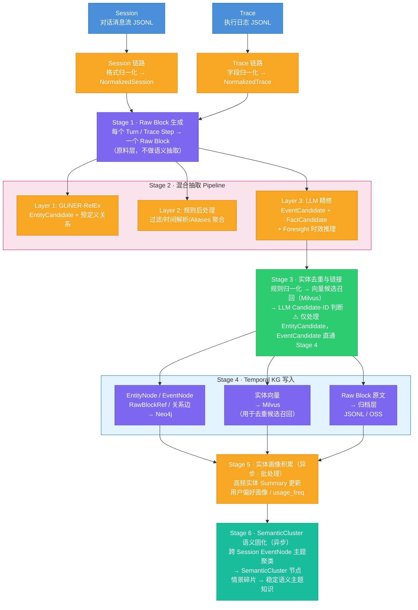
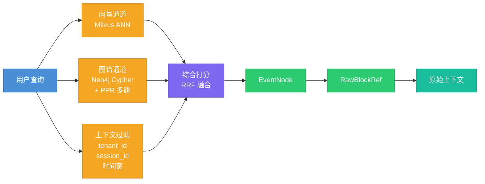
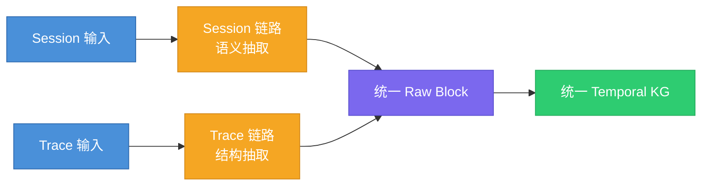

# AMS 语义记忆与情景记忆构建系统 - 完整方案设计（修改版）

---

## 第1章 系统定位与目标

### 1.1 输入源：Session 与 Trace

本系统的输入来自 Agent 运行时产生的两类原始数据：

| 视角    | Session            | Trace                         |
| ----- | ------------------ | ----------------------------- |
| 观察的是  | 用户与 Agent **说了什么** | Agent 内部**做了什么**              |
| 组织中心  | 对话时间线（turn-based）  | 执行树（span / step-based）        |
| 典型内容  | 意图、问题、约束、决策、指代     | 工具调用、状态、latency、artifact、错误重试 |
| 更适合回答 | "用户想做什么？意图如何演化？"   | "系统实际执行了什么？哪步成功/失败？"          |
| 语义密度  | 高（自然语言）            | 低（系统日志）                       |

两者的层级关系：

```
1 Session（一次任务会话，物理边界由上游框架确定）
  └── N 个 Turn（多轮对话）
        └── 每个 Turn 背后有 1/N 个 Trace
              └── 每个 Trace 有 N 个 Step（工具调用链）
```

Session 告诉你"用户要读 Excel 文件"，Trace 告诉你"python_executor 调用了 read_excel，耗时 420ms，成功返回"。

**为什么不能合并为一条链路处理**：Session 的核心难点在语义（指代消解、意图变化识别），Trace 的核心难点在结构（字段异构、执行链重建）。混合处理会让 pipeline 变得脆弱。

### 1.2 术语对照表

为避免概念混淆，本文档统一使用以下术语：

| 术语 | 定义 | 使用阶段 | 说明 |
|------|------|---------|------|
| **RawBlock** | 归一化后的原始数据块 | Stage 1 输出 | 统一原料格式，不做语义提炼 |
| **EntityCandidate** | 抽取阶段识别的实体候选 | Stage 2 中间产物 | 可能重复，未做跨会话归一 |
| **EntityNode** | 去重后入库的实体节点 | Stage 4+ | Neo4j 中的持久化节点 |
| **EventCandidate** | 抽取阶段识别的事件候选 | Stage 2 中间产物 | 可能重复，与特定 block 绑定 |
| **EventNode** | 入库后的事件节点 | Stage 4+ | Neo4j 中的持久化节点 |
| **FactCandidate** | 抽取阶段识别的关系候选 | Stage 2 中间产物 | 包含时效推理的中间结果 |
| **关系边** | 入库后的实体关系 | Stage 4+ | Neo4j 中的持久化边 |
| **Session** | 物理会话 | 全阶段 | 上游框架确定的边界 |
| **Episode** | 逻辑分段（可选） | Stage 6 聚类 | 通过 SemanticCluster 隐式实现 |

### 1.3 产出目标：语义记忆与情景记忆

#### 1.3.1 认知科学基础

| **维度** | **记忆类型**                        | **归属/等价关系**                                    | **在 Agent 中的定义与实现**                                 |
| ------ | ------------------------------- | ---------------------------------------------- | --------------------------------------------------- |
| 基础类别   | **Procedural Memory**（程序性记忆）    | 与 Declarative Memory 相互独立                      | **技能型记忆**。在 Agent 中表现为通过强化学习（RL）获得的策略或确定性硬编码逻辑      |
| 高层概念   | **Declarative Memory**（陈述性记忆）   | 等价于 Factual Memory                             | **事实型记忆**。可以被显式表达、检索和描述的知识                          |
| 陈述性子类型 | **Semantic Memory**（语义记忆）       | Declarative Memory 的子集                         | **通用知识**。独立于时间/空间的事实（如"法国的首都是巴黎"）。Agent 的训练语料主要属于此类 |
| 陈述性子类型 | **Episodic Memory**（情景记忆）       | Declarative Memory 的子集；等价于 Experiential Memory | **自传式记忆**。包含时空上下文的特定事件（如"Agent 昨天下午与用户A讨论了天气"）      |
| 功能扩展   | **Metacognitive Memory**（元认知记忆） | 独立维度（Memory about Memory）                      | **自反式循环**。Agent 对自身认知边界的意识（如"我知道我不具备这个信息"或评估任务复杂度）  |

本系统产出的是**陈述性记忆（Declarative Memory）**，包含两个子类型：

####  1.3.2 情景记忆（Episodic Memory）

对**特定事件**的有时间戳的回忆。它回答的问题是：

- 上次那个 CSV 列类型问题发生在哪个会话？
- read_excel 这次调用之前发生了什么？
- 某个报错是在对话哪个阶段提出来的？

情景记忆的载体是 **EventNode**（事件节点）和 **RawBlockRef**（原始证据引用）。

#### 1.3.3 语义记忆（Semantic Memory）

对**实体、概念、关系**的跨会话稳定认知。它回答的问题是：

- 这个用户常用哪些工具？
- pandas 和 read_excel 之间是什么关系？
- "那个库"在这个用户的上下文中通常指什么？

语义记忆的载体是 **EntityNode**（实体节点）和 **SemanticCluster**（语义主题群节点）。

#### 1.3.4 两类记忆的分工关系

| 记忆层                | 本系统对应                              | 存储位置        | 核心功能            |
| ------------------ | ---------------------------------- | ----------- | --------------- |
| **语义记忆**（稳定的实体知识）  | EntityNode + 关系边 + SemanticCluster | Neo4j       | 实体归一、关系推理、主题聚类  |
| **情景记忆**（具体的事件上下文） | EventNode + RawBlockRef            | Neo4j + 归档层 | 时序链构建、证据溯源、事件回溯 |

两者不是替代关系，而是**检索时的分工**：
- 用语义记忆（EntityNode）做**语义索引**——定位"我在找什么"
- 用情景记忆（EventNode → RawBlockRef）做**细节还原**——"当时具体发生了什么"

### 1.4 核心能力目标

#### 1.4.1 What

本系统构建完成后，应能稳定回答以下类型的问题：

**类型 1：实体查询** — 用户用过什么？什么时候用的？
> 场景：用户在新会话中再次提到 pandas，Agent 需要快速了解该用户与 pandas 的历史交互深度。

**类型 2：路径查询** — 两个概念之间有什么隐含关联？
> 场景：用户提到了 read_excel，但历史会话中从未直接讨论过它。

**类型 3：时间线重建** — 那次对话中到底发生了什么？
> 场景：用户说"上次那个 CSV 问题后来怎么样了"，Agent 需要还原完整经过。

**类型 4：因果追溯** — 用户的请求触发了什么执行？结果如何？
> 场景：Agent 需要复盘一次工具调用链，判断是哪步出了问题。

**类型 5：跨会话指代解析** — "上次那个"指的是什么？
> 场景：用户在新会话中说"上次那个问题，我换了读取方式"。

**类型 6：语义联想** — 历史上有没有类似的情况？
> 场景：用户遇到 Polars 读取 Parquet 文件的类型问题，Agent 需要举一反三。

#### 1.4.2 Why

这六类问题覆盖了一个记忆系统的**四种核心用途**：

| 用途                 | 对应类型 |
| ------------------ | ---- |
| **知道用户是谁**（用户画像）   | 1, 2 |
| **记得发生过什么**（经验回溯）  | 3, 4 |
| **理解用户在说什么**（指代消歧） | 5    |
| **联想相关经验**（检索增强）   | 6    |

### 1.5 系统边界

**包含**：
1. Session / Trace → Raw Block 的输入适配与归一化
2. LLM-Driven + Encoder 混合抽取
3. **实体去重与跨会话链接**
4. Temporal KG 写入与增量更新
5. **实体画像积累**
6. SemanticCluster 语义固化
7. 混合检索层（向量 + 图遍历 + PPR 多跳）
8. **遗忘机制**（时效衰减 + 置信度过期 + 显式覆盖）

**不包含**：
1. Agent 框架本身的设计与实现
2. Working Memory（上下文窗口管理）
3. 知识库（静态文档 / 源代码）的构建
4. 程序性记忆（Skill / 工作流存储）
5. 生产级多租户权限治理与计费

---

## 第2章 整体架构

### 2.1 全系统数据流

#### 构建流程



#### 检索流程



### 2.2 分层架构说明

| 层次        | 职责                             | 执行方式      |
| --------- | ------------------------------ | --------- |
| **输入适配层** | Session/Trace 归一化，Raw Block 生成 | 流式或批量，同步  |
| **抽取层**   | 混合架构抽取（Encoder + 规则 + LLM）     | 异步流水线     |
| **图谱存储层** | Temporal KG 写入，增量 Upsert，冲突处理  | 事务写入      |
| **画像层**   | 实体 Summary 更新，用户偏好积累           | 异步批处理     |
| **语义固化层** | SemanticCluster 构建与维护          | 定时触发或阈值触发 |
| **遗忘层**   | 时效衰减，低置信过期，显式覆盖                | 定时任务      |
| **检索层**   | 混合检索，PPR 多跳，证据溯源               | 同步查询服务    |

### 2.3 "前分后合"双链路策略

Session 和 Trace 采用**前端分离处理、后端融合到同一张 Temporal KG**：



写入同一张 Temporal KG 后，事件节点天然形成两个族群：
- **对话事件**（source_type=session）：user_request、problem、decision、solution
- **执行事件**（source_type=agent_trace）：tool_use、tool_result、artifact_create

EntityNode 归一后天然跨族群——同一个实体 `pandas` 不管从哪条链路抽出，都指向同一个节点。

EventNode 之间的因果关系通过显式的边表达：
- `REQUEST_LEADS_TO`：对话事件 → 执行事件
- `ATTEMPTS_TO_SOLVE`：执行事件 → 对话事件
- `EVIDENCES`：执行事件的结果 → 对话事件

### 2.4 三类存储的职责分工

| 存储                 | 职责                                   | 核心数据                                                         |
| ------------------ | ------------------------------------ | ------------------------------------------------------------ |
| **Neo4j**          | Temporal KG 主存储：关系、路径、**时序**、**溯源**  | EntityNode / EventNode / RawBlockRef / SemanticCluster / 关系边 |
| **Milvus**         | 向量索引：实体相似候选召回，辅助去重与检索                | 实体 embedding / SemanticCluster embedding                     |
| **归档层（JSONL/OSS）** | 原始内容持久化：Raw Block 原文、LLM 调用记录、抽取中间结果 | raw_blocks / extracted / dedup / debug                       |

---

## 第3章 数据模型（Graph Schema）

### 3.1 核心节点类型

#### EntityNode — 语义记忆的持久对象

跨会话可归一的稳定实体。

```cypher
(:EntityNode {
  entity_id:        "ent_acmecorp_01JQXXXXXX",
  tenant_id:        "acmecorp",
  name:             "pandas",
  entity_type:      "TOOL",
  aliases:          ["pd", "Pandas"],
  summary:          "Python 数据处理库，用户频繁用于 CSV/Excel 读写",
  usage_freq:       12,
  profile_hints:    ["data_processing", "file_io"],
  first_seen_at:    datetime("2026-03-28T14:32:00Z"),
  last_seen_at:     datetime("2026-03-31T09:15:00Z"),
  source_block_ids: ["blk_acmecorp_01...", "blk_acmecorp_02..."],
  created_at:       datetime(),
  updated_at:       datetime()
})
```

**实体类型定义**（控制在 6 类）：

| 类型         | 说明              | 示例                                  |
| ---------- | --------------- | ----------------------------------- |
| `TOOL`     | 工具、库、框架、API、执行器 | pandas, read_excel, python_executor |
| `CONCEPT`  | 技术概念、方法、参数、算法   | dtype, CSV解析, 数据清洗                  |
| `RESOURCE` | 文件、数据集、制品、URL   | data.csv, output.xlsx               |
| `PERSON`   | 用户、角色、Agent 实例  | 用户, Alice, agent_v2                 |
| `ORG`      | 组织、系统、服务、团队     | Acme Corp, DataPlatform             |
| `ACTION`   | 关键动作/任务（需关联参与者） | 读取Excel, 排查报错                       |

#### EventNode — 情景记忆的时序单元

**有时间、有参与者、有状态的瞬时事件**。

```cypher
(:EventNode {
  event_id:                   "evt_acmecorp_01JQXXXXXX",
  tenant_id:                  "acmecorp",
  event_type:                 "tool_use",
  summary:                    "python_executor 调用 read_excel 读取 data.xlsx",
  event_time:                 datetime("2026-03-31T09:15:20Z"),
  time_resolution_confidence: 0.95,
  confidence:                 0.90,
  session_id:                 "sess_acmecorp_01B",
  semantic_cluster_id:        null,
  source_block_id:            "blk_acmecorp_01B_S1",
  source_type:                "agent_trace",
  created_at:                 datetime()
})
```

**事件类型定义**（控制在 7 类）：

| 类型                | 适用来源    | 说明             |
| ----------------- | ------- | -------------- |
| `user_request`    | Session | 用户提出需求或问题      |
| `decision`        | Session | 用户或 Agent 做出决策 |
| `problem`         | Session | 出现问题/报错        |
| `solution`        | Session | 问题被解决，方案被确认    |
| `tool_use`        | Trace   | 工具被调用          |
| `tool_result`     | Trace   | 工具返回结果（成功/失败）  |
| `artifact_create` | Trace   | 产生了关键制品/文件/输出  |

#### RawBlockRef — 情景记忆的证据锚点

轻量溯源节点，指向原始 Raw Block。

```cypher
(:RawBlockRef {
  block_id:    "blk_acmecorp_01A_T1",
  tenant_id:   "acmecorp",
  source_type: "session",
  source_uri:  "session://sess_acmecorp_01A/turn/1",
  timestamp:   datetime("2026-03-28T14:32:05Z"),
  session_id:  "sess_acmecorp_01A"
})
```

#### SemanticCluster — 语义固化的主题知识节点

对多个 EventNode 做主题聚类后生成的语义摘要节点。

```cypher
(:SemanticCluster {
  cluster_id:   "cls_acmecorp_01JQXXXXXX",
  tenant_id:    "acmecorp",
  theme:        "pandas 数据文件读写问题排查",
  summary:      "用户在多个会话中处理 pandas 读取 CSV/Excel 的类型识别和日期解析问题，...",
  period_start: datetime("2026-03-28T00:00:00Z"),
  period_end:   datetime("2026-03-31T23:59:59Z"),
  event_count:  9,
  embedding:    [1536维向量],
  created_at:   datetime(),
  updated_at:   datetime()
})
```

### 3.2 完整边类型目录

#### A. 实体关系边（EntityNode ↔ EntityNode）

| 边类型          | 说明              | 示例                                 |
| ------------ | --------------- | ---------------------------------- |
| `USES`       | 实体使用工具/库        | 用户 USES pandas                     |
| `INVOKES`    | 工具调用子方法/API     | python_executor INVOKES read_excel |
| `PRODUCES`   | 产生制品/输出         | tool_use PRODUCES output.xlsx      |
| `MENTIONS`   | 会话中被提及          | 用户 MENTIONS data.csv               |
| `RELATES_TO` | 通用语义关联          | pandas RELATES_TO CSV解析            |
| `CAUSED_BY`  | 因果关系（有明确证据时）    | solution CAUSED_BY tool_result     |
| `SYNONYM_OF` | 语义相近但表面不同（离线生成） | 分布式追踪 SYNONYM_OF 链路追踪              |

所有实体关系边携带时间有效性字段：
```
{
  fact_text:          "用户使用 pandas 处理 CSV 格式数据",
  valid_at:           datetime("2026-03-28"),
  invalid_at:         null,
  superseded_at:      null,
  validity_reasoning: "Active in current session, may change to other formats",
  confidence:         0.88,
  source_block_id:    "blk_acmecorp_01A_T1"
}
```

#### B. 事件时序边（EventNode → EventNode）

| 边类型 | 方向 | 说明 |
|--------|------|------|
| `PRECEDES` | A → B | A 在时序上先于 B（主持久化边） |

> 只持久化 `PRECEDES`，`FOLLOWS` 为查询视角的派生关系。

#### C. 参与与溯源边

| 边类型 | 连接 | 说明 |
|--------|------|------|
| `PARTICIPATES_IN` | EntityNode → EventNode | 实体参与了某个事件，携带 `role` 字段 |
| `DERIVED_FROM` | EventNode → RawBlockRef | 事件溯源到原始 block |

#### D. Session-Trace 桥接边

| 边类型 | 说明 |
|--------|------|
| `REQUEST_LEADS_TO` | 对话事件（用户请求）触发了执行事件 |
| `ATTEMPTS_TO_SOLVE` | 执行事件尝试解决某个对话事件中的问题 |
| `EVIDENCES` | 执行事件的结果为某个对话结论提供了证据 |

#### E. 语义固化边

| 边类型 | 连接 | 说明 |
|--------|------|------|
| `AGGREGATES` | SemanticCluster → EventNode | Cluster 聚合了哪些事件 |
| `REPRESENTS` | SemanticCluster → EntityNode | Cluster 代表的核心实体/主题 |

### 3.3 完整 Cypher Schema

```cypher
-- ============================================================
-- 节点属性约束
-- ============================================================
CREATE CONSTRAINT entity_id_unique IF NOT EXISTS
  FOR (n:EntityNode) REQUIRE n.entity_id IS UNIQUE;
CREATE CONSTRAINT event_id_unique IF NOT EXISTS
  FOR (n:EventNode) REQUIRE n.event_id IS UNIQUE;
CREATE CONSTRAINT block_id_unique IF NOT EXISTS
  FOR (n:RawBlockRef) REQUIRE n.block_id IS UNIQUE;
CREATE CONSTRAINT cluster_id_unique IF NOT EXISTS
  FOR (n:SemanticCluster) REQUIRE n.cluster_id IS UNIQUE;

-- ============================================================
-- 索引
-- ============================================================
CREATE INDEX entity_name_idx IF NOT EXISTS
  FOR (n:EntityNode) ON (n.tenant_id, n.name);
CREATE INDEX entity_type_idx IF NOT EXISTS
  FOR (n:EntityNode) ON (n.tenant_id, n.entity_type);
CREATE INDEX event_time_idx IF NOT EXISTS
  FOR (n:EventNode) ON (n.event_time);
CREATE INDEX event_session_idx IF NOT EXISTS
  FOR (n:EventNode) ON (n.tenant_id, n.session_id);
CREATE INDEX event_type_idx IF NOT EXISTS
  FOR (n:EventNode) ON (n.tenant_id, n.event_type);
CREATE INDEX block_session_idx IF NOT EXISTS
  FOR (n:RawBlockRef) ON (n.tenant_id, n.session_id);
CREATE INDEX cluster_theme_idx IF NOT EXISTS
  FOR (n:SemanticCluster) ON (n.tenant_id, n.theme);
```

---

## 第4章 输入适配与 Raw Block 生成

### 4.1 Raw Block Schema

```json
{
  "block_id":        "blk_acmecorp_01A_T1",
  "tenant_id":       "acmecorp",
  "source_type":     "session",
  "content":         "user: 我用 pandas 处理了一个 CSV，有个列的类型识别有问题。",
  "content_oss_key": null,
  "metadata": {
    "timestamp":   1743162725,
    "source_uri":  "session://sess_acmecorp_01A/turn/1",
    "session_id":  "sess_acmecorp_01A",
    "turn_index":  1,
    "speaker":     "user",
    "step_index":  null,
    "tool_name":   null
  },
  "embedding":  null,
  "triples":    null
}
```

### 4.2 Session 边界策略：物理边界信任上游，逻辑分段由聚类实现

#### 物理边界（Session）

本系统**信任上游 Agent 框架的 `session_id`**，不做二次切分。

```python
# 对接 Langflow 的输入适配
def adapt_langflow_session(langflow_payload: dict) -> NormalizedSession:
    return NormalizedSession(
        session_id=langflow_payload["session_id"],   # 直接用框架的
        tenant_id=extract_tenant_id(langflow_payload),
        turns=[...]
    )
```

#### 逻辑分段（Episode）的隐式实现

如果上游 session 边界过长（如用户连续聊2小时），会导致 PRECEDES 链过长。

**解决方案**：不在输入层硬切，而是在 Stage 6 通过 SemanticCluster 隐式实现逻辑分段：
- 按语义相似度聚类，而非时间或话题边界
- 天然处理话题交织（一个 turn 可属于多个主题）
- 支持跨 session 的同主题聚合

| 维度 | 物理 Session | 逻辑 Episode（SemanticCluster） |
|------|-------------|-------------------------------|
| 边界确定 | 上游框架 | 语义聚类算法 |
| 实时性 | 实时 | 异步（定时触发）|
| 话题交织 | 硬切，错误归属 | 软聚，天然容忍 |
| 跨 session 聚合 | ❌ | ✅ |

### 4.3 Trace 链路：执行日志归一化

```json
{
  "session_id":    "sess_acmecorp_01A",
  "tenant_id":     "acmecorp",
  "step_index":    1,
  "tool_name":     "python_executor",
  "action":        "read_csv",
  "input_args":    {"file": "data.csv", "dtype": {"amount": "str"}},
  "status":        "success",
  "latency_ms":    320,
  "output_summary":"DataFrame 128 rows x 5 cols",
  "error_message": null,
  "timestamp":     1743162735
}
```

**多框架兼容策略**：通过 **适配器插件（Adapter Plugin）** 处理。

### 4.4 Stage 1：Raw Block 生成规则

| 来源 | 粒度 | 说明 |
|------|------|------|
| Session | 每个 Turn → 一个 Block | 保持 turn 原子性 |
| Trace | 每个 Step → 一个 Block | 保持 step 原子性，重试步骤各自生成独立 Block |

**超长内容处理**：
- Block 内容 < 4KB：直接存入 `content`
- Block 内容 ≥ 4KB：存 OSS，`content_oss_key` 记录路径

---

## 第5章 混合抽取 Pipeline（Encoder + 规则 + LLM）

### 5.1 设计思路：三层混合架构

每个 Raw Block 依次经过三层处理：

```
Raw Block
  → Layer 1: GLiNER-RelEx (Encoder 模型)     ~20-40ms    ~$0
  │  ├── EntityCandidate 抽取
  │  ├── 预定义关系分类
  │  └── 关系方向判断
  │
  → Layer 2: 规则 / 轻量工具                   ~5ms        ~$0
  │  ├── 停用词/代词过滤
  │  ├── 时间表达式解析
  │  ├── aliases 聚合
  │  └── 实体类型校验
  │
  → Layer 3: LLM 精修                         ~1-2s       $$
     ├── EventCandidate 抽取
     ├── FactCandidate 精修
     ├── validity_reasoning (Foresight)
     ├── invalid_at 时效预测
     └── 开放关系发现
```

#### 成本对比估算（每天 10,000 个 block）

| 方案 | 估算成本/天 | 延迟/block |
|------|-----------|-----------|
| 全 LLM（3 次调用/block） | ~$300 | ~3-6s |
| 混合架构（本方案） | ~$50-80 | ~1-2s |

### 5.2 GLiNER-RelEx 局限性评估与验证方案

#### 已知边界与风险

| 局限类型 | 具体问题 | 风险等级 | 缓解策略 |
|---------|---------|---------|---------|
| **训练数据偏差** | 主要在标准 NLP 数据集上训练，缺乏 Agent 对话数据 | 高 | 标注 100-200 条 Agent 样本验证 F1 |
| **非标准文本** | Trace 日志含半结构化文本（`tool=x; status=y`）| 高 | 预格式化或规则提取后再送入 GLiNER |
| **代码实体边界** | `pd.read_csv` 边界识别困难 | 中 | Layer 2 增加代码模式识别规则 |
| **中英文混合** | 专业术语密集场景泛化能力存疑 | 中 | 优先选用 mDeBERTa 多语言底座 |
| **跨 block 指代** | 无法处理"那个库"等指代 | 低 | 由 Layer 3 LLM 承担 |

#### 验证方案（阶段一必做）

```python
def validate_gliner_on_agent_data():
    """
    验证 GLiNER 在 Agent 领域的有效性
    """
    # 1. 准备标注数据
    annotated_blocks = load_annotated_agent_blocks(n=200)
    
    # 2. 运行 GLiNER
    gliner_results = [gliner_extract(block) for block in annotated_blocks]
    
    # 3. 计算指标
    metrics = {
        "entity_f1": compute_entity_f1(gliner_results, annotated_blocks),
        "precision": compute_precision(gliner_results, annotated_blocks),
        "recall": compute_recall(gliner_results, annotated_blocks),
    }
    
    # 4. 决策门限
    if metrics["entity_f1"] >= 0.80:
        return "PASS - 可放心用于 Layer 1"
    elif metrics["entity_f1"] >= 0.65:
        return "CONDITIONAL - 需微调后再用"
    else:
        return "FAIL - 回退到全 LLM 方案"
```

**验证数据集构成**：
- 50% 真实 Agent 对话（脱敏）
- 30% 模拟多轮技术对话
- 20% Trace 日志格式

### 5.3 Layer 1：GLiNER-RelEx 配置

```python
from gliner import GLiNER

model = GLiNER.from_pretrained("knowledgator/gliner-relex-multi-v1.0")

entity_labels = ["TOOL", "CONCEPT", "RESOURCE", "PERSON", "ORG", "ACTION"]
relation_labels = ["USES", "INVOKES", "PRODUCES", "MENTIONS", "RELATES_TO", "CAUSED_BY"]

entities, relations = model.predict_entities_and_relations(
    block_text, entity_labels, relation_labels, threshold=0.5
)
```

### 5.4 Layer 2：规则后处理

#### 停用词过滤

```python
STOP_ENTITIES = {
    "pronouns": {"我", "你", "它", "这个", "那个", "he", "she", "it", "this", "that"},
    "abstract_states": {"成功", "失败", "好的", "明白", "ok", "done"},
    "generic_words": {"东西", "内容", "数据", "stuff", "things"},
}

def filter_entities(entities: list[dict]) -> list[dict]:
    filtered = []
    for e in entities:
        text_lower = e["text"].strip().lower()
        if any(text_lower in stopset for stopset in STOP_ENTITIES.values()):
            continue
        if len(text_lower) <= 1:
            continue
        filtered.append(e)
    return filtered
```

#### 时间表达式分级规则

替代复杂的置信度公式，采用明确的分级规则：

| 时间来源 | 处理方式 | 时间置信度 | 说明 |
|---------|---------|-----------|------|
| ISO 8601 时间戳（Trace 日志） | 直接使用 | 0.95 | 精确时间戳 |
| 相对时间词（"昨天"/"上周"）+ REFERENCE_TIME | 推算绝对时间 | 0.70 | 可确定性解析 |
| 顺序词（"然后"/"之后"） | event_time=null | 0.30 | 仅表达相对顺序 |
| 无时间信息 | event_time=null | 0.20 | 无法推断 |

**时间置信度应用策略**：
- 高置信度（≥0.70）：正常构建 PRECEDES 边
- 中置信度（0.30-0.70）：构建 PRECEDES 边但标记 `confidence: 0.5`
- 低置信度（<0.30）：不构建 PRECEDES 边，仅保留 `event_time` 字段

### 5.5 Layer 3：LLM 精修

Layer 3 在 Layer 1+2 结果基础上进行增强补充。

#### 事件抽取 Prompt（注入 Layer 1+2 结果）

```
请从以下内容中提取关键事件。

<BLOCK_ID>{block_id}</BLOCK_ID>
<REFERENCE_TIME>{timestamp}</REFERENCE_TIME>

【预处理结果（供参考，可补充遗漏）】
已识别实体：{layer1_entities_json}
已解析时间：{layer2_parsed_times_json}

<CONTENT>
{content}
</CONTENT>

注意：
1. participants 字段优先使用已识别实体名称
2. 时间字段优先使用已解析结果
3. 发现预处理遗漏的重要信息可补充标注
```

---

## 第6章 实体去重与链接

### 6.1 三层去重策略

```
新抽取的 EntityCandidate
  → Step 1: 后处理归一化（规则，毫秒级）
  → Step 2: 候选召回（Milvus 向量相似度）
  → Step 3: LLM 去重判断（Candidate-ID 模式）
  → 归并结果 → 生成/复用 EntityNode
```

### 6.2 Step 1：后处理归一化

| 规则 | 示例 |
|------|------|
| 大小写统一 | `Pandas` → `pandas` |
| 去除首尾空格 | ` pandas ` → `pandas` |
| 常见缩写映射 | `pd` → `pandas` |
| 标点归一 | 全角/半角统一 |

### 6.3 Step 2：候选召回

**Milvus 集合设计**：
- 向量生成：`text = f"{name} ({entity_type})"`
- 召回阈值：余弦相似度 > 0.85
- 返回 Top-5 候选

### 6.4 Step 3：LLM Candidate-ID 判断

```python
class EntityResolution(BaseModel):
    new_entity_name: str
    matched_candidate_id: int     # -1 表示无匹配（新实体）
    merged_canonical_name: str
```

**判断规则**：
1. 宁可保守（返回 -1 创建新节点）也不要错误合并
2. 别名、缩写、同义词视为同一实体
3. 同名但实质不同的概念不合并（如编程语言"Java"与地名"Java岛"）

### 6.5 误合并风险控制

| 控制机制 | 具体措施 |
|---------|---------|
| 相似度阈值 | 候选召回余弦相似度 > 0.85（而非 0.7）|
| 观察期 | 新实体创建后 7 天内高频出现才参与候选召回 |
| 归并日志 | `merged_from` 字段记录旧 ID，支持人工审核和回滚 |
| 保守策略 | LLM 判断时明确提示"宁可保守也不要错误合并" |

---

## 第7章 Temporal KG 写入

### 7.1 写入原则

1. **溯源优先**：每个 EventNode 必须有 `source_block_id`
2. **增量 Upsert**：重复更新，补充扩充，冲突标记 `superseded_at`
3. **幂等性**：同一 `block_id` 多次写入结果一致
4. **事务边界**：一次完整的 Raw Block 处理作为一个事务

### 7.2 冲突检测与 superseded_at 机制

```cypher
// 1. 查找冲突的旧事实
MATCH (a:EntityNode {name: "用户"})-[r:USES]->(b:EntityNode)
WHERE r.valid_at < datetime("2026-03-31") AND r.superseded_at IS NULL
SET r.superseded_at = datetime("2026-03-31")
SET r.superseded_by_block = "blk_01B"

// 2. 写入新事实（作为新边，而非覆盖）
CREATE (a)-[:USES {
  valid_at: datetime("2026-03-31"),
  source_block_id: "blk_01B"
}]->(b_new)
```

### 7.3 高并发写入的事务控制

| 场景 | 解决方案 |
|------|---------|
| 并发更新同一 EntityNode | 使用 Neo4j `MERGE` 语句（原子性）|
| 数组追加操作 | 乐观锁或攒批处理 |
| 瞬时高并发 | Kafka 消息队列削峰 |

---

## 第8章 实体画像积累

### 8.1 画像字段与更新机制

```cypher
(:EntityNode {
  usage_freq: 12,
  usage_trend: [3, 5, 4],
  summary: "Python 数据处理库...",
  profile_hints: ["data_processing", "file_io"],
  first_used_by: "sess_acmecorp_01A",
  last_used_by: "sess_acmecorp_01F",
  updated_at: datetime()
})
```

### 8.2 更新触发条件

| 触发条件 | 阈值 | 说明 |
|---------|------|------|
| 引用次数阈值 | usage_freq % 10 == 0 | 每10次引用触发一次更新 |
| 时间窗口 | 距上次更新 > 7 天 | 定期刷新 |
| 高置信度新事实 | confidence > 0.9 | 重要信息立即更新 |

### 8.3 并发控制

```python
async def update_entity_profile(entity_id: str, new_data: dict):
    """
    使用乐观锁机制防止并发冲突
    """
    # 1. 读取当前版本
    current = await neo4j.get_entity(entity_id)
    current_version = current["profile_version"]
    
    # 2. 计算新值
    new_summary = await merge_summary(current["summary"], new_data)
    new_freq = current["usage_freq"] + 1
    
    # 3. 条件更新（乐观锁）
    result = await neo4j.run("""
        MATCH (e:EntityNode {entity_id: $entity_id, profile_version: $current_version})
        SET e.usage_freq = $new_freq,
            e.summary = $new_summary,
            e.profile_version = $current_version + 1,
            e.updated_at = datetime()
        RETURN e
    """, entity_id=entity_id, current_version=current_version,
         new_freq=new_freq, new_summary=new_summary)
    
    if not result:
        # 版本冲突，重试
        return await update_entity_profile(entity_id, new_data)
```

---

## 第9章 SemanticCluster：语义固化

### 9.1 构建触发条件

| 触发类型 | 条件 | 参数 |
|---------|------|------|
| 阈值触发 | 某 tenant 新增 EventNode > 100 个 | `cluster_trigger_threshold = 100` |
| 时间触发 | 每日凌晨 2:00 | `cluster_cron_schedule = "0 2 * * *"` |
| 主动触发 | 管理员手动调用 API | 全量重聚类 |

### 9.2 聚类算法参数

```python
# HDBSCAN 参数
CLUSTER_PARAMS = {
    "min_cluster_size": 3,           # 至少3个事件形成 Cluster
    "min_samples": 2,                # 核心点最小样本数
    "metric": "cosine",              # 余弦相似度
    "cluster_selection_method": "eom" # 最优平面选择
}

# 相似度阈值
CLUSTER_SIMILARITY_THRESHOLD = 0.85   # 新事件并入已有 Cluster 的阈值
CLUSTER_SPLIT_THRESHOLD = 50          # Cluster 内事件数超过50时触发分裂
```

### 9.3 Cluster 时效管理

| 状态 | 条件 | 处理策略 |
|------|------|---------|
| 活跃 | period_end 距当前 < 90 天 | 正常参与检索 |
| 陈旧 | period_end 距当前 90-365 天 | 降权处理，优先返回新 Cluster |
| 归档 | period_end 距当前 > 365 天 | 标记 archived，仅按需查询 |

---

## 第10章 检索层

### 10.1 三通道 Hybrid Retrieval

```
用户查询
  ↓
意图理解（轻量 LLM 分类）
  ↓
┌─────────────────────────────────────────────┐
│  向量通道      图谱通道       上下文过滤       │
│  Milvus ANN    Neo4j PPR    tenant/session   │
│  Top-K=20      Top-K=20     时间窗过滤       │
└─────────────────────────────────────────────┘
  ↓
RRF 融合（k=60）
  ↓
溯源还原 → 返回结果
```

### 10.2 RRF 融合参数

```python
# Reciprocal Rank Fusion 参数
RRF_PARAMS = {
    "k": 60,                    # RRF 常数，防止低排名项权重过高
    "vector_weight": 1.0,       # 向量通道权重
    "graph_weight": 1.0,        # 图谱通道权重
    "final_top_k": 10           # 融合后返回数量
}

def rrf_fusion(vector_results: list, graph_results: list) -> list:
    """
    RRF 融合打分
    """
    scores = {}
    
    # 向量通道打分
    for rank, item in enumerate(vector_results):
        doc_id = item["id"]
        scores[doc_id] = scores.get(doc_id, 0) + RRF_PARAMS["vector_weight"] / (RRF_PARAMS["k"] + rank + 1)
    
    # 图谱通道打分
    for rank, item in enumerate(graph_results):
        doc_id = item["id"]
        scores[doc_id] = scores.get(doc_id, 0) + RRF_PARAMS["graph_weight"] / (RRF_PARAMS["k"] + rank + 1)
    
    # 排序返回
    return sorted(scores.items(), key=lambda x: x[1], reverse=True)[:RRF_PARAMS["final_top_k"]]
```

### 10.3 PPR 多跳参数

```cypher
CALL gds.pageRank.stream('my_graph', {
  sourceNodes: [entry_node],
  relationshipTypes: ['PARTICIPATES_IN', 'PRECEDES', 'RELATES_TO'],
  dampingFactor: 0.85,      // 阻尼因子
  maxIterations: 20,        // 最大迭代次数
  tolerance: 0.0001         // 收敛阈值
})
```

### 10.4 时间窗过滤规则

| 查询类型 | 默认时间窗 | 可调范围 |
|---------|-----------|---------|
| 实体查询 | 全部历史 | 1天-全部 |
| 时间线查询 | 当前 session | 固定 |
| 语义联想 | 最近90天 | 7天-365天 |

---

## 第11章 遗忘机制

### 11.1 遗忘信号与触发条件

| 信号类型 | 触发条件 | 处理方式 |
|---------|---------|---------|
| 时效度衰减 | 当前时间 > invalid_at | 标记过期 |
| 陈旧标记 | 当前时间 - valid_at > 365天 | 标记陈旧，检索降权 |
| 低置信度过期 | confidence < 0.3 且 30天无更新 | 标记过期 |
| 显式覆盖 | 新事实冲突，旧事实标记 superseded_at | 保留但不参与检索 |

### 11.2 三级存储生命周期

| 存储层 | 数据状态 | 保留期限 | 访问方式 |
|-------|---------|---------|---------|
| Neo4j/Milvus | 活跃数据 | 90天 | 实时查询 |
| OSS 标准存储 | 温数据 | 90天-1年 | 按需加载 |
| OSS 归档存储 | 冷数据 | 1年-3年 | 延迟加载（分钟级）|

---

## 第12章 存储设计

### 12.1 多租户安全设计

#### Milvus 隔离策略

采用**单集合 + 分区过滤**模式（而非按 tenant 分集合）：

```python
# 创建集合时添加 tenant_id 字段
fields = [
    FieldSchema("entity_id", DataType.VARCHAR, max_length=64, is_primary=True),
    FieldSchema("tenant_id", DataType.VARCHAR, max_length=64),
    FieldSchema("embedding", DataType.FLOAT_VECTOR, dim=1536),
]

# 查询时强制过滤
def search_with_tenant_isolation(tenant_id: str, query_vector: list):
    return milvus_client.search(
        collection_name="entity_embeddings",
        data=[query_vector],
        filter=f'tenant_id == "{tenant_id}"',  # 强制租户隔离
        limit=10
    )
```

**安全防护措施**：
- 所有查询必须通过 SDK/API 层，禁止直接查询 Milvus
- SDK 层强制注入 `tenant_id` 过滤条件
- 审计日志记录所有跨租户查询尝试

#### Neo4j 隔离策略

```cypher
// 所有查询必须包含 tenant_id
MATCH (e:EntityNode {tenant_id: $tenant_id, name: $name})

// 创建复合索引支持租户隔离查询
CREATE INDEX entity_tenant_name_idx IF NOT EXISTS
  FOR (n:EntityNode) ON (n.tenant_id, n.name);
```

### 12.2 租户数据清理

```python
async def delete_tenant_data(tenant_id: str):
    """
    租户删除时的级联清理
    """
    # 1. Neo4j 删除（异步，可能影响性能）
    await neo4j.run("""
        MATCH (n) WHERE n.tenant_id = $tenant_id
        DETACH DELETE n
    """, tenant_id=tenant_id)
    
    # 2. Milvus 删除
    await milvus_client.delete(
        collection_name="entity_embeddings",
        expr=f'tenant_id == "{tenant_id}"'
    )
    
    # 3. 归档层标记删除（软删除，90天后物理清理）
    await oss.tag_for_deletion(prefix=f"raw_blocks/tenant={tenant_id}/")
```

---

## 第13章 评估体系

### 13.1 分层评估指标与测量方式

| 层次 | 指标 | 目标值 | 测量方式 |
|------|------|--------|---------|
| **抽取层** | 实体 Precision | > 0.80 | 3人标注，取多数投票为 gold |
| | 实体 Recall | > 0.70 | 同上 |
| | 时间置信度一致性 | > 0.80 | 与人工标注时间对比 |
| **去重层** | 实体归并准确率 | > 0.75 | 人工审核 100 条归并决策 |
| | 误合并率 | < 0.05 | 同上 |
| **图谱层** | 入库成功率 | > 0.98 | 自动化统计 |
| **检索层** | Recall@10 | > 0.75 | 100条标注查询，人工判断相关性 |
| | MRR | > 0.60 | 同上 |
| | 平均响应时间 | < 500ms | 压测工具（k6/locust）|

### 13.2 标注流程

```
标注数据集构建流程：
1. 抽样：从生产数据随机抽样 200+ session
2. 脱敏：自动 + 人工审核脱敏
3. 标注：3人独立标注，使用 LabelStudio
4. 仲裁：分歧处由专家仲裁
5. 验收：计算 Fleiss' Kappa > 0.7 视为可用
```

### 13.3 自动化评估 Pipeline

```python
def run_evaluation_pipeline():
    """
    自动化评估流程
    """
    # 1. 加载标注数据集
    dataset = load_annotated_dataset()
    
    # 2. 运行完整 pipeline
    predictions = []
    for sample in dataset:
        result = run_pipeline(sample.input)
        predictions.append(result)
    
    # 3. 计算各层指标
    metrics = {
        "extraction": compute_extraction_metrics(predictions, dataset),
        "dedup": compute_dedup_metrics(predictions, dataset),
        "retrieval": compute_retrieval_metrics(predictions, dataset),
    }
    
    # 4. 生成报告
    report = generate_report(metrics)
    
    # 5. 回归测试：与基线版本对比
    if metrics["retrieval"]["recall@10"] < BASELINE_RECALL_10:
        alert("检索指标下降，请检查改动")
    
    return report
```

---

## 第14章 Prompt 版本管理规范

### 14.1 版本命名规范

采用 **语义化版本**（SemVer）：`主版本.次版本.修订号`

| 版本变化 | 触发条件 | 示例 |
|---------|---------|------|
| 主版本（X.0.0）| Prompt 结构重大调整 | 从全量抽取改为增强模式 |
| 次版本（x.Y.0）| 新增/删除字段、规则调整 | 新增 validity_reasoning 要求 |
| 修订号（x.y.Z）| 措辞优化、示例调整 | 增加更多排除示例 |

### 14.2 目录结构

```
prompts/
├── v1.0.0/                    # 混合架构版本
│   ├── event_extraction_v1.0.0.txt
│   ├── fact_refinement_v1.0.0.txt
│   └── CHANGELOG.md           # 版本变更记录
├── v1.1.0/                    # 新增字段版本
│   ├── event_extraction_v1.1.0.txt
│   ├── fact_refinement_v1.1.0.txt
│   └── CHANGELOG.md
├── current -> v1.1.0/         # 符号链接指向当前版本
└── experiments/               # 实验性 prompt
    ├── event_extraction_experiment_a.txt
    └── event_extraction_experiment_b.txt
```

### 14.3 A/B 测试流程

```python
async def ab_test_prompts():
    """
    Prompt A/B 测试
    """
    # 1. 准备测试样本（100条）
    test_samples = load_test_samples(n=100)
    
    # 2. 分流：50% 使用 A 版本，50% 使用 B 版本
    results_a = []
    results_b = []
    
    for sample in test_samples:
        if random.random() < 0.5:
            result = await extract_with_prompt(sample, "v1.0.0")
            results_a.append(result)
        else:
            result = await extract_with_prompt(sample, "v1.1.0")
            results_b.append(result)
    
    # 3. 评估对比
    metrics_a = evaluate(results_a)
    metrics_b = evaluate(results_b)
    
    # 4. 决策
    if metrics_b["f1"] > metrics_a["f1"] + 0.05:  # 提升超过5%
        promote_to_production("v1.1.0")
    else:
        keep_current("v1.0.0")
```

### 14.4 回滚机制

```python
async def rollback_prompt(version: str):
    """
    Prompt 回滚
    """
    # 1. 验证版本存在
    if not version_exists(version):
        raise ValueError(f"Version {version} not found")
    
    # 2. 更新 current 符号链接
    update_symlink("current", version)
    
    # 3. 清理缓存
    await cache.invalidate("prompt_*")
    
    # 4. 记录回滚日志
    log_rollback(from_version=get_current_version(), to_version=version)
```

---

## 第15章 错误处理与监控

### 15.1 分层错误处理策略

| 层级 | 错误场景 | 处理策略 | 重试机制 |
|------|---------|---------|---------|
| Layer 1 | GLiNER 推理异常 | 降级为空结果 | 无 |
| Layer 2 | 规则处理异常 | 跳过该步骤 | 无 |
| Layer 3 | LLM API 超时 | 指数退避重试 | 3次，间隔 1s, 2s, 4s |
| Layer 3 | 结构化解析失败 | 记录日志，返回空结果 | 无 |
| Stage 3 | 去重服务异常 | 直接创建新实体（宁可重复）| 无 |
| Stage 4 | Neo4j 写入超时 | 放入死信队列，人工处理 | 异步重试 5 次 |

### 15.2 关键监控指标

| 指标类别 | 指标名称 | 告警阈值 | 采集频率 |
|---------|---------|---------|---------|
| **Pipeline** | 抽取成功率 | < 95% | 实时 |
| | 平均处理延迟 | > 5s | 实时 |
| | 队列堆积深度 | > 1000 | 实时 |
| **LLM** | API 调用成功率 | < 98% | 实时 |
| | 平均响应时间 | > 3s | 实时 |
| | 单条成本 | > $0.01 | 每小时 |
| **存储** | Neo4j 查询延迟 P99 | > 500ms | 每分钟 |
| | Milvus 查询延迟 P99 | > 100ms | 每分钟 |
| | 磁盘使用率 | > 80% | 每小时 |

### 15.3 监控仪表盘设计

```
Dashboard: AMS System Health
├─ Pipeline Overview
│  ├─ 处理速率 (blocks/min)
│  ├─ 各阶段成功率
│  └─ 平均处理延迟分布
├─ LLM Usage
│  ├─ 调用次数/分钟
│  ├─ 成功率 & 失败原因分布
│  ├─ 平均 Token 消耗
│  └─ 预估成本 ($/小时)
├─ Storage
│  ├─ Neo4j 节点数量趋势
│  ├─ Milvus 向量数量趋势
│  └─ 存储增长速率
└─ Quality
   ├─ 实体抽取 F1 趋势
   ├─ 去重准确率
   └─ 检索满意度（人工评分）
```

### 15.4 错误样例采样分析

```python
def sample_errors_for_analysis():
    """
    每日采样错误样例进行人工分析
    """
    # 1. 按错误类型分组
    errors = query_recent_errors(hours=24)
    
    # 2. 每类错误采样 10 条
    sampled = {}
    for error_type in errors.group_by("error_type"):
        sampled[error_type] = random.sample(errors[error_type], min(10, len(errors[error_type])))
    
    # 3. 生成分析报告
    report = generate_error_analysis_report(sampled)
    
    # 4. 如发现系统性问题，创建优化任务
    if report.has_systematic_issue():
        create_optimization_task(report.recommendation)
```

---

## 第16章 数据隐私与合规

### 16.1 PII 检测与脱敏

#### 检测规则

```python
PII_PATTERNS = {
    "email": r'\b[A-Za-z0-9._%+-]+@[A-Za-z0-9.-]+\.[A-Z|a-z]{2,}\b',
    "phone": r'\b1[3-9]\d{9}\b',  # 中国手机号
    "id_card": r'\b\d{17}[\dXx]\b',  # 身份证号
    "credit_card": r'\b(?:\d{4}[- ]?){3}\d{4}\b',
    "api_key": r'(api[_-]?key|token)[\s]*[:=][\s]*["\']?[\w-]+',
}

def detect_and_mask_pii(text: str) -> str:
    """
    检测并脱敏 PII
    """
    masked = text
    for pii_type, pattern in PII_PATTERNS.items():
        masked = re.sub(pattern, f"[{pii_type}_REDACTED]", masked)
    return masked
```

#### 处理流程

```
Raw Input
  ↓
PII Detection
  ↓
├─ 发现高置信度 PII → 立即脱敏，记录审计日志
├─ 发现低置信度 PII → 标记待审核，延迟处理
└─ 未发现 PII → 正常流程
```

### 16.2 数据保留期限

| 数据类型 | 保留期限 | 过期处理 |
|---------|---------|---------|
| Raw Block 原文 | 2年 | 脱敏后归档 |
| EntityNode / EventNode | 永久（除非用户删除）| 标记过期 |
| 向量索引 | 与图谱一致 | 同步删除 |
| 审计日志 | 5年 | 加密归档 |
| LLM 调用记录 | 90天 | 删除 |

### 16.3 用户删除权（Right to be Forgotten）

```python
async def handle_user_deletion_request(user_id: str, tenant_id: str):
    """
    处理用户删除请求（GDPR/CCPA 合规）
    """
    # 1. 验证身份
    await verify_user_identity(user_id)
    
    # 2. 查询所有相关数据
    sessions = await get_user_sessions(user_id, tenant_id)
    
    # 3. 级联删除
    for session_id in sessions:
        # 删除 EventNode
        await neo4j.run("""
            MATCH (e:EventNode {session_id: $session_id})
            DETACH DELETE e
        """, session_id=session_id)
        
        # 删除 RawBlock
        await oss.delete(prefix=f"raw_blocks/tenant={tenant_id}/session={session_id}/")
    
    # 4. 更新 EntityNode（移除 user 相关的边）
    await cleanup_user_references(user_id, tenant_id)
    
    # 5. 记录删除审计日志
    await log_deletion(user_id, tenant_id, deleted_sessions=len(sessions))
    
    # 6. 发送确认
    await notify_user_deletion_complete(user_id)
```

### 16.4 审计日志设计

```json
{
  "timestamp": "2026-04-13T10:30:00Z",
  "event_type": "ENTITY_QUERY",
  "tenant_id": "acmecorp",
  "user_id": "user_001",
  "query_params": {
    "entity_name": "pandas",
    "session_id": "sess_xxx"
  },
  "result_count": 5,
  "response_time_ms": 120,
  "ip_address": "10.0.0.1",
  "user_agent": "AMS-Client/1.0"
}
```

**审计事件类型**：
- `DATA_INGEST`：数据写入
- `ENTITY_QUERY`：实体查询
- `USER_DELETION`：用户删除
- `ADMIN_ACTION`：管理员操作

---

## 第17章 风险与取舍

### 17.1 降级预案触发条件

| 场景 | 触发条件 | 降级策略 | 恢复条件 |
|------|---------|---------|---------|
| LLM 服务不可用 | 连续 5 次调用失败 或 平均响应时间 > 10s | 切换到规则抽取（预定义工具名白名单）| LLM 服务恢复且连续 3 次成功 |
| Neo4j 写入延迟 | P99 延迟 > 5s 持续 2 分钟 | 异步队列缓冲，写入降级为批量模式（每 5 秒批量写入一次）| P99 延迟 < 1s 持续 5 分钟 |
| Milvus 查询超时 | P99 延迟 > 500ms 持续 1 分钟 | 跳过向量召回，仅使用图谱遍历 | P99 延迟 < 200ms 持续 3 分钟 |
| GLiNER 服务异常 | 连续 10 次推理失败 | 回退到全 LLM 抽取（增加 1 次 LLM 调用）| GLiNER 服务恢复 |
| 存储空间不足 | 磁盘使用率 > 90% | 暂停非关键任务（SemanticCluster 构建），触发紧急数据归档 | 磁盘使用率 < 70% |

### 17.2 技术风险矩阵

| 风险 | 影响 | 概率 | 缓解措施 |
|------|------|------|---------|
| GLiNER 在 Agent 数据上效果不佳 | 抽取质量下降 | 中 | 验证期标注评估，F1<0.65 则微调或回退 |
| 实体去重误合并 | 图谱噪声，错误答案 | 中 | 保守阈值（0.85），宁可多节点 |
| 时序边错误 | 因果链断裂 | 中 | 时间置信度分级，低置信不建边 |
| 多租户数据泄露 | 严重的安全问题 | 低 | SDK 强制过滤，审计日志，定期安全审计 |

---

## 附录 A：完整 Prompt 模板集

### A.1 Layer 3 事件抽取 Prompt

```
你是一个从 Agent 交互中提取关键事件的专家。

【事件类型定义】
- user_request: 用户提出需求或问题
- decision: 用户或 Agent 做出决策
- problem: 出现问题/报错
- solution: 问题被解决，方案被确认
- tool_use: 工具被调用
- tool_result: 工具返回结果
- artifact_create: 产生了关键制品

【时间处理规则】
时间置信度分级：
- 有明确时间戳（Trace 日志）→ confidence=0.95
- 有相对时间词（昨天/上周）→ 结合 REFERENCE_TIME 推算，confidence=0.70
- 只有顺序词（然后/之后）→ event_time=null, confidence=0.30
- 无任何时间信息 → event_time=null, confidence=0.20

【预处理结果】
以下内容由预处理模型生成，供你参考和补充：
已识别实体：{pre_extracted_entities}
已解析时间：{parsed_times}

【输出格式】
{
  "events": [
    {
      "event_type": "tool_use",
      "summary": "一句话事件描述（≤80字）",
      "participants": ["pandas", "data.csv"],
      "event_time": "2026-03-31T09:15:20Z",
      "time_resolution_confidence": 0.95
    }
  ]
}

【禁止提取】
- 静态状态描述："pandas 是一个库"
- 纯意图表达（没有实际发生）
- 重复的 trace 心跳/日志条目
```

### A.2 Layer 3 关系精修 Prompt

```
你是一个实体关系事实的精修专家。

【预处理结果】
已识别实体：{pre_extracted_entities}
预定义关系：{pre_extracted_relations}

【你的任务】
1. 为预抽取的每条关系补充 fact_text（自然语言描述）
2. 为每条关系推理 validity_reasoning 和 invalid_at（Foresight）
3. 发现预处理遗漏的隐含关系
4. 补充复杂的因果关系

【validity_reasoning 填写规则】
- API Key / Token / 临时授权 → "Credentials typically expire or rotate, estimate 90 days"
- 软件版本号 / 配置项 → "Version info changes with upgrades"
- 用户当前使用的工具 → "Active in current session, may change"
- 稳定的能力/概念关系 → "Stable semantic fact, unlikely to change"
- 组织/团队归属 → "Org membership is relatively stable"

【输出格式】
{
  "facts": [
    {
      "source_entity": "用户",
      "target_entity": "pandas",
      "relation_type": "USES",
      "fact_text": "用户使用 pandas 处理 CSV 格式数据",
      "valid_at": "2026-03-28T00:00:00Z",
      "invalid_at": null,
      "validity_reasoning": "Active in current session, may change to other formats"
    }
  ]
}
```

---

## 附录 B：API 接口规范

### B.1 写入接口

```http
POST /api/memory/ingest/session
Content-Type: application/json
X-Tenant-ID: acmecorp

{
  "session_id": "sess_xxx",
  "messages": [...]
}
```

### B.2 查询接口

```http
GET /api/memory/entity/{name}
X-Tenant-ID: acmecorp

Response:
{
  "entity": {...},
  "related_events": [...],
  "timeline": [...]
}
```

### B.3 管理接口

```http
POST /api/admin/cluster/build
X-Tenant-ID: acmecorp
X-Admin-Token: xxx

POST /api/admin/prompt/rollback
X-Admin-Token: xxx

{
  "version": "v1.0.0"
}
```

---

## 附录 C：配置文件模板

### C.1 系统配置（config.yaml）

```yaml
# 抽取层配置
extraction:
  gliner:
    model: "knowledgator/gliner-relex-multi-v1.0"
    threshold: 0.5
    device: "cuda"  # or "cpu"
  
  llm:
    model: "gpt-4o-mini"
    timeout: 30
    max_retries: 3
    temperature: 0.1

# 聚类配置
clustering:
  min_cluster_size: 3
  min_samples: 2
  similarity_threshold: 0.85
  trigger_threshold: 100
  cron_schedule: "0 2 * * *"

# 检索配置
retrieval:
  rrf_k: 60
  vector_weight: 1.0
  graph_weight: 1.0
  final_top_k: 10
  default_time_window_days: 90

# 遗忘配置
expiration:
  soft_delete_days: 90
  archive_days: 365
  hard_delete_days: 1095
  low_confidence_threshold: 0.3
  low_confidence_expire_days: 30

# 监控配置
monitoring:
  metrics_port: 9090
  log_level: "INFO"
  error_sampling_rate: 0.1
```

---

## 附录 D：核心参考文献与项目汇总

| 名称 | 类型 | 核心贡献 | 本系统应用 |
|------|------|---------|-----------|
| **Graphiti** (getzep/graphiti) | 开源项目 | Temporal KG、LLM-Driven 抽取 | 第3、5、6、7章 |
| **EverMemOS** (arXiv 2501.02163) | 论文 2026 | Foresight、MemScene | 第5、9、11章 |
| **HippoRAG** (arXiv 2405.14831) | 论文 2024 | PPR 多跳检索、KG=语义记忆框架 | 第2、6、10章 |
| **RAPTOR** (arXiv 2401.18059) | 论文 2024 | 树状检索、多粒度摘要 | 第10章 |
| **GraphRAG** (Microsoft) | 论文+开源 | Community Summary | 第9章 |
| **GLiNER** (knowledgator) | 开源项目 | 零样本 NER | 第5章 |
| **GLiNER-RelEx** (knowledgator) | 开源项目 | 联合 NER+RE | 第5章 |
| **Langfuse** | 开源项目 | Trace 格式 | Trace 归一化参考 |
| **Neo4j GDS** | 工具库 | PPR、社区发现 | 第10章 |

---

*文档版本：v1.1*  
*最后更新：2026-04-13*  
*修改说明：根据评审建议优化术语定义、补充 GLiNER 验证方案、细化画像更新机制、增加 Prompt 版本管理、错误处理与监控、数据隐私与合规章节*
