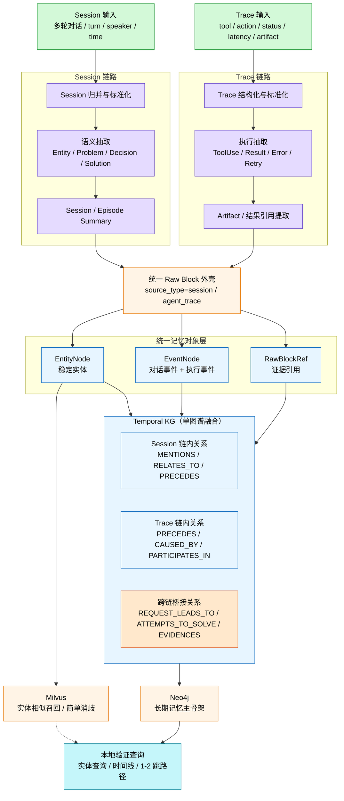

> [!info] 文档定位
> 本文档基于 [[AMS技术方案大纲&分工_版本3]] 重写，目标是把 Group 3 的方案收敛为 **2-3 周可落地的快速原型设计**。
>
> 与原版相比，本版重点做了 4 个调整：
> 1. 严格对齐版本 3 的横向分工边界
> 2. 对齐 TL 统一的 `Raw Block Schema v0.1` 和最小 ID 规范
> 3. 将“完整检索设计”收敛为“本地验证能力”
> 4. 将高级能力标记为后续演进，而非本期必做

> [!warning] 本期边界
> **本期不是完整产品设计，而是原型设计。**
>
> 本期 Group 3 只要求验证：
> - Session/Trace 是否能稳定转成结构化记忆
> - 是否能构建一个可查询的最小时序知识图谱
> - 是否能完成简单的实体关联与时间线展示
>
> 本期 **不要求** 实现完整检索层、复杂多跳推理、社区发现、复杂因果推断、自动修复与全局统一存储平台。

---

## 目录

1. [设计目标与边界](#1-设计目标与边界)
2. [知识图谱在 Agent Memory 中的定位与作用](#2-知识图谱在-agent-memory-中的定位与作用)
3. [职责范围与跨组边界](#3-职责范围与跨组边界)
4. [输入数据与公开数据集](#4-输入数据与公开数据集)
5. [共享规范对齐：Raw Block 与 ID](#5-共享规范对齐raw-block-与-id)
6. [原型处理 Pipeline](#6-原型处理-pipeline)
7. [数据存储设计（原型版）](#7-数据存储设计原型版)
8. [本地验证与评估方案](#8-本地验证与评估方案)
9. [开发排期与交付物](#9-开发排期与交付物)
10. [风险、取舍与后续演进](#10-风险取舍与后续演进)

---

## 1. 设计目标与边界

### 1.1 核心目标

Group 3 的核心目标是：

**从用户会话和 Agent Trace 中提取结构化记忆，构建最小时序知识图谱（Temporal KG），验证“跨轮次、跨会话回忆”的技术可行性。**

本期原型关注三个问题：

1. **能否抽出记忆单元**：从 Session/Trace 中抽取实体、事件、关系、时间信息
2. **能否形成时序图**：把记忆组织为可追溯的时间线和实体关系图
3. **能否支持本地验证**：支持简单实体查询、时间线查看、路径查看，用于演示和离线评估

### 1.2 本期必须完成的能力

| 级别  | 能力           | 说明                                  |
| --- | ------------ | ----------------------------------- |
| P0  | Session 归并   | 将多轮对话按任务边界归并为 session / episode     |
| P0  | Trace 结构化    | 将 Agent trace 归一为标准输入格式             |
| P0  | Raw Block 生成 | 输出对齐 TL 规范的 `Raw Block Schema v0.1` |
| P0  | 实体抽取         | 从会话/trace 中抽取关键实体                   |
| P0  | 事件抽取         | 抽取最小事件结构（触发词、参与者、时间）                |
| P0  | 时序边构建        | 构建 `precedes` / `follows` 等最小时序关系   |
| P0  | Neo4j 写入     | 将实体、事件、关系写入图数据库                     |
| P1  | 简单实体链接       | 基于规则 + 向量相似度识别跨会话同一实体               |
| P1  | Milvus 接入    | 用于实体消歧或相似实体召回                       |
| P1  | 本地验证接口       | 支持实体查询、时间线查询、1-2 跳路径查看              |
| P2  | 遗忘机制         | 先保留字段与策略，不做完整自动化                    |

### 1.3 本期明确不做的内容

> [!tip] 后续演进，不纳入 2-3 周原型验收

- 完整检索层服务化
- 基于 PPR / GDS 图算法增强的 Graph RAG 与多跳推理能力 ([[PPR&Graph RAG&GDS与多跳推理框架]])
- 社区发现（Leiden 等[[Leiden算法详解]]）
- [[自动因果链修复与全局一致性修复]]
- 全量文档 + 会话 + 代码的统一全局图谱
- 复杂权限、多租户隔离治理、生产级运维方案

---

## 2. 知识图谱在 Agent Memory 中的定位与作用

在第 1 章明确本期目标、能力边界与非目标之后，本章进一步回答“为什么 Group 3 需要以知识图谱作为记忆组织骨架”，并说明其与 Raw Block、向量召回、会话归档之间的职责关系。

> [!info] 定位摘要
> 在本方案中，知识图谱不是单纯的“图数据库存储层”，而是 Agent 长期记忆的组织骨架。它负责把 Session/Trace 这类原始交互数据转成**可追溯、可关联、可沿时间线查询的结构化记忆**，并为**跨轮次、跨会话回忆**提供基础。
> **参考：**[[知识图谱和图数据库的关系]]

### 2.1 为什么 Agent Memory 需要知识图谱

**AMS 场景中的原始输入主要包括：**
- 用户多轮会话
- Agent trace / tool 调用日志
- 上游归档后的 session 数据
- Knowledge Block 输入

这些数据天然具有 4 个特点：
1. **流式**：随着对话和执行过程不断产生
2. **碎片化**：单个 turn / trace step 自身信息有限
3. **上下文依赖强**：很多表达如“刚才那个库”“上次那个问题”只有放回历史中才有意义
4. **时间敏感**：同一个事实在不同时间点的价值不同，很多记忆依赖先后顺序而不是单个事实本身

如果只把这些内容按日志或归档形式保存，那么系统最多得到“历史记录”，而不是真正可用的 Memory。要让 Agent 具备长期回忆能力，需要把原始交互进一步转化为：
- **实体**：人、组织、工具、概念、文件、动作
- **事件**：用户请求、工具使用、工具结果、问题、解决方案、决策等
- **关系**：`uses`、`mentions`、`related_to`、`precedes`、`follows` 等
- **时间信息**：事件时间、时间范围、相对时间、顺序线索

因此，知识图谱在 Agent Memory 中首先承担的是**结构化转换层**的职责：它把“说过的话、做过的事、调用过的工具”转化为后续可查询、可关联、可验证的长期记忆单元。

### 2.2 知识图谱在本方案中的核心作用

#### 2.2.1 作为“非结构化交互 -> 结构化长期记忆”的转换层

Group 3 的核心流程本质上是：

`Session / Trace -> Raw Block -> 实体/事件/关系/时间抽取 -> Temporal KG`

其中 Raw Block 提供跨组统一的输入/输出单元，而知识图谱负责把 Raw Block 中的语义进一步组织起来。没有图谱时，Memory 更接近归档；有图谱后，Memory 才具备结构化和可计算性。

例如：
- 会话中出现“昨天我用 pandas 处理了一个 CSV，今天想继续把 Excel 也读进来”
- trace 中出现 `tool=python_executor; action=read_excel; status=success`

图谱层可以进一步沉淀为：
- 实体：`用户`、`pandas`、`python_executor`
- 事件：`tool_use(read_excel)`
- 关系：`用户 uses pandas`、`python_executor invokes read_excel`
- 时序：`昨天 -> 今天`、`前置步骤 -> 当前步骤`

#### 2.2.2 作为“跨会话连续性”的组织骨架

根据 [[AMS技术方案大纲&分工_版本3]]，Group 3 的知识图谱与 Group 2 的轻量图结构的根本区别在于：**前者是全局、动态、时序驱动的记忆组织；后者更偏局部、静态、结构驱动的关联表示。**

在 Agent Memory 场景中，系统需要回答的不只是“某段文本里提到了什么”，更重要的是：
- 用户昨天提到的工具，今天是否再次出现？
- “刚才那个库”是否指向上次会话中的 `pandas`？
- 当前问题是不是前一个 session 中未完成任务的延续？
- 某个问题是如何从“报错”演化到“定位原因”再到“解决方案”的？

这类问题的共同点是：都依赖**跨轮次、跨 session 的连续性建模**。因此，知识图谱在 Agent Memory 中不是可有可无的附加层，而是把“孤立上下文窗口”连接成“持续任务轨迹”的核心结构。

#### 2.2.3 作为“时序记忆组织器”，而不只是事实存储器

本方案强调的是 **Temporal KG**，而不是普通的关系图。这一点非常关键。

在 Agent 场景中，很多记忆价值来自于事件的发生顺序，而不仅仅是事实本身。例如：
- 用户先提出需求，后补充约束
- Agent 先调用工具 A，再调用工具 B
- 错误先出现，随后被修复
- 某个方案先被否定，后来又被重新采用

因此，本方案把以下能力作为图谱核心：
- 事件抽取
- `precedes` / `follows` 等时序边
- 可选的 `caused_by`
- `SessionContext`（会话上下文） / `EventNode` / `EntityNode`
- timeline 查询与 1-2 跳路径查看

这意味着图谱不仅要表示“谁与谁有关”，还要表示“什么先发生、什么后发生、哪些事件来自同一条任务链”。

#### 2.2.4 作为“语义索引层”，补足关键词检索和向量召回的不足

在本期方案中：
- **Neo4j** 用于保存时序知识图谱
- **Milvus** 用于保存实体向量，支持相似召回和简单消歧
- **Raw Block / JSONL** 用于原始证据保留与调试回放

这三者并不是替代关系，而是分工关系：
- 向量库更擅长回答“像不像”
- 图谱更擅长回答“是什么、和谁有关、前后关系如何”
- Raw Block 更擅长回答“证据在哪、来源是什么”

例如下面这类问题，很难仅靠向量相似度稳定回答：
- “那个工具今天又在哪个事件里被使用了？”
- “`read_excel` 之前发生了什么？”
- “`pandas` 和 `read_excel` 之间是否存在路径关系？”
- “这个 session 中的问题是如何从报错演化到解决方案的？”

这些查询都依赖：
- 实体归一
- 关系类型
- 时间约束
- 路径遍历
- source block 溯源

因此，知识图谱在 Agent Memory 中承担的是**语义关系索引**和**时序结构索引**的职责，而不是简单的图存储。

#### 2.2.5 作为“可解释记忆”的证据骨架

本方案要求：
- 每个事件能够回溯到 `source_block_id`
- 每个实体保留 `source_block_ids`
- 图中的关系尽可能能够关联到来源 block、session 或 trace step
- 时间信息缺失时允许 `null`，但要保留来源和置信度说明 [[时间置信度的计算与应用]]

这样设计的目的，是避免 Memory 系统退化为“不可解释的黑盒回忆”。

在长期记忆场景中，常见风险包括：
1. **误合并**：把不同会话中的不同实体错误视为同一实体
2. **伪回忆**：模型基于模糊相似性生成了并不存在的“过去记忆”
3. **时序错乱**：事件存在，但顺序和因果关系错误

而有了知识图谱 + Raw Block 溯源之后，系统至少可以回答：
- 这条记忆来自哪个 turn 或 trace step？
- 为什么认为两个实体是同一个？
- 这条关系是规则抽取、向量候选，还是低置信度推断？
- 如果结论有误，应该回到哪个 block 进行修正？

因此，知识图谱也是后续进行冲突检测、质量治理、人工审核和遗忘策略设计的基础。

#### 2.2.6 作为后续高级 Memory 能力的基础设施

虽然本期原型明确不做：
- 完整检索层服务化
- Graph RAG / PPR / GDS 多跳推理框架
- 社区发现
- 自动因果链修复
- 自动遗忘 / 衰减 / 冲突修复

但这些能力未来都依赖图谱层的存在。

一旦 Temporal KG 建立起来，后续可以自然演进到：
- 多跳记忆检索
- 任务过程总结
- 用户偏好与工具使用画像沉淀
- 记忆冲突治理
- 重要度/时效度驱动的遗忘策略
- Graph-based Memory Retrieval / Graph RAG

因此，从系统演进角度看，知识图谱不是“锦上添花”的增强项，而是 Agent 长期记忆体系从原型走向可扩展系统的关键中间层。

### 2.3 为什么本期强调 Temporal KG，而不是普通关系图

| 维度 | 普通关系图 | 本期 Temporal KG |
|------|------------|------------------|
| 关注重点 | 实体之间是否存在关系 | 实体、事件、关系及其时间顺序 |
| 核心对象 | 节点 + 边 | `EventNode` + `EntityNode` + `RawBlockRef` + 时序边（`session_id` 默认作为 `SessionContext` 保留；若后续需要显式会话容器，再引入容器节点） |
| 时间建模 | 通常弱或缺失 | 显式建模 `event_time`、`time_start`、`time_end`、`precedes`、`follows` |
| 适合回答的问题 | “A 和 B 是否相关？” | “A 何时出现？”“B 在 A 之前还是之后？”“问题是如何演化的？” |
| 对 Agent Memory 的价值 | 表示局部关系 | 组织跨轮次、跨会话、跨事件的长期记忆 |
| 本期落地形态 | 不单独作为目标 | Group 3 的最小可用核心形态 |

从 Group 3 的原型目标来看，本期真正要验证的不是“能不能把数据写入图数据库”，而是：

1. 能否把 Session/Trace 稳定转成结构化记忆单元  
2. 能否组织出可查询的时间线和实体关系  
3. 能否支撑简单但可信的回忆与展示  

因此，本期强调的是 **Temporal KG 作为记忆组织方式**，而不仅仅是“把数据存进 Neo4j”。

### 2.4 知识图谱与 Raw Block、向量召回、会话归档的关系

从 Agent Memory 的整体分层看，可以把本方案理解为以下几个相互配合的层次：

1. **Working Memory / 当前上下文层**  
   负责支撑当前会话内的推理与响应，强调短期可用性和上下文管理，不等于长期记忆。

2. **Session Archive / Raw Block 层**  
   负责沉淀原始会话 turn、trace step 及其 metadata，是记忆的原料层和证据层。

3. **向量召回层（Milvus）**  
   负责相似实体候选召回、近义提及匹配和简单消歧，擅长“相似性”而不是“关系性”。

4. **知识图谱层（Neo4j / Temporal KG）**  
   负责把实体、事件、时序和路径组织起来，是长期记忆的结构骨架。

5. **本地 JSONL / 调试归档层**  
   负责离线调试、回放、人工核验和评估，不直接承担 Memory 服务层职责。

这几层之间的关系可以概括为：

- **Raw Block 是记忆原料**
- **Milvus 是相似召回器**
- **Temporal KG 是长期记忆的组织骨架**
- **Working Memory 是当前推理窗口**
- **JSONL / 调试归档是离线验证与追溯辅助层**

### 2.5 Agent Memory 各存储/结构职责对比

| 组件 / 层次                     | 主要存储对象                                                    | 时间跨度       | 核心职责                          | 是否支持跨会话关联         | 是否支持时序/路径查询           | 是否适合作为长期记忆主骨架           | 本期定位                |
| --------------------------- | --------------------------------------------------------- | ---------- | ----------------------------- | ----------------- | --------------------- | ----------------------- | ------------------- |
| Working Memory / Redis      | 当前会话上下文、短期状态、压缩结果、任务中间态                                   | 秒级 ~ 小时级   | 支撑当前对话与推理、减少上下文丢失             | 弱，通常以单 session 为主 | 否                     | 否                       | Group 1 负责，本组可选联调输入 |
| Session Archive / Raw Block | turn、trace step、metadata、`source_uri`、初始 triples          | 天级 ~ 长期    | 统一输入输出单元、证据沉淀、可追溯归档           | 间接支持，但需要上层链接逻辑    | 只支持基于时间戳的简单过滤，不擅长路径查询 | 否，它更像原料层                | **P0 必做**           |
| Milvus / 实体向量索引             | 实体 embedding、名称、类型、更新时间等                                  | 中长期        | 相似实体候选召回、别名匹配辅助、简单消歧          | 是，但主要基于相似度而不是显式关系 | 否                     | 否，它更像增强层                | **P1 / 可选增强**       |
| Neo4j / Temporal KG         | `EntityNode`、`EventNode`、`RawBlockRef`、时序边、实体关系（可选会话容器节点） | 中长期        | 组织长期记忆、支撑实体查询、时间线查看、1-2 跳路径查看 | 是                 | 是                     | 是，是 Group 3 Memory 的主骨架 | **P0 核心**           |
| 本地 JSONL / 调试归档             | `NormalizedSession`、`NormalizedTrace`、中间抽取结果、离线样例         | 调试期 ~ 长期留档 | 回放、排错、离线评估、人工核验               | 否                 | 否                     | 否                       | **P0 辅助**           |

> [!tip]
> 用一句话概括：**Raw Block 是记忆原料，Milvus 是相似召回器，Temporal KG 是长期记忆的组织骨架。**

### 2.6 本期原型阶段的现实目标与边界

结合 [[AMS技术方案大纲&分工_版本3]] 与本文档的范围定义，本期原型需要证明的重点并不是“复杂图推理能力”，而是以下三点：

1. **能够把 Session/Trace 转成可沉淀的记忆单元**  
   即：稳定抽取实体、事件、关系和时间，并保留 block 级溯源能力。

2. **能够把分散的会话串成任务连续体**  
   即：通过 session 归并、实体链接和时序边，把孤立的 turn/step 组织为连续任务轨迹。

3. **能够支撑本地可验证的回忆能力**  
   即：至少支持实体查询、时间线查询、1-2 跳路径查看，并返回对应证据 block。

因此，在本期原型阶段，知识图谱的价值不在于证明“图谱很高级”，而在于证明：

> **Agent 能借助图谱，把过去发生过的事情，以结构化、连续化、可证据化的方式重新找回来。**

---

## 3. 职责范围与跨组边界

在明确“为什么要做知识图谱”之后，接下来需要进一步收敛“Group 3 具体负责做到哪里、哪些部分属于跨组依赖、哪些部分不应被纳入本期核心范围”。因此，本章重点界定 Group 3 的职责闭环与跨组边界，避免实现阶段范围继续膨胀。

### 3.1 Group 3 的职责

Group 3 对 **Session/Trace 数据类型** 负责，端到端完成：

```text
Session / Trace
  -> 标准化
  -> Raw Block
  -> 实体 / 事件 / 关系抽取
  -> 实体链接
  -> Temporal KG
  -> 本地验证
```

### 3.2 与 Group 1 / Group 2 的边界

| 组别 | 负责内容 | Group 3 是否依赖 |
|------|----------|------------------|
| Group 1 | Agent 行为采集、Working Memory、Compact、Session Archive | **可选联调，不是核心依赖** |
| Group 2 | 文档/代码解析、Tree 构建、轻量图结构 | **可选补充输入，不是核心依赖** |
| Group 3 | Session/Trace 结构化记忆与 Temporal KG | **本组核心职责** |

### 3.3 两种运行模式

#### 模式 A：独立原型模式（本期默认）

Group 3 直接消费以下任一输入：
- 原始会话 JSONL
- Agent trace JSONL
- 简化版 Session/Trace Mock 数据

该模式下，Group 3 不依赖 Group 1 / Group 2 的交付也能独立跑通。

#### 模式 B：联调增强模式（Week 3 可选）

- 从 Group 1 接入归档后的 session 数据
- 从 Group 2 接入已经标准化的知识 block

注意：联调增强模式只用于演示增强，**不作为本期验收前置条件**。

---

## 4. 输入数据与公开数据集

在第 3 章明确职责闭环与跨组边界之后，下一步需要回答“本期原型具体以什么数据启动、不同阶段分别使用哪些输入源”。因此，本章重点说明主输入来源、公开数据集的阶段化使用方式，以及 demo 与后续联调数据之间的衔接关系。

### 4.1 本期主输入数据

| 输入类型 | 当前阶段来源 | 是否本期必需 | 说明 |
|---------|-------------|--------------|------|
| Session | 公开会话数据集 / Agent Framework 对话记录 | 是 | 开发阶段可先用公开数据集或 mock session，联调后切换真实对话记录 |
| Trace | 公开 trace 数据集 / Agent-TES / 工具调用日志 | 是 | 开发阶段可先用 [ToolBench](https://github.com/OpenBMB/ToolBench) 等代理样本，联调后切换真实 trace |
| Session Archive | Group 1 输出 | 否 | 用于联调增强，不是本期原型启动前提 |
| Knowledge Block | Group 2 输出 | 否 | 用于补充实体或关系，不是核心依赖 |

### 4.2 公开数据集的使用原则

本期对公开数据集采用 **分阶段复用** 的方式：

1. **开发 / 调试阶段**：公开数据集主要作为测试与验证数据，用于分别验证 session 归并、trace 结构化、实体抽取、事件抽取、时序关系构建等处理环节，并支持 prompt / 规则 / schema 的迭代调优。
2. **原型稳定 / Demo 阶段**：从前述数据集中筛选形成端到端测试子集，作为真实 Agent Framework 数据接入前的**代理输入源**，统一送入记忆构建 pipeline，完成 Raw Block 生成、Temporal KG 写入、本地查询展示与离线整体评估。
3. **联调 / 替换验证阶段**：待 Group 1 / Agent Framework 团队提供可用 session / trace 后，再用真实数据替换公开数据集，对同一 pipeline 做迁移验证，确认流程在业务数据上可复用。

因此，公开数据集在本方案中既承担**开发阶段的流程测试集**角色，也承担**原型阶段的代理业务输入源**角色；两者属于不同阶段，不冲突。

> [!note]
> 为便于评审与后续复现，以上数据集名称已尽量补充官方仓库或官方数据主页链接；其中 `ICEWS` 的官方数据源为 Harvard Dataverse，Temporal 方向可优先参考 `TempLAMA`。

### 4.3 推荐数据集（按阶段与用途划分）

#### 4.3.1 开发 / 调试阶段：会话理解与抽取调试

| 数据集 | 语言 | 主要用途 | 建议优先级 |
|--------|------|----------|-----------|
| [CrossWOZ](https://github.com/thu-coai/CrossWOZ) | 中文 | 中文多轮会话调试、意图变化识别、槽位/实体抽取 | P0 |
| [MultiWOZ 2.4](https://github.com/smartyfh/MultiWOZ2.4) | 英文 | 多领域对话、session 切分、事件抽取与 schema 对照 | P0 |
| [LCCC](https://github.com/thu-coai/CDial-GPT) | 中文 | 开放域对话补充，验证弱结构会话下的抽取鲁棒性 | P1 |

#### 4.3.2 开发 / 调试阶段：Agent / Tool Trace 类样本

| 数据集                                                 | 主要用途                          | 备注                  | 建议优先级 |
| --------------------------------------------------- | ----------------------------- | ------------------- | ----- |
| [ToolBench](https://github.com/OpenBMB/ToolBench)   | 工具调用链结构化、trace 字段映射、step 序列抽取 | 当前最适合作为 trace 代理输入源 | P0    |
| [WebShop](https://github.com/princeton-nlp/WebShop) | 长任务轨迹、事件序列抽取、跨 step 时序关系构建    | 适合补充复杂任务流程          | P1    |
| [AgentBench](https://github.com/THUDM/AgentBench)   | 任务类型与 agent 行为参考              | 更适合作样例参考，不作为主灌库语料   | P2    |

#### 4.3.3 开发 / 调试阶段：时序评估与 sanity check

| 数据集 | 主要用途 | 备注 | 建议优先级 |
|--------|----------|------|-----------|
| [ICEWS 子集](https://doi.org/10.7910/DVN/28075) | 时间顺序与事件关系验证 | 适合做时序边构建的 sanity check | P1 |
| [TimeQA](https://github.com/wenhuchen/Time-Sensitive-QA) | 时间相关问答题型参考 | 更适合验证时间理解与评估设计 | P1 |
| [T-REx](https://hadyelsahar.github.io/t-rex/) / Temporal 子集（可参考 [TempLAMA](https://github.com/google-research/language/tree/master/language/templama)） | 关系抽取与 schema 对照 | 用于 relation type 和字段设计参考 | P2 |

#### 4.3.4 原型稳定 / Demo 阶段：端到端灌库建议

| 类型 | 数据集 | 建议用途 |
|------|--------|---------|
| 主灌库候选 | [CrossWOZ](https://github.com/thu-coai/CrossWOZ)、[MultiWOZ 2.4](https://github.com/smartyfh/MultiWOZ2.4)、[ToolBench](https://github.com/OpenBMB/ToolBench) | 作为公开代理输入源，统一送入 pipeline，完成 Raw Block 生成、实体/事件抽取、Temporal KG 写入与查询演示 |
| 补充灌库候选 | [LCCC](https://github.com/thu-coai/CDial-GPT)、[WebShop](https://github.com/princeton-nlp/WebShop) | 用于增强开放域表达与长任务轨迹覆盖 |
| 评测参考集 | [AgentBench](https://github.com/THUDM/AgentBench)、[ICEWS 子集](https://doi.org/10.7910/DVN/28075)、[TimeQA](https://github.com/wenhuchen/Time-Sensitive-QA)、[T-REx](https://hadyelsahar.github.io/t-rex/) / [TempLAMA](https://github.com/google-research/language/tree/master/language/templama) | 主要用于离线评估、sanity check 和 schema 校验，不建议直接作为主 demo 库语料 |

### 4.4 Demo 数据与真实数据补充建议

为保证 2-3 周内可演示，本期 demo 默认以**筛选后的公开数据集**为主，先跑通端到端链路。与此同时，可并行准备一套 **自建或真实来源的小规模 session / trace 样本**，作为后续与 Agent Framework 团队联调后的替换验证数据。

建议规模：
- 20-30 条中文 session
- 10-20 条 trace 样例
- 30-50 个关键实体标注
- 30 条左右事件与时序关系标注

这套补充数据主要用于：
- 联调后的真实数据替换验证
- 人工核验与误差分析
- 最终 demo 的真实场景补充展示
- 离线整体评估

### 4.5 从数据输入到处理 Pipeline 的过渡说明

综上，公开数据集、mock 数据以及后续来自 Agent Framework 的真实 session / trace，区别主要在于**数据来源**，而不在于 Group 3 的核心处理主链路。无论输入来自哪一类来源，系统都需要先完成字段映射、结构归一与 session / trace 标准化，再对齐 TL 统一定义的 `Raw Block Schema v0.1` 与最小 ID 规范，随后进入实体抽取、事件抽取、时序关系构建、图谱写入与本地验证流程。

因此，本章先说明“输入数据从哪里来、在不同阶段如何使用”，下一章将进一步明确“这些输入进入系统前必须满足什么共享规范”，再在第 6 节展开完整的原型处理 Pipeline。这种组织方式可以把**数据来源**、**共享接口规范**与**处理流程实现**三者清晰拆开，便于开发调试、跨组协同与后续联调迁移。


---

## 5. 共享规范对齐：Raw Block 与 ID

在第 4 章明确输入来源与阶段化使用方式之后，本章进一步回答另一个关键问题：**不同来源的数据在进入 Group 3 主链路前，应以什么统一格式和标识规范被接收与传递。** 只有先对齐共享接口，后续第 6 章中的处理 Pipeline 才能对公开数据、mock 数据与真实业务数据采用同一套处理逻辑。

### 5.1 对齐原则

Group 3 必须遵循 [[AMS技术方案大纲&分工_版本3|AMS技术方案大纲&分工_版本3]] 中由 TL 统一定义的：

- [[AMS技术方案大纲&分工_版本3#5.2 Raw Block Schema v0.1（建议）| Raw Block Schema v0.1]] 
- `Minimal ID` 规范

本组不再自定义另一套 block 结构作为跨组接口。

### 5.2 Minimal ID 规范(最小 ID 规范)

| 对象 | ID 格式 | 示例 |
|------|---------|------|
| Raw Block | `blk_<tenant>_<ulid>` | `blk_acmecorp_01JQ7M4YF3K9...` |
| Session | `sess_<tenant>_<ulid>` | `sess_acmecorp_01JQ7M50A8N2...` |
| Event | `evt_<tenant>_<ulid>` | `evt_acmecorp_01JQ7M58CZQ1...` |
| Entity | `ent_<tenant>_<ulid>` | `ent_acmecorp_01JQ7M5E6T4P...` |
| Agent | `agt_<tenant>_<ulid>` | `agt_acmecorp_01JQ7M5HX8V2...` |

### 5.3 Group 3 对 Raw Block Schema 的落地约束

#### 5.3.1 Session Block 示例

```json
{
  "block_id": "blk_acmecorp_01JQ7M4YF3K9Z7A1B2C3D4E5F6",
  "tenant_id": "acmecorp",
  "source_type": "session",
  "content": "user: 昨天我用 pandas 处理了一个 CSV，今天想继续把 Excel 也读进来。",
  "content_oss_key": null,
  "metadata": {
    "title": "session turn",
    "timestamp": 1774922400,
    "source_uri": "session://sess_acmecorp_01JQ7M50A8N2R4S6T8U0V1W2X3/turn/3",
    "session_id": "sess_acmecorp_01JQ7M50A8N2R4S6T8U0V1W2X3",
    "turn_index": 3,
    "speaker": "user",
    "agent_id": "agt_acmecorp_01JQ7M5HX8V2P6L9N3R7S1T4U5"
  },
  "embedding": [],
  "triples": [
    {
      "subject": "用户",
      "relation": "uses",
      "object": "pandas"
    }
  ]
}
```

#### 5.3.2 Trace Block 示例

```json
{
  "block_id": "blk_acmecorp_01JQ7M8D7E9F0G1H2J3K4L5M6N",
  "tenant_id": "acmecorp",
  "source_type": "agent_trace",
  "content": "tool=python_executor; action=read_excel; status=success; latency_ms=420",
  "content_oss_key": null,
  "metadata": {
    "title": "trace step",
    "timestamp": 1774922520,
    "source_uri": "trace://sess_acmecorp_01JQ7M50A8N2R4S6T8U0V1W2X3/step/8",
    "session_id": "sess_acmecorp_01JQ7M50A8N2R4S6T8U0V1W2X3",
    "step_index": 8,
    "tool_name": "python_executor",
    "agent_id": "agt_acmecorp_01JQ7M5HX8V2P6L9N3R7S1T4U5"
  },
  "embedding": [],
  "triples": [
    {
      "subject": "python_executor",
      "relation": "invokes",
      "object": "read_excel"
    }
  ]
}
```

> [!note]
> 原型阶段 `embedding` 可以在 block 写入后异步回填，`triples` 可以先由规则生成，再由后续抽取过程修正。

### 5.4 Group 3 内部对象与共享对象的区别

| 类型 | 作用 | 是否跨组共享 |
|------|------|--------------|
| Raw Block | 跨组统一输入/输出单元 | 是 |
| Entity / Event / TemporalEdge | Group 3 内部图谱对象 | 否 |
| Demo Query Result | 本组验证输出 | 否 |

---

## 6. 原型处理 Pipeline

在第 5 章完成共享接口与 ID 规范对齐之后，本章开始回答实现层面的核心问题：**一份符合规范的 Session / Trace 输入，如何经过分阶段处理，最终变成可写入、可查询、可验证的结构化记忆。** 以下流程既是开发实现顺序，也是原型调试与联调时的主检查路径。

### 6.1 总体流程

```text
Session / Trace
  -> 输入适配
  -> Session 归并 / Trace 结构化
  -> Raw Block 生成
  -> 实体 / 时间 / 事件 / 关系抽取
  -> 简单实体链接
  -> Temporal KG 写入
  -> 本地验证查询
```

### 6.2 Stage 0：输入适配

#### 目标
将不同来源的数据适配为统一输入结构。

#### 输入来源
- 原始 session 消息流
- 原始 trace 日志
- Group 1 归档数据（可选）
- Group 2 block 数据（可选）

#### 输出
- `NormalizedSession`
- `NormalizedTrace`

#### 原型实现建议
- 使用 JSONL 作为中间格式
- 先保证字段标准化，不追求一次性统一所有异构来源
- 缺失字段允许填 `null`，但必须保留 `tenant_id`、`timestamp`、`source_uri`

### 6.3 Session 与 Trace 的双链路处理与融合策略

#### 目标
明确 Session 与 Trace 在原型阶段的处理方式、融合方式与图谱落地边界，避免实现时把两类数据“过早混合”或“完全割裂”。

#### 结论
本方案采用：**前分后合，双链路处理，单图谱融合，共享实体层。**

也就是说：
- 在输入适配、归一化、抽取阶段，Session 与 Trace 采用两条处理链路
- 在统一记忆对象层与图谱写入层，Session 与 Trace 融合到同一个 Temporal KG
- 查询层既支持分别查看，也支持联合查看

#### 为什么不能从一开始就做成一条完全统一的链路
Session 与 Trace 虽然都属于 Agent Memory 的输入，但它们的原始信号完全不同：

| 维度       | Session                                                           | Trace                                                      |
| -------- | ----------------------------------------------------------------- | ---------------------------------------------------------- |
| 原始形态     | 自然语言多轮对话                                                          | 工具调用 / 执行日志                                                |
| 关注重点     | 用户意图、问题演化、指代、上下文延续                                                | tool、action、status、latency、artifact、step 顺序                |
| 主要难点     | 会话分段、指代消解、意图变化、语义压缩                                               | 字段标准化、执行链结构化、错误/重试识别                                       |
| 更适合抽取的事件 | `user_request` `decision` `problem` `solution` `memory_reference` | `tool_use` `tool_result` `error` `retry` `artifact_create` |
| 典型价值     | 组织“用户想做什么”与“问题如何演化”                                               | 组织“Agent 实际做了什么”与“执行链如何展开”                                 |

因此，两者在前半段处理逻辑上必须区分，否则容易丢失关键信号，或者把 pipeline 做得过重、过于脆弱。

#### 为什么又不能完全独立成两套系统
如果 Session 和 Trace 各自形成独立图谱，那么系统将难以回答真正有价值的问题，例如：
- 用户提出某个需求后，Agent 实际执行了哪些步骤？
- 某个报错是在对话的哪个阶段被提出来，又在哪个 trace step 中被处理？
- 某个工具今天为什么又被调用，它和当前 session 中的哪个请求相关？

因此，本方案不采用“完全分离的双图模型”，而是要求它们在记忆组织层进行融合。

### 6.3.1 Session 链路负责什么

Session 链路负责处理用户与 Agent 的交互语义，重点包括：
- session / episode 切分
- speaker 识别与 turn 归并
- 意图变化识别
- 指代消解与别名理解
- 用户请求、问题、决策、方案等事件抽取
- session / episode summary（可选，但建议保留）

Session 链路更适合沉淀：
- 用户想做什么
- 用户问题如何演化
- 过去会话与当前会话的语义连续性
- 哪些内容值得进入长期记忆

### 6.3.2 Trace 链路负责什么

Trace 链路负责处理 Agent 实际执行过程，重点包括：
- trace step 标准化
- tool / action / status / latency 归一
- 输入输出资源抽取
- 错误、重试、成功等执行事件抽取
- step 顺序与执行链建模
- 关键 artifact 与结果引用提取

Trace 链路更适合沉淀：
- Agent 实际做了什么
- 哪些工具被用过
- 某一步执行成功还是失败
- 执行链如何演化

### 6.3.3 两条链路在哪一层汇合

本方案建议在 **统一记忆对象层** 汇合，而不是在最前面混合，也不是在最后查询时才临时拼接。

具体汇合方式如下：

1. **统一外壳：Raw Block**
   - `source_type = session`
   - `source_type = agent_trace`
   - 外壳字段统一，metadata 按来源扩展

2. **统一内部记忆对象（原型最小集合）**
   - `EntityNode`
   - `EventNode`
   - `RawBlockRef`
   - `TemporalEdge`
   - `SessionContext`：由 `session_id` 等字段承载的会话上下文

3. **统一 ID 空间**
   - `tenant_id`
   - `session_id`
   - `entity_id`
   - `event_id`
   - `block_id`
   - `agent_id`

4. **统一写入到同一张 Temporal KG**
   - Session 事件与 Trace 事件都写入同一个图
   - 但通过事件类型、来源字段、桥接边保留差异

### 6.3.4 图谱里哪些关系是链内关系，哪些是跨链关系

建议把关系分为三类：

#### A. Session 链内关系
用于描述对话与任务演化，例如：
- `PRECEDES`（主持久化时序边）
- `FOLLOWS`（查询视角 / 派生关系）
- `MENTIONS`
- `RELATES_TO`
- `REFERS_TO`（若后续扩展）

#### B. Trace 链内关系
用于描述执行链，例如：
- `PRECEDES`（主持久化时序边）
- `FOLLOWS`（查询视角 / 派生关系）
- `CAUSED_BY`（证据明确时）
- `PRODUCES`（可选）
- `PARTICIPATES_IN`

#### C. Session 与 Trace 的桥接关系
这是融合的关键。原型期建议至少保留少量高价值桥接边，例如：
- `REQUEST_LEADS_TO`：某个用户请求引出了某次工具执行
- `ATTEMPTS_TO_SOLVE`：某次 trace 执行是在尝试解决某个问题
- `EVIDENCES`：某个 trace 结果为某个结论提供证据
- `DERIVED_FROM`：事件或关系来自哪个 block / step

原型阶段不需要把桥接边做得很复杂，但至少需要保留“对话事件”和“执行事件”之间的最小连接能力，否则图谱只是两张并排摆放的子图。

### 6.3.5 点、边、向量、summary 是否完全一致

答案是否定的：**可以统一骨架，但不应强行统一所有细节。**

| 元素 | Session | Trace | 原型建议 |
|------|---------|-------|----------|
| 点（Node） | 更偏语义实体、对话事件 | 更偏执行事件、工具/资源 | 共享 `EntityNode` / `EventNode` / `RawBlockRef`，`session_id` 默认作为 `SessionContext` 保留 |
| 边（Edge） | 更偏语义演化关系 | 更偏执行顺序与结果关系 | 统一最小集合，保留桥接边 |
| 向量（Vector） | 可用于实体提及归一 | 可用于工具/资源候选召回 | 原型期优先只做 **entity embedding** |
| Summary | 建议有 session / episode summary | 不建议每 step summary，可选保留 run/span 级摘要 | 原型期以 Session summary 为主，Trace summary 为可选增强 |

### 6.3.6 PhraseNode、EntityNode 与 Session 上下文的关系约束

为避免实现和评审时把“输入层的 session / trace”与“图谱层的节点对象”混淆，本节对相关概念做统一约束。

#### 结论

1. **Session 和 Trace 首先是输入层的数据类型，而不是图谱里默认都要变成节点类型。**
2. **原型期的最小图模型不要求必须有单独的会话容器节点，默认以 `SessionContext` 表达会话上下文。**
3. **一个 session 不会被直接抽成“一个实体节点”；相反，应从一个 session 中抽取一个或多个实体、事件与关系。**
4. **`session_id` 在原型期更适合作为 `SessionContext` 的核心字段，挂在 `EventNode` / `RawBlockRef` 上，而不是强制单独建立会话容器节点。**
5. **`PhraseNode` 若保留，更适合作为“短语/提及层”的中间抽象，而不是最终图谱主节点名称。**

#### Session 为什么不必默认建成节点

在本期最小原型中，Session 与 Trace 进入系统后，首先经历归一化、抽取和结构化过程；真正进入知识图谱主层的对象通常是：
- 实体（Entity）
- 事件（Event）
- 关系（Relation / Edge）
- 溯源引用（RawBlockRef）

因此，更推荐把 `session_id` 作为 `SessionContext` 的核心字段保留，而不是默认把每个 session 建成一个独立节点。例如：某个用户请求事件 `EventNode(event_type=user_request)` 带有 `session_id=sess_xxx`，某个工具调用事件 `EventNode(event_type=tool_use)` 也带有 `session_id=sess_xxx`；这已经足够支撑“同一 session 的时间线查询”与“同 session 内事件聚合”。

只有在后续确实需要以下能力时，才建议把**会话容器节点**作为可选扩展引入：
- 会话级摘要聚合
- 会话级统计视图
- 跨 session 导航与显式容器关系
- 需要在图中把 session 当成一等查询对象

#### PhraseNode 的定位

若保留 `PhraseNode` 概念，应将其解释为“抽取阶段的短语/提及级语义单元”，更接近 mention / phrase / span 等中间态对象；而在本期原型的最终图谱落地中，主节点类型仍以 `EntityNode`、`EventNode`、`RawBlockRef` 为主，`session_id` 默认作为上下文字段保留。

#### 本期建议的最小图模型

- `EntityNode`
- `EventNode`
- `RawBlockRef`
- 时序边 / 语义边
- `session_id` / `tenant_id` / `agent_id` 作为关键 `SessionContext` 与上下文字段

> **结论性约束：** `Session` 是输入与上下文组织概念，不是默认的实体节点；`PhraseNode` 若保留，更适合放在抽取中间层；原型期知识图谱主层应以 `EntityNode` + `EventNode` + `RawBlockRef` 为核心。

> [!note]
> 6.3.7-6.3.9 主要用于补充外部方案概念映射与字段增强参考，帮助评审理解后续演进方向；其内容不构成本期原型验收项。若只关注本期最小闭环，可优先阅读 6.3.1-6.3.6 与 6.3.10。

### 6.3.7 与 Zep / Graphiti 概念的对比说明

> [!note]
> 本小节仅用于帮助理解 Zep / Graphiti 资料中的概念映射，**不表示本方案按 Zep 风格重命名**。本文正式术语仍以 `EntityNode`、`EventNode`、`RawBlockRef`、`SessionContext` 为准。

从概念对齐角度看，Zep / Graphiti 更强调“episodic evidence + semantic entity”的双层组织；而本方案为了便于原型落地，把“证据引用”和“事件语义”进一步拆成了 `RawBlockRef` 与 `EventNode` 两类对象。因此，两套概念之间可以对照理解，但不应机械地做一一重命名。

| Zep / Graphiti 概念            | 简化理解                         | 本方案中最接近的概念                                   | 是否一一等价  | 说明                                                                            |
| ---------------------------- | ---------------------------- | -------------------------------------------- | ------- | ----------------------------------------------------------------------------- |
| `EpisodicNode`               | 一段 episode / 输入片段 / 事实来源     | `Raw Block` / `RawBlockRef` / 部分 `EventNode` | 否，近似对应  | `EpisodicNode` 更偏“经历片段/事实来源”；本方案把“证据引用”与“事件语义”拆开，所以不会直接把它等同于 `SessionContext` |
| `EntityNode`                 | 去重归一后的稳定实体                   | `EntityNode`                                 | 基本等价    | 都表示跨 session、跨来源可归一的实体，是图谱主节点之一                                               |
| `CommunityNode`              | 社区/主题聚类后的高层摘要节点              | 本期无对应核心对象                                    | 否       | 本期原型不做社区发现与社区摘要，因此不把它纳入最小落地范围                                                 |
| `SagaNode`（若参考外部资料/截图中的扩展概念） | 多个 episode 的容器、叙事链或会话组织节点    | 会话容器节点（可选）                                   | 否，功能近似  | 它更接近“组织/导航层”的可选节点，而不是本方案默认主节点；当前方案默认以 `SessionContext` 承载会话归属与桥接上下文           |
| 会话上下文处理方式                    | 用 session / episode 边界组织事件来源 | `SessionContext`                             | 不属于同类命名 | `SessionContext` 在本文中不是节点类型，而是由 `session_id` 等字段承载的上下文表达方式                    |

#### 关键结论

- **`EpisodicNode` 不应直接等同于 `SessionContext`**：前者更像 episode 级事实来源，后者是本方案里承载会话归属的上下文字段集合。
- **`EpisodicNode` 也不应直接等同于整段 session**：一个 session 中通常会产生多个 turn / step / block，因此更自然的做法是从一个 session 中切分出多个 episodic 单元。
- **本方案保留自己的落地拆分**：用 `RawBlockRef` 负责证据引用，用 `EventNode` 负责事件语义，用 `SessionContext` 负责会话归属与桥接，这样比直接照搬外部命名更不容易产生歧义。

### 6.3.8 对 Graphiti 思想与做法的借鉴方式

> [!note]
> 本小节的目标是吸收 Graphiti 在 Temporal KG、provenance、resolution、hybrid retrieval 上的工程思想，**不表示本方案改用 Graphiti 的命名体系**。本文仍以 `EntityNode`、`EventNode`、`RawBlockRef`、`SessionContext` 为正式术语。

结合 Graphiti 的开源实现，本方案最值得借鉴的并不是它的对象命名，而是它把“原始 episode / provenance”“时间有效性”“事实更新”“混合检索”视为统一记忆系统的一部分。对 Group 3 而言，这些思想可以与现有的 `Session / Trace -> Raw Block -> Extraction -> Entity Linking -> Temporal KG` 主链路自然融合。

#### 建议重点借鉴的 4 个方面

1. **Provenance First（证据优先）**  
   `RawBlockRef` 不应只是附属 metadata，而应成为所有派生对象的溯源锚点。每个 `EventNode`、每条高价值关系、每次实体归并结果，都应能回溯到一个或多个 `RawBlockRef`。

2. **Temporal Fact（带时间状态的事实）**  
   图中的关系不应只是静态边，而应带有明确的时间状态，例如 `valid_at`、`invalid_at`、`status`。这样系统才能表达“某事实何时成立、何时失效、是否已被新事实覆盖”，而不只是表示“两个对象存在关系”。

3. **Resolution + Update（解析与更新）而不是 Append-Only（只追加）**  
   新的 Session / Trace 进入后，不应只是继续堆新节点和新边，而应先与既有实体、既有关系进行比对，判断是补充、重复、冲突还是替代；必要时把旧事实标记为 `superseded` 或 `conflicted`。

4. **Hybrid Retrieval Recipe（混合检索配方）**  
   检索不应只靠向量召回，也不应只靠图遍历，而应根据查询类型组合使用：Milvus 负责语义候选召回，Neo4j 负责关系/路径/时间线组织，再通过 `SessionContext`、时间窗、实体类型等条件做过滤与重排。

#### 融合到当前方案时的推荐落点

- `RawBlockRef`：承接 Graphiti 中 episodic evidence / provenance 的价值，但仍保留我们当前的名称与职责划分。
- `EventNode`：承接事件语义与时间线组织能力，用于表达“发生过什么”。
- `EntityNode`：继续作为跨 session 的稳定实体锚点，用于归一、聚合和关系连接。
- 关系边 / `TemporalEdge`：借鉴 Graphiti 的 temporal fact 思想，把时间有效性、来源证据、更新状态集中挂在关系层。
- `SessionContext`：不作为图主节点，而是作为过滤、桥接、归属和聚合的上下文表达层。

#### 本期不建议直接照搬的部分

- 不直接引入 `CommunityNode` 作为原型核心对象
- 不引入 Saga / 社区摘要等更高层组织结构
- 不默认依赖 cross-encoder 等较重 reranker
- 不为多后端兼容而提前抽象存储层
- 不过早把 ontology 设计得过重、过细

### 6.3.9 对当前对象模型的字段增强建议（借鉴 Graphiti）

| 对象 | 建议新增/强化字段 | 主要作用 | 优先级 |
|------|-------------------|----------|--------|
| `EntityNode` | `summary`、`entity_labels`、`attributes`、`first_seen_at`、`last_seen_at` | 支撑稳定实体画像、跨会话聚合和高频实体摘要 | P1 |
| `EventNode` | `status`、`epistemic_status`、`source_block_ids`、`resolution_method` | 区分已确认/推测/冲突事件，并保留事件级多证据来源 | P1 |
| `RawBlockRef` | `block_hash`、`turn_index` / `step_index`、`episode_id`、`ingest_batch_id` | 强化证据定位、去重、批量回放和调试排查能力 | P0 |
| 关系边 / `TemporalEdge` | `relation_id`、`fact_text`、`source_block_ids`、`valid_at`、`invalid_at`、`superseded_at`、`status`、`confidence` | 把关系升级为“带时间状态、可更新、可溯源的事实对象” | P0 |
| `SessionContext` | `session_id`、`source_type`、`episode_id`、`turn_index` / `step_index`、`actor_role` | 统一表达会话归属、输入来源、链路位置与桥接上下文 | P0 |

> [!tip]
> 若借鉴 Graphiti 的字段设计，**最优先补的不是更多节点类型，而是关系层的 temporal + provenance 字段**。这决定了系统最终更像“记忆事实图”，还是“普通结构图”。

> [!note]
> Graphiti 会在节点侧保留 embedding / summary 等能力；但结合本方案的 `Neo4j + Milvus` 选型，向量仍建议以 Milvus 为主，Neo4j 只保留必要的摘要、标签、时间和引用字段，避免图数据库承担高维向量主存职责。

### 6.3.10 核心术语与 ID 说明

为避免实现和联调时的歧义，本方案中涉及的关键术语说明如下：

| 术语 | 含义 | 示例 | 说明 |
|------|------|------|------|
| `tenant_id` | 租户/项目/数据隔离域标识 | `acmecorp` | 用于多租户或多项目隔离；原型期即使单租户也建议保留 |
| `session_id` | 一次会话或归并后的任务会话标识 | `sess_acmecorp_01...` | Session 与 Trace 融合时的关键桥接键 |
| `block_id` | Raw Block 唯一标识 | `blk_acmecorp_01...` | 所有抽取与图谱对象的证据溯源起点 |
| `entity_id` | 统一后的实体标识 | `ent_acmecorp_01...` | 用于跨会话、跨来源归并同一实体 |
| `event_id` | 事件唯一标识 | `evt_acmecorp_01...` | 表示用户请求、工具使用、问题、方案等事件 |
| `agent_id` | Agent 实例或逻辑身份标识 | `agt_acmecorp_01...` | 用于区分不同 agent 或执行主体 |
| `source_uri` | 原始来源定位信息 | `trace://.../step/8` | 方便从图谱回跳到原始输入 |
| `Raw Block` | 跨组统一的原始数据单元 | session turn / trace step | 是证据单元，不等于最终记忆对象 |
| `EntityNode` | 图谱中的稳定实体节点 | `pandas` | 表示工具、概念、人、资源等，是原型期主节点之一 |
| `EventNode` | 图谱中的事件节点 | `tool_use(read_excel)` | 表示某次发生过的动作/过程，是时序组织核心 |
| `RawBlockRef` | 图谱中的轻量溯源节点 | `blk_xxx` | 不存全文，只保留来源引用信息 |
| `PhraseNode` | 抽取中间层可选术语 | 某个短语 / mention | 若保留，建议只表示短语/提及级语义单元，不作为原型主图节点 |
| `SessionContext` | 会话上下文字段集合 | `session_id=sess_xxx` | 默认不单独建节点，而是由 `session_id` 等字段承载会话归属、聚合和桥接上下文 |
| 会话容器节点（可选） | 可选会话容器节点 | `sess_xxx` | 仅在后续需要会话级聚合、导航或统计视图时引入，不属于本期最小必需对象 |

#### 落地约束
- 所有写入图谱的 `EntityNode`、`EventNode`、`RawBlockRef` 都必须能够通过 `block_id` 或 `source_block_id` 回溯到原始证据
- 所有跨会话链接都必须落在统一 `entity_id` 空间上，而不是直接依赖文本字符串
- Session 与 Trace 的桥接优先使用 `session_id` + `source_block_id` + 规则/语义对齐，不建议只靠向量相似度进行自动拼接
- 若后续确实引入会话容器节点，应将其视为可选组织节点，而不是原型期默认主节点
- **术语约束**：本文中 `session` 表示归并后的任务会话主单元，`episode` 表示 session 内基于任务切换、时间间隔或结束信号进一步切分出的子段；若时间不足，本期原型可只实现 `session` 级归并，并将 `episode` 保留为可选增强。
- **证据字段约束**：`source_block_id` 用于表示单一主证据来源，`source_block_ids` 用于表示多证据聚合或归并后的对象；若对象仅有单一证据来源，优先使用 `source_block_id`。
- **关系命名约束**：正文中的 `precedes` / `follows` / `uses` 等为语义关系名；Neo4j 落地时采用大写关系类型或关系类型 + 属性组合表示，例如 `PRECEDES`、`FOLLOWS`、`RELATES_TO {relation_type: "uses"}`。
- **时序边落地约束**：原型期默认以 `PRECEDES` 作为主持久化时序边，`FOLLOWS` 主要作为查询视角或派生关系使用；若确需双向持久化，应在实现中明确去重与一致性策略。

### 6.4 Stage 1：Session 归并与 Raw Block 生成

#### 目标
把多轮对话与 trace 记录转换成统一 block。

#### 关键规则
1. 同一任务连续对话归为一个 session
2. 遇到显式任务切换、长时间静默、明确结束语时切 episode
3. 每个 turn 或 trace step 生成一个 Raw Block
4. 每个 block 都必须可溯源到 session 或 trace step

#### 推荐分段信号
- 显式切换：如“换个话题”“重新开始”“另外一个问题”
- 时间间隔：例如超过 5-10 分钟
- 任务意图变化：如从“报错排查”转到“数据分析”
- 对话结束信号：如“谢谢”“先这样”

#### 产出
- `Raw Block JSONL`
- `Session -> Block` 映射表

### 6.5 Stage 2：轻量抽取（实体、时间、事件、关系）

#### 目标
从 block 中抽取最小可用的结构化记忆。

#### 本期建议方案
采用 **规则优先 + 轻量模型补充** 的策略，而不是直接依赖复杂 LLM pipeline。

#### 6.5.1 实体抽取
优先抽取以下实体类型：
- person
- org
- tool
- concept
- file / resource
- action

建议实现顺序：
1. 规则词典 / 正则 / 工具名白名单
2. 轻量 NER 模型
3. 对高价值样本再接 LLM 精修

#### 6.5.2 时间抽取
优先支持：
- 绝对时间：`2026-03-31 15:00`
- 相对时间：`昨天`、`刚才`、`上周`
- 顺序词：`然后`、`之后`、`最后`

输出统一规范化为：
- `event_time`
- `time_start`
- `time_end`
- `time_resolution_confidence`

#### 6.5.3 事件抽取
本期只做最小事件结构：

```json
{
  "event_id": "evt_acmecorp_01JQ7M58CZQ1...",
  "event_type": "tool_use",
  "trigger": "read_excel",
  "participants": ["用户", "python_executor", "pandas"],
  "time": "2026-03-31T10:02:00Z",
  "source_block_id": "blk_acmecorp_01JQ7M8D7E9..."
}
```

推荐事件类型控制在 5-8 类以内：
- `user_request`
- `tool_use`
- `tool_result`
- `decision`
- `problem`
- `solution`
- `memory_reference`

#### 6.5.4 关系抽取
本期只保留最小关系集合：
- `uses`
- `mentions`
- `related_to`
- `precedes`（主持久化时序关系）
- `follows`（查询视角 / 派生关系）
- `caused_by`（可选，若证据明确）

### 6.6 Stage 3：简单实体链接

#### 目标
解决“同一实体在不同会话中被不同说法提及”的问题。

#### 本期策略
按照复杂度从低到高逐步执行：

1. **名称规范化**
   - 大小写归一
   - 去除空格/标点
   - 中英文别名映射

2. **规则匹配**
   - 工具名白名单
   - 常见别名词典
   - session 内共指规则

3. **向量相似度（可选增强）**
   - 仅用于候选召回
   - 最终仍由规则阈值控制合并

> [!tip]
> 本期原型不追求复杂实体消歧模型，目标是让 70%-80% 的高频实体合并正确即可支撑演示。

### 6.7 Stage 4：Temporal KG 写入

#### 目标
把实体、事件与时序边写入图数据库，形成可查询的最小 Temporal KG。

#### 本期写入原则
- 图中每个事件必须能回溯到 `source_block_id`
- 图中每个实体必须有 `tenant_id`
- 时间信息缺失时允许 `null`，但要保留时间来源说明
- 不做自动修复，只记录低置信度或冲突标记

---

## 7. 数据存储设计（原型版）

在第 6 章明确处理主链路之后，本章进一步回答“这些中间结果最终存到哪里、各存储分别承担什么职责”。本期重点不是搭建复杂统一存储平台，而是在最小实现成本下，为结构化记忆提供可写入、可查询、可追溯的落地形态。

### 7.1 存储选型原则

根据 [[AMS技术方案大纲&分工_版本3]]，本期 Group 3 的存储以：

- **Neo4j**：保存时序知识图谱
- **Milvus**：保存实体向量，用于相似召回或简单消歧

为主。

本期 **不引入 LanceDB 作为 Group 3 的必需存储**。Raw Block 原始内容可以通过：
- 上游 block 文件
- 本地 JSONL
- 调试目录归档

完成保存与追溯。

### 7.2 Neo4j 最小图模型

#### 7.2.1 节点类型

```cypher
(:EntityNode {
  entity_id: "ent_acmecorp_01JQ7M5E6T4P...",
  tenant_id: "acmecorp",
  name: "pandas",
  entity_type: "tool",
  aliases: ["Pandas"],
  first_seen_at: datetime("2026-03-30T10:00:00Z"),
  last_seen_at: datetime("2026-03-31T10:02:00Z"),
  source_block_ids: ["blk_acmecorp_01...", "blk_acmecorp_02..."],
  created_at: datetime(),
  updated_at: datetime()
})

(:EventNode {
  event_id: "evt_acmecorp_01JQ7M58CZQ1...",
  tenant_id: "acmecorp",
  event_type: "tool_use",
  event_family: "execution",
  trigger: "read_excel",
  event_time: datetime("2026-03-31T10:02:00Z"),
  confidence: 0.86,
  session_id: "sess_acmecorp_01JQ7M50A8N2...",
  source_block_id: "blk_acmecorp_01JQ7M8D7E9...",
  created_at: datetime()
})

(:RawBlockRef {
  block_id: "blk_acmecorp_01JQ7M8D7E9...",
  tenant_id: "acmecorp",
  source_type: "agent_trace",
  source_uri: "trace://sess_acmecorp_01JQ7M50A8N2.../step/8",
  timestamp: datetime("2026-03-31T10:02:00Z"),
  session_id: "sess_acmecorp_01JQ7M50A8N2..."
})
```

> [!note]
> 本期最小图模型默认由 `EntityNode`、`EventNode`、`RawBlockRef` 构成，`session_id` 作为关键 `SessionContext` 挂在事件和证据引用上。默认不单独建立会话节点；若后续需要会话级容器、聚合或导航能力，再作为可选组织节点引入。

#### 7.2.2 关系类型

```cypher
(:EntityNode)-[:PARTICIPATES_IN {role: "tool"}]->(:EventNode)
(:EntityNode)-[:RELATES_TO {relation_type: "uses", confidence: 0.88}]->(:EntityNode)
(:EventNode)-[:PRECEDES {confidence: 0.90}]->(:EventNode)
(:EventNode)-[:DERIVED_FROM]->(:RawBlockRef)
(:EventNode)-[:REQUEST_LEADS_TO {confidence: 0.75}]->(:EventNode)
```

> [!note]
> `RawBlockRef` 只保存 block 的轻量引用信息，例如 `block_id`、`source_uri`、`timestamp`。原始内容不要求在 Neo4j 中全文存储。

#### 7.2.3 约束与索引

```cypher
CREATE CONSTRAINT entity_id_unique IF NOT EXISTS
FOR (n:EntityNode) REQUIRE n.entity_id IS UNIQUE;

CREATE CONSTRAINT event_id_unique IF NOT EXISTS
FOR (n:EventNode) REQUIRE n.event_id IS UNIQUE;

CREATE CONSTRAINT block_id_unique IF NOT EXISTS
FOR (n:RawBlockRef) REQUIRE n.block_id IS UNIQUE;

CREATE INDEX entity_name_idx IF NOT EXISTS
FOR (n:EntityNode) ON (n.tenant_id, n.name);

CREATE INDEX event_time_idx IF NOT EXISTS
FOR (n:EventNode) ON (n.event_time);

CREATE INDEX event_session_idx IF NOT EXISTS
FOR (n:EventNode) ON (n.session_id);
```

#### 7.2.4 Session / Trace 融合示意图



### 7.3 Milvus 最小集合设计

本期只保留一个集合即可：`entity_embeddings`

字段建议：
- `entity_id`
- `tenant_id`
- `name`
- `entity_type`
- `embedding`
- `updated_at`

用途：
- 为实体链接提供候选召回
- 为 demo 提供“相似实体”展示

> [!warning]
> 本期不强制要求 event embedding、community embedding、多索引策略。若时间不足，Milvus 可以降级为可选增强项。

### 7.4 为什么不在本期引入更多存储层

原因有三点：

1. 版本 3 已经把 Group 3 的原型存储收敛为 `Neo4j + Milvus`
2. 本期重点是验证“记忆构建”，不是验证“多存储统一访问平台”
3. 额外引入 LanceDB / 统一 Storage SDK 会增加工程负担，且不直接提升 demo 价值

---

## 8. 本地验证与评估方案

在第 7 章给出原型期存储落地方案之后，本章转向“如何判断这套记忆构建链路是否真的可用”。由于本期不交付完整检索层，因此验证重点放在本地可查询性、抽取质量、时序正确性与 demo 可展示性上。

### 8.1 本期验证原则

本期不实现完整检索层，只实现 **本地验证能力**，用于判断图谱是否构建成功、结构是否可用。

### 8.2 本地验证能力

#### 8.2.1 实体查询
输入一个实体名，返回：
- entity 基本信息
- 最近出现的 session
- 最近关联的事件
- 相似实体（若 Milvus 已接入）

#### 8.2.2 时间线查询
输入 `session_id` 或时间范围，返回：
- 该 session 的事件序列
- 事件时间顺序
- 每个事件关联的 source block

#### 8.2.3 1-2 跳路径查看
输入两个实体或一个实体 + 一个事件，返回：
- 是否存在连接路径
- 路径上的关系类型
- 相关证据 block

### 8.3 原型期评估指标

| 指标类别 | 指标 | 目标 | 备注 |
|---------|------|------|------|
| 抽取质量 | Entity Precision | > 0.80 | 基于人工标注样本 |
| 抽取质量 | Entity Recall | > 0.70 | 先关注高频实体 |
| 事件质量 | Event Extraction Accuracy | > 0.70 | 事件类型控制在最小集合 |
| 时序质量 | Temporal Order Accuracy | > 0.80 | 判断前后顺序是否正确 |
| 图谱构建 | Graph Write Success Rate | > 0.95 | 入库成功率 |
| Demo 可用性 | Demo Case Pass Rate | > 0.80 | 预设演示问题可正确展示 |

### 8.4 评估数据建议

本期建议构建一套轻量人工标注集：

- 50 条 session / trace 样本
- 100-150 个实体标注
- 50-80 个事件标注
- 30 组时序前后关系标注
- 10 个 demo query case

### 8.5 业界基准的使用方式

本期对业界基准采取“参考而不打榜”的策略：

| 基准 | 本期用途 |
|------|---------|
| ICEWS 子集 | 校验时间顺序处理逻辑 |
| TimeQA | 参考时序问答题型 |
| T-REx Temporal 子集 | 参考关系定义与评价口径 |

> [!tip]
> 本期不以 HippoRAG、GraphRAG 等完整检索框架为交付目标，只借鉴其问题定义和评估思路。

---

## 9. 开发排期与交付物

在前文完成目标边界、数据来源、接口规范、处理流程、存储设计与验证方式定义之后，本章把方案进一步收敛为 2-3 周原型周期内可执行的排期安排与交付清单，用于指导实施与评审时的验收对照。

### 9.1 Week 1：规范对齐与数据准备

| 工作项 | 说明 | 交付物 |
|--------|------|--------|
| 对齐 TL 规范 | 确认 Raw Block Schema 与 ID 规范 | 对齐说明文档 |
| 输入适配 | session / trace 转 JSONL | 输入样例集 |
| Demo 数据准备 | 准备小规模样例与标注 | demo 数据包 |
| Neo4j 环境搭建 | 单机开发环境可用 | Neo4j 初始化脚本 |

### 9.2 Week 2：抽取与图谱落库

| 工作项 | 说明 | 交付物 |
|--------|------|--------|
| Session 归并 | 任务边界切分 | session 归并器 |
| Raw Block 生成 | 输出标准 block | block 生成脚本 |
| 实体/事件抽取 | 规则优先，轻量模型补充 | 抽取 pipeline |
| Neo4j Schema 落地 | 建库、索引、入库 | 图谱写入脚本 |

### 9.3 Week 3：实体链接、验证与演示

| 工作项 | 说明 | 交付物 |
|--------|------|--------|
| 简单实体链接 | 名称归一 + 候选召回 | linking 模块 |
| Milvus 接入 | 可选增强 | 向量召回 demo |
| 本地验证接口 | 实体/时间线/路径查看 | demo 查询脚本 |
| 评估与演示 | 轻量评估、case 演示 | demo 文档 + 结果表 |

### 9.4 本期最终交付物

Group 3 在本期应至少交付：

1. 一套可运行的 `Session/Trace -> Raw Block -> Temporal KG` 原型流程
2. 一份对齐 TL 规范的 block 样例与字段说明
3. 一套最小图模型与 Neo4j 入库脚本
4. 至少 3 个可演示的本地查询 case
5. 一份轻量评估结果表

---

## 10. 风险、取舍与后续演进

在第 9 章明确本期排期与交付物之后，最后还需要说明：若实施过程中遇到资源、时间或联调条件限制，方案应如何做取舍，以及哪些能力应明确放入后续阶段而不是继续压入当前原型范围。本章用于给评审一个“可落地且知道自己不做什么”的收口。

### 10.1 主要风险

| 风险 | 影响 | 缓解方式 |
|------|------|---------|
| Schema 未及时统一 | 跨组联调困难 | Week 1 先锁定 Raw Block 与 ID 规范 |
| 实体消歧效果一般 | 图谱噪声较多 | 先保高频实体，低频实体延后 |
| 时间抽取不稳定 | 时序边错误 | 相对时间解析优先用成熟库 + 人工校验 |
| Trace 字段异构 | 输入适配复杂 | 先支持 1-2 种主流 trace 格式 |
| 存储链路过重 | 影响开发节奏 | Neo4j 必做，Milvus 可选增强 |

### 10.2 本期取舍原则

如果时间或资源不足，优先级顺序为：

1. Raw Block 对齐
2. Neo4j 时序图谱最小可用
3. 实体/事件抽取
4. 简单实体链接
5. Milvus 增强

### 10.3 后续演进方向

以下内容建议放到 Phase 2：

- 完整检索层与服务化 API
- Graph-based 多跳推理
- 社区发现与记忆主题聚类
- 自动遗忘 / 衰减 / 冲突修复
- 与 Group 2 文档知识图谱的深度融合
- 全局统一 Memory SDK 与多存储编排

---

## 附录 A：本期推荐的最小 Demo 问题

1. 用户昨天提到的工具是什么？
2. 这个工具今天又在哪个事件里被使用了？
3. 某次 trace 中，`read_excel` 之前发生了什么？
4. 一个 session 中的问题是如何从“报错”演化到“解决方案”的？
5. `pandas` 和 `read_excel` 之间是否存在路径关系？

## 附录 B：实现说明

> [!note]
> 本文档中的结构示例和 schema 主要用于指导实现边界与数据组织方式。
> 若 TL 在 Week 1 对 `Raw Block Schema v0.1` 或 ID 规范做进一步收敛，应以 TL 最终版本为准，并同步更新本文件。

### 参考资源

1. **HippoRAG**: [GitHub](https://github.com/OSU-NLP-Group/HippoRAG) - 受海马体启发的知识图谱检索
2. **RAPTOR**: [GitHub](https://github.com/parthsarthi03/raptor) - 递归抽象树组织检索
3. **GraphRAG**: [GitHub](https://github.com/microsoft/graphrag) - 微软知识图谱 RAG
4. **LightRAG**: [GitHub](https://github.com/HKUSTDial/LightRAG) - 轻量级知识图谱检索
5. **Neo4j GDS**: [文档](https://neo4j.com/docs/graph-data-science/current/) - 图数据科学库
---

*本文件为 Group 3 原型阶段的收敛版详细方案，强调“快速验证、接口统一、能力最小闭环”。*