# Agent Infra with Agentic Memory — 完整技术方案设计

> **版本**: v1.0
> **日期**: 2026-03-19
> **定位**: 生产级 Agent 认知基础设施详细设计文档

---

## 文档说明

本文档基于以下核心输入构建：
1. **架构原图**: 3张手绘架构图（服务拓扑、数据流分层、Semantic Memory 内部结构）
2. **理论基础**: Agent Memory 论文综述（12篇核心论文）
3. **工程实践**: Microsoft GraphRAG、LanceDB、向量数据库等最新技术方案

---

## 第一章：整体方案概述

### 1.1 设计目标

本方案旨在构建一套**生产级 Agent 认知基础设施**，使 AI Agent 能够：

| 能力维度     | 具体目标              | 业务价值                 |
| -------- | ----------------- | -------------------- |
| **持续学习** | 从每次执行中自动提取经验并沉淀   | 降低人工调优成本，Agent 越用越聪明 |
| **知识传承** | 经验可跨任务、跨 Agent 复用 | 避免重复踩坑，提升整体效能        |
| **全局理解** | 不仅记住局部片段，还能理解主题全貌 | 回答宏观问题时不再碎片化         |
| **可追溯性** | 每次决策都有完整证据链       | 满足企业级审计和可解释性要求       |

### 1.2 方案总体架构

整个方案由 **三大核心视图** 构成，逐层深入：

> [!note]- 📋 整体方案三视图概览（ASCII 版本，点击展开/收起）
> ```
> ┌─────────────────────────────────────────────────────────────────┐
> │                    整体系统架构（服务拓扑视角）                     │
> │         回答：有哪些服务？它们如何协作？                            │
> │                                                                  │
> │    ┌─────────┐    ┌─────────┐    ┌─────────┐    ┌─────────┐     │
> │    │ Agent   │◄──►│ Agentic │◄──►│ Skill   │◄──►│ Agent   │     │
> │    │Framework│    │ Memory  │    │ -MDS    │    │ -TES    │     │
> │    └─────────┘    └─────────┘    └─────────┘    └─────────┘     │
> └─────────────────────────────────────────────────────────────────┘
>                               ▼
> ┌─────────────────────────────────────────────────────────────────┐
> │                   数据流与存储分层（数据视角）                      │
> │         回答：数据从哪来？怎么存？怎么被检索使用？                   │
> │                                                                  │
> │    Layer 5 ──► Layer 4 ──► Layer 3 ──► Layer 2 ──► Layer 1       │
> │   (Multi-Agent) (Memory Lake) (Multimodal) (Data Src) (Knowledge) │
> └─────────────────────────────────────────────────────────────────┘
>                               ▼
> ┌─────────────────────────────────────────────────────────────────┐
> │                Semantic Memory 内部存储结构（微观视角）              │
> │         回答：语义记忆内部如何组织和索引？                          │
> │                                                                  │
> │    ┌─────────┐    ┌─────────┐    ┌─────────┐    ┌─────────┐     │
> │    │Community│    │ Section │    │  Block  │    │ Phrase  │     │
> │    │ Summary │    │ Summary │    │  (RAG)  │    │  Node   │     │
> │    └─────────┘    └─────────┘    └─────────┘    └─────────┘     │
> └─────────────────────────────────────────────────────────────────┘
> ```

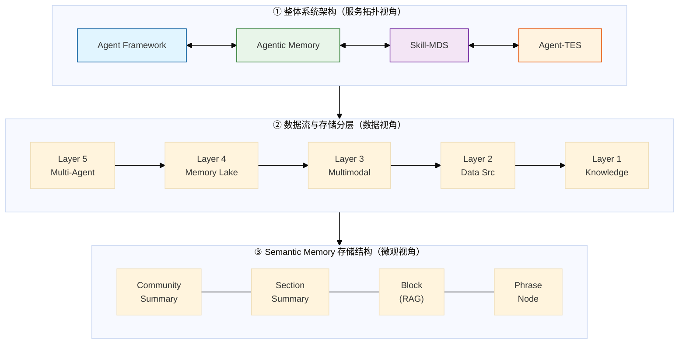

### 1.3 核心设计原则

#### 原则1：搜索优先（Search-First）

> **"搜索才是记忆的核心，记忆的构建是为了支持有效的搜索"**

- **传统思维**: 先存储数据，再考虑如何查询
- **本架构思维**: 先定义 Agent 的检索需求，再反向设计存储结构
- **工程体现**: 五层存储分层、多路检索架构、Community Summary 机制

#### 原则2：认知分层（Cognitive Layering）

参照人类记忆的三层模型（认知科学）：

| 记忆类型              | 对应人类记忆 | 时效性   | 容量  | 存储介质              |
| ----------------- | ------ | ----- | --- | ----------------- |
| Working Memory    | 工作记忆   | 秒~分钟级 | 极有限 | Redis（内存）         |
| Procedural Memory | 程序性记忆  | 永久    | 中等  | PostgreSQL + 向量索引 |
| Semantic Memory   | 语义记忆   | 永久    | 大规模 | LanceDB + 图数据库    |

#### 原则3：证据驱动（Evidence-Driven）

所有知识都有溯源链路：
- **来源可追溯**: 每个 Block 都知道来自哪个文档/哪次执行
- **过程可回放**: CoT + Decision Checkpoints 完整记录
- **质量可评估**: 执行结果反馈形成强化学习信号

---

## 第二章：整体系统架构（服务拓扑视角）

![[Excalidraw/图1-服务拓扑架构-生成版.excalidraw.md|1000]]

> **表1 名词速查** — 以下逐一解释架构图中的核心术语。

| #   | 术语                                               | 一句话定位                        |
| --- | ------------------------------------------------ | ---------------------------- |
| 1   | **Agent Framework**                              | 执行中枢，所有决策动作的发起点              |
| 2   | **Agent-TES**                                    | 非侵入式遥测采集，Agent 的"感知器官"       |
| 3   | **tracing**                                      | 对 Agent 执行链路的被动全程追踪          |
| 4   | **Skill-MDS**                                    | 技能挖掘与发现，连接"经验"与"能力"          |
| 5   | **applying**                                     | 技能从 MDS 流向 Framework 的应用动作   |
| 6   | **memory IO**                                    | 执行前读取记忆 + 执行后写入记忆的双向交互       |
| 7   | **Agentic Memory**                               | 整个记忆系统的核心存储层                 |
| 8   | **Working Memory**                               | 短期活跃上下文，秒~分钟级，Redis 存储       |
| 9   | **Procedural Memory**                            | "怎么做"的技能经验，永久存储              |
| 10  | **Semantic Memory**                              | "是什么"的事实知识，多层结构检索            |
| 11  | **streaming data pipeline**                      | TES → Memory 的异步流式数据管道       |
| 12  | **skill gen pipeline**                           | Memory → Skill-MDS 的技能自动生成流程 |
| 13  | **business documents**                           | 外部企业知识文档的输入来源                |
| 14  | **eBPF <br>Sidecar<br>Bytecode instrumentation** | TES 三层非侵入式采集技术栈              |
#### Agent Framework（Agent 执行框架）

整个系统的**执行中枢**。负责接收用户请求、进行 LLM 推理、调用工具（Tool Call）、编排子任务，并协调与记忆系统、技能系统之间的 IO 交互。可类比为 Agent 的"大脑皮层"，所有决策动作都从此发出。

#### Agent-TES（遥测与证据服务）

**T**elemetry & **E**vidence **S**ervice 的缩写。一个**非侵入式**的全链路观测层，负责采集 Agent 执行过程中产生的所有原始信号，包括用户请求、LLM 推理链（CoT）、工具调用日志、执行结果与用户反馈，最终将数据汇入 Agentic Memory。它是整个记忆系统的"感知器官"，Agent Framework 不需要主动埋点，TES 在旁路自动捕获。

#### tracing（追踪 / 链路追踪）

从 Agent Framework 到 Agent-TES 的数据流向标注，表示 TES 对 Agent 全程执行链路的**被动追踪**采集。技术上借鉴分布式追踪（Distributed Tracing）体系，每次推理、工具调用都会生成带 `trace_id` / `span_id` 的结构化记录，形成完整可回放的证据链。

#### Skill-MDS（技能挖掘与发现服务）

**S**kill **M**ining & **D**iscovery **S**ervice 的缩写。负责从 Agentic Memory 中**自动挖掘**可复用的技能模板（Skill），并提供技能目录索引、语义检索与主动推荐能力。Agent Framework 在执行任务前可向 Skill-MDS 查询是否有匹配的历史经验可复用，从而避免重复试错。

#### applying（技能应用）

从 Skill-MDS 到 Agent Framework 的数据流向标注，表示 Agent 在执行时**调用并应用**挖掘出的技能。即 Skill-MDS 将匹配的技能推送给 Agent Framework，后者将其注入当前执行上下文中指导决策。

#### memory IO（记忆读写）

Agent Framework 与 Agentic Memory 之间的**双向数据交互**：
- **读（IO in）**：执行前从记忆中检索相关知识与技能，扩展 Agent 的上下文；
- **写（IO out）**：执行后将本次推理过程、结果、反馈沉淀回记忆系统，形成新的经验。

#### Agentic Memory（智能体记忆系统）

Agent 的**长期与短期记忆载体**，整个架构的核心存储层。包含三种类型的记忆（见下），支持 Agent 在不同任务、不同时间维度上积累、调用知识。==与普通数据库的区别在于，它以"可被 Agent 检索和理解"为首要设计目标。==

#### Working Memory（工作记忆）

类比人类的**短期工作记忆**（Baddeley 模型）。存储当前任务执行中的**活跃上下文**，包括当前任务目标、执行计划、检索到的知识片段等。生命周期为 **Session 作用域**（任务持续期间有效，典型 TTL 为 30 分钟～数小时），任务结束后自动过期清除。技术选型为 Redis，核心理由是亚毫秒级读写延迟与原生 TTL，而非因为它不支持持久化。

> **注意**：Working Memory 存储的是**任务执行的活跃状态**，不等于对话历史记录。对话消息流水（用户不删就永久保存的那种）属于独立的 **Conversation Memory 层**，应写入关系型数据库（如 PostgreSQL）做永久存档；Working Memory 在 Redis 里只缓存当前推理需要的活跃子集。

#### Procedural Memory（程序性记忆）

类比人类的**程序性记忆**（肌肉记忆、操作技能）。存储从历史执行中归纳出的**可复用技能（Skill）**，记录的是"怎么做"的隐性知识，例如"处理用户投诉的标准步骤"。永久保存，支持语义检索与条件过滤。技术选型为 PostgreSQL + pgvector。

#### Semantic Memory（语义记忆）

类比人类的**语义记忆**（关于世界的事实性知识）。存储企业业务文档、知识库等**显性事实**，例如产品手册、政策文件。通过多层结构（Block → Phrase Node → Community Summary）组织，支持从精确局部匹配到全局主题理解的多粒度检索。技术选型为 LanceDB + Neo4j。

#### streaming data pipeline（流式数据管道）

从 Agent-TES 到 Agentic Memory（Procedural Memory）的异步数据传输通道。Agent 执行过程中产生的原始证据数据，经由 Kafka / Pulsar 等消息队列**持续流式**地流入记忆加工管道，完成从"原始执行记录"到"可复用记忆"的转化。

#### skill gen pipeline（技能生成管道）

从 Agentic Memory 到 Skill-MDS 的**技能自动生成流程**。定期或触发式地从 Procedural Memory（历史执行轨迹）中挖掘成功模式，通过聚类、模式提取、质量评分等算法，自动生成或更新 Skill 条目，写入 Skill-MDS 的技能目录中。

#### business documents（业务文档）

外部输入的**企业知识来源**，例如产品手册、FAQ、政策文件、操作规范等。这些文档经过切分（Chunking）、向量化（Embedding）、实体抽取等处理后，进入 Semantic Memory 的 Block 层和知识图谱层，成为 Agent 可检索的结构化知识。

#### eBPF / Sidecar / Bytecode instrumentation（三种非侵入式采集方式）

Agent-TES 采集层的三种技术实现：
- **eBPF**：Linux 内核扩展技术，可在零业务侵入的情况下捕获系统调用、网络 IO 等底层事件；
- **Sidecar**：云原生模式下与业务容器并行运行的边车代理，负责拦截服务间调用链路（适合微服务/K8s 环境）；
- **Bytecode instrumentation**：在 JVM 或 Python 运行时插入字节码探针，实现函数级别的精细追踪。

三者分层组合，覆盖从内核到应用的完整采集栈，同时将对业务代码的侵入降到最低。

### 2.1 架构概览

本章对应架构原图 **图1**，展示系统由哪些核心服务组成以及它们之间的协作关系。

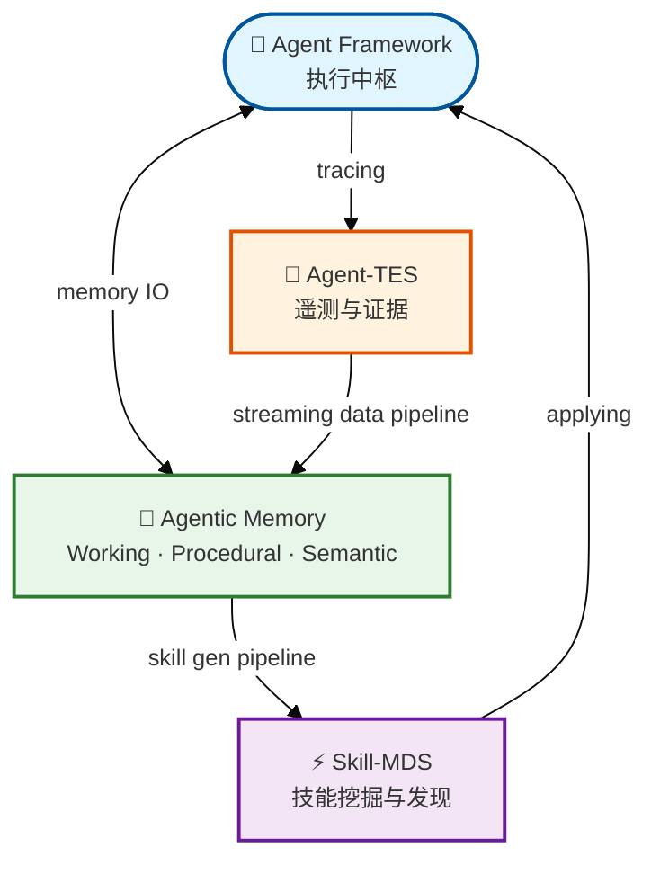

### 2.2 Agent Framework（执行中枢）

#### 2.2.1 功能定位

Agent Framework 是整个系统的**执行核心**，负责 Agent 的生命周期管理和任务执行。

#### 2.2.2 核心职责

| 职责 | 说明 | 技术实现 |
|-----|------|---------|
| **任务调度** | 接收用户请求，分解为子任务，调度执行 | 基于 DAG 的任务编排引擎 |
| **推理决策** | 基于 LLM 进行 CoT 推理 | 支持 OpenAI/Anthropic/本地模型 |
| **工具调用** | 执行代码、调用 API、查询数据库 | Tool Registry + 执行沙箱 |
| **记忆 IO** | 执行前检索记忆，执行后写入记忆 | Memory Client SDK |
| **技能应用** | 从 Skill-MDS 获取可复用技能 | Skill Registry 查询 |

#### 2.2.3 技术选型对比

| 方案       | 代表项目                | 优势            | 劣势        | 适用场景      |
| -------- | ------------------- | ------------- | --------- | --------- |
| **自研框架** | 本方案                 | 完全可控，深度集成记忆系统 | 开发成本高     | 企业级生产环境   |
| **开源框架** | LangGraph, AutoGen  | 生态成熟，快速启动     | 记忆系统集成需改造 | 原型验证、轻量应用 |
| **模型原生** | Claude Computer Use | 零开发成本         | 黑盒，不可控    | 简单任务自动化   |

**本方案选择**: 基于开源框架（LangGraph）深度定制，而非完全自研。

**选择理由**:
1. LangGraph 的 StateGraph 模型与我们的 Working Memory 概念天然契合
2. 社区生态丰富，Tool 集成成本低
3. 在核心路径（记忆 IO）上自研，其他部分复用开源

#### 2.2.4 LangGraph StateGraph 与 Working Memory 的对应关系

StateGraph 是 LangGraph 的核心原语，本质是一个**以共享状态（State）为中心的有向图**——所有节点（Node）都从同一份 State 读取输入、向其写入更新，节点之间通过固定边或条件边传递控制流。

```
State（TypedDict）
  ├── messages         # 对话历史
  ├── active_goal      # 当前任务目标
  ├── current_plan     # 执行计划
  └── working_entities # 运行时实体（订单号、意图等）
       ↑ 读 / 写
  Node A ──条件边──► Node B ──► Node C ──► END
  (LLM 推理)        (工具调用)   (结果写回)
```

与 Working Memory 的映射关系：

| StateGraph 概念 | Working Memory 对应 |
|----------------|-------------------|
| `State` TypedDict | Working Memory 数据结构（goals / plan / entities…） |
| 每个 Node 读写 State | Agent 每步执行时的 Memory IO（读取上下文 → 执行 → 写回） |
| 条件边 `should_continue` | Agent 决策层（继续执行工具 / 结束任务） |
| `graph.invoke(...)` 的一次调用 | 一个任务 Session 的完整生命周期 |

**最小示例（带工具调用的 ReAct 循环）**：

```python
from typing import TypedDict, Annotated, Literal
from langgraph.graph import StateGraph, START, END
from langgraph.graph.message import add_messages

class State(TypedDict):
    messages: Annotated[list, add_messages]   # 追加而非覆盖

def call_llm(state: State):
    return {"messages": [llm_with_tools.invoke(state["messages"])]}

def call_tools(state: State):
    # 执行 LLM 请求的工具，结果追加进 messages
    ...

def should_continue(state: State) -> Literal["tools", "__end__"]:
    return "tools" if state["messages"][-1].tool_calls else END

builder = StateGraph(State)
builder.add_node("llm",   call_llm)
builder.add_node("tools", call_tools)
builder.add_edge(START, "llm")
builder.add_conditional_edges("llm", should_continue)  # 核心：条件分支
builder.add_edge("tools", "llm")   # 工具执行完 → 回到 LLM

graph = builder.compile()
graph.invoke({"messages": [{"role": "user", "content": "帮我查一下北京天气"}]})
```

执行流：`START → llm → (有 tool_calls?) → tools → llm → (无 tool_calls) → END`，`State` 在每一步被增量更新，天然对应 Working Memory 在任务执行期间的持续读写。

### 2.3 Agent-TES（遥测与证据服务）

#### 2.3.1 术语说明

**TES** = **T**elemetry & **E**vidence **S**ervice（遥测与证据服务）

#### 2.3.2 功能定位

非侵入式的**全链路观测层**，是记忆系统的"感知器官"。参考了 Generative Agents 的"记忆流"理念和现代 APM 系统的遥测架构。

#### 2.3.3 三层采集架构

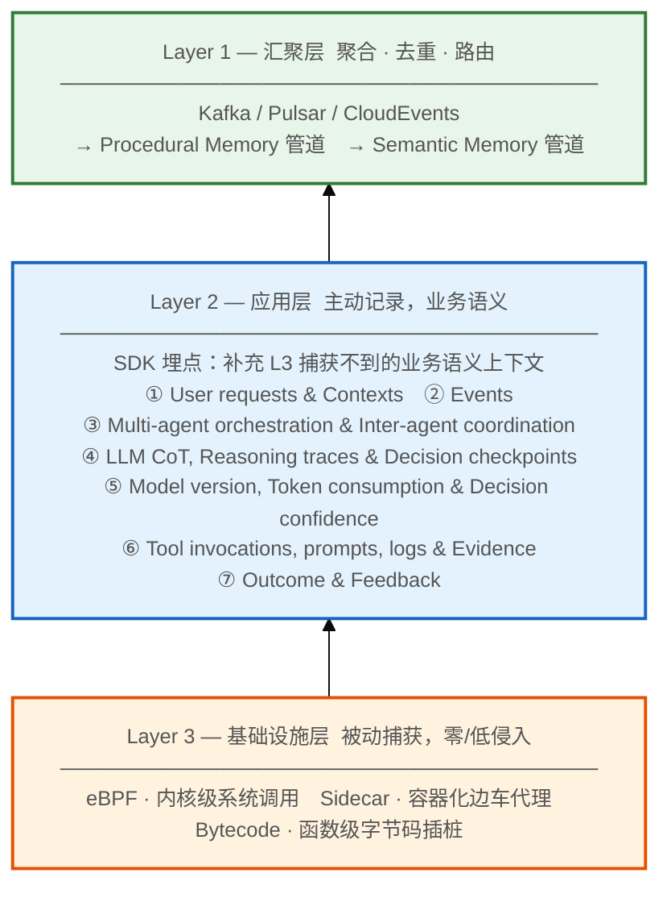

**Layer 3 内部三者是并列关系，非层级关系**。它们各自负责不同的"采集截面"，互不重叠、互为补充：

| 技术           | 采集深度   | 捕获内容                      | 其他技术能否替代                     |
| ------------ | ------ | ------------------------- | ---------------------------- |
| **eBPF**     | OS 内核层 | 系统调用、网络 IO、进程事件           | 不能——Sidecar/Bytecode 无法进内核   |
| **Sidecar**  | 服务边界层  | 跨服务 HTTP/gRPC 调用链         | 不能——eBPF 无服务语义，Bytecode 需改应用 |
| **Bytecode** | 应用运行时层 | 函数参数、局部变量、JVM/Python 内部状态 | 不能——另两者粒度太粗                  |

三者组合后，从内核到服务边界到应用内部形成**无盲区**的全栈采集覆盖。

**7 类证据详解**（Layer 2 结构化记录的内容）：

| # | 证据类型 | 包含内容 | 主要用途 |
|---|---------|---------|---------|
| ① | **User requests & Contexts** | 用户原始输入、Session 信息、环境变量、已知实体 | 意图识别、上下文重建 |
| ② | **Events** | 超时、重试、状态变更等系统事件 | 异常溯源、流程调试 |
| ③ | **Multi-agent orchestration & Inter-agent coordination** | 多 Agent 编排指令、跨 Agent 消息传递与协调记录 | 多 Agent 协作分析、调度优化 |
| ④ | **LLM CoT, Reasoning traces & Decision checkpoints** | 模型思维链全文、推理路径、关键决策节点快照 | 推理审计、可解释性、技能提炼 |
| ⑤ | **Model version, Token consumption & Decision confidence** | 模型名称/版本、输入输出 Token 数、输出置信度分值 | 成本核算、模型效果对比、质量监控 |
| ⑥ | **Tool invocations, prompts, logs & Evidence** | 工具调用入参/出参、使用的 Prompt 模板、执行日志、引用的外部证据 | 工具效果评估、Prompt 优化、排障 |
| ⑦ | **Outcome & Feedback** | 最终执行结果 + 用户显式/隐式反馈信号 | 强化学习信号、技能质量评分 |

> **注**：以上分类为本架构自定义，非行业标准术语，来源于原始设计图对 End-to-end Activity Recorder & Evidence Ingestion 的六条枚举（其中①将 requests 与 contexts 合并为一类）。

#### 2.3.4 技术方案对比：采集层选型

| 采集方式         | 所属层级 | 侵入性 | 性能开销    | 数据完整度  | 适用场景            |
| ------------ | ------ | --- | ------- | ------ | --------------- |
| **eBPF**     | Layer 3 | 零侵入 | 极低（<1%） | 系统调用级  | 内核监控、网络IO       |
| **Sidecar**  | Layer 3 | 低侵入 | 低（~5%）  | 服务间调用  | 容器化微服务          |
| **Bytecode** | Layer 3 | 中侵入 | 中（~10%） | 函数级    | JVM/Python 深度追踪 |
| **SDK埋点**    | **Layer 2** | 高侵入 | 可控      | 业务语义完整 | 核心业务逻辑          |

> SDK 埋点归属 Layer 2（应用层），而非 Layer 3 基础设施层。它由开发者主动在业务代码中植入，补充 Layer 3 被动采集所缺失的**业务语义上下文**（如"本次调用的意图是什么"）。

**本方案采用**: **Layer 3（eBPF + Sidecar）+ Layer 2（SDK 埋点）三者混合**

**选择理由**:
1. **eBPF**（Layer 3）：采集系统级性能指标，零业务侵入
2. **Sidecar**（Layer 3）：采集服务间调用链，适合云原生部署
3. **SDK**（Layer 2）：仅在关键业务点手动埋点，补充语义信息

#### 2.3.5 证据数据结构（Evidence Schema）

每条证据都是一个结构化的记录，用于后续的 Memory 加工：

```json
{
  "evidence_id": "evid_20240319153000_abc123",
  "trace_id": "trace_abc123",
  "span_id": "span_def456",
  "parent_span_id": "span_parent789",

  "timestamp": "2026-03-19T15:30:00.123Z",
  "agent_id": "agent_customer_service_v2",
  "session_id": "sess_user_123_20240319",

  "evidence_type": "LLM_CoT",
  "evidence_subtype": "reasoning_checkpoint",

  "content": {
    "prompt": "用户询问退货政策...",
    "completion": "根据政策，30天内可退货...",
    "thought_process": "1. 识别用户意图: 退货咨询\n2. 检索相关政策...",
    "confidence": 0.95,
    "token_usage": {"input": 150, "output": 80}
  },

  "context": {
    "user_id": "user_123",
    "conversation_turn": 5,
    "retrieved_memories": ["mem_abc", "mem_def"],
    "applied_skills": ["skill_return_policy_v1"]
  },

  "outcome": {
    "status": "success",
    "user_feedback": "positive",
    "resolution_time_ms": 2300
  },

  "metadata": {
    "source": "openai:gpt-4",
    "model_version": "gpt-4-0125-preview",
    "temperature": 0.7
  }
}
```

**字段详细说明**:

| 字段                           | 类型     | 说明        | 为什么需要               |
| ---------------------------- | ------ | --------- | ------------------- |
| `evidence_id`                | string | 全局唯一证据ID  | 后续知识图谱中作为节点引用       |
| `trace_id`                   | string | 分布式追踪ID   | 关联同一次请求的所有证据        |
| `evidence_type`              | enum   | 证据类型      | 决定后续进入哪个记忆加工管道      |
| `content.thought_process`    | string | 推理过程      | **最关键字段**，用于提取程序性记忆 |
| `context.retrieved_memories` | array  | 本次检索的记忆ID | 用于计算记忆检索的准确率和价值     |
| `outcome.user_feedback`      | enum   | 用户反馈      | 强化学习信号，用于技能质量评估     |

### 2.4 Agentic Memory（三层记忆系统）

#### 2.4.1 设计哲学

参照人类记忆的认知科学模型（Baddeley 工作记忆模型、Tulving 的长时记忆分类），将 Agent 记忆分为三层：

```
┌─────────────────────────────────────────────┐
│          Agentic Memory 三层架构              │
├─────────────────────────────────────────────┤
│                                             │
│  ┌─────────────────────────────────────┐   │
│  │    Working Memory — 工作记忆         │   │
│  │    角色: 当前任务的活跃上下文          │   │
│  │    时效: Session 作用域（任务持续期间） │   │
│  │    容量: 极有限（类比 LLM 上下文窗口）  │   │
│  └─────────────────────────────────────┘   │
│                                             │
│  ┌─────────────────────────────────────┐   │
│  │   Procedural Memory — 程序性记忆     │   │
│  │    角色: 可复用的技能和策略            │   │
│  │    时效: 永久                         │   │
│  │    内容: "怎么做" 的隐性知识          │   │
│  └─────────────────────────────────────┘   │
│                                             │
│  ┌─────────────────────────────────────┐   │
│  │    Semantic Memory — 语义记忆        │   │
│  │    角色: 事实性知识库                  │   │
│  │    时效: 永久                         │   │
│  │    内容: "是什么" 的显性知识          │   │
│  └─────────────────────────────────────┘   │
│                                             │
└─────────────────────────────────────────────┘
```

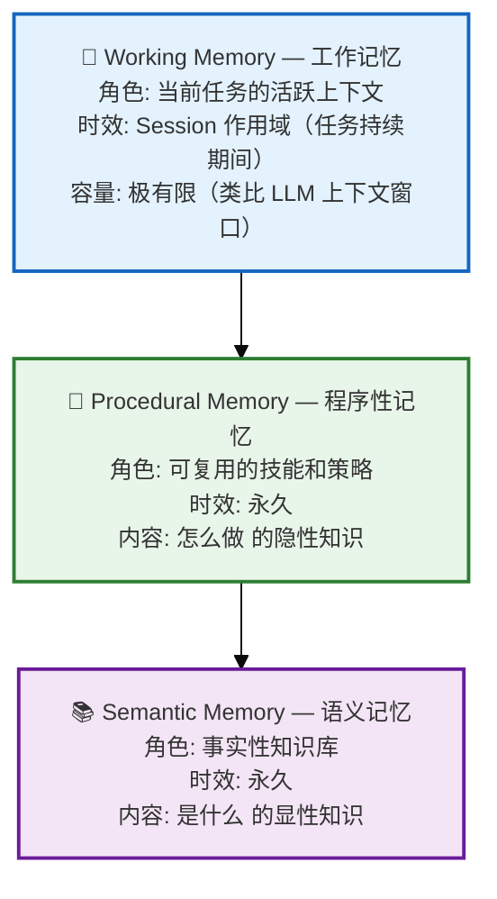

> [!important] 架构适用场景说明
> 本架构设计的核心场景是**自主任务型 Agent（Agentic Task Execution）**，例如：推理模型的整体编译构建部署流程自动化、代码生成与调试流程、执行多步骤研究任务、自动分析合同等。Agent 自主执行期间产生的中间状态（当前步骤、临时推理结果）才是 Working Memory 的主要内容，任务结束后这些状态即失去价值。
>
> **与对话型产品（Kimi / 豆包 / 通义千问 等）的区别：**
>
> | | 自主任务型 Agent（本架构） | 对话型产品 |
> |--|--|--|
> | **Working Memory 内容** | 任务执行的活跃中间状态 | 当前轮推理所需的上下文子集 |
> | **对话历史怎么存** | 独立的 Conversation Memory 层（PG 永久存储） | 永久存储在数据库，用户不删就一直在 |
> | **Working Memory 生命周期** | 任务持续期间，结束即 TTL 清除 | 单次推理调用期间（毫秒级） |
>
> 若将本架构用于对话型产品，需在三层记忆之外额外增加 **Conversation Memory 层**，专门做对话消息的永久存档，与 Working Memory 明确分离。

#### 2.4.2 Working Memory（工作记忆）

**功能定义**: 维护当前任务的活跃上下文（Active Context），管理 LLM 的短期推理状态。

**与 LLM 上下文窗口的关系**:
- Working Memory 是**逻辑概念**，LLM 上下文窗口是**物理限制**
- 当 Working Memory 内容超过上下文窗口时，需要进行**上下文压缩**或**选择性加载**

**数据结构设计**:

```json
{
  "wm_id": "wm_sess_abc123",
  "agent_id": "agent_customer_service_v2",
  "session_id": "sess_user123_20240319",

  "active_goal": {
    "primary": "处理用户退货请求",
    "sub_goals": ["验证订单", "检查退货政策", "生成退货标签"]
  },

  "conversation_history": [
    {"role": "user", "content": "我想退货", "timestamp": "..."},
    {"role": "assistant", "content": "好的，请提供订单号", "timestamp": "..."}
  ],

  "retrieved_knowledge": [
    {
      "memory_id": "mem_return_policy",
      "content": "30天无理由退货政策...",
      "relevance_score": 0.95,
      "source": "semantic_memory"
    }
  ],

  "current_plan": {
    "steps": [
      {"step": 1, "action": "ask_for_order_id", "status": "completed"},
      {"step": 2, "action": "verify_order", "status": "in_progress"}
    ]
  },

  "working_entities": {
    "order_id": "ORD-2024-001",
    "user_tier": "VIP",
    "detected_intent": "return_request"
  },

  "ttl_seconds": 3600
}
```

**存储选型**:

| 候选方案 | 优势 | 劣势 | 选择 |
|---------|------|------|------|
| **Redis** | 极低延迟，原生TTL | 容量受限 | ✅ 本方案选用 |
| **Dragonfly** | 多线程Redis | 生态较新 | - |
| **内存KV** | 最快 | 无持久化，容灾差 | - |

**选择 Redis 的理由**:
1. 亚毫秒级延迟，满足实时交互要求
2. 原生 TTL 支持，自动清理过期 Working Memory
3.  Pub/Sub 能力可用于多 Agent 协作场景

#### 2.4.3 Procedural Memory（程序性记忆）

**功能定义**: 存储从历史执行中提炼出的可复用**技能（Skill）**，记录"怎么做"的隐性知识。

**技能数据结构**:

```json
{
  "skill_id": "skill_customer_complaint_handling_v3",
  "skill_name": "处理用户投诉-标准流程",
  "domain": "customer_service",
  "version": 3,

  "preconditions": {
    "required_entities": ["user_complaint", "order_context"],
    "required_intent": "complaint",
    "excluded_scenarios": ["fraud_alert"]
  },

  "workflow": {
    "steps": [
      {"seq": 1, "action": "acknowledge", "template": "先道歉共情..."},
      {"seq": 2, "action": "investigate", "template": "确认问题细节..."},
      {"seq": 3, "action": "resolve", "template": "给出解决方案..."},
      {"seq": 4, "action": "follow_up", "template": "确认用户满意..."}
    ],
    "branching_conditions": [
      {"condition": "user_escalates", "goto_step": "human_handoff"}
    ]
  },

  "effectiveness_metrics": {
    "success_rate": 0.87,
    "avg_resolution_time_sec": 180,
    "user_satisfaction_score": 4.3,
    "total_applications": 1250,
    "consecutive_failures": 0
  },

  "source_episodes": ["ep_001", "ep_023", "ep_089"],
  "mined_at": "2026-03-15T10:00:00Z",
  "last_updated": "2026-03-19T08:30:00Z",

  "embedding": [0.12, -0.05, ...],
  "tags": ["complaint", "escalation", "vip_handling"]
}
```

**字段详细说明**:

| 字段 | 说明 | 为什么需要 |
|-----|------|-----------|
| `preconditions` | 技能适用条件 | 检索时快速判断是否匹配当前场景 |
| `workflow.branching_conditions` | 分支逻辑 | 处理复杂场景，不是线性流程 |
| `effectiveness_metrics.success_rate` | 成功率 | 多技能匹配时排序依据 |
| `source_episodes` | 来源执行记录 | 可追溯到原始经验，支持审计 |
| `mined_at` | 挖掘时间 | 判断技能是否过时 |

**存储选型**: PostgreSQL + pgvector
- PostgreSQL: 结构化存储技能元数据、workflow JSON
- pgvector: 存储技能 embedding，支持语义相似度检索

#### 2.4.4 Semantic Memory（语义记忆）

**功能定义**: 存储企业业务文档、知识库等事实性知识，"世界是什么样的"。

**这是本方案最复杂的部分，详见第四章。**

### 2.5 Skill-MDS（技能挖掘与发现服务）

#### 2.5.1 术语说明

**MDS** = **M**ining & **D**iscovery **S**ervice（挖掘与发现服务）

#### 2.5.2 功能定位

从 Agentic Memory 中**自动挖掘、归纳、管理**可复用技能。是连接"经验"和"能力"的桥梁。

#### 2.5.3 核心能力

```
┌─────────────────────────────────────────────────────┐
│              Skill-MDS 三大能力                      │
├─────────────────────────────────────────────────────┤
│                                                     │
│  ┌─────────────────────────────────────────────┐   │
│  │  Skill Catalog — 技能目录管理                  │   │
│  │  • Indexing: 按领域/类型/场景结构化索引         │   │
│  │  • Retrieval: 语义检索 + 条件过滤              │   │
│  │  • Recommendation: 根据上下文主动推荐          │   │
│  └─────────────────────────────────────────────┘   │
│                                                     │
│  ┌─────────────────────────────────────────────┐   │
│  │  Skill Mesh — 技能网格                        │   │
│  │  • Relationship Discovery: 发现依赖/组合/替代  │   │
│  │  • Topology Mapping: 绘制技能拓扑图            │   │
│  └─────────────────────────────────────────────┘   │
│                                                     │
│  ┌─────────────────────────────────────────────┐   │
│  │  Skill Mining — 技能挖掘                      │   │
│  │  • Induction: 从成功轨迹归纳可复用模式         │   │
│  │  • Refinement: 持续优化技能描述精度            │   │
│  └─────────────────────────────────────────────┘   │
│                                                     │
└─────────────────────────────────────────────────────┘
```

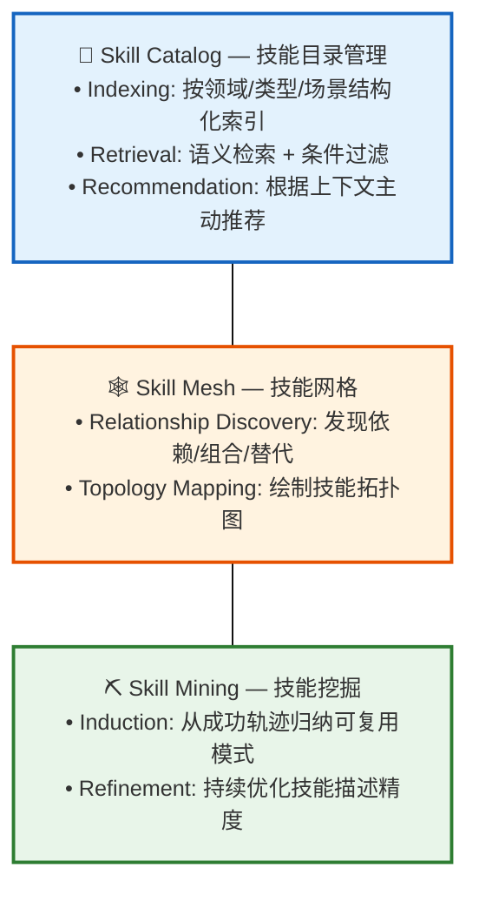

#### 2.5.4 技能挖掘算法

**输入**: 高质量的执行轨迹（Episodes）
**输出**: 可复用的 Skill

**算法流程**:

```
1.  Episode Clustering
    └── 将相似场景的 episodes 聚类（基于 embedding + 实体匹配）

2.  Common Pattern Extraction
    └── 从同 cluster 的 episodes 中提取共同的动作序列
    └── 使用序列模式挖掘算法（如 PrefixSpan）

3.  Variability Analysis
    └── 分析哪些步骤是固定的，哪些是变化的
    └── 变化部分提取为参数/条件分支

4.  Skill Template Generation
    └── 生成标准化的 workflow 结构
    └── 编写自然语言描述的 preconditions

5.  Quality Scoring
    └── 基于源 episodes 的成功率计算 skill 质量分
    └── 低于阈值的不生成 skill
```

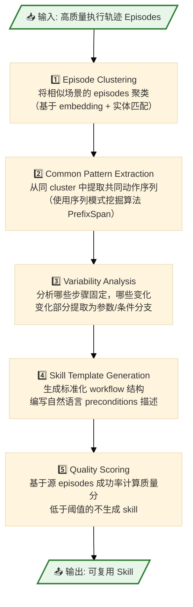

---

## 第三章：数据流与存储架构（模块视角）

![[Excalidraw/图2-数据流与存储分层-生成版.excalidraw.md|800]]

### 3.1 架构概览

本章对应架构原图 **图2**，回答"数据从哪来、怎么存、如何被检索使用"。整个系统由四个核心模块构成：**Multi-Agent 执行模块**、**Multimodal Lake 原始数据湖**、**Memory Lake 结构化记忆**、**Knowledge Engineering 知识工程**。

### 3.2 核心设计理念

> ==**"搜索才是记忆的核心，记忆的构建是为了支持有效的搜索"**==

这体现在四个设计决策上：

| 传统架构 | 本架构（搜索优先） |
|---------|------------------|
| 先存数据，再想怎么查 | 先定义 Agent 需要搜什么，再设计存储 |
| 单一存储介质 | 多模态存储各适其用 |
| 离线索引，实时查询困难 | 结构化 Memory Lake 支持实时检索 |
| 数据与知识分离 | 原始数据 → 结构化存储 → 知识 一体化加工 |

### 3.3 Multi-Agent System（执行模块）

**产出物**（向下流入记忆系统）：

| 数据类型 | 说明 | 流向 |
|---------|------|------|
| **CoT** | Chain of Thought 推理链 | Multimodal Lake 直接存储 |
| **交互数据** | 与用户的对话记录 | Multimodal Lake 后加工 |
| **引用证据** | 决策引用的信息来源 | Memory Lake Graph 存储 |
| **决策链路** | 完整决策路径 | Multimodal Lake + 知识抽取 |

### 3.4 Memory Lake（结构化记忆湖）

#### 3.5.1 设计目标

不是简单的"数据湖"，而是**面向 Agent 检索优化的结构化存储**。

#### 3.4.2 四种存储类型对比

| 存储类型 | 存储内容 | 适用检索场景 | 技术选型 |
|---------|---------|-------------|---------|
| **Tree** | 层次化结构（分类、组织架构） | 层级导航、权限控制 | MongoDB / JSONB |
| **Graph** | 实体-关系网络 | 关联推理、多跳查询 | Neo4j |
| **Time Series** | 时序指标、状态变化 | 趋势分析 | ClickHouse |
| **Vector** | Embedding 向量 | 语义相似度检索 | pgvector / Qdrant |

#### 3.4.3 为什么不用单一向量库？

**传统 RAG 的问题**:
- 仅用向量库：无法回答"A 和 B 是什么关系"这类关系型问题
- 仅用图数据库：无法回答"和这段话语义相似的内容有哪些"

**本方案**: **Vector + Graph 双轨并行**

#### 3.4.4 三层记忆系统的向量库选型考量

不同记忆层的数据特征和查询模式差异显著，需针对性选择存储方案：

| 记忆层 | 技术选型 | 数据规模 | 查询特征 | 选型理由 |
|-------|---------|---------|---------|---------|
| **Working Memory** | Redis | GB 级 | Key-Value 读写，高并发 | 纯内存、极低延迟（亚毫秒），Session 作用域无需向量检索 |
| **Procedural Memory** | PostgreSQL + pgvector | 万~百万条 Skills | 语义检索 + 结构化条件过滤 | Skills 需频繁按领域/类型/场景过滤，pgvector 支持混合查询（向量相似度 + SQL WHERE） |
| **Semantic Memory - Block** | LanceDB | 千万~亿级 Blocks | 纯向量 ANN 检索 | 多模态原生（图片/视频/文本同库存储），云原生（S3 存储成本低），适合 append-only 的海量 Block 存储 |
| **Semantic Memory - 大规模生产** | Milvus（备选） | 十亿级以上 | 高并发向量检索 | 当 LanceDB 单机无法满足时，Milvus 提供分布式能力 |

**核心结论**：
- **Skills 用 pgvector**：需要与业务元数据（领域、类型、成功率）联合查询，混合 SQL+向量是刚需
- **Blocks 用 LanceDB**：纯向量检索场景，多模态+云原生+成本优势
- **超大规模 Blocks 用 Milvus**：十亿级以上向量的分布式场景

### 3.5 Multimodal Lake（多模态原始数据湖）

#### 3.5.1 存储内容

| 类型 | 处理方式 | 结构化后流向 |
|-----|---------|-------------|
| CoT | 直接存储 | Memory Lake Tree |
| Docs | 切分 + Embedding | Memory Lake Vector + Graph |
| Video | 帧提取 + 语音转文本 | Memory Lake Vector（多模态 embedding） |
| Image | OCR + 视觉理解 | Memory Lake Graph（图中实体） |
| Table | 结构化解析 | Memory Lake Tree + Graph |

#### 3.5.2 技术选型：LanceDB

**为什么选择 LanceDB**:

根据 2024-2025 年最新资料，LanceDB 是专门为 AI/ML 工作负载设计的现代列式存储：

| 特性 | 说明 | 本方案收益 |
|-----|------|-----------|
| **Apache Arrow 列式格式** | 内存映射文件 + SIMD 优化 | 多模态数据（图片、视频）零拷贝访问 |
| **多模态原生支持** | 向量 + 原始 BLOB 同库存储 | CoT、图片、表格统一存储，无需分离存储系统 |
| **向量索引** | IVF + PQ 量化 | 亿级向量秒级检索 |
| **Schema 演进** | 零拷贝细粒度演进 | 业务迭代时平滑升级表结构 |
| **云原生** | 直接读写 S3/对象存储 | 低成本存储 + Lambda 弹性查询 |

**LanceDB Schema 设计（Multimodal Lake）**:

```python
import lancedb
import pyarrow as pa

schema = pa.schema([
    # 基础标识
    ("content_id", pa.string()),           # 全局唯一内容ID
    ("content_type", pa.string()),          # cot | doc | video | image | table
    ("source_type", pa.string()),           # agent_execution | business_doc | user_upload
    ("source_id", pa.string()),             # 来源ID（trace_id 或 doc_id）

    # 原始内容（多模态）
    ("raw_text", pa.string()),              # 文本内容（CoT、文档、语音转录）
    ("raw_binary", pa.binary()),            # 原始二进制（图片、视频片段）
    ("metadata", pa.string()),              # JSON: 页面号、时间戳、图片尺寸等

    # 向量化表示
    ("embedding", pa.list_(pa.float32(), 1536)),  # 文本 embedding
    ("multimodal_embedding", pa.list_(pa.float32(), 512)),  # 图片/视频 embedding

    # 时间戳
    ("created_at", pa.timestamp('us')),
    ("ingested_at", pa.timestamp('us')),
])

db = lancedb.connect("s3://my-bucket/multimodal-lake")
table = db.create_table("content_blocks", schema=schema)

```

### 3.6 Knowledge Engineering（知识工程模块）

这是整个架构的**价值沉淀层**，四大产出物：

| 产出物 | 说明 | 下游消费方 |
|-------|------|-----------|
| **Agentic Memory** | 可直接检索的知识 | Agent Framework |
| **Skill Gen** | 自动提炼的技能 | Procedural Memory |
| **Agentic RL Dataset** | (状态, 动作, 奖励) 三元组 | 模型微调 |
| **Chain of Evidence** | 完整可追溯链路 | 审计系统 |

---

## 第四章：Semantic Memory 内部存储结构（微观视角）

![[Excalidraw/图3-Semantic-Memory-内部结构-生成版.excalidraw.md|1000]]

### 4.1 架构概览

本章对应架构原图 **图3**，展示 Semantic Memory 内部如何组织和索引。

### 4.2 五层分层存储体系

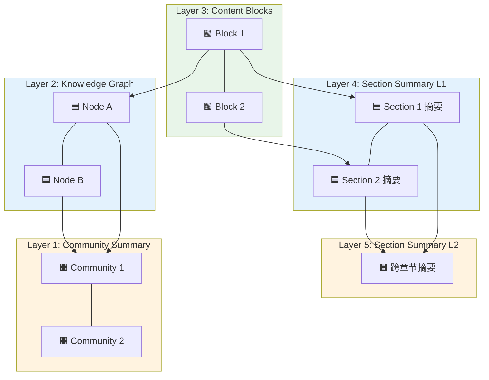

### 4.3 Layer 3: Block 层（传统 RAG 层）

**这是你提到的"第3层，绿色部分"**，是整个存储结构的**内容基础层**。

#### 4.3.1 Block 数据结构

```json
{
  "block_id": "blk_doc123_sec2_para3_v1",

  // 基础内容
  "raw_text": "完整的原始文本内容...",
  "content_type": "paragraph",  // paragraph | table | image_caption
  "language": "zh-CN",

  // 语义表征
  "embedding": [0.12, -0.05, ...],  // 1536维 OpenAI text-embedding-3-large
  "embedding_model": "text-embedding-3-large",
  "embedding_version": "2024-01",

  // 自动提取标签
  "auto_tags": ["退货政策", "退款流程", "时间限制"],
  "auto_entities": ["30天", "无理由退货", "原支付渠道"],

  // 位置溯源
  "source_doc": {
    "doc_id": "doc_return_policy_v2024",
    "doc_title": "2024年售后服务政策",
    "doc_version": "v2.1",
    "section_path": ["退货政策", "适用范围"],
    "position": {"page": 3, "paragraph": 2}
  },

  // 层次归属
  "parent_section_l1": "sec_return_policy",
  "parent_section_l2": "sec_after_sales",

  // 质量指标
  "quality_score": 0.92,
  "reading_level": "一般读者",

  // 时间戳
  "created_at": "2024-01-15T00:00:00Z",
  "indexed_at": "2024-03-19T10:30:00Z",
  "last_accessed_at": "2024-03-19T15:20:00Z",
  "access_count": 47
}
```

#### 4.3.2 为什么需要这么多字段？

| 字段 | 业务场景 | 为什么需要 |
|-----|---------|-----------|
| `embedding_model` | 模型升级 | 不同版本 embedding 不能混合比较 |
| `section_path` | 层级导航 | 用户问"退货政策"时优先返回该章节内容 |
| `quality_score` | 检索排序 | 低质量内容（如页眉页脚）排在后面 |
| `access_count` | 缓存优化 | 高频访问的 Block 预加载到内存 |

### 4.4 Layer 4/5: Section Summary 层

**这是你提到的"上层，逻辑关联和抽象，语义层次更高的提取"**。

#### 4.4.1 分层摘要策略

```
文档级 (Level 2)
    └── 聚合多个章节摘要，生成全局主题理解
    └── 用于回答："这份文档讲了什么？"

章节级 (Level 1)
    └── 聚合多个 Block，生成章节摘要
    └── 用于回答："退货政策这一章有哪些要点？"

Block 级 (Level 0)
    └── 原始内容块
    └── 用于回答："30天退货的具体条件是什么？"
```

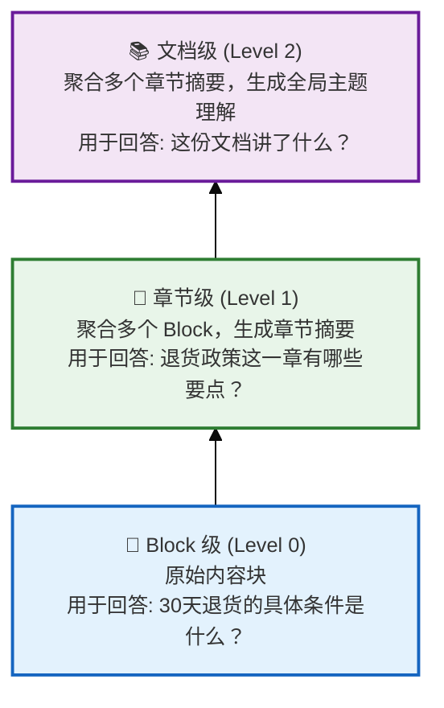

#### 4.4.2 Section 数据结构

```json
{
  "section_id": "sec_return_policy_l1",
  "level": 1,

  // LLM 生成的语义摘要
  "summary": "本章节详细说明了退货政策的适用范围、时间限制、退款方式等关键信息...",
  "summary_zh": "中文摘要...",
  "summary_en": "English summary...",

  // 摘要的向量化（用于高层语义检索）
  "summary_embedding": [0.08, 0.15, ...],

  // 关键词提取
  "key_topics": ["退货", "退款", "时间限制", "条件"],
  "key_entities": ["30天", "原支付渠道", "商品完好"],

  // 层次关系
  "child_block_ids": ["blk_001", "blk_002", "blk_003"],
  "child_section_ids": [],  // Level 1 没有子 Section
  "parent_section_id": "sec_after_sales_l2",

  // 统计信息
  "total_blocks": 15,
  "total_tokens": 3200,
  "estimated_reading_time_min": 8
}
```

#### 4.4.3 两套 Embedding 的设计意义

| Embedding | 来源 | 用途 |
|-----------|------|------|
| Block.embedding | 原始文本 | **局部精确检索** — 用户问具体问题时 |
| Section.summary_embedding | LLM 摘要 | **高层主题检索** — 用户问宏观问题时 |

**示例**:
- 问："30天退货需要满足什么条件？" → 用 Block.embedding 检索
- 问："公司的售后政策有哪些亮点？" → 用 Section.summary_embedding 检索

### 4.5 Layer 2: Phrase Node（知识图谱层）

**这是你提到的"第3层往下，对实际存储内容的实体 Node 提取"**。

#### 4.5.1 实体抽取流程

```
Block 原始文本
    └── NER 命名实体识别
    └── 关键词提取（KeyBERT）
    └── LLM-based 关系抽取
    └── 同义词对齐
    └── 构建 Phrase Node 和 Edge
```

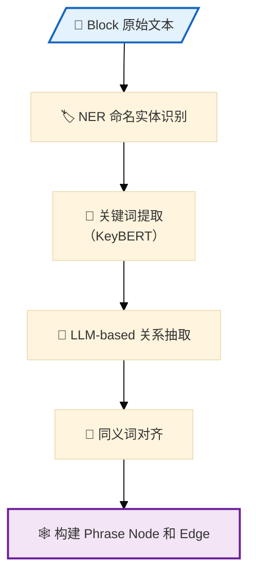

#### 4.5.2 Phrase Node 数据结构

```json
{
  "node_id": "phrase_退货政策_001",
  "phrase": "退货政策",
  "phrase_type": "CONCEPT",  // PERSON | ORG | PRODUCT | CONCEPT | EVENT

  // 标准化表示
  "canonical_form": "退货政策",
  "aliases": ["退款政策", "退换货规定", "return policy"],

  // 向量化
  "embedding": [0.21, -0.13, ...],

  // 溯源
  "source_blocks": ["blk_001", "blk_002", "blk_015"],
  "first_seen_at": "2024-01-15T00:00:00Z",
  "last_seen_at": "2024-03-19T15:20:00Z",
  "mention_count": 23,

  // 社区归属（用于 Community Summary）
  "community_id": "community_after_sales_001",
  "community_level": 0,

  // 消歧（同名不同义）
  "disambiguation": {
    "context_words": ["30天", "无理由", "售后"],
    "not_to_be_confused_with": ["phrase_退货流程_002"]
  }
}
```

#### 4.5.3 边的类型设计

| Edge 类型 | 含义 | 示例 |
|-----------|------|------|
| `CONTEXT` | Block → Phrase，出现关系 | Block "退货说明" → Phrase "30天" |
| `RELATION` | Phrase ↔ Phrase，语义关系 | "退货" → [requires] → "商品完好" |
| `SYNONYM` | Phrase ↔ Phrase，同义关系 | "退货" ↔ "退款" |
| `HIERARCHY` | Phrase → Phrase，上下位 | "售后政策" → [includes] → "退货政策" |
| `BELONGS_TO` | Phrase → Community，社区归属 | "退货" → Community "售后服务" |

### 4.6 Layer 1: Community Node Summary（社区聚合摘要）

**这是你说"没有看明白"的部分，现在详细解释：**

#### 4.6.1 什么是"社区（Community）"

在图论中，**社区**是指图中**内部连接紧密、外部连接稀疏**的节点簇。

**在知识图谱中**，社区就是一组**语义相互关联的实体集合**。

**示例**:
```
Phrase Nodes:
  "RAG", "向量数据库", "Embedding", "检索增强生成", "FAISS", "Pinecone"

通过 Leiden 算法检测 → 聚为一个社区 "语义检索技术"
```

#### 4.6.2 来源：Microsoft GraphRAG

Community Node Summary 直接来源于微软 2024 年发布的 **GraphRAG** 论文。

**GraphRAG 的核心创新**:
- 传统 RAG：只能做**局部语义相似**检索 → 无法回答宏观问题
- GraphRAG：通过 Community Summary 实现**全局主题理解**

#### 4.6.3 为什么需要 Community Summary？

**问题场景**:
> 用户问："给我总结一下这个知识库中关于 AI 技术的整体情况"

**传统 RAG 的困境**:
- 用 query "AI 技术" 去检索 Blocks → 返回的都是零散的片段
- 需要人工拼凑才能形成全局理解

**Community Summary 的解决方案**:
1. 先找到 Community "AI 技术"
2. 直接返回该 Community 的 Summary（已预生成）
3. Summary 是跨越多个 Block 的综合理解

#### 4.6.4 分层社区结构

```
Level 2: "技术体系" Community
    └── 包含多个 Level 1 Communities

Level 1: "AI 技术" Community
    └── 包含多个 Phrase Nodes + Level 0 Communities

Level 0: "大语言模型" Community
    └── 包含具体 Phrase Nodes: "GPT-4", "Claude", "LLaMA"
```

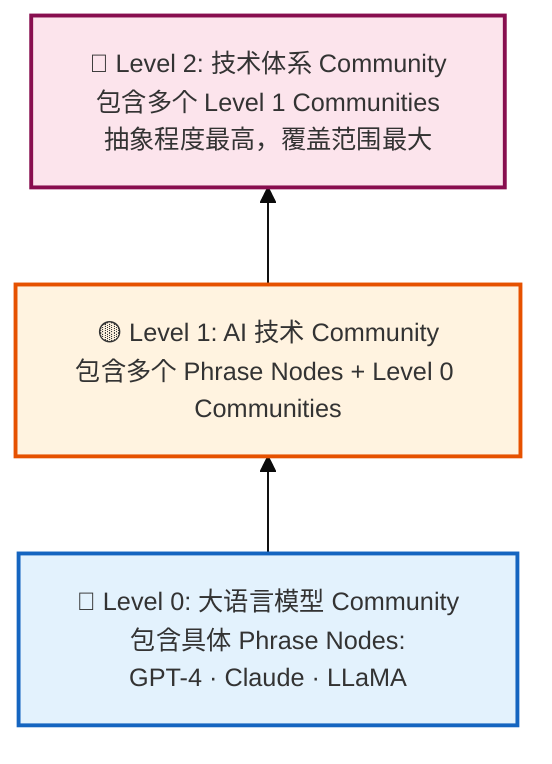

**层次越高，抽象程度越高，覆盖范围越大**。

#### 4.6.5 Community Node Summary 数据结构

```json
{
  "community_id": "community_ai_tech_l1",
  "level": 1,

  // 社区成员
  "member_phrase_nodes": [
    "phrase_RAG_001",
    "phrase_Embedding_002",
    "phrase_Vector_DB_003"
  ],
  "member_sub_communities": ["community_llm_l0"],

  // LLM 生成的综合摘要
  "summary": "RAG（检索增强生成）是一种将语义检索与生成模型结合的技术...",
  "summary_embedding": [0.18, 0.22, ...],

  // 社区统计
  "size": 45,  // 成员节点数
  "density": 0.72,  // 内部连接密度
  "coherence_score": 0.88,  // 语义一致性评分

  // 层次关系
  "parent_community_id": "community_tech_stack_l2",
  "child_community_ids": ["community_llm_l0", "community_rag_impl_l0"]
}
```

#### 4.6.6 Leiden 算法简介

**社区检测算法选择**:

| 算法 | 优势 | 适用场景 |
|-----|------|---------|
| **Louvain** | 经典，社区质量好 | 静态图 |
| **Leiden** | Louvain 改进，更快更稳定，支持分层 | **本方案选用** |
| **Label Propagation** | 超快 | 超大规模图近似 |

**Leiden 算法流程**:
1. **局部移动（Local Moving）**: 节点在社区间移动，优化模块度
2. **细化（Refinement）**: 拆分社区，避免异常大的社区
3. **聚合（Aggregation）**: 将社区压缩为超级节点，构建新图
4. **递归**: 在新图上重复上述过程，形成层次结构

**本方案使用**: `graspologic` 库中的 `HierarchicalLeiden` 实现。

### 4.7 旁路：Vector Clustering

图3 右侧的 **vector clustering** 是独立于 Community Summary 的另一条聚类路径：

| 维度 | Community Summary | Vector Clustering |
|-----|-------------------|-------------------|
| **基础** | 图结构（实体关系） | 向量距离 |
| **算法** | Leiden | K-Means / HDBSCAN |
| **用途** | 语义主题理解 | 自动发现主题分布 |
| **可解释性** | 高（有摘要） | 中（需人工标注） |

**两者互补**:
- Community Summary：基于**语义关系**聚类
- Vector Clustering：基于**语义相似度**聚类

---

## 第五章：数据存储选型与 Schema 设计

### 5.1 存储组件矩阵

| 记忆层 | 存储组件 | 数据量 | 访问模式 | 选型理由 |
|--------|---------|-------|---------|---------|
| Working Memory | Redis Cluster | GB级 | 高频读写，TTL | 亚毫秒延迟，原生TTL |
| Procedural Memory | PostgreSQL + pgvector | 10万~100万条 | 语义检索 + 条件过滤 | 结构化 + 向量混合查询 |
| Semantic Memory - Block | LanceDB | 千万~亿级 Blocks | 向量相似度检索 | 多模态原生，云原生 |
| Semantic Memory - Graph | Neo4j | 百万~千万节点 | 图遍历，多跳查询 | 图算法生态完善 |
| Semantic Memory - Community | PostgreSQL | 万级 Communities | 精确查询 | 与 Skills 同库 |
| 执行轨迹 | ClickHouse | TB级 | 时序分析，聚合 | 列式存储，高效压缩 |

### 5.2 向量数据库详细选型

#### 5.2.1 主流方案对比（2024-2025 最新基准）

根据 VectorDBBench 最新测试数据：

| 指标 | pgvector (+pgvectorscale) | Qdrant | Milvus |
|-----|--------------------------|--------|--------|
| **50M向量QPS@99%召回** | **471 QPS** ✅ | 41 QPS | ~100 QPS |
| **延迟（p95）** | 4.02s（可优化） | 2.85s | 低 |
| **索引速度** | 中等 | 中等 | **最快** ✅ |
| **扩展性** | 垂直扩展 | 水平扩展 | **云原生水平扩展** ✅ |
| **混合查询** | **优秀** ✅ | 良好 | 良好 |

#### 5.2.2 本方案选型决策

| 使用场景 | 选型 | 理由 |
|---------|------|------|
| **Skills 存储** | PostgreSQL + pgvector | 与业务数据同库，事务一致性 |
| **Block 向量检索** | LanceDB | 多模态 + 云原生 + 成本优势 |
| **大规模生产** | Milvus（备选） | 当规模超过1亿向量时切换 |

### 5.3 PostgreSQL Schema 设计（Procedural Memory + Community）

```sql
-- 技能表（Procedural Memory）
CREATE TABLE skills (
    skill_id UUID PRIMARY KEY DEFAULT gen_random_uuid(),
    skill_name VARCHAR(255) NOT NULL,
    domain VARCHAR(100) NOT NULL,
    version INTEGER DEFAULT 1,

    -- 适用条件（JSONB 灵活存储）
    preconditions JSONB NOT NULL DEFAULT '{}',

    -- 工作流定义
    workflow JSONB NOT NULL,

    -- 效果指标
    success_rate DECIMAL(4,3) CHECK (success_rate >= 0 AND success_rate <= 1),
    avg_resolution_time_sec INTEGER,
    user_satisfaction_score DECIMAL(3,2),
    total_applications INTEGER DEFAULT 0,

    -- 来源追溯
    source_episodes UUID[],
    mined_at TIMESTAMP WITH TIME ZONE,
    last_updated TIMESTAMP WITH TIME ZONE DEFAULT NOW(),

    -- 向量（用于语义检索）
    embedding VECTOR(1536),

    -- 标签
    tags VARCHAR(50)[],

    -- 全文搜索向量
    search_vector TSVECTOR GENERATED ALWAYS AS (
        to_tsvector('chinese', skill_name || ' ' || COALESCE(array_to_string(tags, ' '), ''))
    ) STORED
);

-- 向量索引
CREATE INDEX idx_skills_embedding ON skills
USING ivfflat (embedding vector_cosine_ops)
WITH (lists = 100);

-- 全文搜索索引
CREATE INDEX idx_skills_search ON skills USING GIN(search_vector);

-- 领域索引（快速过滤）
CREATE INDEX idx_skills_domain ON skills(domain);

-- Community Summary 表
CREATE TABLE community_summaries (
    community_id VARCHAR(50) PRIMARY KEY,
    level INTEGER NOT NULL CHECK (level >= 0),

    -- 摘要内容
    summary TEXT NOT NULL,
    summary_embedding VECTOR(1536),

    -- 成员
    member_phrase_nodes VARCHAR(50)[],
    member_sub_communities VARCHAR(50)[],

    -- 统计
    size INTEGER NOT NULL,
    density DECIMAL(3,2),
    coherence_score DECIMAL(3,2),

    -- 层次关系
    parent_community_id VARCHAR(50) REFERENCES community_summaries(community_id),

    created_at TIMESTAMP WITH TIME ZONE DEFAULT NOW()
);
```

### 5.4 LanceDB Schema 设计（Multimodal Lake）

```python
import lancedb
import pyarrow as pa
from lancedb.embeddings import get_registry
from lancedb.pydantic import LanceModel, Vector

# 定义 Schema
class ContentBlock(LanceModel):
    # 基础标识
    content_id: str
    content_type: str  # cot | doc | video | image | table
    source_type: str   # agent_execution | business_doc
    source_id: str

    # 内容（多模态）
    raw_text: str | None
    raw_binary: bytes | None
    metadata: str  # JSON string

    # 向量化（使用 OpenAI embedding）
    embedding: Vector(1536)  # 自动通过 LanceDB embedding 功能生成

    # 时间戳
    created_at: pa.timestamp('us')
    ingested_at: pa.timestamp('us')

    # 层次归属
    parent_section_l1: str | None
    parent_section_l2: str | None

    # 访问统计
    access_count: int = 0
    last_accessed_at: pa.timestamp('us') | None

# 创建表（带向量索引）
db = lancedb.connect("s3://my-bucket/multimodal-lake")
table = db.create_table(
    "content_blocks",
    schema=ContentBlock.to_arrow_schema(),
    mode="overwrite"
)

# 创建 IVF-PQ 索引
# nlists=256: 适合 100万~1000万 规模
# metric=cosine: 语义相似度标准度量
table.create_index(
    metric="cosine",
    num_partitions=256,
    num_sub_vectors=16,  # PQ 量化，降低存储和计算成本
    vector_column_name="embedding"
)
```

### 5.5 Neo4j Schema 设计（知识图谱）

```cypher
// 创建约束
CREATE CONSTRAINT phrase_id IF NOT EXISTS
FOR (p:Phrase) REQUIRE p.phrase_id IS UNIQUE;

CREATE CONSTRAINT block_id IF NOT EXISTS
FOR (b:Block) REQUIRE b.block_id IS UNIQUE;

// 创建索引
CREATE INDEX phrase_text_idx FOR (p:Phrase) ON (p.text);
CREATE INDEX phrase_community_idx FOR (p:Phrase) ON (p.community_id);
CREATE INDEX block_type_idx FOR (b:Block) ON (b.content_type);

// 创建 Phrase Node
CREATE (p:Phrase {
    phrase_id: 'phrase_退货政策_001',
    text: '退货政策',
    phrase_type: 'CONCEPT',
    canonical_form: '退货政策',
    aliases: ['退款政策', '退换货规定'],
    embedding: [0.21, -0.13, ...],
    mention_count: 23,
    community_id: 'community_after_sales_001',
    created_at: datetime()
});

// 创建 Block Node
CREATE (b:Block {
    block_id: 'blk_doc123_sec2_para3',
    raw_text: '完整的原始文本内容...',
    content_type: 'paragraph',
    embedding: [0.12, -0.05, ...]
});

// 创建关系
MATCH (b:Block {block_id: 'blk_doc123_sec2_para3'})
MATCH (p:Phrase {phrase_id: 'phrase_退货政策_001'})
CREATE (b)-[:CONTAINS {confidence: 0.95, positions: [23, 45]}]->(p);

MATCH (p1:Phrase {phrase_id: 'phrase_退货政策_001'})
MATCH (p2:Phrase {phrase_id: 'phrase_商品完好_002'})
CREATE (p1)-[:REQUIRES {relation_type: 'prerequisite'}]->(p2);
```

---

## 第六章：API 接口设计

### 6.1 记忆读接口（Memory Query API）

```http
POST /api/v1/memory/query
Content-Type: application/json
```

**请求参数**:

```json
{
  "query": "如何处理用户投诉？",
  "agent_id": "agent_customer_service_v2",
  "session_id": "sess_abc123",

  // 指定检索的记忆层
  "memory_layers": ["working", "procedural", "semantic"],

  // 检索配置
  "retrieval_config": {
    "top_k": 5,
    "min_relevance_score": 0.7,

    // 混合排序权重
    "ranking_weights": {
      "relevance": 0.6,
      "recency": 0.3,
      "importance": 0.1
    },

    // 启用哪些检索路径
    "enable_vector_search": true,
    "enable_graph_traversal": true,
    "enable_community_summary": true,
    "max_hops": 2
  },

  // 上下文过滤
  "filters": {
    "domain": "customer_service",
    "time_range": {"from": "2024-01-01", "to": "2024-12-31"},
    "tags": ["complaint", "escalation"]
  }
}
```

**响应**:

```json
{
  "query_id": "query_xyz789",
  "total_results": 12,
  "retrieval_time_ms": 45,

  "working_memory": {
    "current_goal": "处理用户投诉-退货相关",
    "retrieved_context": [...]
  },

  "procedural_memory": {
    "matched_skills": [
      {
        "skill_id": "skill_complaint_handling_v3",
        "skill_name": "处理用户投诉-标准流程",
        "success_rate": 0.87,
        "match_score": 0.92,
        "applied_count": 1250
      }
    ]
  },

  "semantic_memory": {
    "blocks": [
      {
        "block_id": "blk_001",
        "content": "投诉处理的第一步是...",
        "relevance_score": 0.89,
        "source_doc": "客服手册v2.1"
      }
    ],
    "community_summaries": [
      {
        "community_id": "community_complaint_handling",
        "summary": "用户投诉处理涉及...",
        "relevance_score": 0.85
      }
    ],
    "related_entities": [
      {"entity": "投诉升级", "relation": "may_lead_to"}
    ]
  }
}
```

### 6.2 记忆写接口（Memory Ingest API）

```http
POST /api/v1/memory/ingest
Content-Type: application/json
```

**请求参数**:

```json
{
  "agent_id": "agent_customer_service_v2",
  "session_id": "sess_abc123",
  "write_mode": "async",  // async | sync

  // 执行轨迹（由 Agent-TES 采集）
  "episode": {
    "trace_id": "trace_xyz789",
    "user_request": "我要退货",
    "reasoning_trace": "1. 识别用户意图... 2. 检索政策...",
    "actions": [
      {"tool": "retrieve_policy", "input": "退货政策", "output": "..."},
      {"tool": "verify_order", "input": {"order_id": "ORD-001"}, "output": "..."}
    ],
    "outcome": {
      "status": "success",
      "resolution": "用户已了解退货流程",
      "user_feedback": "positive"
    },
    "token_usage": {"input": 150, "output": 80},
    "latency_ms": 2300
  },

  // 写入的 Working Memory 更新
  "working_memory_update": {
    "entities": {"order_id": "ORD-001", "intent": "return_request"},
    "ttl_seconds": 3600
  }
}
```

### 6.3 技能管理接口（Skill API）

```http
// 检索技能
GET /api/v1/skills?domain=customer_service&min_success_rate=0.8&limit=10

// 推荐技能
GET /api/v1/skills/recommend?context=用户投诉退货&agent_id=agent_001

// 技能反馈（用于效果追踪）
POST /api/v1/skills/{skill_id}/feedback
{
  "episode_id": "ep_001",
  "outcome": "success",
  "user_feedback": "positive",
  "actual_resolution_time_sec": 180
}

// 触发技能挖掘（手动触发，也可自动定时触发）
POST /api/v1/skills/mine
{
  "domain": "customer_service",
  "time_range": {"from": "2024-03-01", "to": "2024-03-19"},
  "min_episodes": 10,
  "min_success_rate": 0.8
}
```

---

## 第七章：检索策略与算法

### 7.1 多路检索架构

```
Query
  │
  ├─── 路径1: Block Vector Search (精确局部匹配)
  │         └─ 工具: LanceDB ANN 查询
  │         └─ 适用: 具体问题有明确答案
  │
  ├─── 路径2: Section Summary Search (语义主题匹配)
  │         └─ 工具: LanceDB / PostgreSQL
  │         └─ 适用: 主题相关的概览性问题
  │
  ├─── 路径3: Community Summary Retrieval (全局理解)
  │         └─ 工具: PostgreSQL
  │         └─ 适用: 跨领域综合性问题
  │
  ├─── 路径4: Graph Traversal (关系推理)
  │         └─ 工具: Neo4j Cypher
  │         └─ 适用: 涉及实体关系的推理性问题
  │
  └─── 路径5: Skill Retrieval (技能匹配)
            └─ 工具: pgvector
            └─ 适用: 需要复用历史经验的任务
```

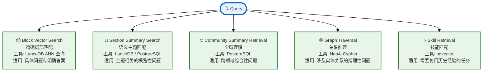

### 7.2 混合排序算法

```python
def calculate_memory_score(memory_item, query_context):
    """
    综合评分 = 相关性 + 时效性 + 重要性
    参考: Generative Agents 的记忆排序公式
    """

    # 1. 相关性得分 (Relevance)
    relevance = cosine_similarity(
        query_context.embedding,
        memory_item.embedding
    )

    # 2. 时效性得分 (Recency)
    # 指数衰减: 越新的记忆得分越高
    hours_ago = (now - memory_item.created_at).total_seconds() / 3600
    recency = np.exp(-hours_ago / 24)  # 24小时半衰期

    # 3. 重要性得分 (Importance)
    # 由 LLM 预打分，或通过访问频次计算
    importance = memory_item.importance_score or 0.5

    # 加权求和
    final_score = (
        0.6 * relevance +
        0.3 * recency +
        0.1 * importance
    )

    return final_score
```

### 7.3 检索-生成融合（RAG Pipeline）

```
1. Query Analysis
   └── 意图识别: 局部精确 vs 全局概览
   └── 实体提取: 识别 query 中的关键实体

2. Multi-Path Retrieval
   └── 并行触发多路检索
   └── 每路检索返回 top-k 候选

3. Reranking
   └── 使用 Cross-Encoder 重排序
   └── 筛选最终上下文

4. Context Assembly
   └── 按逻辑顺序组装检索结果
   └── 生成引用溯源信息

5. LLM Generation
   └── 注入组装后的上下文
   └── 生成答案，附带引用来源
```

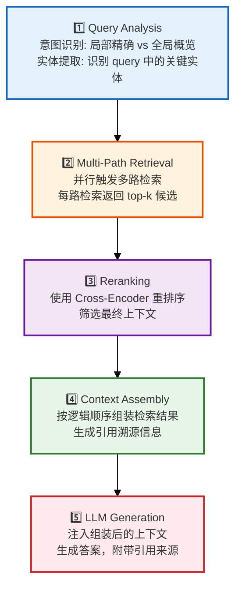

---

## 第八章：部署与运维

### 8.1 系统部署架构

```
┌─────────────────────────────────────────────────────────┐
│                     Kubernetes Cluster                   │
│                                                          │
│  ┌─────────────┐  ┌─────────────┐  ┌─────────────┐     │
│  │ Agent       │  │ Agent-TES   │  │ Skill-MDS   │     │
│  │ Framework   │  │ DaemonSet   │  │ Service     │     │
│  │ (Deployment)│  │             │  │             │     │
│  └──────┬──────┘  └──────┬──────┘  └──────┬──────┘     │
│         │                │                │            │
│         └────────────────┼────────────────┘            │
│                          │                              │
│  ┌───────────────────────┼───────────────────────┐     │
│  │              Data Layer                        │     │
│  │  ┌─────────┐  ┌─────────┐  ┌─────────┐       │     │
│  │  │ Redis   │  │PostgreSQL│  │ LanceDB │       │     │
│  │  │(Working)│  │(Skill/   │  │(Block/   │       │     │
│  │  │ Memory) │  │Community)│  │Multimodal│       │     │
│  │  └─────────┘  └─────────┘  └────┬────┘       │     │
│  │                                  │             │     │
│  │                           ┌──────┴──────┐      │     │
│  │                           │    S3       │      │     │
│  │                           │ (Object Store)     │     │
│  │                           └─────────────┘      │     │
│  └────────────────────────────────────────────────┘     │
└─────────────────────────────────────────────────────────┘
```

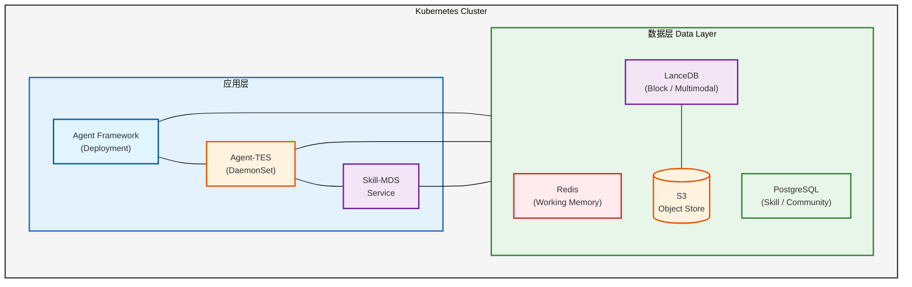

| 层级 | 指标 | 告警阈值 |
|-----|------|---------|
| **Working Memory** | Redis 命中率 | < 95% |
| **Block 检索** | LanceDB 查询延迟 (p99) | > 100ms |
| **Graph 查询** | Neo4j 查询延迟 (p99) | > 200ms |
| **Skill 匹配** | 技能检索准确率 | < 80% |
| **Pipeline** | 记忆加工延迟 | > 5min |

### 8.3 容量规划

| 组件 | 小规模 (1万日活) | 中规模 (100万日活) | 大规模 (1亿日活) |
|-----|----------------|-------------------|-----------------|
| Redis | 8GB | 64GB | 256GB Cluster |
| PostgreSQL | 4C8G | 16C64G | 读写分离 + 分片 |
| LanceDB | 100GB | 10TB | 分布式部署 |
| Neo4j | 16GB | 64GB | Enterprise Cluster |

---

## 第九章：评估体系与评测方法

Agent 记忆系统的评估不能仅依赖单一指标，需要建立**分层评估框架**，涵盖检索质量、记忆效用、端到端任务效果三个层次。

### 9.1 评估层次框架

```
┌─────────────────────────────────────────────────────────────────┐
│                    Agent 记忆系统评估体系                         │
├─────────────────────────────────────────────────────────────────┤
│  Layer 3: 端到端任务评估 (End-to-End)                            │
│  └── Agent 完成业务任务的成功率、效率、用户满意度                  │
├─────────────────────────────────────────────────────────────────┤
│  Layer 2: 记忆效用评估 (Memory Utility)                          │
│  └── 检索结果对任务完成的实际贡献度、信息增益                      │
├─────────────────────────────────────────────────────────────────┤
│  Layer 1: 检索质量评估 (Retrieval Quality)                       │
│  └── 相关性、召回率、排序准确性                                   │
└─────────────────────────────────────────────────────────────────┘
```

### 9.2 Layer 1: 检索质量评估

传统信息检索指标，适用于离线评测记忆系统的"基本功"。

#### 9.2.1 核心指标

| 指标 | 说明 | 计算公式 | 适用场景 |
|-----|------|---------|---------|
| **Recall@K** | Top-K 召回率 | 相关结果中被召回的比例 | 评估记忆系统是否"找得全" |
| **Precision@K** | Top-K 精确率 | 召回结果中相关的比例 | 评估记忆系统是否"找得准" |
| **NDCG@K** | 归一化折损累计增益 | 考虑排序位置的加权得分 | 评估记忆系统是否"排得好" |
| **MRR** | 平均倒数排名 | 第一个相关结果的排名倒数 | 评估记忆系统的"首条命中率" |

#### 9.2.2 评测数据集构建

**静态评测集**（基准测试）：
- 准备 1000+ 条标注好的 (Query, Relevant Memories) 对
- 覆盖不同查询类型：事实查询、关系查询、技能匹配、摘要查询
- 定期更新（建议每季度）以防止过拟合

**动态评测集**（在线采样）：
- 从生产环境采样真实查询（脱敏后）
- 人工标注 Top-K 结果的相关性（二元或多元）
- 用于监控线上检索质量漂移

### 9.3 Layer 2: 记忆效用评估

检索结果相关性高 ≠ 对 Agent 完成任务有用。需要评估记忆的实际效用。

#### 9.3.1 上下文压缩率 (Context Compression Ratio)

衡量 Working Memory 的管理效率：

```
压缩率 = 原始输入 Token 数 / 压缩后输入 Token 数
```

- **健康范围**: 3x ~ 10x（压缩 3-10 倍）
- **过高风险**: >20x 可能丢失关键信息
- **过低风险**: <2x 说明筛选策略过于保守

#### 9.3.2 信息增益 (Information Gain)

衡量检索结果对 Agent 决策的实际贡献：

**A/B 测试方法**:
1. 对照组：Agent 无记忆检索（仅依赖预训练知识）
2. 实验组：Agent 使用记忆检索结果
3. 计算任务成功率提升：

```
信息增益 = (实验组成功率 - 对照组成功率) / 对照组成功率
```

#### 9.3.3 记忆命中率 (Memory Hit Rate)

统计 Agent 实际使用记忆的情况：

| 指标 | 定义 | 健康范围 |
|-----|------|---------|
| **检索触发率** | 多少比例的任务触发了记忆检索 | 60% ~ 90% |
| **检索采纳率** | 检索结果中实际被 Agent 引用的比例 | >70% |
| **重复检索率** | 同一 Session 内重复检索相同内容的比例 | <20% |

### 9.4 Layer 3: 端到端任务评估

最终目标：Agent 在真实业务场景中表现更好。

#### 9.4.1 动态长期评测框架

**不是一次评测，而是持续观测**：

```
Week 1-2: 基线期（Agent 无记忆系统或空记忆）
    └── 记录任务成功率、平均步数、用户满意度

Week 3-6: 学习期（Agent 开始积累记忆）
    └── 观测记忆积累曲线与任务表现的关联

Week 7+: 稳定期（记忆系统成熟运行）
    └── 对比基线期，计算整体提升
```

#### 9.4.2 核心观测指标

| 维度 | 指标 | 说明 |
|-----|------|------|
| **效果** | 任务成功率 | 完成目标任务的百分比 |
| **效果** | 平均完成步数 | 任务完成所需交互轮次 |
| **效果** | 错误恢复率 | 出错后能否通过记忆纠正 |
| **效率** | 平均响应延迟 | 含检索时间的端到端延迟 |
| **体验** | 用户满意度评分 | 1-5 分的主观评价 |
| **成本** | 人均 Token 消耗 | 完成任务所需平均 Token |

#### 9.4.3 记忆系统的"遗忘测试"

**测试方法**：
1. 让 Agent 在特定场景下积累 100+ 条相关记忆
2. 模拟时间流逝（设置记忆老化策略）
3. 观察 Agent 在"旧记忆"场景 vs "新记忆"场景的表现差异

**评估目标**：
- 确认记忆衰减策略不会导致**灾难性遗忘**
- 高频记忆保持高可用性，低频记忆正确降级

### 9.5 业界评估基准参考

| 基准名称                       | 适用场景     | 评估重点        |
| -------------------------- | -------- | ----------- |
| **RAGAS**                  | RAG 系统   | 检索相关性、答案忠实度 |
| **MultiHop-RAG**           | 多跳推理     | 跨文档推理能力     |
| **Long Context Benchmark** | 长上下文     | 长序列中的信息定位   |
| **AgentBench**             | Agent 系统 | 多轮交互任务完成度   |
| **MemoBench** (微软)         | 记忆系统     | 长期记忆一致性     |

### 9.6 推荐评测策略

**阶段一：离线验证**（系统上线前）
- 构建 500+ 条内部评测集
- Recall@10 > 85%，NDCG@10 > 0.75

**阶段二：灰度观测**（上线 10% 流量）
- 对比实验组 vs 对照组任务成功率
- 监控检索延迟 P99 < 100ms

**阶段三：全量监控**（完整上线后）
- 每周抽样人工评估 100 条检索结果
- 每月全量分析记忆命中率、信息增益趋势

---

## 附录：术语表

| 术语 | 英文 | 说明 |
|-----|------|------|
| Agent-TES | Agent Telemetry & Evidence Service | 遥测与证据采集服务 |
| Skill-MDS | Skill Mining & Discovery Service | 技能挖掘与发现服务 |
| CoT | Chain of Thought | 思维链，LLM 的推理过程 |
| Block | - | 内容块，Semantic Memory 的基础存储单元 |
| Community | - | 知识图谱中的语义社区 |
| Leiden 算法 | Leiden Algorithm | 社区检测算法 |

---

## 参考来源

- [LanceDB Multimodal Lakehouse](https://lancedb.com/) - LanceDB 多模态数据湖官方文档
- [VectorDBBench 2024](https://github.com/zilliztech/VectorDBBench) - 向量数据库性能基准测试
- [Microsoft GraphRAG](https://microsoft.github.io/graphrag/) - 微软 GraphRAG 官方文档
- [Agent Memory Architecture Patterns](https://arxiv.org/abs/2309.02427) - Agent 记忆架构设计模式论文

---

*文档版本: v2.0*
*最后更新: 2026-03-19*
*状态: 详细设计稿（可进入技术评审）*
