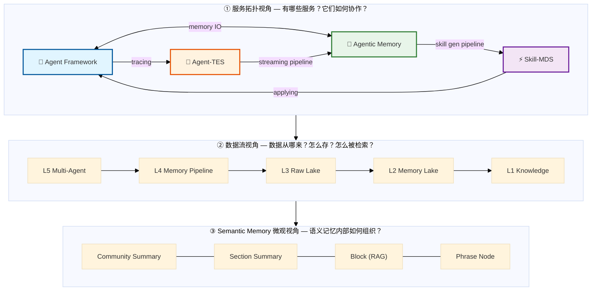
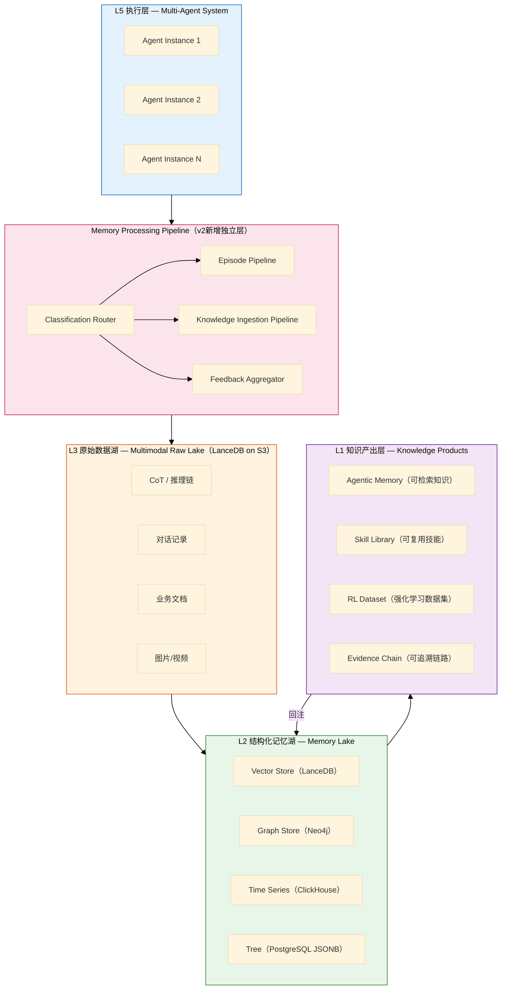
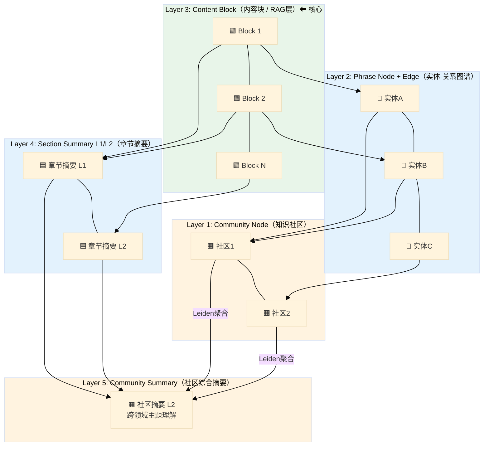
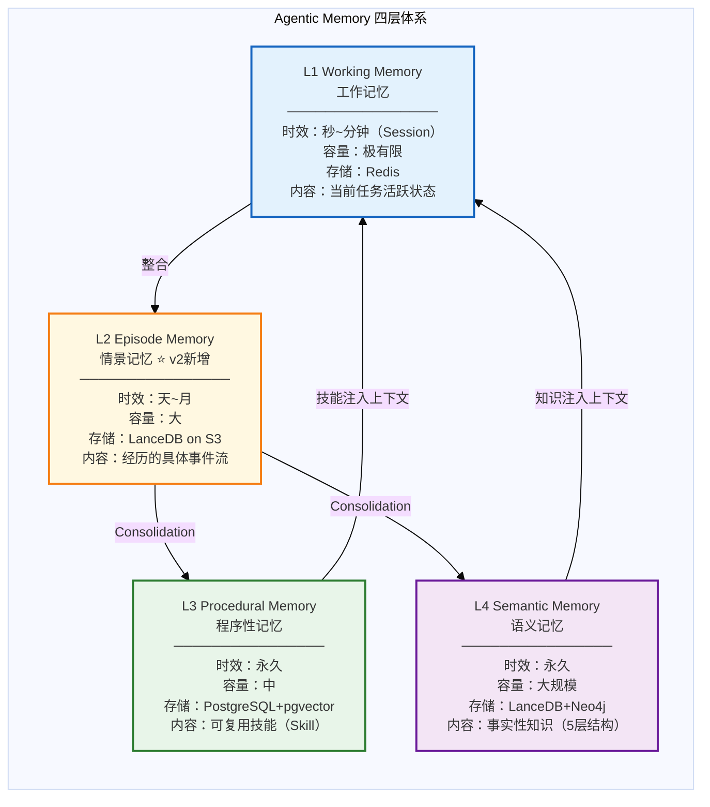
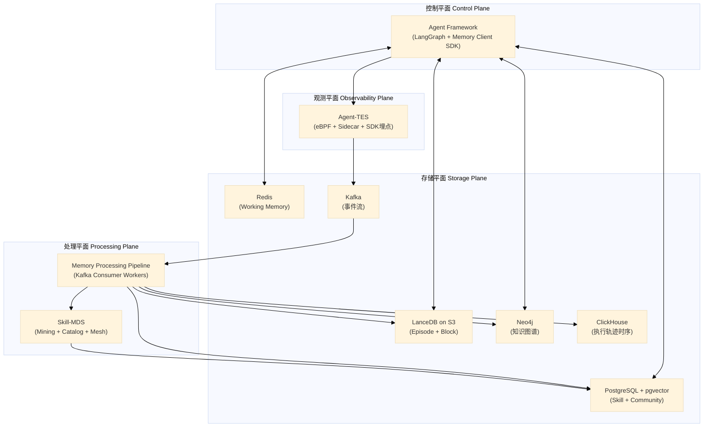
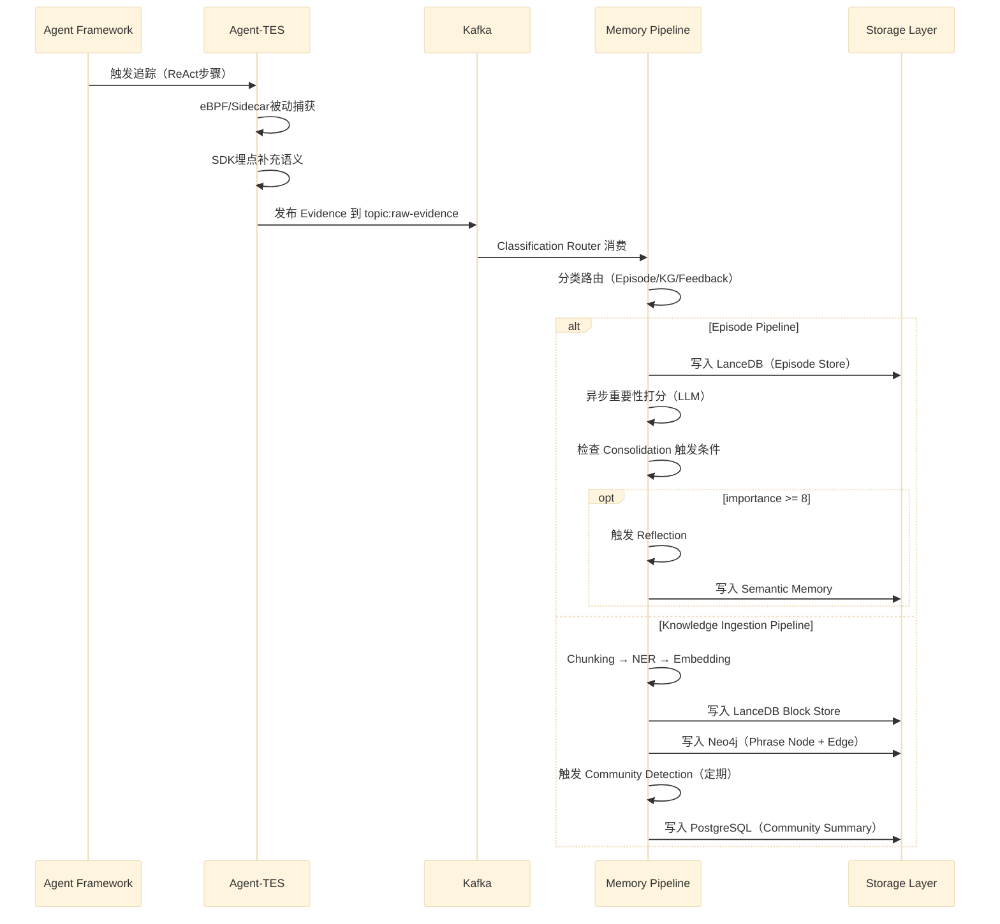
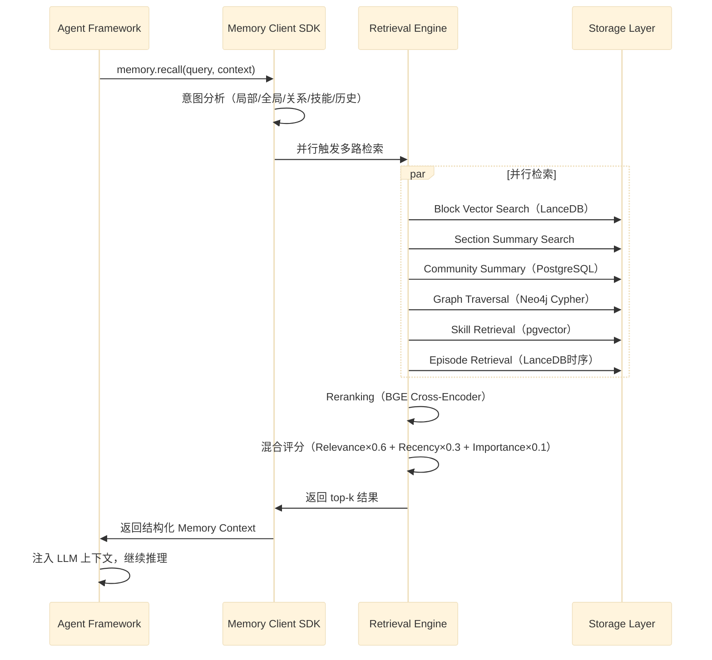
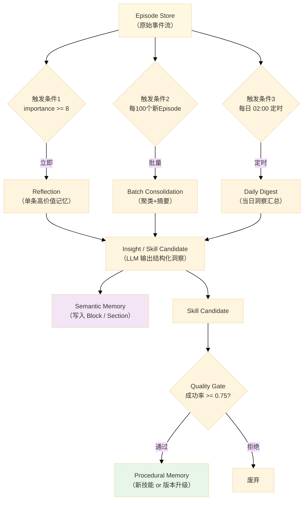

# Agent Infra with Agentic Memory — 概要设计

> **方案代号**: 版本A（Plan-A）
> **文档类型**: 概要设计（Overview Design）
> **版本**: v1.0
> **日期**: 2026-03-23
> **状态**: 设计定稿，指导后续详细设计

---

## 文档导航

本方案包含以下文档（按阅读顺序）：

| 序号     | 文档                    | 内容摘要                             | 状态  |
| ------ | --------------------- | -------------------------------- | --- |
| **00** | **本文档** — 概要设计        | 系统总览、架构、原则、技术栈选型                 | ✅   |
| 01     | Agent Framework 详细设计  | 执行中枢、LangGraph集成、Context Manager | ✅   |
| 02     | Agent-TES 详细设计        | 遥测采集、Evidence Schema、Kafka管道     | ✅   |
| 03     | Memory System 详细设计    | 四层记忆架构、数据结构、演化机制                 | ✅   |
| 04     | Skill-MDS 详细设计        | 技能挖掘算法、目录管理、Skill Mesh           | ✅   |
| 05     | Memory Pipeline 详细设计  | 处理管道、Consolidation、社区检测          | ✅   |
| 06     | Storage Schema 设计     | 所有数据库完整DDL/Schema                | ✅   |
| 07     | API 接口设计              | REST API规范、OpenAPI、功能测试          | ✅   |
| 08     | 检索策略设计                | 多路检索、重排序、GraphRAG模式              | ✅   |
| 09     | Multi-Agent Memory 设计 | 记忆共享、Memory Router、可见性模型         | ✅   |
| 10     | 部署与运维                 | Docker/K8s、初始化脚本、监控告警            | ✅   |
| 11     | 测试方案                  | 单元/集成/API测试用例、性能测试               | ✅   |

---

## 第一章：系统背景与设计目标

### 1.1 背景

当前 AI Agent 系统面临三个核心瓶颈：

**瓶颈1：上下文遗忘**
每次对话/任务启动时，Agent 都是"新生"——不记得上次发生了什么，不能从失败中学习，每次遇到相似问题都需要重新推理。这导致系统效率低下，且用户体验差。

**瓶颈2：知识孤岛**
Agent 产生的洞察、成功的执行模式、积累的领域知识，分散在各处的日志中，无法被其他 Agent 或下一次任务复用。个体智能无法演变为组织智能。

**瓶颈3：推理不可解释**
Agent 的每个决策过程是黑盒，出错时无法溯源，无法满足企业级的审计要求，也无法有针对性地改进。

### 1.2 设计目标

构建一套**生产级 Agent 认知基础设施（Agent Cognitive Infrastructure）**，解决上述三个瓶颈：

| 目标 | 解决的瓶颈 | 对应核心组件 |
|------|----------|------------|
| **持续记忆** — Agent 能跨会话保持上下文，记住经历过的事 | 上下文遗忘 | Episode Memory + Working Memory |
| **知识积累** — 从执行轨迹中自动提炼可复用的技能和知识 | 知识孤岛 | Skill-MDS + Semantic Memory |
| **全局理解** — 不仅记住局部片段，还能理解主题全貌 | 知识孤岛 | GraphRAG（Community Summary）|
| **经验传承** — 个人经验可跨 Agent 复用，形成团队智能 | 知识孤岛 | Multi-Agent Memory Router |
| **完整溯源** — 每个决策都有完整证据链，支持审计 | 推理不可解释 | Agent-TES + Chain of Evidence |
| **自主演化** — Agent 能主动管理自己的记忆，越用越聪明 | 全部三个 | Memory Processing Pipeline |

### 1.3 适用场景

本架构设计的核心场景是**自主任务型 Agent（Agentic Task Execution）**：

- 企业知识库问答 + 复杂研究任务
- 代码生成、调试、CI/CD 流程自动化
- 客服 Agent（有记忆的多轮对话）
- 多步骤文档分析与合同审查
- 多 Agent 协作系统（每个 Agent 有独立记忆，也有共享记忆）

> **与对话型产品的区别**（重要）：本架构的 Working Memory 针对"任务执行期间的活跃状态"设计，而非对话消息的永久存储。若用于对话型产品，需额外增加 Conversation Memory 层做永久存档（详见文档03）。

---

## 第二章：整体系统架构

### 2.1 三视图概览

整个方案由三个视图构成，从不同维度描述系统：



### 2.2 服务拓扑架构（图1详解）

```
┌──────────────────────────────────────────────────────────────────────┐
│                         用户 / 业务系统                               │
└────────────────────────────────┬─────────────────────────────────────┘
                                 │ HTTP / gRPC
┌────────────────────────────────▼─────────────────────────────────────┐
│                    Agent Framework（执行中枢）                         │
│                                                                       │
│  ┌─────────────┐  ┌─────────────┐  ┌──────────────┐  ┌────────────┐  │
│  │  Planner    │  │  Executor   │  │  Context     │  │  Memory    │  │
│  │  任务分解    │  │  工具调用    │  │  Manager     │  │  Client    │  │
│  └─────────────┘  └─────────────┘  └──────────────┘  └────────────┘  │
│                                                                       │
│  底层：LangGraph StateGraph（ReAct循环）                               │
└──────┬──────────────┬──────────────────────────────┬─────────────────┘
       │              │                              │
   tracing        memory IO                      skill apply
       │              │                              │
┌──────▼─────┐  ┌─────▼───────────────────┐  ┌──────▼──────┐
│ Agent-TES  │  │    Agentic Memory        │  │ Skill-MDS   │
│ 遥测与证据  │  │                         │  │ 技能挖掘发现 │
│            │  │  L1: Working Memory     │  │             │
│  eBPF      │  │  L2: Episode Memory     │  │  Catalog    │
│  Sidecar   │  │  L3: Procedural Memory  │  │  Mining     │
│  SDK埋点   │  │  L4: Semantic Memory    │  │  Mesh       │
└──────┬─────┘  └─────────────────────────┘  └─────────────┘
       │                    ▲
 streaming                  │ Processing Pipeline
 pipeline                   │
┌──────▼────────────────────┤
│  Memory Processing Pipeline│
│  Episode / KG / Feedback  │
│  Extraction / Embedding   │
│  Consolidation / Community │
└───────────────────────────┘
```

### 2.3 数据流分层架构（图2详解）



### 2.4 Semantic Memory 内部结构（图3详解）



**五层说明**：
- **L3 Content Block（绿色）**：传统 RAG 的切块层，是全部知识的"真实内容"基础，每个 Block 独立 Embedding
- **L4 Section Summary**：多个 Block 的 LLM 摘要，用于主题级检索
- **L5 Community Summary**：跨 Block 的语义社区综合摘要，用于宏观问题（"总结一下X相关的整体情况"）
- **L2 Phrase Node**：从 Block 中 NER 提取的实体节点，有类型和关联关系
- **L1 Community Node**：Leiden 算法检测的实体社区，为 L5 摘要提供结构基础

---

## 第三章：四层记忆体系

### 3.1 记忆分层总览



### 3.2 四层特性对比

| 维度 | L1 Working | L2 Episode | L3 Procedural | L4 Semantic |
|------|-----------|-----------|--------------|-------------|
| **认知科学对应** | 工作记忆 | 情景记忆 | 程序性记忆 | 语义记忆 |
| **内容性质** | "正在做什么" | "做过什么" | "怎么做" | "是什么" |
| **时效** | Session（分钟~小时）| 天~月 | 永久 | 永久 |
| **存储介质** | Redis | LanceDB on S3 | PostgreSQL + pgvector | LanceDB + Neo4j |
| **读延迟** | <1ms | 10~50ms | 5~20ms | 20~100ms |
| **主要写入来源** | Agent 实时状态 | TES 采集 + Archive | Skill Mining | 业务文档 + Consolidation |
| **查询特点** | Key-Value 精确读 | 时序 + 语义混合 | 语义匹配 + 条件过滤 | 多路径检索 |

### 3.3 v1 → v2 → 版本A 的关键演进

| 变更 | v1 | v2 | 版本A |
|------|----|----|------|
| **记忆层数** | 3层（无Episode）| 4层（+Episode）| 4层（定型）|
| **写入管道** | 模糊提及 | 独立设计 | 完整流水线设计 |
| **记忆演化** | 无 | Reflection+Consolidation | 完整触发策略 |
| **时间感知** | TTL only | 双时间模型 | 双时间+版本管理 |
| **Agent自主性** | 被动 | 有原语设计 | 完整SDK设计 |
| **Multi-Agent** | 提及 | 框架设计 | 完整Router+可见性 |
| **测试设计** | 无 | 无 | 完整测试方案 |
| **部署方案** | 简要 | 简要 | Docker+K8s+脚本 |

---

## 第四章：核心服务模块清单

### 4.1 服务模块总览



### 4.2 服务职责说明

| 服务 | 职责 | 技术栈 | 部署方式 |
|------|------|--------|---------|
| **Agent Framework** | 任务执行中枢，LLM推理，工具调用，记忆IO | Python + LangGraph | K8s Deployment |
| **Agent-TES** | 全链路遥测采集，Evidence打分，写入Kafka | Python + eBPF Sidecar | K8s DaemonSet |
| **Memory Pipeline** | 处理 Kafka 消息，提取/嵌入/图构建/整合 | Python Worker Pool | K8s Deployment |
| **Skill-MDS** | 技能挖掘、目录管理、技能推荐 | Python | K8s Deployment |
| **Memory Client SDK** | Agent 与 Memory 交互的统一接口库 | Python SDK | 嵌入 Agent Framework |
| **Redis** | Working Memory KV 存储 | Redis 7+ | K8s StatefulSet |
| **LanceDB** | Episode + Block 向量存储（云原生）| LanceDB on S3 | Serverless |
| **PostgreSQL** | Skill + Community + 元数据关系型存储 | PG 15 + pgvector | K8s StatefulSet |
| **Neo4j** | 知识图谱（实体+关系+社区）| Neo4j 5 | K8s StatefulSet |
| **ClickHouse** | 执行轨迹时序分析 | ClickHouse | K8s StatefulSet |
| **Kafka** | 事件流消息队列，解耦采集和处理 | Kafka 3.x | K8s Deployment |

---

## 第五章：核心设计原则

### 原则1：认知分层（Cognitive Layering）

参照认知科学的记忆分层理论：
- **Tulving**（1972）的情景记忆/语义记忆二分法 → L2 Episode vs L4 Semantic
- **Baddeley**（1986）的工作记忆模型 → L1 Working Memory
- **Cohen & Squire**（1980）的程序性记忆 → L3 Procedural Memory
- **MemGPT/Letta** 的 OS 虚拟内存隐喻 → Context Manager 换页策略

### 原则2：写入优先（Write-First Design）

> "记忆的上限由写入质量决定，检索算法只能在写入的范围内工作。"

- **高质量写入管道** > **复杂检索算法**
- 每次写入都要提取：实体、关系、摘要、Embedding、重要性分数
- 宁可写入慢，不能写入粗

### 原则3：搜索驱动存储（Search-Driven Storage）

先定义"Agent 需要回答什么类型的问题"，再决定"如何存储"：

| 问题类型 | 需要的存储结构 |
|---------|-------------|
| "这段文字和我的问题有多相似？" | 向量索引（Block Embedding）|
| "A 和 B 是什么关系？" | 图存储（Neo4j）|
| "这个主题的整体情况是什么？" | Community Summary（预生成摘要）|
| "上次出现这个问题是什么时候？" | 时序存储（Episode + ClickHouse）|
| "处理这类任务的最佳方法是什么？" | 技能存储（Procedural Memory）|

### 原则4：时间感知（Temporal Awareness）

引入 Zep/Graphiti 的**双时间模型**：

```
Event Time (T)     ——  事件实际发生时间，用于时序推理和历史查询
Ingestion Time (T') ——  数据写入系统时间，用于审计追踪和版本控制
```

所有记忆实体都携带这两个时间戳，支持：
- 历史状态查询（"2024年的退货政策是什么？"）
- 知识版本管理（政策更新时保留历史版本）
- 审计追踪（谁在何时写入了什么）

### 原则5：记忆演化（Memory Evolution）

参照 Generative Agents 的 Reflection 机制：

```
原始事件（Episode）
    ↓ 异步, 低频, 批量
高层抽象（Insight / Skill Candidate）
    ↓
固化到长期记忆（Semantic / Procedural）
```

三种触发方式：
1. **重要性阈值触发**：importance_score >= 8 → 立即 Reflection
2. **数量阈值触发**：每累积 100 个 Episode → 批量 Consolidation
3. **时间周期触发**：每天 02:00 对前一天的高重要性 Episode 做整合

### 原则6：Agent 自主性（Agentic Autonomy）

参照 MemGPT 的 OS 隐喻，Agent 不是被动地被记忆系统服务，而是**主动管理自己的记忆**：

```python
# Agent 可调用的 4 个核心 Memory 原语
memory.recall(query)        # 主动检索，注入上下文
memory.store(content, type) # 主动固化重要内容
memory.archive(msg_ids)     # 主动清理，减轻上下文压力
memory.reflect()            # 主动触发反思整合
```

### 原则7：证据驱动（Evidence-Driven）

所有知识都有完整溯源链路：
- 每个 Block 知道来自哪篇文档的哪个段落
- 每个 Skill 知道从哪些 Episodes 归纳而来
- 每次 Reflection 知道基于哪些原始记录
- 每次检索记录被用于哪次决策

---

## 第六章：技术栈选型

### 6.1 选型总览

| 层次 | 组件 | 选型 | 版本 | 选型理由 |
|------|------|------|------|---------|
| **Agent 框架** | 任务编排 | LangGraph | 0.3+ | StateGraph 天然对应 Working Memory |
| **LLM** | 推理模型 | Claude Sonnet 4.6 / GPT-4o | — | 主模型可插拔 |
| **Embedding** | 文本向量化 | OpenAI text-embedding-3-large | — | 1536维，质量最优；可降级到本地模型 |
| **Working Memory** | KV存储 | Redis 7 | 7.x | 亚毫秒延迟，原生TTL，Pub/Sub |
| **Episode+Block** | 向量列式存储 | LanceDB | 0.10+ | 多模态原生，云原生S3，列式SIMD |
| **Skill+Community** | 关系型+向量 | PostgreSQL 15 + pgvector | 15.x | 结构化+向量混合查询，事务一致性 |
| **知识图谱** | 图数据库 | Neo4j 5 | 5.x | 图算法生态最成熟，GDS社区检测 |
| **轨迹分析** | 列式时序 | ClickHouse | 24.x | 高压缩比，聚合查询极快 |
| **消息队列** | 事件流 | Kafka 3 | 3.x | 高吞吐，持久化，消费组管理 |
| **社区检测** | 图算法 | Neo4j GDS（Leiden） | — | Leiden 比 Louvain 更稳定 |
| **NER** | 实体识别 | spaCy + LLM二阶段 | 3.7+ | Fast pass + 高精度pass |
| **Reranking** | 重排序 | BGE-reranker-large | — | 性价比最优的 Cross-Encoder |
| **部署** | 容器编排 | Kubernetes | 1.28+ | 生产标准 |
| **监控** | 指标采集 | Prometheus + Grafana | — | 行业标准 |
| **链路追踪** | 分布式追踪 | OpenTelemetry + Jaeger | — | 无厂商绑定 |

### 6.2 向量数据库选型决策

根据 VectorDBBench 2024 年基准测试数据，本方案的向量存储策略：

| 使用场景 | 选型 | 理由 |
|---------|------|------|
| **Skill 存储（万级）** | PostgreSQL + pgvector | 与业务数据同库，事务一致性，混合查询优秀 |
| **Block 向量（千万级）** | LanceDB on S3 | 多模态原生，云原生低成本，零运维 |
| **超大规模生产（亿级）** | Milvus（备选） | 当规模超过1亿向量时迁移 |

> LanceDB 在 50M 向量规模下 QPS 达到 471（pgvector+pgvectorscale），远超 Qdrant 的 41 QPS。选择 LanceDB 的核心原因是**多模态存储 + 云原生 S3 + 零运维**，而非纯粹性能。

### 6.3 LLM 调用策略

为控制成本，分场景使用不同规格的模型：

| 场景 | 模型选型 | 理由 |
|------|---------|------|
| **Agent 主推理** | Claude Sonnet 4.6 / GPT-4o | 高质量决策 |
| **重要性打分** | GPT-4o-mini / Haiku | 批量异步，成本敏感 |
| **Reflection/Consolidation** | Claude Sonnet 4.6 | 质量优先，低频调用 |
| **NER 二阶段** | GPT-4o-mini | 批量实体抽取 |
| **Community Summary 生成** | Claude Sonnet 4.6 | 摘要质量关键 |

---

## 第七章：数据流总览

### 7.1 写入路径（Evidence → Memory）



### 7.2 读取路径（Query → Response）



### 7.3 记忆演化路径（Consolidation）



---

## 第八章：关键设计决策（ADR）

> ADR = Architecture Decision Record，记录重要的架构决策及理由

### ADR-001：为什么新增 Episode Memory 层

**背景**：v1 将情景记忆和语义记忆混在一起，没有区分"经历过的事"和"提炼出的知识"。

**决策**：新增 L2 Episode Memory 作为独立层。

**理由**：
1. Tulving 的记忆理论明确区分情景记忆（episodic）和语义记忆（semantic），对应不同的神经机制
2. Episode 是原始"原料"，Semantic Memory 是"成品"，混在一起会导致检索精度下降
3. Episode 需要时序查询（"上次出现这个问题是什么时候"），Semantic Memory 更多是语义检索
4. Skill Mining 的输入来自 Episode，不应该从 Semantic Memory 里挖掘

### ADR-002：为什么用 LanceDB 而不是独立向量数据库

**背景**：主流选择是 Pinecone / Qdrant / Milvus 等专用向量数据库。

**决策**：Episode Store 和 Block Store 使用 LanceDB on S3。

**理由**：
1. LanceDB 是列式格式（Lance 格式 = Arrow2），支持向量 + 结构化数据 + 二进制数据同库存储，无需分离存储系统
2. 直接挂载 S3，存储成本极低，无需维护有状态的向量数据库集群
3. 多模态原生：图片、视频的原始字节和 Embedding 可以存在同一张表
4. Episode 是 append-only 的，LanceDB 的列式追加写入比行式数据库快得多

### ADR-003：为什么引入双时间模型

**背景**：v1 只有简单的 `created_at` 时间戳。

**决策**：所有记忆实体携带 `event_time`（事件时间）和 `ingestion_time`（摄入时间）。

**理由**：
1. 知识会更新（政策从30天改为15天），需要区分"知识有效时间"和"写入时间"
2. 历史查询（"2024年的政策是什么"）需要基于 event_time 过滤
3. 审计追踪需要 ingestion_time
4. 来自 Zep/Graphiti 的最佳实践验证，在时间感知场景下效果显著更好

### ADR-004：Community Summary 的必要性

**背景**：传统 RAG 只做 Block 向量检索，对宏观问题（"给我总结一下X的整体情况"）无法有效回答。

**决策**：采用 Microsoft GraphRAG 的 Community Summary 机制。

**理由**：
1. 传统 RAG 返回零散的 Block 片段，LLM 需要自己拼凑宏观理解，质量不稳定
2. Community Summary 是预生成的跨 Block 综合摘要，直接命中宏观问题
3. 实验数据（Microsoft 论文）：Community Summary 在 Global Search 上比传统 RAG 提升 30-40%
4. 一次性预生成（Offline），在线检索成本极低

### ADR-005：Skill 版本控制的必要性

**背景**：v1 的 Skill 没有版本历史。

**决策**：技能有版本迭代轨迹，自动监控质量退化，支持回滚。

**理由**：
1. 业务场景会变化，历史版本的 Skill 可能不再适用
2. 新挖掘的 Skill 版本未必比旧版本更好，需要 A/B 对比
3. Skill 退化（成功率下降超过15%）需要自动告警和处理
4. 参照 *Remember Me, Refine Me* 论文的动态程序性记忆设计

---

## 第九章：系统边界与约束

### 9.1 功能边界

**本方案包含**：
- Agent 记忆系统（4层架构）
- 遥测采集（TES）
- 知识加工管道（Pipeline）
- 技能挖掘与管理（Skill-MDS）
- 检索接口（Memory Client SDK）
- Multi-Agent 记忆共享

**本方案不包含**（需要外部实现）：
- LLM 模型本身（模型是可插拔的外部依赖）
- 业务应用层（调用 Agent Framework 的上层业务）
- 用户界面
- 模型微调流水线（RL Dataset 只是产出，训练在外部）

### 9.2 性能约束

| 指标 | 目标 | 备注 |
|------|------|------|
| Memory 查询延迟 p99 | < 200ms | 含多路并行检索 + Reranking |
| Episode 写入延迟 p99 | < 100ms（主链路）| 向量化和 Graph 构建异步 |
| Working Memory 读写 p99 | < 1ms | Redis |
| Skill 推荐延迟 p99 | < 50ms | pgvector 索引命中 |
| Consolidation 吞吐 | 1000 Episodes/分钟 | Worker Pool 处理能力 |

### 9.3 可靠性约束

| 组件 | 可用性目标 | 容灾策略 |
|------|----------|---------|
| Agent Framework | 99.9% | 无状态，多副本 |
| Memory 查询接口 | 99.9% | 只读副本，降级返回 |
| Kafka Pipeline | 99.5% | 3副本，DLQ |
| Redis | 99.9% | 主从复制，AOF持久化 |
| PostgreSQL | 99.9% | 主从，定期备份 |
| LanceDB on S3 | 99.99% | S3 原生高可用 |

---

## 第十章：开发路线图（参考）

### Phase 1: 基础能力（MVP，4-6周）

目标：能让单个 Agent 有记忆，执行任务后能从记忆中检索

- [ ] L1 Working Memory（Redis）
- [ ] L4 Semantic Memory（LanceDB Block Store + 基础向量检索）
- [ ] Agent Framework 基础（LangGraph + Memory Client SDK）
- [ ] 简单 Evidence 采集（SDK 埋点，不上 eBPF）
- [ ] 基础 API（query + ingest）

### Phase 2: 记忆演化（6-8周）

目标：记忆能自动演化，技能能自动挖掘

- [ ] L2 Episode Memory
- [ ] Memory Processing Pipeline（Kafka）
- [ ] Consolidation + Reflection 机制
- [ ] L3 Procedural Memory + Skill-MDS（基础挖掘）
- [ ] GraphRAG（知识图谱 + Community Detection）

### Phase 3: 生产强化（4-6周）

目标：生产就绪，多 Agent 支持

- [ ] Agent-TES 完整采集（eBPF + Sidecar）
- [ ] Multi-Agent Memory Router
- [ ] 完整监控告警
- [ ] 性能调优（Reranking、缓存策略）
- [ ] 完整测试套件

---

## 附录：术语表

| 术语 | 英文 | 说明 |
|------|------|------|
| 工作记忆 | Working Memory | 当前任务的活跃上下文，Session 级别 |
| 情景记忆 | Episode Memory | Agent 经历过的具体事件流，L2层 |
| 程序性记忆 | Procedural Memory | 可复用技能（Skill），L3层 |
| 语义记忆 | Semantic Memory | 事实性知识库，5层GraphRAG结构，L4层 |
| 内容块 | Block | Semantic Memory 的基本存储单元（传统 RAG chunk）|
| 短语节点 | Phrase Node | 从 Block 中提取的实体节点 |
| 知识社区 | Community | 图论中内部紧密连接的实体簇 |
| 社区摘要 | Community Summary | LLM 对知识社区生成的综合摘要 |
| 整合 | Consolidation | 将 Episode 抽象为 Semantic/Procedural 的过程 |
| 反思 | Reflection | 对历史事件做高层次抽象（来自 Generative Agents）|
| 双时间模型 | Dual-Time Model | EventTime + IngestionTime，来自 Zep/Graphiti |
| 遥测与证据服务 | Agent-TES | Telemetry & Evidence Service |
| 技能挖掘发现服务 | Skill-MDS | Skill Mining & Discovery Service |
| 技能网格 | Skill Mesh | 技能之间的关系图（依赖/组合/替代/冲突）|
| 记忆路由器 | Memory Router | Multi-Agent 场景下的记忆访问控制路由组件 |
| 重要性打分 | Importance Score | LLM 对 Episode 的重要性评分（1-10），来自 Generative Agents |
| GraphRAG | GraphRAG | Microsoft 提出的基于图结构的 RAG 增强方案 |
| Leiden 算法 | Leiden Algorithm | 社区检测算法，比 Louvain 更稳定，支持层次化 |
| 换页 | Page Swap | MemGPT OS 隐喻：将上下文内容换入/换出 |

---

*文档版本: 概要设计 v1.0*
*最后更新: 2026-03-23*
*关联文档: 01~11 详细设计文档*
