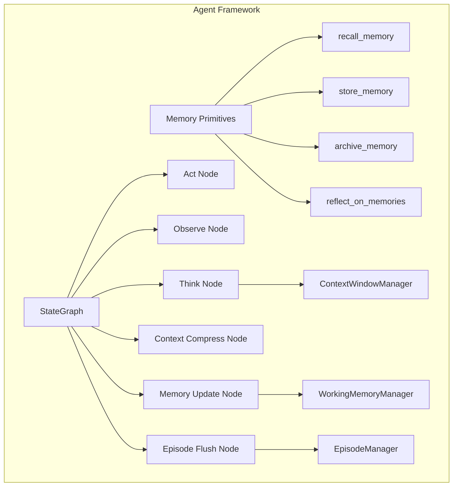
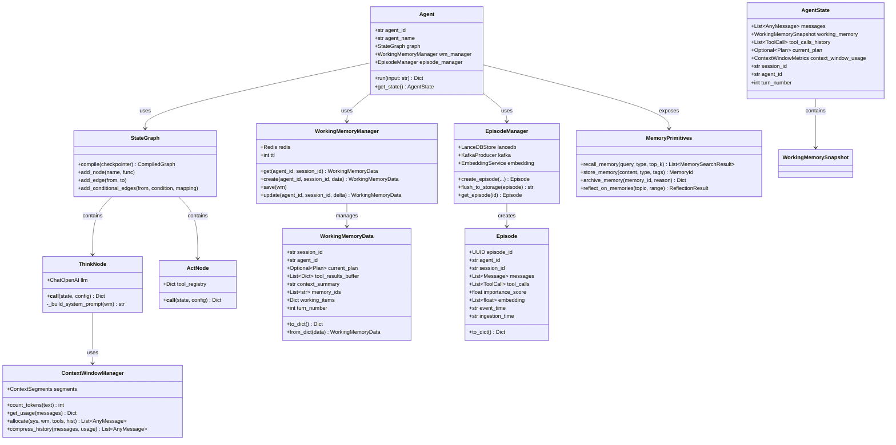
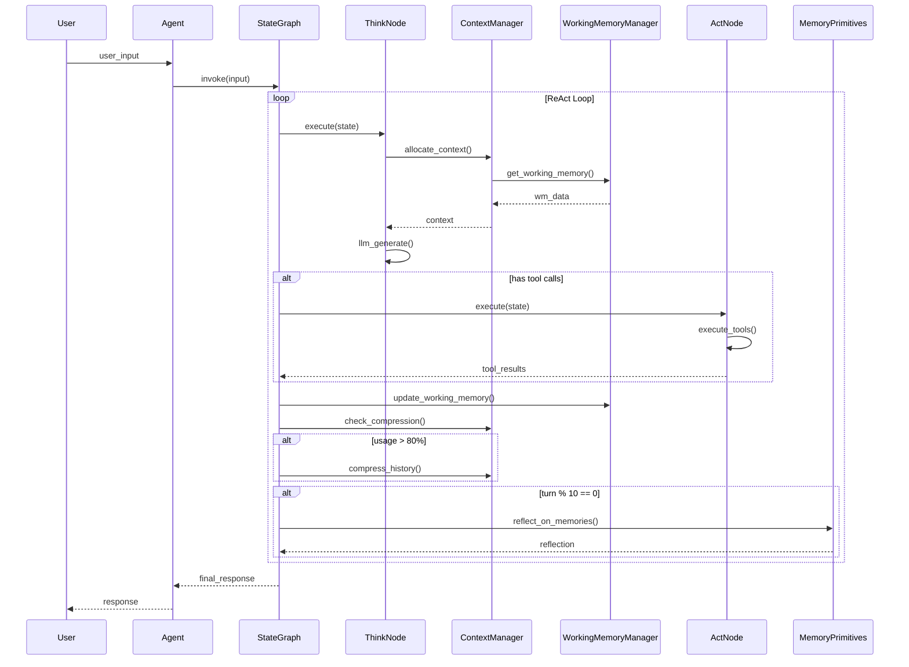
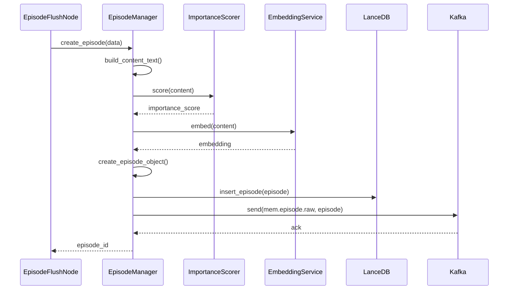

# 01-详细设计-Agent-Framework

## 1. 模块概述

### 1.1 设计目标

Agent Framework 是 Agentic Memory 系统的**运行时核心**，负责：
- 基于 LangGraph StateGraph 实现 ReAct 执行循环
- 上下文窗口管理（MemGPT-inspired OS 隐喻）
- Working Memory 生命周期管理
- Agent 自主记忆原语（recall/store/archive/reflect）
- Episode 生成与刷写

### 1.2 核心组件



---

## 2. LangGraph StateGraph 详细设计

### 2.1 AgentState 定义

```python
# agent_state.py
"""
Agent State 定义 - LangGraph StateGraph 核心
"""

from typing import TypedDict, Annotated, List, Optional, Any, Dict
from dataclasses import dataclass, field
from datetime import datetime
from enum import Enum

from langchain_core.messages import AnyMessage, SystemMessage, HumanMessage, AIMessage, ToolMessage
from langgraph.graph.message import add_messages


class ToolCall(TypedDict):
    """工具调用记录"""
    tool_name: str
    tool_input: Dict[str, Any]
    tool_output: Optional[str]
    latency_ms: float
    success: bool
    error: Optional[str]


class PlanStep(TypedDict):
    """计划步骤"""
    step_id: str
    description: str
    status: str  # 'pending', 'in_progress', 'completed', 'failed'
    tool_calls: List[ToolCall]


class Plan(TypedDict):
    """执行计划"""
    goal: str
    steps: List[PlanStep]
    current_step_index: int
    created_at: str


class ContextWindowMetrics(TypedDict):
    """上下文窗口使用指标"""
    total_tokens: int
    system_tokens: int
    working_memory_tokens: int
    tool_results_tokens: int
    history_tokens: int
    reserve_tokens: int
    usage_percentage: float


class WorkingMemorySnapshot(TypedDict):
    """Working Memory 快照"""
    current_plan: Optional[Plan]
    tool_results_buffer: List[Dict[str, Any]]
    context_summary: str
    loaded_memory_ids: List[str]
    working_items: Dict[str, Any]
    turn_number: int


class AgentState(TypedDict):
    """
    LangGraph StateGraph 状态定义

    这是 StateGraph 的核心状态对象，在节点间传递
    """
    # 消息历史（自动合并）
    messages: Annotated[List[AnyMessage], add_messages]

    # Working Memory 快照
    working_memory: WorkingMemorySnapshot

    # 工具调用历史
    tool_calls_history: List[ToolCall]

    # 当前计划
    current_plan: Optional[Plan]

    # 上下文窗口使用指标
    context_window_usage: ContextWindowMetrics

    # 会话标识
    session_id: str
    agent_id: str

    # 轮次计数
    turn_number: int

    # 错误记录
    errors: List[Dict[str, Any]]

    # 元数据（用于传递额外信息）
    metadata: Dict[str, Any]
```

### 2.2 StateGraph 节点定义

```python
# graph_nodes.py
"""
StateGraph 节点实现
"""

import json
import time
from typing import Dict, Any, Literal

from langchain_core.messages import SystemMessage, AIMessage, ToolMessage
from langchain_core.runnables import RunnableConfig
from langchain_openai import ChatOpenAI
from langgraph.types import Command

from agent_state import AgentState, ToolCall, Plan


class ThinkNode:
    """思考节点：生成推理和工具调用"""

    def __init__(self, llm: ChatOpenAI):
        self.llm = llm

    async def __call__(
        self,
        state: AgentState,
        config: RunnableConfig
    ) -> Dict[str, Any]:
        """
        思考节点逻辑

        1. 评估当前状态
        2. 决定下一步行动
        3. 生成工具调用或最终回复
        """
        messages = state["messages"]
        working_memory = state["working_memory"]

        # 构建系统提示
        system_prompt = self._build_system_prompt(working_memory)

        # 调用 LLM
        start_time = time.time()
        response = await self.llm.ainvoke(
            [SystemMessage(content=system_prompt)] + messages,
            config=config
        )
        latency_ms = (time.time() - start_time) * 1000

        # 解析响应（可能包含工具调用）
        ai_message = AIMessage(
            content=response.content,
            additional_kwargs=response.additional_kwargs
        )

        return {
            "messages": [ai_message],
            "metadata": {
                "think_latency_ms": latency_ms,
                "tokens_used": response.usage_metadata if hasattr(response, 'usage_metadata') else None
            }
        }

    def _build_system_prompt(self, working_memory: Dict[str, Any]) -> str:
        """构建系统提示，注入 Working Memory"""
        plan = working_memory.get("current_plan")
        context_summary = working_memory.get("context_summary", "")

        prompt = f"""你是一个智能 Agent，拥有以下 Working Memory：

当前计划：{json.dumps(plan, ensure_ascii=False) if plan else "暂无"}

上下文摘要：{context_summary}

你可以使用以下记忆原语：
- recall_memory(query, memory_type, top_k): 检索相关记忆
- store_memory(content, memory_type, metadata): 存储新记忆
- reflect_on_memories(topic, time_range): 对记忆进行反思

请根据当前状态决定下一步行动。如果需要调用工具，请使用工具调用格式。"""

        return prompt


class ActNode:
    """执行节点：执行工具调用"""

    def __init__(self, tool_registry: Dict[str, Any]):
        self.tool_registry = tool_registry

    async def __call__(
        self,
        state: AgentState,
        config: RunnableConfig
    ) -> Dict[str, Any]:
        """
        执行节点逻辑

        执行 AI 消息中的工具调用
        """
        last_message = state["messages"][-1]

        # 检查是否有工具调用
        if not hasattr(last_message, 'tool_calls') or not last_message.tool_calls:
            return {"messages": []}

        tool_results = []
        tool_calls_history = []

        for tool_call in last_message.tool_calls:
            tool_name = tool_call["name"]
            tool_args = tool_call["args"]
            tool_id = tool_call["id"]

            start_time = time.time()

            try:
                # 查找并执行工具
                if tool_name in self.tool_registry:
                    tool_func = self.tool_registry[tool_name]
                    result = await tool_func.ainvoke(tool_args)
                    success = True
                    error = None
                else:
                    result = f"Error: Unknown tool '{tool_name}'"
                    success = False
                    error = result

            except Exception as e:
                result = f"Error: {str(e)}"
                success = False
                error = str(e)

            latency_ms = (time.time() - start_time) * 1000

            # 创建 ToolMessage
            tool_message = ToolMessage(
                content=str(result),
                tool_call_id=tool_id,
                name=tool_name
            )
            tool_results.append(tool_message)

            # 记录到历史
            tool_calls_history.append(ToolCall(
                tool_name=tool_name,
                tool_input=tool_args,
                tool_output=str(result) if success else None,
                latency_ms=latency_ms,
                success=success,
                error=error
            ))

        return {
            "messages": tool_results,
            "tool_calls_history": tool_calls_history
        }


class ObserveNode:
    """观察节点：处理工具结果，更新状态"""

    async def __call__(
        self,
        state: AgentState,
        config: RunnableConfig
    ) -> Dict[str, Any]:
        """
        观察节点逻辑

        分析工具执行结果，决定是否继续或结束
        """
        # 获取最近的工具结果
        recent_tools = [
            msg for msg in reversed(state["messages"])
            if isinstance(msg, ToolMessage)
        ][:3]  # 最近 3 个

        # 更新 Working Memory 中的工具结果缓冲区
        working_memory = state["working_memory"]
        working_memory["tool_results_buffer"] = [
            {"tool": msg.name, "result": msg.content}
            for msg in recent_tools
        ]

        # 检查是否需要继续执行
        should_continue = self._should_continue(state)

        return {
            "working_memory": working_memory,
            "metadata": {
                "should_continue": should_continue,
                "observation": "Processed tool results"
            }
        }

    def _should_continue(self, state: AgentState) -> bool:
        """判断是否应该继续执行"""
        # 最大轮次检查
        if state["turn_number"] >= 50:
            return False

        # 检查最近的 AI 消息
        last_ai_message = None
        for msg in reversed(state["messages"]):
            if isinstance(msg, AIMessage):
                last_ai_message = msg
                break

        if not last_ai_message:
            return True

        # 如果没有工具调用，说明是最终回复
        if not hasattr(last_ai_message, 'tool_calls') or not last_ai_message.tool_calls:
            return False

        return True


class MemoryUpdateNode:
    """记忆更新节点：同步 Working Memory 到 Redis"""

    def __init__(self, working_memory_manager):
        self.wm_manager = working_memory_manager

    async def __call__(
        self,
        state: AgentState,
        config: RunnableConfig
    ) -> Dict[str, Any]:
        """更新 Working Memory 到存储"""
        agent_id = state["agent_id"]
        session_id = state["session_id"]

        # 增加轮次
        turn_number = state["turn_number"] + 1

        # 构建新的 Working Memory
        working_memory = state["working_memory"]
        working_memory["turn_number"] = turn_number

        # 更新上下文摘要（如果轮次是 5 的倍数）
        if turn_number % 5 == 0:
            working_memory["context_summary"] = await self._generate_summary(state)

        # 持久化到 Redis
        await self.wm_manager.update(agent_id, session_id, working_memory)

        return {
            "turn_number": turn_number,
            "working_memory": working_memory
        }

    async def _generate_summary(self, state: AgentState) -> str:
        """生成对话摘要"""
        # 简化实现，实际应调用 LLM
        return f"已完成 {state['turn_number']} 轮对话"


class ContextCompressNode:
    """上下文压缩节点：当上下文窗口使用率过高时触发"""

    def __init__(self, llm: ChatOpenAI, threshold: float = 0.8):
        self.llm = llm
        self.threshold = threshold

    async def __call__(
        self,
        state: AgentState,
        config: RunnableConfig
    ) -> Dict[str, Any]:
        """
        上下文压缩逻辑

        当使用率超过阈值时，压缩最旧的消息
        """
        usage = state["context_window_usage"]

        if usage["usage_percentage"] < self.threshold:
            return {}  # 不需要压缩

        messages = state["messages"]

        # 找到需要压缩的消息（系统消息后的最旧 N 条）
        compress_start = 1  # 跳过系统消息
        compress_end = min(compress_start + 4, len(messages) - 2)

        messages_to_compress = messages[compress_start:compress_end]

        # 生成摘要
        summary = await self._summarize_messages(messages_to_compress)

        # 替换为摘要消息
        compressed_messages = [
            messages[0],  # 系统消息
            SystemMessage(content=f"[Earlier conversation summary: {summary}]"),
            *messages[compress_end:]
        ]

        return {
            "messages": compressed_messages,
            "metadata": {
                "compressed": True,
                "compressed_count": len(messages_to_compress)
            }
        }

    async def _summarize_messages(self, messages: List[AnyMessage]) -> str:
        """使用 LLM 总结消息"""
        summary_prompt = "请总结以下对话内容：\n\n"
        for msg in messages:
            summary_prompt += f"{msg.type}: {msg.content}\n"

        response = await self.llm.ainvoke([HumanMessage(content=summary_prompt)])
        return response.content


class EpisodeFlushNode:
    """Episode 刷写节点：将 session 数据刷写到 Episode Store"""

    def __init__(self, episode_manager, kafka_producer):
        self.episode_manager = episode_manager
        self.kafka = kafka_producer

    async def __call__(
        self,
        state: AgentState,
        config: RunnableConfig
    ) -> Dict[str, Any]:
        """
        Episode 刷写逻辑

        在 session 结束或达到重要性阈值时触发
        """
        # 检查是否应该刷写
        should_flush = self._should_flush(state)

        if not should_flush:
            return {}

        # 构建 Episode
        episode = await self.episode_manager.create_episode(
            agent_id=state["agent_id"],
            session_id=state["session_id"],
            messages=state["messages"],
            tool_calls=state["tool_calls_history"],
            working_memory=state["working_memory"]
        )

        # 发送到 Kafka
        await self.kafka.send("mem.episode.raw", episode)

        return {
            "metadata": {
                "episode_flushed": True,
                "episode_id": episode["episode_id"]
            }
        }

    def _should_flush(self, state: AgentState) -> bool:
        """判断是否应该刷写 Episode"""
        # 简单策略：每 10 轮或会话结束
        if state["turn_number"] % 10 == 0:
            return True

        # 检查是否有结束标记
        if state["metadata"].get("session_ending"):
            return True

        return False
```

### 2.3 完整的 StateGraph 构建

```python
# agent_graph.py
"""
LangGraph StateGraph 构建与编译
"""

from typing import Literal
from langgraph.graph import StateGraph, END
from langgraph.checkpoint.memory import MemorySaver

from agent_state import AgentState
from graph_nodes import (
    ThinkNode, ActNode, ObserveNode,
    MemoryUpdateNode, ContextCompressNode, EpisodeFlushNode
)


def build_agent_graph(
    llm,
    tool_registry,
    working_memory_manager,
    episode_manager,
    kafka_producer
) -> StateGraph:
    """
    构建 Agent StateGraph

    Args:
        llm: 语言模型实例
        tool_registry: 工具注册表
        working_memory_manager: Working Memory 管理器
        episode_manager: Episode 管理器
        kafka_producer: Kafka 生产者

    Returns:
        编译后的 StateGraph
    """

    # 初始化节点
    think_node = ThinkNode(llm)
    act_node = ActNode(tool_registry)
    observe_node = ObserveNode()
    memory_update_node = MemoryUpdateNode(working_memory_manager)
    context_compress_node = ContextCompressNode(llm)
    episode_flush_node = EpisodeFlushNode(episode_manager, kafka_producer)

    # 构建图
    workflow = StateGraph(AgentState)

    # 添加节点
    workflow.add_node("think", think_node)
    workflow.add_node("act", act_node)
    workflow.add_node("observe", observe_node)
    workflow.add_node("memory_update", memory_update_node)
    workflow.add_node("context_compress", context_compress_node)
    workflow.add_node("episode_flush", episode_flush_node)

    # 设置入口点
    workflow.set_entry_point("think")

    # 定义边
    workflow.add_edge("think", "act")
    workflow.add_edge("act", "observe")
    workflow.add_edge("observe", "memory_update")
    workflow.add_edge("memory_update", "context_compress")
    workflow.add_edge("context_compress", "episode_flush")

    # 条件边：根据 should_continue 决定循环或结束
    def should_continue(state: AgentState) -> Literal["think", "end"]:
        """判断是否继续执行"""
        metadata = state.get("metadata", {})
        if metadata.get("should_continue", True):
            return "think"
        return END

    workflow.add_conditional_edges(
        "episode_flush",
        should_continue,
        {
            "think": "think",
            END: END
        }
    )

    # 添加检查点（用于持久化状态）
    checkpointer = MemorySaver()

    # 编译图
    graph = workflow.compile(checkpointer=checkpointer)

    return graph


# 图的可视化（Mermaid）
GRAPH_MERMAID = """
flowchart TD
    Start([开始]) --> Think[思考节点<br/>生成推理/工具调用]
    Think --> Act[执行节点<br/>执行工具调用]
    Act --> Observe[观察节点<br/>处理结果]
    Observe --> MemoryUpdate[记忆更新节点<br/>更新 Working Memory]
    MemoryUpdate --> ContextCompress[上下文压缩节点<br/>必要时压缩]
    ContextCompress --> EpisodeFlush[Episode刷写节点<br/>持久化记忆]

    EpisodeFlush --> Continue{继续?}
    Continue -->|是| Think
    Continue -->|否| End([结束])
"""
```

---

## 3. Context Manager 详细设计

### 3.1 上下文窗口分区

```
+--------------------------------------------------+
|               Context Window (128K tokens)       |
+--------------------------------------------------+
| System Segment        | ~1000 tokens | 固定      |
+--------------------------------------------------+
| Working Memory        | ~2000 tokens | 动态      |
+--------------------------------------------------+
| Tool Results Buffer   | ~4000 tokens | 动态      |
+--------------------------------------------------+
| Conversation History  | ~5000 tokens | 可压缩    |
+--------------------------------------------------+
| Reserve               | ~7000 tokens | 保留      |
+--------------------------------------------------+
```

### 3.2 ContextWindowManager 实现

```python
# context_manager.py
"""
上下文窗口管理器 - MemGPT-inspired OS 隐喻
"""

from typing import List, Dict, Any, Optional
from dataclasses import dataclass

from langchain_core.messages import AnyMessage, SystemMessage, HumanMessage, AIMessage
import tiktoken


@dataclass
class ContextSegments:
    """上下文分区配置"""
    system_tokens: int = 1000
    working_memory_tokens: int = 2000
    tool_results_tokens: int = 4000
    history_tokens: int = 5000
    reserve_tokens: int = 7000
    total_tokens: int = 20000  # 默认 20K，可配置到 128K


class ContextWindowManager:
    """
    上下文窗口管理器

    实现 MemGPT 的 OS 隐喻，将上下文窗口划分为不同段
    """

    def __init__(
        self,
        model_name: str = "gpt-4",
        segments: Optional[ContextSegments] = None
    ):
        self.segments = segments or ContextSegments()
        self.encoder = tiktoken.encoding_for_model(model_name)

    def count_tokens(self, text: str) -> int:
        """计算文本的 token 数"""
        return len(self.encoder.encode(text))

    def count_message_tokens(self, message: AnyMessage) -> int:
        """计算消息的 token 数"""
        # 简单的估算，实际应考虑消息格式开销
        content = message.content if hasattr(message, 'content') else str(message)
        return self.count_tokens(content) + 4  # 格式开销

    def get_usage(self, messages: List[AnyMessage]) -> Dict[str, Any]:
        """
        计算上下文窗口使用情况

        Returns:
            包含各部分使用情况的字典
        """
        total_tokens = 0
        system_tokens = 0
        working_memory_tokens = 0
        tool_results_tokens = 0
        history_tokens = 0

        for msg in messages:
            tokens = self.count_message_tokens(msg)
            total_tokens += tokens

            # 分类统计
            if isinstance(msg, SystemMessage):
                if "Working Memory" in msg.content:
                    working_memory_tokens += tokens
                else:
                    system_tokens += tokens
            elif isinstance(msg, ToolMessage) or "tool" in str(msg.type).lower():
                tool_results_tokens += tokens
            else:
                history_tokens += tokens

        usage_percentage = total_tokens / self.segments.total_tokens

        return {
            "total_tokens": total_tokens,
            "system_tokens": system_tokens,
            "working_memory_tokens": working_memory_tokens,
            "tool_results_tokens": tool_results_tokens,
            "history_tokens": history_tokens,
            "reserve_tokens": self.segments.total_tokens - total_tokens,
            "usage_percentage": usage_percentage
        }

    def needs_compression(self, usage: Dict[str, Any], threshold: float = 0.8) -> bool:
        """判断是否需要压缩"""
        return usage["usage_percentage"] > threshold

    def allocate(
        self,
        system_prompt: str,
        working_memory: Dict[str, Any],
        tool_results: List[Dict[str, Any]],
        history: List[AnyMessage]
    ) -> List[AnyMessage]:
        """
        分配上下文窗口

        将不同内容放入对应的分区
        """
        messages = []

        # 1. System Segment
        messages.append(SystemMessage(content=system_prompt))

        # 2. Working Memory Segment
        wm_content = self._format_working_memory(working_memory)
        if wm_content:
            messages.append(SystemMessage(content=f"[Working Memory]\n{wm_content}"))

        # 3. Tool Results Buffer（最近的结果放在前面）
        for result in reversed(tool_results[-5:]):  # 只保留最近 5 个
            content = f"[Tool Result: {result['tool']}]\n{result['result']}"
            messages.append(SystemMessage(content=content))

        # 4. Conversation History
        messages.extend(history)

        # 检查是否超出限制
        usage = self.get_usage(messages)
        if usage["total_tokens"] > self.segments.total_tokens:
            # 压缩历史
            messages = self.compress_history(messages, usage)

        return messages

    def _format_working_memory(self, working_memory: Dict[str, Any]) -> str:
        """格式化 Working Memory"""
        parts = []

        if "current_plan" in working_memory:
            plan = working_memory["current_plan"]
            parts.append(f"Current Plan: {plan.get('goal', 'N/A')}")

        if "context_summary" in working_memory:
            parts.append(f"Context: {working_memory['context_summary']}")

        return "\n".join(parts)

    def compress_history(
        self,
        messages: List[AnyMessage],
        usage: Dict[str, Any]
    ) -> List[AnyMessage]:
        """
        压缩历史消息

        策略：
        1. 保留系统消息
        2. 将最旧的非系统消息替换为摘要
        3. 保留最新的消息
        """
        # 分离系统消息和对话消息
        system_messages = [m for m in messages if isinstance(m, SystemMessage)]
        conversation = [m for m in messages if not isinstance(m, SystemMessage)]

        # 保留最近的消息
        keep_recent = 4  # 保留最近 2 轮（4 条消息）
        to_compress = conversation[:-keep_recent]
        recent = conversation[-keep_recent:]

        if not to_compress:
            return messages

        # 生成摘要（简化实现）
        summary = f"[Earlier: {len(to_compress)} messages summarized]"

        # 重组消息
        compressed = [
            *system_messages,
            SystemMessage(content=summary),
            *recent
        ]

        return compressed

    def evict_tool_results(
        self,
        messages: List[AnyMessage],
        keep_recent: int = 3
    ) -> List[AnyMessage]:
        """
        驱逐旧的工具结果

        当工具结果区过满时，只保留最近的
        """
        result = []
        tool_result_count = 0

        # 从后往前遍历
        for msg in reversed(messages):
            if "[Tool Result:" in str(msg.content):
                tool_result_count += 1
                if tool_result_count <= keep_recent:
                    result.append(msg)
            else:
                result.append(msg)

        return list(reversed(result))
```

---

## 4. Working Memory 详细设计

### 4.1 Redis 数据结构

```python
# working_memory_schema.py
"""
Working Memory Redis Schema
"""

from typing import Dict, Any, List, Optional
from dataclasses import dataclass, asdict
from datetime import datetime
import json


@dataclass
class WorkingMemoryData:
    """Working Memory 数据结构"""
    session_id: str
    agent_id: str
    current_plan: Optional[Dict[str, Any]] = None
    tool_results_buffer: List[Dict[str, Any]] = None
    context_summary: str = ""
    memory_ids: List[str] = None
    working_items: Dict[str, Any] = None
    turn_number: int = 0
    created_at: str = None
    updated_at: str = None
    metadata: Dict[str, Any] = None

    def __post_init__(self):
        if self.tool_results_buffer is None:
            self.tool_results_buffer = []
        if self.memory_ids is None:
            self.memory_ids = []
        if self.working_items is None:
            self.working_items = {}
        if self.created_at is None:
            self.created_at = datetime.utcnow().isoformat()
        if self.updated_at is None:
            self.updated_at = self.created_at
        if self.metadata is None:
            self.metadata = {}

    def to_dict(self) -> Dict[str, str]:
        """转换为 Redis Hash 格式"""
        return {
            "session_id": self.session_id,
            "agent_id": self.agent_id,
            "current_plan": json.dumps(self.current_plan) if self.current_plan else "",
            "tool_results_buffer": json.dumps(self.tool_results_buffer),
            "context_summary": self.context_summary,
            "memory_ids": json.dumps(self.memory_ids),
            "working_items": json.dumps(self.working_items),
            "turn_number": str(self.turn_number),
            "created_at": self.created_at,
            "updated_at": self.updated_at,
            "metadata": json.dumps(self.metadata)
        }

    @classmethod
    def from_dict(cls, data: Dict[str, str]) -> "WorkingMemoryData":
        """从 Redis Hash 解析"""
        return cls(
            session_id=data.get("session_id", ""),
            agent_id=data.get("agent_id", ""),
            current_plan=json.loads(data["current_plan"]) if data.get("current_plan") else None,
            tool_results_buffer=json.loads(data.get("tool_results_buffer", "[]")),
            context_summary=data.get("context_summary", ""),
            memory_ids=json.loads(data.get("memory_ids", "[]")),
            working_items=json.loads(data.get("working_items", "{}")),
            turn_number=int(data.get("turn_number", 0)),
            created_at=data.get("created_at"),
            updated_at=data.get("updated_at"),
            metadata=json.loads(data.get("metadata", "{}"))
        )
```

### 4.2 WorkingMemoryManager 实现

```python
# working_memory_manager.py
"""
Working Memory 管理器
"""

import json
from typing import Optional, Dict, Any
from datetime import datetime

import redis.asyncio as redis

from working_memory_schema import WorkingMemoryData


class WorkingMemoryManager:
    """
    Working Memory 管理器

    使用 Redis Hash 存储，支持 TTL
    """

    def __init__(
        self,
        redis_client: redis.Redis,
        default_ttl: int = 86400  # 24h
    ):
        self.redis = redis_client
        self.ttl = default_ttl
        self.key_prefix = "wm"

    def _key(self, agent_id: str, session_id: str) -> str:
        """生成 Redis Key"""
        return f"{self.key_prefix}:{agent_id}:{session_id}"

    async def get(
        self,
        agent_id: str,
        session_id: str
    ) -> Optional[WorkingMemoryData]:
        """
        获取 Working Memory

        Returns:
            WorkingMemoryData 或 None（不存在时）
        """
        key = self._key(agent_id, session_id)
        data = await self.redis.hgetall(key)

        if not data:
            return None

        # 解码 bytes
        decoded = {k.decode() if isinstance(k, bytes) else k:
                   v.decode() if isinstance(v, bytes) else v
                   for k, v in data.items()}

        return WorkingMemoryData.from_dict(decoded)

    async def create(
        self,
        agent_id: str,
        session_id: str,
        initial_data: Optional[Dict[str, Any]] = None
    ) -> WorkingMemoryData:
        """
        创建新的 Working Memory
        """
        wm = WorkingMemoryData(
            session_id=session_id,
            agent_id=agent_id,
            **(initial_data or {})
        )

        await self.save(wm)
        return wm

    async def save(self, wm: WorkingMemoryData) -> None:
        """
        保存 Working Memory
        """
        key = self._key(wm.agent_id, wm.session_id)
        wm.updated_at = datetime.utcnow().isoformat()

        # 使用 HMSET 保存
        data = wm.to_dict()
        await self.redis.hset(key, mapping=data)

        # 设置 TTL
        await self.redis.expire(key, self.ttl)

    async def update(
        self,
        agent_id: str,
        session_id: str,
        delta: Dict[str, Any]
    ) -> WorkingMemoryData:
        """
        更新 Working Memory（增量更新）
        """
        wm = await self.get(agent_id, session_id)

        if wm is None:
            wm = WorkingMemoryData(session_id=session_id, agent_id=agent_id)

        # 应用更新
        for key, value in delta.items():
            if hasattr(wm, key):
                setattr(wm, key, value)

        await self.save(wm)
        return wm

    async def delete(self, agent_id: str, session_id: str) -> bool:
        """
        删除 Working Memory
        """
        key = self._key(agent_id, session_id)
        result = await self.redis.delete(key)
        return result > 0

    async def clear(self, agent_id: str, session_id: str) -> None:
        """
        清空 Working Memory（保留空结构）
        """
        await self.delete(agent_id, session_id)
        await self.create(agent_id, session_id)

    async def exists(self, agent_id: str, session_id: str) -> bool:
        """检查是否存在"""
        key = self._key(agent_id, session_id)
        return await self.redis.exists(key) > 0

    async def get_ttl(self, agent_id: str, session_id: str) -> int:
        """获取剩余 TTL"""
        key = self._key(agent_id, session_id)
        return await self.redis.ttl(key)

    async def extend_ttl(self, agent_id: str, session_id: str) -> None:
        """延长 TTL"""
        key = self._key(agent_id, session_id)
        await self.redis.expire(key, self.ttl)
```

---

## 5. Memory Primitives（自主记忆原语）

### 5.1 原语定义

```python
# memory_primitives.py
"""
Agent 自主记忆原语 - 赋予 Agent 主动管理记忆的能力
"""

from typing import List, Dict, Any, Optional
from dataclasses import dataclass
from enum import Enum

from langchain_core.tools import StructuredTool
from pydantic import BaseModel, Field


class MemoryType(str, Enum):
    """记忆类型"""
    EPISODE = "episode"
    SKILL = "skill"
    KNOWLEDGE = "knowledge"
    WORKING = "working"


class MemorySearchResult(BaseModel):
    """记忆搜索结果"""
    memory_id: str
    content: str
    score: float
    memory_type: MemoryType
    metadata: Dict[str, Any]


class MemoryId(BaseModel):
    """记忆 ID 响应"""
    memory_id: str
    status: str


# ============================================
# 原语 1: recall_memory
# ============================================

class RecallMemoryInput(BaseModel):
    """recall_memory 输入参数"""
    query: str = Field(description="搜索查询")
    memory_type: Optional[MemoryType] = Field(
        default=None,
        description="记忆类型筛选（可选）"
    )
    top_k: int = Field(default=5, description="返回结果数量")
    time_range_days: Optional[int] = Field(
        default=None,
        description="时间范围（天）"
    )


async def recall_memory(
    query: str,
    memory_type: Optional[MemoryType] = None,
    top_k: int = 5,
    time_range_days: Optional[int] = None,
    memory_gateway=None  # 注入的依赖
) -> List[MemorySearchResult]:
    """
    检索记忆

    Agent 调用此原语主动检索相关记忆
    """
    results = await memory_gateway.search(
        query=query,
        memory_types=[memory_type] if memory_type else None,
        top_k=top_k,
        filters={"time_range_days": time_range_days} if time_range_days else None
    )

    return [
        MemorySearchResult(
            memory_id=r["id"],
            content=r["content"],
            score=r["score"],
            memory_type=r["type"],
            metadata=r.get("metadata", {})
        )
        for r in results
    ]


recall_memory_tool = StructuredTool(
    name="recall_memory",
    description="""检索 Agent 的记忆存储。

当需要回忆过去的事件、知识或技能时使用此工具。
可以指定记忆类型来缩小搜索范围。

示例：
- recall_memory("我之前如何处理类似的错误？", memory_type="episode")
- recall_memory("Python 文件操作", top_k=3)
""",
    func=recall_memory,
    args_schema=RecallMemoryInput
)


# ============================================
# 原语 2: store_memory
# ============================================

class StoreMemoryInput(BaseModel):
    """store_memory 输入参数"""
    content: str = Field(description="要存储的内容")
    memory_type: MemoryType = Field(description="记忆类型")
    tags: Optional[List[str]] = Field(default=None, description="标签")
    importance_hint: Optional[int] = Field(
        default=None,
        description="重要性提示 (1-10)"
    )


async def store_memory(
    content: str,
    memory_type: MemoryType,
    tags: Optional[List[str]] = None,
    importance_hint: Optional[int] = None,
    memory_gateway=None,
    agent_id: str = "",
    session_id: str = ""
) -> MemoryId:
    """
    存储记忆

    Agent 调用此原语将重要信息持久化
    """
    result = await memory_gateway.write(
        content=content,
        layer=memory_type,
        metadata={
            "tags": tags or [],
            "importance_hint": importance_hint,
            "agent_id": agent_id,
            "session_id": session_id
        }
    )

    return MemoryId(memory_id=result["id"], status="stored")


store_memory_tool = StructuredTool(
    name="store_memory",
    description="""将重要信息存储到记忆中。

当你学到新知识、完成重要任务或产生有价值的洞察时使用此工具。

示例：
- store_memory("用户偏好使用 Python 进行数据分析", memory_type="knowledge", tags=["user_preference"])
- store_memory("成功解决连接超时问题的方法...", memory_type="episode")
""",
    func=store_memory,
    args_schema=StoreMemoryInput
)


# ============================================
# 原语 3: archive_memory
# ============================================

class ArchiveMemoryInput(BaseModel):
    """archive_memory 输入参数"""
    memory_id: str = Field(description="要归档的记忆 ID")
    reason: Optional[str] = Field(default=None, description="归档原因")


async def archive_memory(
    memory_id: str,
    reason: Optional[str] = None,
    memory_gateway = None
) -> Dict[str, str]:
    """
    归档记忆

    将不再需要的记忆归档（软删除）
    """
    await memory_gateway.archive(memory_id, reason=reason)
    return {"status": "archived", "memory_id": memory_id}


archive_memory_tool = StructuredTool(
    name="archive_memory",
    description="""归档不再需要的记忆。

当确定某条记忆已过时或不再需要时，使用此工具将其归档。
归档后的记忆不会出现在搜索结果中，但仍可恢复。

示例：
- archive_memory("mem_123", reason="信息已过时")
""",
    func=archive_memory,
    args_schema=ArchiveMemoryInput
)


# ============================================
# 原语 4: reflect_on_memories
# ============================================

class ReflectionResult(BaseModel):
    """反思结果"""
    reflection_id: str
    insights: List[str]
    suggested_actions: List[str]
    confidence: float


class ReflectOnMemoriesInput(BaseModel):
    """reflect_on_memories 输入参数"""
    topic: str = Field(description="反思主题")
    time_range_days: Optional[int] = Field(
        default=30,
        description="回顾的时间范围"
    )
    memory_types: Optional[List[MemoryType]] = Field(
        default=None,
        description="要反思的记忆类型"
    )


async def reflect_on_memories(
    topic: str,
    time_range_days: int = 30,
    memory_types: Optional[List[MemoryType]] = None,
    memory_gateway = None,
    llm = None
) -> ReflectionResult:
    """
    对记忆进行反思

    Agent 调用此原语从过去的经历中提取模式和洞察
    """
    # 检索相关记忆
    memories = await memory_gateway.search(
        query=topic,
        memory_types=memory_types,
        top_k=20,
        filters={"time_range_days": time_range_days}
    )

    # 构建反思提示
    memory_texts = "\n\n".join([
        f"[{m['type']}] {m['content'][:500]}..."
        for m in memories
    ])

    reflection_prompt = f"""基于以下记忆，对主题"{topic}"进行反思：

{memory_texts}

请生成：
1. 3-5 条关键洞察
2. 2-3 条建议行动
3. 对反思质量的信心分数 (0-1)

以 JSON 格式输出：
{{
    "insights": [...],
    "suggested_actions": [...],
    "confidence": 0.85
}}
"""

    # 调用 LLM
    response = await llm.ainvoke([HumanMessage(content=reflection_prompt)])

    # 解析响应
    try:
        result = json.loads(response.content)
    except:
        result = {
            "insights": ["解析反思结果失败"],
            "suggested_actions": [],
            "confidence": 0.0
        }

    return ReflectionResult(
        reflection_id=f"refl_{uuid.uuid4().hex[:8]}",
        insights=result.get("insights", []),
        suggested_actions=result.get("suggested_actions", []),
        confidence=result.get("confidence", 0.0)
    )


reflect_on_memories_tool = StructuredTool(
    name="reflect_on_memories",
    description="""对过去的记忆进行反思，提取模式和洞察。

当你需要总结经验教训、发现模式或获得更高层次的理解时使用此工具。

示例：
- reflect_on_memories("我在处理数据库问题时经常犯什么错误？", time_range_days=30)
- reflect_on_memories("用户最常询问的功能是什么？", memory_types=["episode"])
""",
    func=reflect_on_memories,
    args_schema=ReflectOnMemoriesInput
)


# ============================================
# 工具注册表
# ============================================

def get_memory_primitives(memory_gateway, llm):
    """
    获取所有记忆原语工具

    Returns:
        工具列表，可直接传递给 LangChain
    """
    # 创建带依赖注入的工具实例
    tools = [
        StructuredTool(
            name="recall_memory",
            description=recall_memory_tool.description,
            func=lambda **kwargs: recall_memory(**kwargs, memory_gateway=memory_gateway),
            args_schema=RecallMemoryInput
        ),
        StructuredTool(
            name="store_memory",
            description=store_memory_tool.description,
            func=lambda **kwargs: store_memory(**kwargs, memory_gateway=memory_gateway),
            args_schema=StoreMemoryInput
        ),
        StructuredTool(
            name="archive_memory",
            description=archive_memory_tool.description,
            func=lambda **kwargs: archive_memory(**kwargs, memory_gateway=memory_gateway),
            args_schema=ArchiveMemoryInput
        ),
        StructuredTool(
            name="reflect_on_memories",
            description=reflect_on_memories_tool.description,
            func=lambda **kwargs: reflect_on_memories(
                **kwargs,
                memory_gateway=memory_gateway,
                llm=llm
            ),
            args_schema=ReflectOnMemoriesInput
        )
    ]

    return tools
```

---

## 6. Episode 生命周期管理

### 6.1 Episode 数据结构

```python
# episode_schema.py
"""
Episode 数据结构定义
"""

from typing import List, Dict, Any, Optional
from dataclasses import dataclass, field, asdict
from datetime import datetime
from enum import Enum
import uuid


class EpisodeType(str, Enum):
    """Episode 类型"""
    CONVERSATION = "conversation"
    TASK = "task"
    ERROR = "error"
    LEARNING = "learning"
    WORKFLOW = "workflow"


@dataclass
class Message:
    """消息"""
    role: str  # 'system', 'user', 'assistant', 'tool'
    content: str
    timestamp: str
    metadata: Dict[str, Any] = field(default_factory=dict)


@dataclass
class ToolCall:
    """工具调用记录"""
    tool_name: str
    tool_input: Dict[str, Any]
    tool_output: Optional[str]
    latency_ms: float
    success: bool
    error: Optional[str] = None


@dataclass
class Episode:
    """
    Episode 数据结构

    代表一个完整的交互会话或任务执行
    """
    # 标识
    episode_id: str = field(default_factory=lambda: str(uuid.uuid4()))
    agent_id: str = ""
    session_id: str = ""

    # 内容
    messages: List[Message] = field(default_factory=list)
    tool_calls: List[ToolCall] = field(default_factory=list)

    # 分类
    episode_type: EpisodeType = EpisodeType.CONVERSATION
    tags: List[str] = field(default_factory=list)

    # 质量评分
    importance_score: float = 5.0  # 1-10
    embedding: Optional[List[float]] = None

    # 时间戳（双时间模型）
    event_time: str = field(default_factory=lambda: datetime.utcnow().isoformat())
    ingestion_time: Optional[str] = None

    # 上下文
    initial_goal: Optional[str] = None
    outcome_summary: Optional[str] = None

    # 关联
    related_episode_ids: List[str] = field(default_factory=list)
    extracted_skill_ids: List[str] = field(default_factory=list)

    # 反思
    reflections: List[str] = field(default_factory=list)

    # 状态
    is_archived: bool = False
    archive_reason: Optional[str] = None

    # 元数据
    metadata: Dict[str, Any] = field(default_factory=dict)

    def to_dict(self) -> Dict[str, Any]:
        """转换为字典"""
        return asdict(self)

    @classmethod
    def from_dict(cls, data: Dict[str, Any]) -> "Episode":
        """从字典创建"""
        # 处理嵌套对象
        if "messages" in data:
            data["messages"] = [Message(**m) for m in data["messages"]]
        if "tool_calls" in data:
            data["tool_calls"] = [ToolCall(**t) for t in data["tool_calls"]]
        return cls(**data)
```

### 6.2 EpisodeManager 实现

```python
# episode_manager.py
"""
Episode 管理器
"""

from typing import List, Optional, Dict, Any
from datetime import datetime

from episode_schema import Episode, Message, ToolCall, EpisodeType
from embedding_service import EmbeddingService


class EpisodeManager:
    """
    Episode 管理器

    负责 Episode 的创建、存储和检索
    """

    def __init__(
        self,
        lancedb_store,
        kafka_producer,
        embedding_service: EmbeddingService,
        importance_scorer
    ):
        self.lancedb = lancedb_store
        self.kafka = kafka_producer
        self.embedding = embedding_service
        self.importance_scorer = importance_scorer

    async def create_episode(
        self,
        agent_id: str,
        session_id: str,
        messages: List[Any],
        tool_calls: List[Dict],
        working_memory: Dict[str, Any]
    ) -> Episode:
        """
        从 session 数据创建 Episode
        """
        # 转换消息格式
        episode_messages = [
            Message(
                role=msg.type if hasattr(msg, 'type') else msg.get('role', 'unknown'),
                content=msg.content if hasattr(msg, 'content') else msg.get('content', ''),
                timestamp=datetime.utcnow().isoformat(),
                metadata={"tool_calls": msg.tool_calls} if hasattr(msg, 'tool_calls') else {}
            )
            for msg in messages
        ]

        # 转换工具调用
        episode_tool_calls = [
            ToolCall(
                tool_name=tc.get("tool_name", ""),
                tool_input=tc.get("tool_input", {}),
                tool_output=tc.get("tool_output"),
                latency_ms=tc.get("latency_ms", 0),
                success=tc.get("success", True),
                error=tc.get("error")
            )
            for tc in tool_calls
        ]

        # 构建内容文本（用于向量化）
        content_text = self._build_content_text(episode_messages, episode_tool_calls)

        # 计算重要性评分
        importance = await self.importance_scorer.score(
            content=content_text,
            tool_calls=episode_tool_calls
        )

        # 生成嵌入
        embedding = await self.embedding.embed(content_text)

        # 创建 Episode
        episode = Episode(
            agent_id=agent_id,
            session_id=session_id,
            messages=episode_messages,
            tool_calls=episode_tool_calls,
            episode_type=self._classify_episode(episode_messages, tool_calls),
            importance_score=importance,
            embedding=embedding,
            initial_goal=working_memory.get("current_plan", {}).get("goal"),
            ingestion_time=datetime.utcnow().isoformat()
        )

        return episode

    def _build_content_text(
        self,
        messages: List[Message],
        tool_calls: List[ToolCall]
    ) -> str:
        """构建 Episode 内容文本"""
        parts = []

        for msg in messages:
            if msg.role in ['user', 'assistant']:
                parts.append(f"{msg.role.upper()}: {msg.content[:500]}")

        if tool_calls:
            parts.append(f"\n[Tools used: {', '.join(tc.tool_name for tc in tool_calls)}]")

        return "\n\n".join(parts)

    def _classify_episode(
        self,
        messages: List[Message],
        tool_calls: List[ToolCall]
    ) -> EpisodeType:
        """自动分类 Episode 类型"""
        # 检查是否有错误
        if any(not tc.success for tc in tool_calls):
            return EpisodeType.ERROR

        # 检查是否有学习相关内容
        content = " ".join(m.content for m in messages)
        if any(kw in content.lower() for kw in ['learned', 'discovered', 'figured out']):
            return EpisodeType.LEARNING

        # 检查是否完成任务
        if any(kw in content.lower() for kw in ['completed', 'finished', 'done']):
            return EpisodeType.TASK

        return EpisodeType.CONVERSATION

    async def flush_to_storage(self, episode: Episode) -> str:
        """
        将 Episode 刷写到存储层
        """
        # 1. 保存到 LanceDB
        await self.lancedb.insert_episode(episode)

        # 2. 发送到 Kafka 触发后续处理
        await self.kafka.send(
            topic="mem.episode.raw",
            key=episode.episode_id,
            value=episode.to_dict()
        )

        return episode.episode_id

    async def get_episode(self, episode_id: str) -> Optional[Episode]:
        """获取 Episode"""
        data = await self.lancedb.get_by_id(episode_id)
        if data:
            return Episode.from_dict(data)
        return None

    async def search_episodes(
        self,
        query: str,
        agent_id: Optional[str] = None,
        top_k: int = 10
    ) -> List[Episode]:
        """搜索 Episode"""
        embedding = await self.embedding.embed(query)

        results = await self.lancedb.search_similar(
            query_embedding=embedding,
            top_k=top_k,
            agent_id=agent_id
        )

        return [Episode.from_dict(r) for r in results]
```

---

## 7. UML 类图



---

## 8. UML 时序图

### 8.1 Agent 执行循环



### 8.2 Episode 刷写流程



---

## 9. 单元测试用例

```python
# test_agent_framework.py
"""
Agent Framework 单元测试
"""

import pytest
from unittest.mock import Mock, AsyncMock, patch
from datetime import datetime

from agent_state import AgentState, WorkingMemorySnapshot
from working_memory_manager import WorkingMemoryManager
from context_manager import ContextWindowManager
from graph_nodes import ThinkNode, ActNode, ObserveNode
from episode_manager import EpisodeManager


# ============================================
# Fixtures
# ============================================

@pytest.fixture
def mock_redis():
    """Mock Redis"""
    redis = Mock()
    redis.hgetall = AsyncMock(return_value={})
    redis.hset = AsyncMock()
    redis.expire = AsyncMock()
    return redis


@pytest.fixture
def mock_llm():
    """Mock LLM"""
    llm = Mock()
    llm.ainvoke = AsyncMock(return_value=Mock(
        content="Test response",
        usage_metadata={"total_tokens": 100}
    ))
    return llm


@pytest.fixture
def wm_manager(mock_redis):
    """Working Memory Manager fixture"""
    return WorkingMemoryManager(mock_redis, default_ttl=3600)


# ============================================
# WorkingMemoryManager 测试
# ============================================

@pytest.mark.asyncio
async def test_wm_create(wm_manager, mock_redis):
    """测试 Working Memory 创建"""
    wm = await wm_manager.create("agent_1", "session_1")

    assert wm.agent_id == "agent_1"
    assert wm.session_id == "session_1"
    assert wm.turn_number == 0
    mock_redis.hset.assert_called_once()


@pytest.mark.asyncio
async def test_wm_get_existing(wm_manager, mock_redis):
    """测试获取已存在的 Working Memory"""
    mock_redis.hgetall = AsyncMock(return_value={
        b"session_id": b"session_1",
        b"agent_id": b"agent_1",
        b"turn_number": b"5",
        b"context_summary": b"Test summary",
        b"tool_results_buffer": b"[]",
        b"memory_ids": b"[]",
        b"working_items": b"{}",
        b"created_at": b"2026-03-23T10:00:00",
        b"updated_at": b"2026-03-23T10:00:00",
        b"metadata": b"{}"
    })

    wm = await wm_manager.get("agent_1", "session_1")

    assert wm is not None
    assert wm.turn_number == 5
    assert wm.context_summary == "Test summary"


@pytest.mark.asyncio
async def test_wm_update(wm_manager, mock_redis):
    """测试 Working Memory 更新"""
    mock_redis.hgetall = AsyncMock(return_value={
        b"session_id": b"session_1",
        b"agent_id": b"agent_1",
        b"turn_number": b"0",
        b"tool_results_buffer": b"[]",
        b"memory_ids": b"[]",
        b"working_items": b"{}",
        b"created_at": b"2026-03-23T10:00:00",
        b"updated_at": b"2026-03-23T10:00:00",
        b"metadata": b"{}"
    })

    wm = await wm_manager.update("agent_1", "session_1", {
        "turn_number": 1,
        "context_summary": "Updated"
    })

    assert wm.turn_number == 1
    assert wm.context_summary == "Updated"


# ============================================
# ContextManager 测试
# ============================================

@pytest.mark.asyncio
async def test_context_usage_calculation():
    """测试上下文使用率计算"""
    from langchain_core.messages import HumanMessage, AIMessage, SystemMessage

    manager = ContextWindowManager(model_name="gpt-4")

    messages = [
        SystemMessage(content="System prompt"),
        HumanMessage(content="Hello"),
        AIMessage(content="Hi there!")
    ]

    usage = manager.get_usage(messages)

    assert usage["total_tokens"] > 0
    assert "usage_percentage" in usage
    assert 0 <= usage["usage_percentage"] <= 1


def test_context_compression_trigger():
    """测试上下文压缩触发条件"""
    manager = ContextWindowManager()

    # 未超过阈值
    assert not manager.needs_compression({"usage_percentage": 0.5}, threshold=0.8)

    # 超过阈值
    assert manager.needs_compression({"usage_percentage": 0.85}, threshold=0.8)


# ============================================
# Graph Nodes 测试
# ============================================

@pytest.mark.asyncio
async def test_think_node(mock_llm):
    """测试 Think Node"""
    from langchain_core.messages import HumanMessage

    node = ThinkNode(mock_llm)

    state = AgentState(
        messages=[HumanMessage(content="Hello")],
        working_memory=WorkingMemorySnapshot(
            context_summary="Test",
            turn_number=0,
            tool_results_buffer=[],
            memory_ids=[],
            working_items={}
        ),
        tool_calls_history=[],
        current_plan=None,
        context_window_usage={},
        session_id="session_1",
        agent_id="agent_1",
        turn_number=0,
        errors=[],
        metadata={}
    )

    result = await node(state, Mock())

    assert "messages" in result
    mock_llm.ainvoke.assert_called_once()


@pytest.mark.asyncio
async def test_act_node():
    """测试 Act Node"""
    from langchain_core.messages import AIMessage, ToolMessage

    # 创建带 tool_calls 的 AI 消息
    ai_message = AIMessage(
        content="",
        tool_calls=[{
            "id": "call_1",
            "name": "search",
            "args": {"query": "test"}
        }]
    )

    tool_registry = {
        "search": Mock(ainvoke=AsyncMock(return_value="Search result"))
    }

    node = ActNode(tool_registry)

    state = AgentState(
        messages=[ai_message],
        working_memory=WorkingMemorySnapshot(
            context_summary="",
            turn_number=0,
            tool_results_buffer=[],
            memory_ids=[],
            working_items={}
        ),
        tool_calls_history=[],
        current_plan=None,
        context_window_usage={},
        session_id="session_1",
        agent_id="agent_1",
        turn_number=0,
        errors=[],
        metadata={}
    )

    result = await node(state, Mock())

    assert len(result["messages"]) == 1
    assert isinstance(result["messages"][0], ToolMessage)
    assert len(result["tool_calls_history"]) == 1


@pytest.mark.asyncio
async def test_observe_node_should_continue():
    """测试 Observe Node 的继续判断"""
    from langchain_core.messages import AIMessage

    node = ObserveNode()

    # 没有 tool_calls，应该结束
    state = AgentState(
        messages=[AIMessage(content="Final response")],
        working_memory=WorkingMemorySnapshot(
            context_summary="",
            turn_number=0,
            tool_results_buffer=[],
            memory_ids=[],
            working_items={}
        ),
        tool_calls_history=[],
        current_plan=None,
        context_window_usage={},
        session_id="session_1",
        agent_id="agent_1",
        turn_number=10,
        errors=[],
        metadata={}
    )

    result = await node(state, Mock())

    assert result["metadata"]["should_continue"] is False


# ============================================
# EpisodeManager 测试
# ============================================

@pytest.mark.asyncio
async def test_episode_creation():
    """测试 Episode 创建"""
    from langchain_core.messages import HumanMessage, AIMessage

    mock_lancedb = Mock(insert_episode=AsyncMock())
    mock_kafka = Mock(send=AsyncMock())
    mock_embedding = Mock(embed=AsyncMock(return_value=[0.1] * 1536))
    mock_scorer = Mock(score=AsyncMock(return_value=7.5))

    manager = EpisodeManager(
        lancedb_store=mock_lancedb,
        kafka_producer=mock_kafka,
        embedding_service=mock_embedding,
        importance_scorer=mock_scorer
    )

    messages = [
        HumanMessage(content="Hello"),
        AIMessage(content="Hi!")
    ]
    tool_calls = []
    working_memory = {"current_plan": {"goal": "Greet user"}}

    episode = await manager.create_episode(
        agent_id="agent_1",
        session_id="session_1",
        messages=messages,
        tool_calls=tool_calls,
        working_memory=working_memory
    )

    assert episode.agent_id == "agent_1"
    assert episode.session_id == "session_1"
    assert episode.importance_score == 7.5
    assert len(episode.embedding) == 1536


@pytest.mark.asyncio
async def test_episode_flush():
    """测试 Episode 刷写"""
    from episode_schema import Episode

    mock_lancedb = Mock(insert_episode=AsyncMock())
    mock_kafka = Mock(send=AsyncMock())

    manager = EpisodeManager(
        lancedb_store=mock_lancedb,
        kafka_producer=mock_kafka,
        embedding_service=Mock(),
        importance_scorer=Mock()
    )

    episode = Episode(
        agent_id="agent_1",
        session_id="session_1"
    )

    episode_id = await manager.flush_to_storage(episode)

    mock_lancedb.insert_episode.assert_called_once()
    mock_kafka.send.assert_called_once()
    assert episode_id == episode.episode_id


# ============================================
# Memory Primitives 测试
# ============================================

@pytest.mark.asyncio
async def test_recall_memory_primitive():
    """测试 recall_memory 原语"""
    from memory_primitives import recall_memory

    mock_gateway = Mock()
    mock_gateway.search = AsyncMock(return_value=[
        {"id": "mem_1", "content": "Test", "score": 0.9, "type": "episode", "metadata": {}}
    ])

    results = await recall_memory(
        query="test",
        memory_type=None,
        top_k=5,
        memory_gateway=mock_gateway
    )

    assert len(results) == 1
    assert results[0].memory_id == "mem_1"


@pytest.mark.asyncio
async def test_store_memory_primitive():
    """测试 store_memory 原语"""
    from memory_primitives import store_memory, MemoryType

    mock_gateway = Mock()
    mock_gateway.write = AsyncMock(return_value={"id": "mem_new"})

    result = await store_memory(
        content="Important info",
        memory_type=MemoryType.KNOWLEDGE,
        tags=["test"],
        memory_gateway=mock_gateway,
        agent_id="agent_1",
        session_id="session_1"
    )

    assert result.memory_id == "mem_new"
    mock_gateway.write.assert_called_once()


if __name__ == "__main__":
    pytest.main([__file__, "-v"])
```

---

## 10. 总结

本文档详细定义了 Agent Framework 的设计：

1. **StateGraph 架构**：基于 LangGraph 的 ReAct 执行循环
2. **Context Manager**：MemGPT-inspired 的上下文窗口分区管理
3. **Working Memory**：Redis 存储的高速工作记忆
4. **Memory Primitives**：赋予 Agent 自主记忆能力的 4 个原语
5. **Episode 生命周期**：从 session 到持久化记忆的完整流程

所有组件均提供完整的 Python 实现代码和 pytest 单元测试。
