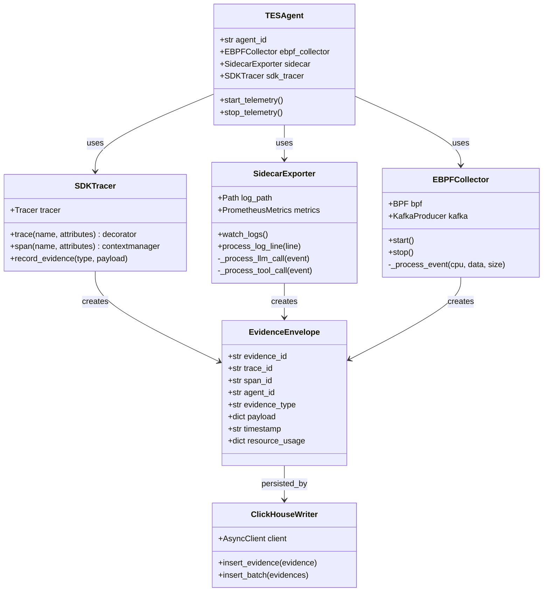

# 02-详细设计-Agent-TES

## 1. 模块概述

### 1.1 TES 定义

**TES = Telemetry & Evidence Service（遥测与证据服务）**

TES 是 Agentic Memory 系统的**可观测性核心**，负责采集、存储和分析 Agent 执行全生命周期的遥测数据。

### 1.2 设计目标

- **全链路追踪**：捕获从用户输入到最终响应的完整执行链路
- **三层采集架构**：
  - eBPF 层：内核态系统调用追踪
  - Sidecar 层：进程级指标导出
  - SDK 层：应用层语义标记
- **实时分析**：支持实时监控和告警
- **成本可控**：分层采样、压缩存储、TTL 过期

### 1.3 采集架构

```mermaid
flowchart TB
    subgraph "Agent Runtime"
        A[Agent Process]
        S[SDK Instrumentation]
    end

    subgraph "Node Level"
        E[eBPF Probe<br/>Kernel Space]
        SC[Sidecar Container<br/>Prometheus Export]
    end

    subgraph "Data Pipeline"
        K[Kafka<br/>agent.evidence.raw]
        CH[(ClickHouse<br/>Telemetry Store)]
        P[Prometheus<br/>Metrics)]
    end

    subgraph "Consumption"
        G[Grafana<br/>Dashboard]
        AL[AlertManager<br/>Alerts]
        R[Rule Engine<br/>Realtime]
    end

    A -->|SDK| S
    S -->|Evidence| K
    A -->|Syscalls| E
    E -->|Kernel Events| SC
    SC -->|Metrics| P
    K -->|Batch Insert| CH
    P -->|Query| G
    P -->|Alerts| AL
    CH -->|Analytics| R
```

---

## 2. eBPF 层设计

### 2.1 采集范围

| 事件类型 | 采集点 | 数据内容 |
|---------|-------|---------|
| HTTP 请求 | kprobe:tcp_sendmsg | LLM API 调用、延迟 |
| 文件 IO | kprobe:vfs_read/write | LanceDB 读写 |
| 网络连接 | kprobe:tcp_connect | 连接建立/关闭 |
| 进程事件 | tracepoint:sched | Agent 进程生命周期 |

### 2.2 eBPF 程序代码骨架

```c
// ebpf/agent_monitor.c
// eBPF 程序 - Agent 执行监控

#include "vmlinux.h"
#include <bpf/bpf_helpers.h>
#include <bpf/bpf_tracing.h>
#include <bpf/bpf_core_read.h>

#define MAX_MSG_SIZE 1024
#define MAX_PATH_SIZE 256

// 事件类型定义
enum event_type {
    EVENT_HTTP_REQUEST = 1,
    EVENT_HTTP_RESPONSE = 2,
    EVENT_FILE_READ = 3,
    EVENT_FILE_WRITE = 4,
    EVENT_NETWORK_CONNECT = 5,
};

// 通用事件结构
struct agent_event {
    u32 pid;
    u32 tid;
    u64 timestamp_ns;
    u32 event_type;
    u32 data_len;
    char comm[16];
    u8 data[MAX_MSG_SIZE];
};

// BPF Map 定义
struct {
    __uint(type, BPF_MAP_TYPE_RINGBUF);
    __uint(max_entries, 256 * 1024);  // 256KB ring buffer
} events SEC(".maps");

struct {
    __uint(type, BPF_MAP_TYPE_HASH);
    __uint(max_entries, 1024);
    __type(key, u64);  // pid_tid
    __type(value, struct http_request_ctx);
} active_http_requests SEC(".maps");

// HTTP 请求上下文
struct http_request_ctx {
    u64 start_ns;
    u32 pid;
    char method[8];
    char host[64];
    char path[128];
};

// ============================================
// HTTP 请求监控 (针对 Python httpx/requests)
// ============================================

SEC("uprobe/python_http_send")
int BPF_KPROBE(trace_http_send, struct py_http_request *req)
{
    u64 pid_tid = bpf_get_current_pid_tgid();
    u32 pid = pid_tid >> 32;

    // 只监控 Agent 进程
    char comm[16];
    bpf_get_current_comm(&comm, sizeof(comm));
    if (!bpf_strncmp(comm, 5, "agent", 5))
        return 0;

    struct http_request_ctx ctx = {};
    ctx.start_ns = bpf_ktime_get_ns();
    ctx.pid = pid;

    // 读取 HTTP 方法
    bpf_probe_read_user_str(ctx.method, sizeof(ctx.method),
                           &req->method);

    // 读取 Host
    bpf_probe_read_user_str(ctx.host, sizeof(ctx.host),
                           &req->headers->host);

    // 读取 Path
    bpf_probe_read_user_str(ctx.path, sizeof(ctx.path),
                           &req->url->path);

    bpf_map_update_elem(&active_http_requests, &pid_tid, &ctx, BPF_ANY);

    return 0;
}

SEC("uretprobe/python_http_send")
int BPF_KRETPROBE(trace_http_send_return, int ret)
{
    u64 pid_tid = bpf_get_current_pid_tgid();

    struct http_request_ctx *ctx =
        bpf_map_lookup_elem(&active_http_requests, &pid_tid);
    if (!ctx)
        return 0;

    u64 duration_ns = bpf_ktime_get_ns() - ctx->start_ns;

    // 构建事件
    struct agent_event *event =
        bpf_ringbuf_reserve(&events, sizeof(*event), 0);
    if (!event)
        goto cleanup;

    event->pid = ctx->pid;
    event->tid = pid_tid & 0xFFFFFFFF;
    event->timestamp_ns = bpf_ktime_get_ns();
    event->event_type = EVENT_HTTP_RESPONSE;
    event->data_len = sizeof(duration_ns);

    bpf_get_current_comm(event->comm, sizeof(event->comm));
    __builtin_memcpy(event->data, &duration_ns, sizeof(duration_ns));

    bpf_ringbuf_submit(event, 0);

cleanup:
    bpf_map_delete_elem(&active_http_requests, &pid_tid);
    return 0;
}

// ============================================
// 文件 IO 监控
// ============================================

SEC("kprobe/vfs_read")
int BPF_KPROBE(trace_vfs_read, struct file *file, char *buf, size_t count)
{
    u32 pid = bpf_get_current_pid_tgid() >> 32;

    char comm[16];
    bpf_get_current_comm(&comm, sizeof(comm));
    if (!bpf_strncmp(comm, 5, "agent", 5))
        return 0;

    struct agent_event *event =
        bpf_ringbuf_reserve(&events, sizeof(*event), 0);
    if (!event)
        return 0;

    event->pid = pid;
    event->timestamp_ns = bpf_ktime_get_ns();
    event->event_type = EVENT_FILE_READ;
    event->data_len = sizeof(count);

    bpf_get_current_comm(event->comm, sizeof(event->comm));
    __builtin_memcpy(event->data, &count, sizeof(count));

    bpf_ringbuf_submit(event, 0);
    return 0;
}

char LICENSE[] SEC("license") = "GPL";
```

### 2.3 eBPF 用户态程序

```python
# ebpf/agent_monitor.py
"""
eBPF 用户态程序 - 加载和事件处理
"""

import ctypes
import json
from datetime import datetime
from bcc import BPF


class AgentEvent(ctypes.Structure):
    """Agent 事件结构 - 对应 eBPF"""
    _fields_ = [
        ("pid", ctypes.c_uint32),
        ("tid", ctypes.c_uint32),
        ("timestamp_ns", ctypes.c_uint64),
        ("event_type", ctypes.c_uint32),
        ("data_len", ctypes.c_uint32),
        ("comm", ctypes.c_char * 16),
        ("data", ctypes.c_ubyte * 1024),
    ]


class EBPFCollector:
    """eBPF 数据采集器"""

    def __init__(self, kafka_producer):
        self.bpf = BPF(src_file="agent_monitor.c")
        self.kafka = kafka_producer
        self._setup_probes()

    def _setup_probes(self):
        """设置 uprobes（针对 Python 解释器）"""
        # 附加到 Python 的 socket 发送函数
        self.bpf.attach_uprobe(
            name="python3",
            sym="_Py_send",
            fn_name="trace_http_send"
        )

    def _process_event(self, cpu, data, size):
        """处理 eBPF 事件"""
        event = ctypes.cast(data, ctypes.POINTER(AgentEvent)).contents

        # 转换为标准格式
        evidence = {
            "evidence_id": f"ebpf_{event.timestamp_ns}_{event.pid}",
            "trace_id": None,  # 从 BPF map 关联
            "agent_id": event.comm.decode('utf-8', errors='ignore').strip('\x00'),
            "evidence_type": self._map_event_type(event.event_type),
            "payload": {
                "pid": event.pid,
                "duration_ns": int.from_bytes(event.data[:8], 'little')
            },
            "event_time": datetime.fromtimestamp(
                event.timestamp_ns / 1e9
            ).isoformat(),
            "source": "ebpf"
        }

        # 发送到 Kafka
        self.kafka.send("agent.evidence.raw", evidence)

    def _map_event_type(self, event_type: int) -> str:
        """映射事件类型"""
        mapping = {
            1: "HTTP_REQUEST",
            2: "HTTP_RESPONSE",
            3: "FILE_READ",
            4: "FILE_WRITE",
            5: "NETWORK_CONNECT",
        }
        return mapping.get(event_type, "UNKNOWN")

    def start(self):
        """开始采集"""
        self.bpf["events"].open_ring_buffer(self._process_event)
        print("eBPF 采集器已启动...")

        try:
            while True:
                self.bpf.ring_buffer_poll()
        except KeyboardInterrupt:
            self.stop()

    def stop(self):
        """停止采集"""
        print("eBPF 采集器已停止")


# 简化的用户态程序（无需 BCC 依赖的版本）
class EBPFCollectorStub:
    """eBPF 采集器存根（用于测试）"""

    def __init__(self, kafka_producer):
        self.kafka = kafka_producer
        self.running = False

    async def start(self):
        """模拟采集"""
        self.running = True
        import asyncio

        while self.running:
            # 模拟事件
            await asyncio.sleep(10)

    def stop(self):
        self.running = False
```

---

## 3. Sidecar 层设计

### 3.1 Sidecar 架构

Sidecar 作为 K8s 边车容器，与 Agent 容器同 Pod 运行：

```yaml
# sidecar-deployment.yaml
apiVersion: apps/v1
kind: Deployment
metadata:
  name: agent-with-telemetry
spec:
  template:
    spec:
      containers:
        - name: agent
          image: agent-memory:latest
          env:
            - name: LOG_FORMAT
              value: json
          volumeMounts:
            - name: logs
              mountPath: /var/log/agent

        - name: telemetry-sidecar
          image: agent-tes-sidecar:latest
          ports:
            - containerPort: 9090
              name: metrics
          volumeMounts:
            - name: logs
              mountPath: /var/log/agent:ro
          env:
            - name: KAFKA_BROKERS
              value: "kafka:9092"
            - name: LOG_PATH
              value: "/var/log/agent"
```

### 3.2 Sidecar 实现

```python
# sidecar/exporter.py
"""
TES Sidecar - 指标导出器
"""

import asyncio
import json
import re
from datetime import datetime
from pathlib import Path
from typing import Dict, Any, Optional

from prometheus_client import Counter, Histogram, Gauge, start_http_server


class TelemetrySidecar:
    """遥测 Sidecar 服务"""

    def __init__(self, log_path: str, kafka_producer):
        self.log_path = Path(log_path)
        self.kafka = kafka_producer
        self._setup_metrics()

    def _setup_metrics(self):
        """初始化 Prometheus 指标"""

        # LLM 调用指标
        self.llm_call_duration = Histogram(
            'agent_llm_call_duration_seconds',
            'Duration of LLM API calls',
            ['model', 'status'],
            buckets=[.001, .005, .01, .025, .05, .1, .25, .5, 1, 2.5, 5, 10]
        )

        self.llm_tokens_total = Counter(
            'agent_llm_tokens_total',
            'Total tokens used',
            ['model', 'token_type']  # prompt/completion
        )

        self.llm_cost_usd = Counter(
            'agent_llm_cost_usd_total',
            'Total cost in USD',
            ['model']
        )

        # 工具调用指标
        self.tool_calls_total = Counter(
            'agent_tool_calls_total',
            'Total tool calls',
            ['tool_name', 'status']  # success/error
        )

        self.tool_call_duration = Histogram(
            'agent_tool_call_duration_seconds',
            'Duration of tool calls',
            ['tool_name'],
            buckets=[.001, .005, .01, .025, .05, .1, .25, .5, 1]
        )

        # 记忆操作指标
        self.memory_operations_total = Counter(
            'agent_memory_operations_total',
            'Total memory operations',
            ['operation_type', 'memory_layer']  # read/write/delete
        )

        self.memory_operation_duration = Histogram(
            'agent_memory_operation_duration_seconds',
            'Duration of memory operations',
            ['operation_type', 'memory_layer']
        )

        # 上下文窗口指标
        self.context_window_usage = Gauge(
            'agent_context_window_usage_tokens',
            'Current context window usage in tokens',
            ['agent_id', 'session_id']
        )

        self.context_window_percentage = Gauge(
            'agent_context_window_usage_percentage',
            'Context window usage percentage',
            ['agent_id', 'session_id']
        )

        # Episode 指标
        self.episodes_flushed_total = Counter(
            'agent_episodes_flushed_total',
            'Total episodes flushed',
            ['agent_id']
        )

        self.episode_importance = Histogram(
            'agent_episode_importance_score',
            'Episode importance scores',
            buckets=[1, 2, 3, 4, 5, 6, 7, 8, 9, 10]
        )

        # Agent 运行指标
        self.agent_turns_total = Counter(
            'agent_turns_total',
            'Total agent turns',
            ['agent_id', 'session_id']
        )

        self.agent_errors_total = Counter(
            'agent_errors_total',
            'Total agent errors',
            ['agent_id', 'error_type']
        )

    async def process_log_line(self, line: str):
        """处理单行日志"""
        try:
            event = json.loads(line)
            event_type = event.get("type")

            if event_type == "llm_call":
                self._process_llm_call(event)
            elif event_type == "tool_call":
                self._process_tool_call(event)
            elif event_type == "memory_op":
                self._process_memory_op(event)
            elif event_type == "context_update":
                self._process_context_update(event)
            elif event_type == "episode_flush":
                self._process_episode_flush(event)

            # 发送到 Kafka
            await self.kafka.send("agent.evidence.raw", event)

        except json.JSONDecodeError:
            # 非 JSON 日志，忽略或使用正则解析
            pass

    def _process_llm_call(self, event: Dict[str, Any]):
        """处理 LLM 调用事件"""
        duration = event.get("duration_ms", 0) / 1000
        model = event.get("model", "unknown")
        status = "success" if event.get("success", True) else "error"

        self.llm_call_duration.labels(model=model, status=status).observe(duration)

        if event.get("tokens"):
            tokens = event["tokens"]
            self.llm_tokens_total.labels(model=model, token_type="prompt").inc(
                tokens.get("prompt", 0)
            )
            self.llm_tokens_total.labels(model=model, token_type="completion").inc(
                tokens.get("completion", 0)
            )

        if event.get("cost_usd"):
            self.llm_cost_usd.labels(model=model).inc(event["cost_usd"])

    def _process_tool_call(self, event: Dict[str, Any]):
        """处理工具调用事件"""
        tool_name = event.get("tool_name", "unknown")
        status = "success" if event.get("success", True) else "error"
        duration = event.get("duration_ms", 0) / 1000

        self.tool_calls_total.labels(tool_name=tool_name, status=status).inc()
        self.tool_call_duration.labels(tool_name=tool_name).observe(duration)

    def _process_memory_op(self, event: Dict[str, Any]):
        """处理记忆操作事件"""
        op_type = event.get("operation", "read")
        layer = event.get("memory_layer", "unknown")
        duration = event.get("duration_ms", 0) / 1000

        self.memory_operations_total.labels(
            operation_type=op_type,
            memory_layer=layer
        ).inc()
        self.memory_operation_duration.labels(
            operation_type=op_type,
            memory_layer=layer
        ).observe(duration)

    def _process_context_update(self, event: Dict[str, Any]):
        """处理上下文更新事件"""
        agent_id = event.get("agent_id", "unknown")
        session_id = event.get("session_id", "unknown")
        usage = event.get("usage", {})

        self.context_window_usage.labels(
            agent_id=agent_id,
            session_id=session_id
        ).set(usage.get("total_tokens", 0))

        self.context_window_percentage.labels(
            agent_id=agent_id,
            session_id=session_id
        ).set(usage.get("usage_percentage", 0) * 100)

    def _process_episode_flush(self, event: Dict[str, Any]):
        """处理 Episode 刷写事件"""
        agent_id = event.get("agent_id", "unknown")
        importance = event.get("importance_score", 5.0)

        self.episodes_flushed_total.labels(agent_id=agent_id).inc()
        self.episode_importance.observe(importance)

    async def watch_logs(self):
        """监听日志文件变化"""
        import aiofiles

        log_file = self.log_path / "agent.jsonl"

        if not log_file.exists():
            await asyncio.sleep(1)
            return

        async with aiofiles.open(log_file, 'r') as f:
            # 跳到文件末尾
            await f.seek(0, 2)

            while True:
                line = await f.readline()
                if not line:
                    await asyncio.sleep(0.1)
                    continue

                await self.process_log_line(line.strip())

    def start_metrics_server(self, port: int = 9090):
        """启动 Prometheus 指标服务"""
        start_http_server(port)
        print(f"Prometheus metrics server started on port {port}")

    async def run(self, metrics_port: int = 9090):
        """运行 Sidecar"""
        self.start_metrics_server(metrics_port)
        await self.watch_logs()


# 简化版 Sidecar 启动
if __name__ == "__main__":
    import os

    class MockKafka:
        async def send(self, topic, data):
            print(f"[Kafka] {topic}: {data.get('type')}")

    sidecar = TelemetrySidecar(
        log_path=os.getenv("LOG_PATH", "/var/log/agent"),
        kafka_producer=MockKafka()
    )

    asyncio.run(sidecar.run())
```

---

## 4. SDK 层设计

### 4.1 SDK 架构

```python
# sdk/agent_tes.py
"""
Agent TES SDK - 应用层遥测接入
"""

import functools
import time
import uuid
from contextlib import contextmanager
from typing import Callable, Optional, Dict, Any, List
from dataclasses import dataclass, field
from datetime import datetime

from opentelemetry import trace
from opentelemetry.trace import Span, SpanContext


# 全局 Tracer
tracer = trace.get_tracer("agent.tes")


@dataclass
class EvidenceContext:
    """证据上下文"""
    trace_id: str
    span_id: str
    agent_id: str
    session_id: str
    episode_id: Optional[str] = None
    metadata: Dict[str, Any] = field(default_factory=dict)

    @classmethod
    def current(cls) -> "EvidenceContext":
        """获取当前上下文"""
        current_span = trace.get_current_span()
        span_context = current_span.get_span_context()

        return cls(
            trace_id=format(span_context.trace_id, '032x'),
            span_id=format(span_context.span_id, '016x'),
            agent_id=cls._get_agent_id(),
            session_id=cls._get_session_id()
        )

    @staticmethod
    def _get_agent_id() -> str:
        # 从环境变量或线程本地存储获取
        import os
        return os.getenv("AGENT_ID", "unknown")

    @staticmethod
    def _get_session_id() -> str:
        import os
        return os.getenv("SESSION_ID", "unknown")


def trace(
    name: Optional[str] = None,
    attributes: Optional[Dict[str, Any]] = None
):
    """
    追踪装饰器

    自动追踪函数执行时间和结果

    Usage:
        @trace(name="llm_call", attributes={"model": "gpt-4"})
        async def call_llm(prompt):
            ...
    """
    def decorator(func: Callable) -> Callable:
        @functools.wraps(func)
        async def async_wrapper(*args, **kwargs):
            span_name = name or func.__name__

            with tracer.start_as_current_span(span_name) as span:
                # 设置属性
                if attributes:
                    for key, value in attributes.items():
                        span.set_attribute(key, value)

                span.set_attribute("function.name", func.__name__)
                span.set_attribute("function.args_count", len(args))

                start_time = time.time()
                try:
                    result = await func(*args, **kwargs)
                    span.set_attribute("success", True)
                    return result
                except Exception as e:
                    span.set_attribute("success", False)
                    span.set_attribute("error.type", type(e).__name__)
                    span.set_attribute("error.message", str(e))
                    raise
                finally:
                    duration_ms = (time.time() - start_time) * 1000
                    span.set_attribute("duration_ms", duration_ms)

        @functools.wraps(func)
        def sync_wrapper(*args, **kwargs):
            span_name = name or func.__name__

            with tracer.start_as_current_span(span_name) as span:
                if attributes:
                    for key, value in attributes.items():
                        span.set_attribute(key, value)

                start_time = time.time()
                try:
                    result = func(*args, **kwargs)
                    span.set_attribute("success", True)
                    return result
                except Exception as e:
                    span.set_attribute("success", False)
                    span.set_attribute("error.type", type(e).__name__)
                    raise
                finally:
                    duration_ms = (time.time() - start_time) * 1000
                    span.set_attribute("duration_ms", duration_ms)

        return async_wrapper if asyncio.iscoroutinefunction(func) else sync_wrapper
    return decorator


def span(name: str, attributes: Optional[Dict[str, Any]] = None):
    """
    创建命名 Span 的上下文管理器

    Usage:
        with span("database_query", {"table": "users"}):
            result = db.query(...)
    """
    return tracer.start_as_current_span(name, attributes=attributes)


def record_evidence(
    evidence_type: str,
    payload: Dict[str, Any],
    resource_usage: Optional[Dict[str, Any]] = None
):
    """
    记录证据

    用于记录自定义遥测事件

    Args:
        evidence_type: 证据类型 (LLM_CALL, TOOL_CALL, MEMORY_OP, etc.)
        payload: 证据内容
        resource_usage: 资源使用信息
    """
    ctx = EvidenceContext.current()

    evidence = {
        "evidence_id": f"ev_{uuid.uuid4().hex[:12]}",
        "trace_id": ctx.trace_id,
        "span_id": ctx.span_id,
        "agent_id": ctx.agent_id,
        "session_id": ctx.session_id,
        "episode_id": ctx.episode_id,
        "evidence_type": evidence_type,
        "payload": payload,
        "timestamp": datetime.utcnow().isoformat(),
        "resource_usage": resource_usage or {}
    }

    # 发送到遥测后端（Kafka/HTTP）
    _send_evidence(evidence)


def _send_evidence(evidence: Dict[str, Any]):
    """发送证据到后端"""
    # 实际实现：发送到 Kafka 或 OTLP
    # 这里简化为打印
    import json
    print(json.dumps(evidence, default=str))


# ============================================
# 特定类型事件的便捷函数
# ============================================

def record_llm_call(
    model: str,
    prompt_tokens: int,
    completion_tokens: int,
    duration_ms: float,
    cost_usd: Optional[float] = None,
    success: bool = True,
    error: Optional[str] = None
):
    """记录 LLM 调用事件"""
    record_evidence(
        evidence_type="LLM_CALL",
        payload={
            "model": model,
            "success": success,
            "error": error,
            "prompt_preview": "..."  # 前 200 字符
        },
        resource_usage={
            "prompt_tokens": prompt_tokens,
            "completion_tokens": completion_tokens,
            "total_tokens": prompt_tokens + completion_tokens,
            "cost_usd": cost_usd,
            "duration_ms": duration_ms
        }
    )


def record_tool_call(
    tool_name: str,
    input_data: Dict[str, Any],
    output_data: Optional[Any],
    duration_ms: float,
    success: bool = True,
    error: Optional[str] = None
):
    """记录工具调用事件"""
    record_evidence(
        evidence_type="TOOL_CALL",
        payload={
            "tool_name": tool_name,
            "input_hash": hash(str(input_data)),
            "output_preview": str(output_data)[:500] if output_data else None,
            "success": success,
            "error": error
        },
        resource_usage={
            "duration_ms": duration_ms
        }
    )


def record_memory_op(
    operation: str,  # read/write/delete
    memory_type: str,
    memory_id: Optional[str],
    duration_ms: float,
    success: bool = True
):
    """记录记忆操作事件"""
    record_evidence(
        evidence_type="MEMORY_OP",
        payload={
            "operation": operation,
            "memory_type": memory_type,
            "memory_id": memory_id,
            "success": success
        },
        resource_usage={
            "duration_ms": duration_ms
        }
    )


def record_reflection(
    topic: str,
    insights: List[str],
    source_episode_ids: List[str],
    confidence: float
):
    """记录反思事件"""
    record_evidence(
        evidence_type="REFLECTION",
        payload={
            "topic": topic,
            "insights": insights,
            "source_episode_ids": source_episode_ids,
            "confidence": confidence
        }
    )


# ============================================
# 上下文传播
# ============================================

@contextmanager
def agent_context(agent_id: str, session_id: str):
    """
    Agent 上下文管理器

    设置 Agent 和 Session 信息到上下文
    """
    import os
    old_agent = os.getenv("AGENT_ID")
    old_session = os.getenv("SESSION_ID")

    os.environ["AGENT_ID"] = agent_id
    os.environ["SESSION_ID"] = session_id

    with tracer.start_as_current_span("agent_session") as span:
        span.set_attribute("agent.id", agent_id)
        span.set_attribute("session.id", session_id)
        yield

    # 恢复
    if old_agent:
        os.environ["AGENT_ID"] = old_agent
    if old_session:
        os.environ["SESSION_ID"] = old_session


# ============================================
# 使用示例
# ============================================

async def example_usage():
    """SDK 使用示例"""

    with agent_context("agent_001", "session_abc"):
        # 使用装饰器追踪
        @trace(name="process_request", attributes={"priority": "high"})
        async def process_request(user_input: str):
            # 使用 span 追踪子操作
            with span("llm_generation"):
                start = time.time()
                # ... 调用 LLM ...
                duration = (time.time() - start) * 1000

                record_llm_call(
                    model="gpt-4",
                    prompt_tokens=100,
                    completion_tokens=50,
                    duration_ms=duration,
                    cost_usd=0.002
                )

            # 记录工具调用
            with span("tool_execution"):
                tool_start = time.time()
                # ... 执行工具 ...
                tool_duration = (time.time() - tool_start) * 1000

                record_tool_call(
                    tool_name="search",
                    input_data={"query": user_input},
                    output_data={"results": []},
                    duration_ms=tool_duration
                )

            return "result"

        result = await process_request("Hello")
```

### 4.2 OpenTelemetry 集成

```python
# sdk/otel_setup.py
"""
OpenTelemetry 配置
"""

from opentelemetry import trace
from opentelemetry.exporter.otlp.proto.grpc.trace_exporter import OTLPSpanExporter
from opentelemetry.sdk.trace import TracerProvider
from opentelemetry.sdk.trace.export import BatchSpanProcessor
from opentelemetry.sdk.resources import Resource, SERVICE_NAME, SERVICE_VERSION


def setup_telemetry(
    service_name: str = "agent-memory",
    otlp_endpoint: str = "http://localhost:4317"
):
    """
    配置 OpenTelemetry

    Args:
        service_name: 服务名称
        otlp_endpoint: OTLP 导出端点
    """
    # 资源定义
    resource = Resource(attributes={
        SERVICE_NAME: service_name,
        SERVICE_VERSION: "1.0.0",
        "deployment.environment": "production"
    })

    # 创建 Provider
    provider = TracerProvider(resource=resource)
    trace.set_tracer_provider(provider)

    # OTLP 导出器
    otlp_exporter = OTLPSpanExporter(
        endpoint=otlp_endpoint,
        insecure=True
    )

    # 批处理 Span 处理器
    span_processor = BatchSpanProcessor(
        otlp_exporter,
        max_queue_size=2048,
        max_export_batch_size=512,
        schedule_delay_millis=5000
    )

    provider.add_span_processor(span_processor)

    return provider
```

---

## 5. Evidence 数据模型

### 5.1 完整 JSON Schema

```json
{
  "$schema": "http://json-schema.org/draft-07/schema#",
  "title": "AgentEvidence",
  "type": "object",
  "required": ["evidence_id", "trace_id", "agent_id", "evidence_type", "timestamp"],
  "properties": {
    "evidence_id": {
      "type": "string",
      "description": "证据唯一标识",
      "pattern": "^ev_[a-z0-9]+$"
    },
    "trace_id": {
      "type": "string",
      "description": "分布式追踪 ID"
    },
    "span_id": {
      "type": "string",
      "description": "Span 标识"
    },
    "parent_span_id": {
      "type": ["string", "null"],
      "description": "父 Span 标识"
    },
    "agent_id": {
      "type": "string",
      "description": "Agent 标识"
    },
    "session_id": {
      "type": "string",
      "description": "会话标识"
    },
    "episode_id": {
      "type": ["string", "null"],
      "description": "关联的 Episode"
    },
    "evidence_type": {
      "type": "string",
      "enum": ["LLM_CALL", "TOOL_CALL", "MEMORY_OP", "REFLECTION", "ERROR", "STATE_TRANSITION"],
      "description": "证据类型"
    },
    "payload": {
      "type": "object",
      "description": "类型特定的数据"
    },
    "timestamp": {
      "type": "string",
      "format": "date-time",
      "description": "ISO8601 时间戳"
    },
    "duration_ms": {
      "type": "number",
      "description": "持续时间（毫秒）"
    },
    "resource_usage": {
      "type": "object",
      "properties": {
        "prompt_tokens": { "type": "integer" },
        "completion_tokens": { "type": "integer" },
        "total_tokens": { "type": "integer" },
        "cost_usd": { "type": "number" },
        "memory_bytes": { "type": "integer" },
        "cpu_time_ms": { "type": "number" }
      }
    },
    "metadata": {
      "type": "object",
      "description": "扩展元数据"
    },
    "source": {
      "type": "string",
      "enum": ["sdk", "sidecar", "ebpf"],
      "description": "数据来源"
    }
  }
}
```

### 5.2 各类型 Payload 定义

```python
# evidence_payloads.py
"""
Evidence Payload 定义
"""

from typing import TypedDict, Optional, List, Dict, Any


class LLMCallPayload(TypedDict):
    """LLM 调用 Payload"""
    model: str
    prompt_preview: str  # 前 500 字符
    completion_preview: str  # 前 500 字符
    success: bool
    error: Optional[str]
    temperature: Optional[float]
    max_tokens: Optional[int]


class ToolCallPayload(TypedDict):
    """工具调用 Payload"""
    tool_name: str
    input_hash: str  # SHA256
    input_preview: str
    output_preview: Optional[str]
    success: bool
    error: Optional[str]
    retry_count: int


class MemoryOpPayload(TypedDict):
    """记忆操作 Payload"""
    operation: str  # read/write/delete/search
    memory_type: str  # working/episode/skill/knowledge
    memory_id: Optional[str]
    query_preview: Optional[str]  # 搜索时的查询
    result_count: Optional[int]  # 搜索结果数
    success: bool


class ReflectionPayload(TypedDict):
    """反思 Payload"""
    topic: str
    insights: List[str]
    source_episode_ids: List[str]
    confidence: float
    generated_knowledge: Optional[List[Dict[str, Any]]]


class ErrorPayload(TypedDict):
    """错误 Payload"""
    error_type: str
    error_message: str
    stack_trace: Optional[str]
    recoverable: bool
    recovery_action: Optional[str]
```

---

## 6. ClickHouse 表设计

```sql
-- 参见 06-详细设计-Storage-Schema.md 的 ClickHouse 章节
-- 这里补充物化视图和查询示例

-- ============================================
-- 实时错误率视图
-- ============================================
CREATE MATERIALIZED VIEW mv_error_rate_5min
ENGINE = SummingMergeTree()
ORDER BY (agent_id, window_start)
AS SELECT
    agent_id,
    toStartOfFiveMinutes(event_time) AS window_start,
    count() AS total_events,
    sum(success = 0) AS error_count,
    error_count / total_events AS error_rate
FROM agent_evidence
GROUP BY agent_id, window_start;

-- ============================================
-- Agent 性能排行榜（每小时更新）
-- ============================================
CREATE MATERIALIZED VIEW mv_agent_performance_hourly
ENGINE = SummingMergeTree()
ORDER BY (date_hour, agent_id)
AS SELECT
    toStartOfHour(event_time) AS date_hour,
    agent_id,
    count() AS total_calls,
    avg(duration_ms) AS avg_latency,
    quantile(0.99)(duration_ms) AS p99_latency,
    sum(resource_usage.cost_usd) AS total_cost
FROM agent_evidence
WHERE evidence_type = 'LLM_CALL'
GROUP BY date_hour, agent_id;

-- ============================================
-- 常用查询
-- ============================================

-- 1. 查询 Agent 最近 1 小时的 LLM 调用详情
-- SELECT *
-- FROM agent_evidence
-- WHERE agent_id = 'agent_001'
--   AND evidence_type = 'LLM_CALL'
--   AND event_time > now() - INTERVAL 1 HOUR
-- ORDER BY event_time DESC;

-- 2. 查询错误率最高的 Agents（最近 24 小时）
-- SELECT
--     agent_id,
--     count() AS total,
--     sum(success = 0) AS errors,
--     round(errors / total * 100, 2) AS error_rate_pct
-- FROM agent_evidence
-- WHERE event_time > now() - INTERVAL 24 HOUR
-- GROUP BY agent_id
-- ORDER BY error_rate DESC;

-- 3. 查询 Token 消耗趋势（按小时）
-- SELECT
--     toStartOfHour(event_time) AS hour,
--     sum(resource_usage.total_tokens) AS tokens,
--     sum(resource_usage.cost_usd) AS cost
-- FROM agent_evidence
-- WHERE evidence_type = 'LLM_CALL'
-- GROUP BY hour
-- ORDER BY hour;
```

---

## 7. 告警规则设计

```yaml
# alerting-rules.yaml
# Prometheus 告警规则

groups:
  - name: agent_alerts
    rules:
      # ============================================
      # LLM 调用延迟告警
      # ============================================
      - alert: AgentLLMLatencyHigh
        expr: |
          histogram_quantile(0.99,
            rate(agent_llm_call_duration_seconds_bucket[5m])
          ) > 10
        for: 5m
        labels:
          severity: warning
        annotations:
          summary: "Agent LLM P99 latency is high"
          description: "Agent {{ $labels.agent_id }} LLM P99 latency is {{ $value }}s"

      # ============================================
      # 工具调用失败率告警
      # ============================================
      - alert: AgentToolErrorRateHigh
        expr: |
          sum by (agent_id) (
            rate(agent_tool_calls_total{status="error"}[5m])
          ) /
          sum by (agent_id) (
            rate(agent_tool_calls_total[5m])
          ) > 0.05
        for: 5m
        labels:
          severity: critical
        annotations:
          summary: "Agent tool error rate is high"
          description: "Agent {{ $labels.agent_id }} tool error rate is {{ $value | humanizePercentage }}"

      # ============================================
      # 上下文窗口使用率告警
      # ============================================
      - alert: AgentContextWindowNearlyFull
        expr: agent_context_window_usage_percentage > 90
        for: 2m
        labels:
          severity: warning
        annotations:
          summary: "Agent context window nearly full"
          description: "Agent {{ $labels.agent_id }} context window is {{ $value }}% full"

      # ============================================
      # 记忆操作错误率告警
      # ============================================
      - alert: AgentMemoryOpErrorRateHigh
        expr: |
          sum by (agent_id) (
            rate(agent_memory_operations_total{success="false"}[5m])
          ) /
          sum by (agent_id) (
            rate(agent_memory_operations_total[5m])
          ) > 0.01
        for: 5m
        labels:
          severity: warning
        annotations:
          summary: "Agent memory operation error rate is high"
          description: "Agent {{ $labels.agent_id }} memory op error rate is {{ $value | humanizePercentage }}"

      # ============================================
      # Episode 积压告警
      # ============================================
      - alert: AgentEpisodeFlushBacklog
        expr: |
          kafka_consumer_lag{topic="mem.episode.raw"} > 1000
        for: 10m
        labels:
          severity: warning
        annotations:
          summary: "Episode flush backlog detected"
          description: "Kafka consumer lag for mem.episode.raw is {{ $value }}"

      # ============================================
      # Agent 成本告警
      # ============================================
      - alert: AgentCostSpike
        expr: |
          (
            sum(increase(agent_llm_cost_usd_total[1h]))
            /
            sum(increase(agent_llm_cost_usd_total[1h] offset 1d))
          ) > 2
        for: 30m
        labels:
          severity: info
        annotations:
          summary: "Agent cost spike detected"
          description: "Hourly cost is {{ $value }}x higher than yesterday"
```

---

## 8. UML 类图



---

## 9. 单元测试

```python
# test_agent_tes.py
"""
Agent TES 单元测试
"""

import pytest
from unittest.mock import Mock, AsyncMock, patch
from datetime import datetime

from sdk.agent_tes import (
    EvidenceContext, record_evidence, record_llm_call,
    record_tool_call, record_memory_op, agent_context
)
from sidecar.exporter import TelemetrySidecar


# ============================================
# SDK 测试
# ============================================

def test_evidence_context_creation():
    """测试 EvidenceContext 创建"""
    ctx = EvidenceContext(
        trace_id="trace_123",
        span_id="span_456",
        agent_id="agent_001",
        session_id="session_abc"
    )

    assert ctx.trace_id == "trace_123"
    assert ctx.agent_id == "agent_001"


@pytest.mark.asyncio
async def test_record_llm_call():
    """测试记录 LLM 调用"""
    with patch('sdk.agent_tes._send_evidence') as mock_send:
        record_llm_call(
            model="gpt-4",
            prompt_tokens=100,
            completion_tokens=50,
            duration_ms=1500.0,
            cost_usd=0.002
        )

        mock_send.assert_called_once()
        evidence = mock_send.call_args[0][0]

        assert evidence["evidence_type"] == "LLM_CALL"
        assert evidence["resource_usage"]["prompt_tokens"] == 100
        assert evidence["resource_usage"]["cost_usd"] == 0.002


@pytest.mark.asyncio
async def test_record_tool_call():
    """测试记录工具调用"""
    with patch('sdk.agent_tes._send_evidence') as mock_send:
        record_tool_call(
            tool_name="search",
            input_data={"query": "test"},
            output_data={"results": []},
            duration_ms=200.0
        )

        mock_send.assert_called_once()
        evidence = mock_send.call_args[0][0]

        assert evidence["evidence_type"] == "TOOL_CALL"
        assert evidence["payload"]["tool_name"] == "search"


@pytest.mark.asyncio
async def test_record_memory_op():
    """测试记录记忆操作"""
    with patch('sdk.agent_tes._send_evidence') as mock_send:
        record_memory_op(
            operation="read",
            memory_type="episode",
            memory_id="mem_123",
            duration_ms=50.0
        )

        mock_send.assert_called_once()
        evidence = mock_send.call_args[0][0]

        assert evidence["evidence_type"] == "MEMORY_OP"
        assert evidence["payload"]["operation"] == "read"


# ============================================
# Sidecar 测试
# ============================================

@pytest.fixture
def mock_kafka():
    """Mock Kafka 生产者"""
    return Mock(send=AsyncMock())


@pytest.fixture
def sidecar(mock_kafka):
    """Sidecar fixture"""
    return TelemetrySidecar("/tmp/logs", mock_kafka)


def test_sidecar_metrics_setup(sidecar):
    """测试 Sidecar 指标初始化"""
    assert sidecar.llm_call_duration is not None
    assert sidecar.tool_calls_total is not None
    assert sidecar.memory_operations_total is not None


@pytest.mark.asyncio
async def test_process_llm_call_event(sidecar, mock_kafka):
    """测试处理 LLM 调用事件"""
    event = {
        "type": "llm_call",
        "model": "gpt-4",
        "duration_ms": 1500,
        "success": True,
        "tokens": {"prompt": 100, "completion": 50},
        "cost_usd": 0.002
    }

    await sidecar.process_log_line(json.dumps(event))

    # 验证指标更新（无法直接验证，但确保无异常）
    mock_kafka.send.assert_called_once()


@pytest.mark.asyncio
async def test_process_tool_call_event(sidecar, mock_kafka):
    """测试处理工具调用事件"""
    event = {
        "type": "tool_call",
        "tool_name": "search",
        "duration_ms": 200,
        "success": True
    }

    await sidecar.process_log_line(json.dumps(event))

    mock_kafka.send.assert_called_once()


@pytest.mark.asyncio
async def test_process_memory_op_event(sidecar, mock_kafka):
    """测试处理记忆操作事件"""
    event = {
        "type": "memory_op",
        "operation": "read",
        "memory_layer": "episode",
        "duration_ms": 50
    }

    await sidecar.process_log_line(json.dumps(event))

    mock_kafka.send.assert_called_once()


@pytest.mark.asyncio
async def test_invalid_json_line(sidecar, mock_kafka):
    """测试无效 JSON 处理"""
    await sidecar.process_log_line("not valid json")

    # 不应抛出异常，也不应发送
    mock_kafka.send.assert_not_called()


# ============================================
# 集成测试
# ============================================

@pytest.mark.asyncio
async def test_end_to_end_evidence_flow():
    """测试端到端证据流"""
    import json
    import tempfile
    import os

    # 创建临时日志文件
    with tempfile.NamedTemporaryFile(mode='w', suffix='.jsonl', delete=False) as f:
        log_path = f.name

    try:
        # 创建 Sidecar
        kafka_messages = []
        mock_kafka = Mock(send=AsyncMock(side_effect=lambda t, d: kafka_messages.append(d)))

        sidecar = TelemetrySidecar(os.path.dirname(log_path), mock_kafka)

        # 写入日志
        with open(log_path, 'w') as f:
            f.write(json.dumps({
                "type": "llm_call",
                "model": "gpt-4",
                "duration_ms": 1000,
                "success": True,
                "tokens": {"prompt": 50, "completion": 25}
            }) + "\n")

        # 处理日志
        with open(log_path, 'r') as f:
            for line in f:
                await sidecar.process_log_line(line.strip())

        # 验证
        assert len(kafka_messages) == 1
        assert kafka_messages[0]["evidence_type"] == "LLM_CALL"

    finally:
        os.unlink(log_path)


if __name__ == "__main__":
    pytest.main([__file__, "-v"])
```

---

## 10. 总结

本文档详细定义了 Agent TES（遥测与证据服务）的设计：

1. **eBPF 层**：内核态系统调用追踪，采集 HTTP、文件 IO、网络事件
2. **Sidecar 层**：进程级指标导出，Prometheus 集成
3. **SDK 层**：应用层语义标记，OpenTelemetry 兼容
4. **数据模型**：完整的 Evidence JSON Schema
5. **存储分析**：ClickHouse 时序存储，Prometheus 告警

三层采集架构确保从内核到应用的全链路可观测性。
