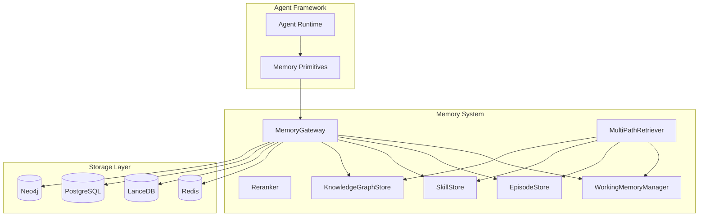
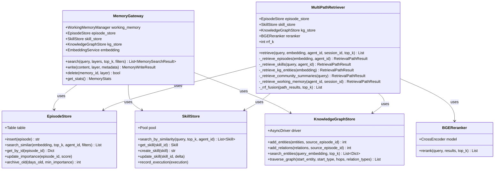
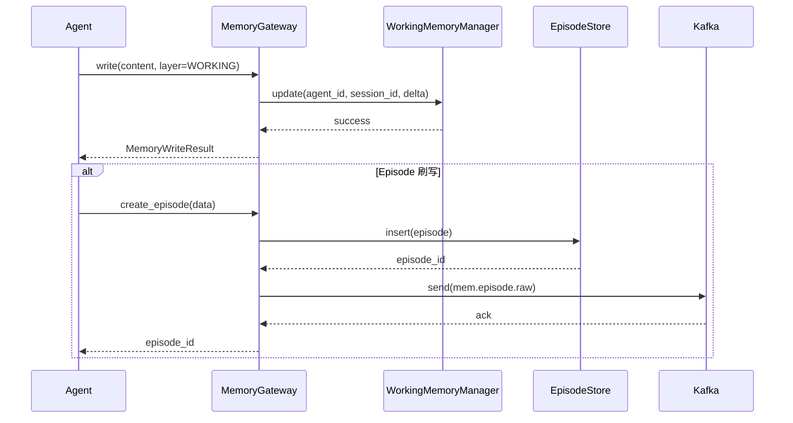
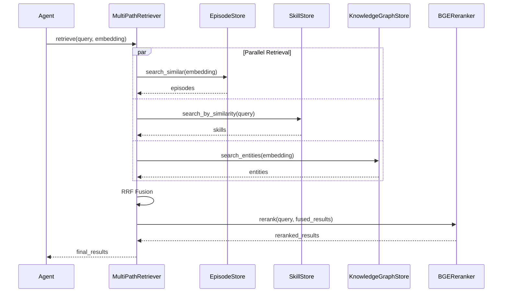

# 03-详细设计-Memory-System

## 1. 模块概述

### 1.1 设计目标

Memory System 是 Agentic Memory 的**存储与检索核心**，负责：
- 统一管理 4 层记忆（Working/Episode/Procedural/Semantic）
- 提供统一的读写接口
- 实现多路融合检索（5 路并行）
- 支持记忆的路由与访问控制

### 1.2 系统边界



---

## 2. MemoryGateway 设计

### 2.1 统一入口

```python
# memory_gateway.py
"""
Memory Gateway - 记忆系统统一入口
"""

from typing import List, Dict, Any, Optional, Union
from dataclasses import dataclass
from enum import Enum
from datetime import datetime


class MemoryLayer(Enum):
    """记忆层级"""
    WORKING = "working"
    EPISODE = "episode"
    PROCEDURAL = "procedural"  # Skill
    SEMANTIC = "semantic"      # Knowledge Graph


@dataclass
class MemorySearchResult:
    """记忆搜索结果"""
    memory_id: str
    content: str
    score: float
    memory_layer: MemoryLayer
    metadata: Dict[str, Any]
    embedding: Optional[List[float]] = None


@dataclass
class MemoryWriteResult:
    """记忆写入结果"""
    memory_id: str
    layer: MemoryLayer
    status: str
    created_at: datetime


@dataclass
class MemoryStats:
    """记忆统计"""
    total_working: int
    total_episodes: int
    total_skills: int
    total_entities: int
    storage_bytes: int


class MemoryGateway:
    """
    记忆网关

    提供统一的记忆读写接口，负责路由到具体存储层
    """

    def __init__(
        self,
        working_memory_manager,
        episode_store,
        skill_store,
        knowledge_graph_store,
        embedding_service
    ):
        self.working_memory = working_memory_manager
        self.episode_store = episode_store
        self.skill_store = skill_store
        self.kg_store = knowledge_graph_store
        self.embedding = embedding_service

        # 层级映射
        self._stores = {
            MemoryLayer.WORKING: self.working_memory,
            MemoryLayer.EPISODE: self.episode_store,
            MemoryLayer.PROCEDURAL: self.skill_store,
            MemoryLayer.SEMANTIC: self.kg_store
        }

    async def search(
        self,
        query: str,
        layers: Optional[List[MemoryLayer]] = None,
        top_k: int = 10,
        filters: Optional[Dict[str, Any]] = None,
        agent_id: Optional[str] = None
    ) -> List[MemorySearchResult]:
        """
        统一记忆搜索

        Args:
            query: 搜索查询
            layers: 搜索的记忆层级（None = 全部）
            top_k: 每层的返回数量
            filters: 过滤条件
            agent_id: Agent 过滤

        Returns:
            搜索结果列表（按相关度排序）
        """
        results = []
        layers = layers or list(MemoryLayer)

        # 生成查询向量
        query_embedding = await self.embedding.embed(query)

        # 并行搜索各层
        for layer in layers:
            store = self._stores.get(layer)
            if not store:
                continue

            layer_results = await self._search_layer(
                store, layer, query, query_embedding,
                top_k, filters, agent_id
            )
            results.extend(layer_results)

        # 按分数排序
        results.sort(key=lambda x: x.score, reverse=True)

        return results[:top_k]

    async def _search_layer(
        self,
        store,
        layer: MemoryLayer,
        query: str,
        query_embedding: List[float],
        top_k: int,
        filters: Optional[Dict],
        agent_id: Optional[str]
    ) -> List[MemorySearchResult]:
        """搜索单个层级"""
        results = []

        if layer == MemoryLayer.WORKING:
            # Working Memory 精确匹配
            wm_data = await store.get(agent_id, filters.get("session_id", ""))
            if wm_data and self._matches_query(query, wm_data):
                results.append(MemorySearchResult(
                    memory_id=f"wm:{agent_id}:{filters.get('session_id', '')}",
                    content=str(wm_data.working_items),
                    score=1.0,  # 完全匹配
                    memory_layer=layer,
                    metadata={"turn_number": wm_data.turn_number}
                ))

        elif layer == MemoryLayer.EPISODE:
            # Episode 语义搜索
            episodes = await store.search_similar(
                query_embedding=query_embedding,
                top_k=top_k,
                agent_id=agent_id,
                filters=filters
            )
            for ep in episodes:
                results.append(MemorySearchResult(
                    memory_id=ep.episode_id,
                    content=ep.content_text[:1000],
                    score=ep.get("_distance", 0),
                    memory_layer=layer,
                    metadata={
                        "importance": ep.importance_score,
                        "event_time": ep.event_time
                    }
                ))

        elif layer == MemoryLayer.PROCEDURAL:
            # Skill 语义搜索
            skills = await store.search_by_similarity(query, top_k)
            for skill in skills:
                results.append(MemorySearchResult(
                    memory_id=skill.skill_id,
                    content=f"{skill.name}: {skill.description}",
                    score=skill.similarity_score,
                    memory_layer=layer,
                    metadata={
                        "success_rate": skill.success_rate,
                        "usage_count": skill.usage_count
                    }
                ))

        elif layer == MemoryLayer.SEMANTIC:
            # 知识图谱实体搜索
            entities = await store.search_entities(query_embedding, top_k)
            for entity in entities:
                results.append(MemorySearchResult(
                    memory_id=entity["name"],
                    content=entity.get("description", ""),
                    score=entity.get("score", 0),
                    memory_layer=layer,
                    metadata={"type": entity.get("type")}
                ))

        return results

    def _matches_query(self, query: str, wm_data) -> bool:
        """检查 Working Memory 是否匹配查询"""
        query_lower = query.lower()
        content = str(wm_data.working_items).lower()
        summary = wm_data.context_summary.lower()
        return query_lower in content or query_lower in summary

    async def write(
        self,
        content: str,
        layer: MemoryLayer,
        metadata: Optional[Dict[str, Any]] = None
    ) -> MemoryWriteResult:
        """
        写入记忆

        Args:
            content: 记忆内容
            layer: 目标层级
            metadata: 元数据

        Returns:
            写入结果
        """
        store = self._stores.get(layer)
        if not store:
            raise ValueError(f"Unknown memory layer: {layer}")

        if layer == MemoryLayer.EPISODE:
            # Episode 需要特殊处理（通过 EpisodeManager）
            raise NotImplementedError("Use EpisodeManager for episode creation")

        elif layer == MemoryLayer.PROCEDURAL:
            # 创建 Skill
            from skill_schema import Skill
            skill = Skill(
                name=metadata.get("name", "Unnamed Skill"),
                description=content,
                agent_id=metadata.get("agent_id", "unknown")
            )
            skill_id = await store.create_skill(skill)
            return MemoryWriteResult(
                memory_id=skill_id,
                layer=layer,
                status="created",
                created_at=datetime.utcnow()
            )

        elif layer == MemoryLayer.SEMANTIC:
            # 添加知识
            entity = {
                "name": metadata.get("name", ""),
                "type": metadata.get("entity_type", "Concept"),
                "description": content
            }
            await store.add_entities([entity])
            return MemoryWriteResult(
                memory_id=entity["name"],
                layer=layer,
                status="created",
                created_at=datetime.utcnow()
            )

        return MemoryWriteResult(
            memory_id="",
            layer=layer,
            status="unsupported",
            created_at=datetime.utcnow()
        )

    async def delete(self, memory_id: str, layer: MemoryLayer) -> bool:
        """删除记忆"""
        # 实现各层的删除逻辑
        pass

    async def get_stats(self) -> MemoryStats:
        """获取记忆统计"""
        return MemoryStats(
            total_working=0,  # Redis 统计
            total_episodes=await self.episode_store.count(),
            total_skills=await self.skill_store.count(),
            total_entities=await self.kg_store.count_entities(),
            storage_bytes=0
        )
```

---

## 3. Episode Memory 详细设计

### 3.1 LanceDB Schema（已在 06-Storage-Schema.md 定义）

```python
# episode_store.py
"""
Episode Store - LanceDB 实现
"""

from typing import List, Optional, Dict, Any
from datetime import datetime, timedelta
import lancedb
from lancedb.table import Table

from episode_schema import Episode, EpisodeRecord


class EpisodeStore:
    """
    Episode 存储

    基于 LanceDB 的向量存储，支持语义检索
    """

    def __init__(self, uri: str = "s3://agent-memory/episodes"):
        self.uri = uri
        self.db: Optional[lancedb.AsyncConnection] = None
        self.table: Optional[Table] = None

    async def initialize(self):
        """初始化存储"""
        self.db = await lancedb.connect_async(self.uri)

        try:
            self.table = await self.db.open_table("episodes")
        except Exception:
            # 表不存在，创建新表
            import pyarrow as pa
            schema = pa.schema([
                pa.field("episode_id", pa.string()),
                pa.field("agent_id", pa.string()),
                pa.field("session_id", pa.string()),
                pa.field("content_text", pa.large_string()),
                pa.field("embedding", pa.list_(pa.float32(), 1536)),
                pa.field("importance_score", pa.float32()),
                pa.field("tags", pa.list_(pa.string())),
                pa.field("episode_type", pa.string()),
                pa.field("event_time", pa.timestamp('us')),
                pa.field("ingestion_time", pa.timestamp('us')),
                pa.field("is_archived", pa.bool_()),
            ])
            self.table = await self.db.create_table("episodes", schema=schema)

            # 创建索引
            await self.table.create_index(
                column="embedding",
                index_type="IVF_PQ",
                metric="cosine"
            )

    async def insert(self, episode: Episode) -> str:
        """
        插入 Episode

        Args:
            episode: Episode 对象

        Returns:
            episode_id
        """
        record = EpisodeRecord(
            episode_id=episode.episode_id,
            agent_id=episode.agent_id,
            session_id=episode.session_id,
            content_text=episode.to_dict()["content_text"],
            embedding=episode.embedding,
            importance_score=episode.importance_score,
            tags=episode.tags,
            episode_type=episode.episode_type.value,
            event_time=datetime.fromisoformat(episode.event_time),
            ingestion_time=datetime.utcnow(),
            is_archived=episode.is_archived
        )

        await self.table.add([record.to_dict()])
        return episode.episode_id

    async def search_similar(
        self,
        query_embedding: List[float],
        top_k: int = 10,
        agent_id: Optional[str] = None,
        filters: Optional[Dict[str, Any]] = None
    ) -> List[Dict[str, Any]]:
        """
        语义相似度搜索

        Args:
            query_embedding: 查询向量
            top_k: 返回数量
            agent_id: Agent 过滤
            filters: 额外过滤条件

        Returns:
            Episode 列表
        """
        # 构建过滤条件
        where_clauses = ["is_archived = false"]

        if agent_id:
            where_clauses.append(f"agent_id = '{agent_id}'")

        if filters:
            if "min_importance" in filters:
                where_clauses.append(
                    f"importance_score >= {filters['min_importance']}"
                )
            if "time_range_days" in filters:
                cutoff = datetime.now() - timedelta(days=filters["time_range_days"])
                where_clauses.append(f"event_time >= timestamp '{cutoff.isoformat()}'")

        where_clause = " AND ".join(where_clauses)

        # 执行搜索
        results = await self.table.search(query_embedding) \
            .where(where_clause) \
            .metric("cosine") \
            .limit(top_k) \
            .to_list()

        return results

    async def get_by_id(self, episode_id: str) -> Optional[Dict[str, Any]]:
        """通过 ID 获取 Episode"""
        results = await self.table \
            .search() \
            .where(f"episode_id = '{episode_id}'") \
            .limit(1) \
            .to_list()

        return results[0] if results else None

    async def update_importance(self, episode_id: str, score: float):
        """更新重要性评分"""
        await self.table.update(
            where=f"episode_id = '{episode_id}'",
            values={"importance_score": score}
        )

    async def archive_old(self, days_old: int, min_importance: float = 5.0) -> int:
        """
        归档旧 Episode

        Args:
            days_old: 天数阈值
            min_importance: 重要性阈值（低于此值才归档）

        Returns:
            归档数量
        """
        cutoff = datetime.now() - timedelta(days=days_old)

        # 查找并更新
        results = await self.table \
            .search() \
            .where(f"""
                event_time < timestamp '{cutoff.isoformat()}'
                AND importance_score < {min_importance}
                AND is_archived = false
            """) \
            .limit(10000) \
            .to_list()

        count = len(results)

        if count > 0:
            for record in results:
                record["is_archived"] = True

            await self.table.merge_insert("episode_id") \
                .when_matched_update_all() \
                .execute(results)

        return count

    async def count(self) -> int:
        """获取总数"""
        # LanceDB 不直接支持 count，使用搜索近似
        return await self.table.count_rows()
```

---

## 4. Procedural Memory（Skill Store）详细设计

### 4.1 PostgreSQL Schema（已在 06-Storage-Schema.md 定义）

```python
# skill_store.py
"""
Skill Store - PostgreSQL + pgvector 实现
"""

from typing import List, Optional, Dict, Any
from dataclasses import dataclass
from datetime import datetime
import asyncpg

from skill_schema import Skill, SkillExecution, SkillRelation


class SkillStore:
    """
    技能存储

    基于 PostgreSQL + pgvector 的技能库
    """

    def __init__(self, pool: asyncpg.Pool):
        self.pool = pool

    async def search_by_similarity(
        self,
        query: str,
        top_k: int = 10,
        agent_id: Optional[str] = None
    ) -> List[Skill]:
        """
        语义相似度搜索

        Args:
            query: 查询文本
            top_k: 返回数量
            agent_id: Agent 过滤

        Returns:
            技能列表（含相似度分数）
        """
        # 生成查询向量（实际应调用 embedding service）
        # 这里简化为使用 query 的 hash

        sql = """
        SELECT
            s.*,
            1 - (s.embedding <=> $1) AS similarity_score
        FROM skills s
        WHERE s.visibility IN ('public', 'org')
           OR s.agent_id = $2
        ORDER BY s.embedding <=> $1
        LIMIT $3
        """

        async with self.pool.acquire() as conn:
            # 实际应使用 embedding
            rows = await conn.fetch(sql, [0.0] * 1536, agent_id, top_k)

        return [self._row_to_skill(row) for row in rows]

    async def get_skill(self, skill_id: str) -> Optional[Skill]:
        """获取技能详情"""
        async with self.pool.acquire() as conn:
            row = await conn.fetchrow(
                "SELECT * FROM skills WHERE skill_id = $1",
                skill_id
            )
            return self._row_to_skill(row) if row else None

    async def create_skill(self, skill: Skill) -> str:
        """
        创建技能

        Args:
            skill: Skill 对象

        Returns:
            skill_id
        """
        sql = """
        INSERT INTO skills (
            name, description, code_template, code_language,
            embedding, version, skill_type, agent_id, visibility,
            tags, dependencies, parameters
        ) VALUES ($1, $2, $3, $4, $5, $6, $7, $8, $9, $10, $11, $12)
        RETURNING skill_id
        """

        async with self.pool.acquire() as conn:
            skill_id = await conn.fetchval(
                sql,
                skill.name,
                skill.description,
                skill.code_template,
                skill.code_language,
                skill.embedding,
                skill.version,
                skill.skill_type,
                skill.agent_id,
                skill.visibility,
                skill.tags,
                skill.dependencies,
                json.dumps(skill.parameters) if skill.parameters else None
            )
            return str(skill_id)

    async def update_skill(self, skill_id: str, delta: Dict[str, Any]):
        """更新技能"""
        allowed_fields = [
            "name", "description", "code_template", "tags",
            "parameters", "visibility"
        ]

        updates = []
        values = []
        for field, value in delta.items():
            if field in allowed_fields:
                updates.append(f"{field} = ${len(values) + 1}")
                values.append(value)

        if not updates:
            return

        values.append(skill_id)
        sql = f"""
        UPDATE skills
        SET {', '.join(updates)}, updated_at = NOW()
        WHERE skill_id = ${len(values)}
        """

        async with self.pool.acquire() as conn:
            await conn.execute(sql, *values)

    async def record_execution(self, execution: SkillExecution):
        """记录技能执行"""
        sql = """
        INSERT INTO skill_executions (
            skill_id, agent_id, session_id, input_hash,
            input_summary, output_summary, success, error_message,
            latency_ms, tokens_input, tokens_output, cost_usd
        ) VALUES ($1, $2, $3, $4, $5, $6, $7, $8, $9, $10, $11, $12)
        """

        async with self.pool.acquire() as conn:
            await conn.execute(
                sql,
                execution.skill_id,
                execution.agent_id,
                execution.session_id,
                execution.input_hash,
                execution.input_summary,
                execution.output_summary,
                execution.success,
                execution.error_message,
                execution.latency_ms,
                execution.tokens_input,
                execution.tokens_output,
                execution.cost_usd
            )

    async def get_related_skills(
        self,
        skill_id: str,
        relation_type: Optional[str] = None
    ) -> List[Skill]:
        """获取相关技能"""
        if relation_type:
            sql = """
            SELECT s.* FROM skills s
            JOIN skill_relations sr ON s.skill_id = sr.to_skill_id
            WHERE sr.from_skill_id = $1 AND sr.relation_type = $2
            """
            params = [skill_id, relation_type]
        else:
            sql = """
            SELECT s.* FROM skills s
            JOIN skill_relations sr ON s.skill_id = sr.to_skill_id
            WHERE sr.from_skill_id = $1
            """
            params = [skill_id]

        async with self.pool.acquire() as conn:
            rows = await conn.fetch(sql, *params)
            return [self._row_to_skill(row) for row in rows]

    async def count(self) -> int:
        """获取技能总数"""
        async with self.pool.acquire() as conn:
            return await conn.fetchval("SELECT COUNT(*) FROM skills")

    def _row_to_skill(self, row: asyncpg.Record) -> Skill:
        """数据库行转换为 Skill"""
        return Skill(
            skill_id=str(row["skill_id"]),
            name=row["name"],
            description=row["description"],
            code_template=row["code_template"],
            code_language=row["code_language"],
            embedding=row["embedding"],
            version=row["version"],
            skill_type=row["skill_type"],
            success_rate=row["success_rate"],
            usage_count=row["usage_count"],
            agent_id=row["agent_id"],
            visibility=row["visibility"],
            tags=row["tags"] or [],
            dependencies=row["dependencies"] or [],
            parameters=row["parameters"]
        )
```

---

## 5. Semantic Memory（Knowledge Graph）详细设计

### 5.1 Neo4j Schema（已在 06-Storage-Schema.md 定义）

```python
# knowledge_graph_store.py
"""
Knowledge Graph Store - Neo4j 实现
"""

from typing import List, Optional, Dict, Any
from dataclasses import dataclass
from neo4j import AsyncGraphDatabase, AsyncDriver


@dataclass
class Entity:
    """知识图谱实体"""
    name: str
    type: str
    description: Optional[str] = None
    embedding: Optional[List[float]] = None


@dataclass
class Relation:
    """知识图谱关系"""
    from_entity: str
    from_type: str
    to_entity: str
    to_type: str
    relation_type: str
    weight: float = 1.0


class KnowledgeGraphStore:
    """
    知识图谱存储

    基于 Neo4j 的图数据库
    """

    def __init__(self, uri: str, user: str, password: str):
        self.uri = uri
        self.auth = (user, password)
        self.driver: Optional[AsyncDriver] = None

    async def connect(self):
        """建立连接"""
        self.driver = AsyncGraphDatabase.driver(self.uri, auth=self.auth)

    async def close(self):
        """关闭连接"""
        if self.driver:
            await self.driver.close()

    async def add_entities(
        self,
        entities: List[Entity],
        source_episode_id: str
    ) -> int:
        """
        批量添加实体

        Args:
            entities: 实体列表
            source_episode_id: 来源 Episode

        Returns:
            添加数量
        """
        query = """
        UNWIND $entities AS entity
        MERGE (e:Entity {name: entity.name, type: entity.type})
        ON CREATE SET
            e.description = entity.description,
            e.embedding = entity.embedding,
            e.created_at = datetime(),
            e.updated_at = datetime(),
            e.mention_count = 1,
            e.source_episodes = [$source_episode_id]
        ON MATCH SET
            e.updated_at = datetime(),
            e.mention_count = e.mention_count + 1,
            e.source_episodes = CASE
                WHEN $source_episode_id IN e.source_episodes
                THEN e.source_episodes
                ELSE e.source_episodes + $source_episode_id
            END
        RETURN count(e) AS count
        """

        async with self.driver.session() as session:
            result = await session.run(
                query,
                entities=[
                    {
                        "name": e.name,
                        "type": e.type,
                        "description": e.description,
                        "embedding": e.embedding
                    }
                    for e in entities
                ],
                source_episode_id=source_episode_id
            )
            record = await result.single()
            return record["count"]

    async def add_relations(
        self,
        relations: List[Relation],
        source_episode_id: str
    ) -> int:
        """批量添加关系"""
        query = """
        UNWIND $relations AS rel
        MATCH (from:Entity {name: rel.from_entity, type: rel.from_type})
        MATCH (to:Entity {name: rel.to_entity, type: rel.to_type})
        MERGE (from)-[r:RELATES_TO {relation_type: rel.relation_type}]->(to)
        ON CREATE SET
            r.weight = rel.weight,
            r.created_at = datetime(),
            r.updated_at = datetime(),
            r.evidence_count = 1,
            r.source_episodes = [$source_episode_id]
        ON MATCH SET
            r.weight = (r.weight * r.evidence_count + rel.weight) / (r.evidence_count + 1),
            r.updated_at = datetime(),
            r.evidence_count = r.evidence_count + 1
        RETURN count(r) AS count
        """

        async with self.driver.session() as session:
            result = await session.run(
                query,
                relations=[r.__dict__ for r in relations],
                source_episode_id=source_episode_id
            )
            record = await result.single()
            return record["count"]

    async def search_entities(
        self,
        query_embedding: List[float],
        top_k: int = 10
    ) -> List[Dict[str, Any]]:
        """
        向量相似度搜索实体

        Args:
            query_embedding: 查询向量
            top_k: 返回数量

        Returns:
            实体列表
        """
        query = """
        CALL db.index.vector.queryNodes('entity_embedding_index', $top_k, $embedding)
        YIELD node, score
        RETURN node.name AS name,
               node.type AS type,
               node.description AS description,
               score
        ORDER BY score DESC
        """

        async with self.driver.session() as session:
            result = await session.run(
                query,
                embedding=query_embedding,
                top_k=top_k
            )
            return [record.data() for record in result]

    async def traverse_graph(
        self,
        start_entity: str,
        start_type: str,
        hops: int = 2,
        relation_types: Optional[List[str]] = None
    ) -> List[Dict[str, Any]]:
        """
        图遍历查询

        Args:
            start_entity: 起始实体名称
            start_type: 起始实体类型
            hops: 遍历深度
            relation_types: 关系类型过滤

        Returns:
            邻居实体列表
        """
        rel_filter = ""
        if relation_types:
            rel_filter = f"AND ALL(rel IN relationships(path) WHERE rel.relation_type IN {relation_types})"

        query = f"""
        MATCH path = (start:Entity {{name: $start_name, type: $start_type}})
                 -[r:RELATES_TO*1..{hops}]-(neighbor)
        WHERE neighbor <> start {rel_filter}
        RETURN DISTINCT neighbor.name AS name,
               neighbor.type AS type,
               neighbor.description AS description,
               length(path) AS distance,
               [rel IN relationships(path) | rel.relation_type] AS relation_path
        ORDER BY distance, name
        LIMIT 50
        """

        async with self.driver.session() as session:
            result = await session.run(
                query,
                start_name=start_entity,
                start_type=start_type
            )
            return [record.data() for record in result]

    async def get_community_summary(self, community_id: str) -> Optional[Dict[str, Any]]:
        """获取社区摘要"""
        # 社区摘要存储在 PostgreSQL
        # 这里只返回实体列表
        query = """
        MATCH (e:Entity)-[:MEMBER_OF]->(c:Community {community_id: $community_id})
        RETURN c.community_id AS community_id,
               count(e) AS entity_count,
               collect(e.name) AS entity_names
        """

        async with self.driver.session() as session:
            result = await session.run(query, community_id=community_id)
            record = await result.single()
            return record.data() if record else None

    async def count_entities(self) -> int:
        """统计实体数量"""
        async with self.driver.session() as session:
            result = await session.run("MATCH (e:Entity) RETURN count(e) AS count")
            record = await result.single()
            return record["count"]
```

---

## 6. 统一记忆检索（5 路融合）

### 6.1 MultiPathRetriever 设计

```python
# multi_path_retriever.py
"""
多路检索器 - 5 路并行检索 + 融合
"""

import asyncio
from typing import List, Dict, Any, Optional
from dataclasses import dataclass

import numpy as np


@dataclass
class RetrievalPathResult:
    """单路检索结果"""
    path_name: str
    results: List[Dict[str, Any]]
    latency_ms: float


class MultiPathRetriever:
    """
    多路检索器

    并行执行 5 路检索，融合结果
    """

    def __init__(
        self,
        episode_store,
        skill_store,
        knowledge_graph_store,
        community_summary_store,
        working_memory_manager,
        reranker,
        rrf_k: int = 60
    ):
        self.episode_store = episode_store
        self.skill_store = skill_store
        self.kg_store = knowledge_graph_store
        self.community_store = community_summary_store
        self.working_memory = working_memory_manager
        self.reranker = reranker
        self.rrf_k = rrf_k

    async def retrieve(
        self,
        query: str,
        query_embedding: List[float],
        agent_id: str,
        session_id: str,
        top_k: int = 10
    ) -> List[Dict[str, Any]]:
        """
        多路检索

        Args:
            query: 原始查询文本
            query_embedding: 查询向量
            agent_id: Agent ID
            session_id: Session ID
            top_k: 最终返回数量

        Returns:
            融合后的结果列表
        """
        # 并行执行 5 路检索
        paths = await asyncio.gather(
            self._retrieve_episodes(query_embedding, agent_id),
            self._retrieve_skills(query, agent_id),
            self._retrieve_kg_entities(query_embedding),
            self._retrieve_community_summaries(query),
            self._retrieve_working_memory(agent_id, session_id),
            return_exceptions=True
        )

        # 收集结果
        all_results = []
        for i, path_result in enumerate(paths):
            if isinstance(path_result, Exception):
                # 某路失败，记录但不中断
                print(f"Path {i} failed: {path_result}")
                continue
            all_results.append(path_result)

        # RRF 融合
        fused_results = self._rrf_fusion(all_results, top_k * 2)

        # 重排序
        reranked_results = await self.reranker.rerank(
            query=query,
            results=fused_results,
            top_k=top_k
        )

        return reranked_results

    async def _retrieve_episodes(
        self,
        query_embedding: List[float],
        agent_id: str
    ) -> RetrievalPathResult:
        """检索 Episode"""
        import time
        start = time.time()

        results = await self.episode_store.search_similar(
            query_embedding=query_embedding,
            top_k=20,
            agent_id=agent_id
        )

        latency = (time.time() - start) * 1000

        return RetrievalPathResult(
            path_name="episode",
            results=[{
                "id": r["episode_id"],
                "content": r["content_text"][:500],
                "score": 1.0 - r.get("_distance", 0),
                "type": "episode"
            } for r in results],
            latency_ms=latency
        )

    async def _retrieve_skills(
        self,
        query: str,
        agent_id: str
    ) -> RetrievalPathResult:
        """检索 Skills"""
        import time
        start = time.time()

        skills = await self.skill_store.search_by_similarity(
            query=query,
            top_k=10,
            agent_id=agent_id
        )

        latency = (time.time() - start) * 1000

        return RetrievalPathResult(
            path_name="skill",
            results=[{
                "id": s.skill_id,
                "content": f"{s.name}: {s.description}",
                "score": s.similarity_score,
                "type": "skill"
            } for s in skills],
            latency_ms=latency
        )

    async def _retrieve_kg_entities(
        self,
        query_embedding: List[float]
    ) -> RetrievalPathResult:
        """检索知识图谱实体"""
        import time
        start = time.time()

        entities = await self.kg_store.search_entities(
            query_embedding=query_embedding,
            top_k=15
        )

        latency = (time.time() - start) * 1000

        return RetrievalPathResult(
            path_name="knowledge_graph",
            results=[{
                "id": e["name"],
                "content": e.get("description", ""),
                "score": e["score"],
                "type": "entity"
            } for e in entities],
            latency_ms=latency
        )

    async def _retrieve_community_summaries(
        self,
        query: str
    ) -> RetrievalPathResult:
        """检索社区摘要"""
        import time
        start = time.time()

        # 从 PostgreSQL 全文搜索
        summaries = await self.community_store.search_by_text(query, top_k=5)

        latency = (time.time() - start) * 1000

        return RetrievalPathResult(
            path_name="community",
            results=[{
                "id": s["community_id"],
                "content": s["summary_text"],
                "score": s.get("rank", 0),
                "type": "community_summary"
            } for s in summaries],
            latency_ms=latency
        )

    async def _retrieve_working_memory(
        self,
        agent_id: str,
        session_id: str
    ) -> RetrievalPathResult:
        """检索 Working Memory"""
        import time
        start = time.time()

        wm = await self.working_memory.get(agent_id, session_id)

        latency = (time.time() - start) * 1000

        if not wm:
            return RetrievalPathResult(
                path_name="working_memory",
                results=[],
                latency_ms=latency
            )

        return RetrievalPathResult(
            path_name="working_memory",
            results=[{
                "id": f"wm:{agent_id}:{session_id}",
                "content": wm.context_summary or str(wm.working_items),
                "score": 1.0,  # Working Memory 最高优先级
                "type": "working_memory"
            }],
            latency_ms=latency
        )

    def _rrf_fusion(
        self,
        path_results: List[RetrievalPathResult],
        top_k: int
    ) -> List[Dict[str, Any]]:
        """
        RRF (Reciprocal Rank Fusion) 融合算法

        score = Σ(1 / (k + rank_i))
        k = 60 (常数)
        """
        scores = {}

        for path in path_results:
            for rank, result in enumerate(path.results, start=1):
                doc_id = result["id"]
                if doc_id not in scores:
                    scores[doc_id] = {
                        "result": result,
                        "rrf_score": 0
                    }
                scores[doc_id]["rrf_score"] += 1.0 / (self.rrf_k + rank)

        # 排序并返回
        sorted_results = sorted(
            scores.values(),
            key=lambda x: x["rrf_score"],
            reverse=True
        )

        return [
            {**r["result"], "rrf_score": r["rrf_score"]}
            for r in sorted_results[:top_k]
        ]
```

---

## 7. UML 类图



---

## 8. UML 时序图

### 8.1 记忆写入流程



### 8.2 记忆检索流程



---

## 9. 单元测试

```python
# test_memory_system.py
"""
Memory System 单元测试
"""

import pytest
from unittest.mock import Mock, AsyncMock

from memory_gateway import MemoryGateway, MemoryLayer, MemorySearchResult
from multi_path_retriever import MultiPathRetriever, RetrievalPathResult
from episode_store import EpisodeStore
from skill_store import SkillStore
from knowledge_graph_store import KnowledgeGraphStore


# ============================================
# Fixtures
# ============================================

@pytest.fixture
def mock_stores():
    """Mock 存储 fixture"""
    return {
        "working_memory": Mock(),
        "episode": Mock(),
        "skill": Mock(),
        "kg": Mock(),
        "embedding": Mock(embed=AsyncMock(return_value=[0.1] * 1536))
    }


@pytest.fixture
def memory_gateway(mock_stores):
    """MemoryGateway fixture"""
    return MemoryGateway(
        working_memory_manager=mock_stores["working_memory"],
        episode_store=mock_stores["episode"],
        skill_store=mock_stores["skill"],
        knowledge_graph_store=mock_stores["kg"],
        embedding_service=mock_stores["embedding"]
    )


# ============================================
# MemoryGateway 测试
# ============================================

@pytest.mark.asyncio
async def test_memory_gateway_search_episode(memory_gateway, mock_stores):
    """测试 Episode 搜索"""
    mock_stores["episode"].search_similar = AsyncMock(return_value=[{
        "episode_id": "ep_001",
        "content_text": "Test episode",
        "_distance": 0.2,
        "importance_score": 7.0
    }])

    results = await memory_gateway.search(
        query="test",
        layers=[MemoryLayer.EPISODE],
        top_k=5
    )

    assert len(results) == 1
    assert results[0].memory_id == "ep_001"
    assert results[0].memory_layer == MemoryLayer.EPISODE


@pytest.mark.asyncio
async def test_memory_gateway_search_all_layers(memory_gateway, mock_stores):
    """测试全层搜索"""
    mock_stores["episode"].search_similar = AsyncMock(return_value=[])
    mock_stores["skill"].search_by_similarity = AsyncMock(return_value=[])
    mock_stores["kg"].search_entities = AsyncMock(return_value=[])

    results = await memory_gateway.search(query="test", top_k=10)

    # 验证各层都被调用
    mock_stores["episode"].search_similar.assert_called_once()
    mock_stores["skill"].search_by_similarity.assert_called_once()
    mock_stores["kg"].search_entities.assert_called_once()


@pytest.mark.asyncio
async def test_memory_gateway_get_stats(memory_gateway, mock_stores):
    """测试统计获取"""
    mock_stores["episode"].count = AsyncMock(return_value=100)
    mock_stores["skill"].count = AsyncMock(return_value=50)
    mock_stores["kg"].count_entities = AsyncMock(return_value=200)

    stats = await memory_gateway.get_stats()

    assert stats.total_episodes == 100
    assert stats.total_skills == 50
    assert stats.total_entities == 200


# ============================================
# MultiPathRetriever 测试
# ============================================

@pytest.fixture
def multi_path_retriever(mock_stores):
    """MultiPathRetriever fixture"""
    return MultiPathRetriever(
        episode_store=mock_stores["episode"],
        skill_store=mock_stores["skill"],
        knowledge_graph_store=mock_stores["kg"],
        community_summary_store=Mock(),
        working_memory_manager=mock_stores["working_memory"],
        reranker=Mock(rerank=AsyncMock(return_value=[])),
        rrf_k=60
    )


@pytest.mark.asyncio
async def test_rrf_fusion(multi_path_retriever):
    """测试 RRF 融合"""
    path_results = [
        RetrievalPathResult(
            path_name="episode",
            results=[
                {"id": "doc_1", "content": "A", "score": 0.9},
                {"id": "doc_2", "content": "B", "score": 0.8}
            ],
            latency_ms=10
        ),
        RetrievalPathResult(
            path_name="skill",
            results=[
                {"id": "doc_2", "content": "B", "score": 0.95},
                {"id": "doc_3", "content": "C", "score": 0.85}
            ],
            latency_ms=15
        )
    ]

    fused = multi_path_retriever._rrf_fusion(path_results, top_k=3)

    assert len(fused) == 3
    # doc_2 在两条路径中都出现，应该排名最高
    assert fused[0]["id"] == "doc_2"


# ============================================
# EpisodeStore 测试
# ============================================

@pytest.mark.asyncio
async def test_episode_store_search():
    """测试 Episode 搜索"""
    store = EpisodeStore("memory://test")
    store.table = Mock()
    store.table.search = Mock(return_value=Mock(
        where=Mock(return_value=Mock(
            metric=Mock(return_value=Mock(
                limit=Mock(return_value=Mock(
                    to_list=AsyncMock(return_value=[{
                        "episode_id": "ep_001",
                        "content_text": "Test"
                    }])
                ))
            ))
        ))
    ))

    results = await store.search_similar(
        query_embedding=[0.1] * 1536,
        top_k=5
    )

    assert len(results) == 1


# ============================================
# SkillStore 测试
# ============================================

@pytest.mark.asyncio
async def test_skill_store_search():
    """测试 Skill 搜索"""
    mock_pool = Mock()
    mock_conn = Mock()
    mock_pool.acquire = Mock(return_value=Mock(
        __aenter__=AsyncMock(return_value=mock_conn),
        __aexit__=AsyncMock(return_value=False)
    ))

    store = SkillStore(mock_pool)
    mock_conn.fetch = AsyncMock(return_value=[])

    results = await store.search_by_similarity("test", top_k=5)

    assert len(results) == 0


# ============================================
# KnowledgeGraphStore 测试
# ============================================

@pytest.mark.asyncio
async def test_kg_add_entities():
    """测试添加实体"""
    store = KnowledgeGraphStore("bolt://localhost", "user", "pass")
    store.driver = Mock()
    mock_session = Mock()
    store.driver.session = Mock(return_value=mock_session)
    mock_session.__aenter__ = AsyncMock(return_value=mock_session)
    mock_session.__aexit__ = AsyncMock(return_value=False)

    mock_result = Mock()
    mock_result.single = AsyncMock(return_value={"count": 2})
    mock_session.run = AsyncMock(return_value=mock_result)

    from knowledge_graph_store import Entity
    entities = [
        Entity(name="Python", type="Language"),
        Entity(name="JavaScript", type="Language")
    ]

    count = await store.add_entities(entities, "ep_001")

    assert count == 2


if __name__ == "__main__":
    pytest.main([__file__, "-v"])
```

---

## 10. 总结

本文档详细定义了 Memory System 的设计：

1. **MemoryGateway**：统一入口，路由到各存储层
2. **EpisodeStore**：LanceDB 向量存储
3. **SkillStore**：PostgreSQL + pgvector 技能库
4. **KnowledgeGraphStore**：Neo4j 知识图谱
5. **MultiPathRetriever**：5 路并行检索 + RRF 融合

所有组件均提供完整的 Python 实现和 pytest 测试。
