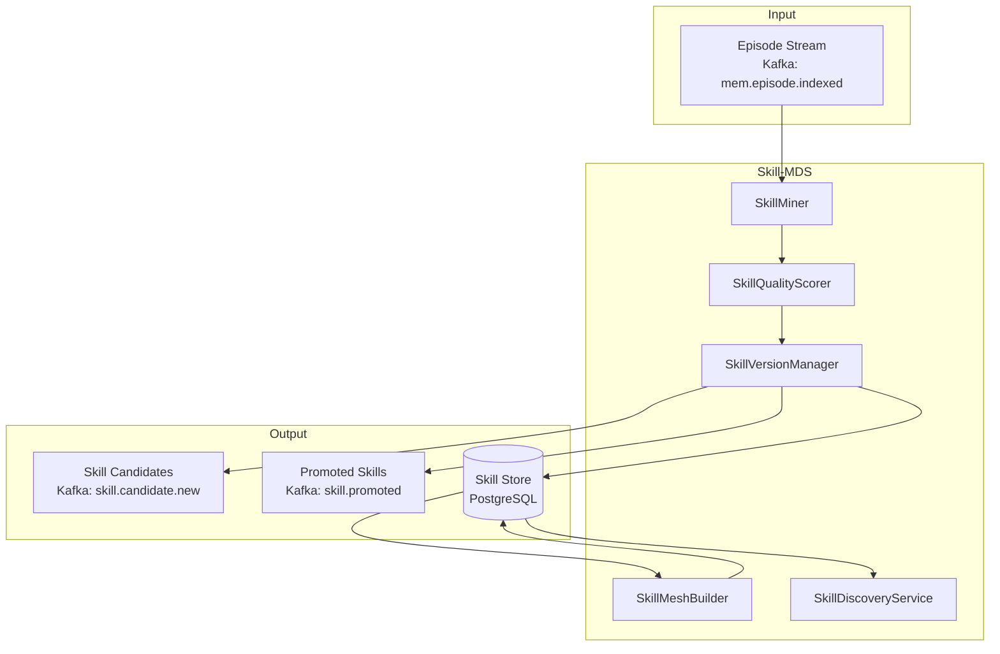
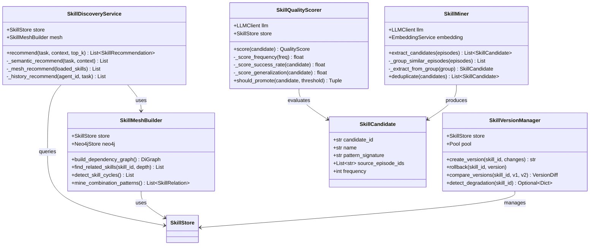
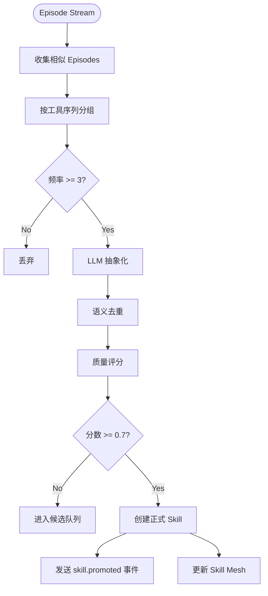

# 04-详细设计-Skill-MDS

## 1. 模块概述

### 1.1 MDS 定义

**MDS = Skill Mining & Discovery Service（技能挖掘与发现服务）**

Skill-MDS 是 Agentic Memory 系统的**技能进化引擎**，负责：
- 从 Episode 自动挖掘可复用技能
- 评估技能质量和泛化能力
- 管理技能版本和降级
- 构建 Skill Mesh（技能关系网络）
- 主动推荐相关技能

### 1.2 业务价值

```
Before: Agent 每次面对相似任务都重新学习
After:  Agent 自动提炼经验，形成可复用技能

Episode Stream → Skill Mining → Skill Library → Agent Reuse
```

### 1.3 架构位置



---

## 2. 技能挖掘流程详细设计

### 2.1 SkillMiner 核心类

```python
# skill_miner.py
"""
Skill Miner - 技能挖掘核心
"""

from typing import List, Dict, Any, Optional, Tuple
from dataclasses import dataclass, field
from datetime import datetime
import json
import hashlib
from collections import defaultdict


@dataclass
class SkillCandidate:
    """技能候选"""
    candidate_id: str
    name: str
    description: str
    code_template: str
    parameters: Dict[str, Any]
    source_episode_ids: List[str]
    pattern_signature: str  # 模式签名，用于去重
    frequency: int = 1
    created_at: datetime = field(default_factory=datetime.utcnow)

    def to_dict(self) -> Dict[str, Any]:
        return {
            "candidate_id": self.candidate_id,
            "name": self.name,
            "description": self.description,
            "code_template": self.code_template,
            "parameters": self.parameters,
            "source_episode_ids": self.source_episode_ids,
            "pattern_signature": self.pattern_signature,
            "frequency": self.frequency,
            "created_at": self.created_at.isoformat()
        }


class SkillMiner:
    """
    技能挖掘器

    从 Episode 流中挖掘技能候选
    """

    MIN_FREQUENCY = 3  # 最小出现频率
    MIN_EPISODES_FOR_MINING = 10  # 开始挖掘的最小 Episode 数

    def __init__(
        self,
        llm_client,
        embedding_service,
        similarity_threshold: float = 0.85
    ):
        self.llm = llm_client
        self.embedding = embedding_service
        self.similarity_threshold = similarity_threshold

        # 模式缓存（用于去重）
        self._pattern_cache: Dict[str, SkillCandidate] = {}

    async def extract_candidates(
        self,
        episodes: List[Dict[str, Any]]
    ) -> List[SkillCandidate]:
        """
        从 Episodes 提取技能候选

        Args:
            episodes: Episode 列表

        Returns:
            技能候选列表
        """
        if len(episodes) < self.MIN_EPISODES_FOR_MINING:
            return []

        # 1. 分组相似 Episode
        episode_groups = await self._group_similar_episodes(episodes)

        candidates = []
        for group in episode_groups:
            if len(group) < self.MIN_FREQUENCY:
                continue

            # 2. 从每组提取技能候选
            candidate = await self._extract_from_group(group)
            if candidate:
                candidates.append(candidate)

        return candidates

    async def _group_similar_episodes(
        self,
        episodes: List[Dict[str, Any]]
    ) -> List[List[Dict[str, Any]]]:
        """
        将相似 Episode 分组

        使用工具调用序列作为分组依据
        """
        groups = defaultdict(list)

        for ep in episodes:
            # 提取工具调用序列签名
            tool_sequence = self._extract_tool_sequence(ep)
            signature = self._hash_sequence(tool_sequence)
            groups[signature].append(ep)

        return list(groups.values())

    def _extract_tool_sequence(self, episode: Dict[str, Any]) -> List[str]:
        """提取工具调用序列"""
        tool_calls = episode.get("tool_calls", [])
        return [tc["tool_name"] for tc in tool_calls]

    def _hash_sequence(self, sequence: List[str]) -> str:
        """序列哈希"""
        return hashlib.sha256(
            json.dumps(sequence, sort_keys=True).encode()
        ).hexdigest()[:16]

    async def _extract_from_group(
        self,
        episodes: List[Dict[str, Any]]
    ) -> Optional[SkillCandidate]:
        """
        从 Episode 组提取技能候选

        使用 LLM 进行抽象化
        """
        # 构建挖掘提示
        prompt = self._build_mining_prompt(episodes)

        # 调用 LLM
        response = await self.llm.ainvoke(prompt)

        # 解析结果
        try:
            result = json.loads(response.content)
        except:
            return None

        # 生成模式签名
        pattern_sig = self._hash_sequence(
            [result.get("tool_sequence", [])]
        )

        # 检查是否已存在
        if pattern_sig in self._pattern_cache:
            existing = self._pattern_cache[pattern_sig]
            existing.frequency += len(episodes)
            existing.source_episode_ids.extend(
                [ep["episode_id"] for ep in episodes]
            )
            return None  # 返回 None，表示已合并

        # 创建新候选
        candidate = SkillCandidate(
            candidate_id=f"cand_{datetime.utcnow().timestamp():.0f}",
            name=result["name"],
            description=result["description"],
            code_template=result["code_template"],
            parameters=result.get("parameters", {}),
            source_episode_ids=[ep["episode_id"] for ep in episodes],
            pattern_signature=pattern_sig,
            frequency=len(episodes)
        )

        self._pattern_cache[pattern_sig] = candidate
        return candidate

    def _build_mining_prompt(self, episodes: List[Dict[str, Any]]) -> str:
        """构建技能挖掘提示"""

        episode_texts = []
        for i, ep in enumerate(episodes[:5], 1):  # 最多 5 个示例
            content = ep.get("content_text", "")[:500]
            tools = ep.get("tool_calls", [])
            tool_desc = "\n".join([
                f"  - {tc['tool_name']}: {tc.get('input_preview', '')}"
                for tc in tools[:3]
            ])
            episode_texts.append(
                f"Example {i}:\nContent: {content}\nTools:\n{tool_desc}"
            )

        episodes_str = "\n\n".join(episode_texts)

        return f"""You are a Skill Mining AI. Analyze the following similar task executions and extract a reusable skill.

{episodes_str}

Based on these examples, extract a reusable skill in the following JSON format:

{{
    "name": "Short skill name (3-5 words)",
    "description": "Detailed description of what this skill does",
    "tool_sequence": ["tool_name_1", "tool_name_2", ...],
    "code_template": "Python-like pseudocode showing the skill implementation",
    "parameters": {{
        "param_name": {{
            "type": "string|number|boolean",
            "description": "Parameter description",
            "required": true|false
        }}
    }}
}}

The skill should:
1. Be general enough to apply to similar tasks
2. Include clear parameter definitions
3. Have a clear goal and success criteria
"""

    async def deduplicate(
        self,
        candidates: List[SkillCandidate]
    ) -> List[SkillCandidate]:
        """
        去重技能候选

        基于语义相似度去重
        """
        if len(candidates) <= 1:
            return candidates

        # 计算嵌入
        embeddings = []
        for cand in candidates:
            text = f"{cand.name} {cand.description}"
            emb = await self.embedding.embed(text)
            embeddings.append(emb)

        # 聚类去重
        unique_candidates = []
        used_indices = set()

        for i, cand in enumerate(candidates):
            if i in used_indices:
                continue

            # 查找相似候选
            for j in range(i + 1, len(candidates)):
                if j in used_indices:
                    continue

                similarity = self._cosine_similarity(
                    embeddings[i], embeddings[j]
                )

                if similarity > self.similarity_threshold:
                    # 合并到第一个
                    cand.frequency += candidates[j].frequency
                    cand.source_episode_ids.extend(
                        candidates[j].source_episode_ids
                    )
                    used_indices.add(j)

            unique_candidates.append(cand)

        return unique_candidates

    def _cosine_similarity(self, a: List[float], b: List[float]) -> float:
        """计算余弦相似度"""
        import numpy as np
        a = np.array(a)
        b = np.array(b)
        return np.dot(a, b) / (np.linalg.norm(a) * np.linalg.norm(b))
```

### 2.2 SKILL_MINING_PROMPT 模板

```python
# prompts.py
"""
Skill Mining Prompts
"""

SKILL_MINING_PROMPT = """You are an expert at identifying reusable patterns from task executions.

## Task
Analyze the following {episode_count} similar task executions and identify a reusable skill.

## Episodes
{episodes}

## Instructions
1. Identify the common goal across these episodes
2. Extract the generalizable procedure (not specific to any single case)
3. Define clear parameters that would allow this skill to be reused
4. Specify success criteria

## Output Format
Return a JSON object with the following structure:

{{
    "name": "skill_name_in_snake_case",
    "description": "Clear description of what this skill accomplishes",
    "category": "data_processing|api_integration|analysis|communication|...",
    "complexity": "simple|moderate|complex",
    "tool_sequence": ["tool_1", "tool_2", ...],
    "code_template": "```python\ndef skill_name(param1, param2):\n    # Implementation\n    ...\n```",
    "parameters": {{
        "param1": {{
            "type": "string|integer|float|boolean|list|dict",
            "description": "What this parameter represents",
            "required": true,
            "default": null,
            "example": "example_value"
        }}
    }},
    "success_criteria": ["criterion_1", "criterion_2"],
    "estimated_cost_usd": 0.01
}}

## Guidelines
- The skill name should be specific but not tied to any particular instance
- Include error handling in the code template
- Parameters should be typed and documented
- Consider edge cases in the success criteria
"""

SKILL_ABSTRACTION_PROMPT = """You are abstracting specific task executions into a general skill.

## Specific Instances
{instances}

## Abstraction Task
Create a generalized version of this skill that could handle similar but not identical tasks.

Focus on:
1. What stays constant across instances (the skill core)
2. What varies (should be parameters)
3. How to validate success regardless of specific inputs

## Output
{format_instructions}
"""
```

---

## 3. 技能质量评估

### 3.1 SkillQualityScorer 实现

```python
# skill_quality_scorer.py
"""
Skill Quality Scorer - 技能质量评估
"""

from typing import Dict, Any, List
from dataclasses import dataclass
from datetime import datetime, timedelta


@dataclass
class QualityScore:
    """质量评分结果"""
    total_score: float  # 0-1
    frequency_score: float  # 0-0.4
    success_rate_score: float  # 0-0.3
    generalization_score: float  # 0-0.2
    documentation_score: float  # 0-0.1
    details: Dict[str, Any]


class SkillQualityScorer:
    """
    技能质量评分器

    多维度评估技能质量
    """

    def __init__(self, llm_client, skill_store):
        self.llm = llm_client
        self.skill_store = skill_store

    async def score(self, candidate: "SkillCandidate") -> QualityScore:
        """
        评估技能候选质量

        Args:
            candidate: 技能候选

        Returns:
            质量评分
        """
        # 1. 复用频率评分 (0-0.4)
        freq_score = self._score_frequency(candidate.frequency)

        # 2. 成功率评分 (0-0.3)
        success_score = await self._score_success_rate(candidate)

        # 3. 泛化度评分 (0-0.2) - LLM 评估
        general_score = await self._score_generalization(candidate)

        # 4. 文档完整性评分 (0-0.1)
        doc_score = self._score_documentation(candidate)

        total = freq_score + success_score + general_score + doc_score

        return QualityScore(
            total_score=total,
            frequency_score=freq_score,
            success_rate_score=success_score,
            generalization_score=general_score,
            documentation_score=doc_score,
            details={
                "frequency": candidate.frequency,
                "evaluation_timestamp": datetime.utcnow().isoformat()
            }
        )

    def _score_frequency(self, frequency: int) -> float:
        """
        频率评分

        频率越高，评分越高，但边际递减
        """
        if frequency >= 20:
            return 0.4
        elif frequency >= 10:
            return 0.35
        elif frequency >= 5:
            return 0.25
        elif frequency >= 3:
            return 0.15
        else:
            return 0.0

    async def _score_success_rate(self, candidate: "SkillCandidate") -> float:
        """
        成功率评分

        基于源 Episode 的成功率
        """
        # 获取源 Episode 的成功率统计
        total = len(candidate.source_episode_ids)
        if total == 0:
            return 0.0

        # 查询每个 Episode 的执行结果
        successful = 0
        for ep_id in candidate.source_episode_ids[:20]:  # 最多查 20 个
            ep = await self.skill_store.get_episode_success(ep_id)
            if ep and ep.get("success", False):
                successful += 1

        success_rate = successful / min(total, 20)

        # 映射到 0-0.3
        return success_rate * 0.3

    async def _score_generalization(self, candidate: "SkillCandidate") -> float:
        """
        泛化度评分

        使用 LLM 评估技能的通用性
        """
        prompt = f"""Rate the generalization potential of this skill on a scale of 0-10.

Skill Name: {candidate.name}
Description: {candidate.description}
Parameters: {candidate.parameters}

Consider:
1. Can this skill handle variations in input?
2. Is it tied to specific contexts or broadly applicable?
3. Would it work across different domains?

Respond with just a number 0-10."""

        response = await self.llm.ainvoke(prompt)

        try:
            score = float(response.content.strip())
            score = max(0, min(10, score))
            return (score / 10) * 0.2
        except:
            return 0.1  # 默认值

    def _score_documentation(self, candidate: "SkillCandidate") -> float:
        """
        文档完整性评分

        检查必要字段的完整性
        """
        score = 0.0

        # 有描述 +0.04
        if candidate.description and len(candidate.description) > 50:
            score += 0.04

        # 有参数定义 +0.03
        if candidate.parameters and len(candidate.parameters) > 0:
            score += 0.03

        # 有代码模板 +0.03
        if candidate.code_template and len(candidate.code_template) > 100:
            score += 0.03

        return score

    async def should_promote(
        self,
        candidate: "SkillCandidate",
        threshold: float = 0.7
    ) -> Tuple[bool, QualityScore]:
        """
        判断是否应晋升为正式技能

        Args:
            candidate: 技能候选
            threshold: 晋升阈值

        Returns:
            (是否晋升, 质量评分)
        """
        score = await self.score(candidate)
        return score.total_score >= threshold, score
```

---

## 4. 技能版本管理

### 4.1 版本表 Schema

```sql
-- skill_versions 表（已在 06-Storage-Schema.md 定义）
CREATE TABLE skill_versions (
    version_id UUID PRIMARY KEY DEFAULT uuid_generate_v4(),
    skill_id UUID NOT NULL REFERENCES skills(skill_id) ON DELETE CASCADE,
    version INTEGER NOT NULL,
    code_template TEXT NOT NULL,
    description TEXT,
    parameters JSONB,
    change_summary TEXT,
    changed_by VARCHAR(100),
    success_rate_at_version FLOAT,
    created_at TIMESTAMPTZ DEFAULT NOW(),
    UNIQUE(skill_id, version)
);
```

### 4.2 SkillVersionManager 实现

```python
# skill_version_manager.py
"""
Skill Version Manager - 技能版本管理
"""

from typing import List, Optional, Dict, Any
from dataclasses import dataclass
from datetime import datetime
import json
import difflib


@dataclass
class VersionDiff:
    """版本差异"""
    added_lines: List[str]
    removed_lines: List[str]
    modified_parameters: List[Dict[str, Any]]
    summary: str


class SkillVersionManager:
    """
    技能版本管理器

    管理技能版本历史和降级
    """

    def __init__(self, skill_store, pool):
        self.store = skill_store
        self.pool = pool

    async def create_version(
        self,
        skill_id: str,
        changes: Dict[str, Any],
        changed_by: str = "system"
    ) -> str:
        """
        创建新版本

        Args:
            skill_id: 技能 ID
            changes: 变更内容
            changed_by: 变更者

        Returns:
            version_id
        """
        # 获取当前技能
        skill = await self.store.get_skill(skill_id)
        if not skill:
            raise ValueError(f"Skill not found: {skill_id}")

        # 获取当前最新版本
        current_version = await self._get_latest_version(skill_id)
        new_version = current_version + 1

        # 记录旧版本
        await self._archive_current_version(skill, current_version)

        # 生成变更摘要
        change_summary = self._generate_change_summary(skill, changes)

        # 插入版本记录
        sql = """
        INSERT INTO skill_versions (
            skill_id, version, code_template, description,
            parameters, change_summary, changed_by, success_rate_at_version
        ) VALUES ($1, $2, $3, $4, $5, $6, $7, $8)
        RETURNING version_id
        """

        async with self.pool.acquire() as conn:
            version_id = await conn.fetchval(
                sql,
                skill_id,
                new_version,
                changes.get("code_template", skill.code_template),
                changes.get("description", skill.description),
                json.dumps(changes.get("parameters", skill.parameters)),
                change_summary,
                changed_by,
                skill.success_rate
            )

        # 更新主表
        await self.store.update_skill(skill_id, {
            "version": new_version,
            **changes
        })

        return str(version_id)

    async def _get_latest_version(self, skill_id: str) -> int:
        """获取最新版本号"""
        sql = """
        SELECT COALESCE(MAX(version), 0) as max_version
        FROM skill_versions
        WHERE skill_id = $1
        """

        async with self.pool.acquire() as conn:
            row = await conn.fetchrow(sql, skill_id)
            return row["max_version"]

    async def _archive_current_version(self, skill, version: int):
        """归档当前版本"""
        # 第一个版本不需要归档
        if version == 0:
            return

        sql = """
        INSERT INTO skill_versions (
            skill_id, version, code_template, description,
            parameters, change_summary, changed_by, success_rate_at_version
        ) VALUES ($1, $2, $3, $4, $5, $6, $7, $8)
        """

        async with self.pool.acquire() as conn:
            await conn.execute(
                sql,
                skill.skill_id,
                version,
                skill.code_template,
                skill.description,
                json.dumps(skill.parameters),
                "Archived version",
                "system",
                skill.success_rate
            )

    def _generate_change_summary(
        self,
        old_skill,
        changes: Dict[str, Any]
    ) -> str:
        """生成变更摘要"""
        summaries = []

        if "code_template" in changes:
            diff = list(difflib.unified_diff(
                old_skill.code_template.splitlines(),
                changes["code_template"].splitlines(),
                lineterm=""
            ))
            summaries.append(f"Code changed ({len(diff)} lines diff)")

        if "description" in changes:
            summaries.append("Description updated")

        if "parameters" in changes:
            old_params = set(old_skill.parameters.keys())
            new_params = set(changes["parameters"].keys())
            added = new_params - old_params
            removed = old_params - new_params

            if added:
                summaries.append(f"Parameters added: {', '.join(added)}")
            if removed:
                summaries.append(f"Parameters removed: {', '.join(removed)}")

        return "; ".join(summaries) if summaries else "Minor updates"

    async def rollback(self, skill_id: str, version: int):
        """
        回滚到指定版本

        Args:
            skill_id: 技能 ID
            version: 目标版本号
        """
        # 获取目标版本
        sql = """
        SELECT * FROM skill_versions
        WHERE skill_id = $1 AND version = $2
        """

        async with self.pool.acquire() as conn:
            row = await conn.fetchrow(sql, skill_id, version)

        if not row:
            raise ValueError(f"Version {version} not found for skill {skill_id}")

        # 创建新版本（回滚操作）
        await self.create_version(
            skill_id=skill_id,
            changes={
                "code_template": row["code_template"],
                "description": row["description"],
                "parameters": row["parameters"]
            },
            changed_by=f"rollback_from_v{await self._get_latest_version(skill_id)}"
        )

    async def compare_versions(
        self,
        skill_id: str,
        v1: int,
        v2: int
    ) -> VersionDiff:
        """
        比较两个版本

        Args:
            skill_id: 技能 ID
            v1: 版本 1
            v2: 版本 2

        Returns:
            版本差异
        """
        sql = """
        SELECT version, code_template, parameters
        FROM skill_versions
        WHERE skill_id = $1 AND version IN ($2, $3)
        ORDER BY version
        """

        async with self.pool.acquire() as conn:
            rows = await conn.fetch(sql, skill_id, v1, v2)

        if len(rows) != 2:
            raise ValueError("One or both versions not found")

        row1, row2 = rows

        # 计算代码差异
        code1 = row1["code_template"].splitlines()
        code2 = row2["code_template"].splitlines()

        diff = list(difflib.unified_diff(code1, code2, lineterm=""))

        added = [line[1:] for line in diff if line.startswith("+") and not line.startswith("+++")]
        removed = [line[1:] for line in diff if line.startswith("-") and not line.startswith("---")]

        # 计算参数差异
        params1 = row1["parameters"] or {}
        params2 = row2["parameters"] or {}

        param_diffs = []
        all_keys = set(params1.keys()) | set(params2.keys())
        for key in all_keys:
            if key not in params1:
                param_diffs.append({"action": "added", "param": key, "value": params2[key]})
            elif key not in params2:
                param_diffs.append({"action": "removed", "param": key})
            elif params1[key] != params2[key]:
                param_diffs.append({
                    "action": "modified",
                    "param": key,
                    "from": params1[key],
                    "to": params2[key]
                })

        return VersionDiff(
            added_lines=added,
            removed_lines=removed,
            modified_parameters=param_diffs,
            summary=f"{len(added)} lines added, {len(removed)} lines removed, {len(param_diffs)} param changes"
        )

    async def detect_degradation(
        self,
        skill_id: str,
        window_size: int = 10
    ) -> Optional[Dict[str, Any]]:
        """
        检测技能降级

        当最近成功率显著低于历史均值时触发

        Args:
            skill_id: 技能 ID
            window_size: 最近执行窗口大小

        Returns:
            降级信息或 None
        """
        sql = """
        WITH recent_executions AS (
            SELECT success, executed_at
            FROM skill_executions
            WHERE skill_id = $1
            ORDER BY executed_at DESC
            LIMIT $2
        ),
        historical_stats AS (
            SELECT
                AVG(CASE WHEN success THEN 1.0 ELSE 0.0 END) as historical_rate
            FROM skill_executions
            WHERE skill_id = $1
        ),
        recent_stats AS (
            SELECT
                AVG(CASE WHEN success THEN 1.0 ELSE 0.0 END) as recent_rate
            FROM recent_executions
        )
        SELECT
            h.historical_rate,
            r.recent_rate,
            (h.historical_rate - r.recent_rate) as degradation
        FROM historical_stats h, recent_stats r
        """

        async with self.pool.acquire() as conn:
            row = await conn.fetchrow(sql, skill_id, window_size)

        if not row or row["historical_rate"] is None:
            return None

        historical = row["historical_rate"]
        recent = row["recent_rate"] or 0
        degradation = row["degradation"] or 0

        # 如果最近成功率低于历史均值 20% 以上，触发降级
        if degradation > 0.2 and recent < historical * 0.8:
            return {
                "skill_id": skill_id,
                "historical_rate": historical,
                "recent_rate": recent,
                "degradation": degradation,
                "triggered_at": datetime.utcnow().isoformat(),
                "recommended_action": "rollback" if degradation > 0.3 else "review"
            }

        return None
```

---

## 5. Skill Mesh（技能关系图）

### 5.1 SkillMeshBuilder 实现

```python
# skill_mesh_builder.py
"""
Skill Mesh Builder - 技能关系图构建
"""

from typing import List, Dict, Any, Set, Tuple
from dataclasses import dataclass
from collections import defaultdict
import networkx as nx


@dataclass
class SkillRelation:
    """技能关系"""
    from_skill_id: str
    to_skill_id: str
    relation_type: str  # DEPENDS_ON, OFTEN_COMBINED, SUPERSEDES, SPECIALIZES
    weight: float
    evidence_count: int = 1


class SkillMeshBuilder:
    """
    技能网格构建器

    构建技能之间的关系网络
    """

    RELATION_TYPES = {
        "DEPENDS_ON": "依赖关系",
        "OFTEN_COMBINED": "经常组合使用",
        "SUPERSEDES": "替代关系",
        "SPECIALIZES": "特化关系",
        "CONFLICTS_WITH": "冲突关系"
    }

    def __init__(self, skill_store, neo4j_store):
        self.skill_store = skill_store
        self.neo4j = neo4j_store

    async def build_dependency_graph(self) -> nx.DiGraph:
        """
        构建依赖图

        Returns:
            NetworkX 有向图
        """
        G = nx.DiGraph()

        # 获取所有技能
        skills = await self.skill_store.get_all_skills()

        # 添加节点
        for skill in skills:
            G.add_node(
                skill.skill_id,
                name=skill.name,
                success_rate=skill.success_rate
            )

        # 添加依赖边
        for skill in skills:
            for dep_id in skill.dependencies:
                if G.has_node(dep_id):
                    G.add_edge(
                        skill.skill_id,
                        dep_id,
                        relation_type="DEPENDS_ON",
                        weight=1.0
                    )

        return G

    async def find_related_skills(
        self,
        skill_id: str,
        depth: int = 2,
        min_weight: float = 0.5
    ) -> List[Dict[str, Any]]:
        """
        查找相关技能

        Args:
            skill_id: 起始技能
            depth: 遍历深度
            min_weight: 最小关系权重

        Returns:
            相关技能列表
        """
        G = await self.build_dependency_graph()

        if skill_id not in G:
            return []

        # BFS 遍历
        related = []
        visited = {skill_id}
        queue = [(skill_id, 0)]

        while queue:
            current, dist = queue.pop(0)

            if dist >= depth:
                continue

            for neighbor in G.neighbors(current):
                if neighbor in visited:
                    continue

                edge_data = G.get_edge_data(current, neighbor)
                weight = edge_data.get("weight", 0)

                if weight >= min_weight:
                    visited.add(neighbor)
                    queue.append((neighbor, dist + 1))

                    skill = await self.skill_store.get_skill(neighbor)
                    related.append({
                        "skill_id": neighbor,
                        "name": skill.name if skill else "Unknown",
                        "distance": dist + 1,
                        "relation_type": edge_data.get("relation_type"),
                        "weight": weight
                    })

        return sorted(related, key=lambda x: x["weight"], reverse=True)

    async def detect_skill_cycles(self) -> List[List[str]]:
        """
        检测技能依赖循环

        Returns:
            循环列表，每个循环是技能 ID 列表
        """
        G = await self.build_dependency_graph()

        try:
            cycles = list(nx.simple_cycles(G))
            return cycles
        except:
            return []

    async def mine_combination_patterns(self) -> List[SkillRelation]:
        """
        挖掘技能组合模式

        分析 Episode，找出经常一起使用的技能
        """
        # 查询 Episode 中的技能使用序列
        sql = """
        SELECT episode_id, array_agg(skill_id ORDER BY executed_at) as skill_sequence
        FROM skill_executions
        WHERE executed_at > NOW() - INTERVAL '30 days'
        GROUP BY episode_id
        HAVING COUNT(*) > 1
        """

        async with self.skill_store.pool.acquire() as conn:
            rows = await conn.fetch(sql)

        # 统计共现频率
        cooccurrence = defaultdict(lambda: defaultdict(int))

        for row in rows:
            sequence = row["skill_sequence"]
            for i, skill1 in enumerate(sequence):
                for skill2 in sequence[i+1:]:
                    if skill1 != skill2:
                        cooccurrence[skill1][skill2] += 1
                        cooccurrence[skill2][skill1] += 1

        # 生成关系
        relations = []
        threshold = 3  # 最小共现次数

        for skill1, others in cooccurrence.items():
            for skill2, count in others.items():
                if count >= threshold and skill1 < skill2:  # 避免重复
                    relations.append(SkillRelation(
                        from_skill_id=skill1,
                        to_skill_id=skill2,
                        relation_type="OFTEN_COMBINED",
                        weight=min(count / 10, 1.0),  # 归一化
                        evidence_count=count
                    ))

        return relations

    async def update_skill_relations(self, relations: List[SkillRelation]):
        """更新技能关系到数据库"""
        sql = """
        INSERT INTO skill_relations
        (from_skill_id, to_skill_id, relation_type, weight, evidence_count)
        VALUES ($1, $2, $3, $4, $5)
        ON CONFLICT (from_skill_id, to_skill_id, relation_type)
        DO UPDATE SET
            weight = EXCLUDED.weight,
            evidence_count = skill_relations.evidence_count + EXCLUDED.evidence_count,
            created_at = NOW()
        """

        async with self.skill_store.pool.acquire() as conn:
            for rel in relations:
                await conn.execute(
                    sql,
                    rel.from_skill_id,
                    rel.to_skill_id,
                    rel.relation_type,
                    rel.weight,
                    rel.evidence_count
                )

    async def sync_to_neo4j(self):
        """同步技能关系到 Neo4j"""
        # 获取所有关系
        sql = "SELECT * FROM skill_relations"

        async with self.skill_store.pool.acquire() as conn:
            rows = await conn.fetch(sql)

        # 构建 Cypher 查询
        for row in rows:
            cypher = """
            MATCH (s1:Skill {skill_id: $from_id})
            MATCH (s2:Skill {skill_id: $to_id})
            MERGE (s1)-[r:$relation_type]->(s2)
            SET r.weight = $weight, r.evidence_count = $evidence_count
            """

            await self.neo4j.run(cypher, {
                "from_id": row["from_skill_id"],
                "to_id": row["to_skill_id"],
                "relation_type": row["relation_type"],
                "weight": row["weight"],
                "evidence_count": row["evidence_count"]
            })
```

### 5.2 Neo4j Cypher 查询示例

```cypher
// 技能推荐查询（基于 Skill Mesh）
MATCH (s:Skill {skill_id: $skill_id})-[r:OFTEN_COMBINED]->(related:Skill)
WHERE r.weight > 0.5
RETURN related.skill_id, related.name, r.weight
ORDER BY r.weight DESC
LIMIT 5;

// 依赖路径查询
MATCH path = shortestPath(
    (start:Skill {skill_id: $start_id})-[:DEPENDS_ON*]->(end:Skill {skill_id: $end_id})
)
RETURN [n in nodes(path) | n.name] as dependency_path;

// 技能影响分析
MATCH (s:Skill)-[:SUPERSEDES]->(old:Skill)
WHERE s.skill_id = $skill_id
RETURN old.skill_id, old.name, old.usage_count as affected_usage;
```

---

## 6. 技能发现（Skill Discovery）

### 6.1 SkillDiscoveryService 实现

```python
# skill_discovery_service.py
"""
Skill Discovery Service - 技能主动发现
"""

from typing import List, Dict, Any, Optional
from dataclasses import dataclass
import json


@dataclass
class SkillRecommendation:
    """技能推荐"""
    skill_id: str
    name: str
    description: str
    confidence: float
    reason: str
    estimated_benefit: str


class SkillDiscoveryService:
    """
    技能发现服务

    根据当前任务主动推荐相关技能
    """

    def __init__(
        self,
        skill_store,
        skill_mesh_builder,
        embedding_service,
        llm_client
    ):
        self.skill_store = skill_store
        self.mesh = skill_mesh_builder
        self.embedding = embedding_service
        self.llm = llm_client

    async def recommend(
        self,
        task_description: str,
        agent_context: Dict[str, Any],
        top_k: int = 5
    ) -> List[SkillRecommendation]:
        """
        推荐技能

        Args:
            task_description: 任务描述
            agent_context: Agent 上下文（当前加载的技能、历史使用等）
            top_k: 推荐数量

        Returns:
            推荐列表
        """
        recommendations = []

        # 1. 语义相似度推荐
        semantic_recs = await self._semantic_recommend(
            task_description, agent_context, top_k
        )
        recommendations.extend(semantic_recs)

        # 2. 基于 Skill Mesh 的关联推荐
        if agent_context.get("loaded_skills"):
            mesh_recs = await self._mesh_recommend(
                agent_context["loaded_skills"], top_k
            )
            recommendations.extend(mesh_recs)

        # 3. 历史使用模式推荐
        if agent_context.get("agent_id"):
            history_recs = await self._history_recommend(
                agent_context["agent_id"],
                task_description,
                top_k
            )
            recommendations.extend(history_recs)

        # 去重并排序
        unique_recs = self._deduplicate_recommendations(recommendations)
        unique_recs.sort(key=lambda x: x.confidence, reverse=True)

        return unique_recs[:top_k]

    async def _semantic_recommend(
        self,
        task_description: str,
        agent_context: Dict[str, Any],
        top_k: int
    ) -> List[SkillRecommendation]:
        """基于语义相似度推荐"""
        skills = await self.skill_store.search_by_similarity(
            query=task_description,
            top_k=top_k,
            agent_id=agent_context.get("agent_id")
        )

        return [
            SkillRecommendation(
                skill_id=s.skill_id,
                name=s.name,
                description=s.description,
                confidence=s.similarity_score,
                reason="Semantic match with task description",
                estimated_benefit=f"{s.success_rate:.0%} historical success rate"
            )
            for s in skills
        ]

    async def _mesh_recommend(
        self,
        loaded_skills: List[str],
        top_k: int
    ) -> List[SkillRecommendation]:
        """基于 Skill Mesh 推荐"""
        all_related = []

        for skill_id in loaded_skills:
            related = await self.mesh.find_related_skills(
                skill_id=skill_id,
                depth=2,
                min_weight=0.3
            )
            all_related.extend(related)

        # 按权重排序
        all_related.sort(key=lambda x: x["weight"], reverse=True)

        recommendations = []
        seen = set(loaded_skills)

        for rel in all_related[:top_k * 2]:
            if rel["skill_id"] in seen:
                continue
            seen.add(rel["skill_id"])

            skill = await self.skill_store.get_skill(rel["skill_id"])
            if skill:
                recommendations.append(SkillRecommendation(
                    skill_id=skill.skill_id,
                    name=skill.name,
                    description=skill.description,
                    confidence=rel["weight"],
                    reason=f"Often combined with {rel.get('source_skill', 'current skills')}",
                    estimated_benefit="Frequently used together"
                ))

        return recommendations[:top_k]

    async def _history_recommend(
        self,
        agent_id: str,
        task_description: str,
        top_k: int
    ) -> List[SkillRecommendation]:
        """基于历史使用模式推荐"""
        # 查询 Agent 在相似任务中使用的技能
        sql = """
        WITH task_embedding AS (
            SELECT embedding FROM task_embeddings WHERE task_desc = $task_desc
        )
        SELECT
            se.skill_id,
            s.name,
            s.description,
            COUNT(*) as usage_count,
            AVG(CASE WHEN se.success THEN 1.0 ELSE 0.0 END) as success_rate
        FROM skill_executions se
        JOIN skills s ON se.skill_id = s.skill_id
        WHERE se.agent_id = $agent_id
          AND se.executed_at > NOW() - INTERVAL '30 days'
        GROUP BY se.skill_id, s.name, s.description
        ORDER BY usage_count DESC, success_rate DESC
        LIMIT $limit
        """

        async with self.skill_store.pool.acquire() as conn:
            rows = await conn.fetch(sql, agent_id, task_description, top_k)

        return [
            SkillRecommendation(
                skill_id=str(row["skill_id"]),
                name=row["name"],
                description=row["description"],
                confidence=min(row["usage_count"] / 10, 0.9),
                reason="Frequently used in similar tasks",
                estimated_benefit=f"Used {row['usage_count']} times with {row['success_rate']:.0%} success"
            )
            for row in rows
        ]

    def _deduplicate_recommendations(
        self,
        recommendations: List[SkillRecommendation]
    ) -> List[SkillRecommendation]:
        """去重推荐"""
        seen = {}
        unique = []

        for rec in recommendations:
            if rec.skill_id in seen:
                # 保留置信度更高的
                if rec.confidence > seen[rec.skill_id]:
                    seen[rec.skill_id] = rec.confidence
            else:
                seen[rec.skill_id] = rec.confidence
                unique.append(rec)

        return unique
```

---

## 7. Kafka 集成

### 7.1 Consumer 实现

```python
# kafka_consumer.py
"""
Skill-MDS Kafka Consumer
"""

import asyncio
import json
from aiokafka import AIOKafkaConsumer


class SkillMDSKafkaConsumer:
    """Skill-MDS Kafka 消费者"""

    def __init__(
        self,
        bootstrap_servers: str,
        skill_miner,
        skill_quality_scorer,
        skill_version_manager
    ):
        self.bootstrap_servers = bootstrap_servers
        self.miner = skill_miner
        self.scorer = skill_quality_scorer
        self.version_manager = skill_version_manager
        self.consumer: AIOKafkaConsumer = None

    async def start(self):
        """启动消费者"""
        self.consumer = AIOKafkaConsumer(
            "mem.episode.indexed",  # 输入 Topic
            bootstrap_servers=self.bootstrap_servers,
            group_id="skill-mds-consumers",
            value_deserializer=lambda m: json.loads(m.decode("utf-8"))
        )

        await self.consumer.start()

        try:
            async for msg in self.consumer:
                await self._process_message(msg)
        finally:
            await self.consumer.stop()

    async def _process_message(self, msg):
        """处理消息"""
        episode = msg.value

        # 检查是否应该触发挖掘
        if self._should_mine():
            await self._trigger_mining()

        # 检查是否需要降级检测
        if episode.get("skill_id"):
            degradation = await self.version_manager.detect_degradation(
                episode["skill_id"]
            )
            if degradation:
                # 发送降级告警
                await self._send_alert(degradation)

    def _should_mine(self) -> bool:
        """判断是否应触发挖掘"""
        # 简单策略：随机采样
        import random
        return random.random() < 0.1  # 10% 概率

    async def _trigger_mining(self):
        """触发技能挖掘"""
        # 获取最近的 Episodes
        episodes = await self._get_recent_episodes()

        # 挖掘候选
        candidates = await self.miner.extract_candidates(episodes)
        candidates = await self.miner.deduplicate(candidates)

        for candidate in candidates:
            # 评估质量
            should_promote, score = await self.scorer.should_promote(
                candidate, threshold=0.7
            )

            if should_promote:
                # 创建技能
                skill_id = await self._create_skill(candidate, score)

                # 发送晋升事件
                await self._send_promotion_event(candidate, skill_id)

    async def _get_recent_episodes(self) -> List[Dict]:
        """获取最近 Episodes"""
        # 实际应从数据库查询
        return []

    async def _create_skill(
        self,
        candidate: "SkillCandidate",
        score: "QualityScore"
    ) -> str:
        """创建技能"""
        from skill_schema import Skill

        skill = Skill(
            name=candidate.name,
            description=candidate.description,
            code_template=candidate.code_template,
            parameters=candidate.parameters
        )

        return await self.skill_store.create_skill(skill)

    async def _send_promotion_event(self, candidate, skill_id: str):
        """发送技能晋升事件"""
        # 发送到 Kafka
        event = {
            "event_type": "skill_promoted",
            "candidate_id": candidate.candidate_id,
            "skill_id": skill_id,
            "name": candidate.name,
            "source_episode_count": len(candidate.source_episode_ids),
            "timestamp": datetime.utcnow().isoformat()
        }

        # 发送到 skill.promoted topic
        print(f"[Kafka] skill.promoted: {event}")

    async def _send_alert(self, degradation: Dict):
        """发送降级告警"""
        print(f"[ALERT] Skill degradation detected: {degradation}")
```

---

## 8. UML 图

### 8.1 类图



### 8.2 流程图



---

## 9. 单元测试

```python
# test_skill_mds.py
"""
Skill-MDS 单元测试
"""

import pytest
from unittest.mock import Mock, AsyncMock

from skill_miner import SkillMiner, SkillCandidate
from skill_quality_scorer import SkillQualityScorer, QualityScore
from skill_version_manager import SkillVersionManager
from skill_mesh_builder import SkillMeshBuilder
from skill_discovery_service import SkillDiscoveryService


# ============================================
# SkillMiner 测试
# ============================================

@pytest.fixture
def skill_miner():
    """SkillMiner fixture"""
    mock_llm = Mock(ainvoke=AsyncMock(return_value=Mock(
        content='{"name": "test_skill", "description": "Test", "code_template": "pass", "parameters": {}}'
    )))
    mock_embedding = Mock(embed=AsyncMock(return_value=[0.1] * 1536))

    return SkillMiner(mock_llm, mock_embedding)


@pytest.mark.asyncio
async def test_extract_candidates_insufficient_episodes(skill_miner):
    """测试 Episode 不足时返回空"""
    episodes = [{"episode_id": "1"}]  # 少于 MIN_EPISODES_FOR_MINING
    candidates = await skill_miner.extract_candidates(episodes)
    assert len(candidates) == 0


@pytest.mark.asyncio
async def test_deduplicate_candidates(skill_miner):
    """测试候选去重"""
    candidates = [
        SkillCandidate(
            candidate_id="c1",
            name="skill_a",
            description="Description A",
            code_template="code",
            parameters={},
            source_episode_ids=["ep1", "ep2"],
            pattern_signature="sig1"
        ),
        SkillCandidate(
            candidate_id="c2",
            name="skill_b",
            description="Description B",
            code_template="code",
            parameters={},
            source_episode_ids=["ep3"],
            pattern_signature="sig2"
        )
    ]

    unique = await skill_miner.deduplicate(candidates)
    assert len(unique) <= len(candidates)


# ============================================
# SkillQualityScorer 测试
# ============================================

@pytest.mark.asyncio
async def test_score_frequency():
    """测试频率评分"""
    scorer = SkillQualityScorer(Mock(), Mock())

    assert scorer._score_frequency(25) == 0.4
    assert scorer._score_frequency(15) == 0.35
    assert scorer._score_frequency(7) == 0.25
    assert scorer._score_frequency(1) == 0.0


@pytest.mark.asyncio
async def test_score_documentation():
    """测试文档评分"""
    scorer = SkillQualityScorer(Mock(), Mock())

    candidate = Mock(
        description="A" * 100,  # > 50 chars
        parameters={"p1": {}},
        code_template="A" * 150  # > 100 chars
    )

    score = scorer._score_documentation(candidate)
    assert score == 0.1  # 满分


@pytest.mark.asyncio
async def test_should_promote():
    """测试晋升判断"""
    scorer = SkillQualityScorer(Mock(), Mock())

    # Mock score method
    scorer.score = AsyncMock(return_value=QualityScore(
        total_score=0.8,
        frequency_score=0.4,
        success_rate_score=0.24,
        generalization_score=0.1,
        documentation_score=0.06,
        details={}
    ))

    candidate = Mock()
    should_promote, score = await scorer.should_promote(candidate, threshold=0.7)

    assert should_promote is True
    assert score.total_score == 0.8


# ============================================
# SkillDiscoveryService 测试
# ============================================

@pytest.mark.asyncio
async def test_deduplicate_recommendations():
    """测试推荐去重"""
    from skill_discovery_service import SkillRecommendation

    service = SkillDiscoveryService(Mock(), Mock(), Mock(), Mock())

    recommendations = [
        SkillRecommendation("s1", "Skill 1", "Desc", 0.9, "reason", "benefit"),
        SkillRecommendation("s2", "Skill 2", "Desc", 0.8, "reason", "benefit"),
        SkillRecommendation("s1", "Skill 1", "Desc", 0.95, "better reason", "benefit")
    ]

    unique = service._deduplicate_recommendations(recommendations)

    assert len(unique) == 2
    # 应保留 s1 的第一个出现（实际实现可能不同）


if __name__ == "__main__":
    pytest.main([__file__, "-v"])
```

---

## 10. 总结

本文档详细定义了 Skill-MDS 的设计：

1. **SkillMiner**：从 Episode 流中挖掘技能候选，支持去重和抽象化
2. **SkillQualityScorer**：4 维度质量评估（频率、成功率、泛化度、文档）
3. **SkillVersionManager**：版本控制、回滚、降级检测
4. **SkillMeshBuilder**：技能关系网络，支持依赖分析和循环检测
5. **SkillDiscoveryService**：主动推荐相关技能
6. **Kafka 集成**：消费 Episode，生产 Skill 事件

所有组件均提供完整的 Python 实现和 pytest 测试。
