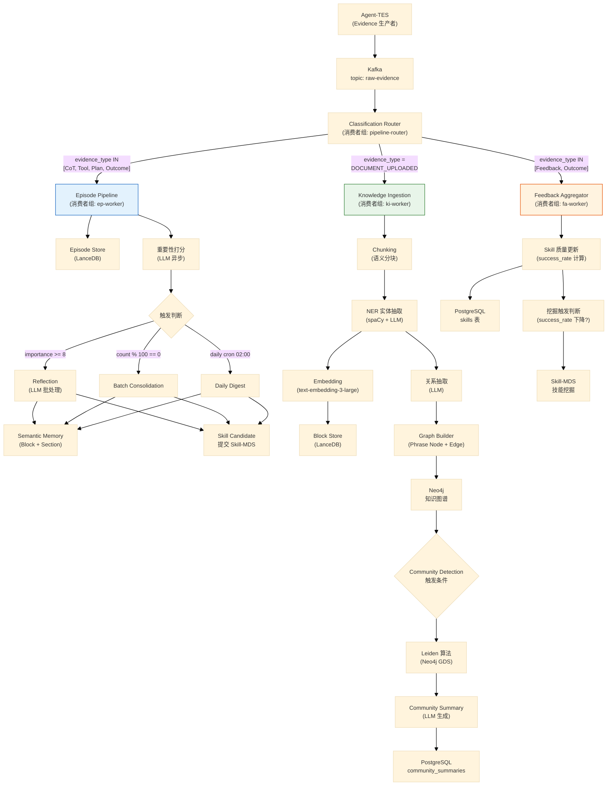
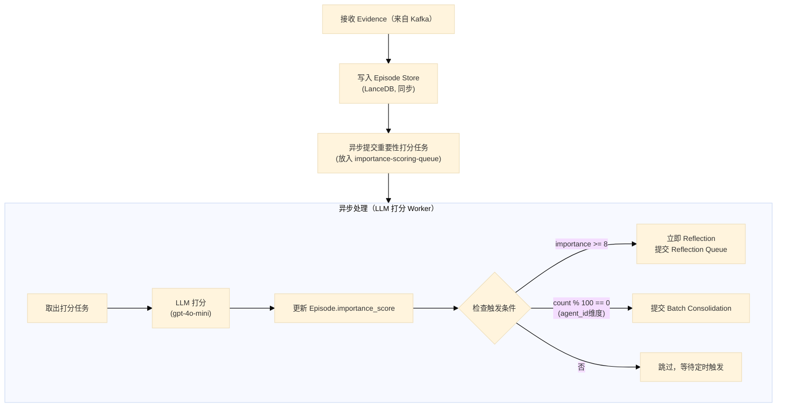
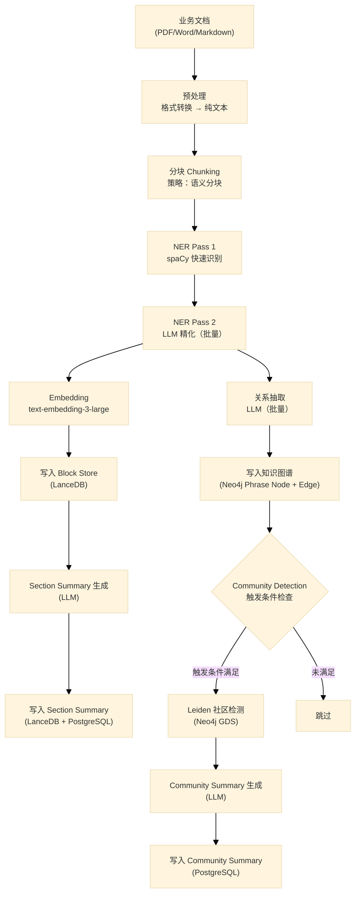
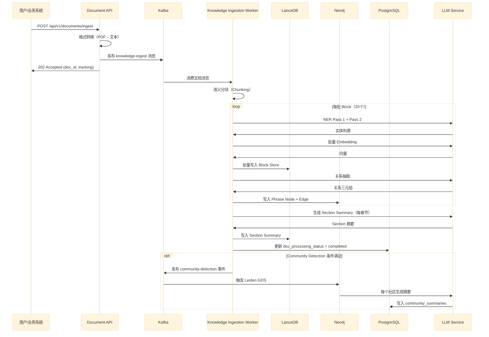

# Memory Processing Pipeline — 详细设计

> **所属方案**: 版本A
> **文档编号**: 05
> **模块**: Memory Processing Pipeline
> **依赖**: 02-Agent-TES（数据来源）、03-Memory-System（数据目标）、04-Skill-MDS（触发技能挖掘）

---

## 第一章：管道总体设计

### 1.1 职责定位

Memory Processing Pipeline 是整个架构的**知识加工厂**：将 Agent-TES 采集的原始证据（Evidence）转化为结构化的、可被检索的记忆。

它是一个**异步流式处理系统**，以 Kafka 为中枢，由多个 Worker 组成。

```
Agent-TES（生产者）
    │
    ▼ Kafka topic: raw-evidence
┌───────────────────────────────────────────────┐
│          Memory Processing Pipeline            │
│                                               │
│   ┌─────────────────────────────────────┐     │
│   │  Stage 0: Classification Router      │     │
│   │  按 evidence_type 分发到子管道       │     │
│   └──┬──────────────┬──────────────┬────┘     │
│      ▼              ▼              ▼           │
│  ┌───────┐     ┌─────────┐  ┌──────────┐      │
│  │Episode│     │Knowledge│  │Feedback  │      │
│  │Pipeline     │Ingestion│  │Aggregator│      │
│  └───┬───┘     └────┬────┘  └────┬─────┘      │
│      │              │            │            │
└──────┼──────────────┼────────────┼────────────┘
       ▼              ▼            ▼
  Episode Store  Semantic Memory  Skill Quality
  (LanceDB)      (Block+Graph)    (PostgreSQL)
```

### 1.2 三大子管道职责

| 子管道 | 输入 | 输出 | 触发方式 |
|--------|------|------|---------|
| **Episode Pipeline** | `LLM_CoT`、`TOOL_CALL`、`USER_FEEDBACK`、`PLAN`、`OUTCOME` 类型证据 | L2 Episode Store，触发 Reflection/Consolidation | 实时（每条 Evidence 到达即处理）|
| **Knowledge Ingestion Pipeline** | `DOCUMENT_UPLOADED`、`KNOWLEDGE_UPDATE` 类型事件 | L4 Semantic Memory（Block + Phrase Node + Community）| 批量（文档上传触发）|
| **Feedback Aggregator** | `USER_FEEDBACK`、`OUTCOME` 类型证据 | Skill 质量指标更新，触发 Skill 挖掘 | 实时 |

### 1.3 整体数据流 Mermaid 图



---

## 第二章：Episode Pipeline 详细设计

### 2.1 处理流程



### 2.2 重要性打分 LLM Prompt

```python
IMPORTANCE_SCORING_PROMPT = """
你是一个 Agent 记忆系统的评分助手。请对以下 Agent 执行记录评分其"记忆价值"（1-10分）。

评分标准：
- 1-3分：常规操作，无特殊价值（如每天都会发生的普通查询）
- 4-6分：有一定复用价值，但不紧急（如成功完成了一个标准流程）
- 7-8分：重要经验，值得记忆（如首次解决某类复杂问题、发现新的处理模式）
- 9-10分：极高价值，必须记忆（如重大失败的根因分析、罕见的关键知识）

执行记录：
- 类型: {evidence_type}
- 任务目标: {goal}
- 执行过程摘要: {reasoning_summary}
- 结果: {outcome}
- 用户反馈: {user_feedback}

请直接输出一个 1-10 的整数分数，不要有其他文字。
"""

async def score_importance(evidence: Evidence) -> float:
    prompt = IMPORTANCE_SCORING_PROMPT.format(
        evidence_type=evidence.evidence_type,
        goal=evidence.content.get("goal", "未知"),
        reasoning_summary=evidence.content.get("thought_process", "")[:500],
        outcome=evidence.outcome.get("status", "unknown"),
        user_feedback=evidence.outcome.get("user_feedback", "neutral")
    )
    response = await llm_client.complete(prompt, model="gpt-4o-mini", max_tokens=5)
    try:
        score = float(response.strip())
        return max(1.0, min(10.0, score))
    except ValueError:
        return 5.0  # 默认中等重要性
```

### 2.3 Reflection（反思）流程

触发条件：importance_score >= 8，或手动调用 `memory.reflect()`

```python
REFLECTION_PROMPT = """
以下是 Agent "{agent_id}" 的 {n} 条高价值执行记录：

{episodes_formatted}

请从中提炼：
1. **高阶洞察**（Insights）: 从这些经历中总结出的规律或原则（1-5条）
2. **技能候选**（Skill Candidates）: 可以被标准化复用的处理模式（0-3条）
   - 每个技能候选包含：名称、适用条件、处理步骤
3. **需要避免的陷阱**（Pitfalls）: 反复出现的失败原因（0-3条）
4. **知识更新**（Knowledge Updates）: 需要写入知识库的新事实（0-5条）

以 JSON 格式输出，严格遵循以下结构：
{
    "insights": [{"content": "...", "confidence": 0.9}],
    "skill_candidates": [{
        "name": "...",
        "preconditions": ["..."],
        "steps": ["..."],
        "source_episode_ids": ["..."]
    }],
    "pitfalls": [{"description": "...", "avoidance": "..."}],
    "knowledge_updates": [{"content": "...", "category": "fact|rule|policy"}]
}
"""

class ReflectionProcessor:

    async def reflect(self, agent_id: str, episode_ids: list[str]) -> ReflectionResult:
        episodes = await self.episode_store.get_by_ids(episode_ids)
        episodes_text = self._format_episodes(episodes)

        prompt = REFLECTION_PROMPT.format(
            agent_id=agent_id,
            n=len(episodes),
            episodes_formatted=episodes_text
        )

        response = await self.llm.generate(prompt, model="claude-sonnet-4-6")
        result = json.loads(response)

        # 将洞察写入 Semantic Memory
        for insight in result.get("insights", []):
            await self.semantic_memory.ingest_text(
                content=insight["content"],
                source_type="reflection",
                source_agent_id=agent_id,
                source_episode_ids=episode_ids
            )

        # 将技能候选提交给 Skill-MDS
        for candidate in result.get("skill_candidates", []):
            await self.skill_mds_client.submit_candidate(
                candidate=candidate,
                source_episode_ids=episode_ids,
                agent_id=agent_id
            )

        # 标记 Episodes 已整合
        await self.episode_store.mark_consolidated(episode_ids)

        return ReflectionResult(**result)
```

### 2.4 Batch Consolidation 流程

```python
class BatchConsolidator:
    """每当 Agent 的未整合 Episode 数量达到 100 时，触发批量整合"""

    MIN_EPISODE_THRESHOLD = 10
    MAX_EPISODE_BATCH = 50

    async def consolidate(self, agent_id: str):
        # 取出最近的高重要性、未整合的 Episodes
        episodes = await self.episode_store.query(
            agent_id=agent_id,
            consolidated=False,
            min_importance=5.0,
            limit=self.MAX_EPISODE_BATCH,
            order_by="importance_score DESC, event_time DESC"
        )

        if len(episodes) < self.MIN_EPISODE_THRESHOLD:
            logger.info(f"[Consolidation] {agent_id}: only {len(episodes)} episodes, skip")
            return

        # 按相似性聚类（避免一次性塞给 LLM 太多不相关内容）
        clusters = await self._cluster_episodes(episodes)

        for cluster in clusters:
            await self.reflection_processor.reflect(
                agent_id=agent_id,
                episode_ids=[e.episode_id for e in cluster]
            )

        logger.info(f"[Consolidation] {agent_id}: consolidated {len(episodes)} episodes in {len(clusters)} clusters")

    async def _cluster_episodes(self, episodes: list[Episode]) -> list[list[Episode]]:
        """基于 Embedding 相似度的简单聚类（K-Means）"""
        if len(episodes) <= 5:
            return [episodes]

        embeddings = np.array([e.embedding for e in episodes])
        n_clusters = min(5, len(episodes) // 5)

        from sklearn.cluster import KMeans
        km = KMeans(n_clusters=n_clusters, random_state=42, n_init=10)
        labels = km.fit_predict(embeddings)

        clusters = defaultdict(list)
        for ep, label in zip(episodes, labels):
            clusters[label].append(ep)

        return list(clusters.values())
```

---

## 第三章：Knowledge Ingestion Pipeline 详细设计

### 3.1 处理流程



### 3.2 语义分块策略

```python
class SemanticChunker:
    """
    语义分块：先按段落/句子切分，再合并相邻语义相近的块
    目标：块的大小在 300-800 tokens，且每块语义完整
    """

    TARGET_CHUNK_SIZE = 512   # tokens
    MAX_CHUNK_SIZE = 800      # tokens
    OVERLAP_SIZE = 50         # tokens（相邻块的重叠）

    def chunk(self, text: str, doc_structure: dict) -> list[TextChunk]:
        # 第一步：按文档结构切分（标题/段落/列表项）
        paragraphs = self._split_by_structure(text, doc_structure)

        # 第二步：对过长的段落进一步切分（按句子边界）
        chunks = []
        for para in paragraphs:
            if self._token_count(para.text) <= self.MAX_CHUNK_SIZE:
                chunks.append(para)
            else:
                chunks.extend(self._split_by_sentence(para))

        # 第三步：合并过短的相邻块（语义相似度 > 0.8 且合并后不超过上限）
        merged = self._merge_small_chunks(chunks)

        return merged

    def _merge_small_chunks(self, chunks: list[TextChunk]) -> list[TextChunk]:
        result = []
        i = 0
        while i < len(chunks):
            current = chunks[i]
            # 如果当前块太小，尝试与下一块合并
            while (i + 1 < len(chunks) and
                   self._token_count(current.text) < 200 and
                   self._token_count(current.text + chunks[i+1].text) <= self.MAX_CHUNK_SIZE):
                i += 1
                current = TextChunk(
                    text=current.text + "\n\n" + chunks[i].text,
                    section_path=current.section_path,
                    page_range=(current.page_range[0], chunks[i].page_range[1])
                )
            result.append(current)
            i += 1
        return result
```

### 3.3 NER 二阶段提取

```python
class TwoStageNER:
    """
    Stage 1: spaCy 快速识别标准实体（PERSON, ORG, DATE, MONEY 等）
    Stage 2: LLM 识别领域实体（CONCEPT, PRODUCT, RULE, POLICY 等）
    """

    ENTITY_EXTRACTION_PROMPT = """
从以下文本中提取**领域实体**（不包括已识别的人名/组织/日期）：

文本：
{text}

已识别的标准实体（跳过这些）：{standard_entities}

提取以下类型的领域实体：
- CONCEPT：核心概念（如"退货政策"、"用户画像"）
- PRODUCT：产品或服务名称
- RULE：规则或限制条件（如"30天内"、"商品完好"）
- METRIC：量化指标（如"成功率 80%"、"响应时间 200ms"）
- PROCESS：流程名称

以 JSON 数组输出：
[{"text": "...", "type": "CONCEPT", "canonical": "..."}]
只输出 JSON，不要其他文字。
"""

    async def extract(self, chunk: TextChunk) -> list[Entity]:
        # Stage 1: spaCy
        doc = self.nlp(chunk.text)
        standard_entities = [
            Entity(text=ent.text, type=ent.label_, canonical=ent.text.lower())
            for ent in doc.ents
        ]

        # Stage 2: LLM（批量，每批 20 个 chunks）
        domain_entities = await self._llm_extract(chunk.text, standard_entities)

        return standard_entities + domain_entities
```

### 3.4 关系抽取 Prompt

```python
RELATION_EXTRACTION_PROMPT = """
给定以下文本和其中提取的实体，请推断实体间的关系。

文本：
{text}

实体列表：
{entities}

请识别以下类型的关系：
- REQUIRES: A 的生效需要 B 的存在（如"退货"REQUIRES"订单有效"）
- PART_OF: A 是 B 的组成部分（如"退款流程"PART_OF"售后政策"）
- LEADS_TO: A 导致 B（如"投诉升级"LEADS_TO"客服介入"）
- CONTRADICTS: A 与 B 存在矛盾（知识更新时有用）
- RELATED: 一般关联关系

以 JSON 数组输出（只输出确定的关系，不要猜测）：
[{"source": "实体A", "relation": "REQUIRES", "target": "实体B", "confidence": 0.9}]
"""
```

### 3.5 Community Detection 触发条件

```python
class CommunityDetectionTrigger:
    """
    Community Detection 是重操作，不应每次摄入文档都触发
    """

    def should_trigger(self, event: KnowledgeIngestionEvent) -> bool:
        # 条件1：新增节点数 >= 500
        if event.new_phrase_nodes >= 500:
            return True

        # 条件2：距上次检测已过 7 天
        if (now() - self.last_detection_time).days >= 7:
            return True

        # 条件3：手动触发（运维命令）
        if event.force_trigger:
            return True

        return False

    async def run_detection(self, knowledge_domain: str = None):
        """
        调用 Neo4j GDS 的 Leiden 算法
        """
        cypher = """
        CALL gds.leiden.write(
            'phrase-graph',
            {
                writeProperty: 'communityId',
                includeIntermediateCommunities: true,
                maxLevels: 3,
                gamma: 1.0,
                theta: 0.01,
                tolerance: 0.0001
            }
        )
        YIELD communityCount, modularity
        RETURN communityCount, modularity
        """
        result = await self.neo4j.run(cypher)
        logger.info(f"Community detection: {result['communityCount']} communities, modularity={result['modularity']:.4f}")

        # 为每个社区生成摘要
        await self._generate_community_summaries()
```

### 3.6 Community Summary 生成

```python
COMMUNITY_SUMMARY_PROMPT = """
以下是一个知识社区中的实体和关系网络。请为这个社区生成一段综合摘要。

社区名称（自动生成）：{community_label}
成员实体（{n_members} 个）：
{members}

内部主要关系：
{relations}

请生成一段 150-300 字的综合摘要，说明：
1. 这个社区的核心主题是什么
2. 关键概念之间的主要关系
3. 这些知识在实际场景中的应用价值

直接输出摘要文字，不要加标题或列表格式。
"""

async def generate_community_summary(
    community_id: str,
    members: list[PhraseNode],
    relations: list[Edge]
) -> str:
    # 提取最重要的成员和关系（节点数可能很多，只取 top-20）
    top_members = sorted(members, key=lambda x: x.mention_count, reverse=True)[:20]
    top_relations = sorted(relations, key=lambda x: x.confidence, reverse=True)[:15]

    prompt = COMMUNITY_SUMMARY_PROMPT.format(
        community_label=community_id,
        n_members=len(members),
        members="\n".join([f"- {m.phrase}（{m.phrase_type}，提及{m.mention_count}次）" for m in top_members]),
        relations="\n".join([f"- {r.source} [{r.relation_type}] {r.target}" for r in top_relations])
    )

    summary = await llm_client.generate(prompt, model="claude-sonnet-4-6")
    return summary.strip()
```

---

## 第四章：Feedback Aggregator 详细设计

```python
class FeedbackAggregator:
    """处理用户反馈和任务结果，更新技能质量指标"""

    async def process(self, evidence: Evidence):
        if evidence.evidence_type not in ["USER_FEEDBACK", "OUTCOME"]:
            return

        # 找出本次任务使用的技能
        applied_skills = evidence.context.get("applied_skills", [])
        outcome_status = evidence.outcome.get("status")
        user_feedback = evidence.outcome.get("user_feedback", "neutral")

        success = (outcome_status == "success" and user_feedback != "negative")

        for skill_id in applied_skills:
            await self._update_skill_metrics(skill_id, success, evidence)

    async def _update_skill_metrics(self, skill_id: str, success: bool, evidence: Evidence):
        # 使用指数移动平均更新成功率（alpha=0.1，近期数据权重更大）
        async with self.pg.transaction():
            skill = await self.pg.fetchrow(
                "SELECT success_rate, total_applications, consecutive_failures FROM skills WHERE skill_id=$1",
                skill_id
            )
            if not skill:
                return

            alpha = 0.1
            new_rate = alpha * (1.0 if success else 0.0) + (1 - alpha) * float(skill["success_rate"] or 0.8)
            new_apps = skill["total_applications"] + 1
            new_consec_failures = 0 if success else skill["consecutive_failures"] + 1

            await self.pg.execute("""
                UPDATE skills
                SET success_rate = $1,
                    total_applications = $2,
                    consecutive_failures = $3,
                    last_applied_at = NOW()
                WHERE skill_id = $4
            """, new_rate, new_apps, new_consec_failures, skill_id)

            # 检查是否需要触发退化告警
            if new_rate < 0.65 or new_consec_failures >= 5:
                await self._trigger_degradation_alert(skill_id, new_rate, new_consec_failures)
```

---

## 第五章：Kafka Topic 设计

### 5.1 Topic 清单

| Topic | 分区数 | 副本数 | 保留时间 | 说明 |
|-------|--------|--------|---------|------|
| `raw-evidence` | 12 | 3 | 7天 | TES → Pipeline，原始证据 |
| `importance-scoring` | 4 | 2 | 1天 | 等待重要性打分的任务队列 |
| `reflection-queue` | 4 | 2 | 3天 | 等待 Reflection 的 Episode 批次 |
| `consolidation-queue` | 2 | 2 | 3天 | 等待 Batch Consolidation 的任务 |
| `knowledge-ingest` | 6 | 3 | 14天 | 文档摄入任务 |
| `community-detection` | 1 | 2 | 7天 | Community Detection 触发事件 |
| `skill-mining` | 2 | 2 | 3天 | Skill-MDS 挖掘任务 |
| `dead-letter-queue` | 3 | 3 | 30天 | 失败消息的死信队列 |

### 5.2 消息格式（统一 Envelope）

```python
@dataclass
class KafkaMessage:
    """所有 Kafka 消息的统一信封"""
    message_id: str          # UUID
    message_type: str        # 业务类型标识
    version: str             # 消息格式版本（"v1"）
    source: str              # 发送方服务名
    created_at: str          # ISO8601 时间戳
    correlation_id: str      # 关联 ID（用于追踪跨 Topic 的消息链）
    retry_count: int         # 重试次数（超过3次送 DLQ）
    payload: dict            # 实际业务内容

# raw-evidence Topic 的 payload 示例
{
    "message_type": "evidence.created",
    "payload": {
        "evidence_id": "evid_abc123",
        "agent_id": "agent_cs_v2",
        "session_id": "sess_xyz",
        "evidence_type": "LLM_CoT",
        "event_time": "2026-03-23T10:00:00.000Z",
        "ingestion_time": "2026-03-23T10:00:00.050Z",
        "content": {...},
        "outcome": {...},
        "importance_score": null  # 初始为 null，打分后更新
    }
}
```

### 5.3 消费者组设计

```python
# 各 Worker 的消费者配置
CONSUMER_CONFIGS = {
    "pipeline-router": {
        "group_id": "pipeline-router",
        "topics": ["raw-evidence"],
        "max_poll_records": 100,
        "auto_offset_reset": "earliest",
        "concurrency": 4  # 4个并发 Router
    },
    "ep-worker": {
        "group_id": "ep-worker",
        "topics": ["importance-scoring"],
        "max_poll_records": 20,  # LLM 调用，并发度不能太高
        "concurrency": 3
    },
    "ki-worker": {
        "group_id": "ki-worker",
        "topics": ["knowledge-ingest"],
        "max_poll_records": 5,   # 文档处理耗时，并发度低
        "concurrency": 2
    }
}
```

---

## 第六章：错误处理与重试策略

### 6.1 错误分类

| 错误类型 | 示例 | 处理策略 |
|---------|------|---------|
| **瞬时错误** | 网络超时、LLM 限速 | 指数退避重试（最多3次）|
| **逻辑错误** | JSON 解析失败、Schema 不符 | 写入 DLQ，人工排查 |
| **资源错误** | 数据库连接满、磁盘满 | 暂停消费，告警，等待恢复 |
| **毒药消息** | 触发 Worker crash 的消息 | 隔离到 DLQ，消费者继续 |

### 6.2 重试配置

```python
class RetryConfig:
    MAX_RETRIES = 3
    BASE_DELAY_MS = 500
    MAX_DELAY_MS = 30_000
    BACKOFF_MULTIPLIER = 2.0

    @staticmethod
    def get_delay(retry_count: int) -> float:
        delay = min(
            RetryConfig.BASE_DELAY_MS * (RetryConfig.BACKOFF_MULTIPLIER ** retry_count),
            RetryConfig.MAX_DELAY_MS
        )
        # 加 jitter 避免惊群
        return delay * (1 + 0.1 * random.random()) / 1000  # 转为秒

async def process_with_retry(handler: Callable, message: KafkaMessage):
    for attempt in range(RetryConfig.MAX_RETRIES + 1):
        try:
            await handler(message)
            return
        except TransientError as e:
            if attempt == RetryConfig.MAX_RETRIES:
                await send_to_dlq(message, error=str(e))
                return
            delay = RetryConfig.get_delay(attempt)
            logger.warning(f"Attempt {attempt+1} failed: {e}, retry in {delay:.1f}s")
            await asyncio.sleep(delay)
        except FatalError as e:
            await send_to_dlq(message, error=str(e))
            return
```

---

## 第七章：背压机制

```python
class BackpressureMonitor:
    """监控 Kafka Consumer Lag，自动调整消费速率"""

    WARNING_LAG_THRESHOLD = 10_000   # 积压 1 万条时告警
    CRITICAL_LAG_THRESHOLD = 100_000  # 积压 10 万条时降速

    async def monitor(self):
        while True:
            lag = await self.kafka_admin.get_consumer_lag("ep-worker")

            if lag > self.CRITICAL_LAG_THRESHOLD:
                # 降低 LLM 调用并发
                await self.worker_pool.set_concurrency("ep-worker", 1)
                logger.warning(f"[Backpressure] High lag {lag}, reducing concurrency to 1")

            elif lag > self.WARNING_LAG_THRESHOLD:
                await self.worker_pool.set_concurrency("ep-worker", 2)
                logger.warning(f"[Backpressure] Moderate lag {lag}, reducing concurrency to 2")

            else:
                await self.worker_pool.set_concurrency("ep-worker", 3)

            await asyncio.sleep(30)
```

---

## 第八章：性能指标与目标

| 指标 | 目标值 | 说明 |
|------|--------|------|
| Episode 写入延迟 p99 | < 100ms | LanceDB 写入（不含异步打分）|
| 重要性打分延迟 p99 | < 3s | LLM 调用（异步，不影响主链路）|
| Reflection 处理时间 | < 30s | 单次 Reflection LLM 调用 |
| Batch Consolidation 吞吐 | 1000 Episodes/分钟 | Worker Pool 处理能力 |
| 文档摄入吞吐 | 50 页/分钟 | 含 Chunking + NER + Embedding |
| Kafka 消息积压 p95 | < 5000 条 | 正常负载下的 Consumer Lag |

---

## 第九章：UML 时序图 — 文档摄入完整链路



---

## 第十章：单元测试用例

```python
import pytest
import asyncio
from unittest.mock import AsyncMock, patch, MagicMock
from memory_pipeline.episode import EpisodePipeline, ReflectionProcessor, BatchConsolidator
from memory_pipeline.ingestion import SemanticChunker, TwoStageNER, CommunityDetectionTrigger


@pytest.fixture
def episode_pipeline(mock_lancedb, mock_llm):
    return EpisodePipeline(
        episode_store=mock_lancedb,
        llm_client=mock_llm,
        importance_scorer=AsyncMock(return_value=7.5)
    )


class TestEpisodePipeline:

    async def test_write_episode_to_store(self, episode_pipeline, sample_evidence):
        """正常 Evidence 应写入 Episode Store"""
        await episode_pipeline.process(sample_evidence)
        episode_pipeline.episode_store.upsert.assert_called_once()
        call_args = episode_pipeline.episode_store.upsert.call_args[0][0]
        assert call_args["agent_id"] == sample_evidence.agent_id
        assert call_args["evidence_type"] == sample_evidence.evidence_type

    async def test_importance_score_assigned(self, episode_pipeline, sample_evidence):
        """处理后 Episode 应有重要性分数"""
        await episode_pipeline.process(sample_evidence)
        # 重要性打分应异步触发
        episode_pipeline.importance_scorer.assert_called_once()

    async def test_high_importance_triggers_reflection(self, episode_pipeline, sample_evidence):
        """importance >= 8 应立即触发 Reflection"""
        episode_pipeline.importance_scorer.return_value = 8.5
        with patch.object(episode_pipeline, '_trigger_reflection', new_callable=AsyncMock) as mock_reflect:
            await episode_pipeline.process(sample_evidence)
            await asyncio.sleep(0.1)  # 等待异步任务
            mock_reflect.assert_called_once()

    async def test_low_importance_no_reflection(self, episode_pipeline, sample_evidence):
        """importance < 8 不应立即触发 Reflection"""
        episode_pipeline.importance_scorer.return_value = 5.0
        with patch.object(episode_pipeline, '_trigger_reflection', new_callable=AsyncMock) as mock_reflect:
            await episode_pipeline.process(sample_evidence)
            await asyncio.sleep(0.1)
            mock_reflect.assert_not_called()


class TestReflectionProcessor:

    @pytest.fixture
    def processor(self, mock_llm, mock_lancedb, mock_semantic_memory, mock_skill_mds):
        return ReflectionProcessor(
            llm=mock_llm,
            episode_store=mock_lancedb,
            semantic_memory=mock_semantic_memory,
            skill_mds_client=mock_skill_mds
        )

    async def test_reflection_writes_insights_to_semantic(self, processor, sample_episodes):
        """Reflection 产生的 Insight 应写入 Semantic Memory"""
        processor.llm.generate.return_value = json.dumps({
            "insights": [{"content": "VIP用户更倾向于...", "confidence": 0.9}],
            "skill_candidates": [],
            "pitfalls": [],
            "knowledge_updates": []
        })
        await processor.reflect(agent_id="agent_001", episode_ids=["ep1", "ep2"])
        processor.semantic_memory.ingest_text.assert_called()

    async def test_reflection_submits_skill_candidates(self, processor, sample_episodes):
        """Reflection 发现技能候选时应提交给 Skill-MDS"""
        processor.llm.generate.return_value = json.dumps({
            "insights": [],
            "skill_candidates": [{"name": "VIP退货加急", "preconditions": ["user_tier=VIP"], "steps": ["..."]}],
            "pitfalls": [],
            "knowledge_updates": []
        })
        await processor.reflect(agent_id="agent_001", episode_ids=["ep1"])
        processor.skill_mds_client.submit_candidate.assert_called_once()

    async def test_reflection_marks_episodes_consolidated(self, processor, sample_episodes):
        """Reflection 完成后应标记 Episodes 为已整合"""
        processor.llm.generate.return_value = json.dumps({
            "insights": [], "skill_candidates": [], "pitfalls": [], "knowledge_updates": []
        })
        episode_ids = ["ep1", "ep2", "ep3"]
        await processor.reflect(agent_id="agent_001", episode_ids=episode_ids)
        processor.episode_store.mark_consolidated.assert_called_once_with(episode_ids)

    async def test_reflection_llm_error_handled(self, processor):
        """LLM 调用失败不应 crash，应记录错误并继续"""
        processor.llm.generate.side_effect = Exception("LLM timeout")
        # 不应抛出异常
        await processor.reflect(agent_id="agent_001", episode_ids=["ep1"])


class TestSemanticChunker:

    def test_normal_paragraph_not_split(self):
        chunker = SemanticChunker()
        text = "这是一段正常长度的文字，" * 20  # ~400 tokens
        chunks = chunker.chunk(text, doc_structure={})
        assert len(chunks) == 1

    def test_long_paragraph_split_by_sentence(self):
        chunker = SemanticChunker()
        text = "这是一段非常长的文字。" * 100  # ~1000 tokens
        chunks = chunker.chunk(text, doc_structure={})
        assert len(chunks) > 1
        for chunk in chunks:
            assert chunker._token_count(chunk.text) <= chunker.MAX_CHUNK_SIZE

    def test_small_chunks_merged(self):
        chunker = SemanticChunker()
        # 多段很短的文字应被合并
        text = "短句。\n\n短句。\n\n短句。\n\n短句。"
        chunks = chunker.chunk(text, doc_structure={})
        assert len(chunks) == 1

    def test_chunk_has_section_path(self):
        chunker = SemanticChunker()
        doc_structure = {"headings": [{"text": "退货政策", "level": 1, "start": 0}]}
        text = "退货政策的内容..." * 50
        chunks = chunker.chunk(text, doc_structure=doc_structure)
        assert all(hasattr(c, 'section_path') for c in chunks)


class TestCommunityDetectionTrigger:

    def test_triggers_when_many_new_nodes(self):
        trigger = CommunityDetectionTrigger(last_detection_time=datetime.now() - timedelta(hours=1))
        event = KnowledgeIngestionEvent(new_phrase_nodes=600, force_trigger=False)
        assert trigger.should_trigger(event) is True

    def test_no_trigger_for_few_nodes(self):
        trigger = CommunityDetectionTrigger(last_detection_time=datetime.now() - timedelta(hours=1))
        event = KnowledgeIngestionEvent(new_phrase_nodes=50, force_trigger=False)
        assert trigger.should_trigger(event) is False

    def test_triggers_after_7_days(self):
        trigger = CommunityDetectionTrigger(last_detection_time=datetime.now() - timedelta(days=8))
        event = KnowledgeIngestionEvent(new_phrase_nodes=10, force_trigger=False)
        assert trigger.should_trigger(event) is True

    def test_force_trigger_always_triggers(self):
        trigger = CommunityDetectionTrigger(last_detection_time=datetime.now())
        event = KnowledgeIngestionEvent(new_phrase_nodes=0, force_trigger=True)
        assert trigger.should_trigger(event) is True
```
