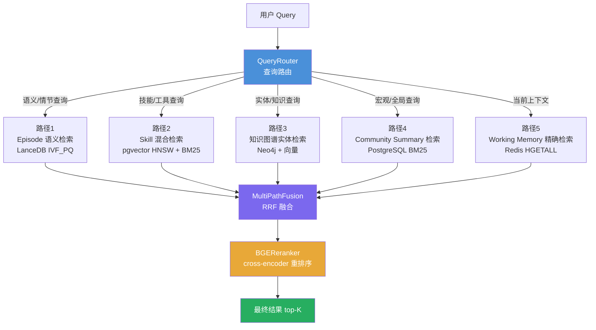
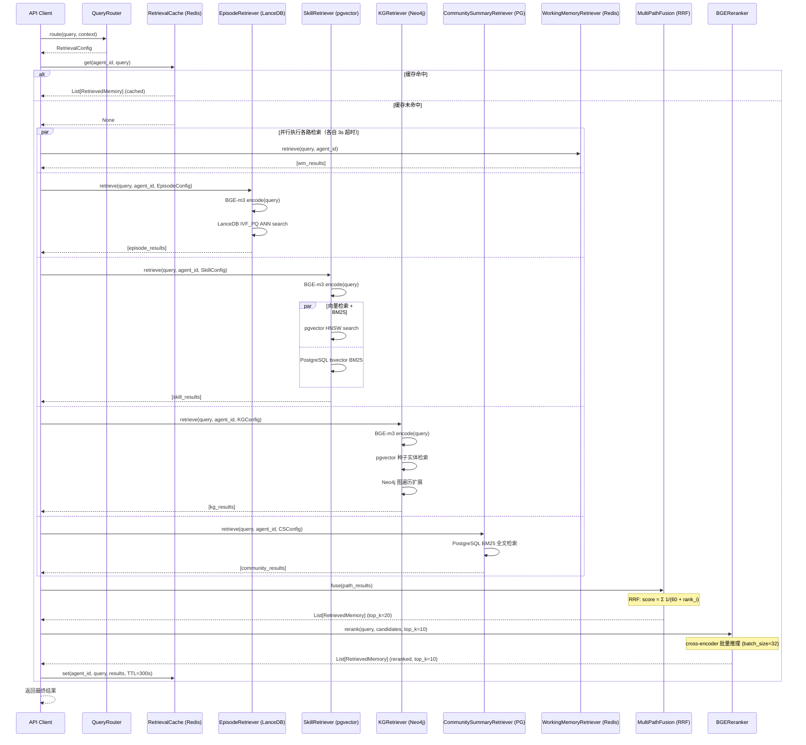

# 08 详细设计 - Retrieval Strategy

## 目录

1. [检索策略概述](#1-检索策略概述)
2. [路径1：Episode 语义检索](#2-路径1episode-语义检索)
3. [路径2：Skill 语义检索](#3-路径2skill-语义检索)
4. [路径3：知识图谱实体检索](#4-路径3知识图谱实体检索)
5. [路径4：Community Summary 全局检索](#5-路径4community-summary-全局检索)
6. [路径5：Working Memory 精确检索](#6-路径5working-memory-精确检索)
7. [多路结果融合](#7-多路结果融合)
8. [BGE-reranker 重排序](#8-bge-reranker-重排序)
9. [查询理解与路由](#9-查询理解与路由)
10. [检索性能优化](#10-检索性能优化)
11. [UML 时序图](#11-uml-时序图)
12. [单元测试](#12-单元测试)

---

## 1. 检索策略概述

### 1.1 设计目标

Agentic Memory 系统的检索层需要在以下约束下提供高质量结果：

- **延迟目标**：P99 端到端检索 < 200ms（含重排序）
- **召回质量**：top-10 结果中相关率 > 85%
- **灵活性**：支持按 query 类型动态启用/禁用检索路径
- **可扩展性**：新增检索路径不影响现有逻辑

### 1.2 5路检索架构图



### 1.3 各路径特点与适用场景

| 路径                      | 存储后端           | 检索方式         | 适用场景                                    | 延迟目标  |
|---------------------------|--------------------|------------------|---------------------------------------------|-----------|
| Episode 语义检索           | LanceDB            | ANN (IVF_PQ)     | 情节记忆、对话历史、事件回溯                 | P99 < 50ms |
| Skill 混合检索             | PostgreSQL+pgvector| HNSW + BM25      | 工具调用、技能推荐、能力查询                 | P99 < 60ms |
| 知识图谱实体检索           | Neo4j + pgvector   | 两阶段：向量+图遍历 | 实体关系、因果推理、结构化知识              | P99 < 80ms |
| Community Summary 检索     | PostgreSQL         | BM25 全文检索    | 宏观性问题、领域概述、任务分类总结           | P99 < 30ms |
| Working Memory 精确检索    | Redis              | HGETALL + 过滤   | 当前对话上下文、最新状态、短期记忆           | P99 < 5ms  |

### 1.4 融合策略选择依据

选择 **Reciprocal Rank Fusion (RRF)** 而非加权求和，原因如下：

1. **分数不可比**：不同路径返回的分数量纲不同（余弦相似度 vs BM25 分数），直接加权会引入偏差
2. **鲁棒性强**：RRF 只关注排名，对异常高分/低分不敏感
3. **参数少**：只有一个超参数 k（默认 60），调参成本低
4. **实证效果好**：在多路召回融合场景下，RRF 的表现接近或超过更复杂的学习型融合方法

---

## 2. 路径1：Episode 语义检索

### 2.1 存储层设计

Episode 向量存储在 LanceDB 的 `episodes` 表中，使用 IVF_PQ（倒排量化）索引。

**LanceDB 表 Schema**：

```python
import lancedb
from lancedb.pydantic import LanceModel, Vector

class EpisodeVector(LanceModel):
    episode_id: str
    agent_id: str
    content: str          # 摘要文本
    importance_score: float
    created_at: str       # ISO 8601
    session_id: str
    embedding: Vector(1024)  # BGE-m3 输出维度
```

**索引配置**：

```python
# 创建 IVF_PQ 索引
table.create_index(
    metric="cosine",
    index_type="IVF_PQ",
    num_partitions=256,    # sqrt(N)，N 约为 100K 时取 256
    num_sub_vectors=64,    # embedding_dim / 16 = 1024 / 16
    num_bits=8,
)
```

### 2.2 BGE-m3 向量化

```python
"""BGE-m3 Embedding 工具类"""
import asyncio
from typing import Union
import numpy as np
from FlagEmbedding import BGEM3FlagModel


class BGEEmbedder:
    """BGE-m3 文本向量化，支持批量推理"""

    def __init__(self, model_name: str = "BAAI/bge-m3", device: str = "cpu"):
        self.model = BGEM3FlagModel(model_name, use_fp16=(device != "cpu"))
        self.device = device

    def encode(
        self,
        texts: Union[str, list[str]],
        batch_size: int = 32,
        max_length: int = 512,
    ) -> np.ndarray:
        """将文本转换为 dense embedding，返回 shape (N, 1024)"""
        if isinstance(texts, str):
            texts = [texts]
        output = self.model.encode(
            texts,
            batch_size=batch_size,
            max_length=max_length,
            return_dense=True,
            return_sparse=False,
            return_colbert_vecs=False,
        )
        return output["dense_vecs"]

    async def aencode(self, texts: Union[str, list[str]], **kwargs) -> np.ndarray:
        """异步版本，在线程池中执行同步推理"""
        loop = asyncio.get_event_loop()
        return await loop.run_in_executor(None, lambda: self.encode(texts, **kwargs))
```

### 2.3 `EpisodeRetriever` 完整实现

```python
"""Episode 语义检索器"""
import asyncio
import logging
from dataclasses import dataclass
from datetime import datetime
from typing import Optional

import numpy as np

logger = logging.getLogger(__name__)


@dataclass
class EpisodeRetrievalConfig:
    top_k: int = 20
    importance_min: float = 0.0
    time_start: Optional[datetime] = None
    time_end: Optional[datetime] = None
    nprobes: int = 20          # IVF 搜索的分区数，越大越准但越慢
    refine_factor: int = 5     # 过采样倍数，用于精化结果


@dataclass
class RetrievedMemory:
    memory_id: str
    content: str
    score: float
    memory_type: str
    metadata: dict


class EpisodeRetriever:
    """
    基于 LanceDB IVF_PQ 索引的 Episode 语义检索器。

    性能目标：P99 < 50ms（top_k=20）
    """

    def __init__(self, lancedb_client, embedder: "BGEEmbedder"):
        self.db = lancedb_client
        self.embedder = embedder
        self._table_cache: dict = {}

    def _get_table(self, agent_id: str):
        """获取或缓存 LanceDB 表对象"""
        table_name = f"episodes_{agent_id}"
        if table_name not in self._table_cache:
            try:
                self._table_cache[table_name] = self.db.open_table(table_name)
            except Exception:
                # 表不存在时返回 None
                return None
        return self._table_cache[table_name]

    def _build_filter(self, config: EpisodeRetrievalConfig) -> Optional[str]:
        """构建 LanceDB SQL 过滤表达式"""
        conditions = []

        if config.importance_min > 0.0:
            conditions.append(f"importance_score >= {config.importance_min}")

        if config.time_start:
            ts = config.time_start.isoformat()
            conditions.append(f"created_at >= '{ts}'")

        if config.time_end:
            ts = config.time_end.isoformat()
            conditions.append(f"created_at <= '{ts}'")

        return " AND ".join(conditions) if conditions else None

    async def retrieve(
        self,
        query: str,
        agent_id: str,
        config: Optional[EpisodeRetrievalConfig] = None,
    ) -> list[RetrievedMemory]:
        """
        执行 Episode 语义检索。

        流程：
        1. query 向量化（BGE-m3）
        2. LanceDB ANN 搜索（IVF_PQ）
        3. 元数据过滤（重要性、时间范围）
        4. 返回 RetrievedMemory 列表
        """
        if config is None:
            config = EpisodeRetrievalConfig()

        table = self._get_table(agent_id)
        if table is None:
            logger.warning(f"Episode table not found for agent_id={agent_id}")
            return []

        # Step 1: 向量化
        query_vector = await self.embedder.aencode(query)
        query_vector = query_vector[0].tolist()  # shape (1024,)

        # Step 2: ANN 搜索
        try:
            search_builder = (
                table.search(query_vector)
                .metric("cosine")
                .nprobes(config.nprobes)
                .refine_factor(config.refine_factor)
                .limit(config.top_k)
            )

            # Step 3: 应用过滤
            filter_expr = self._build_filter(config)
            if filter_expr:
                search_builder = search_builder.where(filter_expr)

            results = await asyncio.get_event_loop().run_in_executor(
                None, lambda: search_builder.to_list()
            )
        except Exception as e:
            logger.error(f"LanceDB search failed for agent_id={agent_id}: {e}")
            return []

        # Step 4: 转换为标准格式
        memories = []
        for row in results:
            memories.append(
                RetrievedMemory(
                    memory_id=row["episode_id"],
                    content=row["content"],
                    score=float(1.0 - row.get("_distance", 0.0)),  # cosine distance → similarity
                    memory_type="episode",
                    metadata={
                        "importance_score": row["importance_score"],
                        "created_at": row["created_at"],
                        "session_id": row["session_id"],
                    },
                )
            )

        return memories
```

### 2.4 性能调优参数

| 参数             | 说明                           | 推荐值 | 影响        |
|------------------|--------------------------------|--------|-------------|
| `num_partitions` | IVF 分区数                     | 256    | 越大越慢/越准|
| `nprobes`        | 搜索时访问的分区数              | 20     | 影响召回率  |
| `refine_factor`  | PQ 量化后精化的候选倍数         | 5      | 影响精度    |
| `num_sub_vectors`| PQ 子向量数                    | 64     | 影响压缩比  |

---

## 3. 路径2：Skill 语义检索

### 3.1 存储层设计

Skill 向量存储在 PostgreSQL + pgvector 中，使用 HNSW 索引，同时利用 tsvector 支持 BM25 全文搜索。

**PostgreSQL 表结构**：

```sql
-- Skill 主表
CREATE TABLE skills (
    skill_id    VARCHAR(64) PRIMARY KEY,
    agent_id    VARCHAR(64) NOT NULL,
    name        VARCHAR(100) NOT NULL,
    description TEXT NOT NULL,
    code_snippet TEXT,
    version     VARCHAR(20) NOT NULL DEFAULT '1.0.0',
    success_rate FLOAT NOT NULL DEFAULT 0.5,
    execution_count INTEGER NOT NULL DEFAULT 0,
    avg_latency_ms FLOAT,
    metadata    JSONB DEFAULT '{}',
    embedding   vector(1024),
    search_tsv  tsvector GENERATED ALWAYS AS (
        to_tsvector('english', name || ' ' || description)
    ) STORED,
    created_at  TIMESTAMPTZ NOT NULL DEFAULT NOW(),
    updated_at  TIMESTAMPTZ NOT NULL DEFAULT NOW(),
    UNIQUE (agent_id, name)
);

-- HNSW 向量索引
CREATE INDEX idx_skills_embedding ON skills
    USING hnsw (embedding vector_cosine_ops)
    WITH (m = 16, ef_construction = 64);

-- GIN 全文索引
CREATE INDEX idx_skills_tsv ON skills USING GIN(search_tsv);

-- agent_id 普通索引
CREATE INDEX idx_skills_agent_id ON skills(agent_id);
```

### 3.2 `SkillRetriever` 完整实现

```python
"""Skill 混合检索器（pgvector HNSW + BM25 全文）"""
import asyncio
import logging
from dataclasses import dataclass, field
from typing import Optional

logger = logging.getLogger(__name__)


@dataclass
class SkillRetrievalConfig:
    top_k: int = 10
    vector_weight: float = 0.7    # 向量分数权重
    bm25_weight: float = 0.3      # BM25 分数权重
    domain: Optional[str] = None
    success_rate_min: Optional[float] = None
    ef_search: int = 40           # HNSW ef_search 参数（越大越准）


class SkillRetriever:
    """
    混合检索技能：pgvector HNSW 向量检索 + PostgreSQL BM25 全文检索。

    混合评分公式：
        final_score = 0.7 * vector_score + 0.3 * bm25_score
    """

    def __init__(self, postgres_pool, embedder: "BGEEmbedder"):
        self.pool = postgres_pool
        self.embedder = embedder

    async def _vector_search(
        self,
        query_vector: list[float],
        agent_id: str,
        config: SkillRetrievalConfig,
        candidate_k: int,
    ) -> list[dict]:
        """pgvector HNSW 向量检索"""
        conditions = ["agent_id = $1"]
        params = [agent_id]
        param_idx = 2

        if config.domain:
            conditions.append(f"metadata->>'domain' = ${param_idx}")
            params.append(config.domain)
            param_idx += 1

        if config.success_rate_min is not None:
            conditions.append(f"success_rate >= ${param_idx}")
            params.append(config.success_rate_min)
            param_idx += 1

        where_clause = " AND ".join(conditions)

        sql = f"""
            SET LOCAL hnsw.ef_search = {config.ef_search};
            SELECT
                skill_id,
                name,
                description,
                version,
                success_rate,
                execution_count,
                metadata,
                1 - (embedding <=> ${param_idx}::vector) AS vector_score
            FROM skills
            WHERE {where_clause}
            ORDER BY embedding <=> ${param_idx}::vector
            LIMIT {candidate_k}
        """
        params.append(query_vector)

        async with self.pool.acquire() as conn:
            rows = await conn.fetch(sql, *params)

        return [dict(row) for row in rows]

    async def _bm25_search(
        self,
        query: str,
        agent_id: str,
        config: SkillRetrievalConfig,
        candidate_k: int,
    ) -> list[dict]:
        """PostgreSQL tsvector BM25 全文检索"""
        conditions = ["agent_id = $1", "search_tsv @@ plainto_tsquery('english', $2)"]
        params = [agent_id, query]
        param_idx = 3

        if config.domain:
            conditions.append(f"metadata->>'domain' = ${param_idx}")
            params.append(config.domain)
            param_idx += 1

        where_clause = " AND ".join(conditions)

        sql = f"""
            SELECT
                skill_id,
                name,
                description,
                version,
                success_rate,
                execution_count,
                metadata,
                ts_rank(search_tsv, plainto_tsquery('english', $2)) AS bm25_score
            FROM skills
            WHERE {where_clause}
            ORDER BY bm25_score DESC
            LIMIT {candidate_k}
        """

        async with self.pool.acquire() as conn:
            rows = await conn.fetch(sql, *params)

        return [dict(row) for row in rows]

    async def retrieve(
        self,
        query: str,
        agent_id: str,
        config: Optional[SkillRetrievalConfig] = None,
    ) -> list["RetrievedMemory"]:
        """
        混合检索：并行执行向量检索和 BM25 检索，然后融合结果。
        """
        if config is None:
            config = SkillRetrievalConfig()

        # 向量化
        query_vector_arr = await self.embedder.aencode(query)
        query_vector = query_vector_arr[0].tolist()

        candidate_k = config.top_k * 3  # 过采样

        # 并行执行两路检索
        vector_results, bm25_results = await asyncio.gather(
            self._vector_search(query_vector, agent_id, config, candidate_k),
            self._bm25_search(query, agent_id, config, candidate_k),
            return_exceptions=True,
        )

        if isinstance(vector_results, Exception):
            logger.error(f"Vector search failed: {vector_results}")
            vector_results = []

        if isinstance(bm25_results, Exception):
            logger.error(f"BM25 search failed: {bm25_results}")
            bm25_results = []

        # 归一化并融合
        merged: dict[str, dict] = {}

        # 归一化 vector_score
        max_vs = max((r["vector_score"] for r in vector_results), default=1.0) or 1.0
        for r in vector_results:
            sid = r["skill_id"]
            merged[sid] = {**r, "vector_score": r["vector_score"] / max_vs, "bm25_score": 0.0}

        # 归一化 bm25_score
        max_bs = max((r["bm25_score"] for r in bm25_results), default=1.0) or 1.0
        for r in bm25_results:
            sid = r["skill_id"]
            norm_bs = r["bm25_score"] / max_bs
            if sid in merged:
                merged[sid]["bm25_score"] = norm_bs
            else:
                merged[sid] = {**r, "vector_score": 0.0, "bm25_score": norm_bs}

        # 计算最终分数
        scored = []
        for item in merged.values():
            final_score = (
                config.vector_weight * item["vector_score"]
                + config.bm25_weight * item["bm25_score"]
            )
            scored.append((final_score, item))

        scored.sort(key=lambda x: x[0], reverse=True)

        memories = []
        for rank, (score, item) in enumerate(scored[: config.top_k]):
            memories.append(
                RetrievedMemory(
                    memory_id=item["skill_id"],
                    content=f"{item['name']}: {item['description']}",
                    score=score,
                    memory_type="procedural",
                    metadata={
                        "version": item["version"],
                        "success_rate": item["success_rate"],
                        "execution_count": item["execution_count"],
                        "metadata": dict(item.get("metadata") or {}),
                    },
                )
            )

        return memories
```

---

## 4. 路径3：知识图谱实体检索

### 4.1 两阶段检索策略

```
Stage 1: 向量检索实体
  → PostgreSQL entity_embeddings 表（pgvector HNSW）
  → 找到 top-N 相关实体（N = top_k * 2）

Stage 2: 图遍历扩展
  → Neo4j Cypher：从 Stage 1 实体出发，遍历 1-2 跳邻居
  → 收集子图（节点 + 边）
  → 序列化为文本片段（供 LLM 使用）
```

### 4.2 Neo4j Cypher 查询模板

```cypher
-- 模板1：获取实体及其 1 跳邻居
MATCH (e:Entity {entity_id: $entity_id})
OPTIONAL MATCH (e)-[r]-(neighbor:Entity)
WHERE neighbor.agent_id = $agent_id
RETURN e, r, neighbor
LIMIT 50

-- 模板2：获取多个种子实体及其 2 跳子图
MATCH (e:Entity)
WHERE e.entity_id IN $entity_ids AND e.agent_id = $agent_id
OPTIONAL MATCH path = (e)-[r1]-(n1:Entity)-[r2]-(n2:Entity)
WHERE n1.agent_id = $agent_id AND n2.agent_id = $agent_id
  AND (r1 IS NULL OR type(r1) IN $relation_types)
RETURN e, r1, n1, r2, n2
LIMIT $max_nodes

-- 模板3：按关系类型过滤遍历
MATCH (e:Entity {entity_id: $start_id})-[r:USES|DEPENDS_ON|SIMILAR_TO*1..2]-(target:Entity)
WHERE target.agent_id = $agent_id
RETURN DISTINCT target, r
ORDER BY target.importance DESC
LIMIT $top_k
```

### 4.3 `KGRetriever` 完整实现

```python
"""知识图谱实体检索器（两阶段：向量检索 + 图遍历）"""
import asyncio
import logging
from dataclasses import dataclass, field
from typing import Optional

logger = logging.getLogger(__name__)


@dataclass
class KGRetrievalConfig:
    top_k: int = 10
    hops: int = 1                            # 图遍历跳数
    max_nodes: int = 50                      # 最大返回节点数
    relation_types: Optional[list[str]] = None  # None 表示不限制


class KGRetriever:
    """
    知识图谱两阶段检索：
    1. pgvector 向量检索种子实体
    2. Neo4j 图遍历扩展子图
    """

    def __init__(self, postgres_pool, neo4j_driver, embedder: "BGEEmbedder"):
        self.postgres = postgres_pool
        self.neo4j = neo4j_driver
        self.embedder = embedder

    async def _vector_search_entities(
        self,
        query_vector: list[float],
        agent_id: str,
        candidate_k: int,
    ) -> list[dict]:
        """Stage 1：用 pgvector 找到语义相近的种子实体"""
        sql = """
            SELECT
                entity_id,
                name,
                entity_type,
                description,
                1 - (embedding <=> $1::vector) AS score
            FROM entity_embeddings
            WHERE agent_id = $2
            ORDER BY embedding <=> $1::vector
            LIMIT $3
        """
        async with self.postgres.acquire() as conn:
            rows = await conn.fetch(sql, query_vector, agent_id, candidate_k)
        return [dict(row) for row in rows]

    async def _graph_traverse(
        self,
        entity_ids: list[str],
        agent_id: str,
        config: KGRetrievalConfig,
    ) -> tuple[list[dict], list[dict]]:
        """Stage 2：Neo4j 图遍历，返回 (nodes, edges)"""
        if not entity_ids:
            return [], []

        # 构建关系类型过滤
        rel_filter = ""
        if config.relation_types:
            rel_types = "|".join(config.relation_types)
            rel_filter = f":{rel_types}"

        # 动态跳数
        hops_range = f"1..{config.hops}"

        cypher = f"""
            MATCH (seed:Entity)
            WHERE seed.entity_id IN $entity_ids AND seed.agent_id = $agent_id
            OPTIONAL MATCH path = (seed)-[r{rel_filter}*{hops_range}]-(target:Entity)
            WHERE target.agent_id = $agent_id
            WITH DISTINCT seed, target, relationships(path) AS rels
            RETURN
                collect(DISTINCT {{
                    entity_id: seed.entity_id,
                    name: seed.name,
                    entity_type: seed.entity_type,
                    description: seed.description,
                    hop: 0
                }}) +
                collect(DISTINCT {{
                    entity_id: target.entity_id,
                    name: target.name,
                    entity_type: target.entity_type,
                    description: target.description,
                    hop: length(path)
                }}) AS nodes,
                collect(DISTINCT {{
                    source_id: startNode(rels[-1]).entity_id,
                    target_id: endNode(rels[-1]).entity_id,
                    relation_type: type(rels[-1])
                }}) AS edges
            LIMIT $max_nodes
        """

        async with self.neo4j.session() as session:
            result = await session.run(
                cypher,
                entity_ids=entity_ids,
                agent_id=agent_id,
                max_nodes=config.max_nodes,
            )
            record = await result.single()

        if record is None:
            return [], []

        nodes = [n for n in record["nodes"] if n and n.get("entity_id")]
        edges = [e for e in record["edges"] if e and e.get("source_id")]
        return nodes, edges

    def _serialize_subgraph(self, nodes: list[dict], edges: list[dict]) -> str:
        """将子图序列化为结构化文本，供 LLM 消费"""
        if not nodes:
            return ""

        lines = ["[知识图谱子图]"]

        # 节点
        lines.append("\n实体节点：")
        seen_ids = set()
        for node in nodes:
            eid = node.get("entity_id")
            if eid and eid not in seen_ids:
                seen_ids.add(eid)
                lines.append(
                    f"  - [{node.get('entity_type', 'Entity')}] "
                    f"{node.get('name', '')} (id={eid}): "
                    f"{node.get('description', '')}"
                )

        # 边
        if edges:
            lines.append("\n关系：")
            # 构建 id→name 映射
            id_to_name = {n["entity_id"]: n.get("name", n["entity_id"]) for n in nodes if n.get("entity_id")}
            seen_edges = set()
            for edge in edges:
                key = (edge.get("source_id"), edge.get("target_id"), edge.get("relation_type"))
                if key not in seen_edges:
                    seen_edges.add(key)
                    src_name = id_to_name.get(edge.get("source_id"), edge.get("source_id"))
                    tgt_name = id_to_name.get(edge.get("target_id"), edge.get("target_id"))
                    lines.append(
                        f"  - {src_name} --[{edge.get('relation_type', 'RELATED_TO')}]--> {tgt_name}"
                    )

        return "\n".join(lines)

    async def retrieve(
        self,
        query: str,
        agent_id: str,
        config: Optional[KGRetrievalConfig] = None,
    ) -> list["RetrievedMemory"]:
        """两阶段 KG 检索：向量召回种子实体 → 图遍历扩展"""
        if config is None:
            config = KGRetrievalConfig()

        # Step 1: 向量化
        query_vector_arr = await self.embedder.aencode(query)
        query_vector = query_vector_arr[0].tolist()

        # Step 2: 向量检索种子实体
        seed_entities = await self._vector_search_entities(
            query_vector, agent_id, candidate_k=config.top_k * 2
        )

        if not seed_entities:
            return []

        entity_ids = [e["entity_id"] for e in seed_entities]

        # Step 3: 图遍历扩展
        nodes, edges = await self._graph_traverse(entity_ids, agent_id, config)

        # Step 4: 序列化子图
        subgraph_text = self._serialize_subgraph(nodes, edges)

        if not subgraph_text:
            return []

        # 将整个子图作为一条 semantic 记忆返回（也可以按节点拆分）
        avg_score = sum(e["score"] for e in seed_entities) / len(seed_entities) if seed_entities else 0.5

        return [
            RetrievedMemory(
                memory_id=f"kg_subgraph_{agent_id}_{entity_ids[0]}",
                content=subgraph_text,
                score=avg_score,
                memory_type="semantic",
                metadata={
                    "node_count": len(set(n.get("entity_id") for n in nodes if n.get("entity_id"))),
                    "edge_count": len(set(
                        (e.get("source_id"), e.get("target_id"), e.get("relation_type"))
                        for e in edges
                    )),
                    "seed_entity_ids": entity_ids[:5],
                },
            )
        ]
```

---

## 5. 路径4：Community Summary 全局检索

### 5.1 设计背景

Community Summary 是对知识图谱中实体社区的全局摘要，由 Graph Community Detection 算法（如 Leiden）定期生成。这类文本适合回答宏观性问题，例如：

- "这个 Agent 通常处理什么类型的任务？"
- "Agent 掌握的主要技术栈是什么？"
- "最近 30 天 Agent 关注的核心主题有哪些？"

### 5.2 PostgreSQL 表结构

```sql
CREATE TABLE community_summaries (
    community_id    VARCHAR(64) PRIMARY KEY,
    agent_id        VARCHAR(64) NOT NULL,
    level           INTEGER NOT NULL DEFAULT 1,
    title           VARCHAR(500),
    summary         TEXT NOT NULL,
    entity_count    INTEGER,
    key_entities    JSONB DEFAULT '[]',
    summary_tsv     tsvector GENERATED ALWAYS AS (
        to_tsvector('english', COALESCE(title, '') || ' ' || summary)
    ) STORED,
    created_at      TIMESTAMPTZ NOT NULL DEFAULT NOW(),
    UNIQUE (community_id, agent_id)
);

CREATE INDEX idx_community_summaries_agent ON community_summaries(agent_id);
CREATE INDEX idx_community_summaries_tsv ON community_summaries USING GIN(summary_tsv);
```

### 5.3 `CommunitySummaryRetriever` 完整实现

```python
"""Community Summary 全文检索器"""
import logging
from dataclasses import dataclass
from typing import Optional

logger = logging.getLogger(__name__)


@dataclass
class CommunitySummaryConfig:
    top_k: int = 5
    level: Optional[int] = None  # None 表示不限层级


class CommunitySummaryRetriever:
    """
    基于 PostgreSQL BM25 全文检索的 Community Summary 检索器。

    适用场景：
    - 宏观性问题（Agent 的整体能力、常见任务类型）
    - 领域概述查询
    - 任务分类与归纳

    性能目标：P99 < 30ms
    """

    def __init__(self, postgres_pool):
        self.pool = postgres_pool

    async def retrieve(
        self,
        query: str,
        agent_id: str,
        config: Optional[CommunitySummaryConfig] = None,
    ) -> list["RetrievedMemory"]:
        """使用 PostgreSQL tsvector BM25 检索 Community Summary"""
        if config is None:
            config = CommunitySummaryConfig()

        conditions = [
            "agent_id = $1",
            "summary_tsv @@ plainto_tsquery('english', $2)",
        ]
        params: list = [agent_id, query]
        param_idx = 3

        if config.level is not None:
            conditions.append(f"level = ${param_idx}")
            params.append(config.level)
            param_idx += 1

        where_clause = " AND ".join(conditions)

        sql = f"""
            SELECT
                community_id,
                title,
                summary,
                entity_count,
                key_entities,
                level,
                ts_rank(summary_tsv, plainto_tsquery('english', $2)) AS bm25_score
            FROM community_summaries
            WHERE {where_clause}
            ORDER BY bm25_score DESC
            LIMIT ${param_idx}
        """
        params.append(config.top_k)

        try:
            async with self.pool.acquire() as conn:
                rows = await conn.fetch(sql, *params)
        except Exception as e:
            logger.error(f"Community summary search failed: {e}")
            return []

        memories = []
        max_score = max((row["bm25_score"] for row in rows), default=1.0) or 1.0

        for row in rows:
            content = f"[{row['title'] or '社区摘要'}]\n{row['summary']}"
            memories.append(
                RetrievedMemory(
                    memory_id=row["community_id"],
                    content=content,
                    score=float(row["bm25_score"]) / max_score,
                    memory_type="semantic",
                    metadata={
                        "community_id": row["community_id"],
                        "level": row["level"],
                        "entity_count": row["entity_count"],
                        "key_entities": list(row["key_entities"] or []),
                    },
                )
            )

        return memories
```

---

## 6. 路径5：Working Memory 精确检索

### 6.1 Redis 存储结构

Working Memory 使用 Redis Hash 存储，Key 格式为 `wm:{agent_id}:{session_id}`。

```
Key:   wm:agent-001:sess_xyz789
Type:  Hash
Fields:
  task_description     → "帮助用户完成 API 设计文档"
  current_step         → "drafting_kg_api"
  recent_messages      → "[{\"role\":\"user\",...}]"  (JSON 字符串)
  active_entities      → "[\"FastAPI\",\"LanceDB\"]"
  token_count          → "342"
  created_at           → "2026-03-23T10:00:00Z"
  updated_at           → "2026-03-23T10:05:00Z"
TTL:   3600 秒
```

### 6.2 `WorkingMemoryRetriever` 完整实现

```python
"""Working Memory 精确检索器（Redis HGETALL + 结构化过滤）"""
import json
import logging
from dataclasses import dataclass
from typing import Optional

logger = logging.getLogger(__name__)


@dataclass
class WorkingMemoryConfig:
    include_fields: Optional[list[str]] = None  # None 表示返回全部字段
    max_messages: int = 20                       # 最多返回的消息轮次数


class WorkingMemoryRetriever:
    """
    Working Memory 精确检索。

    特点：
    - 最高优先级（当前 Session 上下文）
    - 无向量化，直接读取 Redis Hash
    - 支持字段过滤和消息截断

    性能目标：P99 < 5ms
    """

    def __init__(self, redis_client):
        self.redis = redis_client

    def _make_key(self, agent_id: str, session_id: str) -> str:
        return f"wm:{agent_id}:{session_id}"

    async def get_session_ids(self, agent_id: str) -> list[str]:
        """获取 agent 的所有活跃 session ID（通过 SCAN）"""
        pattern = f"wm:{agent_id}:*"
        session_ids = []
        cursor = 0

        while True:
            cursor, keys = await self.redis.scan(cursor, match=pattern, count=100)
            for key in keys:
                # 从 key 中提取 session_id
                parts = key.split(":")
                if len(parts) >= 3:
                    session_ids.append(":".join(parts[2:]))
            if cursor == 0:
                break

        return session_ids

    async def retrieve_by_session(
        self,
        agent_id: str,
        session_id: str,
        config: Optional[WorkingMemoryConfig] = None,
    ) -> Optional["RetrievedMemory"]:
        """获取指定 session 的完整 Working Memory"""
        if config is None:
            config = WorkingMemoryConfig()

        key = self._make_key(agent_id, session_id)

        try:
            if config.include_fields:
                raw = await self.redis.hmget(key, *config.include_fields)
                data = {
                    field: val
                    for field, val in zip(config.include_fields, raw)
                    if val is not None
                }
            else:
                data = await self.redis.hgetall(key)
        except Exception as e:
            logger.error(f"Redis HGETALL failed for key={key}: {e}")
            return None

        if not data:
            return None

        # 解析 JSON 字段
        parsed = {}
        for k, v in data.items():
            field_name = k.decode() if isinstance(k, bytes) else k
            field_val = v.decode() if isinstance(v, bytes) else v
            try:
                parsed[field_name] = json.loads(field_val)
            except (json.JSONDecodeError, TypeError):
                parsed[field_name] = field_val

        # 截断消息历史
        if "recent_messages" in parsed and isinstance(parsed["recent_messages"], list):
            parsed["recent_messages"] = parsed["recent_messages"][-config.max_messages:]

        # 序列化为可读文本
        content = self._serialize_working_memory(parsed)

        return RetrievedMemory(
            memory_id=f"wm_{agent_id}_{session_id}",
            content=content,
            score=1.0,  # Working Memory 始终赋予最高分
            memory_type="working",
            metadata={
                "session_id": session_id,
                "agent_id": agent_id,
                "token_count": int(parsed.get("token_count", 0)),
                "updated_at": parsed.get("updated_at", ""),
            },
        )

    def _serialize_working_memory(self, data: dict) -> str:
        """将 Working Memory 结构化为文本"""
        lines = ["[当前工作记忆]"]

        if "task_description" in data:
            lines.append(f"当前任务：{data['task_description']}")

        if "current_step" in data:
            lines.append(f"当前步骤：{data['current_step']}")

        if "active_entities" in data:
            entities = data["active_entities"]
            if isinstance(entities, list):
                lines.append(f"活跃实体：{', '.join(str(e) for e in entities)}")

        if "recent_messages" in data:
            messages = data["recent_messages"]
            if isinstance(messages, list) and messages:
                lines.append("\n最近对话：")
                for msg in messages:
                    role = msg.get("role", "unknown")
                    content = msg.get("content", "")
                    lines.append(f"  [{role}]: {content}")

        return "\n".join(lines)

    async def retrieve(
        self,
        query: str,
        agent_id: str,
        session_id: Optional[str] = None,
        config: Optional[WorkingMemoryConfig] = None,
    ) -> list["RetrievedMemory"]:
        """
        检索 Working Memory。
        - 如果指定 session_id，则只检索该 session
        - 否则检索 agent 的所有活跃 session（最多 5 个）
        """
        if session_id:
            result = await self.retrieve_by_session(agent_id, session_id, config)
            return [result] if result else []

        # 获取所有活跃 session
        session_ids = await self.get_session_ids(agent_id)
        session_ids = session_ids[:5]  # 最多并行查询 5 个 session

        results = await asyncio.gather(
            *[self.retrieve_by_session(agent_id, sid, config) for sid in session_ids],
            return_exceptions=True,
        )

        memories = [r for r in results if isinstance(r, RetrievedMemory)]
        return memories
```

---

## 7. 多路结果融合

### 7.1 RRF 算法原理

Reciprocal Rank Fusion 公式：

```
RRF_score(doc) = Σ_{i=1}^{N} 1 / (k + rank_i(doc))
```

其中：
- `N`：参与融合的检索路径数
- `rank_i(doc)`：文档在第 i 路结果中的排名（从 1 开始）
- `k`：平滑参数，推荐值 60（防止头部名次差异过大）

如果某文档未出现在某路结果中，该路贡献为 0。

### 7.2 `MultiPathFusion` 完整实现

```python
"""多路检索结果 RRF 融合"""
import asyncio
import logging
from dataclasses import dataclass, field
from typing import Optional

logger = logging.getLogger(__name__)


@dataclass
class FusionConfig:
    top_k: int = 20          # 融合后保留的结果数
    rrf_k: int = 60          # RRF 平滑参数
    path_weights: dict[str, float] = field(default_factory=lambda: {
        "working": 2.0,      # Working Memory 结果权重加倍
        "episode": 1.0,
        "procedural": 1.0,
        "semantic": 0.8,
    })


class MultiPathFusion:
    """
    多路检索结果 RRF 融合。

    特性：
    - 支持路径权重（Working Memory 赋予更高权重）
    - 自动去重（按 memory_id）
    - 保留所有路径的元数据
    """

    def __init__(self, config: Optional[FusionConfig] = None):
        self.config = config or FusionConfig()

    def fuse(
        self,
        path_results: dict[str, list["RetrievedMemory"]],
    ) -> list["RetrievedMemory"]:
        """
        对多路检索结果执行 RRF 融合。

        Args:
            path_results: {path_name → [RetrievedMemory, ...]}

        Returns:
            融合并排序后的 RetrievedMemory 列表，长度 <= top_k
        """
        # RRF 分数累加器
        rrf_scores: dict[str, float] = {}
        # 保存每个 memory_id 对应的 RetrievedMemory 对象（取分数最高的那份）
        memory_store: dict[str, "RetrievedMemory"] = {}

        for path_name, results in path_results.items():
            weight = self.config.path_weights.get(results[0].memory_type if results else path_name, 1.0)

            for rank, memory in enumerate(results, start=1):
                mid = memory.memory_id
                contribution = weight / (self.config.rrf_k + rank)
                rrf_scores[mid] = rrf_scores.get(mid, 0.0) + contribution

                # 保留 score 最高的副本
                if mid not in memory_store or memory.score > memory_store[mid].score:
                    memory_store[mid] = memory

        # 按 RRF 分数排序
        sorted_ids = sorted(rrf_scores.keys(), key=lambda mid: rrf_scores[mid], reverse=True)

        # 用 RRF 分数覆盖原始分数，便于下游统一使用
        results_list = []
        for mid in sorted_ids[: self.config.top_k]:
            mem = memory_store[mid]
            # 创建新对象避免修改原始数据
            fused_mem = RetrievedMemory(
                memory_id=mem.memory_id,
                content=mem.content,
                score=rrf_scores[mid],
                memory_type=mem.memory_type,
                metadata={**mem.metadata, "rrf_score": rrf_scores[mid]},
            )
            results_list.append(fused_mem)

        return results_list

    async def retrieve_and_fuse(
        self,
        retrievers: dict[str, "BaseRetriever"],
        query: str,
        agent_id: str,
        retriever_configs: Optional[dict] = None,
    ) -> list["RetrievedMemory"]:
        """
        并行执行多路检索，然后 RRF 融合。

        Args:
            retrievers: {path_name → retriever_instance}
            query: 检索查询
            agent_id: Agent 标识
            retriever_configs: {path_name → config} 各路配置

        Returns:
            融合后的结果列表
        """
        configs = retriever_configs or {}

        async def safe_retrieve(name: str, retriever) -> tuple[str, list]:
            """带异常捕获的检索包装"""
            try:
                cfg = configs.get(name)
                result = await asyncio.wait_for(
                    retriever.retrieve(query=query, agent_id=agent_id, config=cfg),
                    timeout=3.0,  # 每路 3s 超时
                )
                return name, result
            except asyncio.TimeoutError:
                logger.warning(f"Retriever {name} timed out")
                return name, []
            except Exception as e:
                logger.error(f"Retriever {name} failed: {e}")
                return name, []

        # 并行执行所有检索路径
        tasks = [safe_retrieve(name, retriever) for name, retriever in retrievers.items()]
        results = await asyncio.gather(*tasks)

        path_results = {name: memories for name, memories in results if memories}

        if not path_results:
            return []

        return self.fuse(path_results)
```

---

## 8. BGE-reranker 重排序

### 8.1 设计原理

经过 RRF 融合后，系统拥有来自多路检索的候选集（通常 20-50 条）。BGE-reranker 使用 cross-encoder 架构对每个 `(query, candidate)` 对进行二次相关性评分，其精度远高于 bi-encoder（向量检索）。

代价是计算量较大：每次重排序需要对 N 个候选文本各进行一次推理。通过批量推理（batch_size=32）和模型缓存来控制延迟。

### 8.2 `BGEReranker` 完整实现

```python
"""BGE-reranker-v2-m3 重排序器"""
import asyncio
import logging
from dataclasses import dataclass
from typing import Optional

logger = logging.getLogger(__name__)


@dataclass
class RerankerConfig:
    top_k: int = 10             # 重排后截断数量
    batch_size: int = 32        # 推理批量大小
    score_threshold: float = 0.0  # 低于此分数的结果过滤掉
    use_fp16: bool = True


class BGEReranker:
    """
    使用 BAAI/bge-reranker-v2-m3 进行 cross-encoder 重排序。

    特性：
    - 批量推理（batch_size=32）
    - 异步接口（线程池运行同步推理）
    - 支持分数阈值过滤
    """

    def __init__(self, model_name: str = "BAAI/bge-reranker-v2-m3", device: str = "cpu"):
        from FlagEmbedding import FlagReranker
        self.model = FlagReranker(model_name, use_fp16=True if device != "cpu" else False)
        self.device = device

    def _batch_score(
        self,
        query: str,
        candidates: list[str],
        batch_size: int,
    ) -> list[float]:
        """同步批量推理，返回 cross-encoder 相关性分数"""
        pairs = [[query, text] for text in candidates]
        scores = []

        for i in range(0, len(pairs), batch_size):
            batch = pairs[i: i + batch_size]
            batch_scores = self.model.compute_score(batch, normalize=True)
            if isinstance(batch_scores, float):
                batch_scores = [batch_scores]
            scores.extend(batch_scores)

        return scores

    async def rerank(
        self,
        query: str,
        candidates: list["RetrievedMemory"],
        config: Optional[RerankerConfig] = None,
    ) -> list["RetrievedMemory"]:
        """
        对候选记忆进行 cross-encoder 重排序。

        Args:
            query: 原始查询文本
            candidates: 待重排的记忆列表
            config: 重排配置

        Returns:
            重排并截断后的记忆列表
        """
        if config is None:
            config = RerankerConfig()

        if not candidates:
            return []

        if len(candidates) == 1:
            return candidates

        candidate_texts = [c.content for c in candidates]

        # 在线程池中执行同步推理
        loop = asyncio.get_event_loop()
        scores = await loop.run_in_executor(
            None,
            lambda: self._batch_score(query, candidate_texts, config.batch_size),
        )

        # 将 reranker 分数写回
        scored_candidates = list(zip(scores, candidates))
        scored_candidates.sort(key=lambda x: x[0], reverse=True)

        # 阈值过滤 + top-k 截断
        reranked = []
        for score, mem in scored_candidates[: config.top_k]:
            if score < config.score_threshold:
                break
            reranked_mem = RetrievedMemory(
                memory_id=mem.memory_id,
                content=mem.content,
                score=float(score),
                memory_type=mem.memory_type,
                metadata={**mem.metadata, "reranker_score": float(score)},
            )
            reranked.append(reranked_mem)

        logger.debug(
            f"Reranked {len(candidates)} candidates → {len(reranked)} results, "
            f"top score: {reranked[0].score:.4f}" if reranked else "empty"
        )

        return reranked
```

---

## 9. 查询理解与路由

### 9.1 设计目标

`QueryRouter` 通过分析 query 的语义特征，决定激活哪些检索路径。这样可以：

- 避免不必要的检索开销（如纯粹的事件查询不需要走 Community Summary）
- 给不同路径分配更合适的 top_k 配置
- 支持 HyDE（Hypothetical Document Embedding）查询改写

### 9.2 路由规则

| Query 特征                             | 激活路径                        |
|----------------------------------------|---------------------------------|
| 包含 skill/工具/能力/怎么做           | Skill + Episode                 |
| 包含 community/整体/全局/类型          | Community Summary               |
| 包含 关系/实体/谁/什么是/与...相关     | KG + Semantic                   |
| 包含 当前/现在/本次/这次对话           | Working Memory（最高优先）       |
| 通用情节/历史/记得/之前                | Episode（默认主路径）            |
| 无明显特征                             | Episode + Working Memory         |

### 9.3 `QueryRouter` 完整实现

```python
"""查询路由器：分析 query 特征 → 决定检索路径配置"""
import re
import logging
from dataclasses import dataclass, field
from typing import Optional

logger = logging.getLogger(__name__)


@dataclass
class RetrievalConfig:
    """各路检索路径的激活状态和配置"""
    enable_episode: bool = True
    enable_skill: bool = False
    enable_kg: bool = False
    enable_community: bool = False
    enable_working: bool = True

    episode_top_k: int = 20
    skill_top_k: int = 10
    kg_top_k: int = 10
    community_top_k: int = 5
    working_top_k: int = 5

    use_hyde: bool = False       # 是否启用 HyDE 查询改写
    rerank_top_k: int = 10       # 重排后截断数


# 关键词分组（支持中英文）
_SKILL_PATTERNS = re.compile(
    r"(skill|工具|能力|技能|函数|function|怎么做|如何|how to|execute|调用)",
    re.IGNORECASE,
)
_COMMUNITY_PATTERNS = re.compile(
    r"(community|整体|全局|通常|类型|总结|overview|summary|宏观|一般来说)",
    re.IGNORECASE,
)
_KG_PATTERNS = re.compile(
    r"(关系|实体|entity|relation|谁|who|什么是|what is|与.*相关|associated with|知识|knowledge)",
    re.IGNORECASE,
)
_WORKING_PATTERNS = re.compile(
    r"(当前|现在|本次|这次|刚才|刚刚|current|just now|this session|上一条|最近说)",
    re.IGNORECASE,
)
_HYDE_PATTERNS = re.compile(
    r"(解释|原理|为什么|why|explain|mechanism|如何工作|how does.*work)",
    re.IGNORECASE,
)


class QueryRouter:
    """
    基于规则的查询路由器。

    分析 query 文本特征，决定激活哪些检索路径及其参数配置。
    支持 context（当前 Session 信息）作为辅助判断依据。
    """

    def route(
        self,
        query: str,
        context: Optional[dict] = None,
    ) -> RetrievalConfig:
        """
        主入口：分析 query，返回 RetrievalConfig。

        Args:
            query: 用户查询文本
            context: 可选上下文，如 {"session_id": "...", "has_active_session": True}

        Returns:
            RetrievalConfig 指示各路径的启用状态和 top_k
        """
        config = RetrievalConfig()

        # 检测 Working Memory 需求
        has_active_session = context.get("has_active_session", False) if context else False
        if has_active_session or _WORKING_PATTERNS.search(query):
            config.enable_working = True

        # 检测 Skill 需求
        if _SKILL_PATTERNS.search(query):
            config.enable_skill = True
            config.skill_top_k = 15
            config.episode_top_k = 10  # 有 skill 时 episode 分配少一些

        # 检测 Community Summary 需求
        if _COMMUNITY_PATTERNS.search(query):
            config.enable_community = True
            config.community_top_k = 8
            config.enable_episode = False  # 宏观问题不需要 episode 细节

        # 检测 KG 需求
        if _KG_PATTERNS.search(query):
            config.enable_kg = True
            config.kg_top_k = 15

        # 检测 HyDE 适用场景
        if _HYDE_PATTERNS.search(query):
            config.use_hyde = True

        # 默认至少开 Episode
        if not any([
            config.enable_skill,
            config.enable_kg,
            config.enable_community,
            config.enable_working,
        ]):
            config.enable_episode = True

        logger.debug(
            f"QueryRouter result: episode={config.enable_episode}, "
            f"skill={config.enable_skill}, kg={config.enable_kg}, "
            f"community={config.enable_community}, working={config.enable_working}, "
            f"hyde={config.use_hyde}"
        )

        return config

    async def rewrite_with_hyde(
        self,
        query: str,
        embedder: "BGEEmbedder",
        llm_client=None,
    ) -> str:
        """
        HyDE（Hypothetical Document Embedding）查询改写。

        策略：
        1. 用 LLM 生成一段假设性文档（模拟答案）
        2. 将假设文档作为检索查询（代替原始 query）

        如果 llm_client 为 None，直接返回原始 query。
        """
        if llm_client is None:
            return query

        prompt = (
            f"请用 2-3 句话写一段简短的文档，内容应当是问题"{query}"的答案。"
            f"只输出文档内容，不要添加任何前缀或解释。"
        )

        try:
            hypothetical_doc = await llm_client.generate(prompt, max_tokens=200)
            logger.debug(f"HyDE rewritten query: {hypothetical_doc[:100]}...")
            return hypothetical_doc.strip()
        except Exception as e:
            logger.warning(f"HyDE rewrite failed, using original query: {e}")
            return query
```

---

## 10. 检索性能优化

### 10.1 Redis 结果缓存

对于相同 query + agent_id 组合，5 分钟内的重复检索直接返回缓存结果，避免重复的向量化和 ANN 搜索。

```python
"""检索结果缓存层"""
import hashlib
import json
import logging
from typing import Optional

logger = logging.getLogger(__name__)


class RetrievalCache:
    """
    基于 Redis 的检索结果缓存。

    Key 格式：retrieval_cache:{agent_id}:{query_hash}
    TTL：300 秒（5 分钟）
    """

    DEFAULT_TTL = 300

    def __init__(self, redis_client):
        self.redis = redis_client

    def _make_key(self, agent_id: str, query: str, memory_types: Optional[list[str]]) -> str:
        """生成缓存 Key（对 query + memory_types 取 MD5）"""
        content = f"{query}|{sorted(memory_types) if memory_types else 'all'}"
        query_hash = hashlib.md5(content.encode()).hexdigest()[:16]
        return f"retrieval_cache:{agent_id}:{query_hash}"

    async def get(
        self,
        agent_id: str,
        query: str,
        memory_types: Optional[list[str]] = None,
    ) -> Optional[list["RetrievedMemory"]]:
        """从缓存中读取检索结果"""
        key = self._make_key(agent_id, query, memory_types)
        try:
            raw = await self.redis.get(key)
            if raw is None:
                return None
            data = json.loads(raw)
            return [RetrievedMemory(**item) for item in data]
        except Exception as e:
            logger.warning(f"Cache get failed for key={key}: {e}")
            return None

    async def set(
        self,
        agent_id: str,
        query: str,
        results: list["RetrievedMemory"],
        memory_types: Optional[list[str]] = None,
        ttl: int = DEFAULT_TTL,
    ) -> None:
        """将检索结果写入缓存"""
        key = self._make_key(agent_id, query, memory_types)
        try:
            data = [
                {
                    "memory_id": r.memory_id,
                    "content": r.content,
                    "score": r.score,
                    "memory_type": r.memory_type,
                    "metadata": r.metadata,
                }
                for r in results
            ]
            await self.redis.setex(key, ttl, json.dumps(data, ensure_ascii=False))
        except Exception as e:
            logger.warning(f"Cache set failed for key={key}: {e}")
```

### 10.2 并发控制

```python
"""信号量控制并发检索数量"""
import asyncio


class ConcurrencyLimiter:
    """
    基于 asyncio.Semaphore 的并发限流。
    防止大量并发检索请求打垮下游存储服务。
    """

    def __init__(self, max_concurrent: int = 10):
        self._sem = asyncio.Semaphore(max_concurrent)

    async def run(self, coro):
        """在信号量控制下执行协程"""
        async with self._sem:
            return await coro


# 全局单例
retrieval_limiter = ConcurrencyLimiter(max_concurrent=10)
```

### 10.3 全局超时控制

```python
"""全局 5s 超时 + 各路 3s 超时的组合控制"""
import asyncio
import logging

logger = logging.getLogger(__name__)

GLOBAL_TIMEOUT_S = 5.0
PER_PATH_TIMEOUT_S = 3.0


async def retrieval_with_timeout(
    fusion: "MultiPathFusion",
    retrievers: dict,
    query: str,
    agent_id: str,
    retriever_configs: Optional[dict] = None,
) -> list["RetrievedMemory"]:
    """
    带全局超时的多路检索入口。

    各路径内部有 3s 超时（在 retrieve_and_fuse 中实现），
    这里再加一层 5s 全局超时兜底。
    """
    try:
        return await asyncio.wait_for(
            fusion.retrieve_and_fuse(
                retrievers=retrievers,
                query=query,
                agent_id=agent_id,
                retriever_configs=retriever_configs,
            ),
            timeout=GLOBAL_TIMEOUT_S,
        )
    except asyncio.TimeoutError:
        logger.error(
            f"Global retrieval timeout ({GLOBAL_TIMEOUT_S}s) for "
            f"agent_id={agent_id}, query={query[:50]}..."
        )
        return []
```

### 10.4 性能优化汇总

| 优化措施               | 实现方式                            | 预期收益                   |
|------------------------|-------------------------------------|---------------------------|
| 结果缓存               | Redis，TTL 5min，MD5 key            | 重复查询延迟 < 5ms         |
| 并发限制               | asyncio.Semaphore(10)               | 防止下游过载               |
| 全局超时               | asyncio.wait_for(5s)                | P99 延迟有界               |
| 各路超时               | asyncio.wait_for(3s) per path       | 单路故障不阻塞其他路        |
| 异步并行               | asyncio.gather                      | 多路并行执行，总延迟≈最慢路  |
| LanceDB IVF_PQ         | nprobes=20，refine_factor=5         | Episode P99 < 50ms         |
| pgvector HNSW          | ef_search=40                        | Skill 向量检索 P99 < 30ms  |
| BGE 批量推理           | batch_size=32                       | Reranker P99 < 100ms       |

---

## 11. UML 时序图

### 11.1 完整 5路检索 + 融合 + 重排时序图



---

## 12. 单元测试

### 12.1 测试配置（`tests/retrieval/conftest.py`）

```python
"""检索层测试 Fixtures"""
import pytest
import numpy as np
from unittest.mock import AsyncMock, MagicMock, patch


@pytest.fixture
def mock_embedder():
    """Mock BGE-m3 向量化，始终返回固定维度的随机向量"""
    embedder = MagicMock()
    embedder.aencode = AsyncMock(
        return_value=np.random.rand(1, 1024).astype(np.float32)
    )
    embedder.encode = MagicMock(
        return_value=np.random.rand(1, 1024).astype(np.float32)
    )
    return embedder


@pytest.fixture
def mock_lancedb():
    """Mock LanceDB 客户端"""
    client = MagicMock()
    table = MagicMock()

    # 模拟搜索结果
    table.search.return_value.metric.return_value.nprobes.return_value \
        .refine_factor.return_value.limit.return_value.to_list.return_value = [
        {
            "episode_id": "ep_test_001",
            "content": "测试 Episode 内容",
            "importance_score": 0.8,
            "created_at": "2026-03-20T10:00:00Z",
            "session_id": "sess_001",
            "_distance": 0.12,
        }
    ]
    client.open_table.return_value = table
    return client


@pytest.fixture
def mock_postgres_pool():
    """Mock PostgreSQL 连接池"""
    pool = AsyncMock()
    conn = AsyncMock()
    pool.acquire.return_value.__aenter__ = AsyncMock(return_value=conn)
    pool.acquire.return_value.__aexit__ = AsyncMock(return_value=False)
    return pool, conn


@pytest.fixture
def mock_neo4j_driver():
    """Mock Neo4j driver"""
    driver = AsyncMock()
    session = AsyncMock()
    driver.session.return_value.__aenter__ = AsyncMock(return_value=session)
    driver.session.return_value.__aexit__ = AsyncMock(return_value=False)
    return driver, session


@pytest.fixture
def mock_redis():
    """Mock Redis 客户端"""
    return AsyncMock()


@pytest.fixture
def sample_memories():
    """样本 RetrievedMemory 列表"""
    from app.retrieval.base import RetrievedMemory
    return [
        RetrievedMemory(memory_id=f"mem_{i:03d}", content=f"记忆内容 {i}",
                        score=1.0 - i * 0.05, memory_type="episode", metadata={})
        for i in range(10)
    ]
```

---

### 12.2 Episode 检索测试（`tests/retrieval/test_episode_retriever.py`）

```python
"""EpisodeRetriever 单元测试"""
import pytest
from unittest.mock import AsyncMock, MagicMock, patch
import numpy as np

from app.retrieval.episode_retriever import EpisodeRetriever, EpisodeRetrievalConfig


# ── Test 1: 正常检索 ──────────────────────────────────────────────────────────

@pytest.mark.asyncio
async def test_episode_retriever_happy_path(mock_lancedb, mock_embedder):
    """EpisodeRetriever 正常返回结果"""
    retriever = EpisodeRetriever(lancedb_client=mock_lancedb, embedder=mock_embedder)
    config = EpisodeRetrievalConfig(top_k=5, importance_min=0.5)

    results = await retriever.retrieve(
        query="测试查询",
        agent_id="agent-test-001",
        config=config,
    )

    assert len(results) > 0
    assert results[0].memory_type == "episode"
    assert 0.0 <= results[0].score <= 1.0
    mock_embedder.aencode.assert_called_once_with("测试查询")


# ── Test 2: 表不存在时返回空列表 ──────────────────────────────────────────────

@pytest.mark.asyncio
async def test_episode_retriever_table_not_found(mock_embedder):
    """当 LanceDB 表不存在时，返回空列表而非抛出异常"""
    lancedb = MagicMock()
    lancedb.open_table.side_effect = Exception("Table not found")

    retriever = EpisodeRetriever(lancedb_client=lancedb, embedder=mock_embedder)

    results = await retriever.retrieve(
        query="测试查询",
        agent_id="agent-nonexistent",
    )

    assert results == []


# ── Test 3: 过滤条件构建 ──────────────────────────────────────────────────────

def test_build_filter_with_all_conditions():
    """验证过滤条件字符串的正确构建"""
    from datetime import datetime, timezone
    retriever = EpisodeRetriever(lancedb_client=MagicMock(), embedder=MagicMock())
    config = EpisodeRetrievalConfig(
        importance_min=0.6,
        time_start=datetime(2026, 1, 1, tzinfo=timezone.utc),
        time_end=datetime(2026, 3, 31, tzinfo=timezone.utc),
    )
    filter_expr = retriever._build_filter(config)

    assert "importance_score >= 0.6" in filter_expr
    assert "created_at >= '2026-01-01" in filter_expr
    assert "created_at <= '2026-03-31" in filter_expr
```

---

### 12.3 Skill 检索测试（`tests/retrieval/test_skill_retriever.py`）

```python
"""SkillRetriever 单元测试"""
import pytest
from unittest.mock import AsyncMock

from app.retrieval.skill_retriever import SkillRetriever, SkillRetrievalConfig


# ── Test 4: 混合检索融合逻辑 ─────────────────────────────────────────────────

@pytest.mark.asyncio
async def test_skill_retriever_fusion(mock_postgres_pool, mock_embedder):
    """验证向量检索和 BM25 检索结果正确融合（0.7/0.3 权重）"""
    pool, conn = mock_postgres_pool

    # Mock 向量检索结果
    vector_rows = [
        {"skill_id": "sk_001", "name": "parse_json", "description": "解析 JSON",
         "version": "1.0", "success_rate": 0.9, "execution_count": 50,
         "metadata": {}, "vector_score": 0.85},
        {"skill_id": "sk_002", "name": "validate_schema", "description": "验证 Schema",
         "version": "1.0", "success_rate": 0.8, "execution_count": 30,
         "metadata": {}, "vector_score": 0.72},
    ]

    # Mock BM25 结果（sk_001 也出现在 BM25 中）
    bm25_rows = [
        {"skill_id": "sk_001", "name": "parse_json", "description": "解析 JSON",
         "version": "1.0", "success_rate": 0.9, "execution_count": 50,
         "metadata": {}, "bm25_score": 0.65},
    ]

    conn.fetch = AsyncMock(side_effect=[vector_rows, bm25_rows])

    retriever = SkillRetriever(postgres_pool=pool, embedder=mock_embedder)
    results = await retriever.retrieve(
        query="解析 JSON 数据",
        agent_id="agent-test-001",
        config=SkillRetrievalConfig(top_k=5, vector_weight=0.7, bm25_weight=0.3),
    )

    assert len(results) >= 1
    # sk_001 在两路都出现，应排第一
    assert results[0].memory_id == "sk_001"
```

---

### 12.4 RRF 融合测试（`tests/retrieval/test_fusion.py`）

```python
"""MultiPathFusion (RRF) 单元测试"""
import pytest
from app.retrieval.fusion import MultiPathFusion, FusionConfig
from app.retrieval.base import RetrievedMemory


# ── Test 5: RRF 基础融合 ──────────────────────────────────────────────────────

def test_rrf_fusion_basic():
    """两路检索结果融合，验证 RRF 分数计算"""
    fusion = MultiPathFusion(FusionConfig(rrf_k=60, top_k=5))

    episode_results = [
        RetrievedMemory("mem_001", "内容A", 0.9, "episode", {}),
        RetrievedMemory("mem_002", "内容B", 0.8, "episode", {}),
    ]
    skill_results = [
        RetrievedMemory("mem_002", "内容B", 0.85, "procedural", {}),  # 同一文档
        RetrievedMemory("mem_003", "内容C", 0.75, "procedural", {}),
    ]

    results = fusion.fuse({"episode": episode_results, "skill": skill_results})

    assert len(results) <= 5
    # mem_002 在两路中都出现，RRF 分数应更高
    mem_002 = next((r for r in results if r.memory_id == "mem_002"), None)
    mem_001 = next((r for r in results if r.memory_id == "mem_001"), None)
    assert mem_002 is not None
    assert mem_001 is not None
    assert mem_002.score > mem_001.score  # mem_002 因两路贡献得分更高


# ── Test 6: 空路径处理 ────────────────────────────────────────────────────────

def test_rrf_fusion_empty_paths():
    """所有路径均为空时，返回空列表"""
    fusion = MultiPathFusion()
    results = fusion.fuse({"episode": [], "skill": []})
    assert results == []


# ── Test 7: 单路融合 ──────────────────────────────────────────────────────────

def test_rrf_fusion_single_path():
    """只有一路结果时，正确返回（按原始排名）"""
    fusion = MultiPathFusion(FusionConfig(top_k=3))
    memories = [
        RetrievedMemory(f"mem_{i}", f"内容{i}", 1.0 - i * 0.1, "episode", {})
        for i in range(5)
    ]
    results = fusion.fuse({"episode": memories})
    assert len(results) == 3
    assert results[0].memory_id == "mem_0"  # 排名 1 → 最高 RRF 分


# ── Test 8: top_k 截断 ────────────────────────────────────────────────────────

def test_rrf_fusion_top_k_truncation():
    """确保融合结果不超过 top_k"""
    fusion = MultiPathFusion(FusionConfig(top_k=3))
    memories_a = [
        RetrievedMemory(f"a_{i}", f"内容a{i}", 0.9 - i * 0.05, "episode", {})
        for i in range(10)
    ]
    memories_b = [
        RetrievedMemory(f"b_{i}", f"内容b{i}", 0.85 - i * 0.05, "procedural", {})
        for i in range(10)
    ]
    results = fusion.fuse({"ep": memories_a, "sk": memories_b})
    assert len(results) == 3
```

---

### 12.5 Reranker 测试（`tests/retrieval/test_reranker.py`）

```python
"""BGEReranker 单元测试"""
import pytest
from unittest.mock import MagicMock, AsyncMock, patch

from app.retrieval.reranker import BGEReranker, RerankerConfig
from app.retrieval.base import RetrievedMemory


# ── Test 9: Reranker 重排序 ───────────────────────────────────────────────────

@pytest.mark.asyncio
async def test_reranker_happy_path(sample_memories):
    """验证 reranker 对候选进行重排，结果数量 <= top_k"""
    with patch("app.retrieval.reranker.BGEReranker.__init__", return_value=None):
        reranker = BGEReranker.__new__(BGEReranker)
        # Mock 推理：反转分数（使低排名变高）
        reranker._batch_score = MagicMock(
            return_value=[1.0 - i * 0.08 for i in range(len(sample_memories))]
        )

    config = RerankerConfig(top_k=5)
    results = await reranker.rerank("测试查询", sample_memories, config)

    assert len(results) <= 5
    # 分数应该是降序排列
    scores = [r.score for r in results]
    assert scores == sorted(scores, reverse=True)


# ── Test 10: 空输入 ────────────────────────────────────────────────────────────

@pytest.mark.asyncio
async def test_reranker_empty_candidates():
    """空候选列表时返回空列表"""
    with patch("app.retrieval.reranker.BGEReranker.__init__", return_value=None):
        reranker = BGEReranker.__new__(BGEReranker)

    results = await reranker.rerank("测试查询", [], RerankerConfig())
    assert results == []
```

---

### 12.6 QueryRouter 测试（`tests/retrieval/test_query_router.py`）

```python
"""QueryRouter 单元测试"""
import pytest
from app.retrieval.query_router import QueryRouter


# ── Test 11: Skill 路由 ────────────────────────────────────────────────────────

def test_query_router_skill_detection():
    """包含技能关键词的 query 应激活 skill 路径"""
    router = QueryRouter()
    config = router.route("如何调用 JSON 解析工具？")

    assert config.enable_skill is True
    assert config.enable_episode is True  # episode 默认也开


# ── Test 12: Community Summary 路由 ───────────────────────────────────────────

def test_query_router_community_detection():
    """宏观性 query 应激活 community summary，关闭 episode"""
    router = QueryRouter()
    config = router.route("这个 Agent 通常处理什么类型的任务？整体概括一下")

    assert config.enable_community is True
    assert config.enable_episode is False  # 宏观问题不需要 episode


# ── Test 13: 无关键词时默认路由 ───────────────────────────────────────────────

def test_query_router_default_route():
    """无特殊关键词时，默认只开 episode + working memory"""
    router = QueryRouter()
    config = router.route("上次用户提到了什么需求？")

    assert config.enable_episode is True
    assert config.enable_skill is False
    assert config.enable_kg is False
    assert config.enable_community is False
```

---

*文档结束*
