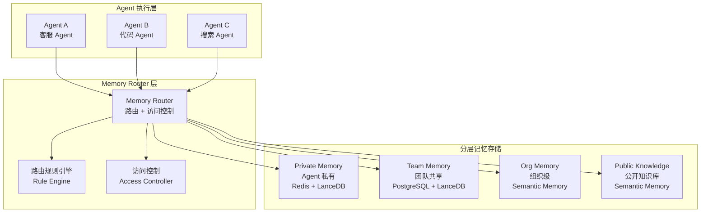

# 09 — 详细设计：Multi-Agent Memory 共享系统

> **版本**: v1.0
> **日期**: 2026-03-23
> **状态**: 详细设计完稿，待技术评审
> **关联文档**: 技术方案设计-2.md § 第九章

---

## 1. 多 Agent 记忆共享架构

### 1.1 设计背景

在单 Agent 架构下，每个 Agent 的记忆完全私有，彼此隔离。随着业务复杂度上升，多 Agent 协作场景涌现——例如：

- **代码生成 Agent** 调用 **搜索 Agent** 获取技术资料，双方需要共享当前任务的上下文；
- **客服 Agent A** 处理了一个复杂退货案例，**客服 Agent B** 接手时需要读取前置经验；
- **部门级 Skill**（如"处理 VIP 投诉"）应当对同组所有 Agent 可见，而不是由某个 Agent 独占。

上述场景要求设计一套 **Memory Router**，在保证访问隔离的前提下，实现记忆的受控共享。

### 1.2 整体架构



### 1.3 核心组件说明

| 组件 | 职责 | 技术实现 |
|------|------|---------|
| **Memory Router** | 接受 Agent 的记忆读写请求，根据规则路由到对应存储 | FastAPI 服务，无状态，可水平扩展 |
| **路由规则引擎** | 根据 agent_id、team_id、org_id、domain 决定路由目标 | 规则树 + 缓存，热路径 < 1ms |
| **访问控制器** | 验证读写权限（私有/团队/组织/公开） | RBAC + 属性策略（ABAC） |
| **Private Memory** | 每个 Agent 独立的情景记忆和工作记忆 | Redis（Working）+ LanceDB（Episode）|
| **Team Memory** | 同组 Agent 共享的技能和知识片段 | PostgreSQL（Skills）+ LanceDB（Blocks）|
| **Org Memory** | 组织级别 Semantic Memory（知识图谱） | Neo4j + LanceDB |
| **Public Knowledge** | 对外开放的知识库 | 只读 Semantic Memory 子集 |

---

## 2. 记忆可见性模型

### 2.1 四级可见性定义

```
┌─────────────────────────────────────────────────────────────────┐
│                       可见性层级                                  │
├──────────────┬──────────────────────────────────────────────────┤
│  private     │  仅创建该记忆的 Agent 本身可读写                    │
│  team        │  同 team_id 的全部 Agent 可读；创建者可写           │
│  org         │  同 org_id 的全部 Agent 可读；管理员可写            │
│  public      │  任意 Agent 可读；仅系统管理员可写                  │
└──────────────┴──────────────────────────────────────────────────┘
```

### 2.2 访问控制规则（ABAC）

访问控制基于如下属性维度判断：

- **subject**：发起请求的 Agent（携带 `agent_id`, `team_id`, `org_id`, `role`）
- **object**：目标记忆单元（携带 `visibility`, `owner_agent_id`, `owner_team_id`, `owner_org_id`）
- **action**：`READ` 或 `WRITE`

**规则矩阵**：

| 记忆可见性 | READ 权限 | WRITE 权限 |
|-----------|----------|-----------|
| `private` | `subject.agent_id == object.owner_agent_id` | 同 READ |
| `team` | `subject.team_id == object.owner_team_id` | `subject.agent_id == object.owner_agent_id OR subject.role IN ['team_admin']` |
| `org` | `subject.org_id == object.owner_org_id` | `subject.role IN ['org_admin', 'memory_curator']` |
| `public` | 无限制 | `subject.role IN ['sys_admin']` |

### 2.3 记忆升级与降级

记忆可见性可以被提升（由创建者发起）或降级（由管理员发起）：

```
private → team     （Agent 主动共享经验到团队）
team    → org      （团队管理员提升为组织级知识）
org     → public   （组织管理员发布为公开知识产品）
```

降级方向（缩小可见范围）只允许管理员执行，且需要写入审计日志。

---

## 3. Memory Router 实现

### 3.1 接口定义

```python
# memory_router/router.py

from __future__ import annotations

import asyncio
import logging
from dataclasses import dataclass, field
from enum import Enum
from typing import Any

logger = logging.getLogger(__name__)


class MemoryVisibility(str, Enum):
    PRIVATE = "private"
    TEAM = "team"
    ORG = "org"
    PUBLIC = "public"


class MemoryLayer(str, Enum):
    WORKING = "working"
    EPISODE = "episode"
    PROCEDURAL = "procedural"
    SEMANTIC = "semantic"


@dataclass
class AgentIdentity:
    agent_id: str
    team_id: str
    org_id: str
    role: str = "agent"  # agent | team_admin | org_admin | sys_admin


@dataclass
class MemoryReadRequest:
    requester: AgentIdentity
    query: str
    query_embedding: list[float]
    layers: list[MemoryLayer]
    target_visibility: list[MemoryVisibility]
    top_k: int = 5
    min_relevance: float = 0.7


@dataclass
class MemoryWriteRequest:
    requester: AgentIdentity
    content: dict[str, Any]
    layer: MemoryLayer
    visibility: MemoryVisibility
    importance_score: float = 5.0
    tags: list[str] = field(default_factory=list)


@dataclass
class MemoryResult:
    memory_id: str
    layer: MemoryLayer
    visibility: MemoryVisibility
    content: dict[str, Any]
    relevance_score: float
    owner_agent_id: str
    owner_team_id: str


class MemoryRouter:
    """
    多 Agent 记忆路由器。

    负责：
    1. 解析读写请求，调用路由规则引擎确定目标存储
    2. 执行访问控制检查
    3. 聚合多个存储后端的检索结果
    4. 写入时打标签（visibility, owner）
    """

    def __init__(
        self,
        rule_engine: RoutingRuleEngine,
        access_controller: AccessController,
        storage_registry: StorageRegistry,
    ):
        self.rule_engine = rule_engine
        self.access_controller = access_controller
        self.storage_registry = storage_registry

    async def read(self, request: MemoryReadRequest) -> list[MemoryResult]:
        """
        路由读请求：
        1. 根据 requester 身份和 target_visibility 确定可访问的存储后端
        2. 并发检索各后端
        3. 合并结果并过滤权限
        """
        # 确定路由目标
        route_targets = self.rule_engine.resolve_read_targets(
            requester=request.requester,
            target_visibility=request.target_visibility,
            layers=request.layers,
        )

        # 并发检索
        tasks = [
            self._fetch_from_backend(request, target)
            for target in route_targets
        ]
        raw_results_groups = await asyncio.gather(*tasks, return_exceptions=True)

        # 合并 + 访问控制过滤
        merged: list[MemoryResult] = []
        for group in raw_results_groups:
            if isinstance(group, Exception):
                logger.warning("Backend fetch failed: %s", group)
                continue
            for result in group:
                if self.access_controller.can_read(request.requester, result):
                    merged.append(result)

        # 按相关性排序
        merged.sort(key=lambda r: r.relevance_score, reverse=True)
        return merged[: request.top_k]

    async def write(self, request: MemoryWriteRequest) -> str:
        """
        路由写请求：
        1. 检查写入权限
        2. 根据 visibility 确定目标存储
        3. 写入并返回 memory_id
        """
        if not self.access_controller.can_write(request.requester, request.visibility):
            raise PermissionError(
                f"Agent {request.requester.agent_id} 无权写入 "
                f"visibility={request.visibility} 的记忆"
            )

        target_backend = self.rule_engine.resolve_write_target(
            layer=request.layer,
            visibility=request.visibility,
        )

        backend = self.storage_registry.get(target_backend)
        memory_id = await backend.write(
            content=request.content,
            metadata={
                "owner_agent_id": request.requester.agent_id,
                "owner_team_id": request.requester.team_id,
                "owner_org_id": request.requester.org_id,
                "visibility": request.visibility.value,
                "importance_score": request.importance_score,
                "tags": request.tags,
            },
        )

        logger.info(
            "Memory written: id=%s layer=%s visibility=%s agent=%s",
            memory_id,
            request.layer.value,
            request.visibility.value,
            request.requester.agent_id,
        )
        return memory_id

    async def _fetch_from_backend(
        self, request: MemoryReadRequest, target: RouteTarget
    ) -> list[MemoryResult]:
        backend = self.storage_registry.get(target.backend_id)
        return await backend.search(
            query_embedding=request.query_embedding,
            top_k=request.top_k * 2,  # 多取一些，留给后续过滤
            filters=target.filters,
        )
```

### 3.2 路由规则引擎

```python
# memory_router/rule_engine.py

from __future__ import annotations

from dataclasses import dataclass
from typing import Any

from .router import AgentIdentity, MemoryLayer, MemoryVisibility


@dataclass
class RouteTarget:
    backend_id: str                    # 存储后端标识
    filters: dict[str, Any]            # 传给后端的过滤条件


class RoutingRuleEngine:
    """
    路由规则引擎。

    核心规则：
    - private 记忆 → agent 私有后端，filter: owner_agent_id = requester.agent_id
    - team 记忆    → team 共享后端，filter: owner_team_id = requester.team_id
    - org 记忆     → org 后端，filter: owner_org_id = requester.org_id
    - public 记忆  → 公共知识库，无 owner 过滤

    后端命名约定：
    - {layer}_private
    - {layer}_team_{team_id}
    - {layer}_org_{org_id}
    - {layer}_public
    """

    # 可见性 → 后端 ID 模板
    _BACKEND_TEMPLATES: dict[MemoryVisibility, str] = {
        MemoryVisibility.PRIVATE: "{layer}_private",
        MemoryVisibility.TEAM: "{layer}_team",
        MemoryVisibility.ORG: "{layer}_org",
        MemoryVisibility.PUBLIC: "{layer}_public",
    }

    def resolve_read_targets(
        self,
        requester: AgentIdentity,
        target_visibility: list[MemoryVisibility],
        layers: list[MemoryLayer],
    ) -> list[RouteTarget]:
        targets: list[RouteTarget] = []

        for vis in target_visibility:
            for layer in layers:
                backend_id = self._BACKEND_TEMPLATES[vis].format(layer=layer.value)
                filters = self._build_read_filters(requester, vis)
                targets.append(RouteTarget(backend_id=backend_id, filters=filters))

        return targets

    def resolve_write_target(
        self,
        layer: MemoryLayer,
        visibility: MemoryVisibility,
    ) -> RouteTarget:
        backend_id = self._BACKEND_TEMPLATES[visibility].format(layer=layer.value)
        return RouteTarget(backend_id=backend_id, filters={})

    def _build_read_filters(
        self, requester: AgentIdentity, visibility: MemoryVisibility
    ) -> dict[str, Any]:
        if visibility == MemoryVisibility.PRIVATE:
            return {"owner_agent_id": requester.agent_id, "visibility": "private"}
        if visibility == MemoryVisibility.TEAM:
            return {"owner_team_id": requester.team_id, "visibility": "team"}
        if visibility == MemoryVisibility.ORG:
            return {"owner_org_id": requester.org_id, "visibility": "org"}
        # PUBLIC
        return {"visibility": "public"}
```

### 3.3 访问控制器

```python
# memory_router/access_controller.py

from __future__ import annotations

from .router import AgentIdentity, MemoryResult, MemoryVisibility


class AccessController:
    """
    基于 ABAC 的访问控制器。
    """

    ADMIN_ROLES = {"team_admin", "org_admin", "sys_admin"}

    def can_read(self, requester: AgentIdentity, target: MemoryResult) -> bool:
        vis = target.visibility
        if vis == MemoryVisibility.PUBLIC:
            return True
        if vis == MemoryVisibility.ORG:
            # org_id 匹配即可
            return requester.org_id == target.owner_team_id  # owner_org_id 存在 owner_team_id 字段的 org 层
        if vis == MemoryVisibility.TEAM:
            return requester.team_id == target.owner_team_id
        # PRIVATE
        return requester.agent_id == target.owner_agent_id

    def can_write(self, requester: AgentIdentity, visibility: MemoryVisibility) -> bool:
        if visibility == MemoryVisibility.PRIVATE:
            return True  # 任何 Agent 可写自己的私有记忆
        if visibility == MemoryVisibility.TEAM:
            return True  # Agent 可以共享经验到团队
        if visibility == MemoryVisibility.ORG:
            return requester.role in {"org_admin", "sys_admin", "memory_curator"}
        # PUBLIC
        return requester.role == "sys_admin"

    def can_upgrade_visibility(
        self,
        requester: AgentIdentity,
        current: MemoryVisibility,
        target: MemoryVisibility,
    ) -> bool:
        """判断是否可以提升记忆可见性"""
        upgrade_path = [
            MemoryVisibility.PRIVATE,
            MemoryVisibility.TEAM,
            MemoryVisibility.ORG,
            MemoryVisibility.PUBLIC,
        ]
        current_idx = upgrade_path.index(current)
        target_idx = upgrade_path.index(target)
        if target_idx <= current_idx:
            return False  # 不能降级或平级

        # 从 private 升到 team：创建者可操作
        if current == MemoryVisibility.PRIVATE and target == MemoryVisibility.TEAM:
            return True

        # 其余升级需要管理员权限
        return requester.role in self.ADMIN_ROLES
```

---

## 4. 共享 Procedural Memory（团队级 Skill）

### 4.1 写入规则

团队级 Skill 的写入流程如下：

```
Agent 执行成功的任务
        │
        ▼
Skill Mining Pipeline（自动挖掘）
        │
        ▼ skill_candidate 生成
        │
        ▼
写入目标判断：
  ├── success_rate >= 0.85 AND team_scope=true
  │         → visibility=TEAM，写入团队 Procedural Memory
  ├── success_rate >= 0.80 AND org_scope=true AND org_admin 批准
  │         → visibility=ORG，写入组织级 Procedural Memory
  └── 其他
            → visibility=PRIVATE，仅写入 Agent 私有 Procedural Memory
```

**写入 API 示例**：

```python
# 将自动挖掘的技能写入团队级 Procedural Memory
write_req = MemoryWriteRequest(
    requester=AgentIdentity(
        agent_id="agent_cs_001",
        team_id="team_customer_service",
        org_id="org_acme",
        role="agent",
    ),
    content={
        "skill_name": "处理退货投诉-VIP快速通道",
        "domain": "customer_service",
        "workflow": {...},
        "success_rate": 0.91,
        "source_episodes": ["ep_001", "ep_023"],
    },
    layer=MemoryLayer.PROCEDURAL,
    visibility=MemoryVisibility.TEAM,
    importance_score=8.5,
    tags=["return", "vip", "complaint"],
)
memory_id = await router.write(write_req)
```

### 4.2 检索规则

Agent 检索 Procedural Memory 时，Router 自动合并以下范围的 Skill：

```
检索优先级（高 → 低）：
1. private：Agent 自身私有 Skill（最精准，匹配个人习惯）
2. team：团队共享 Skill（通用性强，经过多 Agent 验证）
3. org：组织级 Skill（覆盖范围广，但可能不够精细）
4. public：公开 Skill（最通用，精准度最低）
```

**合并策略**：若不同层级存在相同 domain 的 Skill，优先返回私有层的版本；若私有层无匹配，依次向上查找。

```python
async def retrieve_skill(
    requester: AgentIdentity, task_description: str
) -> list[MemoryResult]:
    read_req = MemoryReadRequest(
        requester=requester,
        query=task_description,
        query_embedding=await embed(task_description),
        layers=[MemoryLayer.PROCEDURAL],
        target_visibility=[
            MemoryVisibility.PRIVATE,
            MemoryVisibility.TEAM,
            MemoryVisibility.ORG,
        ],
        top_k=5,
    )
    results = await router.read(read_req)

    # 去重：同一 skill_name 只保留最高层级版本
    return _deduplicate_by_skill_name(results)
```

---

## 5. 记忆冲突解决

### 5.1 冲突场景分类

在多 Agent 写入共享记忆时，可能出现以下冲突类型：

| 冲突类型 | 描述 | 示例 |
|---------|------|------|
| **内容冲突** | 两个 Agent 对同一事实写入了相互矛盾的内容 | Agent A 写"退货期 30 天"，Agent B 写"退货期 15 天" |
| **技能冲突** | 两个 Agent 挖掘出了相似但步骤不同的技能 | 相似度 > 0.9 但 workflow 不同 |
| **状态冲突** | 同一 Agent 在多实例部署时同时更新同一条记忆 | 并发写入 Working Memory |
| **版本冲突** | 低版本技能与高版本技能同时存在，引用混乱 | skill_v1 和 skill_v3 被同时检索 |

### 5.2 冲突检测

```python
# memory_router/conflict_detector.py

from __future__ import annotations

import numpy as np
from dataclasses import dataclass
from enum import Enum
from typing import Any


class ConflictType(str, Enum):
    CONTENT_CONTRADICTION = "content_contradiction"
    SKILL_OVERLAP = "skill_overlap"
    VERSION_CONFLICT = "version_conflict"
    NO_CONFLICT = "no_conflict"


@dataclass
class ConflictReport:
    conflict_type: ConflictType
    existing_memory_id: str
    incoming_content: dict[str, Any]
    similarity: float
    recommendation: str  # "merge" | "supersede" | "reject" | "accept"


class ConflictDetector:

    SKILL_OVERLAP_THRESHOLD = 0.90   # Embedding 相似度超过此值视为技能重复
    CONTENT_CONFLICT_THRESHOLD = 0.85  # 内容相似但语义相反

    def detect(
        self,
        incoming: dict[str, Any],
        incoming_embedding: list[float],
        existing_candidates: list[dict[str, Any]],
    ) -> ConflictReport:
        """
        检测新写入内容与现有记忆是否冲突。
        """
        for existing in existing_candidates:
            sim = self._cosine_similarity(
                incoming_embedding, existing["embedding"]
            )

            # 技能重叠检测
            if (
                incoming.get("layer") == "procedural"
                and sim > self.SKILL_OVERLAP_THRESHOLD
            ):
                return ConflictReport(
                    conflict_type=ConflictType.SKILL_OVERLAP,
                    existing_memory_id=existing["memory_id"],
                    incoming_content=incoming,
                    similarity=sim,
                    recommendation=self._skill_overlap_recommendation(
                        incoming, existing, sim
                    ),
                )

        return ConflictReport(
            conflict_type=ConflictType.NO_CONFLICT,
            existing_memory_id="",
            incoming_content=incoming,
            similarity=0.0,
            recommendation="accept",
        )

    def _skill_overlap_recommendation(
        self,
        incoming: dict[str, Any],
        existing: dict[str, Any],
        similarity: float,
    ) -> str:
        incoming_sr = incoming.get("success_rate", 0)
        existing_sr = existing.get("success_rate", 0)

        if similarity > 0.97:
            # 极度相似：直接合并
            return "merge"
        if incoming_sr > existing_sr + 0.05:
            # 新技能明显更好：用新版本取代旧版本
            return "supersede"
        if incoming_sr < existing_sr - 0.05:
            # 新技能明显更差：拒绝
            return "reject"
        # 相近水平：接受并创建新版本
        return "accept_new_version"

    @staticmethod
    def _cosine_similarity(a: list[float], b: list[float]) -> float:
        arr_a = np.array(a)
        arr_b = np.array(b)
        denom = np.linalg.norm(arr_a) * np.linalg.norm(arr_b)
        if denom == 0:
            return 0.0
        return float(np.dot(arr_a, arr_b) / denom)
```

### 5.3 冲突解决策略

```python
# memory_router/conflict_resolver.py

from __future__ import annotations

import logging
from typing import Any

from .conflict_detector import ConflictReport, ConflictType

logger = logging.getLogger(__name__)


class ConflictResolver:
    """
    根据 ConflictDetector 的报告执行冲突解决。

    策略：
    - merge:              将两条记忆合并为一条（调用 LLM 做语义合并）
    - supersede:          新记忆替代旧记忆，旧记忆标记为 deprecated
    - reject:             拒绝写入，返回现有记忆 ID
    - accept_new_version: 以新版本号写入，保留旧版本历史
    - accept:             直接写入（无冲突）
    """

    def __init__(self, storage_backend, llm_client):
        self.storage = storage_backend
        self.llm = llm_client

    async def resolve(
        self,
        report: ConflictReport,
        incoming: dict[str, Any],
    ) -> tuple[str, str]:
        """
        返回 (memory_id, action_taken)
        """
        rec = report.recommendation

        if rec == "accept" or report.conflict_type == ConflictType.NO_CONFLICT:
            memory_id = await self.storage.write(incoming)
            return memory_id, "accepted"

        if rec == "reject":
            logger.info(
                "Conflict resolved: reject incoming, keep existing=%s",
                report.existing_memory_id,
            )
            return report.existing_memory_id, "rejected"

        if rec == "supersede":
            await self.storage.mark_deprecated(report.existing_memory_id)
            memory_id = await self.storage.write(incoming)
            logger.info(
                "Conflict resolved: supersede old=%s with new=%s",
                report.existing_memory_id,
                memory_id,
            )
            return memory_id, "superseded"

        if rec == "merge":
            existing = await self.storage.get(report.existing_memory_id)
            merged_content = await self._llm_merge(existing, incoming)
            await self.storage.mark_deprecated(report.existing_memory_id)
            memory_id = await self.storage.write(merged_content)
            return memory_id, "merged"

        if rec == "accept_new_version":
            # 在 skill_id 下创建新版本号
            new_version = incoming.get("version", 1) + 1
            incoming["version"] = new_version
            incoming["previous_version_id"] = report.existing_memory_id
            memory_id = await self.storage.write(incoming)
            return memory_id, f"new_version_{new_version}"

        raise ValueError(f"未知的冲突解决建议: {rec}")

    async def _llm_merge(
        self, existing: dict[str, Any], incoming: dict[str, Any]
    ) -> dict[str, Any]:
        prompt = f"""
请合并以下两条含义相近的技能/知识记录，生成一条更完整、准确的版本。

记录 1（已有）：
{existing}

记录 2（新写入）：
{incoming}

输出要求：JSON 格式，保留两者的有效信息，消除冗余，统一成功率取加权平均。
"""
        result = await self.llm.generate(prompt, response_format="json")
        return result
```

---

## 6. 分布式记忆同步

### 6.1 多实例部署一致性模型

Memory Router 本身是无状态服务，可水平扩展。状态全部集中在后端存储（Redis、PostgreSQL、LanceDB）中。一致性问题主要出现在以下两个层面：

| 层面 | 问题 | 解决方案 |
|------|------|---------|
| **Working Memory（Redis）** | 多 Agent 实例并发更新同一 session 的 Working Memory | Redis Lua 脚本实现原子 CAS；使用 Redis Stream 做写入队列 |
| **Procedural Memory（PostgreSQL）** | 并发写入 skill 表导致重复行 | `INSERT ... ON CONFLICT DO UPDATE`（Upsert）；技能写入加分布式锁 |
| **Episode Memory（LanceDB）** | append-only，天然无写冲突 | 无需特殊处理；读取时按 ingestion_time 排序 |
| **Semantic Memory（Neo4j）** | 并发写入相同节点/边 | Neo4j 事务 + 乐观锁（使用 MERGE 而非 CREATE）|

### 6.2 Working Memory 的 CAS 写入

```python
# 使用 Redis Lua 脚本实现原子 Compare-And-Swap
WORKING_MEMORY_CAS_SCRIPT = """
local current_version = redis.call('HGET', KEYS[1], 'version')
if current_version == false or current_version == ARGV[1] then
    redis.call('HMSET', KEYS[1], unpack(ARGV, 2))
    redis.call('EXPIRE', KEYS[1], ARGV[#ARGV])
    return 1
else
    return 0
end
"""

async def update_working_memory_cas(
    redis_client, wm_key: str, expected_version: int, new_data: dict, ttl: int
) -> bool:
    """
    原子更新 Working Memory，仅当版本号匹配时成功。
    成功返回 True，版本冲突返回 False（调用方需重试）。
    """
    new_data["version"] = str(expected_version + 1)
    flat_args = [str(expected_version)]
    for k, v in new_data.items():
        flat_args.extend([k, str(v)])
    flat_args.append(str(ttl))

    result = await redis_client.eval(
        WORKING_MEMORY_CAS_SCRIPT,
        1,           # 1 个 key
        wm_key,
        *flat_args,
    )
    return bool(result)
```

### 6.3 Skill 写入的分布式锁

```python
import asyncio
from contextlib import asynccontextmanager


@asynccontextmanager
async def skill_write_lock(redis_client, skill_name: str, timeout: int = 10):
    """
    技能写入分布式锁，防止并发写入产生重复技能。
    """
    lock_key = f"lock:skill_write:{skill_name}"
    acquired = await redis_client.set(
        lock_key, "1", nx=True, ex=timeout
    )
    if not acquired:
        raise TimeoutError(f"无法获取技能写入锁: {skill_name}，请稍后重试")
    try:
        yield
    finally:
        await redis_client.delete(lock_key)


# 使用示例
async def write_skill_safe(router, write_req, redis_client):
    async with skill_write_lock(
        redis_client, write_req.content.get("skill_name", "unknown")
    ):
        memory_id = await router.write(write_req)
    return memory_id
```

### 6.4 最终一致性保证

对于非强一致性要求的 Semantic Memory（Neo4j 知识图谱），采用**事件溯源 + 幂等写入**方案：

```
写入事件 → Kafka Topic: memory.semantic.writes
                │
                ▼
        Kafka Consumer（每个实例独立消费）
                │
                ▼
        Neo4j MERGE 语句（幂等：相同 node_id 不重复创建）
                │
                ▼
        写入 ClickHouse 审计日志（记录 ingestion_time）
```

通过 Kafka offset 保证"至少一次"语义，加上 MERGE 幂等写入，实现最终一致性。

---

## 7. UML 类图

```
┌─────────────────────────────────────────────────────────────────────┐
│                         Memory Router 类图                           │
└─────────────────────────────────────────────────────────────────────┘

┌───────────────────┐          ┌──────────────────────┐
│   MemoryRouter    │          │  RoutingRuleEngine   │
├───────────────────┤          ├──────────────────────┤
│ - rule_engine     │◆────────▶│ - BACKEND_TEMPLATES  │
│ - access_ctrl     │          ├──────────────────────┤
│ - storage_reg     │          │ + resolve_read_targets│
├───────────────────┤          │ + resolve_write_target│
│ + read(req)       │          │ - _build_read_filters │
│ + write(req)      │          └──────────────────────┘
│ - _fetch_backend  │
└─────────┬─────────┘
          │
          │◆
          │
┌─────────▼──────────┐         ┌──────────────────────┐
│  AccessController  │         │   StorageRegistry    │
├────────────────────┤         ├──────────────────────┤
│ - ADMIN_ROLES      │         │ - _backends: dict    │
├────────────────────┤         ├──────────────────────┤
│ + can_read(...)    │         │ + get(backend_id)    │
│ + can_write(...)   │         │ + register(id, b)    │
│ + can_upgrade(...) │         └──────────┬───────────┘
└────────────────────┘                    │
                                          │ «interface»
                               ┌──────────▼──────────┐
                               │   StorageBackend    │
                               ├─────────────────────┤
                               │ + search(emb, k, f) │
                               │ + write(content, m) │
                               │ + get(memory_id)    │
                               │ + mark_deprecated() │
                               └──────────┬──────────┘
                                    ▲     ▲     ▲
                            ┌───────┘  ┌──┘  ┌──┘
                    ┌───────┴──┐  ┌────┴──┐  ┌┴──────────┐
                    │ Redis    │  │ Lance │  │PostgreSQL │
                    │ Backend  │  │Backend│  │ Backend   │
                    └──────────┘  └───────┘  └───────────┘

┌──────────────────────────────────────────────────────────────────┐
│                      数据模型类图                                   │
└──────────────────────────────────────────────────────────────────┘

┌─────────────────────┐         ┌──────────────────────┐
│   AgentIdentity     │         │  MemoryReadRequest   │
├─────────────────────┤         ├──────────────────────┤
│ + agent_id: str     │◄────────│ + requester          │
│ + team_id: str      │         │ + query: str         │
│ + org_id: str       │         │ + query_embedding    │
│ + role: str         │         │ + layers: list       │
└─────────────────────┘         │ + target_visibility  │
                                │ + top_k: int         │
         ┌──────────────────────┘ + min_relevance: f  │
         │                       └──────────────────────┘
         │
┌────────▼─────────────┐         ┌──────────────────────┐
│  MemoryWriteRequest  │         │    MemoryResult      │
├──────────────────────┤         ├──────────────────────┤
│ + requester          │         │ + memory_id: str     │
│ + content: dict      │         │ + layer: MemoryLayer │
│ + layer: MemoryLayer │         │ + visibility         │
│ + visibility         │         │ + content: dict      │
│ + importance_score   │         │ + relevance_score    │
│ + tags: list[str]    │         │ + owner_agent_id     │
└──────────────────────┘         │ + owner_team_id      │
                                 └──────────────────────┘

┌─────────────────────┐         ┌──────────────────────┐
│  ConflictDetector   │◆───────▶│    ConflictReport    │
├─────────────────────┤         ├──────────────────────┤
│ + detect(...)       │         │ + conflict_type      │
└─────────────────────┘         │ + existing_memory_id │
                                │ + similarity: float  │
┌─────────────────────┐         │ + recommendation     │
│  ConflictResolver   │◆───────▶└──────────────────────┘
├─────────────────────┤
│ + resolve(...)      │
│ - _llm_merge(...)   │
└─────────────────────┘
```

---

## 8. UML 时序图：Agent A 通过 Router 读取 Agent B 共享记忆

```
Agent A          Memory Router      RuleEngine     AccessCtrl      TeamBackend      AgentB-Backend
  │                   │                │               │                │                 │
  │  read(request)    │                │               │                │                 │
  │──────────────────►│                │               │                │                 │
  │                   │                │               │                │                 │
  │                   │ resolve_read   │               │                │                 │
  │                   │ _targets(...)  │               │                │                 │
  │                   │───────────────►│               │                │                 │
  │                   │                │               │                │                 │
  │                   │ [RouteTarget   │               │                │                 │
  │                   │  list]         │               │                │                 │
  │                   │◄───────────────│               │                │                 │
  │                   │                │               │                │                 │
  │                   │                                │                │                 │
  │     ┌─────────────────────────────────────────────────────────┐    │                 │
  │     │ asyncio.gather (并发检索所有目标后端)                      │    │                 │
  │     └─────────────────────────────────────────────────────────┘    │                 │
  │                   │                                │                │                 │
  │                   │  search(embedding, k, filters) │                │                 │
  │                   │  {owner_team_id=teamA}         │                │                 │
  │                   │────────────────────────────────────────────────►│                 │
  │                   │                                │                │                 │
  │                   │  [raw_results from team backend]                │                 │
  │                   │◄────────────────────────────────────────────────│                 │
  │                   │                                │                │                 │
  │                   │  can_read(requesterA, result1) │                │                 │
  │                   │────────────────────────────────►               │                 │
  │                   │                                │               │                 │
  │                   │  True (team_id matches)        │               │                 │
  │                   │◄───────────────────────────────                │                 │
  │                   │                                │                │                 │
  │                   │  NOTE: Agent B 的 private 记忆                   │                 │
  │                   │  → can_read 返回 False，过滤掉                    │                 │
  │                   │                                │                │                 │
  │  [merged,         │                                │                │                 │
  │   filtered,       │                                │                │                 │
  │   sorted results] │                                │                │                 │
  │◄──────────────────│                                │                │                 │
  │                   │                                │                │                 │
```

**关键说明**：

1. Agent A 的请求中 `target_visibility=[TEAM, ORG]`，不包含 PRIVATE，因此 Agent B 的私有记忆根本不进入路由目标，不存在泄露风险。
2. 即便 Agent A 错误地请求了 PRIVATE，AccessController 在结果合并阶段也会过滤掉不属于自己的私有记忆（双重防护）。
3. 全程无需 Agent B 在线，共享记忆是异步写入、随时可读的。

---

## 9. 测试用例

### 9.1 测试覆盖范围

```
tests/
├── unit/
│   ├── test_memory_router.py
│   ├── test_routing_rule_engine.py
│   ├── test_access_controller.py
│   └── test_conflict_detector.py
└── integration/
    └── test_multi_agent_memory.py
```

### 9.2 单元测试

```python
# tests/unit/test_memory_router.py

import pytest
import asyncio
from unittest.mock import AsyncMock, MagicMock, patch

from memory_router.router import (
    AgentIdentity, MemoryLayer, MemoryReadRequest, MemoryResult,
    MemoryVisibility, MemoryRouter, MemoryWriteRequest
)
from memory_router.rule_engine import RoutingRuleEngine, RouteTarget
from memory_router.access_controller import AccessController


# ─── Fixtures ────────────────────────────────────────────────────────────────

@pytest.fixture
def agent_a() -> AgentIdentity:
    return AgentIdentity(
        agent_id="agent_001",
        team_id="team_cs",
        org_id="org_acme",
        role="agent",
    )


@pytest.fixture
def agent_b() -> AgentIdentity:
    return AgentIdentity(
        agent_id="agent_002",
        team_id="team_cs",
        org_id="org_acme",
        role="agent",
    )


@pytest.fixture
def agent_other_team() -> AgentIdentity:
    return AgentIdentity(
        agent_id="agent_003",
        team_id="team_engineering",
        org_id="org_acme",
        role="agent",
    )


@pytest.fixture
def org_admin() -> AgentIdentity:
    return AgentIdentity(
        agent_id="admin_001",
        team_id="team_admin",
        org_id="org_acme",
        role="org_admin",
    )


@pytest.fixture
def private_memory_result(agent_a) -> MemoryResult:
    return MemoryResult(
        memory_id="mem_001",
        layer=MemoryLayer.EPISODE,
        visibility=MemoryVisibility.PRIVATE,
        content={"summary": "私有经历"},
        relevance_score=0.90,
        owner_agent_id=agent_a.agent_id,
        owner_team_id=agent_a.team_id,
    )


@pytest.fixture
def team_memory_result(agent_b) -> MemoryResult:
    return MemoryResult(
        memory_id="mem_002",
        layer=MemoryLayer.PROCEDURAL,
        visibility=MemoryVisibility.TEAM,
        content={"skill_name": "处理退货"},
        relevance_score=0.85,
        owner_agent_id=agent_b.agent_id,
        owner_team_id=agent_b.team_id,
    )


@pytest.fixture
def mock_router(agent_a, team_memory_result):
    rule_engine = MagicMock(spec=RoutingRuleEngine)
    access_controller = AccessController()
    storage_registry = MagicMock()

    mock_backend = AsyncMock()
    mock_backend.search.return_value = [team_memory_result]
    storage_registry.get.return_value = mock_backend

    rule_engine.resolve_read_targets.return_value = [
        RouteTarget(backend_id="procedural_team", filters={"owner_team_id": "team_cs"})
    ]

    return MemoryRouter(
        rule_engine=rule_engine,
        access_controller=access_controller,
        storage_registry=storage_registry,
    )


# ─── Test Cases ───────────────────────────────────────────────────────────────

class TestAccessController:

    def setup_method(self):
        self.ac = AccessController()

    # TC-001: 同一 Agent 可读自己的私有记忆
    def test_private_memory_accessible_by_owner(self, agent_a, private_memory_result):
        assert self.ac.can_read(agent_a, private_memory_result) is True

    # TC-002: 其他 Agent 不能读取私有记忆
    def test_private_memory_not_accessible_by_other_agent(
        self, agent_b, private_memory_result
    ):
        assert self.ac.can_read(agent_b, private_memory_result) is False

    # TC-003: 同团队 Agent 可读团队记忆
    def test_team_memory_accessible_by_same_team(self, agent_a, team_memory_result):
        assert self.ac.can_read(agent_a, team_memory_result) is True

    # TC-004: 不同团队 Agent 不能读团队记忆
    def test_team_memory_not_accessible_by_different_team(
        self, agent_other_team, team_memory_result
    ):
        assert self.ac.can_read(agent_other_team, team_memory_result) is False

    # TC-005: 普通 Agent 不能写入 org 级记忆
    def test_agent_cannot_write_org_memory(self, agent_a):
        assert self.ac.can_write(agent_a, MemoryVisibility.ORG) is False

    # TC-006: org_admin 可以写入 org 级记忆
    def test_org_admin_can_write_org_memory(self, org_admin):
        assert self.ac.can_write(org_admin, MemoryVisibility.ORG) is True

    # TC-007: Agent 可以提升私有记忆到团队级
    def test_agent_can_upgrade_private_to_team(self, agent_a):
        assert self.ac.can_upgrade_visibility(
            agent_a,
            MemoryVisibility.PRIVATE,
            MemoryVisibility.TEAM,
        ) is True

    # TC-008: 普通 Agent 不能直接将私有记忆升级到 org 级
    def test_agent_cannot_upgrade_private_to_org(self, agent_a):
        assert self.ac.can_upgrade_visibility(
            agent_a,
            MemoryVisibility.PRIVATE,
            MemoryVisibility.ORG,
        ) is False

    # TC-009: 不允许降级可见性
    def test_cannot_downgrade_visibility(self, org_admin):
        assert self.ac.can_upgrade_visibility(
            org_admin,
            MemoryVisibility.TEAM,
            MemoryVisibility.PRIVATE,
        ) is False


class TestMemoryRouter:

    # TC-010: Router.read 返回有访问权限的结果
    @pytest.mark.asyncio
    async def test_read_returns_accessible_results(self, agent_a, mock_router):
        request = MemoryReadRequest(
            requester=agent_a,
            query="处理退货",
            query_embedding=[0.1] * 1536,
            layers=[MemoryLayer.PROCEDURAL],
            target_visibility=[MemoryVisibility.TEAM],
            top_k=5,
        )
        results = await mock_router.read(request)
        assert len(results) == 1
        assert results[0].memory_id == "mem_002"

    # TC-011: write 权限检查 — 无权限时抛出异常
    @pytest.mark.asyncio
    async def test_write_raises_permission_error_for_unauthorized(
        self, agent_a, mock_router
    ):
        write_req = MemoryWriteRequest(
            requester=agent_a,
            content={"data": "test"},
            layer=MemoryLayer.SEMANTIC,
            visibility=MemoryVisibility.PUBLIC,
        )
        with pytest.raises(PermissionError):
            await mock_router.write(write_req)

    # TC-012: 后端故障时，Router 跳过该后端，不整体失败
    @pytest.mark.asyncio
    async def test_read_tolerates_backend_failure(self, agent_a):
        rule_engine = MagicMock(spec=RoutingRuleEngine)
        access_controller = AccessController()
        storage_registry = MagicMock()

        failing_backend = AsyncMock()
        failing_backend.search.side_effect = ConnectionError("Redis unreachable")
        storage_registry.get.return_value = failing_backend

        rule_engine.resolve_read_targets.return_value = [
            RouteTarget(backend_id="working_private", filters={})
        ]

        router = MemoryRouter(rule_engine, access_controller, storage_registry)
        request = MemoryReadRequest(
            requester=agent_a,
            query="test",
            query_embedding=[0.1] * 1536,
            layers=[MemoryLayer.WORKING],
            target_visibility=[MemoryVisibility.PRIVATE],
            top_k=5,
        )
        # 应返回空列表，不抛异常
        results = await router.read(request)
        assert results == []
```

---

*文档版本: v1.0*
*最后更新: 2026-03-23*
