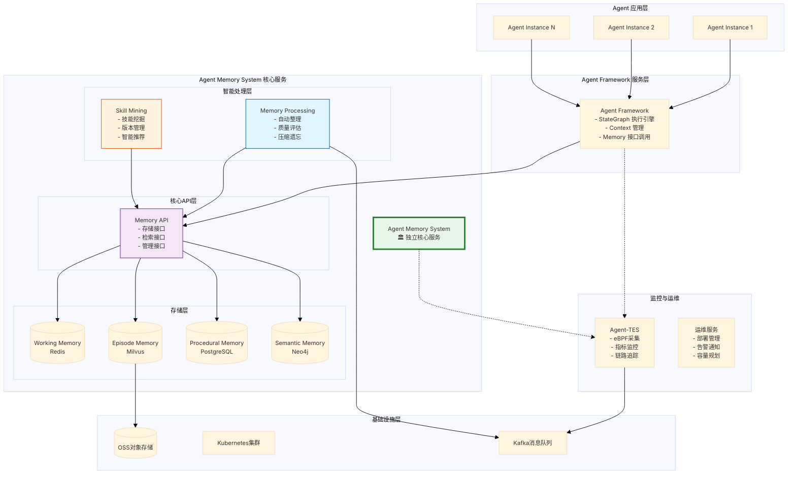
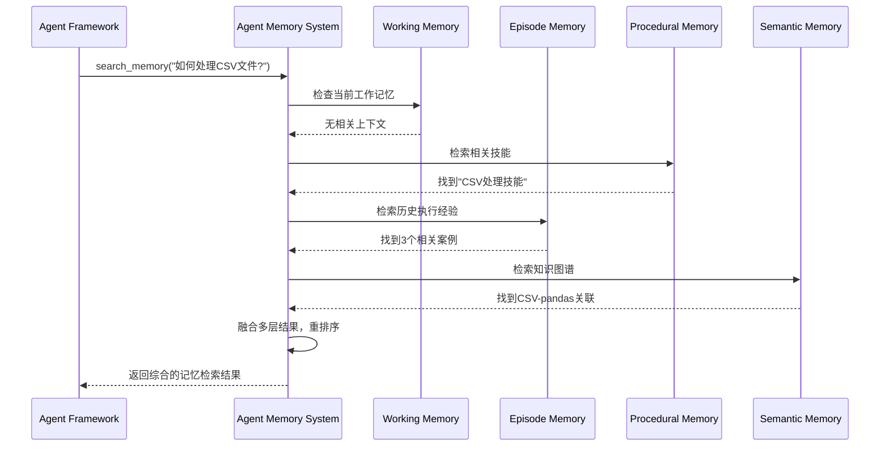
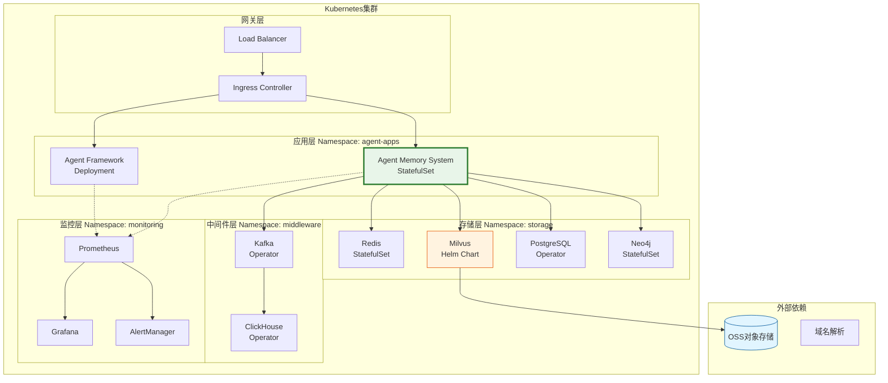
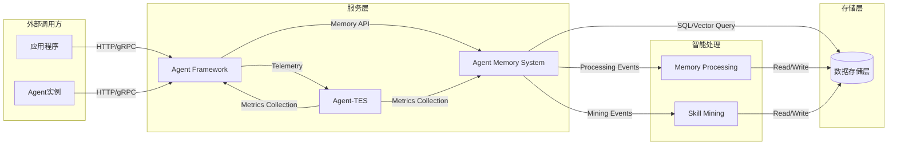

# Agent Memory Infrastructure — 概要设计（版本B）

> **方案代号**: 版本B（Plan-B）
> **文档类型**: 概要设计（Overview Design）
> **版本**: v2.0
> **日期**: 2026-03-23
> **状态**: 设计定稿，指导后续详细设计

---

## 文档导航

本方案包含以下文档（按阅读优先级排序）：

| 序号     | 文档                         | 内容摘要                      | 核心改进点              | 状态  |
| ------ | -------------------------- | ------------------------- | ------------------ | --- |
| **00** | **本文档** — 概要设计             | 系统总览、核心架构、技术栈选型           | **集成原始架构图，突出核心服务** | ✅   |
| 01     | Agent-Memory-System 核心设计   | 独立核心服务完整API设计             | **核心服务化，清晰接口契约**   | ✅   |
| 02     | Agent Framework 详细设计       | 执行中枢、LangGraph集成、Memory集成 | **简化架构，专注核心职责**    | ✅   |
| 03     | Memory Processing Pipeline | 记忆处理管道、自动整理、智能模块          | **独立智能处理管道**       | ✅   |
| 04     | Storage & Retrieval 设计     | 存储架构、5路检索、技术栈优化           | **OSS+Milvus技术栈**  | ✅   |
| 05     | Skill Mining & Discovery   | 技能挖掘算法、版本管理、推荐系统          | **更智能的技能进化机制**     | ✅   |
| 06     | Agent-TES 遥测系统             | 三层遥测、Evidence Schema、监控告警 | **更精准的可观测性**       | ✅   |
| 07     | API 接口设计                   | REST API规范、开发者SDK、功能测试    | **开发者友好的接口设计**     | ✅   |
| 08     | Multi-Agent 协作设计           | 记忆共享、分布式协调、权限控制           | **多Agent协作优化**     | ✅   |
| 09     | Storage Schema 设计          | 完整DDL、初始化脚本、数据迁移          | **生产就绪的存储架构**      | ✅   |
| 10     | 部署与运维                      | K8s配置、监控告警、扩容策略           | **云原生部署架构**        | ✅   |
| 11     | 测试与质量保证                    | 单元/集成/性能测试、质量门禁           | **完整的测试体系**        | ✅   |

---

## 第一章：系统背景与核心改进

### 1.1 版本A回顾与问题识别

**版本A的核心价值：**
- ✅ 建立了完整的4层记忆架构理论基础
- ✅ 设计了详细的技术组件和实现方案
- ✅ 提供了20,470行的完整技术文档

**版本A存在的关键问题：**

| 问题类别        | 具体表现                           | 版本B解决方案                        |
| ----------- | ------------------------------ | ------------------------------ |
| **架构清晰度**   | Agent Memory System地位分散         | **独立核心服务架构**                   |
| **架构图质量**   | Mermaid图表有转义字符、布局不整齐           | **高质量架构图，消除显示问题**              |
| **原始图集成**   | 3个Excalidraw手绘图未有效集成           | **合理嵌入并详细解释原始架构图**             |
| **术语精确性**   | "Level L5-L1"滥用，层次vs顺序混淆        | **精确术语使用，清晰概念定义**              |
| **开发协作**    | 缺乏"谁调用谁"的清晰说明                  | **接口契约和上下游关系明确**               |
| **技术栈对齐**   | 使用S3、部分向量存储技术选型不匹配            | **OSS对象存储 + Milvus向量数据库**      |

### 1.2 版本B核心设计理念

**理念1：Agent Memory System 独立核心服务化**

```
版本A架构：Agent Memory System 分散在多个组件中
版本B架构：Agent Memory System 作为独立的核心服务
```

**为什么选择独立核心服务？**
- ✅ **清晰的服务边界** - 明确的API契约，便于团队协作开发
- ✅ **多Agent共享** - 一个Memory服务支持多个Agent实例
- ✅ **独立扩展** - 内存服务可独立部署、监控、扩容
- ✅ **技术栈统一** - 使用OSS、Milvus等现有基础设施

**理念2：混合架构（核心API + 智能模块）**

Agent Memory System内部采用分层设计：
- **核心API层** - 提供基础的存储和检索服务
- **智能处理层** - 可选的自动整理、技能挖掘等增强功能

---

## 第二章：整体系统架构

### 2.1 原始架构图集成与解读

基于项目初期的手绘架构图，我们首先回顾设计的核心思路：
#### 架构图1：服务拓扑全览
![[Excalidraw/图1-服务拓扑架构-生成版.excalidraw.md|1000]]

**图解说明：**

图中展示了4个核心服务，及其数据流向：

| 服务 | 图中位置 | 关键能力 |
|------|---------|---------|
| **Agent Framework** | 中心菱形 | 执行中枢，驱动整个系统运转 |
| **Agent-TES**（Telemetry & Evidence Service）| 左上，橙色框 | 非侵入式采集（eBPF/Sidecar），记录用户请求、CoT推理链、工具调用、决策置信度、结果反馈等全量证据 |
| **Agentic Memory** | 下方，绿色框 | 持久化记忆存储，接收来自Agent Framework的memory IO和来自Agent-TES的streaming data pipeline |
| **Skill-MDS**（Skill Mining & Discovery Service）| 右上，紫色框 | 技能目录、检索推荐，技能网格拓扑，以及从Memory中挖掘归纳新技能 |

**服务间数据流（5条连线）：**
1. Agent Framework → Agent-TES：`tracing`，Agent Framework主动上报执行轨迹
2. Agent Framework ↔ Agentic Memory：`memory IO`，双向读写记忆
3. Agent-TES → Agentic Memory：`streaming data pipeline`，证据流异步写入
4. Agentic Memory → Skill-MDS：`skill gen pipeline`，触发技能挖掘
5. Skill-MDS → Agent Framework：`applying`，将匹配的技能注入Agent执行上下文

> **⚠️ 重要说明（原始设计与现行设计的差异）：**
> 架构图1绘制于初始设计阶段，Agentic Memory内部仅画了3层：Working Memory、Procedural Memory、Semantic Memory，**尚未包含 Episode Memory**。**Episode Memory（情景记忆）是在技术方案设计v2阶段增加的第4层，它填补了"有哪些执行经历"这一关键语义层次**。 版本B的4层体系以v2为准。

#### 架构图2：数据流与存储层级
![[Excalidraw/图2-数据流与存储分层-生成版.excalidraw.md|800]]

**图解说明：**

这张图以"模块视角"描述整个系统的数据流向与存储分层，图中包含几个关键系统和设计理念标注。

**顶部系统模块：**

| 模块 | 说明 | 数据来源 |
|------|------|---------|
| **业务系统/服务** | 外部业务入口，通过 API Gateway 或 MCP 协议接入 | 业务数据和信息 |
| **multi-agent system** | 多智能体执行系统，负责具体的 Agent 任务执行 | 思考过程、交互数据、工具调用 |
| **trace system** | 链路追踪系统，非侵入式采集 Agent 的执行轨迹（CoT、决策链路、引用证据等） | multi-agent system 的执行日志 |

**三大存储层（自上而下，越来越结构化）：**

| 层次 | 内容 | 定位 |
|------|------|------|
| **memory lake（记忆湖）** | Knowledge Tree、Graph、Time Series、Vector | 结构化的"记忆数据库"，支持多种查询模式 |
| **multimodal lake（多模态数据湖）** | CoT、Docs、Video、Img、Table | 原始的多模态数据，Agent时代的"数据湖" |
| **Knowledge Engineering（知识工程）** | Agentic Memory、Skill Gen、Agentic RL Dataset、Chain of Evidence | 最终的知识产出 |

**数据流向：**

- **写入路径（两条）：**
  1. **multi-agent system** 执行时，产生思考过程(CoT)、交互数据、引用证据、决策链路 → 经 **trace system** → 流入 **multimodal lake**
  2. **业务系统/服务**（API Gateway/MCP）产生的业务数据和信息 → 直接流入 **memory lake**

- **读取路径：**
  - multi-agent system 需要上下文时 → 通过 **structured memory retrieval**（语义检索、精准匹配、粗召回、精排、结构化拼装）← 从 **memory lake** 层获取

**图中两处关键设计理念标注：**

> 🔴 **"搜索才是记忆的核心，记忆的构建是为了支持有效的搜索"**
>
> 这是整个系统的第一设计原则：存储结构（Graph、Vector、Tree）的设计，都以"能被高效检索到"为最终评判标准，而不是以存储完整性为目标。

> 📝 **"AI Agent时代的ETL和Datalake，将数据转化为知识，闭环服务于Agent系统"**
>
> multimodal lake 的定位：类比传统大数据的 Data Lake，但服务对象从报表/分析变为 Agent 认知。这套系统本质上是 AI Agent 时代的 ETL + Knowledge Pipeline。memory lake 和 multimodal lake 最终都向 Knowledge Engineering 层输出数据，用于技能生成、Agentic 强化学习数据集构建和证据链分析。

#### 架构图3：Semantic Memory 内部结构
![[Excalidraw/图3-Semantic-Memory-内部结构-生成版.excalidraw.md|1000]]

**图解说明：**

这是本系统最关键的细节图（微观视角），展示了 Semantic Memory 内部的完整结构。图中有两条并行的组织轴：**树形摘要轴**（自上而下的摘要层级）和**图谱轴**（实体提取和社区聚类）。

**树形摘要轴（绿色/蓝色/橙色节点，上半部分）：**

```
Section level 2 Summary（橙色）   ← 最高抽象，跨多个 level 1 摘要
       ↑ dashed（汇聚）
Section level 1 Summary（蓝色）   ← 中间摘要，汇聚若干相邻 Block
       ↑ dashed（汇聚）
Block（绿色）                      ← 核心内容层，多模态切片
  ├── raw text（含 tags、summary、embedding）
  ├── table（表格内容）
  └── img（图像内容）
```

**Block 是所有知识的真实来源**，Section Summary 是对其内容的**逐层抽象**，层级越高越抽象、语义粒度越粗。图3中明确标出了 level 1 和 level 2 两级摘要，每级都有 `summary` 文本和 `embedding` 向量供检索。

**图谱轴（蓝色椭圆 + 橙色椭圆，下半部分）：**

```
Block ──Context Edge──→ Phrase Node（蓝色椭圆）
                              │
             Relation Edge ←─→ Phrase Node  （语义关系）
             Synonym Edge  ←─→ Phrase Node  （同义词关系）
                              │
                    Belongs_to Edge↓
                     Community Node Summary（橙色椭圆）
```

边类型定义：
- **Context Edge**（蓝色实线，Block→PhraseNode）：桥接内容层与图谱层，表示"该实体出现在这个Block中"
- **Relation Edge**（双向）：两实体间的语义关系（如 `pandas` --USED_WITH--> `read_csv`）
- **Synonym Edge**（双向）：两实体是同义词（如 `encoding` ↔ `charset`）
- **Belongs_to Edge**（橙色，单向）：Phrase Node 归属于某个 Community

**Community Node Summary（图3底部橙色椭圆）— 关键概念解析：**

名称本身就是 `Community Node Summary`，节点即摘要（不是分开的"社区节点"+"社区摘要"两个东西）。

*什么是 Community？* — 语义高度相关的实体聚集成"社区"。例如：「退款」「30天退货」「售后电话」「破损赔偿」被 Leiden 算法聚类为 `售后服务社区`。

*为什么需要它？*
1. **宏观检索** — 问"介绍一下售后保障体系"时直接命中，而非拼接散落的 Block 片段
2. **融合质量高** — LLM 预先对社区内所有内容做综合，避免传统RAG拼接噪音
3. **层次化问答** — 简单局部问题走 Block（快），宏观问题走 Community Node Summary（全）
4. **多跳推理** — Community 之间的关系可作为推理跳板

*举例*：问"公司对残次品的处理流程？"
- Block 检索：分别返回「7日可退」「需凭证」「拍照上传」三个片段
- Community Node Summary 直接返回：「售后服务社区：7日无理由退换，残次品需72小时内拍照上传至APP，3工作日安排退换……」（预生成的完整融合答案）

---

**完整示例：从 Block 到 Community 的全链路演示**

下面以「CSV文件处理」知识为例，展示从原始内容到知识图谱的完整构建过程，以及不同检索路径的效果对比：

**Step 1 — 原始 Block 内容**
```
Block ID: block_csv_001
内容: "使用 pandas 读取 CSV 文件时，如果包含中文需要指定 encoding='utf-8'，
      也可以用 utf8 或 utf-8-sig 编码格式。read_csv() 函数还支持指定
      sep 分隔符和 header 行号。"
标签: [python, pandas, csv, encoding]
Embedding: [0.23, -0.56, ...]  # 向量表示
```

**Step 2 — 提取 Phrase Node（实体节点）**

从 Block 中提取以下关键实体：

| Phrase Node | 类型 | 说明 |
|-------------|------|------|
| `pandas` | 库名 | Python 数据分析库 |
| `read_csv` | 函数 | pandas 读取 CSV 的函数 |
| `encoding` | 概念 | 字符编码参数 |
| `utf-8` | 编码格式 | Unicode 编码标准 |
| `utf8` | 编码格式 | utf-8 的简写形式 |
| `utf-8-sig` | 编码格式 | 带 BOM 的 utf-8 |
| `sep` | 参数 | 分隔符参数 |
| `header` | 参数 | 表头行号参数 |

**Step 3 — 建立 Edge 关系**

```
Context Edges（Block → Phrase Node）:
  block_csv_001 ──context──→ pandas
  block_csv_001 ──context──→ read_csv
  block_csv_001 ──context──→ encoding
  block_csv_001 ──context──→ utf-8
  ...（每个 Phrase Node 都有 Context Edge）

Relation Edges（Phrase Node ↔ Phrase Node）:
  pandas ──USED_WITH──→ read_csv     # pandas 库使用 read_csv 函数
  encoding ──COMPATIBLE_WITH──→ utf-8  # encoding 参数兼容 utf-8 值
  read_csv ──HAS_PARAM──→ sep        # read_csv 有 sep 参数
  read_csv ──HAS_PARAM──→ header     # read_csv 有 header 参数

Synonym Edges（同义词）:
  utf-8 ──SYNONYM──→ utf8            # utf-8 和 utf8 是同义词

Belongs_to Edges（归属社区）:
  pandas ──belongs_to──→ CSV处理社区
  read_csv ──belongs_to──→ CSV处理社区
  encoding ──belongs_to──→ CSV处理社区
  utf-8 ──belongs_to──→ CSV处理社区
  utf8 ──belongs_to──→ CSV处理社区
  ...
```

**Step 4 — Community 聚类与摘要生成**

Leiden 算法将上述实体聚类为 **「CSV处理社区」**：

```
Community Node Summary: CSV处理社区
摘要内容: "CSV处理社区涵盖 Python pandas 库的 read_csv() 函数使用方法，
          包括编码设置（utf-8/utf8/utf-8-sig）、分隔符指定（sep）、
          表头控制（header）等参数配置，适用于中文CSV文件的读取场景。"
社区成员: [pandas, read_csv, encoding, utf-8, utf8, utf-8-sig, sep, header, ...]
```

**Step 5 — 不同检索场景的效果对比**

假设用户提问，三种检索路径的返回结果：

| 检索类型 | 用户问题 | 检索路径 | 返回结果 |
|----------|----------|----------|----------|
| **Block 检索** | "pandas 读取 CSV 时中文乱码怎么办？" | 向量相似度匹配 Block | 返回 block_csv_001 原文片段："使用 pandas 读取 CSV 文件时，如果包含中文需要指定 encoding='utf-8'..." |
| **Community 检索** | "介绍一下 pandas 的 CSV 处理能力" | 命中 CSV处理社区 | 返回社区摘要："CSV处理社区涵盖 Python pandas 库的 read_csv() 函数使用方法，包括编码设置、分隔符指定、表头控制..."（预生成的完整总结） |
| **图谱检索** | "read_csv 有哪些常用参数？" | 图谱关系遍历 | 通过 read_csv ──HAS_PARAM──→ * 关系，返回 [sep, header, encoding, ...] 参数列表 |
| **多跳推理** | "utf8 编码在哪些场景用？" | 同义词扩展+社区定位 | utf8 ──SYNONYM──→ utf-8 ──belongs_to──→ CSV处理社区，返回该社区下所有相关内容 |

这个示例展示了 Semantic Memory 的核心价值：**同一知识内容通过不同组织维度（树形摘要、图谱关系、社区聚类）建立索引，支持针对不同问题类型的最优检索路径。**

### 2.2 版本B整体架构设计

基于对原始架构图的深入理解，版本B采用以下整体架构：



### 2.3 核心架构原则

#### 原则1：服务边界清晰化

**版本A问题：** 记忆相关功能分散在多个组件中，边界模糊
**版本B解决：** Agent Memory System作为独立核心服务，明确边界

```
清晰的接口契约：
- Agent Framework → Memory API：标准化调用
- Memory API → Storage：内部实现细节
- Intelligent Modules → Memory API：可选增强功能
```

#### 原则2：技术栈现实对齐

**版本A问题：** 使用S3、LanceDB等技术，与实际基础设施不匹配
**版本B解决：** 基于实际技术栈进行设计

| 存储需求       | 版本A选择    | 版本B选择        | 选择理由                    |
| ---------- | -------- | ------------ | ----------------------- |
| **对象存储**   | S3       | **OSS**      | 与现有基础设施对齐               |
| **向量数据库**  | LanceDB  | **Milvus**   | 成熟的企业级向量数据库，支持大规模部署     |
| **关系数据库**  | PostgreSQL | **PostgreSQL** | 保持不变，成熟稳定的选择            |
| **图数据库**   | Neo4j    | **Neo4j**    | 保持不变，图查询的最佳选择           |
| **缓存**     | Redis    | **Redis**    | 保持不变，高性能内存数据库           |

#### 原则3：开发协作就绪

**版本A问题：** 缺乏清晰的"谁调用谁"说明
**版本B解决：** 每个组件都明确定义：

- **接口契约** - 提供什么API，参数和返回值格式
- **上游依赖** - 需要调用哪些服务的接口
- **下游消费** - 被哪些服务调用，如何调用
- **交互示例** - 具体的调用场景和代码示例

---

## 第三章：4层记忆架构优化设计

### 3.1 记忆层级对比（版本A vs 版本B）

| 记忆层级            | 版本A设计                      | 版本B优化                         | 主要改进点                 |
| --------------- | -------------------------- | ----------------------------- | --------------------- |
| **Working Memory** | Redis Hash，24h TTL         | **Redis + 智能压缩**，动态TTL        | 智能上下文管理，性能优化          |
| **Episode Memory** | LanceDB，向量检索              | **Milvus + OSS**，分层存储        | 大规模向量检索，成本优化          |
| **Procedural Memory** | PostgreSQL + pgvector      | **PostgreSQL + Milvus联合查询**  | 技能检索性能提升，复杂查询支持       |
| **Semantic Memory** | Neo4j + Community Summary  | **Neo4j + 增强Community算法**    | 更精准的社区检测，更智能的摘要生成     |

### 3.2 4层记忆的统一访问接口

Agent Memory System提供统一的Memory API，简化各层记忆的访问：

```python
# 统一的Memory API接口设计
class AgentMemoryAPI:
    # 通用检索接口
    async def search_memory(
        self,
        query: str,
        layers: List[MemoryLayer],  # working, episode, procedural, semantic
        top_k: int = 10,
        filters: Dict = None
    ) -> List[MemoryResult]:
        """跨层记忆统一检索"""

    # 通用存储接口
    async def store_memory(
        self,
        content: str,
        layer: MemoryLayer,
        metadata: Dict
    ) -> str:
        """统一记忆存储"""

    # 智能整理接口
    async def consolidate_memory(
        self,
        agent_id: str,
        timerange: str = "24h"
    ) -> ConsolidationResult:
        """触发记忆整理和优化"""
```

**接口调用示例：**

```python
# Agent Framework 调用 Memory API
memory_api = AgentMemoryAPI()

# 1. Agent 启动时加载上下文
context = await memory_api.search_memory(
    query="user preferences and recent tasks",
    layers=[MemoryLayer.WORKING, MemoryLayer.EPISODE],
    top_k=5
)

# 2. 执行任务时存储新经验
await memory_api.store_memory(
    content="Successfully completed data analysis task with pandas",
    layer=MemoryLayer.EPISODE,
    metadata={"task_type": "data_analysis", "tools_used": ["pandas"]}
)

# 3. 定期触发记忆整理
consolidation = await memory_api.consolidate_memory(
    agent_id="agent_001",
    timerange="7d"
)
```

### 3.3 记忆层间的智能协调

版本B引入了记忆层间的智能协调机制：



---

## 第四章：技术栈与部署架构

### 4.1 完整技术栈总览

| 技术层级      | 组件                      | 版本A选择           | 版本B选择              | 变更理由                    |
| --------- | ----------------------- | --------------- | ------------------ | ----------------------- |
| **应用框架**  | Agent Framework         | LangGraph       | **LangGraph**      | 保持，成熟的Agent执行框架        |
| **API服务** | Memory API              | FastAPI         | **FastAPI**        | 保持，高性能Python Web框架    |
| **内存缓存**  | Working Memory          | Redis           | **Redis**          | 保持，最佳的内存数据库选择         |
| **向量存储**  | Episode Memory          | LanceDB         | **Milvus**         | ✅ 变更，更适合大规模部署的向量数据库  |
| **关系数据库** | Procedural & Meta       | PostgreSQL      | **PostgreSQL**     | 保持，可靠的关系数据库           |
| **图数据库**  | Semantic Memory         | Neo4j           | **Neo4j**          | 保持，图查询的最佳选择           |
| **对象存储**  | 大文件存储                   | S3              | **OSS**            | ✅ 变更，与现有基础设施对齐       |
| **消息队列**  | 异步处理                    | Kafka           | **Kafka**          | 保持，企业级消息队列            |
| **时序数据库** | 遥测数据                    | ClickHouse      | **ClickHouse**     | 保持，优秀的时序数据处理能力        |
| **容器编排**  | 部署管理                    | Kubernetes      | **Kubernetes**     | 保持，云原生容器编排标准          |
| **监控告警**  | 可观测性                    | Prometheus      | **Prometheus**     | 保持，监控生态标准             |

### 4.2 核心技术选型变更说明

#### 变更1：LanceDB → Milvus

**变更理由：**
- Milvus是成熟的企业级向量数据库，支持大规模部署
- 提供更丰富的向量索引算法（IVF、HNSW、ANNOY等）
- 支持分布式部署，更好的水平扩展能力
- 与现有的基础设施更好对齐

**技术对比：**

| 特性        | LanceDB        | Milvus           | 选择Milvus的优势        |
| --------- | -------------- | ---------------- | ----------------- |
| **部署模式**  | 嵌入式/单机        | 分布式集群            | ✅ 支持大规模部署         |
| **索引算法**  | IVF、HNSW      | IVF、HNSW、ANNOY等 | ✅ 更丰富的算法选择        |
| **数据一致性** | 最终一致性          | 强一致性             | ✅ 更高的数据可靠性        |
| **生态集成**  | 较新，生态有限        | 成熟，丰富的生态集成       | ✅ 更好的企业级支持        |

#### 变更2：S3 → OSS

**变更理由：**
- 与现有基础设施对齐，降低集成成本
- OSS提供了完全兼容S3的API，迁移成本低
- 更好的网络延迟和访问速度

### 4.3 云原生部署架构

版本B采用完全云原生的部署架构：



---

## 第五章：开发协作设计

### 5.1 模块间调用关系总览

为了确保版本B能够支持协作开发，我们明确定义每个模块的调用关系：



### 5.2 接口契约定义

每个服务都明确定义其接口契约：

#### Agent Framework ← → Agent Memory System

**Agent Framework调用Memory System：**

```yaml
# Agent Framework 作为调用方
调用接口:
  - POST /api/v1/memory/search          # 检索记忆
  - POST /api/v1/memory/store           # 存储记忆
  - GET /api/v1/memory/working/{agent}  # 获取工作记忆
  - PUT /api/v1/memory/working/{agent}  # 更新工作记忆

调用场景:
  - Agent启动时: 加载工作记忆和上下文
  - 任务执行中: 存储中间状态和结果
  - 决策时: 检索相关经验和知识
  - 会话结束: 刷写Episode到长期记忆

代码示例:
  memory_client = MemoryAPIClient(base_url="http://memory-service:8080")
  context = await memory_client.search_memory(query, layers, top_k)
```

**Memory System响应格式：**

```json
{
  "code": 0,
  "message": "success",
  "data": {
    "results": [
      {
        "memory_id": "mem_12345",
        "content": "processed CSV with pandas.read_csv()",
        "score": 0.95,
        "layer": "episode",
        "metadata": {"task_type": "data_analysis"}
      }
    ],
    "total": 1,
    "latency_ms": 45
  }
}
```

#### Agent Memory System ← → Storage Layer

**Memory System调用存储层：**

```yaml
# Memory System 作为调用方
调用接口:
  - Milvus: collection.search(vectors, top_k)      # 向量检索
  - PostgreSQL: SELECT * FROM skills WHERE...      # 技能查询
  - Neo4j: MATCH (n:Entity) WHERE...               # 图查询
  - Redis: HGETALL working_memory:{agent_id}       # 工作记忆

调用场景:
  - 跨层检索: 并行查询4个存储层，融合结果
  - 数据写入: 根据数据类型路由到对应存储
  - 记忆整理: 批量读取，处理后写回
  - 统计分析: 汇聚各存储层的统计数据

代码示例:
  # 并行查询示例
  tasks = [
    self.milvus.search(query_vector, "episodes"),
    self.pg.execute("SELECT * FROM skills WHERE..."),
    self.neo4j.run("MATCH (e:Entity)..."),
  ]
  results = await asyncio.gather(*tasks)
```

### 5.3 服务发现与配置

版本B采用Kubernetes原生的服务发现机制：

```yaml
# 服务配置示例
apiVersion: v1
kind: Service
metadata:
  name: agent-memory-system
  namespace: agent-apps
spec:
  selector:
    app: agent-memory-system
  ports:
  - port: 8080
    targetPort: 8080
  type: ClusterIP

---
# Agent Framework 调用配置
apiVersion: v1
kind: ConfigMap
metadata:
  name: agent-framework-config
data:
  memory_service_url: "http://agent-memory-system.agent-apps.svc.cluster.local:8080"
  milvus_endpoint: "milvus-proxy.storage.svc.cluster.local:19530"
  postgres_host: "postgresql.storage.svc.cluster.local"
```

---

## 第六章：质量保证与监控

### 6.1 服务质量指标（SLA）

| 服务组件              | 可用性目标    | 响应时间目标      | 吞吐量目标        | 监控指标                |
| ----------------- | -------- | ----------- | ------------ | ------------------- |
| **Agent Memory System** | 99.9%    | P95 < 200ms | 1000 QPS    | API成功率、平均延迟、错误率     |
| **Agent Framework**    | 99.95%   | P95 < 500ms | 500 QPS     | 任务成功率、执行时长、资源使用率   |
| **Milvus**            | 99.5%    | P95 < 100ms | 2000 QPS    | 向量检索延迟、索引构建状态      |
| **PostgreSQL**        | 99.9%    | P95 < 50ms  | 5000 QPS    | 连接数、查询延迟、慢查询数量     |

### 6.2 监控告警策略

```yaml
# Prometheus告警规则示例
groups:
- name: agent_memory_alerts
  rules:
  - alert: MemoryServiceHighLatency
    expr: histogram_quantile(0.95, memory_api_request_duration_seconds) > 0.2
    for: 2m
    annotations:
      summary: "Memory Service API 延迟过高"

  - alert: MilvusIndexBuildFailed
    expr: milvus_index_build_failed_total > 0
    for: 1m
    annotations:
      summary: "Milvus 索引构建失败"

  - alert: MemoryStorageUsageHigh
    expr: memory_storage_usage_percent > 80
    for: 5m
    annotations:
      summary: "内存存储使用率过高"
```

---

## 第七章：版本B实施路线图

### 7.1 分阶段实施计划

**第一阶段：核心服务构建（4-6周）**

```
Week 1-2: Agent Memory System 核心API开发
  - 设计并实现Memory API接口
  - 完成4层存储的统一访问层
  - 实现基础的检索和存储功能

Week 3-4: 存储层集成与优化
  - 集成Milvus向量数据库
  - 优化PostgreSQL查询性能
  - 完成OSS对象存储集成

Week 5-6: Agent Framework适配
  - 修改Agent Framework调用Memory API
  - 完成工作记忆管理优化
  - 实现Episode生命周期管理
```

**第二阶段：智能功能增强（3-4周）**

```
Week 7-8: Memory Processing Pipeline
  - 实现自动记忆整理功能
  - 完成记忆质量评估
  - 添加智能压缩和遗忘机制

Week 9-10: Skill Mining & Discovery
  - 优化技能挖掘算法
  - 实现技能版本管理
  - 完成智能推荐系统

Week 11: 系统集成与测试
  - 端到端功能测试
  - 性能基准测试
  - 安全性验证
```

**第三阶段：生产部署与运维（2-3周）**

```
Week 12-13: 部署环境准备
  - Kubernetes集群配置
  - CI/CD流水线搭建
  - 监控告警系统部署

Week 14: 生产环境上线
  - 灰度发布
  - 性能调优
  - 运维文档完善
```

### 7.2 关键里程碑与交付物

| 里程碑                    | 时间节点   | 关键交付物                                      | 验收标准                    |
| ---------------------- | ------ | ------------------------------------------ | ----------------------- |
| **核心API完成**            | Week 2 | Memory API接口实现、API文档、单元测试                 | 接口功能100%可用，测试覆盖率>80%   |
| **存储层集成完成**            | Week 4 | Milvus/OSS集成、性能测试报告                       | 检索延迟<100ms，存储容量无限制     |
| **Agent Framework适配完成** | Week 6 | 适配后的Framework、集成测试、Demo演示               | 完整的Agent执行流程正常运行       |
| **智能功能上线**             | Week 10| 记忆处理管道、技能挖掘系统、智能推荐功能                     | 自动化程度>90%，推荐准确率>85%   |
| **生产环境部署**             | Week 14| 生产环境、监控面板、运维手册                           | 满足SLA要求，7×24小时稳定运行     |

---

## 第八章：风险评估与应对策略

### 8.1 技术风险评估

| 风险类别      | 具体风险                      | 风险等级 | 应对策略                           | 负责团队    |
| --------- | ------------------------- | ---- | ------------------------------ | ------- |
| **技术选型**  | Milvus性能不达预期               | 中    | 保留LanceDB作为备选方案，准备快速回退        | 存储团队    |
| **数据迁移**  | 版本A到版本B的数据迁移复杂           | 高    | 制定详细迁移计划，建立数据验证机制            | 数据团队    |
| **性能瓶颈**  | 大规模并发下的系统性能问题             | 中    | 压力测试，性能调优，水平扩展设计             | 架构团队    |
| **兼容性**   | 现有Agent代码与新API的兼容性问题      | 中    | 提供SDK封装，渐进式迁移，版本兼容保证         | 开发团队    |

### 8.2 项目风险应对

**风险1：技术选型风险**
- **应对策略**：采用MVP方式验证关键技术选型，如Milvus性能测试
- **回退方案**：保留版本A的LanceDB实现作为备选
- **决策时间点**：第1周结束前完成技术选型验证

**风险2：团队协作风险**
- **应对策略**：明确接口契约，建立代码review机制，定期同步进展
- **协调机制**：每周技术评审会议，月度架构回顾
- **质量保证**：强制代码review，自动化测试覆盖率>80%

**风险3：时间进度风险**
- **应对策略**：分阶段交付，关键功能优先，非核心功能可以延期
- **缓冲时间**：每个阶段预留20%的缓冲时间
- **监控机制**：每周进度跟踪，及时识别延期风险

---

## 总结：版本B的核心价值

版本B相对于版本A的核心改进：

1. **架构清晰化** - Agent Memory System独立核心服务，边界明确
2. **技术栈现实化** - OSS+Milvus技术栈，与现有基础设施对齐
3. **开发协作化** - 清晰的接口契约，明确的调用关系
4. **质量保证化** - 完整的监控告警，明确的SLA目标
5. **实施可行化** - 分阶段路线图，明确的里程碑和交付物

版本B不仅是技术方案的升级，更是从"设计文档"向"可执行方案"的转变，为团队协作开发提供了坚实的基础。