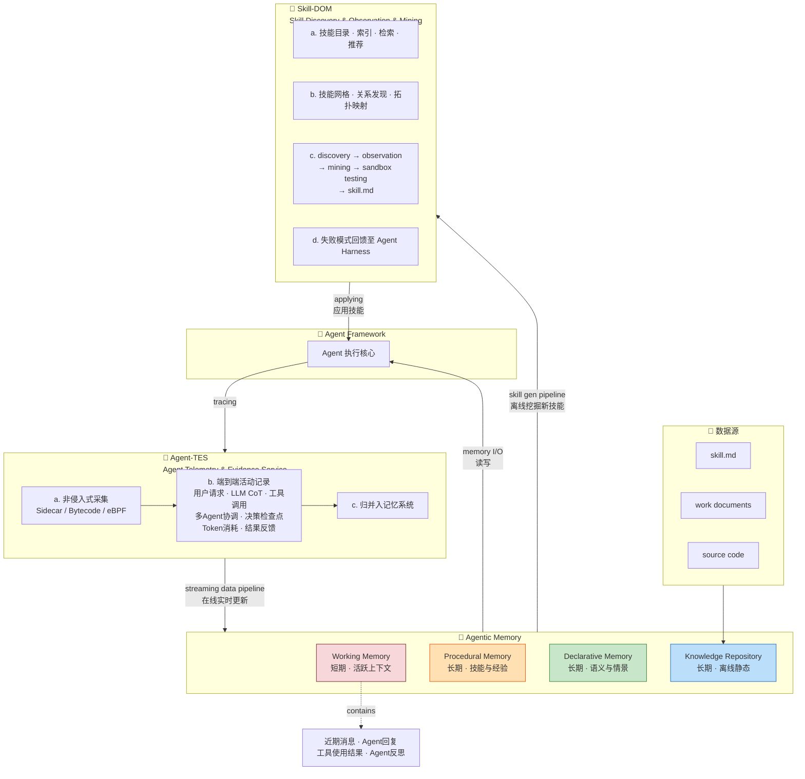
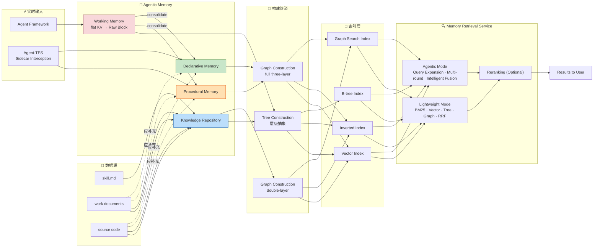
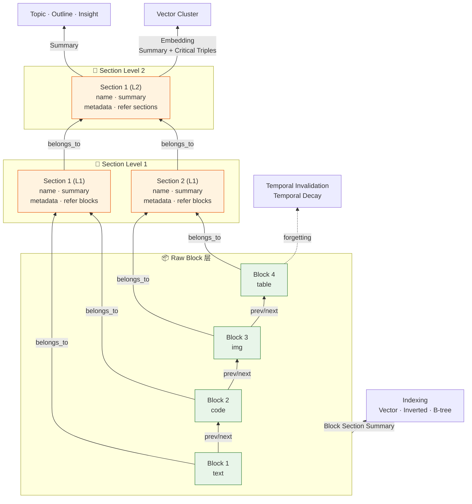
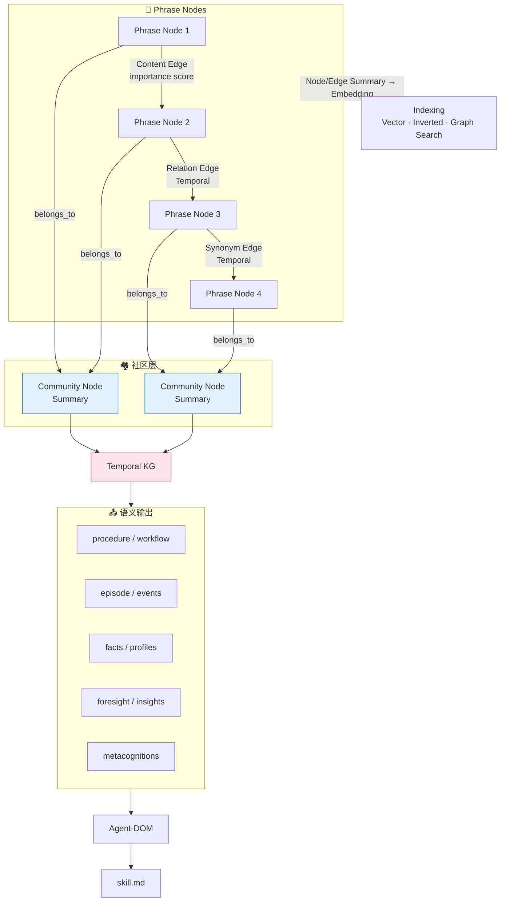

# Agentic Memory System (AMS) — 概要设计文档
原图：
![[版本C-初稿-WIP.png]]

图片文档中的高清架构图1：
![[Pasted image 20260325111515.png]]

图片文档中的高清架构图2：
![[Pasted image 20260325111351.png]]


# Agentic Memory System (AMS) — 完整概要设计文档

这是一份面向智能代理平台的**生产级代理记忆系统（Agentic Memory System, AMS）**架构概要设计文档。系统受认知科学启发，实现了四层混合记忆模型，工程上面向 Kubernetes 编排的高可用基础设施部署。本文档基于原始英文 HLD（High-Level Design）初稿的文本内容与架构图进行系统性梳理、解读与整合，输出中文概要设计。

---

## 📋 文档总览：模块清单与完成度

| **章节编号** | **模块名称** | **完成度** | **备注** |
|:---:|---|:---:|---|
| 1 | Executive Summary（执行摘要） | ✅ 较完整 | 含系统上下文图、架构总览、数据源映射规则 |
| 2 | Working Memory Architecture（工作记忆架构） | ✅ 较完整 | 含技术选型、数据模型、Session 提升管道 |
| 3 | Tree Construction Pipeline（树构建管道） | ❌ 仅标题 | 待扩写 |
| 4 | Tree Storage Architecture（树存储架构） | ❌ 仅标题 | 待扩写 |
| 5 | Graph Construction Pipeline（图构建管道） | ❌ 仅标题 | 待扩写 |
| 6 | Graph Storage Architecture（图存储架构） | ❌ 仅标题 | 待扩写 |
| 7 | Integration Points（集成点） | ❌ 仅标题 | 含 Tree-Graph 交互、WM→LTM 同步、统一查询 API |
| 8 | Operational Considerations（运维考量） | ❌ 仅标题 | 含监控、备份恢复、扩缩容、故障模式 |

---

## 1. 执行摘要（Executive Summary）

### 1.1 系统上下文图：认知闭环（The Cognitive Loop）

AMS 的核心哲学建立在一个受认知科学启发的**闭环反馈模型**之上，由三个核心组件围绕 **Agent Framework** 构成"飞轮效应"。

#### 🔺 三大核心组件

| **组件** | **认知隐喻** | **职责** |
|---|---|---|
| **Trace（追踪层）** | 感官输入 + 执行日志 | 捕获 Agent 推理链、工具调用、环境反馈的细粒度遥测数据 |
| **Memory（记忆层）** | 知识库 | 将瞬时 Trace 转化为结构化的长期洞察（通过 RAG 和知识图谱） |
| **Skill（技能层）** | 动作库 | 从成功的 Memory 模式中提炼出可复用的逻辑/工具使用配方 |

#### 🔄 飞轮闭环逻辑

```
Trace → Memory → Skill → Trace → ...（持续循环）
```

1. **Trace → Memory**：原始执行数据从 Trace 中被合成、索引并存入 Memory，从噪声中提炼经验
2. **Memory → Skill**：Memory 中反复成功的模式被抽象并"编译"为永久性 Skill，增强 Agent 的专业能力
3. **Skill → Trace**：Skill 的部署产生新的 Trace，被监控和评估，重启循环以实现持续优化

#### 🏗️ 架构图详解：系统上下文全景

从高清架构图中可以清晰看到，**Agent Framework** 处于中心位置（菱形），围绕它有三大外围子系统通过不同的数据通道形成闭环：

**① Agent-TES（Agent Telemetry & Evidence Service）— 遥测与证据服务**

Agent Framework 通过 `tracing` 将执行数据发送到 Agent-TES。这是**数据采集层**，负责非侵入式地捕获 Agent 执行的全部遥测数据：

| **能力** | **具体内容** |
|---|---|
| **a. 非侵入式采集** | Sidecar 模式、字节码插桩（Bytecode Instrumentation）、eBPF |
| **b. 端到端活动记录与证据摄入** | 用户请求/事件/上下文、多 Agent 编排与协调、LLM CoT 推理链/决策检查点、模型版本/Token 消耗/决策置信度、工具调用/Prompts/日志/证据、结果与反馈 |
| **c. 归并入记忆系统** | 通过 streaming data pipeline 实时更新 + 离线归并 |

> 💡 **关键设计洞察**：采用 **Sidecar 模式**非侵入式地接入 Langfuse 的遥测流，通过流式数据管道在执行展开时实时更新记忆层级。Trace 的采集是旁路的、低侵入的。

**② Skill-DOM（Skill Discovery & Observation & Mining）— 技能发现与挖掘**

Agentic Memory 通过 `skill gen pipeline` 将离线挖掘的新技能发送到 Skill-DOM，Skill-DOM 通过 `applying` 将技能应用回 Agent Framework：

- **a.** Skill catalog（技能目录）、indexing（索引）、retrieval（检索）、recommendation（推荐）
- **b.** Skill mesh（技能网格）、relationship discovery（关系发现）、topology mapping（拓扑映射）
- **c.** 完整的技能生成管线：`Skill discovery → observation → mining → sandbox testing → skill.md`
- **d.** 将识别出的失败模式回馈并集成到 Agent harness 中

**③ Agentic Memory — 记忆系统**

Agent Framework 通过 `memory I/O` 与 Agentic Memory 进行读写交互。Memory 内部包含四层结构（详见下节）。

**④ 两条关键数据流（红色标注）**

- **consolidate into memory / online update**：从 Agent-TES 通过 streaming data pipeline 实时更新到 Agentic Memory
- **abstract new skill / offline mining**：从 Agentic Memory 通过 skill gen pipeline 离线挖掘新技能到 Skill-DOM

**⑤ Working Memory 的内容说明**

架构图右侧标注了 Working Memory 的 `contains` 内容：近期消息（recent messages）、Agent 回复（agent replies）、工具使用结果（tool usage results）、以及来自当前交互的 Agent 反思（agent reflections），这些都会影响 LLM 的后续响应和行动。

---

### 1.2 架构总览：记忆分类体系与逻辑模型

#### 🧠 核心分类法（Long-term Memory）

AMS 的长期记忆采用了**认知科学经典分类法**：

```
Long-term Memory
├── Procedural Memory（程序性记忆）—— "How-to"
│   └── 技能、经验、自动化工作流
│
└── Declarative Memory（陈述性记忆）—— "What"
    ├── Semantic Memory（语义记忆）
    │   └── 客观事实、通用知识（如"法国的首都是巴黎"）
    │
    └── Episodic Memory（情景记忆）
        └── 主观经验、时间线事件（含动态实体关系演化）
```

此外还有一个**功能性扩展维度**：

- **Metacognitive Memory（元认知记忆）**：关于记忆本身的记忆，属于独立维度。例如 Agent 对自身知识边界的认知（"我知道我不知道什么"）、任务复杂度评估等。

#### 📊 四种记忆类型的技术规格对比

| **记忆类型** | **作用域** | **延迟 SLA** | **主存储引擎** |
|---|---|---|---|
| **Working Memory（工作记忆）** | 会话级，短暂 | < 50ms p99 | Redis Stack (RedisJSON + RediSearch) |
| **Procedural Memory（程序性记忆）** | 长期，技能与经验 | < 200ms p95 | Neo4j + Milvus + LanceDB |
| **Declarative Memory（陈述性记忆）** | 长期，事实（语义+情景） | < 200ms p95 | Neo4j + Milvus + LanceDB |
| **Knowledge Repository（知识库）** | 静态文档语料 | < 300ms p95 | （未明确，可能是向量数据库+全文检索） |

> 📌 文档提到未来可能采用 **Memory Lake 架构**：OSS + LanceDB Graph + Arrow/DataFusion 等。

#### 🏗️ 双重结构组织（Tree + Graph）

所有长期记忆类型都实现了**双重结构组织**，这是 AMS 架构的核心设计决策之一：

1. **Tree Construction（树构建）**：层级化的渐进式抽象 → 支持自顶向下的概念导航
2. **Graph Construction（图构建）**：语义关系映射 → 支持横向关联检索

这种双重结构模拟了人类认知记忆的两种访问模式：层级化的概念导航（"从总到分"）和关联式的语义跳转（"由此及彼"）。

#### 🏗️ 架构图详解：记忆逻辑模型（Memory Logic Model）

从高清架构图中可以看到，记忆逻辑模型是整个 AMS 信息密度最高的核心架构图，展示了从数据输入到记忆存储到检索输出的**完整数据流**。以下按五个层次拆解：

---

**层次一：数据输入与记忆类型映射**

架构图清晰展示了数据源到记忆类型的映射关系，分为两条主干路径：

**路径 A — 静态文档路径（Tree Construction）：**

```
skill.md        ──→ Knowledge Repository (长期/离线/静态) ──→ Tree Construction
work documents  ──→ Knowledge Repository (长期/离线/静态) ──→ Tree Construction
source code     ──→ Knowledge Repository (长期/离线/静态) ──→ Tree Construction
```

**路径 B — 实时交互路径（Graph Construction）：**

```
Agent Framework ── IO ──→ Working Memory (flat KV → Raw Block)
                                │
                                ├── consolidate / update memories online
                                ↓
Agent-TES ── Sidecar-based ──→ Procedural Memory + Declarative Memory ──→ Graph Construction (full three-layer)
     interception
```

**路径 C — Knowledge Repository 的 Graph 路径：**

```
work documents ──→ Knowledge Repository (底部) ──→ Graph Construction (double-layer, for multi-hop retrieval)
source code    ──→ Knowledge Repository (底部) ──→ Graph Construction (double-layer, for multi-hop retrieval)
```

> ⚠️ **架构图与文档文字的不一致**：Section 1.3 的 Data Source Mapping Rules 明确规定 Work Documents 应同时流向 Procedural + Declarative Memory（Tree + Graph 混合），但架构图中 **work documents / source code 没有直接指向 Procedural + Declarative Memory 的箭头**。这是一个需要在后续迭代中修正的遗漏（详见下文 1.3 节分析）。

**Graph Construction 的层级差异：**

| **来源** | **Graph 层级** | **用途** |
|---|---|---|
| Procedural + Declarative Memory | **full three-layer**（完整三层） | 完整的实体-关系-社区图构建 |
| Knowledge Repository | **double-layer**（双层） | 用于多跳检索（multi-hop retrieval） |

---

**层次二：Tree Construction 详细结构（图中上半部分，橙色虚线框）**

这是**层级化文档抽象**的核心管道，采用三级结构：

```
Raw Block 层（底层，绿色方块链）：
  Block 1 (text) → Block 2 (code) → Block 3 (img) → Block 4 (table) → ...
  每个 Block 包含：source type, block name, metadata, summary, triples, belonging sections
  Block 之间通过 Session/DocID 的 prev/next 链接

      ↑ belongs_to（属于）

Section 层 Level 1（中层，橙色方块）：
  Section 1 (L1) ← → Section 2 (L1)
  每个 Section 包含：section name, summary, metadata, refer blocks

      ↑ belongs_to（属于）

Section 层 Level 2（顶层，橙色方块）：
  Section 1 (L2)
  包含：section name, summary, metadata, refer sections
```

**右侧输出与索引：**

- **Summary** → Topic / Outline / Insight（主题/大纲/洞察）
- **Embedding**（Summary + Critical Triples）→ Vector Cluster（仅文档级别）
- **Block Section Summary** → Indexing → **Vector / Inverted / B-tree** 三种索引

**遗忘机制（右下角）：**

- **Temporal Invalidation**（时间失效）
- **Temporal Decay**（时间衰减）

---

**层次三：Graph Construction 详细结构（图中下半部分，蓝色/绿色区域）**

这是**关系型知识图谱**的核心管道：

**节点类型：**
- **Phrase Node**（短语节点）：图的基本单元

**边类型（四种）：**

| **边类型** | **属性** | **说明** |
|---|---|---|
| Content Edge | importance score | 内容关联边，带重要性评分 |
| Relation Edge | Temporal | 关系边，带时序属性 |
| Synonym Edge | Temporal | 同义边，带时序属性 |
| Belongs_to Edge | — | 归属边，连接节点到社区 |

**社区结构：**

```
Phrase Node ── belongs_to ──→ Community Node (含 Summary)
Community Node ──→ Temporal KG（时序知识图谱）
```

**右侧输出与索引：**
- **Node / Edge Summary** → Embedding → **Vector / Inverted / Graph Search** 索引

**最终语义输出（右下角）：**

| **输出类型** | **说明** |
|---|---|
| procedure (workflow) | 程序/工作流 |
| episode/events (timeline) | 情景/事件时间线 |
| facts/profiles | 事实/画像 |
| foresight/insights | 前瞻/洞察 |
| metacognitions | 元认知 |

这些输出最终流入 **Agent-DOM** → **skill.md**，完成从记忆到技能的闭环。

---

**层次四：Working Memory 的桥梁角色**

Working Memory 在架构中扮演**双重角色**：

1. **实时上下文持有者**：Agent Framework 通过 IO 直接读写，flat KV 结构输出 Raw Block 进入 Tree Construction
2. **长期记忆提升入口**：通过 consolidate / update memories online 通道将有价值的会话数据提升到 Procedural + Declarative Memory

---

**层次五：检索服务（图顶部）**

```
User Query
    ↓
Retrieval Mode Selection（检索模式选择）
    ├── Lightweight Mode（轻量模式）
    │     ├── BM25 Search (Full-text) — 全文检索
    │     ├── Vector Search — 向量检索
    │     ├── Tree Search — 树结构检索
    │     ├── Graph Search, PPR — 图检索 + 个性化 PageRank
    │     └── RRF Fusion — 倒数排名融合
    │
    └── Agentic Mode（智能体模式）
          ├── Query Expansion (LLM) — LLM 驱动的查询扩展
          ├── Multi-round Retrieval — 多轮检索
          └── Intelligent Fusion — 智能融合
    ↓
Reranking (Optional) — 可选的重排序
    ↓
Results to User
```

---

### 1.3 数据源映射规则（Data Source Mapping Rules）

这是一个**严格的、管道验证时强制执行**的映射规则表。违规会触发管道立即拒绝并返回描述性错误码。

| **数据源** | **目标记忆** | **允许的结构** | **设计理由** |
|---|---|---|---|
| **用户-Agent 交互** | 程序性 + 陈述性 | **仅 Graph** | 保留关系模式和对话流，作为可导航的图路径 |
| **Agent 执行追踪** | 程序性 + 陈述性 | **仅 Graph** | 建模执行轨迹和工具链为时序图路径，保持完整时空完整性 |
| **工作文档** | 程序性 + 陈述性 | **Tree + Graph（混合）** | 需要层级抽象用于主题归纳，AND 实体关系图用于文档关联（代码的调用图和依赖树） |
| **Skill Markdowns** | **仅程序性** | **仅 Tree** | 利用 Markdown 原生标题层级（H1→L1, H2→L2…）进行技能分解，最大深度 4 |

> ⚠️ **Working Memory 完全排除在此映射框架之外**（见第 2 章）。

#### 🔴 架构图与映射规则的不一致

经过对高清架构图的仔细分析，发现以下不一致：

| **路径** | **文档规则** | **架构图现状** | **状态** |
|---|---|---|---|
| 静态文档源 → KR → Tree Construction | ✅ 符合 | ✅ 已画 | 一致 |
| 实时交互/执行 → WM → consolidate → PM+DM → Graph (full three-layer) | ✅ 符合 | ✅ 已画 | 一致 |
| KR → Graph Construction (double-layer) | ✅ 符合 | ✅ 已画 | 一致 |
| **Work Documents / Source Code → 直接进入 PM+DM → Graph (full three-layer)** | ✅ 规则要求 | ❌ **缺失** | **不一致** |

**建议**：在架构图中补充 work documents / source code → Procedural + Declarative Memory 的直接数据流箭头，以与映射规则表保持一致。

---

## 2. 工作记忆架构（Working Memory Architecture）

### 2.1 设计决策：为什么不用 Tree/Graph？

工作记忆是**会话级的高速上下文存储**，用于活跃的 Agent 会话。它持有：
- 对话状态
- 进行中的任务状态
- 工具调用追踪
- 上下文窗口管理元数据

访问模式**绝大多数是点读/点写 + TTL 驱逐**，数据本质上是**短暂的**（会话生命周期通常 5 分钟到 2 小时）。因此采用**扁平键值模型 + 哈希查找**，专门为延迟和吞吐量优化。

### 2.2 技术选型：Redis Cluster 7.2+

#### Redis 模块矩阵

| **模块** | **关键特性** | **应用场景** |
|---|---|---|
| **RedisJSON** | 原生 JSON 数据类型，支持 JSONPath 路径查询 | 会话状态、任务状态、工具调用历史的结构化存储和字段级更新 |
| **RediSearch** | 全文搜索 + 向量相似度搜索 | 快速上下文关键词定位，消息模糊查询 |
| **RedisTimeSeries** | 时序数据压缩与聚合 | 工具调用延迟、Token 消耗等指标的时序记录 |
| **RedisBloom** | 布隆过滤器 | 大规模去重和存在性检测的内存优化 |

#### 基础设施规格

| **参数** | **规格** | **备注** |
|---|---|---|
| 引擎 | Redis 7.2 OSS Cluster | 6 节点集群（3 主 3 从） |
| 部署 | Kubernetes StatefulSet + 反亲和规则 | 每个主节点持有 ~5461 个哈希槽 |
| 实例类型 | r6g.2xlarge（64 GB RAM, 8 vCPU） | ARM 架构，成本优化；~80% 内存利用率目标 |
| 延迟 SLA | p50 < 10ms, p99 < 50ms | 网络 RTT 预算 < 2ms（同 AZ） |
| 吞吐量 SLA | 10K+ TPS/分片，30K+ TPS 聚合 | 启用管道批处理用于批量会话注水 |
| 驱逐策略 | volatile-ttl | 基于会话 TTL 过期 |
| 持久化 | AOF（everysec fsync） | RDB 快照每 15 分钟；数据丢失窗口 ~1s |
| 最大内存 | 48 GB/节点（64 GB 的 75%） | 预留碎片化和 OS 开销的余量 |

#### 水平扩展策略

- 基于哈希槽的分片（16384 槽跨 N 个主节点）提供**线性水平扩展**
- 通过 Kubernetes HPA 基于内存利用率（目标 70%）和连接数**自动扩缩容**
- 读副本服务读密集型工作负载（对话历史检索），使用 READONLY 标志
- 跨 AZ 复制实现高可用；通过 Redis Sentinel 集成实现自动故障转移（< 30s 检测）

### 2.3 数据模型

每个 Agent 会话表示为一组 Redis 数据结构：

| **Key 模式** | **类型** | **描述** |
|---|---|---|
| `session:{session_id}:state` | Hash | 核心会话状态：agent_id, user_id, created_at, last_active_at, status |
| `session:{session_id}:conv` | List（有上限） | 对话轮次，JSON 序列化消息；LTRIM 保留最近 50 轮 |
| `session:{session_id}:task` | Hash | 当前任务状态：task_id, step_index, tool_chain, partial_results |
| `session:{session_id}:tools` | Stream | 工具调用追踪日志；XADD + MAXLEN ~100 限制增长 |
| `session:{session_id}:ctx` | String (JSON) | 上下文窗口元数据：token 计数、截断游标、活跃记忆引用 |

#### TTL 策略

- 默认会话 TTL：**7200 秒（2 小时）**，从最后一次活动计算
- 每次写入时通过 **Lua 脚本原子性**更新 `last_active_at` 并重置 TTL
- 空闲会话（30 分钟无活动）被**软过期**：状态序列化到 Kafka topic（`ams.session.archive`）以便可能提升到长期记忆，然后删除键

### 2.4 会话提升管道（Session Promotion Pipeline）

当会话结束（显式终止或 TTL 过期）时，**提升评估器**决定是否将会话内容持久化到长期记忆：

| **条件** | **目标记忆** | **构建管道** |
|---|---|---|
| 对话数据含显著 Agent 推理（Agent 输出 > 500 tokens） | 陈述性记忆（情景子类型） | Graph Construction |
| 工具调用追踪导致任务成功完成 | 程序性记忆 | Graph Construction |

提升过程是**异步的**，由会话归档 Kafka 消费者处理提取和路由到相应的长期管道。

---

## 3–8. 待扩写模块概要

以下模块在原始文档中仅有标题，需要后续逐步扩写。基于架构图中已经展示的结构信息，可以提炼出各模块的设计方向：

| **章节** | **模块** | **核心设计方向（基于架构图推断）** |
|---|---|---|
| **3. Tree Construction Pipeline** | 树构建管道 | Raw Block 解析 → Section L1 归属 → Section L2 抽象 → Summary/Embedding 生成；支持 text/code/img/table 多种 Block 类型 |
| **4. Tree Storage Architecture** | 树存储架构 | Block 的 prev/next 链式存储、Section 的层级索引、Vector/Inverted/B-tree 三种索引的存储引擎选型 |
| **5. Graph Construction Pipeline** | 图构建管道 | Phrase Node 抽取 → 四种 Edge 构建（Content/Relation/Synonym/Belongs_to）→ Community 检测 → Temporal KG 生成 |
| **6. Graph Storage Architecture** | 图存储架构 | Neo4j 图模型设计、Milvus 向量索引、LanceDB 集成、Node/Edge Summary 的 Embedding 存储 |
| **7. Integration Points** | 集成点 | Tree↔Graph 的交叉引用、WM→LTM 的 consolidate 协议、统一查询 API（Lightweight + Agentic 双模式） |
| **8. Operational Considerations** | 运维考量 | 监控指标（延迟/吞吐/内存）、备份恢复策略、K8s 扩缩容、故障模式（Redis 宕机/Neo4j 分区/Kafka 积压）与缓解 |

---

## 📐 架构图 Mermaid 重绘

### 图一：系统上下文 — 认知闭环



### 图二：记忆逻辑模型 — 数据流总览



### 图三：Tree Construction 详细结构



### 图四：Graph Construction 详细结构



---

## 💡 综合评价

### 架构亮点

| **维度** | **评价** |
|---|---|
| **认知科学驱动** | ⭐⭐⭐⭐⭐ 四种记忆类型直接映射人类认知模型，概念清晰 |
| **双轨存储（Tree + Graph）** | ⭐⭐⭐⭐⭐ 层级抽象 + 关系网络的双轨设计非常优雅 |
| **飞轮闭环** | ⭐⭐⭐⭐⭐ Trace→Memory→Skill→Trace 的持续优化循环是核心竞争力 |
| **遗忘机制** | ⭐⭐⭐⭐ Temporal Invalidation / Temporal Decay 是很多记忆系统缺失的关键能力 |
| **检索分层** | ⭐⭐⭐⭐ Lightweight vs Agentic 双模式避免了"一刀切"的性能浪费 |
| **非侵入式采集** | ⭐⭐⭐⭐ Sidecar + eBPF + Bytecode 三种采集方式提供了灵活性 |

### 待深化的设计问题

| **问题** | **所属模块** | **建议** |
|---|---|---|
| Graph 的"full three-layer"具体指哪三层？ | §5 | 需明确：Phrase Node → Community Node → ? |
| Tree 的通用文档最大深度？ | §3 | Skill Markdown 限定深度 4，通用文档呢？ |
| Temporal Decay 的衰减函数？ | §3/§5 | 指数衰减？线性？基于访问频率的自适应？ |
| RRF Fusion 与 Intelligent Fusion 的区别？ | §7.3 | RRF 是确定性算法，Intelligent Fusion 是否涉及 LLM？ |
| Agent-DOM 的具体实现？ | §5/Skill-DOM | 独立服务还是 Skill-DOM 的子模块？ |
| 架构图与映射规则的不一致 | §1.3 | work documents/source code → PM+DM 的直接路径缺失 |
| Knowledge Repository 与 Declarative Memory 的边界？ | §1.2 | 静态文档 vs 动态事实的划分标准需更明确 |

---

## 🗺️ 后续迭代计划

| **优先级** | **模块** | **依赖关系** |
|:---:|---|---|
| **P0** | §3 Tree Construction Pipeline | 独立，可先行 |
| **P0** | §5 Graph Construction Pipeline | 独立，可先行 |
| **P1** | §4 Tree Storage Architecture | 依赖 §3 |
| **P1** | §6 Graph Storage Architecture | 依赖 §5 |
| **P2** | §7 Integration Points | 依赖 §3-§6 |
| **P3** | §8 Operational Considerations | 依赖全部 |

以上就是基于原始文档文本内容和三张高清架构图的完整概要设计整合。请告诉我你想先深入哪个模块的详细设计，我们继续推进。
